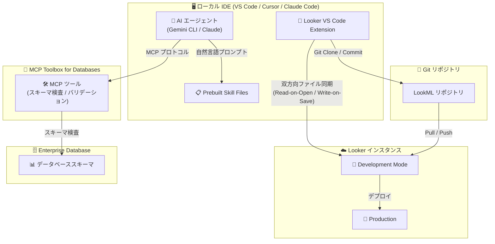

# Looker: VS Code Extension (Preview)

**リリース日**: 2026-04-20

**サービス**: Looker

**機能**: Looker extension for VS Code

**ステータス**: Preview

📊 [このアップデートのインフォグラフィックを見る](https://takech9203.github.io/google-cloud-news-summary/20260420-looker-vs-code-extension-preview.html)

## 概要

Looker VS Code Extension がプレビューとして公開された。この拡張機能により、LookML の開発をブラウザベースの Looker IDE だけでなく、Visual Studio Code、Claude Code、Cursor などのローカルデスクトップ IDE で行えるようになる。シンタックスハイライト、オートコンプリート、Looker インスタンスとのリアルタイムファイル同期、LookML バリデーションといった開発支援機能を提供する。

さらに、MCP Toolbox for Databases と組み合わせることで、AI アシスト開発 (いわゆる「Vibe Coding」) が可能になる。Gemini CLI や Claude などの AI エージェントを通じて、自然言語で LookML コードの生成・編集・バリデーションを行うワークフローが実現する。これにより、LookML 開発者は使い慣れたローカル IDE の豊富なエコシステム (Git 統合、拡張機能、カスタムキーバインドなど) を活用しながら、Looker のセマンティックレイヤーを効率的に開発できるようになる。

対象ユーザーは、LookML 開発を行うデータアナリスト、データエンジニア、BI 開発者である。特に、ローカル IDE での開発フローを好む開発者や、AI エージェントを活用した生産性向上を目指すチームにとって大きなメリットがある。

**アップデート前の課題**

- LookML 開発はブラウザベースの Looker IDE でのみ行う必要があり、ローカル IDE の豊富な機能 (拡張機能、カスタムキーバインド、ローカル Git ワークフローなど) を活用できなかった
- 外部 IDE (VSCode や Vim) で LookML を編集する場合、Looker インスタンスとのファイル同期が手動で必要であり、LookML バリデーションなしでプロダクションにデプロイされるリスクがあった
- AI エージェントを LookML 開発に活用するための標準的なワークフローや統合手段が存在しなかった

**アップデート後の改善**

- VS Code フレームワークベースのローカル IDE (VS Code、Claude Code、Cursor、Windsurf、Zed、Kiro、Codex) で LookML 開発が可能になった
- Looker インスタンスとの双方向リアルタイムファイル同期により、ローカルでの保存が即座にサーバーに反映される
- MCP Toolbox for Databases を通じて AI エージェントがデータベーススキーマを検査し、LookML コードを自然言語で生成・編集・バリデーションできるようになった

## アーキテクチャ図



Looker VS Code Extension は、ローカル IDE と Looker インスタンス間の双方向同期を管理し、AI エージェントは MCP Toolbox を通じてデータベーススキーマにアクセスしながら LookML コードを生成・編集する。

## サービスアップデートの詳細

### 主要機能

1. **シンタックスハイライトとオートコンプリート**
   - LookML ファイル (.lkml) に対するリッチなシンタックスハイライトを提供
   - コンテキストに応じたパラメータ値の自動補完により、コーディング効率を向上

2. **双方向リアルタイムファイル同期**
   - **Read-on-Open**: ファイルを開くと、Looker インスタンスの Development Mode から最新バージョンを自動取得
   - **Write-on-Save**: ファイルを保存すると、即座に Looker サーバーにプッシュされ、ブラウザベースの Looker IDE にも変更が反映
   - 同期コンフリクト検出機能により、ブラウザ IDE とローカル IDE の同時編集時にも安全に操作可能

3. **LookML バリデーション**
   - IDE のコマンドパレットから `Looker: Validate LookML` を実行し、LookML 構文エラーを検出
   - AI エージェントがバリデーション結果を活用して自動修正を提案

4. **AI アシスト開発 (Vibe Coding)**
   - MCP Toolbox for Databases を通じて AI エージェントがデータベーススキーマを直接検査
   - 自然言語プロンプトで LookML モデル、ビュー、Explore の生成が可能
   - Prebuilt Skill Files が AI エージェントにコーディング標準やプロジェクト固有の指示を提供

5. **ローカル Git ワークフロー統合**
   - 標準的な Git コマンドでブランチ管理、コミット、デプロイを実行
   - Git Clone でリモートリポジトリからローカルにプロジェクトを取得

## 技術仕様

### 対応 IDE

| IDE / ツール | サポート状況 |
|------|------|
| Visual Studio Code | 対応 |
| Claude Code | 対応 |
| Cursor | 対応 |
| Windsurf | 対応 |
| Zed | 対応 |
| Kiro | 対応 |
| Codex | 対応 |
| IntelliJ / Eclipse | 非対応 (VS Code フォークではないため) |

### 拡張機能の設定項目

| 設定項目 | 説明 | デフォルト |
|------|------|------|
| `looker.instanceURL` | Looker インスタンスのベース URL | - |
| `looker.oauthClientId` | Looker OAuth Client ID (OAuth 認証時に必要) | - |
| `looker.clientId` | Looker API Client ID (API Key 認証時に必要) | - |
| `looker.clientSecret` | Looker API Client Secret (API Key 認証時に必要) | - |
| `looker.projectId` | Looker Project ID | - |
| `looker.mcpServerUrl` | 外部 MCP サーバーの URL | - |
| `looker.askBeforeOverwritingRemote` | リモートファイル上書き前に確認を表示 | false |

### 前提条件

| 項目 | 要件 |
|------|------|
| Looker バージョン | 26.6 以降 |
| Looker 権限 | `develop` 権限が必要 |
| Git | ローカルマシンに Git がインストール済みであること |
| プロジェクト設定 | LookML プロジェクトが Git に設定済みであること |

## 設定方法

### 前提条件

1. Looker インスタンスがバージョン 26.6 以降であること
2. LookML プロジェクトが Git に設定済みであること
3. `develop` Looker 権限を持っていること
4. ローカルマシンに Git がインストール済みであること

### 手順

#### ステップ 1: 拡張機能のインストール

[Visual Studio Marketplace](https://marketplace.visualstudio.com/items?itemName=Google.vscode-looker-official) から Looker extension for VS Code をインストールする。

1. IDE (VS Code や Cursor) を開く
2. アクティビティバーの Extensions アイコンをクリック
3. 「Looker」で検索し、Looker extension for VS Code を見つけてインストール
4. インストール後、アクティビティバーに Looker アイコンが表示される

#### ステップ 2: OAuth 認証の設定 (推奨)

```json
// .vscode/settings.json
{
  "looker.instanceURL": "https://your-company.looker.com",
  "looker.oauthClientId": "YOUR_OAUTH_CLIENT_ID"
}
```

Looker 管理者が API Explorer を使用して OAuth クライアントを登録する必要がある。`redirect_uri` には `vscode://google.vscode-looker-official/oauth_callback` を設定する。

#### ステップ 3: サインインと LookML プロジェクトのクローン

1. コマンドパレットを開き、`Looker: Sign In (OAuth)` を実行
2. ブラウザで認証を完了
3. コマンドパレットで `Git: Clone` を選択し、LookML リポジトリの URL を入力
4. クローンしたフォルダを IDE で開く

#### ステップ 4: AI アシスト開発の設定 (任意)

MCP Toolbox for Databases を設定し、AI エージェントを接続する。

```json
// .vscode/settings.json に MCP サーバー URL を追加
{
  "looker.mcpServerUrl": "http://localhost:5000/mcp"
}
```

## メリット

### ビジネス面

- **LookML 開発の生産性向上**: 使い慣れたローカル IDE のエコシステム (拡張機能、スニペット、カスタムキーバインド) を活用でき、開発者の生産性が大幅に向上する
- **AI による開発の民主化**: 自然言語で LookML コードを生成できるため、LookML の学習コストが低下し、より多くのチームメンバーがデータモデリングに参加できるようになる
- **開発者の採用・定着**: 最新の IDE やツールチェーンをサポートすることで、開発者にとって魅力的な環境を提供できる

### 技術面

- **ローカル Git ワークフロー**: 標準的な Git コマンドでブランチ管理やコミットが可能になり、チーム開発の品質管理が向上する
- **リアルタイム同期**: 双方向のファイル同期により、ローカル編集がリアルタイムで Looker インスタンスに反映され、ブラウザ IDE との併用も安全に行える
- **MCP による拡張性**: Model Context Protocol を活用したオープンスタンダードにより、様々な AI エージェントやツールとの統合が容易になる

## デメリット・制約事項

### 制限事項

- Preview 段階であり、「Pre-GA Offerings Terms」が適用される。サポートが限定的となる場合がある
- VS Code フレームワークベースの IDE のみ対応。IntelliJ や Eclipse などの IDE は非対応
- ファイル同期は Git コミットとは独立して動作する。ローカル保存はサーバーに同期されるが、Git コミットは自動的には行われない

### 考慮すべき点

- OAuth クライアントの登録には Looker 管理者の作業が必要
- AI アシスト開発を利用するには、MCP Toolbox for Databases の別途セットアップが必要
- ブラウザベースの Looker IDE とローカル IDE で同時に同じファイルを編集した場合、コンフリクトが発生する可能性がある (`looker.askBeforeOverwritingRemote` 設定で制御可能)
- フィードバックや問題報告は `looker-agents-support-external@google.com` に送信する必要がある

## ユースケース

### ユースケース 1: AI を活用した LookML モデルの自動生成

**シナリオ**: 新しいデータソースが追加された際に、データベーススキーマから LookML ビューとモデルを素早く生成したい。

**実装例**:
```
プロンプト例 (AI エージェントへの入力):
「MCP ツールを使って ecommerce_db コネクションに接続し、users テーブルと orders テーブルの
スキーマを検査してください。users.view.lkml と orders.view.lkml の LookML を生成し、
プライマリキー、全カラムの標準ディメンション、レコード数カウントなどの基本メジャーを
含めてください。その後、ecommerce.model.lkml を生成し、orders を Explore として
users を user_id で JOIN してください。」
```

**効果**: 手動で LookML を記述する場合に比べて、初期モデルの作成時間を大幅に短縮できる。AI が生成したコードはバリデーションにより品質が担保される。

### ユースケース 2: 既存 LookML のリファクタリングとコーディング標準の統一

**シナリオ**: チーム内でコーディングスタイルが統一されておらず、既存の LookML ファイルを一括でリファクタリングしたい。

**実装例**:
```
プロンプト例 (AI エージェントへの入力):
「products.view.lkml ファイルをレビューしてください。number 型のディメンションで価格や
コストを表すものを見つけ、それぞれに対応する sum メジャーと average メジャーを生成して
ください。各新規メジャーに計算内容を説明する description を追加してください。
ワークスペースの Prebuilt Skill のスタイルに合わせてください。」
```

**効果**: コーディング標準の統一と、メジャー追加作業の自動化により、コードの品質と一貫性が向上する。

## 料金

Looker VS Code Extension 自体の追加料金に関する具体的な情報は公式ドキュメントで確認されていない。Looker (Google Cloud core) の料金体系に基づき、利用する Looker インスタンスのエディション (Standard / Enterprise / Embed) に応じた料金が適用される。

詳細は [Looker (Google Cloud core) pricing](https://cloud.google.com/looker/pricing) を参照。

## 関連サービス・機能

- **Looker (Google Cloud core)**: Looker VS Code Extension の接続先となる Looker インスタンス。バージョン 26.6 以降が必要
- **MCP Toolbox for Databases**: AI エージェントとデータベースを接続するオープンソースの MCP サーバー。AI アシスト開発のコア基盤
- **Gemini CLI**: Google Cloud のコマンドライン AI エージェント。Looker 拡張機能を通じて LookML の vibe coding が可能
- **Gemini in Looker**: ブラウザベースの Looker IDE 内での AI アシスト機能 (会話型アナリティクス、LookML 記述支援など)
- **Looker Continuous Integration (CI)**: 外部 IDE で開発された LookML の構文検証を自動化する機能 (Preview)

## 参考リンク

- 📊 [インフォグラフィック](https://takech9203.github.io/google-cloud-news-summary/20260420-looker-vs-code-extension-preview.html)
- [公式リリースノート](https://docs.cloud.google.com/release-notes#April_20_2026)
- [Looker extension for VS Code - Getting Started](https://docs.cloud.google.com/looker/docs/getting-started-vscode-extension)
- [AI-assisted development (vibe coding) with Looker](https://docs.cloud.google.com/looker/docs/ai-assisted-development-vscode)
- [Use Looker with MCP, Gemini CLI and other Agents](https://docs.cloud.google.com/looker/docs/connect-ide-to-looker-using-mcp-toolbox)
- [Managing LookML files and Git with the Looker VS Code extension](https://docs.cloud.google.com/looker/docs/manage-lookml-files-git-vscode)
- [Visual Studio Marketplace - Looker Extension](https://marketplace.visualstudio.com/items?itemName=Google.vscode-looker-official)
- [料金ページ](https://cloud.google.com/looker/pricing)

## まとめ

Looker VS Code Extension のプレビュー公開は、LookML 開発のワークフローを大きく変革するアップデートである。ローカル IDE での開発が可能になったことで、開発者は使い慣れた環境で効率的に作業でき、MCP Toolbox と AI エージェントの組み合わせによる「Vibe Coding」は LookML 開発の生産性を飛躍的に向上させる可能性を持つ。Looker を利用中の組織は、まず少人数のチームで Preview 機能を試し、AI アシスト開発ワークフローの構築を検討することを推奨する。

---

**タグ**: #Looker #LookML #VSCode #IDE #MCP #AI #VibeCoding #Preview #開発ツール #データモデリング
