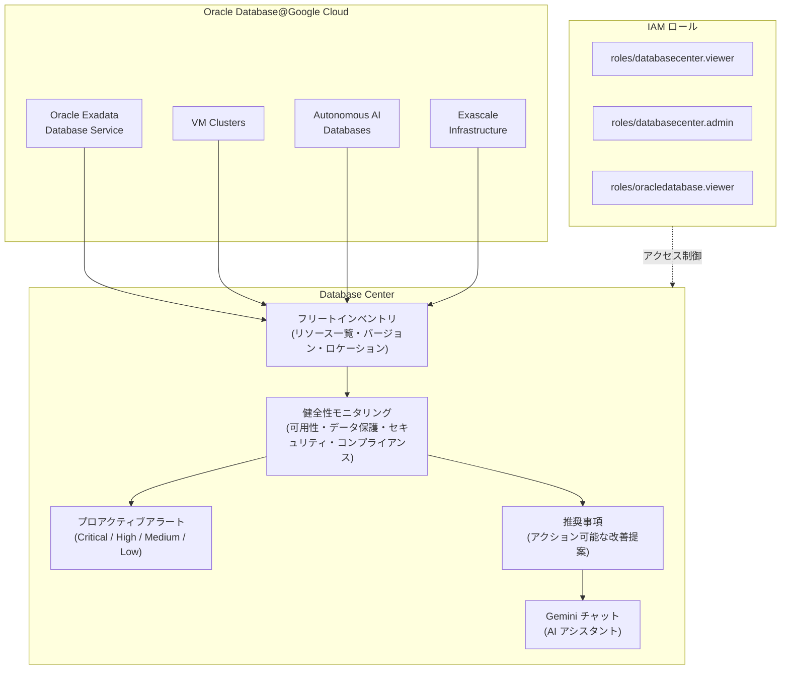

# Oracle Database@Google Cloud: Database Center との統合による統合モニタリング

**リリース日**: 2026-04-20

**サービス**: Oracle Database@Google Cloud

**機能**: Database Center 統合によるフリートワイドのインサイト、プロアクティブアラート、推奨事項の提供

**ステータス**: GA (一般提供)

[このアップデートのインフォグラフィックを見る](https://takech9203.github.io/google-cloud-news-summary/20260420-oracle-database-google-cloud-database-center.html)

## 概要

Oracle Database@Google Cloud が Database Center と統合され、Oracle Exadata、VM Clusters、Autonomous AI Databases を含む Oracle Database@Google Cloud リソースに対して、フリートワイドのインサイト、プロアクティブアラート、およびアクション可能な推奨事項が提供されるようになりました。この機能は一般提供 (GA) としてリリースされています。

Database Center は、Google Cloud が提供する AI 支援のダッシュボードで、データベースフリート全体を一元的に可視化するサービスです。今回の統合により、Oracle Database@Google Cloud のユーザーは、AlloyDB、Cloud SQL、Spanner などの他の Google Cloud データベースサービスと同じダッシュボードから Oracle データベースリソースの健全性を監視できるようになりました。2025 年 10 月に Preview として提供されていたインベントリ・メトリクス・アラートの監視機能が、健全性問題の監視を含む形で GA に昇格しました。

この機能は、Oracle Database@Google Cloud を本番環境で運用するデータベース管理者、プラットフォームエンジニア、SRE (Site Reliability Engineer) にとって、フリート全体の可視性とガバナンスを強化する重要なアップデートです。

**アップデート前の課題**

- Oracle Database@Google Cloud リソースの健全性監視は、個別のメトリクスやログを通じた個別確認が必要だった
- Google Cloud の他のデータベースサービスとは別のモニタリング手段が必要で、フリート全体の一元管理が困難だった
- Database Center での Oracle Database@Google Cloud のサポートは Preview 段階であり、健全性問題の監視は利用できなかった

**アップデート後の改善**

- Database Center を通じて Oracle Exadata、VM Clusters、Autonomous AI Databases のフリートワイドなインベントリ、メトリクス、アラート、健全性問題を一元的に監視可能になった
- Critical / High / Medium / Low の優先度に基づくプロアクティブな健全性アラートと推奨事項が提供されるようになった
- AlloyDB、Cloud SQL、Spanner などと同じダッシュボード上で Oracle データベースリソースを統合管理できるようになった

## アーキテクチャ図



Oracle Database@Google Cloud の各リソース (Exadata、VM Clusters、Autonomous AI Databases、Exascale) が Database Center に統合され、フリートインベントリ、健全性モニタリング、アラート、推奨事項が一元的に提供されます。アクセスには適切な IAM ロールの設定が必要です。

## サービスアップデートの詳細

### 主要機能

1. **フリートインベントリの可視化**
   - Oracle Exadata、VM Clusters、Autonomous AI Databases を含むすべてのリソースの一覧表示
   - プロダクトバージョン別のリソース数の確認
   - ラベルやタグによるインベントリのフィルタリング
   - ロケーション別のリソースグルーピング

2. **健全性問題の監視と推奨事項**
   - 可用性、データ保護、セキュリティ、業界コンプライアンスに関する健全性問題の検出
   - 優先度 (Critical / High / Medium / Low) に基づく問題のランク付け
   - アクション可能な改善推奨事項の提供
   - Security Command Center との連携によるセキュリティ問題の統合

3. **Gemini チャットによる AI アシスタント**
   - データベースフリートの健全性に関する質問への応答
   - Google Cloud プロジェクトに基づくカスタマイズされた推奨事項
   - 適切なポリシーの特定と実装の支援

## 技術仕様

### 必要な IAM ロール

| IAM ロール | 説明 |
|------|------|
| `roles/databasecenter.viewer` | Database Center のインサイトを閲覧するためのロール |
| `roles/databasecenter.admin` | Database Center の管理者ロール (viewer の権限を包含) |
| `roles/oracledatabase.viewer` | Oracle Database@Google Cloud リソースの詳細を閲覧するためのロール |

### 健全性問題の優先度レベル

| 優先度 | 説明 |
|--------|------|
| Critical | 即時のサービス障害または重大なセキュリティ脆弱性のリスクが高い。即座の対応が必要 |
| High | リスクは高いが Critical ほど深刻ではない。未解決の場合、ダウンタイム、パフォーマンス低下、データ損失につながる可能性 |
| Medium | 推奨されない構成やベストプラクティスからの逸脱。パフォーマンスや管理性の問題を防ぐための調査が必要 |
| Low | 有用だがリスクの低い情報項目 |

### 監視対象のリソースタイプ

| リソースタイプ | 説明 |
|----------------|------|
| Oracle Exadata Infrastructure | Exadata ハードウェアインフラストラクチャ |
| Exadata VM Clusters | Exadata 上の VM クラスタ |
| Autonomous AI Databases | Oracle Autonomous AI Database Service リソース |
| Exascale VM Clusters | Exascale Infrastructure 上の VM クラスタ |

## 設定方法

### 前提条件

1. Google Cloud 組織で Database Center がセットアップされていること ([セットアップガイド](https://docs.cloud.google.com/database-center/docs/set-up-database-center))
2. 適切な IAM ロールが付与されていること
3. Oracle Database@Google Cloud リソースが作成済みであること

### 手順

#### ステップ 1: Database Center のセットアップ確認

Google Cloud コンソールで Database Center にアクセスし、組織レベルでのセットアップが完了していることを確認します。詳細は [Database Center のセットアップ](https://docs.cloud.google.com/database-center/docs/set-up-database-center) を参照してください。

#### ステップ 2: IAM ロールの付与

```bash
# Database Center の閲覧権限を付与
gcloud organizations add-iam-policy-binding ORGANIZATION_ID \
  --member="user:USER_EMAIL" \
  --role="roles/databasecenter.viewer"

# Oracle Database@Google Cloud の閲覧権限を付与
gcloud organizations add-iam-policy-binding ORGANIZATION_ID \
  --member="user:USER_EMAIL" \
  --role="roles/oracledatabase.viewer"
```

組織レベルで権限を付与することで、すべてのプロジェクトの Oracle Database@Google Cloud リソースを Database Center で一元的に監視できます。フォルダレベルやプロジェクトレベルでの付与も可能です。

#### ステップ 3: Database Center でのリソース確認

Google Cloud コンソールで Database Center のインベントリページにアクセスし、Oracle Database@Google Cloud リソースが表示されていることを確認します。データの反映には通常数分かかりますが、最大 24 時間かかる場合があります。

## メリット

### ビジネス面

- **フリート全体の統合ガバナンス**: Oracle データベースを含むすべての Google Cloud データベースリソースを一つのダッシュボードで管理でき、ガバナンスコストを削減
- **プロアクティブなリスク管理**: 健全性問題を優先度別に自動検出し、問題が発生する前に対処可能。コンプライアンスリスクの早期特定にも貢献
- **運用効率の向上**: 個別のモニタリングツールを統合することで、データベース管理チームの運用負荷を軽減

### 技術面

- **一元的な可視性**: Oracle Exadata、VM Clusters、Autonomous AI Databases のインベントリ、メトリクス、アラートを Database Center で統合管理
- **AI 支援による分析**: Gemini チャットを通じて、データベースフリートの健全性に関する質問や推奨事項をリアルタイムに取得
- **セキュリティ強化**: Security Command Center との連携により、セキュリティベストプラクティスからの逸脱を自動検出

## デメリット・制約事項

### 制限事項

- Database Center のデータはリアルタイムで更新されない。通常は数分以内に更新されるが、最大 24 時間かかる場合がある
- 組織レベルでの Database Center セットアップが前提条件となるため、プロジェクト単位のみの利用には向かない
- 健全性問題の優先度は一般的な指標であり、リソースの環境 (本番、開発、テスト) やワークロードに応じて実際の優先度は異なる場合がある

### 考慮すべき点

- IAM ロールの設計において、Database Center のロールと Oracle Database@Google Cloud のロールの両方を適切に管理する必要がある
- Database Center は複数の Google Cloud データベースプロダクトの情報を集約するため、Oracle 固有の詳細情報については引き続き Oracle Cloud Infrastructure (OCI) コンソールの併用が必要な場合がある

## ユースケース

### ユースケース 1: マルチデータベースフリートの統合監視

**シナリオ**: 企業のプラットフォームチームが、AlloyDB、Cloud SQL、Oracle Database@Google Cloud を含む複数のデータベースエンジンを運用しており、フリート全体の健全性を一元的に把握したい。

**効果**: Database Center を通じて、すべてのデータベースエンジンのインベントリ、健全性問題、推奨事項を単一のダッシュボードで確認でき、個別のモニタリングツールを巡回する必要がなくなる。プラットフォームチームの運用効率が大幅に向上する。

### ユースケース 2: Oracle データベースのコンプライアンス管理

**シナリオ**: 金融機関が Oracle Exadata 上で基幹業務データベースを運用しており、業界コンプライアンス要件への適合状況を継続的に監視する必要がある。

**効果**: Database Center の健全性モニタリングにより、セキュリティベストプラクティスからの逸脱や業界コンプライアンスの問題を優先度付きで自動検出。Critical / High の問題に即座に対応でき、監査対応のエビデンスとしても活用できる。

### ユースケース 3: SRE チームによる可用性最適化

**シナリオ**: SRE チームが Oracle Autonomous AI Databases の可用性とデータ保護の状態を監視し、ダウンタイムリスクの高いリソースを特定したい。

**効果**: Database Center のプロアクティブアラートにより、可用性に最適化されていないデータベースや、バックアップが適切に構成されていないリソースを自動的に特定。Gemini チャットを活用して推奨される対処方法を即座に確認できる。

## 料金

Database Center 自体の利用に追加料金は発生しません。ただし、Oracle Database@Google Cloud のリソース利用料金は別途発生します。

Oracle Database@Google Cloud の料金体系は以下の 2 つのオファータイプから選択できます。

| オファータイプ | 概要 | 課金方法 |
|----------------|------|----------|
| Public (従量課金) | 標準のオンデマンド料金モデル。テストや変動するワークロードに適している | リソース消費量に基づく課金 (OCPU/時間、ストレージ/GB など) |
| Private (カスタム料金) | 長期的なデータベース要件向け。Oracle 営業チームとカスタム料金を交渉 | Google Cloud Marketplace を通じた一括課金 |

詳細な料金については [Oracle Database@Google Cloud の料金ページ](https://www.oracle.com/cloud/google/oracle-database-at-google-cloud/pricing/) を参照してください。

## 利用可能リージョン

Oracle Database@Google Cloud は、サービスタイプに応じて以下のリージョンで利用可能です。Database Center の統合監視機能は、Oracle Database@Google Cloud が利用可能なすべてのリージョンのリソースに対して適用されます。

| 地域 | リージョン | サービス |
|------|----------|----------|
| アジア太平洋 | asia-northeast1 (東京) | Exadata, Exascale, Base DB, Autonomous |
| アジア太平洋 | asia-northeast2 (大阪) | Exadata, Autonomous |
| アジア太平洋 | asia-south1 (ムンバイ) | Exadata, Autonomous |
| アジア太平洋 | asia-south2 (デリー) | Exadata, Autonomous |
| アジア太平洋 | australia-southeast1 (シドニー) | Exadata, Autonomous |
| アジア太平洋 | australia-southeast2 (メルボルン) | Exadata, Autonomous |
| 北米 | us-central1 (アイオワ) | Exadata, Exascale, Base DB, Autonomous |
| 北米 | us-east4 (バージニア北部) | Exadata, Exascale, Base DB, Autonomous |
| 北米 | us-west3 (ソルトレイクシティ) | Exadata, Exascale, Base DB, Autonomous |
| 北米 | northamerica-northeast1 (モントリオール) | Exadata, Exascale, Base DB, Autonomous |
| 北米 | northamerica-northeast2 (トロント) | Exadata, Autonomous |
| 南米 | southamerica-east1 (サンパウロ) | Exadata, Autonomous |
| ヨーロッパ | europe-west2 (ロンドン) | Exadata, Exascale, Base DB, Autonomous |
| ヨーロッパ | europe-west3 (フランクフルト) | Exadata, Exascale, Base DB, Autonomous |
| ヨーロッパ | europe-west8 (ミラノ) | Exadata, Autonomous |

最新のリージョン情報は [Regions and zones](https://docs.cloud.google.com/oracle/database/docs/regions-and-zones) を参照してください。

## 関連サービス・機能

- **[Database Center](https://docs.cloud.google.com/database-center/docs/overview)**: Google Cloud のデータベースフリート全体を一元管理する AI 支援ダッシュボード。AlloyDB、Cloud SQL、Spanner など複数のデータベースプロダクトをサポート
- **[Oracle Database@Google Cloud MCP サーバー](https://docs.cloud.google.com/oracle/database/docs/use-oracledatabase-mcp)**: LLM や AI アプリケーションから Oracle Database@Google Cloud リソースを操作できるリモート MCP サーバー (Preview)
- **[VPC Service Controls](https://docs.cloud.google.com/oracle/database/docs/configure-vpc-service-controls)**: Oracle Database@Google Cloud リソースへのアクセスをネットワークレベルで制御 (GA)
- **[Cloud Monitoring](https://docs.cloud.google.com/oracle/database/docs/monitoring-metrics)**: Oracle Database@Google Cloud のメトリクスとログを通じたリソースの監視・トラブルシューティング

## 参考リンク

- [このアップデートのインフォグラフィック](https://takech9203.github.io/google-cloud-news-summary/20260420-oracle-database-google-cloud-database-center.html)
- [公式リリースノート](https://cloud.google.com/release-notes#April_20_2026)
- [Database Center での Oracle Database@Google Cloud リソース監視ドキュメント](https://docs.cloud.google.com/oracle/database/docs/monitor-resource-health)
- [Database Center 概要](https://docs.cloud.google.com/database-center/docs/overview)
- [Oracle Database@Google Cloud 概要](https://docs.cloud.google.com/oracle/database/docs/overview)
- [Oracle Database@Google Cloud 料金ページ](https://www.oracle.com/cloud/google/oracle-database-at-google-cloud/pricing/)
- [Database Center セットアップガイド](https://docs.cloud.google.com/database-center/docs/set-up-database-center)

## まとめ

Oracle Database@Google Cloud と Database Center の GA 統合により、Oracle Exadata、VM Clusters、Autonomous AI Databases を含むデータベースフリート全体の健全性を Google Cloud の統一ダッシュボードで一元管理できるようになりました。プロアクティブなアラートと優先度付きの推奨事項により、問題の早期検出と迅速な対応が可能です。Oracle Database@Google Cloud を利用中の組織は、Database Center のセットアップと適切な IAM ロールの付与を行い、フリート全体の可視性を確保することを推奨します。

---

**タグ**: #OracleDatabaseGoogleCloud #DatabaseCenter #モニタリング #フリート管理 #Exadata #AutonomousDatabase #GA #健全性監視 #プロアクティブアラート
