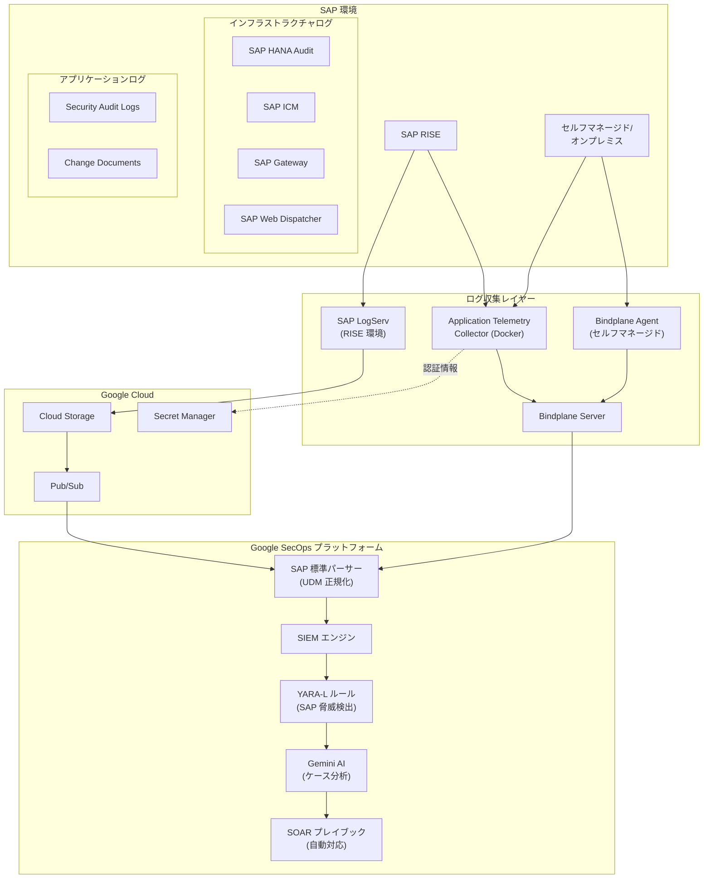

# SAP on Google Cloud: Google SecOps for SAP (Preview)

**リリース日**: 2026-04-20

**サービス**: SAP on Google Cloud

**機能**: Google SecOps for SAP

**ステータス**: Preview

[このアップデートのインフォグラフィックを見る](https://takech9203.github.io/google-cloud-news-summary/20260420-sap-google-secops-preview.html)

## 概要

Google SecOps for SAP が Preview として公開されました。このサービスは、SAP アプリケーションのビジネスクリティカルなテレメトリデータを Google Security Operations (SecOps) プラットフォームに統合し、SAP 環境全体にわたる統合的な可視性と AI を活用した脅威検出を提供するものです。

従来、SAP 環境のセキュリティ監視は SAP 固有の専門知識やカスタムログパイプラインの構築が必要であり、企業全体のセキュリティオペレーションと SAP 環境の間に可視性のギャップが存在していました。Google SecOps for SAP はこのギャップを解消し、セキュリティアナリストが SAP 固有の脅威を IT インフラストラクチャ全体と並行して検出、調査、対応できるようにします。

対象ユーザーは、SAP Basis 管理者、SecOps チームおよびアナリスト、CISO およびコンプライアンスチームです。SAP RISE 環境、セルフマネージドクラウド、オンプレミスのいずれの SAP 環境にも対応しています。

**アップデート前の課題**

- SAP 環境のセキュリティ監視には SAP 固有の深い技術的専門知識が必要であり、一般的な SecOps チームでは対応が困難だった
- SAP ログを企業全体のセキュリティ運用基盤に統合するにはカスタムログパイプラインの構築と維持が必要だった
- SAP 環境と IT インフラストラクチャ全体の間にセキュリティ可視性のギャップが存在し、SAP 固有の脅威が見落とされるリスクがあった
- SAP インフラストラクチャログとアプリケーションログの収集・正規化に多大な手動作業が必要だった

**アップデート後の改善**

- SAP 固有の標準パーサーにより、複雑な SAP ログが自動的に Unified Data Model (UDM) 形式に正規化され、カスタムパイプラインが不要になった
- Google セキュリティ専門家が設計した YARA-L ルールにより、SAP 固有の脅威がすぐに検出可能になった
- Gemini による AI 駆動の脅威ハンティング、ケースサマリー、自動対応ワークフローが利用可能になった
- SAP RISE、セルフマネージドクラウド、オンプレミスのすべての SAP 環境を統一的に監視できるようになった

## アーキテクチャ図



SAP 環境からのインフラストラクチャログとアプリケーションログが、SAP LogServ、Application Telemetry Collector、Bindplane を経由して Google SecOps プラットフォームに取り込まれ、UDM 正規化、YARA-L ルールによる脅威検出、Gemini AI による分析、SOAR プレイブックによる自動対応が行われる全体フローを示しています。

## サービスアップデートの詳細

### 主要機能

1. **統合的なログ収集と正規化**
   - インフラストラクチャログ (SAP HANA Audit、SAP ICM、SAP Gateway、SAP Web Dispatcher) とアプリケーションログ (Security Audit Logs、Change Documents) をすぐに利用可能な形で取り込み・パースする機能を提供
   - SAP 固有の標準パーサーが複雑な生ログを構造化された UDM 形式に自動変換

2. **SAP 固有の脅威検出 (YARA-L ルール)**
   - Google セキュリティ専門家が設計したオープンソースの YARA-L ルールコレクションを提供
   - 不正な設定変更、機密トランザクションの実行、権限昇格などの SAP 固有の攻撃ベクターを検出
   - データテーブルによるルールのカスタマイズ (管理者ユーザーの除外、本番システムの識別など) が可能

3. **Gemini AI による分析支援**
   - ケース作成時に脅威の概要、初期調査手順、修復の推奨アクションを自動生成
   - 自然言語プロンプトによる脅威ハンティングと対応ワークフローの自動化
   - SAP 固有の技術ログに不慣れなアナリストでも即座にコンテキストを把握可能

4. **SOAR プレイブックによる自動対応**
   - SAP 固有のアラートに対するカスタムトリガーの設定 (正規表現による SAP_ プレフィックスのマッチングなど)
   - SAP 環境からの追加データ取得や修復アクションの自動実行

5. **マルチ環境サポート**
   - SAP RISE: SAP LogServ による管理型インフラストラクチャログ収集
   - セルフマネージドクラウド: Bindplane Agent によるホストベースのログ収集
   - オンプレミス: 同様に Bindplane Agent とApplication Telemetry Collector による収集

## 技術仕様

### サポートされるログタイプ

| ログカテゴリ | SAP ログソース |
|------|------|
| インフラストラクチャ | SAP HANA Audit、SAP ICM、SAP Gateway、SAP Web Dispatcher |
| アプリケーション | SAP Security Audit Logs、SAP Change Documents |

### 収集コンポーネント

| コンポーネント | 役割 | 対象環境 |
|------|------|------|
| SAP LogServ | クラウドストレージへのインフラログ出力 | SAP RISE |
| Application Telemetry Collector | RFC プロトコルによるアプリケーションログ抽出 (Docker ベース) | 全環境 |
| Bindplane Agent | ホスト上のログファイル監視・転送 | セルフマネージド |
| Bindplane Server | 一元的なログ転送・正規化ポイント | 全環境 |

### SAP サービスユーザーに必要な権限

| 認可オブジェクト | フィールド | 値 |
|------|------|------|
| S_RFC | RFC_TYPE | FUNC (Function module) |
| S_RFC | RFC_NAME | RSAU_API_GET_LOG_DATA、RFC_READ_TABLE |
| S_RFC | ACTVT | 16 (Execute) |
| S_BCE_LOG | ACTVT | 03 (Display) |
| S_SEC_ALX | ACTVT | 03 (Display) |
| S_TABU_DIS | DICBERCLS | &NC& |
| S_TABU_NAM | TABLE | CDHDR、CDPOS |

## 設定方法

### 前提条件

1. Google SecOps インスタンスのプロビジョニングとオンボーディングが完了していること
2. Bindplane Server がインストール・構成済みであること
3. SAP システムでの Security Audit Logging が有効化されていること
4. ネットワークが Bindplane Server へのポート 4317 (gRPC) の受信トラフィックを許可していること

### 手順

#### ステップ 1: Google SecOps のオンボーディング

Google Cloud プロジェクトを制御レイヤーとして構成し、Google SecOps API を有効化します。ID プロバイダーの設定後、アクティベーションリンクからインスタンスをデプロイします。

詳細は [Google SecOps オンボーディングガイド](https://docs.cloud.google.com/chronicle/docs/onboard) を参照してください。

#### ステップ 2: Bindplane Server のセットアップ

```bash
# PostgreSQL のインストール (Bindplane の依存関係)
# Bindplane Server のインストールと構成
# Bindplane UI へのアクセス確認
```

Bindplane Server は全てのアプリケーションログとセルフマネージドインフラストラクチャログの一元的な取り込みポイントとして機能します。

#### ステップ 3: SAP サービスユーザーの作成

SAP システムでトランザクション SU01 を使用して専用のサービスユーザーを作成し、必要な認可オブジェクト (S_RFC、S_BCE_LOG、S_SEC_ALX、S_TABU_DIS、S_TABU_NAM) を含むカスタムロール (例: Z_GOOGLE_SECOPS_COLLECTOR) を割り当てます。

#### ステップ 4: ログ取り込みの構成

環境に応じたログ取り込みパスを構成します。

- **SAP RISE**: SAP アカウントチームに LogServ の有効化を依頼し、Google SecOps フィードの ID を提供
- **セルフマネージド**: Bindplane Agent を SAP ホストにインストールし、Application Telemetry Collector を構成

#### ステップ 5: YARA-L ルールのインポートと有効化

[Google SecOps Detection Rules リポジトリ](https://github.com/chronicle/detection-rules) から SAP 関連の YARA-L ルールをインポートし、Google SecOps の Detection > Rules and Detections > Rules Editor で有効化します。

## メリット

### ビジネス面

- **統合的なエンタープライズ可視性**: オンプレミス、クラウド、SAP RISE 環境を含む IT インフラストラクチャ全体の脅威を一元的に監視でき、セキュリティガバナンスが強化される
- **ビジネスクリティカルデータの保護**: 財務記録、顧客情報、知的財産などの機密データを、Google の包括的な脅威インテリジェンスと SAP 固有のセキュリティ検出を組み合わせて防御できる
- **規制コンプライアンスへの対応**: 統合された可視性により、企業全体のセキュリティポスチャの監視と規制遵守が容易になる

### 技術面

- **運用効率の向上**: 複雑なカスタムログパイプラインの構築・維持が不要になり、SAP 固有の標準パーサーが UDM 形式への正規化を自動処理する
- **AI 駆動のインサイト**: Gemini が脅威ハンティングの加速、複雑なケースの要約、自然言語プロンプトによる対応ワークフローの自動化を提供する
- **深い SAP 専門知識の不要化**: 既存の SecOps チームが標準的なセキュリティ用語とプレイブックを使用して SAP 脅威にニアリアルタイムで対応できる

## デメリット・制約事項

### 制限事項

- 現在 Preview ステータスであり、「Pre-GA Offerings Terms」の対象となる。限定的なサポートとなる可能性がある
- Pre-GA 機能のため、他の Pre-GA バージョンとの互換性が保証されない変更が加えられる可能性がある
- YARA-L ルールは GitHub のオープンソースリポジトリから手動でインポートする必要があり、一部のルールは関連データテーブルの事前設定が必要

### 考慮すべき点

- SAP RISE 環境では LogServ の有効化を SAP アカウントチームに依頼する必要があり、別途 SAP 側の料金が発生する可能性がある
- Application Telemetry Collector やBindplane Server のホストインフラストラクチャコストは利用者負担
- SNC (Secure Network Communication) による X.509 証明書認証の設定が推奨されており、初期セットアップに SAP Basis チームとの連携が必要
- SAP システムの Security Audit Logging が有効化されていない場合、事前に SM19 または RSAU_CONFIG で設定が必要

## ユースケース

### ユースケース 1: SAP 環境における不正アクセスの検出と対応

**シナリオ**: 大規模製造企業で SAP ERP を使用しており、財務データや顧客情報を管理している。内部不正や外部攻撃による不正な権限昇格やデータ持ち出しをリアルタイムで検出したい。

**効果**: YARA-L ルールが SAP の機密トランザクション実行や不正な設定変更を自動検出し、Gemini AI がケースサマリーと対応手順を自動生成することで、SAP の専門知識がなくても SecOps チームが迅速に対応できる。

### ユースケース 2: SAP RISE 環境のセキュリティ統合

**シナリオ**: SAP RISE に移行した企業で、SAP マネージド環境のセキュリティログを既存の Google SecOps ベースのセキュリティ運用に統合したい。

**効果**: SAP LogServ による自動的なインフラストラクチャログ収集と、Application Telemetry Collector によるアプリケーションログ抽出を組み合わせることで、SAP RISE 環境を含めたエンタープライズ全体の統合的なセキュリティ監視が実現できる。

### ユースケース 3: 規制コンプライアンス対応の効率化

**シナリオ**: 金融機関で SAP システムの監査ログを規制要件に基づいて収集・分析する必要があり、現在は手動でのログ収集と分析に多大な工数がかかっている。

**効果**: SAP Security Audit Logs と Change Documents が自動的に Google SecOps に取り込まれ、UDM 形式に正規化されることで、統一的な検索・分析が可能になり、コンプライアンス監査の工数を大幅に削減できる。

## 料金

Google SecOps for SAP の料金は複数のコンポーネントで構成されます。

| コンポーネント | 料金体系 |
|--------|-----------------|
| Google SecOps | パッケージベース、取り込み量に基づく課金。[料金ガイド](https://cloud.google.com/security/products/security-operations#pricing) を参照 |
| Bindplane (Google Edition) | Google SecOps 顧客には追加費用なし (ホストインフラコストは利用者負担) |
| Application Telemetry Collector | Google が Docker イメージを無償提供 (ホストインフラコストは利用者負担) |
| Cloud Storage | SAP LogServ のログ保存および ATC の依存関係用。[料金ページ](https://docs.cloud.google.com/storage/pricing) を参照 |
| Pub/Sub | SAP RISE 環境でのニアリアルタイム取り込みに必要。[料金ページ](https://docs.cloud.google.com/pubsub/pricing) を参照 |
| Secret Manager | SAP サービスユーザー認証情報の安全な保存。[料金ページ](https://docs.cloud.google.com/secret-manager/pricing) を参照 |
| SAP RISE (LogServ) | SAP アカウント担当に確認が必要 |

## 関連サービス・機能

- **[Google Security Operations (SecOps)](https://docs.cloud.google.com/chronicle/docs/secops/secops-overview)**: Google SecOps for SAP の基盤となる SIEM/SOAR プラットフォーム。すべての SAP ログの最終的な集約先
- **[Gemini in Google SecOps](https://docs.cloud.google.com/chronicle/docs/secops/gemini-chronicle)**: AI 駆動のケース分析、脅威ハンティング、対応ワークフロー自動化を提供
- **[Bindplane (Google Edition)](https://bindplane.com/google)**: SAP ログの高性能な取り込みパイプラインとして機能するログ管理プラットフォーム
- **[SAP on Google Cloud](https://cloud.google.com/solutions/sap)**: Google Cloud 上での SAP ワークロード実行に関する包括的なソリューション
- **[Cloud Storage](https://cloud.google.com/storage)**: SAP LogServ からのログ保存と Application Telemetry Collector の依存関係ホスティングに使用
- **[Pub/Sub](https://cloud.google.com/pubsub)**: SAP RISE 環境でのニアリアルタイム取り込み通知メカニズムに使用
- **[Secret Manager](https://cloud.google.com/secret-manager)**: SAP サービスユーザー認証情報の安全な管理に使用

## 参考リンク

- [インフォグラフィック](https://takech9203.github.io/google-cloud-news-summary/20260420-sap-google-secops-preview.html)
- [公式リリースノート](https://docs.cloud.google.com/release-notes#April_20_2026)
- [Google SecOps for SAP 概要ドキュメント](https://docs.cloud.google.com/sap/docs/secops/overview)
- [ログ取り込みの計画](https://docs.cloud.google.com/sap/docs/secops/plan-log-ingestion)
- [環境準備ガイド](https://docs.cloud.google.com/sap/docs/secops/prepare-environment-ingestion)
- [SAP RISE ログ取り込みセットアップ](https://docs.cloud.google.com/sap/docs/secops/ingest-sap-rise-logs)
- [セルフマネージド SAP ログ取り込みセットアップ](https://docs.cloud.google.com/sap/docs/secops/ingest-self-managed-sap-logs)
- [SAP 脅威の検出と対応](https://docs.cloud.google.com/sap/docs/secops/detect-sap-threats)
- [YARA-L ルールリポジトリ (GitHub)](https://github.com/chronicle/detection-rules)
- [Google SecOps 料金](https://cloud.google.com/security/products/security-operations#pricing)

## まとめ

Google SecOps for SAP の Preview リリースは、SAP 環境のセキュリティ監視における大きな転換点です。これまで SAP の深い専門知識とカスタムパイプラインが必要だった SAP セキュリティ監視が、Google SecOps プラットフォームの標準的なワークフローに統合され、Gemini AI による分析支援も活用できるようになります。SAP ワークロードを運用している企業は、Preview 段階からこの機能を評価し、SAP RISE またはセルフマネージド環境でのログ取り込みパスの検討を開始することを推奨します。

---

**タグ**: SAP on Google Cloud, Google SecOps, Security Operations, SIEM, SOAR, SAP RISE, YARA-L, Gemini AI, Preview, セキュリティ, 脅威検出, ログ取り込み, Bindplane, UDM
