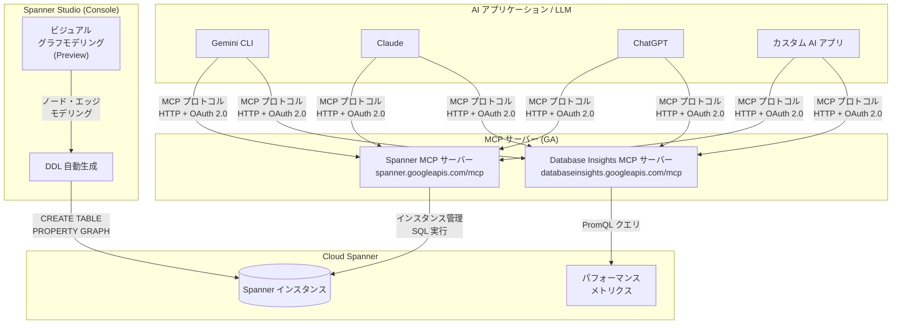

# Spanner: MCP サーバー GA / Database Insights MCP GA / Studio グラフスキーマビジュアルモデリング

**リリース日**: 2026-04-20

**サービス**: Cloud Spanner

**機能**: Spanner リモート MCP サーバー GA、Database Insights MCP サーバー GA、Spanner Studio グラフスキーマビジュアルモデリング Preview

**ステータス**: Feature (GA / Preview)

[このアップデートのインフォグラフィックを見る](https://takech9203.github.io/google-cloud-news-summary/20260420-spanner-mcp-server-studio-graph-schema.html)

## 概要

Cloud Spanner に関する 3 つの機能アップデートが発表された。第一に、Spanner リモート MCP (Model Context Protocol) サーバーが一般提供 (GA) となり、LLM や AI アプリケーション、AI 対応開発プラットフォームから Spanner インスタンスを直接操作できるようになった。第二に、Database Insights リモート MCP サーバーも GA となり、Spanner のパフォーマンスやシステムメトリクスを AI アプリケーションから分析できるようになった。第三に、Spanner Studio でグラフスキーマをビジュアルに作成・管理できる機能が Preview として提供開始された。

Spanner MCP サーバーは、MCP プロトコルを通じて Spanner のインスタンス管理、データベース操作、SQL クエリ実行をAI アプリケーションから標準化された方法で行えるようにするものである。Gemini CLI、Claude、ChatGPT などの主要な AI プラットフォームとの接続がサポートされている。Database Insights MCP サーバーは、PromQL クエリを通じたシステムメトリクスの取得を可能にし、AI を活用したデータベース運用の高度化を支援する。

Spanner Studio のグラフスキーマビジュアルモデリングは、DDL 文を手動で記述する代わりに、直感的なインターフェースでノードとエッジをマッピングしてグラフを設計できる機能である。Spanner Graph のスキーマベストプラクティスが自動的に適用されるため、最適化されたスキーマを効率的に構築できる。

**アップデート前の課題**

- Spanner をAI アプリケーションから操作するには、独自の API 統合やローカル MCP サーバーのセットアップが必要だった
- AI エージェントがデータベースのパフォーマンスメトリクスを取得するための標準化されたインターフェースがなかった
- Spanner Graph のスキーマ作成には DDL 文の手動記述が必要で、グラフの全体像を把握しながら設計することが困難だった
- グラフスキーマのベストプラクティス (エッジトラバーサルの最適化など) を手動で適用する必要があった

**アップデート後の改善**

- Google が管理するリモート MCP サーバー (`https://spanner.googleapis.com/mcp`) を通じて、AI アプリケーションから直接 Spanner を操作できるようになった
- Database Insights MCP サーバー (`https://databaseinsights.googleapis.com/mcp`) により、AI アプリケーションから Spanner のパフォーマンス分析が可能になった
- Spanner Studio のビジュアルモデリングにより、DDL を手書きせずにグラフスキーマを設計・生成できるようになった
- ビジュアルモデリングで作成したスキーマには、エッジトラバーサル最適化のための外部キー制約やリバースエッジインデックスが自動生成されるようになった

## アーキテクチャ図



AI アプリケーションは MCP プロトコルを通じて Spanner MCP サーバーおよび Database Insights MCP サーバーと通信し、データベース操作やパフォーマンス分析を行う。Spanner Studio のビジュアルモデリングは、グラフ設計から DDL を自動生成してデータベースに適用する。

## サービスアップデートの詳細

### 主要機能

1. **Spanner リモート MCP サーバー (GA)**
   - MCP プロトコルに準拠したリモートサーバーで、HTTP エンドポイント (`https://spanner.googleapis.com/mcp`) を提供
   - Spanner API を有効化するだけで自動的に利用可能になる
   - OAuth 2.0 による認証・認可をサポートし、IAM によるきめ細かなアクセス制御が可能
   - Gemini CLI、Claude.ai、ChatGPT、カスタム AI アプリケーションとの接続をサポート
   - 14 種類の MCP ツールを提供 (インスタンス管理、データベース操作、SQL 実行、スキーマ更新など)

2. **Database Insights リモート MCP サーバー (GA)**
   - エンドポイント: `https://databaseinsights.googleapis.com/mcp`
   - `get_system_metrics` ツールで PromQL クエリを使用してシステムメトリクスを取得可能
   - CPU 使用率、オペレーション数、スループット、ストレージ使用量などのメトリクスを AI アプリケーションから分析可能
   - Spanner だけでなく、Cloud SQL、AlloyDB、Bigtable など他のデータベースサービスでも同じインターフェースで利用可能

3. **Spanner Studio グラフスキーマビジュアルモデリング (Preview)**
   - Spanner Studio 上で直感的なインターフェースを使ってグラフスキーマを作成・管理
   - ゼロからの設計、既存テーブルからのマッピング、またはそのハイブリッドアプローチに対応
   - ノードとエッジの追加、プロパティの定義、ラベルの設定をビジュアルに操作可能
   - `CREATE TABLE`、`CREATE OR REPLACE PROPERTY GRAPH`、外部キー制約、リバースエッジインデックスなどの DDL を自動生成
   - Spanner Enterprise エディションおよび Enterprise Plus エディションで利用可能

## 技術仕様

### Spanner MCP サーバーのツール一覧

| ツール名 | 説明 |
|---------|------|
| `get_instance` | Spanner インスタンスの情報を取得 |
| `list_instances` | プロジェクト内のインスタンスを一覧表示 |
| `create_instance` | Spanner インスタンスを作成 |
| `update_instance` | Spanner インスタンスを更新 |
| `list_configs` | インスタンス構成を一覧表示 |
| `get_config` | 特定のインスタンス構成の情報を取得 |
| `create_database` | データベースを作成 |
| `list_databases` | データベースを一覧表示 |
| `get_database_ddl` | データベーススキーマを取得 |
| `create_session` | SQL 実行用のセッションを作成 |
| `execute_sql` | SQL 文 (DQL/DML) を実行 |
| `execute_sql_readonly` | 読み取り専用トランザクションで SQL を実行 |
| `commit` | トランザクションをコミット |
| `update_database_schema` | データベーススキーマを更新 (DDL) |
| `get_operation` | 長時間実行オペレーションの状態を取得 |

### Database Insights MCP サーバーのツール一覧

| ツール名 | 説明 |
|---------|------|
| `get_system_metrics` | PromQL クエリで Spanner のシステムメトリクスを取得 |

### 必要な IAM ロール

| 用途 | 必要なロール |
|------|------------|
| MCP ツールの呼び出し | `roles/mcp.toolUser` (MCP Tool User) |
| OAuth クライアント ID の作成 | `roles/oauthconfig.editor` (OAuth Config Editor) |
| Spanner MCP ツールの使用 | `roles/spanner.admin` (Cloud Spanner Admin) |

### OAuth スコープ

| スコープ URI | 説明 |
|-------------|------|
| `https://www.googleapis.com/auth/spanner.admin` | Spanner インスタンスとデータベースの管理 |
| `https://www.googleapis.com/auth/spanner.data` | Spanner データベース内のデータの表示と管理 |

## 設定方法

### 前提条件

1. Google Cloud プロジェクトで Spanner API が有効化されていること (新規プロジェクトでは自動有効化)
2. 必要な IAM ロール (`roles/mcp.toolUser`、`roles/spanner.admin`) が付与されていること
3. OAuth 2.0 の認証情報が設定されていること

### 手順

#### ステップ 1: Gemini CLI での設定

```bash
# 拡張機能ファイルを作成
mkdir -p ~/.gemini/extensions/spanner
cat > ~/.gemini/extensions/spanner/gemini-extension.json << 'EOF'
{
  "name": "spanner",
  "version": "1.0.0",
  "mcpServers": {
    "Spanner MCP Server": {
      "httpUrl": "https://spanner.googleapis.com/mcp",
      "authProviderType": "google_credentials",
      "oauth": {
        "scopes": ["https://www.googleapis.com/auth/cloud-platform"]
      },
      "timeout": 30000,
      "headers": {
        "x-goog-user-project": "YOUR_PROJECT_ID"
      }
    }
  }
}
EOF
```

Gemini CLI を起動し、`/mcp` コマンドで接続を確認する。

#### ステップ 2: Claude.ai での設定

Claude Enterprise、Pro、Max、または Team プランで、カスタムコネクタを設定する。

1. Google Cloud Console で OAuth 2.0 クライアント ID を作成 (リダイレクト URI: `https://claude.ai/api/mcp/auth_callback`)
2. Claude.ai の Settings > Connectors で「Add custom connector」をクリック
3. Server name、Remote MCP server URL (`https://spanner.googleapis.com/mcp`)、OAuth クライアント ID/シークレットを入力

#### ステップ 3: MCP ツールの動作確認

```bash
# ツール一覧の取得 (認証不要)
curl --location 'https://spanner.googleapis.com/mcp' \
  --header 'content-type: application/json' \
  --header 'accept: application/json, text/event-stream' \
  --data '{
    "method": "tools/list",
    "jsonrpc": "2.0",
    "id": 1
  }'
```

#### ステップ 4: Spanner Studio でグラフスキーマをビジュアルに作成

1. Google Cloud Console で Spanner Studio を開く
2. ホームページの「Create graph」をクリック
3. ノードを追加 (新規作成または既存テーブルからマッピング)
4. エッジを追加してノード間の関係を定義
5. 「Generate DDL」ボタンで DDL を生成し、内容をレビュー
6. DDL を実行してデータベースに反映

## メリット

### ビジネス面

- **AI 統合の加速**: 標準化された MCP プロトコルにより、AI アプリケーションから Spanner を直接操作できるため、AI 駆動のデータベース管理ワークフローを迅速に構築できる
- **運用コストの削減**: AI エージェントがパフォーマンスメトリクスを自動分析し、問題の検出と診断を効率化できる
- **グラフデータベース導入の障壁低下**: ビジュアルモデリングにより DDL の専門知識がなくてもグラフスキーマを設計でき、Spanner Graph の採用が容易になる

### 技術面

- **標準プロトコル対応**: MCP という業界標準プロトコルに対応したことで、特定の AI プラットフォームに依存しない柔軟な統合が可能
- **セキュアなアクセス制御**: OAuth 2.0 と IAM を組み合わせた認証・認可により、エージェントごとにきめ細かなアクセス制御を実現
- **自動最適化**: ビジュアルモデリングで作成したスキーマにはエッジトラバーサル最適化 (外部キー制約、リバースエッジインデックス) が自動適用される
- **オブザーバビリティ**: MCP サーバー経由のクエリにはリクエストタグ (`mcp_execute_sql` など) が自動付与され、トラブルシューティングに活用できる

## デメリット・制約事項

### 制限事項

- Spanner MCP サーバーは API キーによる認証をサポートしていない (OAuth 2.0 が必須)
- グラフスキーマビジュアルモデリングは Preview 段階であり、「Pre-GA Offerings Terms」が適用される
- ビジュアルモデリングは Spanner Enterprise エディションおよび Enterprise Plus エディションでのみ利用可能 (Standard エディションでは利用不可)

### ビジュアルモデリングの制約

- 安全性のため `DROP TABLE` や `DROP COLUMN` の DDL は生成されない (ノードやエッジの削除は PROPERTY GRAPH 定義の更新のみ)
- 一部のスキーマオブジェクト、列データ型、修飾子は自動生成の対象外
- 作業中の下書き保存機能は未対応 (ページを閉じると進捗が失われる)
- スキーマレスデータには対応していない
- ビューおよび名前付きスキーマテーブルをデータソースとして選択できない
- 既存テーブルからマッピングしたエッジには、外部キー制約やリバースエッジインデックスが自動生成されない

## ユースケース

### ユースケース 1: AI エージェントによるデータベース管理の自動化

**シナリオ**: 開発チームが AI エージェントを使って Spanner データベースのスキーマ確認、データクエリ、パフォーマンス分析を自動化する。

**実装例**:
```json
{
  "mcpServers": {
    "Spanner MCP Server": {
      "httpUrl": "https://spanner.googleapis.com/mcp",
      "authProviderType": "google_credentials",
      "oauth": {
        "scopes": ["https://www.googleapis.com/auth/cloud-platform"]
      },
      "headers": {
        "x-goog-user-project": "my-project-id"
      }
    },
    "Database Insights MCP Server": {
      "httpUrl": "https://databaseinsights.googleapis.com/mcp",
      "authProviderType": "google_credentials",
      "oauth": {
        "scopes": ["https://www.googleapis.com/auth/cloud-platform"]
      },
      "headers": {
        "x-goog-user-project": "my-project-id"
      }
    }
  }
}
```

**効果**: AI エージェントが自然言語での指示に基づいてデータベースの状態確認、クエリ実行、パフォーマンス問題の診断を一貫して実行でき、DBA の負荷を大幅に軽減できる。

### ユースケース 2: グラフデータベースの迅速なプロトタイピング

**シナリオ**: ソーシャルネットワーク分析や不正検知のために、Spanner Graph を使ったグラフデータベースを新規に設計する必要がある。ビジュアルモデリングを使い、ユーザーノード、アカウントノード、トランザクションエッジを直感的に定義してプロトタイプを作成する。

**効果**: DDL の専門知識がなくても、ドラッグ&ドロップ操作でグラフスキーマを設計でき、ベストプラクティスが自動適用されるため、最適化されたスキーマをすばやく構築してプロトタイピングを加速できる。

## 料金

Spanner MCP サーバーおよび Database Insights MCP サーバーの利用自体に追加料金は発生しない。料金は通常の Spanner リソース使用量 (コンピュート、ストレージ) に基づく。

Spanner Graph のビジュアルモデリング機能は Spanner Enterprise エディション以上で利用可能であり、エディションごとの料金体系が適用される。

詳細な料金については [Spanner 料金ページ](https://cloud.google.com/spanner/pricing) を参照。

## 関連サービス・機能

- **Google Cloud MCP サーバー**: Spanner 以外にも Cloud SQL、AlloyDB、Bigtable、Firestore など複数の Google Cloud サービスが MCP サーバーを提供しており、統一されたインターフェースで AI アプリケーションから操作可能
- **Cloud Monitoring**: Database Insights MCP サーバーは内部的に Cloud Monitoring のメトリクスを PromQL 経由で取得しており、既存のモニタリング基盤と連携
- **Spanner Query Insights**: MCP サーバーの `get_system_metrics` と補完的に使用でき、クエリパフォーマンスの詳細分析が可能 (Query Insights は追加料金なし)
- **Model Armor**: Google Cloud MCP サーバーでは、オプションで Model Armor によるプロンプトおよびレスポンスのセキュリティ保護が利用可能
- **Spanner Graph**: ビジュアルモデリングは Spanner Graph のスキーマ管理機能を拡張するもので、GQL によるクエリ、クエリ結果の可視化などの既存機能と組み合わせて利用する

## 参考リンク

- [インフォグラフィック](https://takech9203.github.io/google-cloud-news-summary/20260420-spanner-mcp-server-studio-graph-schema.html)
- [公式リリースノート](https://docs.cloud.google.com/release-notes#April_20_2026)
- [Spanner リモート MCP サーバーの使用](https://docs.cloud.google.com/spanner/docs/use-spanner-mcp)
- [Spanner MCP ツールリファレンス](https://docs.cloud.google.com/spanner/docs/reference/mcp/spanner/mcp)
- [Database Insights MCP ツールリファレンス](https://docs.cloud.google.com/spanner/docs/reference/mcp/databaseinsights/mcp)
- [Spanner Graph スキーマのビジュアル管理](https://docs.cloud.google.com/spanner/docs/graph/create-update-drop-schema-visually)
- [Spanner エディション概要](https://docs.cloud.google.com/spanner/docs/editions-overview)
- [Google Cloud MCP サーバー概要](https://docs.cloud.google.com/mcp/overview)
- [MCP 認証ガイド](https://docs.cloud.google.com/mcp/authenticate-mcp)
- [Spanner 料金](https://cloud.google.com/spanner/pricing)

## まとめ

今回のアップデートにより、Cloud Spanner は AI エコシステムとの統合を大幅に強化した。Spanner MCP サーバーと Database Insights MCP サーバーの GA は、AI アプリケーションやエージェントからデータベースを操作・分析するための標準化されたインターフェースを提供し、AI 駆動のデータベース管理ワークフローの構築を加速する。また、Spanner Studio のグラフスキーマビジュアルモデリング (Preview) は、Spanner Graph の採用障壁を下げ、グラフデータベースの設計と管理を大幅に簡素化する。Spanner を AI アプリケーションと連携させている、またはグラフデータベースの導入を検討しているチームは、これらの新機能を積極的に評価することを推奨する。

---

**タグ**: #CloudSpanner #MCP #ModelContextProtocol #DatabaseInsights #SpannerGraph #VisualModeling #SpannerStudio #AI #LLM #GA #Preview
