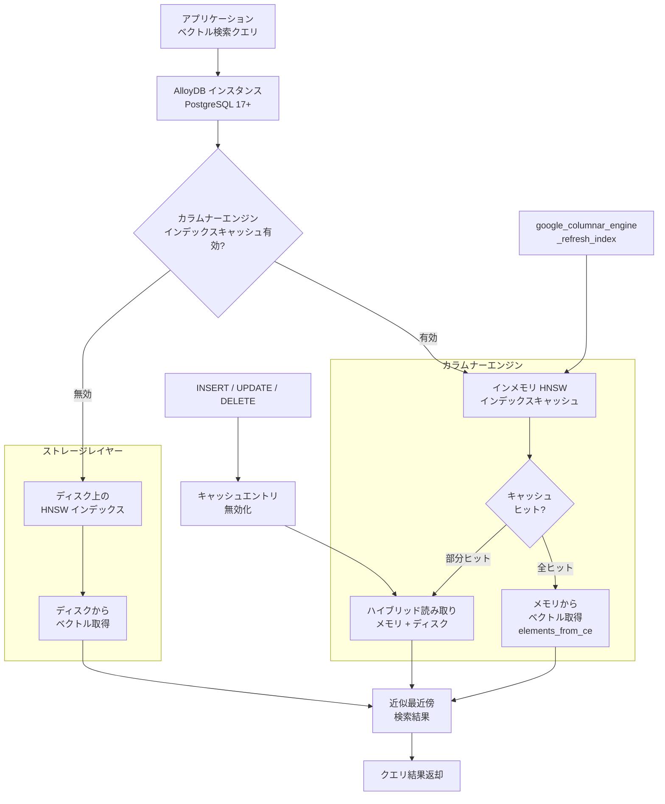

# AlloyDB for PostgreSQL: Columnar Engine による HNSW インデックスのベクトル検索高速化 (Preview)

**リリース日**: 2026-04-21

**サービス**: AlloyDB for PostgreSQL

**機能**: Columnar Engine HNSW Index Acceleration for Vector Search

**ステータス**: Preview

[このアップデートのインフォグラフィックを見る](https://takech9203.github.io/google-cloud-news-summary/20260421-alloydb-columnar-engine-hnsw-vector-search.html)

## 概要

AlloyDB for PostgreSQL のカラムナーエンジンが、HNSW (Hierarchical Navigable Small World) インデックスの読み取り最適化されたインメモリキャッシュとして機能するようになりました。これにより、ベクトル検索ワークロードにおいて処理可能な秒間クエリ数 (QPS) が大幅に向上し、標準 PostgreSQL と比較して最大 4 倍高速なベクトル検索クエリを実現します。本機能は Preview として提供されています。

カラムナーエンジンは、AlloyDB が提供するインメモリの列指向データストアであり、従来は分析クエリの高速化やテーブルデータのキャッシュに使用されていました。今回のアップデートにより、HNSW ベクトルインデックスもカラムナーエンジンにキャッシュできるようになり、ディスクからの読み取りを排除してメモリ上で直接クエリを処理することが可能になります。これは、RAG (Retrieval-Augmented Generation)、セマンティック検索、レコメンデーションエンジンなど、高い QPS を要求する AI アプリケーションを運用するユーザーにとって重要な機能強化です。

なお、HNSW インデックスのカラムナーエンジン対応には PostgreSQL 17 以降が必要です。既に ScaNN インデックスではカラムナーエンジンによる高速化が利用可能でしたが、HNSW への対応により、pgvector ベースの標準的なベクトルインデックスを使用しているユーザーにも同様のパフォーマンス向上の恩恵が提供されます。

**アップデート前の課題**

- HNSW インデックスを使用したベクトル検索では、インデックスデータがディスクから読み取られるため、大量の同時クエリ処理時にI/Oボトルネックが発生していた
- カラムナーエンジンによるベクトルインデックスの高速化は ScaNN インデックスのみに対応しており、pgvector 標準の HNSW インデックスでは利用できなかった
- 高い QPS を実現するためには、インスタンスのスケールアップやリードレプリカの追加が必要で、コスト増につながっていた

**アップデート後の改善**

- HNSW インデックスをカラムナーエンジンのインメモリキャッシュに格納し、ディスクI/Oを排除することで QPS が大幅に向上した
- 標準 PostgreSQL と比較して最大 4 倍高速なベクトル検索クエリを実現
- データ更新時にはハイブリッドアプローチ (キャッシュ + ディスク) で精度とパフォーマンスを両立し、キャッシュのリフレッシュまでの間もクエリの正確性が維持される
- `EXPLAIN (ANALYZE, COLUMNAR_ENGINE)` によるキャッシュ利用状況の可視化が可能

## アーキテクチャ図



この図は、カラムナーエンジンによる HNSW ベクトル検索の処理フローを示しています。カラムナーエンジンが有効な場合、HNSW インデックスはインメモリキャッシュから直接読み取られます。データ変更によりキャッシュが無効化された場合は、有効なキャッシュエントリはメモリから、変更されたデータはディスクから読み取るハイブリッドアプローチが使用されます。

## サービスアップデートの詳細

### 主要機能

1. **HNSW インデックスのインメモリキャッシュ**
   - カラムナーエンジンが HNSW インデックスの読み取り最適化されたインメモリ表現を保持
   - ディスクI/Oを排除し、ベクトル検索の QPS を大幅に向上
   - `google_columnar_engine_add_index()` SQL 関数でインデックスをキャッシュに追加

2. **ハイブリッドキャッシュアプローチ**
   - INSERT、UPDATE、DELETE によるデータ変更時、キャッシュエントリが自動的に無効化される
   - 有効なキャッシュエントリはメモリから、変更されたデータはディスクから読み取る
   - キャッシュリフレッシュまでの間もクエリの正確性が維持される

3. **EXPLAIN によるキャッシュ利用状況の可視化**
   - `EXPLAIN (ANALYZE, COLUMNAR_ENGINE)` で `elements_from_ce` と `elements_from_disk` の比率を確認可能
   - キャッシュのヒット率やパフォーマンスのモニタリングに利用

4. **キャッシュライフサイクル管理**
   - `google_columnar_engine_refresh_index()` による手動リフレッシュ
   - `google_columnar_engine_verify()` によるインデックスステータス確認
   - `google_columnar_engine_drop_index()` によるキャッシュからのインデックス削除
   - `g_columnar_indexes` ビューでアクティブなインデックスを一覧表示

## 技術仕様

### 動作要件と制約

| 項目 | 詳細 |
|------|------|
| 対応 PostgreSQL バージョン | PostgreSQL 17 以降 (HNSW の場合) |
| ScaNN のバージョン制約 | なし (全バージョンで利用可能) |
| 必要なデータベースフラグ | `google_columnar_engine.enabled=on`、`google_columnar_engine.enable_index_caching=on` |
| デフォルトメモリ割り当て | インスタンスメモリの 30% (最大 50% 推奨、70% まで設定可) |
| メモリ使用量 (リフレッシュ時) | インデックスサイズの最大 2 倍を一時的に消費 |
| ステータス | Preview |

### HNSW と ScaNN の比較

| 項目 | HNSW | ScaNN |
|------|------|-------|
| 適用場面 | 高次元データ、メモリ内に収まるデータ | 低次元データ、メモリを超える大規模データ |
| スケール | 1,000 万 - 2,000 万ベクトル | 100 億ベクトルまで |
| カラムナーエンジン高速化 | 最大 4 倍高速 (標準 PostgreSQL 比) | 最大 6 倍高速 |
| PostgreSQL バージョン要件 | 17 以降 | 制限なし |

### データベースフラグの設定

```bash
gcloud alloydb instances update INSTANCE_ID \
  --database-flags google_columnar_engine.enabled=on,google_columnar_engine.enable_index_caching=on \
  --region=REGION \
  --cluster=CLUSTER_ID \
  --project=PROJECT_ID
```

## 設定方法

### 前提条件

1. AlloyDB for PostgreSQL クラスターが PostgreSQL 17 以降で動作していること
2. HNSW インデックスが作成済みであること
3. カラムナーエンジンの有効化に十分なインスタンスメモリが確保されていること

### 手順

#### ステップ 1: カラムナーエンジンとインデックスキャッシュの有効化

```bash
gcloud alloydb instances update my-instance \
  --database-flags google_columnar_engine.enabled=on,google_columnar_engine.enable_index_caching=on \
  --region=us-central1 \
  --cluster=my-cluster \
  --project=my-project
```

`google_columnar_engine.enabled` でカラムナーエンジン本体を有効化し、`google_columnar_engine.enable_index_caching` でインデックスキャッシュ機能を有効化します。フラグ設定後、インスタンスが自動的に再起動されます。

#### ステップ 2: HNSW インデックスの作成 (未作成の場合)

```sql
-- pgvector 拡張機能の有効化
CREATE EXTENSION IF NOT EXISTS vector;

-- HNSW インデックスの作成
CREATE INDEX hnsw_idx ON documents
USING hnsw (embedding vector_cosine_ops)
WITH (m = 16, ef_construction = 64);
```

ベクトルカラムに対して HNSW インデックスを作成します。`m` パラメータはグラフの接続数、`ef_construction` はインデックス構築時の探索範囲を制御します。

#### ステップ 3: インデックスをカラムナーエンジンに追加

```sql
SELECT google_columnar_engine_add_index('hnsw_idx');
```

既存の HNSW インデックスをカラムナーエンジンのキャッシュに追加します。インデックスのサイズによっては長時間の処理になる場合があるため、psql クライアントセッションから実行することが推奨されます。

#### ステップ 4: キャッシュ利用状況の確認

```sql
EXPLAIN (ANALYZE, COLUMNAR_ENGINE)
SELECT * FROM documents
ORDER BY embedding <=> '[0.1, 0.2, 0.3, 0.4, 0.5]'::vector
LIMIT 5;
```

実行計画に `Columnar Engine HNSW Info: (index found=true elements_from_ce=385 elements_from_disk=0)` のように表示されれば、カラムナーエンジンによる高速化が有効であることが確認できます。`elements_from_ce` がメモリから取得された要素数、`elements_from_disk` がディスクから取得された要素数を示します。

#### ステップ 5: キャッシュの管理 (必要に応じて)

```sql
-- キャッシュの手動リフレッシュ
SELECT google_columnar_engine_refresh_index('hnsw_idx');

-- インデックスステータスの確認
SELECT google_columnar_engine_verify('hnsw_idx');

-- アクティブなキャッシュインデックスの一覧
SELECT * FROM g_columnar_indexes;

-- キャッシュからインデックスを削除
SELECT google_columnar_engine_drop_index('hnsw_idx');
```

大量のデータ変更を行った後は、手動リフレッシュを実行してキャッシュを最新の状態に更新することが推奨されます。

## メリット

### ビジネス面

- **AI アプリケーションのスケーラビリティ向上**: ベクトル検索の QPS 向上により、RAG やセマンティック検索を利用する AI アプリケーションのユーザー数増加に対応しやすくなる
- **インフラコストの最適化**: 同等の QPS を達成するために必要なインスタンス数やスケールを削減でき、結果としてコスト効率が向上する
- **運用のシンプル化**: 専用のベクトルデータベースを別途管理する必要がなく、AlloyDB 一つでトランザクション処理とベクトル検索の両方を高性能に処理できる

### 技術面

- **ディスクI/O排除**: HNSW インデックスをインメモリで処理することにより、ディスクアクセスによるレイテンシーを大幅に削減
- **ハイブリッドキャッシュ**: データ更新時もキャッシュと ディスクのハイブリッド読み取りにより、精度を維持しながらパフォーマンスの低下を最小限に抑制
- **可観測性**: EXPLAIN コマンドによるキャッシュヒット率の可視化で、パフォーマンスチューニングが容易
- **pgvector 互換**: 標準の pgvector HNSW インデックスをそのまま利用でき、アプリケーション側のコード変更が不要

## デメリット・制約事項

### 制限事項

- HNSW インデックスのカラムナーエンジン対応は PostgreSQL 17 以降のクラスターでのみ利用可能
- Preview 段階のため、本番環境での利用にはリスク評価が必要。SLA の対象外となる可能性がある
- HNSW インデックスのリフレッシュ時に、インデックスサイズの最大 2 倍のメモリを一時的に消費する

### 考慮すべき点

- カラムナーエンジンのメモリ割り当てを増やすと、他のデータベース処理に利用可能なメモリが減少するため、ワークロード全体のバランスを考慮する必要がある
- 大量の INSERT / UPDATE / DELETE が頻繁に発生するワークロードでは、キャッシュの無効化によりディスクからの読み取りが増加し、一時的にパフォーマンスが低下する可能性がある
- インデックスをカラムナーエンジンに追加する操作は長時間かかる場合があり、AlloyDB Studio ではタイムアウトする可能性があるため psql クライアントからの実行が推奨される
- デフォルトのメモリ割り当て (30%) ではインデックスサイズに対して不足する場合があり、`google_columnar_engine.memory_size_in_mb` フラグでの調整が必要になることがある

## ユースケース

### ユースケース 1: RAG アプリケーションの高速化

**シナリオ**: 社内ナレッジベースに対して RAG (Retrieval-Augmented Generation) を実装しており、多数のユーザーが同時にセマンティック検索を実行するケース。ピーク時の QPS が高く、レイテンシー要件が厳しい。

**実装例**:
```sql
-- カラムナーエンジンの有効化後、既存の HNSW インデックスをキャッシュに追加
SELECT google_columnar_engine_add_index('knowledge_base_embedding_idx');

-- RAG のコンテキスト検索クエリ
SELECT doc_id, content, 
       embedding <=> $1::vector AS distance
FROM knowledge_base
ORDER BY embedding <=> $1::vector
LIMIT 10;
```

**効果**: インメモリキャッシュにより QPS が向上し、同時接続ユーザー数の増加に対応可能になる。LLM への入力コンテキストの取得レイテンシーが低減し、エンドユーザーの体感速度が改善される。

### ユースケース 2: リアルタイムレコメンデーションエンジン

**シナリオ**: EC サイトで商品の特徴ベクトルを使用したリアルタイムレコメンデーションを提供しているケース。商品ページの表示ごとにベクトル検索が実行され、低レイテンシーが求められる。

**実装例**:
```sql
-- 商品の類似検索 (カラムナーエンジンで自動的に高速化)
SELECT product_id, product_name, category,
       embedding <=> $1::vector AS similarity
FROM products
ORDER BY embedding <=> $1::vector
LIMIT 20;
```

**効果**: ディスクI/Oのボトルネックが解消され、商品ページの読み込み時間が短縮される。スケールアップなしでトラフィックの増加に対応でき、インフラコストの削減につながる。

### ユースケース 3: マルチモーダル検索プラットフォーム

**シナリオ**: 画像、テキスト、音声などの複数モダリティのエンベディングを AlloyDB に格納し、横断的な類似検索を提供するプラットフォーム。高次元ベクトル (768 次元以上) の HNSW インデックスを使用している。

**効果**: HNSW は高次元データに適しており、カラムナーエンジンによるインメモリ化で高次元ベクトルの検索パフォーマンスが大幅に向上する。ScaNN への移行なしに既存の HNSW インデックスのパフォーマンスを改善できる。

## 料金

カラムナーエンジンの HNSW インデックスキャッシュ機能自体に追加料金は発生しません。ただし、カラムナーエンジンはインスタンスのメモリを使用するため、十分なメモリを持つインスタンスタイプを選択する必要があります。

AlloyDB の料金は消費ベースのモデルで、以下の要素で構成されます。

| 項目 | 料金 (us-central1 の例) |
|------|------------------------|
| vCPU | $0.06608 / vCPU / 時間 |
| メモリ | $0.0112 / GB / 時間 |
| ストレージ | 使用量に基づく従量課金 |

### Committed Use Discounts (CUD)

| コミットメント期間 | 割引率 |
|-------------------|--------|
| 1 年 | 25% |
| 3 年 | 52% |

カラムナーエンジンのメモリ要件を満たすためにインスタンスのメモリを増やす場合、インスタンス料金が増加します。パフォーマンス向上と追加コストのバランスを検討してください。詳細は [AlloyDB for PostgreSQL の料金ページ](https://cloud.google.com/alloydb/pricing) をご確認ください。

## 利用可能リージョン

AlloyDB for PostgreSQL が利用可能なすべてのリージョンで本機能を使用できます。ただし、PostgreSQL 17 以降のクラスターが必要です。AlloyDB の利用可能リージョンについては [AlloyDB locations](https://cloud.google.com/alloydb/docs/locations) をご参照ください。

## 関連サービス・機能

- **AlloyDB Columnar Engine**: カラムナーエンジンの基盤機能。分析クエリの高速化やテーブルデータのインメモリキャッシュにも使用される
- **AlloyDB ScaNN Index**: Google 独自の Scalable Nearest Neighbors インデックス。大規模データセット向けでカラムナーエンジンによる高速化が既に利用可能
- **AlloyDB AI**: AlloyDB の AI/ML 統合機能群。エンベディング生成、ベクトル検索、モデル呼び出しを統合
- **pgvector 拡張機能**: PostgreSQL のベクトルデータ型と類似検索をサポートするオープンソース拡張。AlloyDB は pgvector と完全互換
- **Vertex AI**: エンベディング生成やモデルホスティングを提供する Google Cloud の AI プラットフォーム。AlloyDB AI と統合してエンベディング生成が可能

## 参考リンク

- [インフォグラフィック](https://takech9203.github.io/google-cloud-news-summary/20260421-alloydb-columnar-engine-hnsw-vector-search.html)
- [公式リリースノート](https://cloud.google.com/release-notes#April_21_2026)
- [カラムナーエンジンによるベクトル検索高速化ドキュメント](https://cloud.google.com/alloydb/docs/ai/accelerate-with-ce)
- [HNSW インデックスの作成](https://cloud.google.com/alloydb/docs/ai/create-hnsw-index)
- [ベクトル検索戦略の選択](https://cloud.google.com/alloydb/docs/ai/choose-index-strategy)
- [カラムナーエンジンの設定](https://cloud.google.com/alloydb/docs/columnar-engine/configure)
- [料金ページ](https://cloud.google.com/alloydb/pricing)

## まとめ

AlloyDB のカラムナーエンジンによる HNSW インデックス高速化は、pgvector ベースのベクトル検索を使用しているユーザーにとって、アプリケーションコードを変更することなく QPS を大幅に向上できる重要なアップデートです。特に RAG やセマンティック検索など高い QPS を要求する AI ワークロードを運用している場合、PostgreSQL 17 への移行とカラムナーエンジンの有効化を検討することを推奨します。Preview 段階のため、まずは開発・テスト環境で性能評価を行い、GA 後の本番導入を計画するのが望ましいアプローチです。

---

**タグ**: #AlloyDB #PostgreSQL #VectorSearch #HNSW #ColumnarEngine #pgvector #AI #RAG #セマンティック検索 #Preview #パフォーマンス最適化
