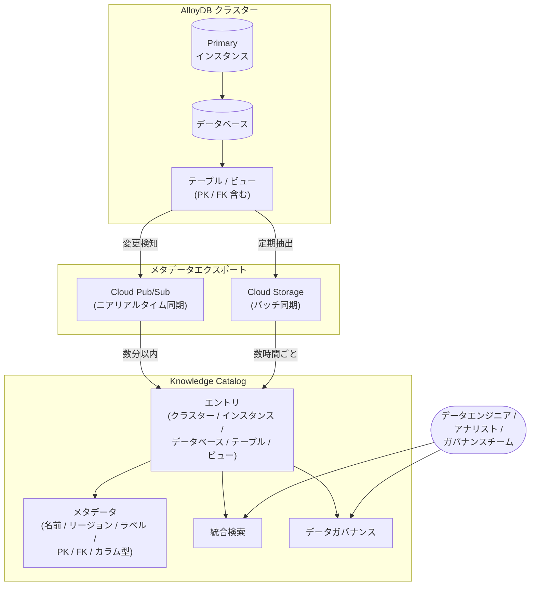

# AlloyDB for PostgreSQL: Knowledge Catalog 統合 (Preview) - デフォルト有効化

**リリース日**: 2026-04-21

**サービス**: AlloyDB for PostgreSQL

**機能**: Knowledge Catalog Integration (Preview) - Default Enabled

**ステータス**: Preview

[このアップデートのインフォグラフィックを見る](https://takech9203.github.io/google-cloud-news-summary/20260421-alloydb-knowledge-catalog-integration.html)

## 概要

AlloyDB for PostgreSQL と Knowledge Catalog (旧 Dataplex Universal Catalog) の統合が、すべての新規 AlloyDB クラスターにおいてデフォルトで有効化された。これにより、新しい AlloyDB クラスターを作成するだけで、データベース、スキーマ、テーブル、ビューなどのメタデータが自動的に Knowledge Catalog に同期され、データガバナンスと分析を簡素化する統一的なメタデータビューが利用可能になる。

今回のアップデートでは、ニアリアルタイム同期が実現されており、AlloyDB のメタデータ変更が数分以内に Knowledge Catalog に反映される。さらに、同期されるメタデータの範囲が拡張され、Primary Key と Foreign Key の情報も含まれるようになった。これにより、テーブル間のリレーションシップを Knowledge Catalog 上で直接把握でき、データ依存関係の分析やスキーマ変更の影響評価がより効率的に行える。

対象ユーザーは、AlloyDB を利用するデータベース管理者、データガバナンスチーム、データエンジニア、およびデータ分析基盤を構築する組織のプラットフォームチームである。

**アップデート前の課題**

- 新規 AlloyDB クラスター作成後に Knowledge Catalog 統合を手動で有効化する必要があり、設定漏れによりメタデータがカタログに反映されないケースがあった
- メタデータの同期間隔が数時間おきであり、スキーマ変更やテーブル追加がカタログに反映されるまで最大 48 時間かかる場合があった
- 同期されるメタデータに Primary Key と Foreign Key の情報が含まれておらず、テーブル間のリレーションシップを Knowledge Catalog 上で確認できなかった

**アップデート後の改善**

- 新規 AlloyDB クラスターで Knowledge Catalog 統合がデフォルト有効となり、追加設定なしで即座にメタデータ同期が開始される
- 2026 年 4 月 3 日以降に作成・復元されたクラスターではニアリアルタイム同期が適用され、メタデータ変更が最短数秒 (最大 5 分以内) で Knowledge Catalog に反映される
- Primary Key と Foreign Key (参照先テーブル、カラムマッピングを含む) がメタデータとして同期され、データリネージと依存関係の把握が容易になった

## アーキテクチャ図



AlloyDB クラスターのメタデータが Cloud Pub/Sub (ニアリアルタイム) または Cloud Storage (バッチ) を経由して Knowledge Catalog に同期され、データエンジニアやガバナンスチームが統合検索やデータガバナンス機能を通じてメタデータにアクセスする全体像を示している。

## サービスアップデートの詳細

### 主要機能

1. **デフォルト有効化**
   - すべての新規 AlloyDB クラスターで Knowledge Catalog 統合がデフォルトで有効になる
   - `gcloud alloydb clusters create` コマンドで `--enable-dataplex-integration` フラグを省略した場合、自動的に統合が有効化される
   - REST API でも `dataplexConfig` を省略するとデフォルトで有効になる
   - 統合を無効化したい場合は、明示的に `--no-enable-dataplex-integration` フラグまたは `"dataplexConfig": { "enabled": false }` を指定する必要がある

2. **ニアリアルタイム同期**
   - 2026 年 4 月 3 日以降に作成または復元されたクラスターでは、メタデータ変更が最大 5 分以内に Knowledge Catalog に反映される
   - 抽出プロセス自体は通常数秒で完了する
   - Cloud Pub/Sub トピックを活用したイベントドリブンな同期メカニズムを採用
   - 2026 年 2 月 26 日 ~ 4 月 3 日の間に作成されたクラスターは数時間ごとの同期 (最大 48 時間) となり、ニアリアルタイムへのアップグレードには Google Cloud サポートへの連絡が必要

3. **拡張メタデータ (Primary Key / Foreign Key)**
   - テーブルの Primary Key 情報が自動的に同期される
   - Foreign Key の参照先テーブルとカラムマッピング情報が同期される
   - Foreign Key の説明 (Description) も同期対象に含まれる
   - これにより、Knowledge Catalog 上でテーブル間のリレーションシップを直接確認可能

## 技術仕様

### 同期対象メタデータ一覧

| リソースレベル | 同期されるメタデータ |
|------|------|
| クラスター | 名前、リージョン、ラベル、Dataplex 統合有効フラグ、タイプ、作成日時、最終更新日時 |
| インスタンス | 名前、リージョン、ラベル、マシン CPU 数、可用性タイプ、タイプ、作成日時、最終更新日時 |
| データベース | 名前、データベースバージョン、文字セット (Charset)、照合順序 (Collation)、オーナー、作成日時、最終更新日時 |
| テーブル / ビュー | 名前、説明、カラム (データ型、モード)、Primary Key、Foreign Key (参照先テーブル、カラムマッピング)、オーナー、作成日時、最終更新日時 |

### 同期頻度の比較

| クラスターの作成/復元日 | 同期頻度 | 反映までの時間 |
|------|------|------|
| 2026 年 4 月 3 日以降 | ニアリアルタイム | 最大 5 分 |
| 2026 年 2 月 26 日 ~ 4 月 3 日 | 数時間ごと | 最大 48 時間 |

### 制約事項 (リソースレベルのメタデータ)

- クラスターおよびインスタンスのリソースレベルメタデータは常に有効であり、無効化できない
- Knowledge Catalog 統合の有効/無効設定が影響するのは、データベース、スキーマ、テーブル、ビューのメタデータのみ
- この機能はプライマリクラスターにのみ適用され、クロスリージョンレプリケーション用のセカンダリクラスターでは対応していない

## 設定方法

### 前提条件

1. Google Cloud プロジェクトで AlloyDB API が有効化されていること
2. 適切な IAM ロール (`alloydb.admin` または `alloydb.clusters.create` 権限) が付与されていること
3. Knowledge Catalog (Dataplex API) が有効化されていること

### 手順

#### ステップ 1: 新規クラスターの作成 (デフォルトで統合有効)

```bash
# Knowledge Catalog 統合はデフォルトで有効
# --enable-dataplex-integration フラグの指定は不要
gcloud alloydb clusters create CLUSTER_ID \
    --password=PASSWORD \
    --region=REGION
```

新規クラスターを作成するだけで、Knowledge Catalog 統合が自動的に有効化される。

#### ステップ 2: 既存クラスターで統合を有効化する場合

```bash
gcloud alloydb clusters update CLUSTER_ID \
    --region=REGION \
    --enable-dataplex-integration
```

既存のクラスターに対して Knowledge Catalog 統合を有効化する場合は、`--enable-dataplex-integration` フラグを付けて update コマンドを実行する。

#### ステップ 3: 統合を無効化する場合

```bash
# 新規クラスター作成時に統合を無効化
gcloud alloydb clusters create CLUSTER_ID \
    --password=PASSWORD \
    --region=REGION \
    --no-enable-dataplex-integration
```

統合を明示的に無効化したい場合は、`--no-enable-dataplex-integration` フラグを指定する。

#### REST API での設定例

```json
// 統合を無効化してクラスターを作成する場合
{
  "databaseVersion": "POSTGRES_16",
  "initialUser": {
    "user": "postgres",
    "password": "YOUR_PASSWORD"
  },
  "dataplexConfig": {
    "enabled": false
  }
}
```

```bash
curl -X POST \
  -H "Authorization: Bearer $(gcloud auth print-access-token)" \
  -H "Content-Type: application/json; charset=utf-8" \
  -d @request.json \
  "https://alloydb.googleapis.com/v1/projects/PROJECT_ID/locations/REGION/clusters?cluster_id=CLUSTER_ID"
```

## メリット

### ビジネス面

- **データガバナンスの自動化**: 新規クラスター作成と同時にメタデータがカタログ化されるため、データガバナンスポリシーの適用漏れを防止できる
- **データ発見性の向上**: Knowledge Catalog の統合検索により、組織内の AlloyDB データ資産を迅速に発見・理解でき、データ活用までの時間を短縮できる
- **コンプライアンス対応の効率化**: メタデータの変更追跡がニアリアルタイムで行われるため、監査やコンプライアンスレポートの作成が容易になる

### 技術面

- **設定不要 (Zero Configuration)**: デフォルト有効化により、インフラストラクチャチームの設定作業が不要になり、ヒューマンエラーによる設定漏れを排除できる
- **ニアリアルタイムのメタデータ整合性**: スキーマ変更が最大 5 分以内にカタログに反映されるため、データパイプラインやダウンストリームシステムが常に最新のスキーマ情報を参照できる
- **リレーションシップの可視化**: Primary Key / Foreign Key 情報の同期により、テーブル間の依存関係を Knowledge Catalog 上で直接確認でき、影響分析やマイグレーション計画が効率化される

## デメリット・制約事項

### 制限事項

- 本機能は Preview ステータスであり、「Pre-GA Offerings Terms」が適用される。サポートが限定的である可能性がある
- セカンダリクラスター (クロスリージョンレプリケーション用) では、データベース、スキーマ、テーブル、ビューのメタデータ同期は対応していない
- 2026 年 2 月 26 日 ~ 4 月 3 日に作成されたクラスターのニアリアルタイム同期へのアップグレードには、Google Cloud サポートへの連絡が必要
- クラスターおよびインスタンスのリソースレベルメタデータの同期は無効化できない

### 考慮すべき点

- デフォルト有効化により、意図せずメタデータが Knowledge Catalog にエクスポートされる可能性がある。セキュリティポリシー上メタデータの外部共有を制限している場合は、明示的に無効化する設定を運用フローに組み込む必要がある
- Knowledge Catalog のメタデータストレージには課金が発生する (metadata storage SKU)。大量のテーブルやカラムを持つクラスターでは、カタログ側のストレージコストを考慮する必要がある
- VPC Service Controls を利用している環境では、Dataplex API (`dataplex.googleapis.com`) をサービス境界内に含める設定が必要

## ユースケース

### ユースケース 1: マルチチームでのデータガバナンス統一

**シナリオ**: 大規模組織において、複数のチームがそれぞれ AlloyDB クラスターを運用しており、データカタログの整備が属人化していた。新規クラスター作成時にカタログ登録を忘れるケースが頻発し、組織全体のデータ資産の可視性が低下していた。

**実装例**:
```bash
# 各チームが新規クラスターを作成するだけで自動的にカタログ化
gcloud alloydb clusters create team-analytics-cluster \
    --password=SECURE_PASSWORD \
    --region=asia-northeast1

# Knowledge Catalog で組織横断的にデータ資産を検索
# Google Cloud Console > Dataplex > Knowledge Catalog > 検索
```

**効果**: 全クラスターのメタデータが自動的に Knowledge Catalog に集約されるため、組織全体のデータ資産の一元管理が実現し、データガバナンスの属人化を解消できる。

### ユースケース 2: スキーマ変更の影響分析

**シナリオ**: マイクロサービスアーキテクチャにおいて、共有データベースのテーブルスキーマを変更する際に、どのサービスが影響を受けるか把握するのが困難だった。Foreign Key 情報がカタログに含まれていなかったため、手動でリレーションシップを追跡する必要があった。

**効果**: Knowledge Catalog に同期された Primary Key / Foreign Key 情報を活用することで、テーブル間の依存関係をカタログ上で即座に確認でき、スキーマ変更の影響範囲を正確に特定できる。ニアリアルタイム同期により、変更後の状態も数分以内にカタログに反映される。

### ユースケース 3: AI エージェントによるデータ検索の基盤構築

**シナリオ**: 生成 AI アプリケーションが組織内のデータ資産を検索し、適切なデータソースを自動的に選択する必要がある。Knowledge Catalog は MCP (Model Context Protocol) を通じた AI エージェントのデータ検索基盤として機能する。

**効果**: AlloyDB のメタデータが自動的に Knowledge Catalog に登録されることで、AI エージェントが組織内のデータ資産を正確に把握し、ハルシネーションを抑制した信頼性の高いデータアクセスを実現できる。

## 料金

Knowledge Catalog 統合自体に追加のライセンス費用は発生しないが、関連する各サービスの利用に応じた課金が発生する。

### AlloyDB for PostgreSQL の料金

AlloyDB は従量課金モデルを採用しており、以下の要素に基づいて課金される。

| 項目 | 料金 (us-central1 の例) |
|--------|-----------------|
| vCPU (オンデマンド) | $0.06608 / vCPU / 時間 |
| メモリ (オンデマンド) | $0.0112 / GB / 時間 |
| ストレージ | 使用量に応じた従量課金 |
| ネットワーク | エグレストラフィックに応じた従量課金 |

確約利用割引 (CUD) を利用すると、1 年契約で 25%、3 年契約で 52% の割引が適用される。

### Knowledge Catalog の料金

| 項目 | 料金 |
|--------|-----------------|
| メタデータストレージ | metadata storage SKU に基づく従量課金 |
| カタログリソースの作成・管理 | 無料 |
| Search API 呼び出し | 無料 |
| Google Cloud Console での検索クエリ | 無料 |

詳細は [Knowledge Catalog の料金ページ](https://cloud.google.com/dataplex/pricing) を参照。

## 利用可能リージョン

AlloyDB for PostgreSQL は全世界 40 以上のリージョンで利用可能である。主要なリージョンは以下の通り。

| 地域 | リージョン例 |
|------|------|
| アジア太平洋 | asia-northeast1 (東京)、asia-northeast2 (大阪)、asia-northeast3 (ソウル)、asia-southeast1 (シンガポール) |
| 北米 | us-central1 (アイオワ)、us-east1 (サウスカロライナ)、us-west1 (オレゴン)、northamerica-northeast1 (モントリオール) |
| ヨーロッパ | europe-west1 (ベルギー)、europe-west3 (フランクフルト)、europe-north1 (フィンランド) |
| その他 | australia-southeast1 (シドニー)、me-central1 (ドーハ)、africa-south1 (ヨハネスブルグ) |

全リージョンの一覧は [AlloyDB Locations](https://cloud.google.com/alloydb/docs/locations) を参照。

## 関連サービス・機能

- **Knowledge Catalog (Dataplex)**: AlloyDB メタデータの統合管理・検索・ガバナンスを提供するフルマネージドサービス。旧称 Dataplex Universal Catalog
- **Cloud Pub/Sub**: ニアリアルタイム同期におけるメタデータ変更通知の配信基盤として利用される
- **Cloud Storage**: バッチ同期モードにおけるメタデータエクスポートの中間ストレージとして利用される
- **BigQuery**: Knowledge Catalog を通じて AlloyDB と BigQuery のメタデータを統合的に管理・検索可能
- **AlloyDB AI**: AlloyDB に組み込まれた AI 機能。Knowledge Catalog との統合により、AI ワークロードのデータガバナンスも一元化される

## 参考リンク

- [インフォグラフィック](https://takech9203.github.io/google-cloud-news-summary/20260421-alloydb-knowledge-catalog-integration.html)
- [公式リリースノート](https://cloud.google.com/release-notes#April_21_2026)
- [AlloyDB と Knowledge Catalog の統合ドキュメント](https://cloud.google.com/alloydb/docs/knowledge-catalog-integration)
- [Knowledge Catalog 概要](https://cloud.google.com/dataplex/docs/catalog-overview)
- [AlloyDB for PostgreSQL 料金](https://cloud.google.com/alloydb/pricing)
- [Knowledge Catalog 料金](https://cloud.google.com/dataplex/pricing)
- [AlloyDB 利用可能リージョン](https://cloud.google.com/alloydb/docs/locations)

## まとめ

AlloyDB for PostgreSQL と Knowledge Catalog の統合がデフォルト有効化されたことにより、新規クラスター作成時のメタデータカタログ化が完全に自動化された。ニアリアルタイム同期と Primary Key / Foreign Key 情報の拡充により、データガバナンスの即時性と網羅性が大幅に向上している。AlloyDB を利用する組織は、既存クラスターへの統合有効化を検討するとともに、Knowledge Catalog を活用したデータガバナンス戦略の構築を推奨する。

---

**タグ**: #AlloyDB #PostgreSQL #KnowledgeCatalog #Dataplex #DataGovernance #Metadata #Preview #デフォルト有効化 #ニアリアルタイム同期
