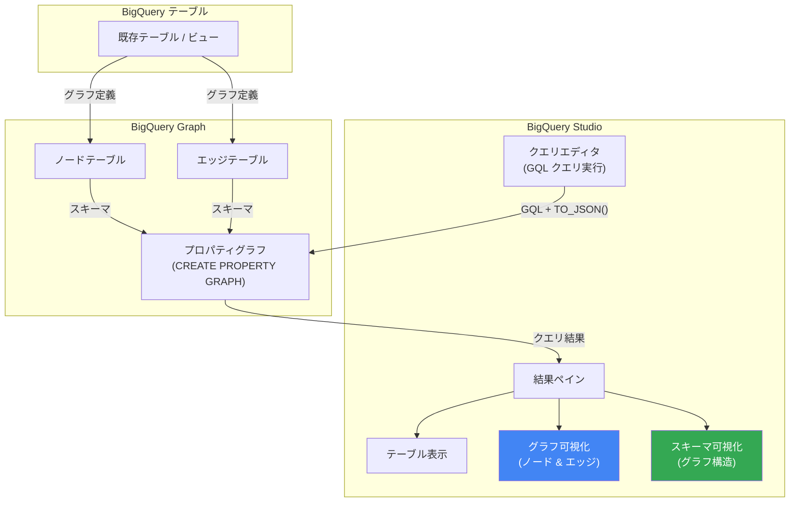

# BigQuery: Graph Query Results Visualization in BigQuery Studio (Preview)

**リリース日**: 2026-04-21

**サービス**: BigQuery

**機能**: BigQuery Studio でのグラフクエリ結果およびグラフスキーマの可視化

**ステータス**: Preview

[このアップデートのインフォグラフィックを見る](https://takech9203.github.io/google-cloud-news-summary/20260421-bigquery-graph-visualization-studio.html)

## 概要

BigQuery Graph のクエリ結果およびグラフスキーマを、ノートブック環境を必要とせずに BigQuery Studio 上で直接可視化できるようになった。これまで BigQuery Graph の可視化にはノートブック環境 (BigQuery Studio Notebooks、Google Colab、Jupyter Notebook) が必要だったが、今回のアップデートにより BigQuery Studio のクエリエディタから直接グラフの可視化が可能になる。

BigQuery Graph は、BigQuery のテーブルデータをノードとエッジで構成されるプロパティグラフとしてモデル化し、ISO GQL 標準に準拠した Graph Query Language (GQL) でグラフ分析を行う機能である。テーブル形式では数百行のデータポイント間の関係性を把握することが困難だが、グラフの可視化によりパターン、依存関係、異常値を直感的に発見できる。今回の可視化機能により、データアナリストやデータサイエンティストがクエリ結果をテーブル形式とグラフ形式で即座に切り替えて確認できるようになり、グラフ分析のワークフローが大幅に簡素化される。

このアップデートは、不正検知、顧客プロファイル分析、サプライチェーン管理、ソーシャルネットワーク分析などでグラフデータを扱うデータアナリスト、データサイエンティスト、Solutions Architect を主な対象としている。

**アップデート前の課題**

- BigQuery Graph のクエリ結果を可視化するにはノートブック環境 (BigQuery Studio Notebooks、Google Colab、Jupyter Notebook) を別途セットアップする必要があった
- ノートブック環境では `bigquery_magics` ライブラリのインストールと `%%bigquery --graph` マジックコマンドの使用が必要で、手順が煩雑だった
- ノートブック環境でのグラフ可視化にはデータサイズ 2 MB の制限があり、大規模なグラフ結果を可視化できなかった
- グラフスキーマの構造確認もノートブック経由でしか行えず、DDL 文からグラフ構造を推測する必要があった

**アップデート後の改善**

- BigQuery Studio のクエリエディタで GQL クエリを実行した後、結果ペインの「Graph」タブをクリックするだけでグラフを可視化できるようになった
- ノートブック環境のセットアップやライブラリのインストールが不要になり、すぐにグラフの可視化を利用可能になった
- Google Cloud コンソールでの可視化にはノートブックのような 2 MB のハードリミットがなく、より大規模なグラフ結果の可視化に対応する
- グラフスキーマの可視化もクエリ結果画面からワンクリックで切り替え可能になった

## アーキテクチャ図



BigQuery Studio のクエリエディタから GQL クエリを実行すると、結果ペインでテーブル表示、グラフ可視化、スキーマ可視化をワンクリックで切り替えられる。既存の BigQuery テーブルやビューからプロパティグラフを定義し、ノートブック不要でグラフ分析の可視化が完結する。

## サービスアップデートの詳細

### 主要機能

1. **BigQuery Studio でのグラフクエリ結果の可視化**
   - クエリ結果ペインの「Graph」タブをクリックするだけでグラフを可視化
   - ノードとエッジのラベル別サマリーを詳細パネルに表示
   - ノードやエッジをクリックしてプロパティ、隣接ノード、接続関係をナビゲーション可能
   - テーブル表示とグラフ表示をシームレスに切り替え可能

2. **グラフスキーマの可視化**
   - グラフのノード、エッジ、ラベル、プロパティなどの構造をビジュアルで確認可能
   - 複雑なグラフの DDL 文から推測が困難だった関係性を視覚的に把握
   - クエリ結果の可視化画面から「Schema view」への切り替えが可能

3. **レイアウトとカスタマイズオプション**
   - Force layout (デフォルト): 物理的な力のシミュレーションによる直感的な配置
   - Hierarchical: 接続性に基づく階層的な配置
   - Sequential: 接続性に基づく連続的な配置
   - Show labels: すべてのズームレベルでノードとエッジのラベルを表示
   - ノードの色変更、表示プロパティの選択が可能

4. **インタラクティブなグラフ操作**
   - ノードの右クリックで Expand (隣接ノード展開)、Collapse (折りたたみ)、Hide node (非表示) などの操作
   - Show only neighbors で特定ノードの直接接続のみを表示
   - Highlight node でターゲットノードをハイライト

## 技術仕様

### クエリ要件

| 項目 | 詳細 |
|------|------|
| クエリ形式 | GQL (Graph Query Language) - ISO GQL / SQL/PGQ 標準準拠 |
| 必須関数 | `TO_JSON()` でグラフ要素を JSON 形式で返す必要がある |
| 推奨返却形式 | グラフパス (個別のノード・エッジではなくパスを返却推奨) |
| 可視化場所 | BigQuery Studio クエリ結果ペイン「Graph」タブ |
| データサイズ制限 | Google Cloud コンソールではハードリミットなし (ノートブックは 2 MB 制限) |
| 必要なエディション | Enterprise または Enterprise Plus エディションのリザベーション |

### GQL クエリの例

```sql
-- グラフクエリの例: アカウント間の送金パスを可視化
GRAPH graph_db.FinGraph
MATCH p = (person:Person {name: "Dana"})-[own:Owns]->
  (account:Account)-[transfer:Transfers]->(account2:Account)
  <-[own2:Owns]-(person2:Person)
RETURN TO_JSON(p) AS path;
```

クエリ結果ペインで「Graph」タブをクリックすると、ノード (Person, Account) とエッジ (Owns, Transfers) がグラフとして描画される。

### 可視化が表示されない場合のトラブルシューティング

| 症状 | 原因 | 対処法 |
|------|------|--------|
| クエリ結果がテーブル形式のみ表示 | クエリが JSON 形式でグラフ要素を返していない | `TO_JSON()` 関数を使用してグラフ要素を返す |
| 結果が部分的にしか可視化されない | ノートブック使用時のデータサイズ超過 (2 MB) | Google Cloud コンソールで可視化するか、クエリを簡素化 |
| 一部のグラフ要素が表示されない | 個別のノード・エッジを返している | グラフパスを返すようクエリを更新 |

## 設定方法

### 前提条件

1. BigQuery Graph が利用可能な Google Cloud プロジェクト
2. Enterprise または Enterprise Plus エディションのリザベーション
3. BigQuery Studio へのアクセス権限

### 手順

#### ステップ 1: プロパティグラフの作成

```sql
-- プロパティグラフの定義例
CREATE PROPERTY GRAPH graph_db.FinGraph
  NODE TABLES (
    Person, Account
  )
  EDGE TABLES (
    Owns SOURCE KEY (person_id) REFERENCES Person
          DESTINATION KEY (account_id) REFERENCES Account,
    Transfers SOURCE KEY (from_id) REFERENCES Account
              DESTINATION KEY (to_id) REFERENCES Account
  );
```

既存の BigQuery テーブルやビューからノードテーブルとエッジテーブルを定義してプロパティグラフを作成する。データの複製やワークフローの変更は不要。

#### ステップ 2: GQL クエリの実行と可視化

```sql
-- BigQuery Studio のクエリエディタで実行
GRAPH graph_db.FinGraph
MATCH p = (person:Person)-[owns:Owns]->(account:Account)
RETURN TO_JSON(p) AS path;
```

1. BigQuery Studio のクエリエディタで上記のような GQL クエリを実行する
2. クエリ結果ペインの「Graph」タブをクリックしてグラフを可視化
3. 必要に応じて「Schema view」に切り替えてグラフスキーマを確認

## メリット

### ビジネス面

- **分析の迅速化**: ノートブック環境のセットアップが不要になり、GQL クエリ実行からグラフ可視化までの所要時間が大幅に短縮される。不正検知やサプライチェーン分析の初期調査を迅速に実施可能
- **データ探索の民主化**: ノートブックの知識が不要になり、SQL に慣れたアナリストでもグラフの可視化を利用できるようになる。グラフ分析のハードルが下がることで、組織内での活用が促進される

### 技術面

- **ワークフローの簡素化**: ノートブック環境の管理 (ライブラリインストール、カーネル管理) が不要になり、クエリエディタ内でグラフ分析が完結する
- **大規模データの可視化**: Google Cloud コンソールでの可視化にはノートブックのような 2 MB のハードリミットがないため、より大規模なグラフデータの可視化に対応
- **インタラクティブな探索**: ノードの展開・折りたたみ、フィルタリング、ハイライトなどのインタラクティブ操作により、大規模グラフの中から関心領域に集中した分析が可能

## デメリット・制約事項

### 制限事項

- Preview 機能であり、「Pre-GA Offerings Terms」の対象。サポートが限定的な場合がある
- BigQuery Graph 自体が Enterprise または Enterprise Plus エディションのリザベーションを必要とし、オンデマンド料金モデルでは利用できない
- クエリ結果のグラフ可視化には `TO_JSON()` 関数でグラフ要素を JSON 形式で返す必要があり、通常のプロパティ値を返すクエリでは可視化されない
- 可視化オプション (レイアウト、色、表示プロパティ) はセッション中のみ有効で、同じクエリを再実行すると設定がリセットされる

### 考慮すべき点

- Preview 機能のため、GA までに仕様変更の可能性がある。フィードバックは bq-graph-preview-support@google.com へ
- グラフパスではなく個別のノード・エッジを返すクエリでは、中間要素が可視化されない場合がある。パスでの返却を推奨
- 既存のノートブックベースの可視化ワークフローとの併用が可能。用途に応じて使い分けることが推奨される

## ユースケース

### ユースケース 1: 金融不正検知のインタラクティブ調査

**シナリオ**: 不正検知チームが、疑わしい送金パターンを持つアカウント間の関係をリアルタイムで調査する。BigQuery Studio のクエリエディタで GQL クエリを実行し、送金ネットワークをグラフとして可視化する。

**実装例**:
```sql
-- 特定アカウントからの多段階送金パスを可視化
GRAPH graph_db.FinGraph
MATCH p = (source:Account {id: "A001"})-[t:Transfers]->{1,5}(dest:Account)
RETURN TO_JSON(p) AS path;
```

**効果**: ノートブック環境を起動することなく、疑わしいアカウントの送金ネットワークを即座に可視化し、マネーロンダリングや不正送金のパターンを視覚的に特定できる。

### ユースケース 2: サプライチェーンの影響分析

**シナリオ**: 製造業のサプライチェーン管理者が、特定の部品サプライヤーに障害が発生した場合の影響範囲を分析する。部品、サプライヤー、製品間の依存関係をグラフとして可視化し、影響を受ける製品ラインを特定する。

**効果**: グラフスキーマの可視化でサプライチェーン全体の構造を把握し、クエリ結果の可視化で特定サプライヤーからの依存パスを視覚的にトレースできる。ノートブック不要で迅速な影響分析が実現する。

## 料金

BigQuery Graph の可視化機能自体に追加料金は発生しない。BigQuery Graph のクエリ実行には BigQuery の標準的なキャパシティベースの料金モデルが適用される。

### コンピュート料金

BigQuery Graph を利用するには Enterprise または Enterprise Plus エディションのリザベーションが必要。グラフクエリはスロット単位で課金される。

| エディション | Pay-As-You-Go 料金 (1 スロット時間) | コミットメント (1 年) | コミットメント (3 年) |
|-------------|--------------------------------------|----------------------|----------------------|
| Enterprise | $0.06 / スロット時間 | 割引あり | 割引あり |
| Enterprise Plus | $0.10 / スロット時間 | 割引あり | 割引あり |

### ストレージ料金

グラフの基盤となるテーブルに対して標準の BigQuery ストレージ料金が適用される。グラフモデルの定義数に関わらず、ストレージ料金は一度のみ課金される。

詳細な料金情報は [BigQuery 料金ページ](https://cloud.google.com/bigquery/pricing) を参照。

## 利用可能リージョン

BigQuery Graph は BigQuery のマルチリージョンおよびリージョンのデータセットで利用可能。ただし、Enterprise または Enterprise Plus エディションのリザベーションが作成されているリージョンで利用する必要がある。詳細は [BigQuery のロケーション](https://cloud.google.com/bigquery/docs/locations) を参照。

## 関連サービス・機能

- **[BigQuery Graph](https://docs.cloud.google.com/bigquery/docs/graph-overview)**: 今回の可視化機能の基盤となるグラフ分析機能。ISO GQL 標準に準拠したグラフクエリ言語を提供
- **[BigQuery Studio Notebooks](https://docs.cloud.google.com/bigquery/docs/notebooks-introduction)**: 従来のグラフ可視化手段。`%%bigquery --graph` マジックコマンドによるノートブック内可視化も引き続き利用可能
- **[Spanner Graph](https://docs.cloud.google.com/spanner/docs/graph/overview)**: BigQuery Graph と同じグラフスキーマ・クエリ言語を共有するオペレーショナルグラフデータベース。トランザクション処理は Spanner、分析は BigQuery と使い分け可能
- **[G.V()](https://gdotv.com/)、[Graphistry](https://www.graphistry.com/)、[Kineviz](https://www.kineviz.com/)、[Linkurious](https://linkurious.com/)**: BigQuery Graph と統合されたサードパーティ可視化ツール群。より高度な可視化・分析が必要な場合に利用可能

## 参考リンク

- [インフォグラフィック](https://takech9203.github.io/google-cloud-news-summary/20260421-bigquery-graph-visualization-studio.html)
- [公式リリースノート](https://cloud.google.com/release-notes#April_21_2026)
- [BigQuery Graph 可視化ドキュメント](https://docs.cloud.google.com/bigquery/docs/graph-visualization)
- [BigQuery Graph 概要](https://docs.cloud.google.com/bigquery/docs/graph-overview)
- [BigQuery Graph クエリ概要](https://docs.cloud.google.com/bigquery/docs/graph-query-overview)
- [BigQuery Graph 可視化ツール・統合](https://docs.cloud.google.com/bigquery/docs/graph-visualization-integrations)
- [BigQuery 料金](https://cloud.google.com/bigquery/pricing)

## まとめ

今回のアップデートにより、BigQuery Graph のクエリ結果とグラフスキーマの可視化がノートブック環境不要で BigQuery Studio 上から直接利用可能になった。これにより、グラフ分析のワークフローが大幅に簡素化され、ノートブック環境のセットアップやライブラリ管理のオーバーヘッドが解消される。BigQuery Graph を利用している、またはグラフ分析の導入を検討している組織は、BigQuery Studio で GQL クエリを実行し、`TO_JSON()` 関数でグラフ要素を返すことで即座に可視化機能を試すことができる。Preview 段階のフィードバックは bq-graph-preview-support@google.com まで送付することが推奨される。

---

**タグ**: #BigQuery #BigQueryGraph #GraphVisualization #GQL #BigQueryStudio #PropertyGraph #GraphAnalytics #Preview
