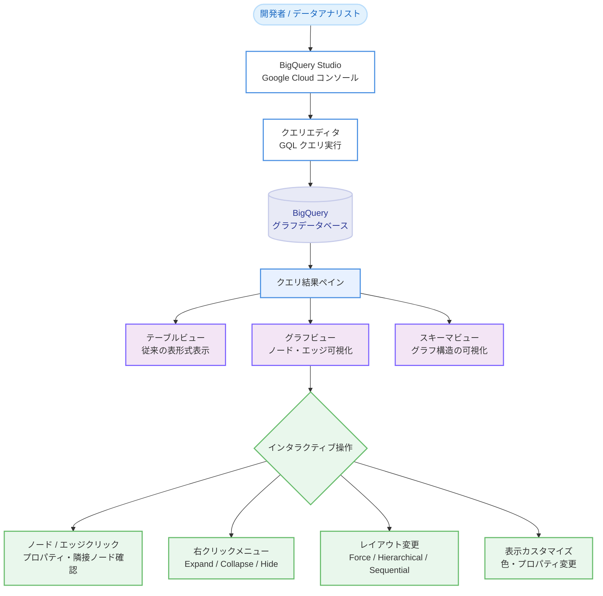

# BigQuery: BigQuery Studio でのグラフクエリ結果・スキーマ可視化機能

**リリース日**: 2026-04-21

**サービス**: BigQuery

**機能**: BigQuery Studio でのグラフクエリ結果・グラフスキーマの直接可視化

**ステータス**: Preview

[このアップデートのインフォグラフィックを見る](https://takech9203.github.io/google-cloud-news-summary/20260421-bigquery-graph-visualizer.html)

## 概要

BigQuery Graph のクエリ結果およびグラフスキーマを、ノートブック環境を使用せずに BigQuery Studio 上で直接可視化できるようになった。これまで BigQuery Graph の可視化には BigQuery Studio ノートブック、Google Colab、Jupyter Notebook などのノートブック環境が必要であったが、今回のアップデートにより Google Cloud コンソールの BigQuery Studio クエリエディタから直接グラフの可視化が可能になった。

BigQuery Graph は、BigQuery のスケーラブルな分析エンジン上でプロパティグラフを扱う機能であり、ISO GQL 標準互換のクエリインターフェースを提供している。グラフ可視化により、テーブル形式では把握しにくいデータポイント (ノード) 間の関係 (エッジ) を直感的に理解でき、パターン、依存関係、異常の発見が容易になる。今回の機能は、グラフデータの探索・分析を行う開発者やデータアナリストにとって、ワークフローの大幅な簡素化をもたらすものである。

**アップデート前の課題**

- BigQuery Graph のクエリ結果を可視化するには、BigQuery Studio ノートブックや Google Colab、Jupyter Notebook などのノートブック環境をセットアップする必要があった
- ノートブック環境では `bigquery_magics` ライブラリのインストールや `%%bigquery --graph` マジックコマンドの使用が必要で、手順が煩雑であった
- ノートブック環境での可視化にはデータサイズの上限が 2 MB に制限されていた
- グラフスキーマの構造を確認するには、DDL 文から推測するか、ノートブック環境でスキーマビューを使用する必要があった

**アップデート後の改善**

- BigQuery Studio のクエリエディタでグラフクエリを実行し、クエリ結果ペインの「Graph」ボタンをクリックするだけで可視化が可能になった
- ノートブック環境のセットアップやライブラリのインストールが不要になった
- Google Cloud コンソールでの可視化にはノートブック環境のような 2 MB のデータサイズ制限がない
- クエリ結果の可視化とスキーマ可視化をワンクリックで切り替えられるようになった

## アーキテクチャ図



BigQuery Studio のクエリエディタからグラフクエリを実行し、クエリ結果ペインでテーブルビュー、グラフビュー、スキーマビューを切り替えながら、インタラクティブな操作でグラフデータを探索するワークフローを示している。

## サービスアップデートの詳細

### 主要機能

1. **クエリ結果のグラフ可視化**
   - BigQuery Studio のクエリ結果ペインで「Graph」ボタンをクリックすることで、グラフクエリの結果をノードとエッジのグラフ形式で表示できる
   - クエリは `TO_JSON` 関数を使用してグラフ要素を JSON 形式で返す必要がある
   - 個別のノード・エッジではなく、グラフパスとして返却することが推奨される

2. **グラフスキーマの可視化**
   - クエリ結果の可視化からスキーマビューに切り替えることで、グラフの構造 (ノードタイプ、エッジタイプ、ラベル、プロパティ) を視覚的に確認できる
   - DDL 文から推測するのが困難な複雑なグラフの構造理解に有用

3. **インタラクティブなグラフ探索**
   - ノードやエッジをクリックしてプロパティ、隣接ノード、接続を確認できる
   - 右クリックコンテキストメニューから Expand (隣接ノード展開)、Collapse (折りたたみ)、Hide node (非表示)、Show only neighbors (隣接ノードのみ表示)、Highlight node (ハイライト) が利用可能
   - Force layout、Hierarchical、Sequential の 3 種類のレイアウトを選択可能

4. **表示カスタマイズ**
   - スキーマビューからノードタイプごとに表示するプロパティを変更できる
   - ノードタイプごとに色をカスタマイズできる
   - すべてのズームレベルでノード・エッジのラベルを表示する「Show labels」オプションが利用可能

## 技術仕様

### 可視化の要件

| 項目 | 詳細 |
|------|------|
| クエリ形式 | グラフ要素を JSON 形式で返す必要がある (`TO_JSON` 関数使用) |
| 推奨する返却形式 | 個別のノード・エッジではなくグラフパスを返却 |
| 可視化の操作環境 | Google Cloud コンソールの BigQuery Studio |
| 対応レイアウト | Force layout (デフォルト)、Hierarchical、Sequential |
| カスタマイズ項目 | ノードの色、表示プロパティの変更、ラベル表示 |
| ノートブック環境の制限 | 2 MB (Google Cloud コンソールにはハードリミットなし) |

### 可視化クエリの例

以下は BigQuery Studio で可視化可能なクエリの例である。

```sql
GRAPH graph_db.FinGraph
MATCH p = (person:Person {name: "Dana"})-[own:Owns]->
  (account:Account)-[transfer:Transfers]->(account2:Account)<-[own2:Owns]-(person2:Person)
RETURN TO_JSON(p) AS path;
```

クエリ結果ペインの「Graph」ボタンをクリックすると、ノードとエッジの可視化が表示される。パスを返却する形式を使用することで以下のメリットがある。

- パスにはノードとエッジの完全なデータが含まれる
- 複雑なクエリの中間ノードやエッジが欠落しない
- `RETURN` 文がシンプルになる

## 設定方法

### 前提条件

1. BigQuery Enterprise エディションまたは Enterprise Plus エディションのリザベーションが必要 (BigQuery Graph はこれらのエディションで利用可能)
2. Google Cloud コンソールへのアクセス権限
3. BigQuery Graph のプロパティグラフが `CREATE PROPERTY GRAPH` 文で定義されていること

### 手順

#### ステップ 1: プロパティグラフの作成

BigQuery Graph を使用するには、まずプロパティグラフを作成する。既存の BigQuery テーブルをノードテーブルおよびエッジテーブルとして定義する。

```sql
CREATE PROPERTY GRAPH graph_db.FinGraph
  NODE TABLES (
    Account,
    Person
  )
  EDGE TABLES (
    Owns SOURCE KEY (person_id) REFERENCES Person DESTINATION KEY (account_id) REFERENCES Account,
    Transfers SOURCE KEY (source_id) REFERENCES Account DESTINATION KEY (dest_id) REFERENCES Account
  );
```

#### ステップ 2: BigQuery Studio でグラフクエリを実行

Google Cloud コンソールの BigQuery Studio でクエリエディタを開き、`TO_JSON` 関数を使用してグラフ要素を JSON 形式で返すクエリを実行する。

```sql
GRAPH graph_db.FinGraph
MATCH p = (person:Person)-[owns:Owns]->(account:Account)
RETURN TO_JSON(p) AS path;
```

#### ステップ 3: 可視化を表示

クエリ結果ペインで「Graph」ボタンをクリックすると、グラフの可視化が表示される。スキーマビューに切り替えるには「Schema view」ボタンをクリックする。

## メリット

### ビジネス面

- **分析のアクセシビリティ向上**: ノートブック環境のセットアップなしでグラフ可視化が利用できるため、より多くのチームメンバーがグラフ分析に参加できる
- **不正検知・調査の効率化**: 金融詐欺検知やサプライチェーン分析などのユースケースで、疑わしいパターンをインタラクティブに調査でき、意思決定の迅速化につながる

### 技術面

- **ワークフローの簡素化**: ノートブック環境の構築、ライブラリのインストール、マジックコマンドの記述が不要になり、クエリからの可視化までのステップが大幅に削減される
- **データサイズ制限の緩和**: ノートブック環境での 2 MB のデータサイズ制限がなくなり、より大規模なグラフクエリ結果を可視化できる
- **リレーショナルとグラフの統合分析**: BigQuery の SQL 機能とグラフクエリ機能を同一のインターフェースでシームレスに切り替えながら分析できる

## デメリット・制約事項

### 制限事項

- 本機能は Preview ステータスであり、「Pre-GA Offerings Terms」が適用される。本番環境での利用には注意が必要
- クエリが `TO_JSON` 関数でグラフ要素を JSON 形式で返さない場合、テーブル形式でのみ表示される
- 可視化のカスタマイズ (レイアウト、色、表示プロパティ) は現在のセッション中のみ有効であり、クエリを再実行すると設定は保持されない
- 個別のノード・エッジを返却するクエリでは、一部の中間ノード・エッジが可視化に含まれない場合がある (パス形式での返却を推奨)

### 考慮すべき点

- BigQuery Graph を使用するには Enterprise エディションまたは Enterprise Plus エディションのリザベーションが必要であり、オンデマンド価格モデルでは利用できない
- Preview 機能のため、サポートが限定的である可能性がある。フィードバックやサポートリクエストは bq-graph-preview-support@google.com に送信する

## ユースケース

### ユースケース 1: 金融詐欺ネットワークの可視化と調査

**シナリオ**: セキュリティアナリストが、不正送金の疑いがあるアカウント間のトランザクションネットワークを調査する。BigQuery Studio のクエリエディタからグラフクエリを実行し、クエリ結果をグラフ形式で可視化することで、不正送金のパターンを視覚的に特定する。

**実装例**:

```sql
GRAPH graph_db.FinGraph
MATCH p = (person:Person {name: "Dana"})-[own:Owns]->
  (account:Account)-[transfer:Transfers]->(account2:Account)<-[own2:Owns]-(person2:Person)
RETURN TO_JSON(p) AS path;
```

**効果**: ノートブック環境を構築することなく、クエリ結果の可視化上で右クリックメニューを使って疑わしいノードの隣接ノードを展開・折りたたみし、不正送金ネットワークの全体像を効率的に把握できる。

### ユースケース 2: サプライチェーンのトレーサビリティ分析

**シナリオ**: 製造業のデータエンジニアが、部品の供給元、注文、在庫状況、欠陥情報をグラフとしてモデル化し、影響分析やコストロールアップを行う。スキーマ可視化を使用してグラフ構造を確認した上で、クエリ結果を可視化して関係性を分析する。

**効果**: スキーマビューでグラフの全体構造を把握し、クエリ結果ビューで具体的な部品間の依存関係をインタラクティブに探索できる。ノートブック不要で SQL エディタから直接操作できるため、チーム全体での分析が容易になる。

## 料金

BigQuery Graph の可視化機能自体は BigQuery Studio (Google Cloud コンソール) の機能として提供されており、可視化に対する追加料金は発生しない。ただし、BigQuery Graph を利用するには Enterprise エディションまたは Enterprise Plus エディションのリザベーションが必要であり、グラフクエリの実行にはスロットベースのキャパシティコンピュート料金が適用される。ストレージについては、グラフ定義に使用される基盤テーブルの標準的な BigQuery ストレージ料金が適用される。

料金の詳細は [BigQuery 料金ページ](https://cloud.google.com/bigquery/pricing) を参照。

## 関連サービス・機能

- **BigQuery Graph**: BigQuery 上でプロパティグラフの作成とクエリを可能にする機能。ISO GQL 標準互換のクエリインターフェースを提供
- **BigQuery Studio ノートブック**: Python と `%%bigquery --graph` マジックコマンドを使用したノートブック環境でのグラフ可視化。引き続き利用可能
- **Spanner Graph**: BigQuery Graph と同じグラフスキーマおよびクエリ言語を共有するオペレーショナルグラフデータベース。運用ワークロードは Spanner、分析ワークロードは BigQuery で実行可能
- **サードパーティ可視化ツール**: G.V()、Graphistry、Kineviz GraphXR、Linkurious Enterprise など、BigQuery Graph と統合された外部可視化ツールが利用可能

## 参考リンク

- [インフォグラフィック](https://takech9203.github.io/google-cloud-news-summary/20260421-bigquery-graph-visualizer.html)
- [公式リリースノート](https://cloud.google.com/release-notes#April_21_2026)
- [Visualize graphs - BigQuery ドキュメント](https://cloud.google.com/bigquery/docs/graph-visualization)
- [Introduction to BigQuery Graph](https://cloud.google.com/bigquery/docs/graph-overview)
- [Graph query overview](https://cloud.google.com/bigquery/docs/graph-query-overview)
- [BigQuery Graph visualization tools and integrations](https://cloud.google.com/bigquery/docs/graph-visualization-integrations)
- [BigQuery 料金ページ](https://cloud.google.com/bigquery/pricing)

## まとめ

今回のアップデートにより、BigQuery Graph のクエリ結果およびグラフスキーマを、ノートブック環境を使用せずに BigQuery Studio 上で直接可視化できるようになった。ノートブック環境のセットアップやライブラリインストールが不要になることでグラフ分析のハードルが大幅に下がり、より多くのユーザーがグラフデータの視覚的な探索と分析を活用できる。BigQuery Graph を利用中のユーザーは、BigQuery Studio のクエリエディタからこの新しい可視化機能を試すことを推奨する。

---

**タグ**: #BigQuery #BigQueryGraph #グラフ可視化 #BigQueryStudio #GoogleCloud #データ分析 #GQL #Preview
