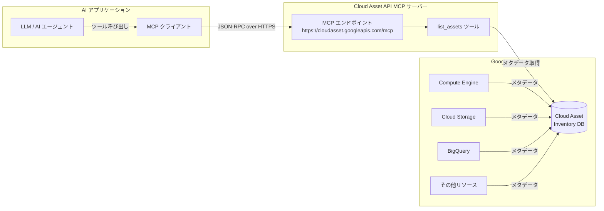

# Cloud Asset Inventory: MCP によるアセット一覧取得 (Preview)

**リリース日**: 2026-04-21

**サービス**: Cloud Asset Inventory

**機能**: MCP Support for Asset Listing (Preview)

**ステータス**: Preview

[このアップデートのインフォグラフィックを見る](https://takech9203.github.io/google-cloud-news-summary/20260421-cloud-asset-inventory-mcp-preview.html)

## 概要

Cloud Asset Inventory が Model Context Protocol (MCP) を介したアセット一覧取得に対応した。これにより、AI アプリケーションや LLM エージェントが MCP クライアントとして Cloud Asset Inventory に接続し、Google Cloud 上のアセットメタデータを直接クエリできるようになる。

Cloud Asset Inventory は Google Cloud のグローバルメタデータインベントリサービスであり、プロジェクト、フォルダ、組織内のリソースの表示、検索、エクスポート、監視、分析を提供している。今回の MCP 対応により、AI エージェントがこれらの資産情報をプログラム的に取得し、インフラ管理やセキュリティ監査の自動化に活用できるようになる。

この機能は Preview ステータスであり、AI を活用したクラウドインフラ管理やガバナンスの自動化を推進する Solutions Architect、SRE、セキュリティエンジニアが主な対象ユーザーとなる。

**アップデート前の課題**

- AI エージェントが Cloud Asset Inventory からアセット情報を取得するには、REST API や gcloud CLI を直接呼び出すカスタムインテグレーションを構築する必要があった
- LLM アプリケーションが Google Cloud のリソース状態をリアルタイムに把握するための標準化されたプロトコルが存在しなかった
- AI を活用したインフラ監査やコンプライアンスチェックの自動化には、独自のラッパーやアダプターの開発が必要だった

**アップデート後の改善**

- MCP エンドポイント (`https://cloudasset.googleapis.com/mcp`) を通じて、AI アプリケーションが標準化されたプロトコルでアセット一覧を取得できるようになった
- `list_assets` MCP ツールにより、プロジェクト、フォルダ、組織単位でのアセット照会が可能になった
- MCP 対応の AI アプリケーション (Gemini CLI、Claude、ADK エージェントなど) から、追加のカスタムコード不要でアセット情報にアクセスできるようになった

## アーキテクチャ図



AI アプリケーションが MCP クライアントを通じて Cloud Asset API MCP サーバーに接続し、`list_assets` ツールで Google Cloud リソースのメタデータを取得するフローを示している。

## サービスアップデートの詳細

### 主要機能

1. **MCP エンドポイント**
   - Cloud Asset API の MCP サーバーエンドポイント: `https://cloudasset.googleapis.com/mcp`
   - JSON-RPC 2.0 プロトコルによる通信
   - グローバルエンドポイントとして提供

2. **list_assets MCP ツール**
   - プロジェクト、フォルダ、組織単位でのアセット一覧取得
   - アセットタイプによるフィルタリング (正規表現対応)
   - コンテンツタイプの指定 (RESOURCE、IAM_POLICY、ORG_POLICY、ACCESS_POLICY、OS_INVENTORY、RELATIONSHIP)
   - ページネーション対応 (最大 1,000 件/リクエスト)
   - 過去 35 日間の任意の時点のスナップショット取得

3. **MCP ツール仕様の取得**
   - `tools/list` メソッドで利用可能なツールとその仕様を動的に取得可能
   - AI アプリケーションが自動的にツールの入力スキーマを理解し、適切なリクエストを構築可能

## 技術仕様

### list_assets リクエストパラメータ

| パラメータ | 型 | 必須 | 説明 |
|-----------|-----|------|------|
| `parent` | string | 必須 | 対象スコープ (例: `organizations/123`, `projects/my-project`, `folders/456`) |
| `readTime` | string (Timestamp) | 任意 | スナップショット取得時点 (現在から 35 日前まで) |
| `assetTypes` | string[] | 任意 | アセットタイプフィルタ (正規表現対応、例: `compute.googleapis.com.*`) |
| `contentType` | enum | 任意 | コンテンツタイプ (RESOURCE, IAM_POLICY, ORG_POLICY 等) |
| `pageSize` | integer | 任意 | 1 リクエストあたりの最大件数 (デフォルト: 100、最大: 1,000) |
| `pageToken` | string | 任意 | ページネーション用トークン |
| `relationshipTypes` | string[] | 任意 | リレーションシップタイプフィルタ (contentType=RELATIONSHIP 時のみ) |

### 認証方式

| 認証方式 | 用途 |
|---------|------|
| Application Default Credentials (ADC) | ローカル開発環境での認証 |
| サービスアカウント | Google Cloud 上のワークロードでの認証 |
| ワークロード ID フェデレーション | オンプレミスまたは他クラウドからの認証 |
| OAuth クライアント ID | AI アプリケーション固有の認証 |

### 必要な IAM 権限

```
cloudasset.assets.listResource       # RESOURCE/RELATIONSHIP コンテンツタイプ
cloudasset.assets.listIamPolicy      # IAM_POLICY コンテンツタイプ
cloudasset.assets.listOrgPolicy      # ORG_POLICY コンテンツタイプ
cloudasset.assets.listAccessPolicy   # ACCESS_POLICY コンテンツタイプ
cloudasset.assets.listOSInventories  # OS_INVENTORY コンテンツタイプ
serviceusage.services.use            # 全 API 呼び出しに必要
```

## 設定方法

### 前提条件

1. Google Cloud プロジェクトで Cloud Asset API が有効であること
2. MCP サーバーが有効化されていること ([MCP サーバーの有効化](https://docs.cloud.google.com/mcp/enable-disable-mcp-servers))
3. 適切な IAM ロール (`roles/cloudasset.viewer` + `roles/serviceusage.serviceUsageConsumer`) が付与されていること
4. 認証が設定されていること ([MCP 認証の設定](https://docs.cloud.google.com/mcp/authenticate-mcp))

### 手順

#### ステップ 1: MCP サーバーの有効化と認証設定

```bash
# Cloud Asset API の有効化
gcloud services enable cloudasset.googleapis.com

# ADC の設定 (ローカル開発環境)
gcloud auth application-default login

# IAM ロールの付与
gcloud projects add-iam-policy-binding PROJECT_ID \
  --member="user:USER_EMAIL" \
  --role="roles/cloudasset.viewer"

gcloud projects add-iam-policy-binding PROJECT_ID \
  --member="user:USER_EMAIL" \
  --role="roles/serviceusage.serviceUsageConsumer"
```

#### ステップ 2: MCP ツール一覧の確認

```bash
# 利用可能な MCP ツールを確認
curl --location 'https://cloudasset.googleapis.com/mcp' \
  --header 'content-type: application/json' \
  --header 'accept: application/json, text/event-stream' \
  --header "Authorization: Bearer $(gcloud auth print-access-token)" \
  --data '{
    "method": "tools/list",
    "jsonrpc": "2.0",
    "id": 1
  }'
```

#### ステップ 3: list_assets ツールの呼び出し

```bash
# プロジェクト内の Compute Engine インスタンスを一覧取得
curl --location 'https://cloudasset.googleapis.com/mcp' \
  --header 'content-type: application/json' \
  --header 'accept: application/json, text/event-stream' \
  --header "Authorization: Bearer $(gcloud auth print-access-token)" \
  --data '{
    "method": "tools/call",
    "params": {
      "name": "list_assets",
      "arguments": {
        "parent": "projects/my-project-id",
        "assetTypes": ["compute.googleapis.com/Instance"],
        "contentType": "RESOURCE",
        "pageSize": 100
      }
    },
    "jsonrpc": "2.0",
    "id": 1
  }'
```

#### ステップ 4: AI アプリケーションでの MCP 設定

```json
{
  "mcpServers": {
    "cloud-asset-inventory": {
      "url": "https://cloudasset.googleapis.com/mcp"
    }
  }
}
```

AI アプリケーション (Gemini CLI、Claude Desktop など) の MCP 設定ファイルに上記のエンドポイントを追加することで、エージェントが `list_assets` ツールを利用可能になる。

## メリット

### ビジネス面

- **AI 駆動のインフラガバナンス**: AI エージェントが組織全体のリソースを自動的に把握し、ガバナンスポリシーの遵守状況を継続的に評価できる
- **運用効率の向上**: カスタムインテグレーションの開発が不要になり、MCP 対応 AI ツールからすぐにアセット情報を活用できる
- **セキュリティ監査の自動化**: AI エージェントがリソースの構成やアクセス権限を自動的にチェックし、セキュリティリスクを早期に発見できる

### 技術面

- **標準化されたプロトコル**: MCP による標準化されたインターフェースにより、さまざまな AI アプリケーションから一貫した方法でアクセス可能
- **豊富なフィルタリング**: アセットタイプの正規表現フィルタ、コンテンツタイプ、スコープ (プロジェクト/フォルダ/組織) による柔軟なクエリ
- **Model Armor との統合**: Model Armor によるプロンプトインジェクションや機密データ漏洩の防止が利用可能

## デメリット・制約事項

### 制限事項

- Preview ステータスのため、本番環境での使用は推奨されず、SLA の対象外
- 現時点で MCP ツールは `list_assets` のみ。SearchAllResources、ExportAssets などの他の API は MCP 経由では利用不可
- ListAssets API と同じクォータ制限が適用される (プロジェクトあたり 100 リクエスト/分)

### 考慮すべき点

- MCP サーバーの認証設定が必要であり、エージェントのアイデンティティ管理と最小権限の原則を適切に設計する必要がある
- IAM deny ポリシーを使用して、AI エージェントが読み取り専用の操作に限定されるよう設定することが推奨される
- 組織全体のアセットを一覧取得する場合、組織レベルのクォータ (800 リクエスト/分、650,000 リクエスト/日) に注意が必要

## ユースケース

### ユースケース 1: AI エージェントによるインフラ棚卸し

**シナリオ**: SRE チームが AI エージェントを使用して、組織内のすべての Compute Engine インスタンスの棚卸しを自動実行したい。

**実装例**:
```json
{
  "method": "tools/call",
  "params": {
    "name": "list_assets",
    "arguments": {
      "parent": "organizations/123456789",
      "assetTypes": ["compute.googleapis.com/Instance"],
      "contentType": "RESOURCE"
    }
  },
  "jsonrpc": "2.0",
  "id": 1
}
```

**効果**: AI エージェントが取得したインスタンス一覧をもとに、未使用リソースの特定、タグ付けの不備の検出、コスト最適化の提案を自動的に行える。

### ユースケース 2: セキュリティポスチャの自動評価

**シナリオ**: セキュリティチームが AI エージェントを活用して、IAM ポリシーの設定状況を定期的に監査したい。

**実装例**:
```json
{
  "method": "tools/call",
  "params": {
    "name": "list_assets",
    "arguments": {
      "parent": "projects/my-project",
      "contentType": "IAM_POLICY"
    }
  },
  "jsonrpc": "2.0",
  "id": 1
}
```

**効果**: AI エージェントが IAM ポリシーを分析し、過剰な権限付与、公開アクセスの設定、サービスアカウントキーの使用状況などのセキュリティリスクを自動的に検出・報告できる。

## 料金

Cloud Asset Inventory の基本的な API (ListAssets, ExportAssets, SearchAllResources など) は無料で利用可能。Policy Analyzer の分析クエリは、組織あたり 1 日 20 回まで無料で、それ以上は Security Command Center Premium または Enterprise ティアが必要となる。

MCP 経由の `list_assets` 呼び出しについても、既存の ListAssets API と同じ料金体系が適用されると考えられる。

詳細は [Cloud Asset Inventory 料金ページ](https://docs.cloud.google.com/asset-inventory/pricing) を参照。

## 利用可能リージョン

Cloud Asset Inventory はグローバルサービスであり、MCP エンドポイント (`https://cloudasset.googleapis.com/mcp`) もグローバルに提供される。すべての Google Cloud リージョンのリソースメタデータを取得可能。

## 関連サービス・機能

- **[Google Cloud MCP サーバー](https://docs.cloud.google.com/mcp/overview)**: Cloud Asset Inventory 以外にも、Cloud Run、Cloud SQL、Spanner、BigQuery、Memorystore など多数のサービスが MCP サーバーを提供しており、AI エージェントによるマルチサービス連携が可能
- **[Security Command Center](https://cloud.google.com/security-command-center)**: Cloud Asset Inventory のデータと組み合わせて、セキュリティポスチャの包括的な評価を実施可能。Premium/Enterprise ティアではリレーションシップデータや高度なクエリも利用可能
- **[Model Armor](https://docs.cloud.google.com/model-armor/model-armor-mcp-google-cloud-integration)**: MCP ツール呼び出しとレスポンスをサニタイズし、プロンプトインジェクションや機密データ漏洩などのリスクを軽減
- **[IAM deny ポリシー](https://docs.cloud.google.com/mcp/control-mcp-use-iam)**: AI エージェントの MCP アクセスを制御し、読み書き操作の制限を設定可能

## 参考リンク

- [インフォグラフィック](https://takech9203.github.io/google-cloud-news-summary/20260421-cloud-asset-inventory-mcp-preview.html)
- [公式リリースノート](https://cloud.google.com/release-notes#April_21_2026)
- [Cloud Asset Inventory MCP リファレンス](https://docs.cloud.google.com/asset-inventory/docs/reference/mcp)
- [list_assets MCP ツール仕様](https://docs.cloud.google.com/asset-inventory/docs/reference/mcp/tools_list/list_assets)
- [Google Cloud MCP サーバー概要](https://docs.cloud.google.com/mcp/overview)
- [MCP 認証の設定](https://docs.cloud.google.com/mcp/authenticate-mcp)
- [Cloud Asset Inventory ドキュメント](https://docs.cloud.google.com/asset-inventory/docs)
- [Cloud Asset Inventory 料金ページ](https://docs.cloud.google.com/asset-inventory/pricing)
- [Cloud Asset Inventory クォータと制限](https://docs.cloud.google.com/asset-inventory/docs/quota)

## まとめ

Cloud Asset Inventory の MCP 対応は、AI エージェントによるクラウドインフラ管理の標準化に向けた重要な一歩である。MCP クライアントを持つ AI アプリケーションから、カスタムコードなしでアセットメタデータにアクセスできるようになり、インフラ棚卸し、セキュリティ監査、コンプライアンスチェックの自動化が大幅に容易になる。現在は Preview ステータスのため、まずは開発・検証環境で試用し、GA に向けた準備を進めることを推奨する。

---

**タグ**: #CloudAssetInventory #MCP #ModelContextProtocol #Preview #AIAgent #AssetManagement #Security #Governance #GoogleCloud
