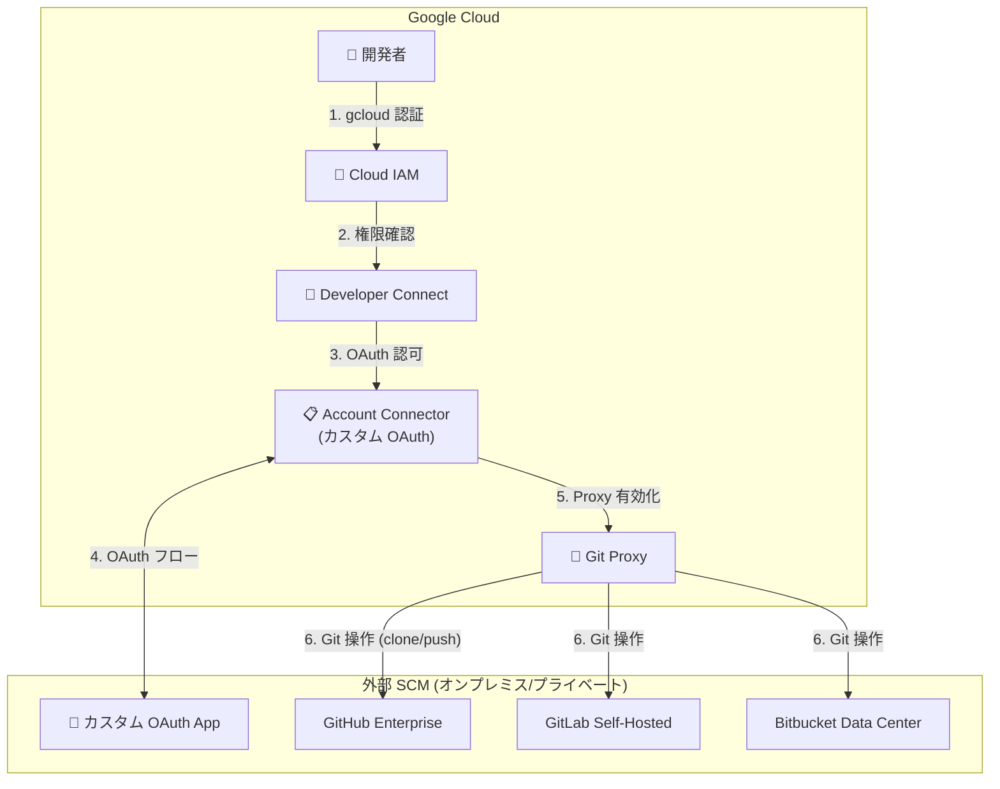

# Developer Connect: カスタム OAuth クライアントおよび Account Connectors 向け Git Proxy

**リリース日**: 2026-04-21

**サービス**: Developer Connect

**機能**: Custom OAuth Client and Git Proxy for Account Connectors

**ステータス**: GA

[このアップデートのインフォグラフィックを見る](https://takech9203.github.io/google-cloud-news-summary/20260421-developer-connect-oauth-git-proxy.html)

## 概要

Google Cloud Developer Connect の Account Connectors において、カスタム OAuth クライアントを使用したコネクタ作成と Git Proxy の利用が GA (一般提供) となりました。これにより、GitHub Enterprise、GitLab Self-Hosted、Bitbucket Data Center などのオンプレミスやプライベートネットワーク上のソースコード管理システム (SCM) と Google Cloud を、より柔軟かつセキュアに接続できるようになります。

Account Connectors は、Google Cloud アカウントと外部の開発者ツールプロバイダ上の個人アカウントを接続する Developer Connect の機能です。従来は事前構成された OAuth プロバイダ (GitHub、GitLab、Bitbucket Cloud) のみが利用可能でしたが、今回のアップデートによりカスタム OAuth クライアントを指定してコネクタを作成できるようになりました。さらに、Account Connectors で Git Proxy を有効化することで、IAM 権限に基づいた Git 操作が可能になり、Secret Manager でのアクセストークン管理が不要になります。

このアップデートは、エンタープライズ環境でオンプレミスの SCM を運用しているプラットフォーム管理者やセキュリティ管理者、Gemini Code Assist のコードカスタマイゼーションや Code Review Agent をプライベートネットワーク内の SCM で利用したい開発チームを主な対象としています。

**アップデート前の課題**

- Account Connectors では事前構成された OAuth プロバイダ (GitHub、GitLab、Bitbucket Cloud) しか選択できず、オンプレミスの GitHub Enterprise や GitLab Self-Hosted を直接接続できなかった
- Account Connectors で Git Proxy を利用できなかったため、Git 操作にはアクセストークンを Secret Manager で管理するか、別途認証を構成する必要があった
- プライベートネットワーク内の SCM に対して Gemini Code Assist のコードカスタマイゼーションや Code Review Agent を Account Connectors 経由で利用することが困難だった

**アップデート後の改善**

- カスタム OAuth クライアントにより、GitHub Enterprise、GitLab Self-Hosted、Bitbucket Data Center などの自社ホスティング SCM を Account Connectors で接続可能になった
- Account Connectors で Git Proxy を有効化することで、Google Cloud の IAM 権限のみで Git 操作 (clone、push など) が可能になった
- PKCE (Proof Key for Code Exchange) のサポートやプライベートネットワーク接続 (Service Directory 経由) など、エンタープライズ向けのセキュリティオプションが利用可能になった

## アーキテクチャ図



カスタム OAuth クライアントを使用した Account Connector の認証フローと Git Proxy 経由のソースコードアクセスの全体像を示しています。開発者は Google Cloud の IAM 認証のみで、オンプレミスの SCM に対して Git 操作を実行できます。

## サービスアップデートの詳細

### 主要機能

1. **カスタム OAuth クライアントによる Account Connector 作成**
   - 自社の OAuth アプリケーション (GitHub Enterprise、GitLab Self-Hosted、Bitbucket Data Center) を指定してコネクタを作成可能
   - リダイレクト URI 形式: `https://developerconnect.google.com/redirect/custom/projects/<project_number>/locations/<location>/accountConnectors/<account_connector_id>`
   - Host URI、Authorization URI、Token URI、Client ID、Client Secret を個別に設定可能

2. **Account Connectors 向け Git Proxy**
   - Git Proxy を有効化すると、Developer Connect が Git リクエストを代行実行
   - Google Cloud CLI の credential helper を使用して認証: `git config --global credential.'https://*.developerconnect.dev'.helper gcloud.sh`
   - Git Proxy URI 形式: `https://REGION-git.developerconnect.dev/a/PROJECT_ID/CONNECTOR_ID/REPO_PATH`

3. **エンタープライズセキュリティオプション**
   - PKCE (Proof Key for Code Exchange) のサポートにより OAuth フローのセキュリティを強化
   - プライベートネットワーク接続: Service Directory を使用してオンプレミス SCM に接続
   - CA 証明書の指定によるカスタム TLS 設定のサポート
   - CMEK (Customer-Managed Encryption Key) による認証シークレットの暗号化

## 技術仕様

### IAM ロール

| ロール | ロール名 | 用途 |
|--------|----------|------|
| Developer Connect OAuth Admin | `roles/developerconnect.oauthAdmin` | Account Connector の作成・管理 |
| Developer Connect Admin | `roles/developerconnect.admin` | Proxy の有効化・無効化 |
| Account Connector OAuth User | `roles/developerconnect.oauthUser` | Git 読み書きリクエスト (Account Connectors 経由) |
| Git Proxy Reader | `roles/developerconnect.gitProxyReader` | Git 読み取りリクエスト (システム接続経由) |
| Git Proxy User | `roles/developerconnect.gitProxyUser` | Git 書き込みリクエスト (システム接続経由) |

### サポートされる SCM プロバイダ (カスタム OAuth)

| プロバイダ | システム ID | Authorization URI パス | Token URI パス |
|-----------|------------|----------------------|---------------|
| GitHub Enterprise | `GITHUB_ENTERPRISE` | `/login/oauth/authorize` | `/login/oauth/access_token` |
| GitLab Self-Hosted | `GITLAB_ENTERPRISE` | `/oauth/authorize` | `/oauth/access_token` |
| Bitbucket Data Center | `BITBUCKET_DATA_CENTER` | `/rest/oauth2/latest/authorize` | `/rest/oauth2/latest/token` |

## 設定方法

### 前提条件

1. Google Cloud プロジェクトで Developer Connect API が有効であること
2. `roles/developerconnect.oauthAdmin` ロールが付与されていること
3. 接続先 SCM でカスタム OAuth アプリケーションが作成済みであること

### 手順

#### ステップ 1: カスタム OAuth クライアントで Account Connector を作成

```bash
gcloud alpha developer-connect account-connectors create my-ac \
  --location=LOCATION \
  --project=PROJECT_ID \
  --custom-provider-oauth-config-system-id=GITHUB_ENTERPRISE \
  --custom-oauth-config-host-uri=https://github.example.com \
  --custom-oauth-config-auth-uri=https://github.example.com/login/oauth/authorize \
  --custom-oauth-config-token-uri=https://github.example.com/login/oauth/access_token \
  --custom-provider-oauth-config-scopes=repo,read:org \
  --custom-oauth-config-client-id=CLIENT_ID \
  --custom-oauth-config-client-secret=SECRET
```

`LOCATION` にはリージョン、`PROJECT_ID` にはプロジェクト ID (プロジェクト番号ではない) を指定します。

#### ステップ 2: Git Proxy を有効化

```bash
gcloud alpha developer-connect account-connectors update my-ac \
  --location=LOCATION \
  --proxy-config-enabled
```

Google Cloud Console で Account Connector を作成する場合は、「Enable Developer Connect proxy」チェックボックスを選択することで有効化できます。

#### ステップ 3: アカウントを接続

Google Cloud Console で Developer Connect を開き、Account Connectors タブからコネクタを選択して「Connect your account」をクリックし、OAuth 認証を完了します。

#### ステップ 4: Git Proxy 経由でリポジトリにアクセス

```bash
# credential helper を設定
git config --global credential.'https://*.developerconnect.dev'.helper gcloud.sh

# Git Proxy 経由で clone
git clone https://REGION-git.developerconnect.dev/a/PROJECT_ID/CONNECTOR_ID/org-name/repo-name
```

## メリット

### ビジネス面

- **エンタープライズ SCM のシームレスな統合**: オンプレミスの GitHub Enterprise、GitLab Self-Hosted、Bitbucket Data Center を Google Cloud サービスと直接接続でき、ハイブリッド環境の運用が効率化される
- **Gemini Code Assist の活用範囲拡大**: プライベートネットワーク内の SCM でも Gemini Code Assist のコードカスタマイゼーションや Code Review Agent が利用可能になり、AI 支援開発の恩恵を全社的に享受できる

### 技術面

- **認証管理の簡素化**: Git Proxy により IAM ベースの認証に統一され、Secret Manager でのアクセストークン管理が不要になる
- **セキュリティの向上**: PKCE サポート、CMEK、Service Directory を活用したプライベートネットワーク接続により、エンタープライズレベルのセキュリティ要件に対応できる
- **運用コストの削減**: 個別のトークン管理やローテーション作業が不要になり、プラットフォーム管理者の運用負荷が軽減される

## デメリット・制約事項

### 制限事項

- Account Connector のスコープを変更すると、そのコネクタを使用している既存ユーザーの接続がすべて解除される
- Account Connector の作成後にリージョンを変更することはできない
- カスタム OAuth クライアントを使用する場合、OAuth アプリケーションの管理 (シークレットのローテーションなど) は利用者側の責任となる

### 考慮すべき点

- CLI コマンドは現時点で `gcloud alpha` プレフィックスを使用しており、コマンド体系が今後変更される可能性がある
- プライベートネットワーク接続を使用する場合、Service Directory の設定とネットワーク構成が追加で必要となる
- PKCE を有効化する場合、接続先の OAuth サービスが PKCE をサポートしている必要がある

## ユースケース

### ユースケース 1: オンプレミス GitHub Enterprise と Gemini Code Assist の統合

**シナリオ**: 企業がオンプレミスの GitHub Enterprise でソースコードを管理しており、Gemini Code Assist のコードカスタマイゼーション機能を使って、自社のコードベースに最適化された AI コーディング支援を導入したい。

**実装例**:
```bash
# 1. カスタム OAuth でAccount Connector を作成 (Git Proxy 有効)
gcloud alpha developer-connect account-connectors create ghe-connector \
  --location=asia-northeast1 \
  --project=my-project \
  --custom-provider-oauth-config-system-id=GITHUB_ENTERPRISE \
  --custom-oauth-config-host-uri=https://github.internal.example.com \
  --custom-oauth-config-auth-uri=https://github.internal.example.com/login/oauth/authorize \
  --custom-oauth-config-token-uri=https://github.internal.example.com/login/oauth/access_token \
  --custom-oauth-config-client-id=my-client-id \
  --custom-oauth-config-client-secret=my-secret \
  --proxy-config-enabled

# 2. 開発者が各自のアカウントを接続後、Git Proxy 経由でアクセス
git clone https://asia-northeast1-git.developerconnect.dev/a/my-project/ghe-connector/my-org/my-repo
```

**効果**: 社内のプライベートリポジトリの内容を Gemini Code Assist に学習させ、社内コーディング規約やアーキテクチャパターンに沿ったコード提案を受けられるようになる。

### ユースケース 2: マルチ SCM 環境の統合管理

**シナリオ**: 企業内で複数の SCM (GitLab Self-Hosted と Bitbucket Data Center) が部門ごとに運用されており、これらを Google Cloud の CI/CD パイプラインと統合したい。

**効果**: 各 SCM に対してカスタム OAuth クライアントで Account Connector を作成し、IAM ベースの統一的なアクセス制御を実現できる。プラットフォーム管理者は Developer Connect の管理画面から全コネクタを一元管理できる。

## 料金

Developer Connect の料金については、公式の料金ページを参照してください。

- [Developer Connect 料金ページ](https://cloud.google.com/developer-connect/pricing)

## 利用可能リージョン

Developer Connect は多数のリージョンで利用可能です。主要なリージョンは以下の通りです。

| リージョン | ロケーション |
|-----------|-------------|
| asia-northeast1 | 東京 |
| asia-northeast2 | 大阪 |
| asia-southeast1 | シンガポール |
| us-central1 | アイオワ |
| us-east1 | サウスカロライナ |
| europe-west1 | ベルギー |
| europe-west3 | フランクフルト |

利用可能な全リージョンの一覧は[ロケーションのドキュメント](https://cloud.google.com/developer-connect/docs/locations)を参照してください。接続作成後にリージョンを変更することはできないため、レイテンシ、可用性、データレジデンシーの要件を考慮して選択してください。

## 関連サービス・機能

- **Gemini Code Assist**: Developer Connect のプロキシ機能により、プライベートネットワーク内の SCM に対してコードカスタマイゼーションや Code Review Agent を利用可能
- **Cloud Build**: Developer Connect の Git リポジトリ接続を使用して、外部 SCM からのビルドトリガーを構成可能
- **Cloud Run**: Developer Connect 経由でソースコードをデプロイするワークフローに対応
- **Secret Manager**: Git Proxy を利用することで、アクセストークンの Secret Manager での管理が不要になる
- **Service Directory**: プライベートネットワーク内の SCM に接続する際のサービスディスカバリに使用
- **Cloud KMS (CMEK)**: Account Connector の認証シークレットをカスタマー管理の暗号鍵で暗号化可能

## 参考リンク

- [インフォグラフィック](https://takech9203.github.io/google-cloud-news-summary/20260421-developer-connect-oauth-git-proxy.html)
- [公式リリースノート](https://cloud.google.com/release-notes#April_21_2026)
- [Developer Connect 概要](https://cloud.google.com/developer-connect/docs/overview)
- [Account Connectors ドキュメント](https://cloud.google.com/developer-connect/docs/account-connectors)
- [Account Connectors 設定ガイド](https://cloud.google.com/developer-connect/docs/configure-connectors)
- [Git Proxy 設定ガイド](https://cloud.google.com/developer-connect/docs/configure-git-proxy)
- [利用可能リージョン](https://cloud.google.com/developer-connect/docs/locations)
- [料金ページ](https://cloud.google.com/developer-connect/pricing)

## まとめ

今回のアップデートにより、Developer Connect の Account Connectors でカスタム OAuth クライアントと Git Proxy が GA となり、エンタープライズ環境でのオンプレミス SCM との統合が大幅に強化されました。特に、IAM ベースの認証統一によるトークン管理の簡素化と、プライベートネットワーク内の SCM での Gemini Code Assist 活用は、多くの企業にとって実用的な価値をもたらします。GitHub Enterprise、GitLab Self-Hosted、Bitbucket Data Center を利用している組織は、Developer Connect の Account Connectors を評価し、既存の認証フローの簡素化とセキュリティ強化を検討することを推奨します。

---

**タグ**: #DeveloperConnect #AccountConnectors #OAuth #GitProxy #SCM #GitHubEnterprise #GitLab #Bitbucket #GeminiCodeAssist #IAM #GA
