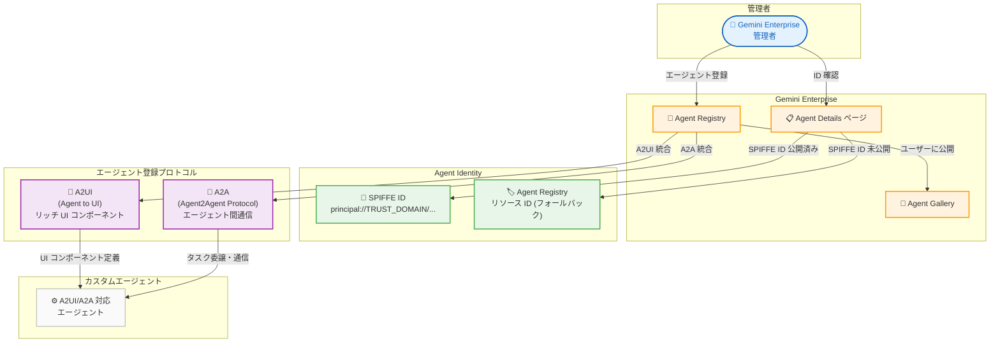

# Gemini Enterprise: Agent Identity 表示 & A2UI/A2A エージェント登録 (Preview)

**リリース日**: 2026-04-21

**サービス**: Gemini Enterprise

**機能**: エージェント ID (SPIFFE ID) の表示 / A2UI・A2A プロトコルによるエージェント登録

**ステータス**: Public Preview

[このアップデートのインフォグラフィックを見る](https://takech9203.github.io/google-cloud-news-summary/20260421-gemini-enterprise-agent-identity-a2a.html)

## 概要

Gemini Enterprise に 2 つのエージェント管理関連機能が Public Preview として追加された。1 つ目は、管理者がエージェントの詳細ページからエージェントの ID (通常は SPIFFE ID) を確認できる「Agent Identity」機能である。2 つ目は、Agent to UI (A2UI) プロトコルと Agent2Agent (A2A) プロトコルを使用してエージェントを登録・管理できる機能である。

Agent Identity 機能により、管理者はエージェントの認証基盤としての SPIFFE ID を可視化できるようになった。SPIFFE (Secure Production Identity Framework For Everyone) はゼロトラストセキュリティにおけるワークロード ID の標準フレームワークであり、Google Cloud ではエージェントに固有のプリンシパル識別子 (`principal://TRUST_DOMAIN/NAMESPACE/AGENT_NAME`) が自動的にプロビジョニングされる。パブリッシャーが SPIFFE ID を公開していない場合、Agent Registry のリソース ID がフォールバックとして表示される。

A2UI/A2A 登録機能により、管理者はカスタムエージェントを Gemini Enterprise の Web アプリケーション上でリッチな UI コンポーネント (カード、フォーム、チャート、テーブルなど) と共に提供でき、異なるビルダーやプラットフォームで構築されたエージェント間の相互通信も可能になった。対象ユーザーは、Gemini Enterprise を導入している組織の IT 管理者およびエージェント開発者である。

**アップデート前の課題**

- 管理者がエージェントの ID (SPIFFE ID) を Gemini Enterprise のコンソール上で直接確認する手段がなく、エージェントの認証情報の可視性が限定的だった
- A2A プロトコルによるエージェント登録は既存機能として存在していたが、A2UI プロトコルとの統合登録はサポートされておらず、リッチな UI を持つエージェントの構築と登録を一体的に行うワークフローがなかった
- カスタムエージェントの UI はテキストベースの応答に限られており、カード、フォーム、チャートなどの構造化された視覚要素をエージェントから直接生成して提供することが困難だった

**アップデート後の改善**

- Agent Details ページで SPIFFE ID が直接表示されるようになり、エージェントの認証基盤を管理コンソールから即座に確認できるようになった
- A2UI プロトコルと A2A プロトコルの統合により、リッチ UI 対応エージェントの登録・管理が Gemini Enterprise コンソールから可能になった
- A2UI SDK を使用することで、エージェントがカード、テーブル、フォームなどのインタラクティブな UI コンポーネントを JSON 形式で出力し、クライアント側でレンダリングできるようになった

## アーキテクチャ図



管理者は Agent Details ページでエージェントの SPIFFE ID を確認し、A2UI/A2A プロトコルを通じてカスタムエージェントを登録できる。A2UI はリッチ UI コンポーネントの定義を、A2A はエージェント間通信を担当する。

## サービスアップデートの詳細

### 主要機能

1. **Agent Identity (エージェント ID) の表示**
   - Gemini Enterprise の Agent Details ページでエージェントの SPIFFE ID を確認可能
   - SPIFFE ID は `principal://TRUST_DOMAIN/NAMESPACE/AGENT_NAME` 形式のプリンシパル識別子
   - Trust Domain は組織レベルで自動プロビジョニングされる (`agents.global.org-ORGANIZATION_ID.system.id.goog`)
   - パブリッシャーが SPIFFE ID を公開していない場合、Agent Registry リソース ID がフォールバックとして表示される
   - X.509 証明書が自動的にプロビジョニングされ、mTLS による安全な認証が可能

2. **A2UI (Agent to UI) によるエージェント登録**
   - エージェントが構造化された JSON を出力し、クライアント側でインタラクティブな UI コンポーネントとしてレンダリング
   - トランスポート非依存: A2UI ペイロードは A2A、MCP、REST、WebSocket など任意のプロトコル上で動作
   - カード、フォーム、チャート、テーブルなどのコンポーネントをサポート
   - A2UI SDK (`a2ui-agent-sdk`) によるスキーマ管理とバリデーション
   - MIME タイプ `application/json+a2ui` で A2A DataPart としてラッピング

3. **A2A (Agent2Agent) プロトコルとの統合登録**
   - A2A は異なるビルダーやプラットフォームのエージェント間での発見・協調・タスク委譲を可能にするオープン通信プロトコル
   - Google Cloud コンソールまたは REST API からエージェント登録が可能
   - OAuth 2.0 によるエンドユーザーアクセス制御をサポート (Cloud Run 上のエージェントでは IAM によるアクセス制御も可能)
   - Agent Card (JSON 形式) でエージェントの能力・スキル・入出力モードを宣言

## 技術仕様

### SPIFFE ID と Agent Identity

| 項目 | 詳細 |
|------|------|
| ID フォーマット | `principal://TRUST_DOMAIN/NAMESPACE/AGENT_NAME` |
| Trust Domain (組織あり) | `agents.global.org-ORGANIZATION_ID.system.id.goog` |
| Trust Domain (組織なし) | `agents.global.project-PROJECT_NUMBER.system.id.goog` |
| 証明書 | X.509 クライアント証明書 (自動プロビジョニング) |
| 認証方式 | mTLS (相互 TLS) |
| トークン有効期限 | デフォルト 1 時間 (証明書期限に依存して短縮される場合あり) |
| フォールバック | Agent Registry リソース ID |

### A2UI コンポーネント

| コンポーネント | 説明 |
|---------------|------|
| Card | 情報のサマリー表示 |
| Table | データの比較・一覧表示 |
| Form | ユーザー入力の受付 |
| Chart | データの可視化 |
| Button | アクションの実行 |
| Text / Heading | テキストコンテンツの表示 |

### A2A Agent Card (登録時の JSON 構造)

```json
{
  "protocolVersion": "v1.0",
  "name": "Agent Name",
  "description": "Agent description",
  "url": "https://example.com/myagent",
  "version": "1.0.0",
  "defaultInputModes": ["text/plain"],
  "defaultOutputModes": ["text/plain"],
  "capabilities": {
    "streaming": true,
    "pushNotifications": false
  },
  "skills": [
    {
      "id": "data-analysis",
      "name": "Data Analysis",
      "description": "Analyze data and provide insights",
      "tags": ["data", "analytics"]
    }
  ]
}
```

## 設定方法

### 前提条件

1. Gemini Enterprise Admin ロール (`discoveryengine.agentspaceAdmin`) が付与されていること
2. Discovery Engine API が有効化されていること
3. Gemini Enterprise アプリが作成済みであること
4. A2A プロトコルを使用するエージェントがホストされ、稼働していること

### 手順

#### ステップ 1: Agent Identity の確認

```
1. Google Cloud コンソールで Gemini Enterprise ページに移動
2. エージェントが登録されたアプリ名をクリック
3. [Agents] をクリック
4. 対象エージェント名をクリックして Agent Details ページを開く
5. SPIFFE ID またはフォールバックのリソース ID が表示される
```

#### ステップ 2: A2UI/A2A エージェントの登録 (コンソール)

```
1. Google Cloud コンソールで Gemini Enterprise ページに移動
2. エージェントを登録するアプリ名をクリック
3. [Agents] > [Add Agents] をクリック
4. [Custom agent via A2A] の [Add] をクリック
5. Agent Card JSON を入力 (A2UI 対応の場合は capabilities に A2UI 拡張を含める)
6. [Preview agent details] > [Next] をクリック
7. OAuth 2.0 設定を行うか、[Skip & Finish] でスキップ
```

#### ステップ 3: A2UI/A2A エージェントの登録 (REST API)

```bash
curl -X POST \
  -H "Authorization: Bearer $(gcloud auth print-access-token)" \
  -H "Content-Type: application/json" \
  "https://ENDPOINT_LOCATION-discoveryengine.googleapis.com/v1alpha/projects/PROJECT_ID/locations/LOCATION/collections/default_collection/engines/APP_ID/assistants/default_assistant/agents" \
  -d '{
    "name": "AGENT_NAME",
    "displayName": "AGENT_DISPLAY_NAME",
    "description": "AGENT_DESCRIPTION",
    "a2aAgentDefinition": {
      "jsonAgentCard": "{\"protocolVersion\":\"v1.0\",\"name\":\"AGENT_NAME\",\"description\":\"AGENT_DESCRIPTION\",\"url\":\"AGENT_URL\",\"version\":\"1.0.0\",\"defaultInputModes\":[\"text/plain\"],\"defaultOutputModes\":[\"text/plain\"],\"capabilities\":{},\"skills\":[{\"id\":\"skill-id\",\"name\":\"Skill Name\",\"description\":\"Skill description\"}]}"
    }
  }'
```

`ENDPOINT_LOCATION` は `us`、`eu`、または `global` を指定する。

## メリット

### ビジネス面

- **エージェントガバナンスの強化**: Agent Identity により、組織内で稼働するエージェントの認証基盤を一元的に可視化でき、コンプライアンス要件への対応が容易になる
- **エージェントエコシステムの拡張**: A2UI/A2A 統合により、リッチな UI を持つカスタムエージェントを Gemini Enterprise プラットフォーム上で迅速に展開でき、ユーザー体験を向上できる
- **ベンダーロックイン回避**: A2A はオープンプロトコルであり、異なるプラットフォームで構築されたエージェントを統一的に管理できる

### 技術面

- **ゼロトラストセキュリティ**: SPIFFE ベースの Agent Identity により、エージェント間の mTLS 認証が可能になり、サービスアカウントに依存しない安全な通信を実現できる
- **トランスポート非依存の UI 定義**: A2UI ペイロードは A2A、MCP、REST、WebSocket など任意のプロトコル上で動作するため、既存のインフラストラクチャに柔軟に統合できる
- **スキーマバリデーション**: A2UI SDK による出力バリデーションにより、LLM が生成する UI コンポーネントの構造的整合性を保証できる

## デメリット・制約事項

### 制限事項

- 本機能は Public Preview であり、Pre-GA Offerings Terms が適用される。SLA は提供されない
- SPIFFE ID はパブリッシャーが公開している場合のみ表示される。未公開の場合はリソース ID へのフォールバックとなるため、すべてのエージェントで SPIFFE ID を確認できるとは限らない
- A2A エージェントのセキュリティ保護には、開発者がエージェントのアプリケーションコード内で REST API を使用して Model Armor を設定する必要がある。Gemini Enterprise コンソールの Model Armor 設定は A2A エージェントには自動適用されない
- A2UI/A2A エージェントの利用には Gemini Enterprise Standard、Plus、または Frontline エディションが必要。Business エディションでは外部エージェントの利用がサポートされない

### 考慮すべき点

- A2A エージェントはユーザー自身でホスト・運用する必要があり、エージェントのアップタイム管理は利用者側の責任となる
- A2UI コンポーネントのレンダリングはクライアント側に依存するため、クライアントの対応状況によって表示が異なる可能性がある
- OAuth 2.0 による認証設定はオプションだが、Google Cloud リソースへのアクセスが必要な場合は設定が必要

## ユースケース

### ユースケース 1: セキュリティ監査におけるエージェント ID 確認

**シナリオ**: セキュリティチームが組織内で稼働するすべてのエージェントの認証基盤を棚卸しする際に、各エージェントの SPIFFE ID を確認して IAM ポリシーとの整合性を検証する。

**実装例**:
```bash
# REST API でエージェント一覧を取得し、SPIFFE ID を確認
curl -X GET \
  -H "Authorization: Bearer $(gcloud auth print-access-token)" \
  "https://global-discoveryengine.googleapis.com/v1alpha/projects/PROJECT_ID/locations/global/collections/default_collection/engines/APP_ID/assistants/default_assistant/agents"
```

**効果**: エージェント単位の認証情報を一元管理でき、VPC Service Controls のイングレス/エグレスルールにおいて Agent Identity を使用したきめ細かなアクセス制御が可能になる。

### ユースケース 2: データ分析ダッシュボードエージェントの構築

**シナリオ**: データエンジニアリングチームが、BigQuery のデータを分析してチャートやテーブルを含むリッチなダッシュボードを自動生成するエージェントを A2UI で構築し、Gemini Enterprise に登録する。

**実装例**:
```python
from a2ui.core.schema.manager import A2uiSchemaManager
from a2ui.basic_catalog.provider import BasicCatalog

schema_manager = A2uiSchemaManager(
    catalogs=[BasicCatalog.get_config()]
)

instruction = schema_manager.generate_system_prompt(
    role_description="BigQuery データ分析アシスタント",
    workflow_description="ユーザーのクエリを分析し、結果をチャートやテーブルで表示する",
    ui_description="集計結果にはテーブル、トレンドにはチャート、サマリーにはカードを使用",
    include_schema=True,
    include_examples=True,
    allowed_components=["Heading", "Text", "Card", "Table", "Chart"],
)
```

**効果**: エンドユーザーが Gemini Enterprise の Web アプリからテキストで質問するだけで、構造化されたチャートやテーブルを含む分析結果を受け取ることができ、BI ツールを個別に操作する必要がなくなる。

## 料金

Gemini Enterprise の料金はエディション別のサブスクリプション (ユーザーあたり月額) で構成される。Agent Identity および A2UI/A2A エージェント登録機能を利用するには、Standard 以上のエディションが必要である。

具体的な料金はエディション・契約期間によって異なる。最新の料金情報は公式ドキュメントを参照のこと。

| エディション | 外部エージェント利用 | Agent Marketplace | エンタープライズセキュリティ |
|-------------|-------------------|-------------------|------------------------|
| Business | 非対応 | 非対応 | 基本 |
| Standard | 対応 | 対応 | エンタープライズグレード |
| Plus | 対応 | 対応 | エンタープライズグレード |
| Frontline | 管理者がプロビジョニングしたエージェントのみ | 対応 | エンタープライズグレード |

## 利用可能リージョン

Gemini Enterprise はマルチリージョン (`global`、`us`、`eu`) で利用可能である。A2UI/A2A エージェント登録の API エンドポイントはマルチリージョンに対応しており、`us-discoveryengine.googleapis.com`、`eu-discoveryengine.googleapis.com`、`discoveryengine.googleapis.com` (global) のいずれかを指定する。

## 関連サービス・機能

- **Vertex AI Agent Engine**: ADK エージェントのホスティング基盤。Agent Identity (SPIFFE ID) のプロビジョニング元となる
- **A2A (Agent2Agent) Protocol**: Google が推進するオープンなエージェント間通信プロトコル。エージェントの発見・協調・タスク委譲を標準化
- **A2UI (Agent to UI)**: エージェントがリッチ UI コンポーネントを生成するためのプロトコル。ADK との統合 SDK が提供される
- **VPC Service Controls**: Agent Identity (SPIFFE ベース) をイングレス/エグレスルールで使用でき、エージェントのアクセス制御を強化
- **IAM (Identity and Access Management)**: Agent Identity のプリンシパル識別子を IAM ポリシーに統合し、きめ細かなアクセス制御が可能
- **Cloud Marketplace**: サードパーティベンダーの AI エージェントを発見・導入するマーケットプレイス
- **Model Armor**: A2A エージェントのセキュリティ保護に使用。REST API 経由での設定が必要

## 参考リンク

- [インフォグラフィック](https://takech9203.github.io/google-cloud-news-summary/20260421-gemini-enterprise-agent-identity-a2a.html)
- [公式リリースノート](https://cloud.google.com/release-notes#April_21_2026)
- [Agent Identity ドキュメント](https://docs.cloud.google.com/gemini/enterprise/docs/agents-overview#agent-identity)
- [A2UI/A2A エージェント登録ガイド](https://docs.cloud.google.com/gemini/enterprise/docs/a2ui-agents/register-and-manage-an-a2ui-agent)
- [A2UI コンポーネントギャラリーリファレンス](https://docs.cloud.google.com/gemini/enterprise/docs/a2ui-agents/a2ui-component-gallery-reference)
- [A2A エージェント登録・管理](https://docs.cloud.google.com/gemini/enterprise/docs/register-and-manage-an-a2a-agent)
- [A2UI 公式サイト](https://a2ui.org/introduction/what-is-a2ui/)
- [A2A Protocol 公式サイト](https://a2a-protocol.org/)
- [ADK A2UI 統合ドキュメント](https://adk.dev/integrations/a2ui/)
- [Agent Identity (Vertex AI Agent Engine)](https://docs.cloud.google.com/agent-builder/agent-engine/agent-identity)
- [Gemini Enterprise エディション比較](https://docs.cloud.google.com/gemini/enterprise/docs/editions)
- [Gemini Enterprise ライセンス管理](https://docs.cloud.google.com/gemini/enterprise/docs/licenses)

## まとめ

今回の Gemini Enterprise アップデートにより、エージェントのセキュリティガバナンスとカスタムエージェントの UI 体験が大幅に強化された。Agent Identity 機能は SPIFFE ベースのゼロトラストアーキテクチャをエージェント管理に導入し、VPC Service Controls や IAM と連携した包括的なアクセス制御を可能にする。A2UI/A2A 統合は、エージェントがテキスト応答だけでなくリッチなインタラクティブ UI を提供できるようにし、エンタープライズにおけるエージェント活用の幅を大きく広げる。Preview 段階であるため本番利用には注意が必要だが、エージェント管理基盤の構築を検討している組織は早期に評価を開始することを推奨する。

---

**タグ**: #GeminiEnterprise #AgentIdentity #SPIFFE #A2UI #A2A #AgentToUI #Agent2Agent #Preview #エージェント管理 #ゼロトラスト
