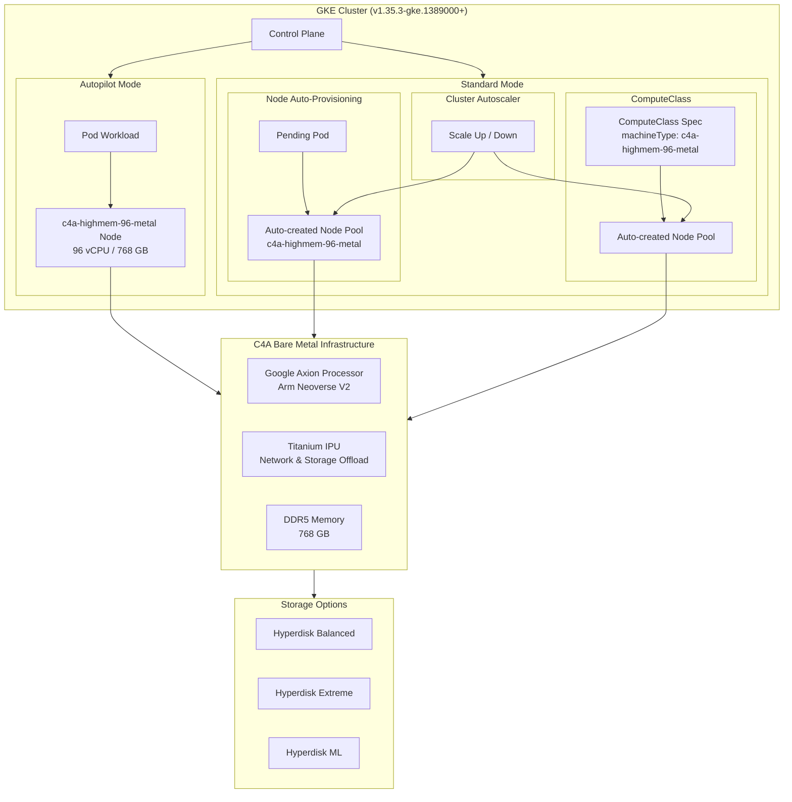

# Google Kubernetes Engine: C4A Highmem 96 Metal マシンタイプのサポート (Preview)

**リリース日**: 2026-04-21

**サービス**: Google Kubernetes Engine

**機能**: C4A Highmem 96 Metal Machine Type Support (Preview)

**ステータス**: Preview

[このアップデートのインフォグラフィックを見る](https://takech9203.github.io/google-cloud-news-summary/20260421-gke-c4a-highmem-96-metal.html)

## 概要

Google Kubernetes Engine (GKE) バージョン 1.35.3-gke.1389000 以降を実行するクラスタにおいて、C4A マシンシリーズの `c4a-highmem-96-metal` ベアメタルマシンタイプが Preview として利用可能になった。このアップデートにより、Autopilot モード、Node auto-provisioning、ComputeClasses によるノードプールの自動作成、および Cluster autoscaling の各機能で、Google Axion プロセッサ搭載の Arm ベアメタルインスタンスを活用できるようになる。

C4A ベアメタルインスタンスは、Google 独自設計の Axion プロセッサ (Arm Neoverse V2 ベース) を搭載し、96 vCPU と 768 GB の DDR5 メモリを提供する。仮想化レイヤーを介さずハードウェアに直接アクセスできるため、パフォーマンスの一貫性が求められるワークロードやカーネルレベルの最適化が必要なアプリケーションに最適である。

今回のアップデートの最大の特徴は、これまで GKE Standard クラスタでのみ利用可能だった C4A ベアメタルインスタンスが、Autopilot モードやノードの自動プロビジョニング機能でも利用可能になった点である。これにより、GKE のフルマネージドな運用モデルを維持しながら、ベアメタルのパフォーマンスを享受できるようになった。

**アップデート前の課題**

- C4A ベアメタルインスタンスは GKE Standard クラスタ (v1.35.0-gke.2232000 以降) でのみ利用可能であり、Autopilot モードやノード自動プロビジョニングでは使用できなかった
- Autopilot クラスタで Arm ベースの高メモリワークロードを実行する場合、仮想化された C4A VM (最大 72 vCPU / 576 GB) に制限されていた
- ベアメタルレベルのパフォーマンスが必要な場合、Standard クラスタを手動管理する必要があり、運用負荷が高かった

**アップデート後の改善**

- GKE バージョン 1.35.3-gke.1389000 以降で、Autopilot モード、Node auto-provisioning、ComputeClasses、Cluster autoscaling の各機能で `c4a-highmem-96-metal` が利用可能になった
- Autopilot クラスタでも 96 vCPU / 768 GB メモリのベアメタルノードを活用でき、仮想化オーバーヘッドのないパフォーマンスを実現
- ComputeClasses を使用してベアメタルノードの自動プロビジョニングを宣言的に構成でき、運用効率が大幅に向上

## アーキテクチャ図



GKE クラスタにおける `c4a-highmem-96-metal` ベアメタルインスタンスの利用パターンを示す。Autopilot モード、Node auto-provisioning、ComputeClasses の各経路からベアメタルノードがプロビジョニングされ、Google Axion プロセッサと Titanium IPU を搭載した物理インフラストラクチャ上で動作する。

## サービスアップデートの詳細

### 主要機能

1. **Autopilot モードでのベアメタルサポート**
   - Autopilot クラスタで `c4a-highmem-96-metal` マシンタイプを利用可能
   - GKE が自動的にノードのライフサイクルを管理しながら、ベアメタルパフォーマンスを提供
   - ワークロードの要件に基づいて自動的にベアメタルノードがプロビジョニングされる

2. **Node Auto-Provisioning によるベアメタルノードプール自動作成**
   - Pending Pod の要件に応じて、GKE が自動的に `c4a-highmem-96-metal` ノードプールを作成
   - マシンタイプを明示的に指定する必要がある (C4A マシンシリーズのみを指定した場合、GKE は C4A VM をプロビジョニングし、ベアメタルインスタンスは作成されない)
   - Cluster autoscaler と連携して動的にスケーリング

3. **ComputeClasses による宣言的なベアメタルノード構成**
   - ComputeClass リソースで `machineType: c4a-highmem-96-metal` を指定し、ノードプール自動作成を有効化
   - 優先度ルールを使用して、ベアメタルから VM へのフォールバック戦略を定義可能
   - Kubernetes の宣言的モデルに沿った運用が可能

4. **Cluster Autoscaling 統合**
   - ベアメタルノードプールのスケールアップ/スケールダウンを自動管理
   - ワークロードの需要に応じてベアメタルノードを動的に追加・削除

## 技術仕様

### C4A Highmem 96 Metal マシンタイプ

| 項目 | 詳細 |
|------|------|
| マシンタイプ名 | `c4a-highmem-96-metal` |
| プロセッサ | Google Axion (Arm Neoverse V2) |
| vCPU 数 | 96 |
| メモリ | 768 GB DDR5 |
| メモリ/vCPU 比率 | 8 GB/vCPU (highmem) |
| ネットワーク帯域 (標準) | 最大 50 Gbps |
| ネットワーク帯域 (Tier_1) | 最大 100 Gbps |
| ストレージ | Hyperdisk Balanced / Extreme / ML |
| SMT (同時マルチスレッディング) | 非対応 (1 vCPU = 1 物理コア) |
| インフラ | Titanium IPU によるネットワーク・ストレージオフロード |

### GKE バージョン要件

| 利用パターン | 必要な GKE バージョン |
|------|------|
| Autopilot モード | 1.35.3-gke.1389000 以降 |
| Node auto-provisioning | 1.35.3-gke.1389000 以降 |
| ComputeClasses (自動ノードプール作成) | 1.35.3-gke.1389000 以降 |
| Cluster autoscaling | 1.35.3-gke.1389000 以降 |
| Standard クラスタ (手動ノードプール) | 1.35.0-gke.2232000 以降 |

### ComputeClass 設定例

```yaml
apiVersion: cloud.google.com/v1
kind: ComputeClass
metadata:
  name: c4a-bare-metal
spec:
  priorities:
    - machineType: c4a-highmem-96-metal
    - machineFamily: c4a
  nodePoolAutoCreation:
    enabled: true
  whenUnsatisfiable: ScaleUpAnyway
```

## 設定方法

### 前提条件

1. GKE クラスタがバージョン 1.35.3-gke.1389000 以降で動作していること
2. C4A ベアメタルインスタンスが利用可能なリージョン/ゾーンにクラスタが存在すること
3. `gcloud` CLI が最新バージョンにアップデートされていること

### 手順

#### ステップ 1: Autopilot クラスタの作成

```bash
gcloud container clusters create-auto my-cluster \
    --region=us-central1 \
    --cluster-version=1.35.3-gke.1389000
```

Autopilot モードのクラスタを作成する。GKE が自動的にベアメタルノードを含むインフラストラクチャを管理する。

#### ステップ 2: ComputeClass の作成 (Standard クラスタの場合)

```yaml
# c4a-metal-computeclass.yaml
apiVersion: cloud.google.com/v1
kind: ComputeClass
metadata:
  name: c4a-bare-metal
spec:
  priorities:
    - machineType: c4a-highmem-96-metal
    - machineFamily: c4a
  nodePoolAutoCreation:
    enabled: true
  whenUnsatisfiable: ScaleUpAnyway
```

```bash
kubectl apply -f c4a-metal-computeclass.yaml
```

ComputeClass を適用し、ベアメタルインスタンスを優先、C4A VM をフォールバックとする構成を定義する。

#### ステップ 3: ワークロードのデプロイ

```yaml
# deployment.yaml
apiVersion: apps/v1
kind: Deployment
metadata:
  name: high-memory-workload
spec:
  replicas: 1
  selector:
    matchLabels:
      app: high-memory-workload
  template:
    metadata:
      labels:
        app: high-memory-workload
    spec:
      nodeSelector:
        cloud.google.com/compute-class: c4a-bare-metal
      containers:
        - name: app
          image: my-app:latest
          resources:
            requests:
              cpu: "48"
              memory: "384Gi"
```

```bash
kubectl apply -f deployment.yaml
```

ComputeClass を指定した Deployment をデプロイする。GKE が自動的にベアメタルノードプールを作成し、Pod をスケジュールする。

#### ステップ 4: Node auto-provisioning の有効化 (クラスタレベル)

```bash
gcloud container clusters update my-cluster \
    --region=us-central1 \
    --enable-autoprovisioning \
    --min-cpu=0 --max-cpu=192 \
    --min-memory=0 --max-memory=1536
```

クラスタレベルで Node auto-provisioning を有効化し、リソース上限を設定する。

## メリット

### ビジネス面

- **運用コストの削減**: Autopilot モードと組み合わせることで、ベアメタルインフラストラクチャの管理負荷を大幅に軽減しつつ、最大パフォーマンスを実現
- **価格性能比の最適化**: Google Axion プロセッサの電力効率の高さにより、同等の x86 ベアメタルインスタンスと比較して優れた価格性能比を実現
- **柔軟なスケーリング**: Cluster autoscaler との統合により、需要に応じたベアメタルリソースの動的なスケーリングが可能

### 技術面

- **仮想化オーバーヘッドの排除**: ベアメタルインスタンスはハイパーバイザーなしで動作するため、CPU やメモリへの直接アクセスにより一貫したパフォーマンスを実現
- **大容量メモリ**: 768 GB DDR5 メモリにより、インメモリデータベースや大規模データ処理ワークロードに対応
- **高帯域ネットワーク**: Titanium IPU によるネットワークオフロードと Tier_1 ネットワーキングで最大 100 Gbps の帯域を提供
- **宣言的インフラ管理**: ComputeClasses を活用した Kubernetes ネイティブなインフラ構成管理

## デメリット・制約事項

### 制限事項

- Preview ステータスのため、本番環境での利用には注意が必要 (SLA の適用外となる可能性がある)
- Local SSD がサポートされない
- ライブマイグレーションがサポートされないため、メンテナンスイベント時にノードの再起動が発生する
- Autopilot のマシンシリーズ最適化 (Pod Performance 機能) でのプロビジョニングは非対応 (マシンタイプの明示的指定が必要)
- Confidential GKE Nodes、Compact placement、SMT、Persistent disks (Hyperdisk 使用)、Nested virtualization、GPU はいずれもサポート外

### 考慮すべき点

- C4A マシンシリーズのみを指定した場合 (マシンタイプを明示しない場合)、GKE は C4A VM をプロビジョニングし、ベアメタルインスタンスは作成されない。ベアメタルを利用するには `machineType: c4a-highmem-96-metal` を明示的に指定する必要がある
- Arm アーキテクチャ (aarch64) に対応したコンテナイメージが必要。x86 向けにビルドされたイメージはそのままでは動作しない
- ベアメタルインスタンスはリソースが大きいため、ノードのスケールアップ/スケールダウンに要する時間が通常の VM より長くなる可能性がある
- Preview へのアクセスにはリクエストフォームからの申請が必要な場合がある

## ユースケース

### ユースケース 1: インメモリデータベースのホスティング

**シナリオ**: Redis、Memcached、Apache Ignite などのインメモリデータベースを大容量メモリ環境で実行し、仮想化オーバーヘッドなしに安定したレイテンシを実現したい。

**実装例**:
```yaml
apiVersion: cloud.google.com/v1
kind: ComputeClass
metadata:
  name: inmemory-db
spec:
  priorities:
    - machineType: c4a-highmem-96-metal
  nodePoolAutoCreation:
    enabled: true
  whenUnsatisfiable: DoNotScaleUp
---
apiVersion: apps/v1
kind: StatefulSet
metadata:
  name: redis-cluster
spec:
  replicas: 3
  selector:
    matchLabels:
      app: redis
  template:
    metadata:
      labels:
        app: redis
    spec:
      nodeSelector:
        cloud.google.com/compute-class: inmemory-db
      containers:
        - name: redis
          image: redis:7-arm64
          resources:
            requests:
              cpu: "32"
              memory: "256Gi"
```

**効果**: 768 GB のメモリを活用して大規模なインメモリデータセットを保持でき、仮想化レイヤーの排除により予測可能な低レイテンシを実現する。

### ユースケース 2: Arm ネイティブ CI/CD パイプライン

**シナリオ**: Arm アーキテクチャ向けのコンテナイメージやアプリケーションをネイティブ環境でビルド・テストしたい。クロスコンパイルではなくネイティブビルドによりビルド時間を短縮する。

**効果**: 96 物理コアの並列処理能力により、大規模な Arm ネイティブビルドを高速に実行できる。Autopilot モードとの組み合わせにより、CI/CD パイプラインの実行時のみベアメタルノードがプロビジョニングされ、アイドル時のコストを最小化できる。

### ユースケース 3: 高性能コンピューティング (HPC) ワークロード

**シナリオ**: 科学計算、金融リスク分析、ゲノム解析などの HPC ワークロードを、Arm アーキテクチャの電力効率を活かしてコスト効率よく実行したい。

**効果**: ベアメタルの直接ハードウェアアクセスと 768 GB の大容量メモリにより、大規模データセットを扱う計算処理を効率的に実行できる。Cluster autoscaler との統合により、ジョブの需要に応じてベアメタルノードを動的にスケーリングし、リソースの最適利用を実現する。

## 料金

C4A ベアメタルインスタンスは Preview ステータスであり、正式な料金体系は GA 時に確定する。参考として、C4A マシンシリーズの一般的な料金モデルを以下に示す。

### 料金モデル

| 料金オプション | 説明 |
|--------|-----------------|
| オンデマンド | 使用した分だけの従量課金 |
| Committed Use Discounts (CUD) | 1 年または 3 年のコミットメントで割引 |
| Spot VM | 該当なし (ベアメタルでは Spot は利用不可) |
| Reservations | 容量予約による利用が可能 |

具体的な料金については、[Compute Engine の料金ページ](https://cloud.google.com/compute/vm-instance-pricing)を参照のこと。C4A マシンシリーズは Arm ベースの電力効率の高いプロセッサを搭載しているため、同等スペックの x86 マシンタイプと比較して有利な価格設定となる傾向がある。

## 利用可能リージョン

C4A ベアメタルインスタンス (`c4a-highmem-96-metal`) は現在 Preview として以下のリージョン/ゾーンで利用可能である。

| リージョン | ゾーン | ロケーション |
|------|------|------|
| us-central1 | us-central1-b, us-central1-c | アイオワ州カウンシルブラフス |
| us-east4 | us-east4-b | バージニア州アッシュバーン |
| europe-west3 | europe-west3-a, europe-west3-b, europe-west3-c | ドイツ・フランクフルト |
| europe-west4 | europe-west4-a, europe-west4-b, europe-west4-c | オランダ・エームスハーフェン |

最新のリージョン情報については、[ベアメタルインスタンスのリージョン別可用性](https://cloud.google.com/compute/docs/instances/bare-metal-instances#regional-availability)を参照のこと。

## 関連サービス・機能

- **[Compute Engine C4A マシンシリーズ](https://cloud.google.com/compute/docs/general-purpose-machines#c4a_series)**: GKE ノードの基盤となる C4A ベアメタルインスタンスの Compute Engine レベルの仕様
- **[GKE Autopilot](https://cloud.google.com/kubernetes-engine/docs/concepts/autopilot-overview)**: フルマネージドの GKE 運用モードで、今回のアップデートによりベアメタルノードもサポート
- **[ComputeClasses](https://cloud.google.com/kubernetes-engine/docs/concepts/about-compute-classes)**: ワークロードのコンピュートリソース要件を宣言的に定義するための GKE リソース
- **[Node Auto-Provisioning](https://cloud.google.com/kubernetes-engine/docs/concepts/node-auto-provisioning)**: Pod の要件に基づいてノードプールを自動作成する GKE 機能
- **[Arm on GKE](https://cloud.google.com/kubernetes-engine/docs/concepts/arm-on-gke)**: GKE での Arm ノードの利用に関する概要ドキュメント
- **[Google Axion プロセッサ](https://cloud.google.com/blog/products/compute/introducing-googles-new-arm-based-cpu)**: C4A を支える Google 独自設計の Arm プロセッサ

## 参考リンク

- [このアップデートのインフォグラフィック](https://takech9203.github.io/google-cloud-news-summary/20260421-gke-c4a-highmem-96-metal.html)
- [公式リリースノート](https://cloud.google.com/release-notes#April_21_2026)
- [GKE での Arm ノードの利用](https://cloud.google.com/kubernetes-engine/docs/concepts/arm-on-gke)
- [C4A マシンシリーズのドキュメント](https://cloud.google.com/compute/docs/general-purpose-machines#c4a_series)
- [ベアメタルインスタンス](https://cloud.google.com/compute/docs/instances/bare-metal-instances)
- [ComputeClasses の概要](https://cloud.google.com/kubernetes-engine/docs/concepts/about-compute-classes)
- [Node Auto-Provisioning の設定](https://cloud.google.com/kubernetes-engine/docs/how-to/node-auto-provisioning)
- [Compute Engine の料金](https://cloud.google.com/compute/vm-instance-pricing)

## まとめ

今回のアップデートにより、GKE の Autopilot モードや自動プロビジョニング機能で C4A ベアメタルインスタンスが利用可能になり、フルマネージドな Kubernetes 運用とベアメタルのパフォーマンスを両立できるようになった。特に、大容量メモリ (768 GB) と仮想化オーバーヘッドの排除が求められるインメモリデータベースや HPC ワークロードに大きな価値をもたらす。現在は Preview ステータスであるため、本番環境への導入前に十分なテストを行い、GA へのロードマップを注視することを推奨する。

---

**タグ**: #GoogleCloud #GKE #GoogleKubernetesEngine #C4A #BareMetalInstance #Axion #Arm #Autopilot #NodeAutoProvisioning #ComputeClasses #ClusterAutoscaling #Preview
