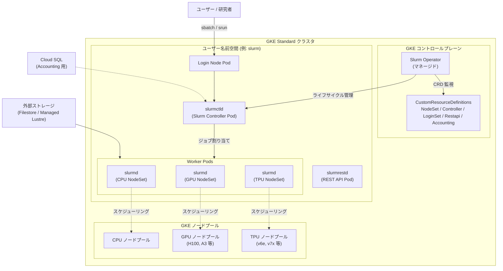

# Google Kubernetes Engine: Slurm Operator Add-on for GKE (Preview)

**リリース日**: 2026-04-21

**サービス**: Google Kubernetes Engine

**機能**: Slurm Operator Add-on for GKE (Preview)

**ステータス**: Preview

[このアップデートのインフォグラフィックを見る](https://takech9203.github.io/google-cloud-news-summary/20260421-gke-slurm-operator-addon.html)

## 概要

GKE バージョン 1.35.2-gke.1842000 以降において、Slurm Operator アドオンを GKE クラスタにインストールできるようになりました (Preview)。Slurm はハイパフォーマンスコンピューティング (HPC) 分野で広く採用されているオープンソースのワークロードマネージャーおよびジョブスケジューラーです。今回のアドオンにより、GKE のスケーラビリティとリソース管理能力を活かしながら、Slurm のバッチジョブスケジューリング機能を同一クラスタ上で利用できるようになります。

本アドオンは、オープンソースプロジェクト「Slinky」の一部として開発された Slurm Operator のマネージドインストールを提供します。Google のベストプラクティスに従ったインストールと運用が行われ、Operator は GKE コントロールプレーン上で実行されます。CPU、GPU、TPU マシンを含む多様なハードウェア上で、AI/ML および HPC ワークロードを実行するためのカスタマイズ可能なプラットフォームの基盤を構築できます。

対象ユーザーは、Slurm ベースの HPC/AI ワークロードを Kubernetes 環境に統合したいプラットフォームエンジニア、AI/ML エンジニア、データ管理者です。特に、Slurm の設定を完全にコントロールしたい、カスタムコンテナを統合したい、Ray や推論サービングなどの他のワークロードと同一クラスタ上で Slurm ジョブを実行したいといったニーズを持つ組織に最適です。

**アップデート前の課題**

- GKE 上で Slurm スケジューリング機能を利用するには、Slurm Operator を手動でインストール・設定・管理する必要があり、運用負荷が高かった
- Slurm は従来ベアメタルサーバーや VM 上に直接デプロイされることが多く、Kubernetes との統合には専門的な知識と複雑な設定が必要だった
- HPC バッチジョブと Kubernetes ワークロード (推論サービング、Ray ジョブなど) を同一のコンピュートプールで実行する統合インフラの構築が困難だった

**アップデート後の改善**

- `--addons=SlurmOperator` フラグを指定するだけで、GKE Standard クラスタに Slurm Operator をマネージドインストールできるようになった
- GKE コントロールプレーン上で Operator が動作し、証明書の生成やカスタムリソースの管理などの前提条件が自動的に処理される
- Slurm バッチジョブと Kubernetes ネイティブワークロード (Ray、推論サービングなど) を同一クラスタの共有ハードウェア上で並行実行できるようになった
- Kubernetes カスタムリソース (NodeSet、Controller、LoginSet など) を使って、宣言的に Slurm クラスタトポロジーを定義できる

## アーキテクチャ図



この図は、Slurm Operator アドオンを有効化した GKE クラスタの全体アーキテクチャを示しています。Slurm Operator は GKE コントロールプレーン上でマネージドコンポーネントとして動作し、ユーザー名前空間内の Slurm コンポーネント (コントローラー、ワーカー、ログインノード) のライフサイクルを管理します。ユーザーは Slurm の標準コマンド (sbatch, srun) を使用してジョブを送信し、ジョブは GPU/TPU を含む各ノードプール上のワーカーに割り当てられます。

## サービスアップデートの詳細

### 主要機能

1. **マネージド Slurm Operator インストール**
   - `--addons=SlurmOperator` フラグで新規または既存の GKE Standard クラスタに有効化
   - Operator は GKE コントロールプレーン上で実行され、Google が Operator のライフサイクルを管理
   - 証明書の生成やカスタムリソース定義 (CRD) の管理が自動化される

2. **Kubernetes カスタムリソースによる Slurm クラスタ定義**
   - **NodeSet**: 同質なワーカーノードのセットを定義。H100 GPU 用、TPU 用など、ハードウェアタイプごとに作成可能
   - **Controller**: Slurm コントローラー (slurmctld) を定義。NodeSet や LoginSet など他のコンポーネントも管理
   - **LoginSet**: ユーザーがジョブを送信するためのログインノードを定義
   - **Restapi**: Slurm REST API コンポーネントを定義
   - **Accounting**: slurmdbd コンポーネントをデプロイし、ジョブアカウンティングと使用状況追跡を管理 (Cloud SQL と連携可能)

3. **Helm チャートによるデプロイ**
   - オープンソースの Slurm Helm チャートを使用して、Slurm クラスタコンポーネントを GKE 上にデプロイ
   - values.yaml でコンテナイメージ、レプリカ数、ノードセレクター、ボリュームマウントなどを宣言的に設定
   - Google 提供の最適化されたコンテナイメージ (gcr.io/gke-release/slinky/) を利用可能

4. **共有ストレージ統合**
   - Filestore や Managed Lustre との統合をサポート
   - ログインノードとワーカーノード間で共有ストレージをマウント可能
   - Slurm ジョブのデータ共有とスクリプト配布に活用

5. **カスタムイメージサポート**
   - Google 提供のベースイメージに加え、カスタムコンテナイメージの利用が可能
   - ワーカーノードやログインノードに独自のソフトウェアスタック (Python、JAX など) を組み込める

## 技術仕様

### 対応バージョンとクラスタ要件

| 項目 | 詳細 |
|------|------|
| 最低 GKE バージョン | 1.35.2-gke.1842000 |
| 対応クラスタモード | GKE Standard のみ (Autopilot は非対応) |
| ステータス | Preview (Pre-GA) |
| Helm チャートバージョン | 1.0.2 (ghcr.io/slinkyproject/charts/slurm) |
| コンテナイメージ | gcr.io/gke-release/slinky/ (slurmctld, slurmd, slurmrestd, login) |
| 対応ハードウェア | CPU, GPU (H100 等), TPU (v6e, v7x 等) |

### Slurm コンポーネント構成

| コンポーネント | Pod 名 | 役割 |
|---|---|---|
| slurmctld | slurm-controller-0 | Slurm クラスタコントローラー。ジョブスケジューリングとリソース管理 |
| slurmrestd | slurm-restapi-* | Slurm REST API エンドポイント |
| slurmd | slurm-worker-* | Slurm ワーカーデーモン。実際のジョブを実行 |
| login | slurm-login-* | ユーザーがジョブを送信するためのログインノード |
| slurmdbd | (Accounting 設定時) | ジョブアカウンティングデータベースデーモン |

### 責任共有モデル

| 責任範囲 | Google の責任 | 顧客の責任 |
|---|---|---|
| Operator | インストールとライフサイクル管理 | - |
| コントロールプレーン | 信頼性とアップタイムの管理 | - |
| CRD | カスタムリソースの管理 | - |
| ベースイメージ | 最適化されたコンテナイメージの提供 | カスタムイメージの管理 (任意) |
| Slurm 設定 | - | クラスタトポロジー、パーティション、プラグインの定義 |
| ジョブ管理 | - | ユーザーアクセスとジョブ送信ワークフロー |
| 外部依存関係 | - | Cloud SQL、Filestore 等の管理 |

## 設定方法

### 前提条件

1. Google Kubernetes Engine API が有効であること
2. gcloud CLI がインストール済みかつ最新バージョンであること
3. Helm 3.8.0 以降がインストール済みであること
4. OS Login を使用する場合は SSH キーペアが生成済みであること

### 手順

#### ステップ 1: Slurm Operator アドオンを有効化した GKE クラスタの作成

```bash
# 新規クラスタ作成時に有効化
gcloud container clusters create CLUSTER_NAME \
  --location LOCATION \
  --cluster-version=1.35.2-gke.1842000 \
  --project=PROJECT_ID \
  --addons=SlurmOperator
```

新規クラスタ作成時に `--addons=SlurmOperator` フラグを指定します。GKE バージョンは 1.35.2-gke.1842000 以降を指定する必要があります。

#### ステップ 2: 既存クラスタへの有効化 (既存クラスタの場合)

```bash
# 既存クラスタに有効化
gcloud container clusters update CLUSTER_NAME \
  --location=LOCATION \
  --update-addons=SlurmOperator=ENABLED
```

既存の GKE Standard クラスタに対しても、update コマンドでアドオンを有効化できます。

#### ステップ 3: アドオンの有効化確認

```bash
gcloud container clusters describe CLUSTER_NAME \
  --location=LOCATION
```

出力に以下が含まれていれば有効化成功です。

```yaml
addonsConfig:
  slurmOperatorConfig:
    enabled: true
```

#### ステップ 4: Helm チャートの設定ファイル作成

```yaml
# values.yaml
controller:
  slurmctld:
    image:
      repository: gcr.io/gke-release/slinky/slurmctld
      tag: IMAGE_TAG
  reconfigure:
    image:
      repository: gcr.io/gke-release/slinky/slurmctld
      tag: IMAGE_TAG
restapi:
  replicas: 1
  slurmrestd:
    image:
      repository: gcr.io/gke-release/slinky/slurmrestd
      tag: IMAGE_TAG
nodesets:
  slinky:
    replicas: 1
    slurmd:
      image:
        repository: gcr.io/gke-release/slinky/slurmd
        tag: IMAGE_TAG
      podSpec:
        nodeSelector:
          cloud.google.com/gke-nodepool: NODE_POOL_NAME
        tolerations:
          - key: "slurm-worker"
            operator: "Equal"
            value: "true"
            effect: "NoSchedule"
loginsets:
  slinky:
    enabled: true
    replicas: 1
    login:
      image:
        repository: gcr.io/gke-release/slinky/login
        tag: IMAGE_TAG
```

`IMAGE_TAG` は Artifact Registry で確認したイメージタグ (例: `25.11-ubuntu24.04-gke.4`) に置き換えます。

#### ステップ 5: Helm チャートによる Slurm クラスタのデプロイ

```bash
# kubectl の認証情報設定
gcloud container clusters get-credentials CLUSTER_NAME

# Slurm Helm チャートのインストール
helm install slurm oci://ghcr.io/slinkyproject/charts/slurm \
  --namespace=slurm --create-namespace --version 1.0.2 -f values.yaml
```

#### ステップ 6: デプロイの確認

```bash
# Pod ステータスの確認
kubectl get pods --namespace slurm

# Slurm ノードの確認
kubectl exec -it deployment/slurm-login-slinky -n slurm -- sinfo
```

すべての Pod が `Running` ステータスで表示され、`sinfo` コマンドでワーカーノードが一覧表示されれば、デプロイは成功です。

## メリット

### ビジネス面

- **統合インフラによるコスト最適化**: Slurm HPC バッチジョブと Kubernetes マイクロサービスを単一の GKE クラスタで管理することで、運用サイロを排除しインフラコストを最適化できる
- **AI/HPC への迅速なアクセス**: Google Cloud の最新アクセラレータ (GPU, TPU) に Slurm コマンドで直接アクセスでき、AI/ML 研究の開始までの時間を短縮
- **運用負荷の軽減**: Slurm Operator のインストールとライフサイクル管理を Google が担当するため、プラットフォームチームは Slurm の設定とユーザー管理に集中できる

### 技術面

- **宣言的なインフラ管理**: Kubernetes カスタムリソースを使って Slurm クラスタトポロジーを YAML で宣言的に定義・管理できる
- **効率的なスケーリング**: GKE の高速ノードプロビジョニングと効率的なビンパッキングにより、リソース使用率を最適化
- **柔軟なカスタマイズ**: カスタムコンテナイメージ、Slurm プラグイン、パーティション設定などを自由にカスタマイズ可能
- **共有ストレージ統合**: Filestore や Managed Lustre との統合により、大規模データセットの共有が容易

## デメリット・制約事項

### 制限事項

- GKE Standard クラスタのみサポートされ、Autopilot クラスタでは利用不可
- Preview ステータスのため、SLA の対象外であり、サポートが限定的
- GKE バージョン 1.35.2-gke.1842000 以降が必須であり、それ以前のバージョンでは利用不可
- LoginSet を有効にすると、デフォルトで外部パブリック IP を持つ LoadBalancer が作成されるため、セキュリティリスクに注意が必要

### 考慮すべき点

- Preview 機能であるため、本番環境での使用は慎重に検討する必要がある (Pre-GA Offerings Terms が適用)
- Slurm の設定 (トポロジー、パーティション、プラグイン) は顧客の責任であり、Slurm に関する深い知識が必要
- 外部依存関係 (Cloud SQL for Accounting、Filestore/Lustre for 共有ストレージ) の設定と管理も顧客の責任
- フルマネージドな体験を求める場合は、Cluster Director の利用も検討すべき

## ユースケース

### ユースケース 1: 大規模 AI モデルトレーニングと推論サービングの統合

**シナリオ**: AI 研究チームが大規模言語モデル (LLM) のトレーニングジョブを Slurm で管理しつつ、同じ GPU クラスタ上でトレーニング済みモデルの推論サービングを Kubernetes で運用するケース。

**実装例**:
```yaml
# GPU ワーカー用の NodeSet 定義 (values.yaml の一部)
nodesets:
  gpu-training:
    replicas: 8
    slurmd:
      image:
        repository: gcr.io/gke-release/slinky/slurmd
        tag: 25.11-ubuntu24.04-gke.4
      podSpec:
        nodeSelector:
          cloud.google.com/gke-accelerator: nvidia-h100-80gb
        resources:
          limits:
            nvidia.com/gpu: 8
```

**効果**: トレーニングジョブが実行されていない時間帯に GPU リソースを推論サービングに割り当てるなど、高価な GPU リソースの利用率を最大化できる。

### ユースケース 2: HPC シミュレーションのクラウド移行

**シナリオ**: オンプレミスの Slurm クラスタで科学技術計算シミュレーションを実行している研究機関が、GKE 上の Slurm 環境に移行するケース。既存の Slurm ジョブスクリプトやワークフローをそのまま活用したい。

**実装例**:
```bash
# 既存の Slurm ジョブスクリプトをそのまま送信
sbatch --partition=cpu-compute --nodes=16 simulation_job.sh

# GPU を使用する並列計算ジョブ
srun --partition=gpu-compute --gres=gpu:4 --nodes=4 mpi_training.sh
```

**効果**: 既存の Slurm ワークフローを変更することなくクラウドに移行でき、GKE のオートスケーリングにより、ピーク時のリソース不足とアイドル時のコスト浪費を同時に解消できる。

### ユースケース 3: マルチテナント AI プラットフォームの構築

**シナリオ**: 大企業の AI プラットフォームチームが、複数の研究チームに共有 GPU/TPU リソースを Slurm のジョブスケジューリングで公平に配分するプラットフォームを構築するケース。

**効果**: Slurm のフェアシェアスケジューリングとリソースリミットにより、複数チーム間での公平なリソース配分を実現しつつ、GKE の統合管理によりプラットフォーム運用の複雑さを軽減できる。

## 料金

Slurm Operator アドオン自体に追加料金は発生しません。課金は使用する GKE クラスタとコンピュートリソースに対して標準の GKE 料金が適用されます。

### 料金の構成要素

| 項目 | 料金体系 |
|------|---------|
| GKE クラスタ管理費 | Standard クラスタ: $0.10/時間 |
| コンピュートノード | 使用するマシンタイプに応じた Compute Engine 料金 |
| GPU (例: NVIDIA H100) | GPU タイプとリージョンに応じた料金 |
| TPU (例: v6e) | TPU タイプとリージョンに応じた料金 |
| 共有ストレージ (Filestore) | 容量とパフォーマンスティアに応じた料金 |
| Cloud SQL (Accounting 用) | インスタンスタイプとストレージに応じた料金 (任意) |
| Slurm Operator アドオン | 追加料金なし |

Preview 期間中の料金体系は変更される可能性があります。詳細は [GKE の料金ページ](https://cloud.google.com/kubernetes-engine/pricing) をご確認ください。

## 利用可能リージョン

Slurm Operator アドオンは、GKE Standard クラスタが利用可能なすべてのリージョンで使用できます。ただし、GPU や TPU ノードプールの作成は、対応するアクセラレータが利用可能なリージョン・ゾーンに限定されます。アクセラレータの利用可能リージョンについては、[GPU リージョンとゾーン](https://cloud.google.com/compute/docs/gpus/gpu-regions-zones) および [TPU リージョンとゾーン](https://cloud.google.com/tpu/docs/regions-zones) を参照してください。

## 関連サービス・機能

- **Cluster Director**: Slurm のフルマネージド体験を提供する Google Cloud プロダクト。Google が Slurm コントロールプレーン、ソフトウェアバージョン、設定を管理。最小限の設定でマネージド体験を求める場合に推奨
- **Cluster Toolkit**: GKE や Compute Engine 上のクラスタ設定とデプロイを簡素化するオープンソースツール。定義済みブループリントによる一般的な構成のデプロイが可能
- **GKE managed DRANET**: Kubernetes Dynamic Resource Allocation (DRA) API を活用した高性能ネットワーキング機能。A3 Ultra 以降の GPU インスタンスや TPU v6e/v7x をサポート
- **Filestore / Managed Lustre**: Slurm ジョブの共有ストレージとして利用可能な高性能ファイルストレージサービス
- **Cloud SQL**: Slurm のジョブアカウンティング (slurmdbd) のバックエンドデータベースとして利用可能

## 参考リンク

- [インフォグラフィック](https://takech9203.github.io/google-cloud-news-summary/20260421-gke-slurm-operator-addon.html)
- [公式リリースノート](https://cloud.google.com/release-notes#April_21_2026)
- [About Slurm on GKE (概要)](https://docs.cloud.google.com/kubernetes-engine/docs/add-on/slurm-on-gke/concepts/overview)
- [Slurm Operator アドオンの有効化](https://docs.cloud.google.com/kubernetes-engine/docs/add-on/slurm-on-gke/how-to/enable-slurm-operator-addon)
- [クイックスタート: GKE 上に Slurm クラスタをデプロイ](https://docs.cloud.google.com/kubernetes-engine/docs/add-on/slurm-on-gke/quickstarts/deploy-slurm-on-gke)
- [Slurm 共有ストレージ (Filestore)](https://docs.cloud.google.com/kubernetes-engine/docs/add-on/slurm-on-gke/how-to/slurm-shared-storage-filestore)
- [Slinky Project (GitHub)](https://github.com/SlinkyProject)
- [GKE 料金ページ](https://cloud.google.com/kubernetes-engine/pricing)

## まとめ

Slurm Operator アドオン for GKE (Preview) は、HPC 分野のデファクトスタンダードである Slurm のスケジューリング機能を GKE のマネージド Kubernetes 環境にネイティブ統合する重要なアップデートです。AI/ML トレーニング、科学技術計算、大規模バッチ処理を GKE 上で実行したい組織にとって、Slurm の運用知見を活かしながらクラウドネイティブなインフラ管理のメリットを享受できる選択肢が追加されました。まずは Preview 環境で検証を行い、既存の Slurm ワークフローとの互換性や GPU/TPU の活用方法を確認することを推奨します。

---

**タグ**: #GoogleKubernetesEngine #GKE #Slurm #SlurmOperator #HPC #AI #ML #GPU #TPU #Kubernetes #SlinkyProject #Preview
