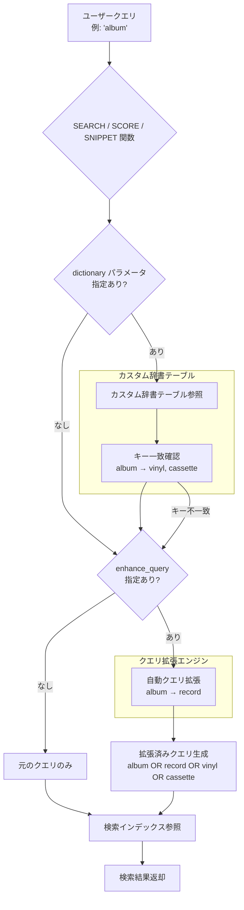

# Spanner: 全文検索でカスタム辞書によるシノニムマッピングをサポート

**リリース日**: 2026-04-21

**サービス**: Cloud Spanner

**機能**: Full-Text Search Custom Dictionaries (カスタム辞書)

**ステータス**: GA (一般提供)

[このアップデートのインフォグラフィックを見る](https://takech9203.github.io/google-cloud-news-summary/20260421-spanner-full-text-search-custom-dictionaries.html)

## 概要

Cloud Spanner の全文検索機能において、カスタム辞書 (Custom Dictionaries) を使用したシノニム (同義語) マッピングの作成がサポートされました。これにより、SEARCH、SCORE、SNIPPET の各関数でカスタム辞書を利用し、ドメイン固有の用語やビジネス特有の略語に対する検索精度を大幅に向上させることが可能になります。

カスタム辞書は、ユーザーが定義するキーと値のペアで構成されるテーブルとして実装されます。検索語がキーに一致した場合、検索は自動的に対応するシノニム (値) に展開されます。例えば、「edm」を検索すると「electronic dance music」もマッチするように設定できます。この機能は、既存の enhance_query によるクエリ拡張と組み合わせて使用することも可能であり、自動シノニム拡張とカスタム定義の拡張を同時に活用できます。

本機能は Spanner Enterprise エディションおよび Enterprise Plus エディションで利用可能です。GoogleSQL と PostgreSQL の両方のインターフェースに対応しており、既存の全文検索インフラストラクチャにシームレスに統合されます。

**アップデート前の課題**

- Spanner の全文検索では、enhance_query オプションによる自動的なシノニム拡張やスペル修正は可能だったが、ドメイン固有の用語や業界特有の略語に対するカスタムマッピングを定義する手段がなかった
- 業界用語、社内用語、製品名のバリエーションなどを検索でカバーするには、アプリケーション側でクエリを書き換えるロジックを実装する必要があった
- 自動的なクエリ拡張だけでは、専門的なドメインにおける検索の再現率 (recall) が不十分なケースがあった

**アップデート後の改善**

- データベースレベルでカスタムシノニムマッピングを定義できるようになり、アプリケーション側のクエリ書き換えロジックが不要になった
- SEARCH、SCORE、SNIPPET の各関数で dictionary パラメータを指定するだけで、カスタム辞書によるクエリ拡張が適用される
- enhance_query と組み合わせることで、自動シノニム拡張とカスタム辞書の両方を同時に活用し、検索の再現率を最大化できるようになった
- 略語からフルフレーズへの展開 (例: 「edm」から「electronic dance music」) もフレーズ検索として自動処理される

## アーキテクチャ図



この図は、カスタム辞書を使用した全文検索のクエリ処理フローを示しています。dictionary パラメータが指定されている場合、検索語がカスタム辞書テーブルのキーと照合され、一致するシノニムに展開されます。enhance_query と組み合わせた場合、両方の拡張が独立して動作し、最終的に統合されたクエリが検索インデックスに対して実行されます。

## サービスアップデートの詳細

### 主要機能

1. **カスタム辞書テーブルの作成**
   - `fulltext_dictionary_table = true` オプションを指定した専用テーブルとして作成
   - Key (STRING, NOT NULL) と Value (ARRAY\<STRING\>, NOT NULL) の 2 列で構成
   - GoogleSQL と PostgreSQL の両方で対応

2. **SEARCH 関数でのカスタム辞書利用**
   - `dictionary` パラメータに辞書テーブル名を指定して使用
   - 検索語がキーに一致した場合、値に含まれるすべてのシノニムに自動展開
   - 複数語の値はフレーズ検索として処理される

3. **SCORE / SNIPPET 関数との統合**
   - SCORE 関数でカスタム辞書を使用したランキングスコア計算が可能
   - SNIPPET 関数でカスタム辞書によるマッチ箇所のハイライト表示が可能

4. **辞書ルックアップの鮮度制御 (Staleness Control)**
   - デフォルトでは最大 15 秒の staleness でルックアップを実行 (パフォーマンス最適化)
   - テーブルオプション `fulltext_dictionary_staleness` で辞書テーブルレベルの設定が可能
   - クエリヒント `fulltext_dictionary_staleness` で個別クエリレベルのオーバーライドが可能

5. **enhance_query との併用**
   - `dictionary` と `enhance_query=>true` を同時に指定可能
   - 両方の拡張は独立して動作し、一方の拡張結果が他方の入力にはならない

## 技術仕様

### カスタム辞書テーブルの制約

| 項目 | 詳細 |
|------|------|
| テーブル構造 | Key (STRING, NOT NULL) + Value (ARRAY\<STRING\>, NOT NULL) の 2 列のみ |
| キーの制約 | 単一語のみ (複数語のキーは不可) |
| 値の制約 | 単一語またはフレーズ (複数語はフレーズ検索として扱われる) |
| 大文字小文字 | すべて小文字で格納することを推奨 |
| マッピング方向 | 単方向 (双方向が必要な場合は逆方向も明示的に登録) |
| スキーマ | デフォルトスキーマにのみ作成可能 (named schema は不可) |
| クエリ方言 | デフォルトの SEARCH クエリ方言のみサポート |
| デフォルト staleness | 15 秒 |
| エディション | Enterprise / Enterprise Plus のみ |

### カスタム辞書テーブルの作成 (GoogleSQL)

```sql
CREATE TABLE MyCustomDictionary (
  Key STRING(MAX) NOT NULL,
  Value ARRAY<STRING(MAX)> NOT NULL,
) PRIMARY KEY(Key),
OPTIONS (fulltext_dictionary_table = true);
```

### カスタム辞書テーブルの作成 (PostgreSQL)

```sql
CREATE TABLE mycustomdictionary (
  key character varying NOT NULL,
  value character varying [] NOT NULL,
  PRIMARY KEY(key)
) WITH (
  type = 'fulltext_dictionary'
);
```

### シノニムの登録 (GoogleSQL)

```sql
INSERT INTO MyCustomDictionary (Key, Value)
VALUES
  ('album', ['vinyl', 'cassette']),
  ('edm', ['electronic dance music']);
```

### 双方向マッピングの登録 (GoogleSQL)

```sql
INSERT INTO MyCustomDictionary (Key, Value)
  -- 1. album -> vinyl, cassette
  SELECT 'album', ['vinyl', 'cassette']
  UNION ALL
  -- 2. vinyl -> album, cassette -> album
  SELECT syn, ['album']
  FROM UNNEST(['vinyl', 'cassette']) AS syn;
```

## 設定方法

### 前提条件

1. Spanner Enterprise エディションまたは Enterprise Plus エディションのインスタンス
2. 全文検索インデックスが作成済みのテーブル
3. カスタム辞書テーブルの作成権限

### 手順

#### ステップ 1: カスタム辞書テーブルの作成

```sql
-- GoogleSQL
CREATE TABLE ProductDictionary (
  Key STRING(MAX) NOT NULL,
  Value ARRAY<STRING(MAX)> NOT NULL,
) PRIMARY KEY(Key),
OPTIONS (fulltext_dictionary_table = true);
```

辞書テーブルを `fulltext_dictionary_table = true` オプション付きで作成します。

#### ステップ 2: シノニムデータの投入

```sql
-- GoogleSQL
INSERT INTO ProductDictionary (Key, Value)
VALUES
  ('k8s', ['kubernetes']),
  ('gke', ['google kubernetes engine']),
  ('vm', ['virtual machine']),
  ('lb', ['load balancer']);
```

検索で展開したい用語とそのシノニムをキーと値のペアとして挿入します。キーは単一語、値は単語またはフレーズの配列です。

#### ステップ 3: SEARCH 関数でカスタム辞書を使用

```sql
-- GoogleSQL
SELECT DocumentId, Title
FROM Documents
WHERE SEARCH(Content_Tokens, 'k8s deployment',
             dictionary=>'ProductDictionary');
```

SEARCH 関数の `dictionary` パラメータに辞書テーブル名を指定します。この例では、「k8s」が「kubernetes」にも展開されて検索されます。

#### ステップ 4: SCORE 関数でランキングに辞書を適用

```sql
-- GoogleSQL
SELECT DocumentId, Title,
       SCORE(Content_Tokens, 'k8s deployment',
             dictionary=>'ProductDictionary') AS relevance
FROM Documents
WHERE SEARCH(Content_Tokens, 'k8s deployment',
             dictionary=>'ProductDictionary')
ORDER BY relevance DESC;
```

SCORE 関数でも同じ辞書を指定して、シノニム展開を反映したランキングスコアを計算します。

#### ステップ 5 (オプション): staleness の調整

```sql
-- テーブルレベルの設定
ALTER TABLE ProductDictionary SET OPTIONS (
  fulltext_dictionary_staleness = '5s'
);

-- クエリレベルのヒント (0 秒 = 最新データを常に参照)
@{fulltext_dictionary_staleness="0s"}
SELECT DocumentId, Title
FROM Documents
WHERE SEARCH(Content_Tokens, 'k8s',
             dictionary=>'ProductDictionary');
```

辞書の更新がすぐに反映される必要がある場合は、staleness を短く設定します。ただし、staleness が短いほどクエリレイテンシーが増加する可能性があります。

## メリット

### ビジネス面

- **検索品質の向上**: ドメイン固有の略語、業界用語、製品名のバリエーションをカスタム辞書で定義することにより、エンドユーザーの検索体験が大幅に改善される
- **運用コストの削減**: アプリケーション側でのクエリ書き換えロジックが不要になり、検索ロジックの管理をデータベースレベルに集約できる
- **検索の再現率 (Recall) 向上**: 自動クエリ拡張とカスタム辞書の組み合わせにより、ユーザーがどのような表現で検索しても関連する結果が返される可能性が高まる

### 技術面

- **SQL ネイティブ統合**: 標準的な DDL/DML でカスタム辞書を管理でき、既存の Spanner ワークフローにシームレスに組み込める
- **トランザクション整合性**: Spanner の全文検索はトランザクション整合性を保証しており、カスタム辞書もこの特性を継承する
- **柔軟な鮮度制御**: テーブルレベルおよびクエリレベルで staleness を制御でき、パフォーマンスとデータ鮮度のトレードオフを最適化できる
- **GoogleSQL / PostgreSQL 両対応**: 使用しているインターフェースに関わらず同等の機能を利用できる

## デメリット・制約事項

### 制限事項

- カスタム辞書テーブルはデフォルトスキーマにのみ作成可能であり、named schema には作成できない
- Spanner のインポート/エクスポート機能によるカスタム辞書テーブルのサポートは限定的
- デフォルトの SEARCH クエリ方言のみサポートされる
- キーは単一語に限定され、複数語のキーは定義できない

### 考慮すべき点

- 双方向のシノニムマッピングが必要な場合、逆方向のマッピングも明示的に登録する必要がある (自動的には双方向にならない)
- デフォルトの staleness は 15 秒であり、辞書の更新が即座に反映されない場合がある (必要に応じて staleness を調整)
- staleness を 0 秒に設定するとクエリレイテンシーが増加する可能性がある
- すべてのキーと値は小文字で格納することが推奨される (デフォルトのトークナイザーがトークンを小文字に変換するため)

## ユースケース

### ユースケース 1: EC サイトの商品検索

**シナリオ**: EC サイトで、ユーザーが様々な表現で商品を検索するケース。例えば「スニーカー」「運動靴」「ランニングシューズ」は同じカテゴリの商品を指す場合がある。

**実装例**:
```sql
-- カスタム辞書テーブル作成
CREATE TABLE ProductSynonyms (
  Key STRING(MAX) NOT NULL,
  Value ARRAY<STRING(MAX)> NOT NULL,
) PRIMARY KEY(Key),
OPTIONS (fulltext_dictionary_table = true);

-- 双方向のシノニムを登録
INSERT INTO ProductSynonyms (Key, Value)
VALUES
  ('sneakers', ['running shoes', 'athletic shoes']),
  ('laptop', ['notebook', 'portable computer']);

-- 辞書を使用した商品検索
SELECT ProductId, ProductName, 
       SCORE(Description_Tokens, @query,
             dictionary=>'ProductSynonyms') AS relevance
FROM Products
WHERE SEARCH(Description_Tokens, @query,
             dictionary=>'ProductSynonyms')
ORDER BY relevance DESC
LIMIT 20;
```

**効果**: ユーザーがどのような表現で検索しても、関連する商品が網羅的にヒットし、商品発見率と購入率の向上が期待できる。

### ユースケース 2: 社内ナレッジベースの技術用語検索

**シナリオ**: IT 企業の社内ナレッジベースで、技術略語やプロジェクトコードネームを検索可能にするケース。

**実装例**:
```sql
INSERT INTO TechDictionary (Key, Value)
VALUES
  ('k8s', ['kubernetes']),
  ('tf', ['terraform']),
  ('ci', ['continuous integration']),
  ('cd', ['continuous deployment']);

-- enhance_query との併用で最大限の検索精度を実現
SELECT DocId, Title,
       SNIPPET(Content, @query) AS preview
FROM KnowledgeBase
WHERE SEARCH(Content_Tokens, @query,
             enhance_query=>true,
             dictionary=>'TechDictionary')
ORDER BY SCORE(Content_Tokens, @query,
               enhance_query=>true,
               dictionary=>'TechDictionary') DESC;
```

**効果**: 略語でもフルネームでも同じ検索結果が得られ、社内ナレッジの発見性が向上する。enhance_query との併用により、スペルミスも自動修正される。

### ユースケース 3: 多言語対応の医療用語検索

**シナリオ**: 医療データベースで、一般的な病名と専門的な医学用語の両方で検索できるようにするケース。

**効果**: 専門家は医学用語で、一般ユーザーは日常的な表現で検索しても、同一の検索結果にたどり着けるようになる。

## 料金

Spanner の全文検索機能自体には追加料金は発生しません。ただし、全文検索の実装に伴う追加のコンピュートリソースおよびストレージリソースによりコストが増加します。カスタム辞書テーブルは通常の Spanner テーブルとして課金されるため、ストレージおよび読み取り/書き込み操作に対する標準的な Spanner 料金が適用されます。

全文検索機能は Spanner Enterprise エディションおよび Enterprise Plus エディションでのみ利用可能です。

詳細は [Spanner の料金ページ](https://cloud.google.com/spanner/pricing) をご確認ください。

## 利用可能リージョン

Spanner の全文検索機能は、Spanner Enterprise エディションおよび Enterprise Plus エディションが利用可能なすべてのリージョン、デュアルリージョン、マルチリージョン構成で使用できます。カスタム辞書機能にリージョンの制限はありません。

## 関連サービス・機能

- **Spanner Full-Text Search**: カスタム辞書はこの全文検索フレームワークの拡張機能として位置付けられる
- **Spanner Enhanced Query**: `enhance_query` オプションによる自動クエリ拡張機能。カスタム辞書と併用可能
- **Spanner Graph Full-Text Search**: Spanner Graph でもカスタム辞書を含む全文検索機能を利用可能
- **Spanner Fuzzy Search (n-gram)**: スペルバリエーションに対応するファジー検索。カスタム辞書とは異なるアプローチで検索精度を向上
- **BigQuery Full-Text Search**: BigQuery の全文検索機能。Spanner とは独立した実装

## 参考リンク

- [インフォグラフィック](https://takech9203.github.io/google-cloud-news-summary/20260421-spanner-full-text-search-custom-dictionaries.html)
- [公式リリースノート](https://docs.cloud.google.com/release-notes#April_21_2026)
- [カスタム辞書ドキュメント](https://docs.cloud.google.com/spanner/docs/full-text-search/search-query-enhancement)
- [Spanner 全文検索概要](https://docs.cloud.google.com/spanner/docs/full-text-search)
- [検索関数リファレンス](https://docs.cloud.google.com/spanner/docs/reference/standard-sql/search_functions)
- [Spanner エディション概要](https://docs.cloud.google.com/spanner/docs/editions-overview)
- [料金ページ](https://cloud.google.com/spanner/pricing)

## まとめ

Spanner のカスタム辞書機能は、全文検索のクエリ拡張をユーザーが自由にカスタマイズできる重要なアップデートです。ドメイン固有の用語、業界略語、製品名のバリエーションなどをデータベースレベルで定義することで、アプリケーション側のロジックを簡素化しつつ検索品質を大幅に向上させることができます。Spanner で全文検索を活用している組織は、まずドメイン固有の用語リストを整理し、カスタム辞書テーブルとして登録することから始めることを推奨します。

---

**タグ**: #CloudSpanner #FullTextSearch #CustomDictionary #Synonym #SEARCH #SCORE #SNIPPET #EnterpriseEdition #データベース
