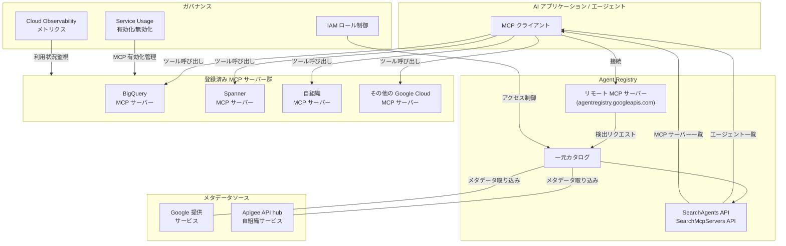

# Agent Registry: エージェントと MCP サーバーの一元カタログが Preview で登場

**リリース日**: 2026-04-22

**サービス**: Agent Registry

**機能**: Agent Registry Preview Launch with Remote MCP Server

**ステータス**: Preview

[このアップデートのインフォグラフィックを見る](https://takech9203.github.io/google-cloud-news-summary/20260422-agent-registry-preview.html)

## 概要

Google Cloud の Agent Registry が Preview として公開されました。Agent Registry は、AI エージェントと Model Context Protocol (MCP) サーバーを検出・登録するための一元カタログサービスです。組織内で利用可能なエージェント、エンドポイント、MCP サーバーを一箇所で管理し、AI アプリケーション開発における発見性とガバナンスを大幅に向上させます。

同時に、Agent Registry のリモート MCP サーバーも Preview で提供開始されました。AI アプリケーションを Agent Registry の MCP サーバーに接続することで、環境内で利用可能な他のエージェント、エンドポイント、MCP サーバーを動的に検出できるようになります。これにより、マルチエージェントシステムの構築において、各コンポーネントの接続先を静的に設定する必要がなくなり、エージェント同士が自律的に連携する基盤が整います。

本サービスは、プラットフォーム管理者による MCP サーバーの有効化・無効化管理と、アプリケーション開発者による MCP ツールの検出・利用という 2 つの主要ユースケースをサポートしています。Google 提供の MCP サーバーに加え、Apigee API hub を通じた自組織の MCP サーバーの登録・管理にも対応しており、エンタープライズ規模でのエージェント運用を支援します。

**アップデート前の課題**

- 組織内で利用可能な AI エージェントや MCP サーバーを一覧で把握する手段がなく、各開発者がそれぞれのサービスドキュメントを個別に確認する必要があった
- MCP サーバーの有効化・無効化が統一的なインターフェースで管理できず、プロジェクトごとの設定が煩雑だった
- エージェントが利用できる MCP ツールの動的な検出メカニズムがなく、接続先を静的に設定する必要があった

**アップデート後の改善**

- Agent Registry により、Google 提供および自組織の MCP サーバーとエージェントを一元的に検出・管理できるようになった
- gcloud CLI やコンソールから統一されたインターフェースで MCP サーバーの有効化・無効化を制御可能になった
- リモート MCP サーバーを通じて、エージェントが動的に他のエージェントやツールを検出し、マルチエージェント連携が容易になった
- Google Cloud Observability との統合により、MCP ツールの使用状況を一元的にモニタリングできるようになった

## アーキテクチャ図



Agent Registry は AI アプリケーションとさまざまな MCP サーバーの間に位置する一元カタログとして機能し、リモート MCP サーバー経由でエージェントからの動的な検出を可能にします。IAM と Service Usage による統一的なガバナンスも提供されます。

## サービスアップデートの詳細

### 主要機能

1. **一元カタログによるエージェント・MCP サーバーの検出**
   - 組織内で利用可能なすべての MCP サーバーと AI エージェントを一箇所に集約
   - Google 提供の MCP サーバーと、Apigee API hub を通じた自組織サービスの両方を統合管理
   - 検索機能 (SearchAgents / SearchMcpServers API) により、条件を指定してエージェントや MCP サーバーを絞り込み検索可能

2. **リモート MCP サーバーによる動的検出**
   - AI アプリケーションを Agent Registry の MCP サーバーに接続し、利用可能なリソースを動的に検出
   - MCP プロトコル標準に準拠した HTTP ベースのリモートエンドポイントを提供
   - Agent Development Kit (ADK) との統合により、エージェントが実行時に利用可能なツールを自動的に発見

3. **MCP サーバーの有効化・無効化管理**
   - `gcloud beta api-registry mcp enable/disable` コマンドでプロジェクト単位での MCP サーバー管理
   - Google Cloud コンソールからのビジュアルな管理インターフェースも提供
   - セキュリティベストプラクティスとして、必要な MCP サーバーのみを有効化する運用をサポート

4. **モニタリングとメトリクス**
   - Google Cloud Observability へのメトリクスデータ送信
   - MCP ツールのパフォーマンスと使用状況のダッシュボード・アラート作成が可能

## 技術仕様

### API とエンドポイント

| 項目 | 詳細 |
|------|------|
| サービス名 | `cloudapiregistry.googleapis.com` / `agentregistry.googleapis.com` |
| API バージョン | v1beta (REST) / v1alpha (gcloud) |
| サービスエンドポイント | `https://cloudapiregistry.googleapis.com` |
| Discovery Document | `https://cloudapiregistry.googleapis.com/$discovery/rest?version=v1beta` |
| リモート MCP サーバー | HTTP トランスポート |

### REST API リソース

| リソースパス | 説明 |
|------|------|
| `v1beta.projects.locations.mcpServers` | MCP サーバーの取得・一覧 |
| `v1beta.projects.locations.mcpServers.mcpTools` | MCP ツールの取得・一覧 |

### IAM ロールと権限

| ロール | 権限 | 用途 |
|--------|------|------|
| `roles/cloudapiregistry.admin` | Cloud API Registry 管理権限 | MCP サーバーの有効化・無効化 |
| `roles/serviceusage.serviceUsageAdmin` | Service Usage 管理権限 | MCP エンドポイントの制御 |
| `roles/mcp.toolUser` | `mcp.tools.call` | MCP ツールの呼び出し |
| `apiregistry.viewer` | Registry 参照権限 | MCP サーバーの一覧表示 (ADK 連携用) |

## 設定方法

### 前提条件

1. Google Cloud プロジェクトが作成済みであること
2. `cloudapiregistry.googleapis.com` と `apihub.googleapis.com` API が有効化されていること
3. 適切な IAM ロール (`roles/cloudapiregistry.admin` または `roles/serviceusage.serviceUsageAdmin`) が付与されていること

### 手順

#### ステップ 1: API の有効化

```bash
# Cloud API Registry API を有効化
gcloud services enable cloudapiregistry.googleapis.com --project=PROJECT_ID

# Apigee API hub も合わせて有効化 (自組織サービス連携用)
gcloud services enable apihub.googleapis.com --project=PROJECT_ID
```

Cloud API Registry と Apigee API hub の API をプロジェクトで有効化します。

#### ステップ 2: MCP サーバーの有効化

```bash
# 例: BigQuery MCP サーバーを有効化
gcloud beta api-registry mcp enable bigquery.googleapis.com --project=PROJECT_ID

# 有効な MCP サーバーの一覧を確認
gcloud beta api-registry mcp servers list --project=PROJECT_ID
```

必要な Google Cloud サービスの MCP サーバーを個別に有効化します。セキュリティのベストプラクティスとして、エージェントの機能に必要なサービスのみを有効化してください。

#### ステップ 3: Agent Registry を使ったエージェントの検索

```bash
# エージェントを検索
gcloud alpha agent-registry agents search \
  --location=global \
  --search-string='description="BigQuery*"'

# MCP サーバーを検索
gcloud alpha agent-registry mcp-servers search \
  --location=global \
  --search-string='mcpServerId="bigquery*"'
```

Agent Registry の検索 API を使用して、利用可能なエージェントや MCP サーバーを検出します。

#### ステップ 4: ADK との統合設定

```python
# ADK での Agent Registry 連携例
from google.adk.tools import ApiRegistryToolset

# API Registry からツールを自動検出
toolset = ApiRegistryToolset(
    project_id="PROJECT_ID",
    location="global"
)

# エージェントに検出されたツールを設定
agent = Agent(
    model="gemini-2.0-flash",
    tools=[toolset]
)
```

Agent Development Kit (ADK) の ApiRegistryToolset を使用すると、Agent Registry から利用可能な MCP ツールを自動的に検出し、エージェントに統合できます。

## メリット

### ビジネス面

- **エージェント開発の迅速化**: 利用可能な MCP サーバーやツールを一元的に検出できるため、エージェント構築時の調査・設定工数が大幅に削減される
- **ガバナンスの強化**: 組織全体で利用されるエージェントと MCP サーバーを統一的に管理でき、セキュリティポリシーの適用やコンプライアンス対応が容易になる
- **運用の可視化**: Cloud Observability との統合により、MCP ツールの使用状況をリアルタイムで把握し、コスト最適化やパフォーマンス改善の意思決定が可能

### 技術面

- **動的検出による柔軟性**: リモート MCP サーバーにより、エージェントが実行時に利用可能なツールを動的に検出でき、設定の静的管理が不要になる
- **MCP 標準への準拠**: オープンな Model Context Protocol 標準に基づいているため、Claude、Gemini CLI、ADK など多様なクライアントから利用可能
- **統一された API インターフェース**: REST API と gcloud CLI の両方でアクセスでき、自動化パイプラインへの組み込みが容易

## デメリット・制約事項

### 制限事項

- **Preview ステータス**: Pre-GA 製品であり、サポートが限定的。プロダクション環境での利用には十分な検証が必要
- **検索ロケーションフィルタリングの不具合**: global ロケーションで SearchAgents または SearchMcpServers API を呼び出した場合、us および eu マルチリージョンのリソースが誤って含まれる可能性がある
- **URN フォーマットの不整合**: Google Cloud コンソールでエージェントや MCP サーバーを検索した際、検索結果リストに無効な URN フォーマットが表示される場合がある
- **コンソールのスロットリングエラー**: MCP サーバー詳細ページでタブを頻繁に切り替えると、予期しないスロットリングエラーが発生する可能性がある

### 考慮すべき点

- Apigee API hub を通じた自組織の MCP サーバーはデフォルトで有効化されており、個別に有効化・無効化する操作はできない
- エージェントが MCP ツールを呼び出す際は、MCP サーバーへの権限に加え、基盤サービス自体の IAM ロール (例: BigQuery を使う場合は `bigquery.dataViewer` や `bigquery.jobUser`) も必要
- gcloud コマンドは alpha / beta 段階であり、将来的にコマンド構文が変更される可能性がある

## ユースケース

### ユースケース 1: マルチエージェントシステムの自動構成

**シナリオ**: 大規模な組織で、複数のチームがそれぞれ専門的な AI エージェントを開発している。オーケストレーターエージェントが、タスクに応じて適切なサブエージェントや MCP ツールを動的に選択・呼び出す必要がある。

**実装例**:
```python
from google.adk.tools import ApiRegistryToolset

# Agent Registry から利用可能なすべてのツールを検出
toolset = ApiRegistryToolset(
    project_id="my-project",
    location="global"
)

# オーケストレーターエージェントが動的にツールを活用
orchestrator = Agent(
    model="gemini-2.0-flash",
    instruction="""
    ユーザーのリクエストに基づいて、
    利用可能なツールを選択し適切に実行してください。
    """,
    tools=[toolset]
)
```

**効果**: エージェントが利用可能なツールをハードコードせず、Agent Registry を通じて動的に検出するため、新しい MCP サーバーが追加されても自動的に活用可能。組織全体のエージェントエコシステムがスケーラブルに成長する。

### ユースケース 2: プラットフォームチームによる MCP ガバナンス

**シナリオ**: プラットフォームチームが、開発チームに公開する MCP サーバーを管理し、プロジェクトごとにアクセス可能なサービスを制御したい。

**実装例**:
```bash
# 本番環境プロジェクトでは必要最小限の MCP サーバーのみ有効化
gcloud beta api-registry mcp enable bigquery.googleapis.com \
  --project=prod-project

gcloud beta api-registry mcp enable spanner.googleapis.com \
  --project=prod-project

# 開発環境プロジェクトでは追加のサービスも有効化
gcloud beta api-registry mcp enable bigquery.googleapis.com \
  --project=dev-project

gcloud beta api-registry mcp enable aiplatform.googleapis.com \
  --project=dev-project

# 各プロジェクトの有効化状況を確認
gcloud beta api-registry mcp servers list --project=prod-project
gcloud beta api-registry mcp servers list --project=dev-project
```

**効果**: 環境ごとに利用可能な MCP サーバーを制御でき、最小権限の原則に基づいたエージェント運用が可能。コンソールからの可視化と Cloud Observability によるモニタリングにより、利用状況の把握も容易。

### ユースケース 3: ADK を使ったエージェント開発の効率化

**シナリオ**: アプリケーション開発者が、新しい AI エージェントを構築する際に、プロジェクトで利用可能な MCP ツールを調査し、適切なものを選択して統合したい。

**効果**: Agent Registry のコンソール UI で利用可能な MCP サーバーとツールの一覧を確認し、ADK の ApiRegistryToolset を使って数行のコードでエージェントに統合できる。従来の個別ドキュメント調査と静的設定が不要になり、開発サイクルが短縮される。

## 料金

Agent Registry は現在 Preview 段階であり、具体的な料金体系は公式に発表されていません。Preview 期間中は無料で利用できる可能性がありますが、以下の点に注意が必要です。

- Agent Registry 自体の利用料金は Preview 期間中は発生しない見込み
- ただし、Agent Registry を通じて有効化した各 MCP サーバー (BigQuery、Spanner など) の利用料金は通常どおり発生
- Cloud Observability でのメトリクス監視には、通常の Monitoring 料金が適用される可能性あり
- GA 移行時に料金体系が確定する見込み

料金の最新情報は [Google Cloud Pricing](https://cloud.google.com/pricing) を確認してください。

## 利用可能リージョン

Agent Registry は以下のロケーションで利用可能です。

| ロケーション | 説明 |
|------|------|
| `global` | グローバルロケーション (デフォルト) |
| `us` | US マルチリージョン |
| `eu` | EU マルチリージョン |

なお、既知の問題として、global ロケーションで検索 API を呼び出した場合に us / eu マルチリージョンのリソースが意図せず結果に含まれるケースがあります。

## 関連サービス・機能

- **Apigee API hub**: Agent Registry のメタデータソースとして、自組織の API および MCP サーバー情報を提供。API hub で管理されている MCP サーバーは Agent Registry から自動的に検出可能
- **Agent Development Kit (ADK)**: Agent Registry と統合する ApiRegistryToolset を提供し、エージェントが実行時にツールを動的に検出・利用する機能を実現
- **Service Usage API**: MCP エンドポイントの有効化・無効化をプロジェクト、フォルダ、組織の階層で制御するための基盤サービス
- **Cloud Observability**: Agent Registry が送信する MCP ツールのメトリクスデータを収集し、ダッシュボードやアラートとして可視化
- **Model Context Protocol (MCP)**: Agent Registry の中核となるオープン標準プロトコル。AI アプリケーションと外部システムの接続を標準化

## 参考リンク

- [インフォグラフィック](https://takech9203.github.io/google-cloud-news-summary/20260422-agent-registry-preview.html)
- [公式リリースノート](https://cloud.google.com/release-notes#April_22_2026)
- [Agent Registry 概要ドキュメント](https://docs.cloud.google.com/api-registry/docs/overview)
- [MCP サーバーの有効化・無効化](https://docs.cloud.google.com/api-registry/docs/enable-disable-servers)
- [MCP ツールの検出・一覧](https://docs.cloud.google.com/api-registry/docs/discover-list-tools)
- [ADK での Agent Registry 統合](https://adk.dev/integrations/api-registry/)
- [Agent Registry コンソールガイド](https://docs.cloud.google.com/api-registry/docs/console)
- [Agent Registry REST API リファレンス](https://docs.cloud.google.com/api-registry/docs/reference/rest)
- [gcloud alpha agent-registry コマンド](https://docs.cloud.google.com/sdk/gcloud/reference/alpha/agent-registry/mcp-servers)

## まとめ

Agent Registry の Preview 公開は、Google Cloud におけるエージェンティック AI 開発の重要なマイルストーンです。MCP サーバーとエージェントの一元的な検出・管理・ガバナンス基盤が提供されることで、組織全体でのマルチエージェントシステム構築が大幅に効率化されます。特にリモート MCP サーバーによる動的検出機能は、エージェント同士が自律的に連携するための基盤技術として注目に値します。現時点では Preview のため既知の問題がいくつか存在しますが、ADK との統合を含め早期に評価を開始し、GA に向けた準備を進めることを推奨します。

---

**タグ**: #AgentRegistry #MCP #ModelContextProtocol #AIエージェント #Preview #マルチエージェント #ADK #ApigeeAPIHub #ガバナンス #CloudAPIRegistry
