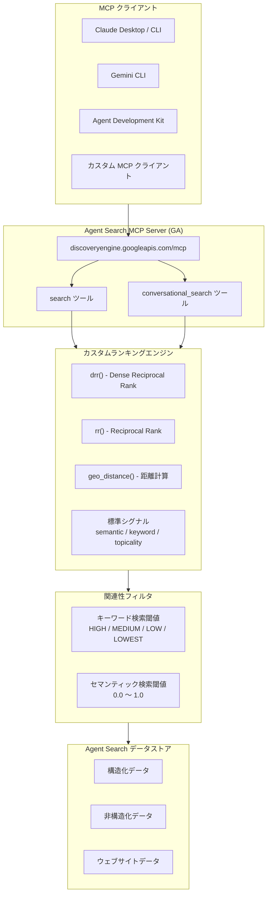

# Agent Search (旧 Vertex AI Search): MCP Server GA、カスタムランキング強化、ドキュメント関連性フィルタ、リブランディング

**リリース日**: 2026-04-22

**サービス**: Agent Search (旧 Vertex AI Search)

**機能**: MCP Server GA、Dense Reciprocal Rank (DRR) によるカスタムランキング、Geodistance 関数、ドキュメントレベル関連性フィルタ、Vertex AI Search から Agent Search へのリブランディング

**ステータス**: GA

📊 [このアップデートのインフォグラフィックを見る](https://takech9203.github.io/google-cloud-news-summary/20260422-agent-search-mcp-custom-ranking-ga.html)

## 概要

Google Cloud は、Agent Search (旧 Vertex AI Search) に対して 5 つの重要なアップデートを同時に発表した。MCP (Model Context Protocol) サーバーの GA 昇格、カスタムランキングにおける Dense Reciprocal Rank (DRR) 関数と Geodistance 関数の GA、ドキュメントレベル関連性フィルタの GA、そして Vertex AI Search から Agent Search への製品名変更である。

MCP サーバーの GA 昇格により、AI エージェントやLLM アプリケーションが Agent Search のデータストアに対して標準化されたプロトコルで直接検索・会話型検索を実行できるようになった。エンドポイントは `https://discoveryengine.googleapis.com/mcp` で、`search` と `conversational_search` の 2 つのツールが提供される。カスタムランキングの強化では、従来の `rr` (Reciprocal Rank) 関数に加え、重複シグナル値が存在する場合により高品質なランキングを実現する `drr` (Dense Reciprocal Rank) 関数と、位置情報に基づく距離計算を可能にする `geo_distance` 関数が GA となった。

対象ユーザーは、AI エージェント開発者、検索アプリケーション構築者、RAG (Retrieval-Augmented Generation) システムを運用するエンジニア、位置情報を活用した検索サービスを提供する事業者など、Agent Search を利用するすべてのチームである。

**アップデート前の課題**

- AI エージェントから Agent Search のデータストアにアクセスするには、REST API を直接呼び出す独自の統合コードを書く必要があり、MCP クライアント (Claude、Gemini CLI、ADK 等) からの標準的なアクセス手段がなかった (Public Preview 段階)
- カスタムランキングの `rr` 関数では、同一のシグナル値を持つドキュメントが複数存在する場合にランキング品質が低下する可能性があった
- 位置情報に基づく検索結果のランキング調整は、カスタムランキング式の中で直接サポートされておらず、別途計算ロジックを実装する必要があった (Private Preview 段階)
- 検索結果から関連性の低いドキュメントを除外するには、フィルタ式やアプリケーション側でのポストフィルタリングが必要で、ドキュメントレベルの関連性に基づく閾値フィルタリングが GA として利用できなかった

**アップデート後の改善**

- MCP サーバーの GA により、Claude、Gemini CLI、ADK、Antigravity などの MCP クライアントから標準プロトコルで Agent Search に直接アクセス可能になり、エージェント統合が大幅に簡素化された
- Dense Reciprocal Rank (`drr`) 関数により、重複シグナル値を持つドキュメント群のランキング品質が向上し、より精度の高い検索結果の順位付けが可能になった
- `geo_distance` 関数により、自然言語クエリからの位置抽出、座標指定、住所指定の 3 つの方法で距離ベースのランキングをカスタムランキング式に組み込めるようになった
- ドキュメントレベル関連性フィルタにより、キーワード検索とセマンティック検索それぞれに対して関連性閾値を設定し、低品質な結果を自動的に除外できるようになった

## アーキテクチャ図



MCP クライアントから Agent Search MCP サーバーを経由して検索リクエストが送信され、カスタムランキングエンジンで DRR、Geodistance 等の関数を使った順位付けが行われた後、関連性フィルタによって閾値を満たすドキュメントのみが返却される。

## サービスアップデートの詳細

### 主要機能

#### 1. MCP Server (GA)

- **エンドポイント**: `https://discoveryengine.googleapis.com/mcp`
- Agent Search のデータストアに対して MCP プロトコル経由で検索を実行可能
- 提供ツール:
  - **`search`**: データストアに取り込まれたデータに対する検索
  - **`conversational_search`**: データストアに対する会話型検索
- JSON-RPC 2.0 プロトコルを使用し、`tools/list` でツール仕様の取得、`tools/call` でツールの実行が可能
- 2026 年 2 月に Public Preview として提供開始、今回 GA に昇格
- MCP サーバーの利用には事前に認証設定が必要

#### 2. Dense Reciprocal Rank (DRR) によるカスタムランキング (GA)

- 新しい変換関数 `drr` を使用して検索結果のランキングをカスタマイズ可能
- 従来の `rr` (Reciprocal Rank) 関数の改良版
- 重複するシグナル値が存在する場合により高品質なランキングを実現
- 従来の `rr` 関数では同一スコアのドキュメントに対して任意の順序が割り当てられていたが、`drr` 関数ではこの問題を解消
- カスタムランキング式内で他のシグナルや関数と組み合わせて使用可能

#### 3. Geodistance 関数によるカスタムランキング (GA)

- `geo_distance` 関数をカスタムランキング式で使用して、ソース位置とデスティネーション位置の間の距離を計算
- ソース位置として以下の 3 種類をサポート:
  - **クエリ位置 (`query_loc`)**: 自然言語クエリから自動抽出された位置情報 (ポイント、ポリライン、サークル、ポリゴンに対応)
  - **リクエスト座標 (`request_loc`)**: 明示的に提供された緯度・経度
  - **リクエスト住所 (`request_loc`)**: 明示的に提供された住所文字列
- デスティネーション位置はカスタム取得可能フィールド (例: `c.hotel_location`, `c.office_location`) を使用
- 距離はメートル単位で計算
- `rr` や `drr` 関数と組み合わせて距離ベースのランキング重み付けが可能

#### 4. ドキュメントレベル関連性フィルタ (GA)

- 検索リクエストにドキュメントレベルの関連性フィルタを指定し、閾値を満たすドキュメントのみを返却
- **関連性閾値 (`relevanceThreshold`)**: 独自モデルによる総合的な関連性評価で、`HIGH`、`MEDIUM`、`LOW`、`LOWEST` の 4 段階
- **セマンティック関連性閾値 (`semanticRelevanceThreshold`)**: セマンティック類似度スコアのみに基づく細粒度フィルタで、0.0 〜 1.0 の浮動小数点値
- キーワード検索とセマンティック検索それぞれに独立した閾値を設定可能
- 対応データストア: Advanced Website Indexing によるウェブサイトデータ、カスタム非構造化データ、カスタム構造化データ
- 2025 年 12 月に Public Preview として提供開始、今回 GA に昇格

#### 5. Vertex AI Search から Agent Search へのリブランディング

- Vertex AI Search 製品が **Agent Search** に名称変更
- ドキュメントセットは更新済み
- Google Cloud コンソールの UI は引き続き **Vertex AI Search and AI Applications** と表示
- API は引き続き **Discovery Engine API** エンドポイントを使用
- 製品の機能は変更なし
- 過去の名称: AI Applications、Agent Builder、Vertex AI Search and Conversation、Enterprise Search、Generative AI App Builder

## 技術仕様

### MCP Server 仕様

| 項目 | 詳細 |
|------|------|
| エンドポイント | `https://discoveryengine.googleapis.com/mcp` |
| プロトコル | JSON-RPC 2.0 over HTTPS |
| 認証 | OAuth 2.0 / OIDC |
| 提供ツール | `search`, `conversational_search` |
| MCP メソッド | `tools/list`, `tools/call` |
| ステータス | GA (2026-04-22) |

### カスタムランキング関数一覧

| 関数 | 構文 | 説明 |
|------|------|------|
| Reciprocal Rank | `rr(expression, k)` | ドキュメントを式の値で降順ソートし、`1 / (rank_i + k)` を計算 |
| Dense Reciprocal Rank | `drr(expression, k)` | `rr` の改良版。重複シグナル値がある場合に高品質なランキングを実現 |
| Geodistance | `geo_distance(source, dest)` | ソースとデスティネーション間の距離 (メートル) を計算 |

### 関連性フィルタの閾値タイプ

| 閾値タイプ | 検索タイプ | 値の範囲 | 粒度 |
|-----------|-----------|---------|------|
| `relevanceThreshold` | キーワード / セマンティック | `HIGH`, `MEDIUM`, `LOW`, `LOWEST` | 粗粒度 |
| `semanticRelevanceThreshold` | キーワード / セマンティック | 0.0 〜 1.0 (浮動小数点) | 細粒度 |

### MCP クライアント設定例

```json
{
  "mcpServers": {
    "agent-search": {
      "httpUrl": "https://discoveryengine.googleapis.com/mcp",
      "headers": {
        "Authorization": "Bearer $(gcloud auth print-access-token)"
      }
    }
  }
}
```

## 設定方法

### 前提条件

1. Google Cloud プロジェクトで Discovery Engine API が有効化されていること
2. Agent Search アプリとデータストアが作成済みであること
3. 適切な IAM ロール (Discovery Engine 閲覧者以上) が付与されていること
4. MCP サーバーが有効化されていること

### 手順

#### ステップ 1: MCP サーバーの利用

```bash
# MCP サーバーのツール一覧を取得
curl --location 'https://discoveryengine.googleapis.com/mcp' \
  --header 'content-type: application/json' \
  --header 'accept: application/json, text/event-stream' \
  --header "Authorization: Bearer $(gcloud auth print-access-token)" \
  --data '{
    "method": "tools/list",
    "jsonrpc": "2.0",
    "id": 1
  }'
```

MCP サーバーが提供する `search` と `conversational_search` ツールの仕様が返却される。

#### ステップ 2: DRR と Geodistance を使用したカスタムランキング検索

```bash
curl -X POST \
  -H "Authorization: Bearer $(gcloud auth print-access-token)" \
  -H "Content-Type: application/json" \
  "https://discoveryengine.googleapis.com/v1/projects/PROJECT_ID/locations/global/collections/default_collection/engines/APP_ID/servingConfigs/default_search:search" \
  -d '{
    "query": "東京駅近くのホテル",
    "rankingExpression": "drr(semantic_similarity_score, 32) * 0.4 + drr(keyword_similarity_score, 32) * 0.3 + drr(geo_distance(query_loc, c.hotel_location) * -1, 32) * 0.3",
    "rankingExpressionBackend": "RANK_BY_FORMULA",
    "userInfo": {
      "preciseLocation": {
        "point": {
          "lat": 35.6812,
          "lon": 139.7671
        }
      }
    }
  }'
```

DRR 関数でセマンティック類似度とキーワード類似度を正規化しつつ、Geodistance 関数で距離によるランキング調整を行う。距離の乗算係数を `-1` にすることで、近い場所ほど高いランクが付与される。

#### ステップ 3: ドキュメントレベル関連性フィルタの適用

```bash
curl -X POST \
  -H "Authorization: Bearer $(gcloud auth print-access-token)" \
  -H "Content-Type: application/json" \
  "https://discoveryengine.googleapis.com/v1/projects/PROJECT_ID/locations/global/collections/default_collection/engines/APP_ID/servingConfigs/default_search:search" \
  -d '{
    "query": "検索クエリ",
    "relevanceFilterSpec": {
      "keywordSearchThreshold": {
        "relevanceThreshold": "MEDIUM"
      },
      "semanticSearchThreshold": {
        "semanticRelevanceThreshold": 0.75
      }
    }
  }'
```

キーワード検索では `MEDIUM` の関連性閾値、セマンティック検索では `0.75` のセマンティック関連性閾値を適用し、関連性の低いドキュメントを検索結果から除外する。

## メリット

### ビジネス面

- **エージェント統合の簡素化**: MCP サーバーの GA により、AI エージェントから Agent Search への統合が標準プロトコルで行えるようになり、カスタム統合コードの開発・保守コストが削減される
- **検索品質の向上**: DRR 関数とドキュメントレベル関連性フィルタにより、ユーザーに提供される検索結果の品質が向上し、検索離脱率の低下とコンバージョン率の改善が期待できる
- **位置情報サービスの強化**: Geodistance 関数により、不動産、旅行、小売、物流など位置情報を活用する業界で、距離を考慮した高品質な検索体験を迅速に構築できる

### 技術面

- **MCP 標準準拠**: Model Context Protocol という業界標準に対応することで、Claude、Gemini CLI、ADK などの多様な AI プラットフォームとの相互運用性が確保される
- **ランキング精度の改善**: DRR 関数は従来の RR 関数における重複シグナル値の問題を解決し、同一スコアのドキュメントが多数存在するデータセットでもより適切なランキングを実現する
- **柔軟な関連性制御**: キーワード検索とセマンティック検索それぞれに独立した閾値を設定できるため、ユースケースに応じたきめ細かいフィルタリング戦略を実装できる
- **自然言語位置抽出**: Geodistance 関数がクエリから自然言語で位置情報を自動抽出できるため、ユーザーが座標を明示的に指定する必要がない

## デメリット・制約事項

### 制限事項

- ドキュメントレベル関連性フィルタは Basic Website Indexing、メディアデータ、ヘルスケアデータのデータストアには対応していない
- ドキュメントレベル関連性フィルタはブレンド検索アプリ (複数データストアに接続されたアプリ) では使用できない
- Google Cloud コンソールの UI は引き続き「Vertex AI Search and AI Applications」と表示されるため、ドキュメントとコンソール間で名称の不一致が生じる
- API エンドポイントは引き続き Discovery Engine API を使用するため、API レベルでの名称変更は行われていない

### 考慮すべき点

- MCP サーバーの利用には事前に認証設定 (OAuth 2.0 / OIDC) が必要であり、適切な IAM 権限の設定が前提となる
- DRR 関数は `rr` 関数の改良版であるが、既存のカスタムランキング式で `rr` を使用している場合に `drr` への移行を検討する必要がある
- 関連性フィルタの閾値設定は検索品質に大きく影響するため、本番環境への適用前に複数のクエリで閾値の最適値をテストすることが推奨される
- Vertex AI Search から Agent Search への名称変更に伴い、既存のドキュメント、社内ガイド、自動化スクリプト内の参照を更新する必要がある

## ユースケース

### ユースケース 1: AI エージェントによる社内ナレッジベース検索

**シナリオ**: 社内の FAQ、マニュアル、ポリシー文書を Agent Search のデータストアに格納し、MCP サーバー経由で AI エージェント (Claude Desktop や ADK ベースのエージェント) が直接検索できるようにする。ドキュメントレベル関連性フィルタで `HIGH` 閾値を設定し、関連性の高い回答のみを返却する。

**実装例**:
```json
{
  "method": "tools/call",
  "jsonrpc": "2.0",
  "id": 2,
  "params": {
    "name": "search",
    "arguments": {
      "query": "リモートワークの経費精算ルール",
      "app_id": "internal-knowledge-base",
      "relevanceFilterSpec": {
        "keywordSearchThreshold": {
          "relevanceThreshold": "HIGH"
        }
      }
    }
  }
}
```

**効果**: AI エージェントが従業員の質問に対して関連性の高い社内文書のみを参照して回答するため、回答精度が向上し、ハルシネーションのリスクが低減される

### ユースケース 2: 不動産・旅行サイトの距離ベース検索ランキング

**シナリオ**: 不動産検索サイトで「渋谷駅近くのオフィス」というクエリに対して、Geodistance 関数と DRR 関数を組み合わせ、距離・セマンティック類似度・キーワード一致度を総合的に考慮したランキングを実現する。

**実装例**:
```
drr(semantic_similarity_score, 32) * 0.3 + drr(keyword_similarity_score, 32) * 0.2 + drr(geo_distance(query_loc, c.office_location) * -1, 32) * 0.5
```

**効果**: ユーザーの自然言語クエリから位置情報が自動抽出され、距離を重視しつつテキスト関連性も考慮した検索結果が提供されるため、ユーザー満足度とコンバージョン率が向上する

### ユースケース 3: E コマースの高精度商品検索

**シナリオ**: E コマースサイトで大量の類似商品 (同一カテゴリ内の商品) が存在する場合に、DRR 関数を使用して重複スコアの問題を解消し、関連性フィルタでセマンティック関連性が 0.8 以上のドキュメントのみを返却する設定にすることで、検索結果の質を向上させる。

**効果**: 類似商品が多数存在するカタログでも、ユーザーの検索意図に最も合致する商品が上位に表示され、検索離脱率が低下する

## 料金

Agent Search の料金体系は従来の Vertex AI Search と同様で、2 つの料金モデルが提供される。

- **General (従量課金制)**: Pay-as-you-go の消費ベースモデル
- **Configurable (サブスクリプション型)**: ストレージと検索クエリの月額サブスクリプションに、セマンティッククエリや AI Overview などのアドオンを組み合わせる柔軟なモデル

MCP サーバー経由の検索リクエストは通常の検索クエリと同様に課金される。名称変更による料金体系の変更はない。

詳細な料金情報は [Agent Search 料金ページ](https://cloud.google.com/generative-ai-app-builder/pricing) を参照。

## 利用可能リージョン

Agent Search はグローバルロケーション (`global`) および複数のリージョンで利用可能。MCP サーバーのエンドポイントはグローバルエンドポイントとして提供される。

詳細なリージョン情報は [Agent Search のロケーション](https://docs.cloud.google.com/generative-ai-app-builder/docs/locations) を参照。

## 関連サービス・機能

- **Gemini Enterprise Agent Platform (旧 Vertex AI)**: Agent Search は同日に発表された Gemini Enterprise Agent Platform のエコシステムの一部として位置づけられ、Agent Runtime、Agent Identity、Agent Registry 等と連携する
- **Agent Development Kit (ADK)**: ADK の `McpToolset` を使用して Agent Search MCP サーバーをエージェントのツールとして組み込み可能
- **Agent Registry**: MCP サーバーとツールの一元管理カタログ。Agent Search MCP サーバーを Agent Registry に登録して組織全体で発見・利用可能にする
- **Discovery Engine API**: Agent Search の基盤 API。MCP サーバーは Discovery Engine API のラッパーとして機能する
- **Vector Search**: ベクトル検索機能。Agent Search のセマンティック検索と補完的に使用できる

## 参考リンク

- 📊 [インフォグラフィック](https://takech9203.github.io/google-cloud-news-summary/20260422-agent-search-mcp-custom-ranking-ga.html)
- [公式リリースノート](https://cloud.google.com/release-notes#April_22_2026)
- [MCP Reference: discoveryengine.googleapis.com](https://docs.cloud.google.com/generative-ai-app-builder/docs/reference/mcp)
- [カスタムランキングのドキュメント](https://docs.cloud.google.com/generative-ai-app-builder/docs/custom-ranking)
- [ドキュメントレベル関連性フィルタのドキュメント](https://docs.cloud.google.com/generative-ai-app-builder/docs/filter-by-relevance)
- [Agent Search とは](https://docs.cloud.google.com/generative-ai-app-builder/docs/introduction)
- [Agent Search 料金ページ](https://cloud.google.com/generative-ai-app-builder/pricing)
- [Google Cloud MCP サーバー概要](https://docs.cloud.google.com/mcp/overview)

## まとめ

Agent Search (旧 Vertex AI Search) の今回のアップデートは、MCP サーバー GA によるエージェント統合の標準化、DRR と Geodistance によるカスタムランキングの高度化、ドキュメントレベル関連性フィルタによる検索品質の向上、そして Agent Search へのリブランディングという 4 つの柱で構成される。特に MCP サーバーの GA は、AI エージェントが標準プロトコルで企業のデータストアにアクセスする道を開くものであり、Gemini Enterprise Agent Platform のエコシステムにおける Agent Search の戦略的な位置づけを明確にしている。既存の Vertex AI Search ユーザーは、DRR 関数への移行検討、関連性フィルタの閾値最適化、MCP サーバーを活用したエージェント統合の評価を推奨する。

---

**タグ**: #AgentSearch #VertexAISearch #MCP #ModelContextProtocol #DenseReciprocalRank #Geodistance #カスタムランキング #関連性フィルタ #リブランディング #GA #DiscoveryEngine
