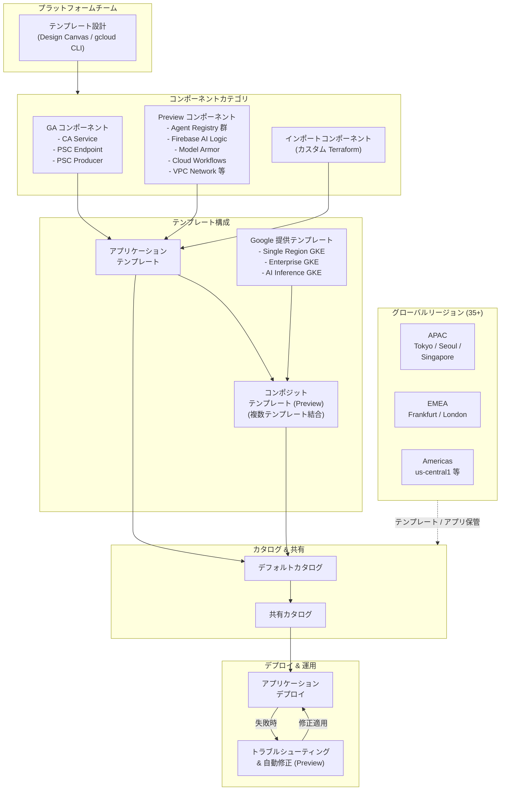

# Application Design Center: 新規 GA/Preview コンポーネント、リージョン拡大、コンポジットテンプレート

**リリース日**: 2026-04-22

**サービス**: Application Design Center

**機能**: 新規 GA/Preview コンポーネント追加、グローバルリージョン拡大、コンポジットテンプレート機能

**ステータス**: GA / Preview

[このアップデートのインフォグラフィックを見る](https://takech9203.github.io/google-cloud-news-summary/20260422-application-design-center-components-regions.html)

## 概要

Application Design Center (App Design Center) に対する大規模なアップデートが発表されました。CA Service、Private Service Connect Endpoint、Private Service Connect Producer の 3 コンポーネントが General Availability (GA) に昇格し、AI エージェント関連、Firebase、ネットワーキング、セキュリティなど 30 以上のコンポーネントが Preview として新たに追加されました。さらに、複数のアプリケーションテンプレートとコンポーネントを組み合わせるコンポジットテンプレート機能 (Preview)、デプロイ失敗時のトラブルシューティングと自動修正機能 (Preview)、そして東京・ソウル・シンガポール・フランクフルト・ロンドンを含む世界 35 以上のリージョンでのテンプレート・アプリケーション保管が可能になりました。

今回のアップデートにより、App Design Center はプラットフォームエンジニアリングの中核ツールとしての位置付けをさらに強化しています。特に Agent Registry 関連コンポーネント (Agent、Binding、Endpoint、MCP Server、Service) や Agent Platform Runtime の追加は、AI エージェント開発をガバナンス付きテンプレートで標準化するという新しいユースケースを切り開きます。加えて、Model Armor (Floor Setting、Template) や Firebase AI Logic 関連コンポーネントの追加により、AI ワークロードのセキュリティとプロンプト管理もテンプレートレベルで制御可能になりました。

本アップデートの主な対象ユーザーは、プラットフォームエンジニアリングチーム、クラウドアーキテクト、AI/ML エンジニア、セキュリティエンジニアです。Google 提供の GKE テンプレート 3 種類 (Single region、Enterprise-grade production、AI Pre-trained Inference) も Preview として追加され、すぐに利用を開始できます。

**アップデート前の課題**

- CA Service や Private Service Connect を App Design Center のテンプレートに組み込む場合、カスタム Terraform モジュールをインポートする必要があり、Google ベストプラクティスが反映された標準コンポーネントとして利用できなかった
- AI エージェント関連のインフラストラクチャ (Agent Registry、Agent Platform Runtime など) をテンプレートに含める手段がなく、AI エージェントの運用ガバナンスを設計段階で組み込むことが困難だった
- 単一のアプリケーションテンプレートでは複雑なマイクロサービスアーキテクチャや多層アプリケーションを表現しきれず、テンプレートの再利用性に制限があった
- デプロイ失敗時にエラー原因の特定と修正を手動で行う必要があり、トラブルシューティングに時間がかかっていた
- テンプレートとアプリケーションの保管先リージョンが限定的で、データレジデンシー要件を満たせないケースがあった

**アップデート後の改善**

- CA Service、Private Service Connect Endpoint/Producer が GA コンポーネントとして追加され、プライベート接続と証明書管理をテンプレートで標準化可能になった
- AI エージェント関連を含む 30 以上の Preview コンポーネントが追加され、AI ワークロードからネットワーキング、セキュリティまで幅広いアーキテクチャパターンをテンプレート化できるようになった
- コンポジットテンプレート (Preview) により、複数のテンプレートとコンポーネントを組み合わせた複雑なアーキテクチャを再利用可能な単位で設計できるようになった
- デプロイ失敗時のトラブルシューティングと自動修正機能 (Preview) により、エラー分析から修正適用までのワークフローが自動化された
- 35 以上のグローバルリージョンでテンプレートとアプリケーションを保管可能になり、データレジデンシー要件への対応が大幅に改善された

## アーキテクチャ図



プラットフォームチームが GA/Preview/インポートの各コンポーネントを使用してアプリケーションテンプレートを設計し、コンポジットテンプレートとして複数テンプレートを結合できます。テンプレートはカタログ経由で共有され、35 以上のグローバルリージョンに保管可能です。デプロイ失敗時はトラブルシューティング機能が自動的にエラーを分析し、修正を提案します。

## サービスアップデートの詳細

### 主要機能

1. **GA コンポーネントの追加 (3 種類)**
   - **CA Service**: マネージドプライベート認証局。ワークロードアイデンティティのための証明書を発行・管理し、mTLS やサービス間認証を App Design Center のテンプレートで標準化可能
   - **Private Service Connect Endpoint**: リージョナルアドレスとフォワーディングルールを使用して、プロデューサーサービスアタッチメントへのプライベート接続を確立
   - **Private Service Connect Producer**: NAT サブネットとサービスアタッチメントを構成し、サービスプロデューサーとしてプライベート接続を公開

2. **Preview コンポーネントの大規模追加 (30 種類以上)**
   - **AI エージェント関連**: Agent Registry (Agent, Binding, Endpoint, MCP Server, Service)、Agent Platform Runtime
   - **AI セキュリティ**: Model Armor Floor Setting、Model Armor Template
   - **Firebase 関連**: Firebase AI Logic、Firebase AI Logic Prompt Template、Firebase App Check、Firebase Authentication、Firebase Multi-Platform App、Firestore Security Rules
   - **ネットワーキング**: VPC Network、Routes、Compute Address、Compute Firewall、Cloud NAT、Cloud Router、Cloud Router Interface、Secure Web Proxy、Internal Load Balancer
   - **コンピュート & オーケストレーション**: Compute Instance、Cloud Scheduler、Cloud Workflows、Managed Airflow
   - **セキュリティ & IAM**: Authorization Extension、Authorization Policy、Authorization Policy Extension、IAM Connector、Cloud KMS
   - **データ & アプリケーション**: Artifact Registry、Cloud Run functions、Cloud Tasks、Cloud DNS Managed Zone、Cloud DNS Response Policy、Document AI

3. **コンポジットテンプレート (Preview)**
   - 複数のアプリケーションテンプレートとコンポーネントを組み合わせて、1 つの統合されたテンプレートを作成可能
   - マイクロサービスアーキテクチャや多層アプリケーションなど、複雑な構成の再利用性と標準化を実現
   - テンプレート間の依存関係や接続を定義し、一貫したデプロイを保証

4. **デプロイ失敗時のトラブルシューティングと自動修正 (Preview)**
   - デプロイ失敗時にエラーサマリーの表示、詳細分析、解決手順の提示を自動実行
   - コンポーネント設定の推奨変更が提案された場合、「Update Application」ボタンで即座に適用可能
   - gcloud CLI コマンドによる修正が必要な場合、Cloud Shell での直接実行をサポート

5. **グローバルリージョン拡大 (35 以上)**
   - 東京、ソウル、シンガポール、フランクフルト、ロンドンを含む世界 35 以上のリージョンでテンプレートとアプリケーションを保管可能
   - データレジデンシー要件への対応が大幅に改善

6. **Google 提供アプリケーションテンプレート (Preview)**
   - **Single region GKE cluster and workload**: コスト効率の高い単一リージョン GKE クラスタとワークロード。リソース管理に最適化
   - **Enterprise-grade production GKE cluster and workload**: 高セキュリティ・高可用性の本番環境向け GKE クラスタとワークロード。整合性、高度ネットワーキング、災害復旧に最適化
   - **AI Pre-trained Inference GKE cluster and workload**: AI ワークロード向け GKE クラスタ。GPU リソースの効率的なリクエストと HPA による自動スケーリングを構成

## 技術仕様

### 新規 GA コンポーネント

| コンポーネント | カテゴリ | 説明 | Terraform モジュール |
|--------------|---------|------|---------------------|
| CA Service | Assets | マネージドプライベート認証局 | [terraform-google-certificate-authority-service](https://github.com/GoogleCloudPlatform/terraform-google-certificate-authority-service) |
| Private Service Connect Endpoint | Services | PSC エンドポイント (コンシューマー側) | [terraform-google-network/modules/private-service-connect-endpoints-for-published-services](https://github.com/terraform-google-modules/terraform-google-network) |
| Private Service Connect Producer | Services | PSC プロデューサー (NAT サブネット + サービスアタッチメント) | [terraform-google-network/modules/private-service-connect-producer](https://github.com/terraform-google-modules/terraform-google-network) |

### 主要 Preview コンポーネント (AI エージェント関連)

| コンポーネント | カテゴリ | 説明 |
|--------------|---------|------|
| Agent Registry Agent | Assets | AI エージェントの検出とガバナンスのためのデータリソース |
| Agent Registry Binding | Assets | Agent Registry と IAM Connector のバインディング |
| Agent Registry Endpoint | Assets | AI エージェントエンドポイントの検出とガバナンス |
| Agent Registry MCP Server | Assets | MCP サーバーの検出とガバナンス |
| Agent Registry Service | Services | AI エージェントの検出とガバナンスのレジストリ |
| Agent Platform Runtime | Workloads | AI エージェントのデプロイ・管理・スケーリングプラットフォーム |

### Google 提供テンプレート

| テンプレート | ステータス | 想定ユースケース |
|------------|-----------|----------------|
| Single region GKE cluster and workload | Preview | 内部業務アプリケーション、リージョナル EC バックエンド、データ処理基盤 |
| Enterprise-grade production GKE cluster and workload | Preview | グローバルトレーディング、マルチテナント SaaS、ミッションクリティカル推論 |
| AI Pre-trained Inference GKE cluster and workload | Preview | リアルタイム映像解析、ドキュメント処理、大量レコメンデーション |

### IAM ロール

| ロール | 説明 |
|-------|------|
| `roles/designcenter.admin` | App Design Center の全機能を管理 |
| `roles/designcenter.user` | テンプレート設計、アプリケーション作成・デプロイ |
| `roles/designcenter.applicationAdmin` | アプリケーション管理 (フォルダレベル設定時) |

## 設定方法

### 前提条件

1. Google Cloud プロジェクトまたは組織フォルダが設定済みであること
2. 課金アカウントがリンクされていること
3. `roles/designcenter.admin` または `roles/designcenter.user` ロールが付与されていること

### 手順

#### ステップ 1: App Design Center の初期セットアップ

```bash
# プロジェクトレベル (Single-project boundary / Preview) の場合
# Google Cloud Console から Application Design Center Overview ページに移動
# "Go to Setup" をクリックし、必要な API を有効化

# フォルダレベルの場合
# "Set up ADC" をクリックし、スペース名を入力して "Complete setup" をクリック
```

必要な API (App Hub、Infrastructure Manager、Cloud Storage、Service Usage) が自動的に有効化され、デフォルトスペースとストレージバケットが作成されます。

#### ステップ 2: アプリケーションテンプレートの作成

```bash
# テンプレートを作成
gcloud design-center spaces application-templates create my-template \
  --project=PROJECT_ID \
  --location=asia-northeast1 \
  --space=my-space \
  --display-name="My Application Template" \
  --description="AI エージェントを含むマイクロサービステンプレート"
```

#### ステップ 3: コンポーネントの追加

```bash
# Google カタログから利用可能なコンポーネントを一覧表示
gcloud design-center spaces shared-templates list \
  --google-catalog \
  --location=asia-northeast1

# コンポーネントをテンプレートに追加
gcloud design-center spaces application-templates components create agent-registry \
  --project=PROJECT_ID \
  --location=asia-northeast1 \
  --space=my-space \
  --application-template=my-template \
  --shared-template-revision-uri=SHARED_TEMPLATE_URI
```

#### ステップ 4: コンポジットテンプレートの作成 (Preview)

コンポジットテンプレートは、複数のアプリケーションテンプレートを組み合わせて作成します。Google Cloud Console の Design Canvas で視覚的に設計するか、gcloud CLI を使用します。

```bash
# コンポジットテンプレート用に複数のテンプレートを結合
# Design Canvas で "Create composite template" を選択し、
# 既存のテンプレートとコンポーネントをドラッグ&ドロップで構成
```

#### ステップ 5: デプロイとトラブルシューティング

```bash
# アプリケーションの作成とデプロイ
gcloud design-center spaces applications create my-app \
  --project=PROJECT_ID \
  --location=asia-northeast1 \
  --space=my-space \
  --application-template=my-template

# デプロイ失敗時は Console の Application details > Deployments で
# "Troubleshoot Deployment" をクリックして自動分析と修正を実行
```

## メリット

### ビジネス面

- **AI エージェント開発のガバナンス標準化**: Agent Registry と Agent Platform Runtime のコンポーネント化により、AI エージェントの開発・運用に組織的なガバナンスを設計段階から適用可能。エージェントの乱立を防ぎ、一貫した品質とセキュリティを確保できる
- **グローバル展開の加速**: 35 以上のリージョン対応により、各国のデータレジデンシー要件を満たしながら、同一テンプレートをグローバルに展開可能。テンプレートの東京リージョン保管により、日本国内のコンプライアンス要件にも対応
- **開発者生産性の向上**: Google 提供テンプレート (GKE 3 種類) とコンポジットテンプレートにより、複雑なアーキテクチャでも数分でデプロイ可能になり、開発者のセルフサービス化を促進

### 技術面

- **包括的なコンポーネントカバレッジ**: GA 3 + Preview 30 以上のコンポーネント追加により、ネットワーキング (VPC、PSC、Cloud NAT)、セキュリティ (KMS、Model Armor)、AI (Agent Registry、Firebase AI Logic)、オーケストレーション (Workflows、Managed Airflow) まで、アーキテクチャの大部分をテンプレートで表現可能
- **コンポジットテンプレートによるアーキテクチャの階層化**: テンプレートの入れ子構造により、ベースインフラ層、ネットワーク層、アプリケーション層を独立して管理・更新可能。変更の影響範囲を最小化し、テンプレートの保守性を向上
- **自動トラブルシューティング**: デプロイ失敗の根本原因分析から修正適用までのループが自動化され、デプロイサイクルの高速化に貢献

## デメリット・制約事項

### 制限事項

- 新規追加コンポーネントの大半 (30 種類以上) は Preview であり、Pre-GA Offerings Terms が適用される。本番ワークロードでの利用には限定的なサポートが提供される
- コンポジットテンプレート機能は Preview であり、テンプレート間の複雑な依存関係管理にはまだ制限がある可能性がある
- デプロイトラブルシューティングの自動修正は Preview であり、すべてのエラーパターンに対応しているわけではない
- GA のコンポーネントは今回追加の 3 種類を含めても限定的であり、多くのコンポーネントは GA 昇格を待つ必要がある

### 考慮すべき点

- Preview コンポーネントを含むテンプレートを本番環境で使用する場合、GA 昇格のタイムラインを確認し、リスクを評価する必要がある
- Agent Registry 関連コンポーネントは Agent Registry サービス自体の成熟度に依存するため、エージェントガバナンスの運用設計は段階的に進めることを推奨
- コンポジットテンプレートの導入により、テンプレートの依存関係管理が複雑化する可能性があるため、チーム間のテンプレートオーナーシップと更新ポリシーを事前に策定することが重要
- 35 以上のリージョン対応は保管先の選択肢を増やすが、デプロイ先リージョンとテンプレート保管リージョンの関係性を理解した上で設計する必要がある

## ユースケース

### ユースケース 1: AI エージェントプラットフォームの標準化

**シナリオ**: エンタープライズ組織が複数のチームで AI エージェントを開発・運用しており、エージェントの登録・管理・セキュリティを統一的にガバナンスしたい。

**実装例**:
```text
1. App Design Center で AI エージェント向けコンポジットテンプレートを作成
2. Agent Registry Service + Agent Registry Agent + Agent Registry MCP Server を
   ベースコンポーネントとして構成
3. Model Armor Template + Model Armor Floor Setting で AI 安全性ポリシーを組み込み
4. Agent Platform Runtime でエージェントのデプロイ環境を標準化
5. テンプレートをカタログに公開し、各開発チームにセルフサービスで提供
```

**効果**: AI エージェントの開発・運用に組織横断的なガバナンスが適用され、エージェントの品質・セキュリティ・コンプライアンスが設計段階から保証される。

### ユースケース 2: Private Service Connect を活用したマルチサービスアーキテクチャ

**シナリオ**: SaaS プロバイダーが、顧客のVPCからプライベートにアクセス可能なサービスを提供したい。CA Service で証明書を管理し、PSC Producer/Endpoint でプライベート接続を確立するアーキテクチャをテンプレート化する。

**実装例**:
```text
1. コンポジットテンプレートでインフラ層とアプリケーション層を分離
2. インフラ層: VPC Network + Cloud NAT + Cloud Router + PSC Producer
3. アプリケーション層: Cloud Run + CA Service + PSC Endpoint
4. 接続設定: PSC Producer と PSC Endpoint をテンプレート内で接続定義
5. CA Service で mTLS 用証明書を自動発行する設定をテンプレートに組み込み
```

**効果**: プライベート接続アーキテクチャがテンプレートとして標準化され、新規サービスの追加時に一貫したネットワークセキュリティが保証される。

### ユースケース 3: グローバル展開のための GKE テンプレート活用

**シナリオ**: グローバル展開する企業が、リージョンごとに異なるスケール要件に対応しつつ、GKE クラスタの構成を標準化したい。

**実装例**:
```text
1. 開発/テスト環境: Single region GKE cluster and workload テンプレートを使用
2. 本番環境: Enterprise-grade production GKE cluster and workload テンプレートを使用
3. AI 推論環境: AI Pre-trained Inference GKE cluster and workload テンプレートを使用
4. 各テンプレートを東京 (asia-northeast1)、フランクフルト (europe-west3) 等の
   リージョンに保管し、各地域チームが利用
5. コンポジットテンプレートで GKE クラスタ + ワークロードを一括構成
```

**効果**: 環境ごとに最適化された GKE テンプレートを活用しつつ、グローバルで一貫したガバナンスを維持できる。デプロイ失敗時はトラブルシューティング機能で迅速に問題を解決。

## 料金

Application Design Center 自体の利用料金は、テンプレートの設計・管理機能については追加課金はありません。ただし、テンプレートからデプロイされた Google Cloud リソース (GKE クラスタ、Compute Engine インスタンス、Cloud Run サービスなど) には、各サービスの通常料金が適用されます。

### 関連コスト

| 項目 | 課金モデル |
|------|-----------|
| テンプレート設計・管理 | App Design Center 機能自体は追加課金なし |
| デプロイされたリソース | 各 Google Cloud サービスの通常料金 |
| Infrastructure Manager (Terraform 実行) | [Infrastructure Manager 料金](https://cloud.google.com/infrastructure-manager/pricing) に準拠 |
| Cloud Storage (Terraform 保管) | [Cloud Storage 料金](https://cloud.google.com/storage/pricing) に準拠 |

## 利用可能リージョン

テンプレートとアプリケーションを保管可能なリージョンが 35 以上に拡大されました。主要なリージョンは以下の通りです。

| 地域 | 主要リージョン |
|------|-------------|
| アジア太平洋 | 東京 (asia-northeast1)、ソウル (asia-northeast3)、シンガポール (asia-southeast1) |
| ヨーロッパ | フランクフルト (europe-west3)、ロンドン (europe-west2) |
| 北米 | us-central1、us-east1 等 |

全リージョンの一覧は [Application Design Center ドキュメント](https://docs.cloud.google.com/application-design-center/docs/overview) を参照してください。

## 関連サービス・機能

- **Agent Registry**: AI エージェントの検出、登録、ガバナンスを行うサービス。今回 App Design Center のコンポーネントとして統合され、テンプレートベースのエージェント管理が可能に
- **Model Armor**: AI モデルへのプロンプトとレスポンスのセキュリティフィルタリングを行うサービス。Floor Setting と Template コンポーネントにより、テンプレートレベルで AI 安全性ポリシーを設定可能
- **Private Service Connect**: Google Cloud 内外のサービスへのプライベート接続を提供。Endpoint と Producer の両コンポーネントが GA に昇格
- **CA Service (Certificate Authority Service)**: マネージドプライベート認証局サービス。ワークロード間の mTLS 認証や証明書管理をテンプレートで標準化
- **Firebase AI Logic**: Firebase 環境での LLM 実行基盤。App Check によるセキュリティと組み合わせて、AI アプリケーションの認証・認可をテンプレートで管理
- **Security Command Center**: App Design Center と連携したプロアクティブなセキュリティ評価をサポート (2026-04-17 に Preview 発表済み)

## 参考リンク

- [インフォグラフィック](https://takech9203.github.io/google-cloud-news-summary/20260422-application-design-center-components-regions.html)
- [公式リリースノート](https://cloud.google.com/release-notes#April_22_2026)
- [Application Design Center 概要](https://docs.cloud.google.com/application-design-center/docs/overview)
- [サポートされるリソース一覧](https://docs.cloud.google.com/application-design-center/docs/supported-resources)
- [アプリケーションテンプレートの設計](https://docs.cloud.google.com/application-design-center/docs/design-application-templates)
- [コンポーネントのインポート](https://docs.cloud.google.com/application-design-center/docs/import-components)
- [デプロイのトラブルシューティング](https://docs.cloud.google.com/application-design-center/docs/deploy-applications#troubleshoot)
- [Google 提供テンプレート: Single region GKE](https://docs.cloud.google.com/application-design-center/docs/single-region-gke)
- [Google 提供テンプレート: Enterprise-grade production GKE](https://docs.cloud.google.com/application-design-center/docs/enterprise-grade-production-gke)
- [Google 提供テンプレート: AI Pre-trained Inference GKE](https://docs.cloud.google.com/application-design-center/docs/ai-pretrained-inference-gke-cluster-workload)
- [App Design Center セットアップガイド](https://docs.cloud.google.com/application-design-center/docs/setup)

## まとめ

Application Design Center の今回のアップデートは、GA コンポーネント 3 種類と Preview コンポーネント 30 種類以上の追加、コンポジットテンプレート機能、自動トラブルシューティング、35 以上のグローバルリージョン対応という包括的な機能拡張です。特に Agent Registry や Model Armor など AI エージェント関連コンポーネントの追加は、AI ガバナンスをプラットフォームエンジニアリングに組み込む上で重要な一歩です。プラットフォームチームは、まず Google 提供 GKE テンプレートで App Design Center のワークフローを体験し、その後コンポジットテンプレートを活用して組織固有のアーキテクチャパターンを標準化することを推奨します。

---

**タグ**: #ApplicationDesignCenter #コンポジットテンプレート #AgentRegistry #PrivateServiceConnect #CAService #ModelArmor #FirebaseAILogic #GKE #リージョン拡大 #プラットフォームエンジニアリング #GA #Preview
