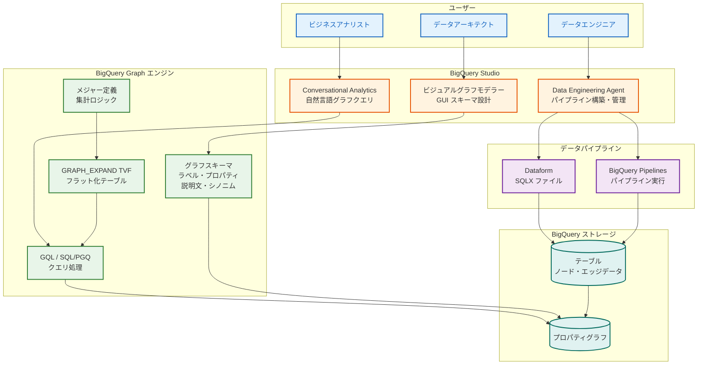

# BigQuery: Graph 機能強化 (自然言語クエリ、説明・メジャー)、Data Engineering Agent GA、ビジュアルグラフモデラー

**リリース日**: 2026-04-22

**サービス**: BigQuery

**機能**: Graph Features (NL Query, Descriptions, Measures), Data Engineering Agent GA, Visual Graph Modeler

**ステータス**: Preview / GA

[このアップデートのインフォグラフィックを見る](https://takech9203.github.io/google-cloud-news-summary/20260422-bigquery-graph-data-engineering-agent.html)

## 概要

BigQuery に対して、グラフ機能の大幅な強化、Data Engineering Agent の一般提供 (GA)、およびビジュアルグラフモデラーの 3 つの主要アップデートが同時に発表された。グラフ機能の強化では、Conversational Analytics による自然言語でのグラフクエリ、ラベルやプロパティへの説明文・シノニムの追加、そしてメジャー (Measures) の定義が可能になった。これらのグラフ関連機能は Preview ステータスで提供される。

Data Engineering Agent は、自然言語プロンプトを使用して BigQuery 内のデータパイプラインを構築、変更、トラブルシューティングできる AI エージェントであり、今回 GA として一般提供が開始された。Dataform との統合、プラン生成、コード検証、自動データラングリングなどの機能を備え、データエンジニアリングワークフローを大幅に効率化する。

ビジュアルグラフモデラーは、BigQuery Studio 上で GUI を使用してグラフのノードとエッジを定義し、グラフスキーマを編集できる新機能であり、Preview で提供される。DDL を手動で記述することなく、既存の BigQuery テーブルからグラフモデルを視覚的に構築できるため、グラフ分析の敷居を大幅に下げるものである。

**アップデート前の課題**

今回のアップデート以前には、BigQuery のグラフ機能およびデータパイプライン構築において以下の課題が存在していた。

- グラフデータに対するクエリは GQL または SQL/PGQ の構文知識が必須であり、ビジネスユーザーが自然言語でグラフデータに質問することはできなかった
- グラフスキーマのラベルやプロパティにビジネス上の意味や説明を付与する仕組みがなく、データのセマンティクスが失われやすかった
- グラフデータの複雑な集計においてオーバーカウント (二重計上) を防ぐための標準的なメカニズムが提供されていなかった
- データパイプラインの構築には SQL や Dataform の専門知識が必要であり、自然言語による指示でパイプラインを生成・修正することはできなかった
- グラフスキーマの定義には CREATE PROPERTY GRAPH DDL の手動記述が必要であり、複雑なグラフ構造の設計にはかなりの学習コストがかかっていた

**アップデート後の改善**

今回のアップデートにより、以下の改善が実現された。

- Conversational Analytics を通じて自然言語でグラフデータに質問できるようになり、GQL の構文知識がなくてもグラフ分析が可能になった
- グラフのラベルやプロパティに説明文 (descriptions) やシノニム (synonyms) を追加できるようになり、データの意味を明確に定義できるようになった
- メジャー (Measures) を定義することで、集計をキーにロックし、GRAPH_EXPAND TVF と AGG 関数を組み合わせてオーバーカウントのない正確な集計が可能になった
- Data Engineering Agent が GA となり、自然言語プロンプトでデータパイプラインの構築・変更・トラブルシューティングを本番環境で利用可能になった
- ビジュアルグラフモデラーにより、GUI 操作でグラフのノード・エッジを定義し、スキーマを編集できるようになった

## アーキテクチャ図



BigQuery Studio を中心に、3 種類のユーザーペルソナ (ビジネスアナリスト、データエンジニア、データアーキテクト) がそれぞれの新機能を活用し、BigQuery Graph エンジンとデータパイプラインを通じてデータを操作する全体アーキテクチャを示している。

## サービスアップデートの詳細

### 主要機能

1. **Conversational Analytics によるグラフの自然言語クエリ (Preview)**
   - BigQuery の Conversational Analytics 機能がグラフデータに対応し、自然言語でグラフに対する質問が可能になった
   - データエージェントを作成してグラフデータソースを指定することで、GQL の構文を知らなくても「顧客 A に関連するすべてのアカウントを表示して」のような自然言語でクエリを実行できる
   - Gemini for Google Cloud により自然言語が GQL/SQL に変換され、グラフパターンマッチングが実行される
   - BigQuery ML 関数 (AI.FORECAST、AI.DETECT_ANOMALIES、AI.GENERATE) との連携もサポートされる

2. **グラフの説明文 (Descriptions) とシノニム (Synonyms) (Preview)**
   - グラフのラベルとプロパティに説明文を追加できるようになった
   - シノニム (同義語) を定義することで、異なる用語で同じラベルやプロパティを参照できるようになった
   - これにより Conversational Analytics がビジネス用語をより正確にグラフ要素にマッピングできるようになる
   - データカタログとしての役割も強化され、グラフスキーマの理解が容易になる

3. **メジャー (Measures) の定義 (Preview)**
   - 一部のグラフタイプでメジャーを定義できるようになった
   - メジャーは集計をキーにロックする仕組みであり、複雑な集計でオーバーカウント (二重計上) を防止する
   - メジャーをクエリするには、GRAPH_EXPAND TVF (テーブル値関数) を使用してグラフをフラット化テーブルに変換し、そのテーブルで AGG 関数を使用する
   - BI ツールや分析ワークフローとの連携を容易にし、正確なメトリクスを提供する

4. **Data Engineering Agent GA**
   - 自然言語プロンプトによるデータパイプラインの構築、変更、トラブルシューティングが GA として一般提供開始
   - Dataform 統合により、エージェントが直接 SQLX ファイルを生成・整理する
   - プラン生成機能でエージェントの実行計画をレビュー・承認してから適用できる
   - コード検証機能により、生成されたコードのコンパイルエラーを自動的に検出・修正する
   - 自動データラングリングにより、生データを手動介入なしに構造化テーブルに変換する
   - カスタムインストラクションで組織固有のルールやガイドラインを定義可能
   - Knowledge Catalog との統合で追加のコンテキストを活用する
   - パイプラインの最適化 (カラムプルーニング、述語プッシュダウン、インクリメンタルモデルなど) にも対応

5. **ビジュアルグラフモデラー (Preview)**
   - BigQuery Studio 上の GUI で BigQuery グラフのノードとエッジを定義できる
   - 既存の BigQuery テーブルからグラフ要素をマッピングし、スキーマを視覚的に編集できる
   - DDL を手動で記述する必要がなくなり、グラフモデリングの敷居が大幅に下がる
   - ノードのプロパティ、エッジのソース・デスティネーション参照、ラベルの設定を直感的に操作できる

## 技術仕様

### 機能ステータスと対象エディション

| 機能 | ステータス | 必要なエディション |
|------|-----------|-------------------|
| グラフの自然言語クエリ (Conversational Analytics) | Preview | Enterprise / Enterprise Plus |
| グラフの説明文・シノニム | Preview | Enterprise / Enterprise Plus |
| メジャー (Measures) | Preview | Enterprise / Enterprise Plus |
| Data Engineering Agent | GA (一般提供) | Enterprise / Enterprise Plus |
| ビジュアルグラフモデラー | Preview | Enterprise / Enterprise Plus |

### メジャーのクエリフロー

| ステップ | 処理内容 | 使用する関数 |
|----------|----------|-------------|
| 1. メジャー定義 | グラフスキーマにメジャーを定義 | CREATE PROPERTY GRAPH (DDL) |
| 2. グラフのフラット化 | グラフをテーブルに変換 | GRAPH_EXPAND TVF |
| 3. 集計クエリ | フラット化テーブルでメジャーを集計 | AGG 関数 |

### Data Engineering Agent の主要機能

```
Data Engineering Agent の機能一覧:

1. Dataform 統合        - SQLX ファイルの自動生成・整理
2. プラン生成           - 実行計画のレビュー・承認
3. コード検証           - コンパイルエラーの自動検出・修正
4. 自動データラングリング - 生データの構造化テーブル変換
5. カスタムインストラクション - 組織固有ルールの定義
6. 外部コンテキスト     - Knowledge Catalog 統合
7. パイプライン制御     - エージェントプランのレビュー・カスタマイズ
8. 最適化              - パイプラインパフォーマンスの最適化
9. トラブルシュート     - パイプライン障害の診断・修復
```

## 設定方法

### 前提条件

1. BigQuery Enterprise または Enterprise Plus エディションのリザベーション
2. Gemini for Google Cloud が有効化されたプロジェクト
3. 適切な IAM ロール (BigQuery 管理者、Conversational Analytics ユーザーなど)
4. Data Engineering Agent を使用する場合は Dataform リポジトリ

### 手順

#### ステップ 1: Conversational Analytics でグラフを自然言語クエリする

```
1. Google Cloud コンソールで BigQuery Studio を開く
2. Agents Hub に移動し、データエージェントを作成
3. ナレッジソースとしてグラフを含むテーブルを選択
4. 会話ウィンドウで自然言語でグラフに質問する

例: 「アカウント間の送金ネットワークで、最も多くの
     受信送金がある人物を特定してください」
```

#### ステップ 2: グラフに説明文とシノニムを追加する

```sql
-- グラフスキーマの作成時にラベルとプロパティに
-- 説明文やシノニムを追加する
-- (具体的な DDL 構文はプレビュー期間中に確定予定)
CREATE PROPERTY GRAPH my_dataset.MyGraph
  NODE TABLES (
    Customers KEY (id)
      LABEL Customer
        PROPERTIES (id, name, city)
  )
  EDGE TABLES (
    Purchases
      SOURCE KEY (customer_id) REFERENCES Customers (id)
      DESTINATION KEY (product_id) REFERENCES Products (id)
  );
```

#### ステップ 3: Data Engineering Agent でパイプラインを構築する

```
1. BigQuery Studio でクエリエディタの [作成] > [パイプライン] を選択
2. [Try out the agent experience for data pipeline] をクリック
3. 自然言語プロンプトでパイプラインを指示する

例: 「bigquery-public-data.thelook_ecommerce.order_items
     テーブルから日次売上レポートを
     reporting.daily_sales_aggregation テーブルに作成してください」

4. エージェントが生成したプランを確認し [Apply] をクリック
```

#### ステップ 4: ビジュアルグラフモデラーでグラフスキーマを定義する

```
1. BigQuery Studio の Explorer パネルでデータセットを展開
2. [Graphs] セクションを展開し、グラフモデラーを起動
3. GUI でノードを追加し、入力テーブルを選択
4. エッジを追加し、ソース・デスティネーションノードを指定
5. ラベルとプロパティを設定
6. スキーマをレビューし、DDL を生成・適用
```

## メリット

### ビジネス面

- **グラフ分析の民主化**: 自然言語クエリにより、GQL の専門知識がないビジネスユーザーもグラフデータから洞察を得られるようになり、データドリブンな意思決定が加速する
- **データパイプライン構築の高速化**: Data Engineering Agent の GA により、データパイプラインの構築時間が大幅に短縮され、データエンジニアの生産性が向上する
- **正確なビジネスメトリクス**: メジャー機能によりオーバーカウントのない正確な集計が保証され、経営判断の信頼性が向上する
- **導入障壁の低減**: ビジュアルグラフモデラーにより、グラフデータベースの技術的な学習コストが軽減される

### 技術面

- **セマンティックレイヤーの強化**: 説明文とシノニムにより、グラフスキーマ自体がデータカタログとして機能し、メタデータ管理が改善される
- **統合された開発体験**: BigQuery Studio 内でグラフモデリング、クエリ、パイプライン構築、自然言語対話が完結するため、ツール間の切り替えが不要になる
- **ISO 標準準拠**: BigQuery Graph は ISO GQL 標準および ISO SQL/PGQ 標準に準拠しており、ポータビリティが確保されている
- **Spanner Graph との相互運用**: BigQuery Graph と Spanner Graph は同一のグラフスキーマとクエリ言語を共有しており、オペレーショナルワークロードと分析ワークロードをシームレスに接続できる

## デメリット・制約事項

### 制限事項

- グラフの自然言語クエリ、説明文・シノニム、メジャー、ビジュアルグラフモデラーはすべて Preview であり、本番ワークロードでの使用は推奨されない
- BigQuery Graph を使用するには Enterprise または Enterprise Plus エディションのリザベーションが必要であり、Standard エディションやオンデマンド課金では利用できない
- Data Engineering Agent はパイプラインの自動実行はできず、ユーザーによるレビューと実行またはスケジュール設定が必要
- Data Engineering Agent は Notebook、データ準備、SQLX 内の JavaScript に対する自然言語コマンドをサポートしていない
- Conversational Analytics は Gemini を利用しており、生成される出力の正確性は保証されないため、結果の検証が必要

### 考慮すべき点

- Preview 機能は「Pre-GA Offerings Terms」に基づいて提供され、サポートが限定される場合がある
- メジャー機能は一部のグラフタイプでのみ利用可能であり、すべてのグラフで使用できるわけではない
- Conversational Analytics はグローバルに動作し、リージョンの選択ができない
- Data Engineering Agent が使用するデータは学習には使用されないが、会話コンテキストとして BigQuery や Knowledge Catalog からサンプルデータを取得する場合がある

## ユースケース

### ユースケース 1: 金融不正検知の民主化

**シナリオ**: 大手金融機関のコンプライアンスチームが、取引ネットワークの不正パターンを調査したいが、GQL の専門知識を持つメンバーが限られている。

**実装例**:
```
Conversational Analytics で以下のような質問を行う:

「過去 30 日間で、同一のアカウントから 5 件以上の
 ブロックされたアカウントへの送金がある顧客を
 すべて表示してください。送金額の合計も含めてください。」

エージェントが自動的に GQL を生成し、グラフパターンマッチングを実行:
GRAPH FinGraph
MATCH (p:Person)-[:Owns]->(src:Account)
      -[t:Transfers]->(dst:Account {is_blocked: true})
WHERE t.date >= DATE_SUB(CURRENT_DATE(), INTERVAL 30 DAY)
RETURN p.name, src.id, COUNT(t) AS transfer_count,
       SUM(t.amount) AS total_amount
GROUP BY p.name, src.id
HAVING transfer_count >= 5
ORDER BY total_amount DESC
```

**効果**: コンプライアンス担当者が SQL/GQL の専門知識なしにリアルタイムで不正パターンを調査でき、不正検知の対応時間を大幅に短縮できる

### ユースケース 2: Data Engineering Agent によるデータパイプラインの迅速な構築

**シナリオ**: EC サイトの分析チームが、売上データのスタースキーマモデルを構築し、日次レポート用のパイプラインを作成したい。

**実装例**:
```
Data Engineering Agent へのプロンプト:

「thelook_ecommerce.order_items テーブルから
 タクシートリップのスタースキーマ用のディメンション
 テーブルを作成してください。サロゲートキーと
 すべての記述属性を生成してください。
 また、retail_price と cost の差を gross_profit として
 計算するカラムを追加し、ID が NULL でないこと、
 ユニークであることのアサーションを設定してください。」
```

**効果**: 従来数日かかっていたパイプライン設計・実装が数時間で完了し、データエンジニアはより高度な分析タスクに集中できる

### ユースケース 3: ビジュアルグラフモデラーによるサプライチェーン分析

**シナリオ**: 製造業のデータアーキテクトが、部品・サプライヤー・注文の関係をグラフモデルとして構築し、サプライチェーンの影響分析を行いたい。

**実装例**:
```
1. ビジュアルグラフモデラーで以下のノードを定義:
   - Parts テーブル -> Part ノード
   - Suppliers テーブル -> Supplier ノード
   - Orders テーブル -> Order ノード

2. エッジを定義:
   - SuppliedBy: Part -> Supplier
   - Contains: Order -> Part
   - DependsOn: Part -> Part (部品間の依存関係)

3. メジャーを定義:
   - total_cost: 部品あたりの合計コスト (依存部品含む)

4. GRAPH_EXPAND TVF で依存ツリーをフラット化し、
   AGG 関数で正確なコストロールアップを実行
```

**効果**: DDL を手動記述することなく複雑なサプライチェーングラフを構築し、メジャーによりオーバーカウントのない正確なコスト分析が可能になる

## 料金

BigQuery Graph およびその関連機能は、BigQuery の標準的なキャパシティベースの料金モデルに基づいて課金される。Data Engineering Agent および Conversational Analytics は Gemini for Google Cloud の利用に関連する追加料金が発生する可能性がある。

### 料金例

| 項目 | 料金 (概算) |
|------|-------------|
| Enterprise エディション (Pay-as-you-go) | $0.06/スロット時間 |
| Enterprise エディション (1 年コミットメント) | $0.048/スロット時間 (20% 割引) |
| Enterprise エディション (3 年コミットメント) | $0.036/スロット時間 (40% 割引) |
| Enterprise Plus エディション (Pay-as-you-go) | $0.10/スロット時間 |
| ストレージ (アクティブ) | BigQuery 標準ストレージ料金に準拠 |
| ストレージ (長期) | BigQuery 標準ストレージ料金に準拠 |

グラフ定義元のテーブルに対するストレージは 1 回のみ課金され、同じテーブル上に複数のグラフモデルを構築しても追加のストレージ料金は発生しない。最新の料金情報は [BigQuery の料金ページ](https://cloud.google.com/bigquery/pricing) を参照すること。

## 利用可能リージョン

BigQuery Graph は BigQuery のリザベーションが利用可能なすべてのリージョンおよびマルチリージョンで使用可能。Conversational Analytics はグローバルに動作し、リージョンの選択は不可。Data Engineering Agent については、Gemini in BigQuery がデータを処理するロケーションの詳細は [Gemini in BigQuery のデータ処理ロケーション](https://docs.cloud.google.com/bigquery/docs/gemini-locations) を参照のこと。

## 関連サービス・機能

- **Spanner Graph**: BigQuery Graph と同一のグラフスキーマおよびクエリ言語を共有しており、オペレーショナルグラフワークロードを Spanner で実行し、分析を BigQuery で行うアーキテクチャが可能
- **Conversational Analytics**: 自然言語でデータに質問する機能基盤。テーブルデータに加えてグラフデータもサポートするようになった
- **Dataform**: Data Engineering Agent と統合されたデータパイプライン開発フレームワーク。SQLX ファイルの管理と実行を担う
- **Knowledge Catalog**: Data Engineering Agent が追加コンテキストとして参照するデータカタログサービス
- **Gemini for Google Cloud**: Conversational Analytics と Data Engineering Agent の AI 基盤。自然言語理解とコード生成を提供する
- **BigQuery ML**: Conversational Analytics と連携し、予測、異常検知、生成 AI タスクをグラフ分析に組み合わせることが可能

## 参考リンク

- [インフォグラフィック](https://takech9203.github.io/google-cloud-news-summary/20260422-bigquery-graph-data-engineering-agent.html)
- [公式リリースノート](https://cloud.google.com/release-notes#April_22_2026)
- [BigQuery Graph の概要](https://docs.cloud.google.com/bigquery/docs/graph-overview)
- [BigQuery Graph スキーマの概要](https://docs.cloud.google.com/bigquery/docs/graph-schema-overview)
- [Conversational Analytics の概要](https://docs.cloud.google.com/bigquery/docs/conversational-analytics)
- [Data Engineering Agent ドキュメント](https://docs.cloud.google.com/bigquery/docs/data-engineering-agent-pipelines)
- [BigQuery Graph の可視化](https://docs.cloud.google.com/bigquery/docs/graph-visualization)
- [BigQuery の料金](https://cloud.google.com/bigquery/pricing)
- [BigQuery エディションの概要](https://docs.cloud.google.com/bigquery/docs/editions-intro)

## まとめ

今回のアップデートは、BigQuery のグラフ機能とデータエンジニアリング体験を AI によって大幅に強化するものである。自然言語クエリ、メジャー、ビジュアルモデラーの 3 つのグラフ関連 Preview 機能と、Data Engineering Agent の GA により、データ分析の民主化とデータパイプライン構築の生産性向上が実現される。特に、BigQuery の統合的なプラットフォーム内でグラフモデリングから自然言語分析、パイプライン自動構築までが完結する点は、Google Cloud のデータ分析戦略における重要なマイルストーンといえる。Enterprise または Enterprise Plus エディションを利用中のユーザーは、Preview 機能の早期評価を開始し、Data Engineering Agent の GA を活用してデータパイプラインの効率化に着手することを推奨する。

---

**タグ**: #BigQuery #BigQueryGraph #DataEngineeringAgent #ConversationalAnalytics #GraphDatabase #GQL #VisualGraphModeler #Gemini #Dataform #Preview #GA
