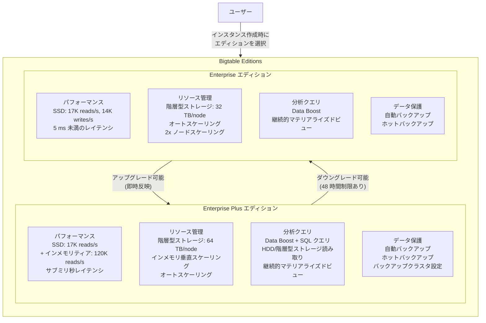

# Bigtable: Editions (Enterprise / Enterprise Plus) が一般提供開始

**リリース日**: 2026-04-22

**サービス**: Bigtable

**機能**: Bigtable Editions (Enterprise / Enterprise Plus)

**ステータス**: GA (一般提供)

[このアップデートのインフォグラフィックを見る](https://takech9203.github.io/google-cloud-news-summary/20260422-bigtable-editions.html)

## 概要

Bigtable Editions が一般提供 (GA) として正式にリリースされた。Bigtable Editions は、パフォーマンス、分析クエリ機能、リソース管理における高度な機能を段階的に提供する新しい価格・機能モデルである。ユーザーはワークロードの要件に応じて Enterprise エディションと Enterprise Plus エディションの 2 つから選択できるようになった。

Enterprise エディションは、従来の Bigtable サービスに相当する標準エディションであり、低レイテンシワークロード、機械学習、時系列分析、運用分析などの用途に適している。2026 年 4 月以前に作成されたすべてのインスタンスは、既存の機能や課金に変更なく自動的に Enterprise エディションに分類される。Enterprise Plus エディションは、Enterprise のすべての機能に加え、インメモリティア (Preview) によるサブミリ秒の読み取りレイテンシ、ノードあたり最大 64 TB の拡張階層型ストレージ、Data Boost での SQL クエリサポートおよび階層型ストレージ/HDD アクセスなど、高度な機能を提供する。

このアップデートは、マルチテナント環境で卓越したパフォーマンスとスケーラビリティを必要とする組織、リアルタイムデータ処理でサブミリ秒のレイテンシを求めるアプリケーション開発者、大容量データの効率的な管理とコスト最適化を目指すデータプラットフォームチームにとって特に重要である。

**アップデート前の課題**

- Bigtable のすべてのインスタンスが単一の機能・価格体系で提供されており、ワークロードの特性に応じた機能やコストの最適化ができなかった
- サブミリ秒の読み取りレイテンシを必要とするワークロードでは、Bigtable の前段にセルフマネージドのキャッシュソリューションを別途構築・運用する必要があった
- ノードあたりのストレージ容量が最大 32 TB に制限されており、大量の低頻度アクセスデータを保持するにはより多くのノードが必要だった
- Data Boost で SQL クエリを実行したり、階層型ストレージや HDD のデータにアクセスしたりすることができなかった

**アップデート後の改善**

- Enterprise と Enterprise Plus の 2 つのエディションから選択できるようになり、ワークロードに最適な機能セットとコストバランスを選べるようになった
- Enterprise Plus のインメモリティア (Preview) により、ノードあたり最大 120,000 読み取り/秒、サブミリ秒のレイテンシが実現可能になり、セルフマネージドキャッシュが不要になった
- Enterprise Plus では階層型ストレージの上限がノードあたり 64 TB に拡張され、より多くの低頻度アクセスデータを効率的に保持できるようになった
- Enterprise Plus の Data Boost で GoogleSQL クエリの実行と、階層型ストレージ/HDD クラスタからのデータ読み取りが GA として利用可能になった

## アーキテクチャ図



Enterprise エディションは標準的な Bigtable の機能セットを提供し、Enterprise Plus エディションはインメモリティア、拡張ストレージ、高度な分析クエリなど追加の高度な機能を提供する。エディション間のアップグレード・ダウングレードはいつでも可能だが、Enterprise Plus からのダウングレードには 48 時間の制限がある。

## サービスアップデートの詳細

### 主要機能

1. **エディション選択モデル**
   - インスタンス作成時または既存インスタンスの更新時にエディションを選択可能
   - Enterprise から Enterprise Plus へのアップグレードは即時反映され、すぐに Enterprise Plus の機能を利用可能
   - Enterprise Plus から Enterprise へのダウングレードは、Enterprise Plus 専用機能を無効化した後に実行可能 (作成・アップグレード後 48 時間はダウングレード不可)
   - 2026 年 4 月以前に作成されたすべてのインスタンスは自動的に Enterprise エディションに分類

2. **インメモリティア (Enterprise Plus, Preview)**
   - ハイブリッドストレージノードにより、SSD の永続ストレージに加えメモリ層を提供
   - ノードあたり 8 GB の RAM を使用し、ベース容量として 40,000 reads/s を提供
   - 垂直スケーリングにより 40,000 reads/s 刻みで最大 120,000 reads/s まで自動拡張
   - RDMA (Remote Direct Memory Access) によりレスポンスタイムを大幅に短縮
   - LRU (Least Recently Used) エビクションと 15 分の TTL 無効化ポリシーを採用
   - ネガティブキャッシュにより存在しないリソースへの繰り返しアクセスを防止
   - クラスタレベルで read-your-write 一貫性を維持

3. **拡張階層型ストレージ (Enterprise Plus, Preview)**
   - ノードあたりの階層型ストレージ上限が 32 TB (Enterprise) から 64 TB (Enterprise Plus) に拡張
   - 低頻度アクセスデータをより多く保持でき、ストレージコストの最適化が可能

4. **高度な Data Boost 機能 (Enterprise Plus, GA)**
   - GoogleSQL クエリのサポート: Data Boost を使用して SQL ベースの分析クエリを実行可能
   - 階層型ストレージおよび HDD クラスタからのデータ読み取りが可能
   - 高スループットのバッチ分析とリアルタイム処理の共存を実現

5. **自動バックアップクラスタ設定 (Enterprise Plus, GA)**
   - レプリケーションされたインスタンスで、どのクラスタで自動バックアップを実行するかを指定可能
   - バックアップリソースの管理とコスト制御が向上

## 技術仕様

### エディション機能比較

| 機能カテゴリ | Enterprise | Enterprise Plus |
|-------------|-----------|----------------|
| SSD パフォーマンス | 17,000 reads/s, 14,000 writes/s (5 ms 未満) | 17,000 reads/s, 14,000 writes/s (5 ms 未満) |
| インメモリティア | 非対応 | 最大 120,000 reads/s、サブミリ秒レイテンシ (Preview) |
| 階層型ストレージ | 最大 32 TB/node (Preview) | 最大 64 TB/node (Preview) |
| Data Boost | 標準 Data Boost | SQL クエリ対応、HDD/階層型ストレージ読み取り対応 |
| 垂直スケーリング | 非対応 | インメモリ垂直スケーリング (Preview) |
| バックアップ | 自動バックアップ、ホットバックアップ | 自動バックアップ、ホットバックアップ、バックアップクラスタ設定 |
| 確約利用割引 | 1 年: 20%、3 年: 40% | 1 年: 20%、3 年: 40% |
| 可用性 SLA | 最大 99.999% (構成による) | 最大 99.999% (構成による) |
| マルチリージョンレプリケーション | 対応 | 対応 |

### インメモリティアの仕様

| 項目 | 詳細 |
|------|------|
| ノードあたり RAM | 8 GB |
| ベース読み取り性能 | 40,000 reads/s |
| 最大読み取り性能 | 120,000 reads/s (垂直スケーリング時) |
| スケーリング単位 | 40,000 reads/s 刻み |
| エビクションポリシー | LRU (行レベル) |
| TTL 無効化ポリシー | 15 分 |
| 行サイズ上限 | 1 MiB/行キー |
| 対応ストレージ | SSD のみ (HDD 非対応) |
| 対応操作 | 単一行のポイント読み取りのみ |
| 必要クライアント | Java 用 Bigtable クライアントライブラリ v2.77.0 以降 (または BOM v26.80.0 以降) |

## 設定方法

### 前提条件

1. Google Cloud プロジェクトで Bigtable API が有効化されていること
2. Bigtable インスタンスの管理に必要な IAM ロール (Bigtable 管理者など) が付与されていること

### 手順

#### ステップ 1: 新規インスタンスでエディションを選択する

Google Cloud コンソールで Bigtable インスタンスを作成する際に、エディションを選択する。

```bash
# gcloud CLI で Enterprise Plus インスタンスを作成する例
gcloud bigtable instances create INSTANCE_ID \
  --display-name="My Enterprise Plus Instance" \
  --edition=ENTERPRISE_PLUS \
  --cluster-config=id=CLUSTER_ID,zone=ZONE,nodes=3
```

#### ステップ 2: 既存インスタンスをアップグレードする

既存の Enterprise インスタンスを Enterprise Plus にアップグレードする。

```bash
# gcloud CLI でエディションをアップグレード
gcloud bigtable instances update INSTANCE_ID \
  --edition=ENTERPRISE_PLUS
```

アップグレードは即時反映され、Enterprise Plus の機能にすぐにアクセスできる。

#### ステップ 3: インメモリティアを有効化する (Enterprise Plus のみ)

Enterprise Plus インスタンスのクラスタでインメモリティアを有効化する。Google Cloud コンソールでインスタンスの編集画面からインメモリティアを有効にできる。

#### ステップ 4: ダウングレードする場合

Enterprise Plus から Enterprise にダウングレードする場合は、まず Enterprise Plus 専用の機能 (インメモリティアなど) を無効化する必要がある。また、アップグレードから 48 時間以内はダウングレードできない。

```bash
# gcloud CLI でエディションをダウングレード
gcloud bigtable instances update INSTANCE_ID \
  --edition=ENTERPRISE
```

## メリット

### ビジネス面

- **ワークロードに最適なコスト構造**: Enterprise と Enterprise Plus の 2 つのエディションにより、要件に応じた機能と価格のバランスを選択でき、過剰なコストを抑制できる
- **セルフマネージドキャッシュの削減**: インメモリティアにより、Redis や Memcached などのセルフマネージドキャッシュ層の構築・運用が不要になり、運用コストとアーキテクチャの複雑性が低減する
- **確約利用割引の活用**: 両エディションとも 1 年 20%、3 年 40% の確約利用割引が利用可能であり、長期利用時のコスト最適化が可能

### 技術面

- **サブミリ秒のレイテンシ**: Enterprise Plus のインメモリティアにより、1 ms 未満の読み取りレイテンシを Bigtable 単体で実現でき、キャッシュ層の管理が不要
- **自動垂直スケーリング**: インメモリティアのノードはトラフィックの急増に応じて自動的に垂直スケーリングし、Bigtable のオートスケーリングと連携して水平スケーリングも実行
- **統合ストレージアーキテクチャ**: RAM、SSD、階層型ストレージの 3 層を単一の API で統合的に管理でき、データアクセスパターンに応じた自動的なデータ配置が可能
- **高度な分析機能**: Enterprise Plus の Data Boost で GoogleSQL を使用した分析クエリが実行可能であり、運用ワークロードに影響を与えずに分析処理を実行できる

## デメリット・制約事項

### 制限事項

- Enterprise Plus のインメモリティアは現在 Preview であり、本番環境での利用には Pre-GA の利用規約が適用される
- インメモリティアは単一行のポイント読み取り操作のみをサポートし、データスキャンや SQL クエリには対応していない
- インメモリティアのアプリプロファイルは単一クラスタルーティングのみをサポートする
- CMEK (Customer-Managed Encryption Keys) クラスタではインメモリティアを利用できない
- Enterprise Plus へのアップグレード後 48 時間はダウングレードできない
- Enterprise Plus インスタンスおよび Enterprise Plus 専用機能は無料トライアル版の Bigtable では利用できない

### 考慮すべき点

- Enterprise Plus は独自のノード SKU を持つため、Enterprise とは異なるノード単価が適用される。コスト比較は [Bigtable 料金ページ](https://cloud.google.com/bigtable/pricing) で確認すること
- インメモリティアの垂直スケーリング (ベースの 40,000 reads/s を超える分) には追加の課金乗数が適用される
- 既存のインスタンスから Enterprise Plus へのアップグレードは即時反映だが、インメモリティアのプロビジョニングには最大 30 分かかる場合がある
- マルチクラスタインスタンスでは、各クラスタのメモリティアは独立して動作し、同期されない (標準的な最終一貫性レプリケーションモデルに従う)

## ユースケース

### ユースケース 1: リアルタイム広告配信プラットフォーム

**シナリオ**: 大規模な広告配信プラットフォームで、ユーザープロファイルや入札データにサブミリ秒のレイテンシでアクセスする必要がある。従来は Bigtable の前段に Redis クラスタをキャッシュ層として運用していたが、キャッシュの整合性管理やインフラ運用コストが課題だった。

**効果**: Enterprise Plus のインメモリティアを有効化することで、Bigtable 単体でサブミリ秒の読み取りレイテンシを実現できる。セルフマネージドの Redis クラスタが不要になり、アーキテクチャの簡素化と運用コスト削減が見込める。垂直スケーリングによりトラフィックのピーク時にも安定したパフォーマンスを維持できる。

### ユースケース 2: IoT 時系列データの長期保持と分析

**シナリオ**: IoT デバイスから収集した大量の時系列データを Bigtable に格納しているが、過去数か月分のデータにはほとんどアクセスしないにもかかわらず、SSD ストレージにすべて保持しているためストレージコストが増大している。また、過去データに対する分析クエリを本番ワークロードに影響なく実行したい。

**効果**: Enterprise Plus の拡張階層型ストレージ (64 TB/node) により、低頻度アクセスデータをコスト効率の高い階層型ストレージに移行できる。Data Boost の SQL クエリサポートを使用して、本番クラスタに影響を与えずに過去データの分析クエリを実行可能になる。

### ユースケース 3: マルチテナント SaaS プラットフォーム

**シナリオ**: 複数のテナントが共有する SaaS プラットフォームのバックエンドとして Bigtable を使用しており、特定テナントのトラフィック急増によるホットスポットが他テナントの性能に影響することが課題だった。

**効果**: Enterprise Plus のインメモリティアのホットスポット緩和機能と垂直スケーリングにより、特定行キーへのトラフィック集中を自動的に吸収できる。手動介入なしでトラフィックスパイクに対応し、テナント間のパフォーマンス分離を改善できる。

## 料金

Bigtable Editions の料金は、選択したエディションに応じたノード時間、ストレージ、ネットワーク転送に基づいて課金される。Enterprise Plus は独自のノード SKU を持ち、Enterprise とは異なるノード単価が適用される。課金モデル自体 (ノード時間、ストレージ、ネットワーク) は従来と同じである。

インメモリティアの垂直スケーリング (ベース容量の 40,000 reads/s を超える部分) には、ノードの時間単価に乗数が適用される。

確約利用割引 (CUD) は両エディションで利用可能であり、1 年契約で 20%、3 年契約で 40% の割引が適用される。

詳細な料金は [Bigtable 料金ページ](https://cloud.google.com/bigtable/pricing) を参照。

## 関連サービス・機能

- **[Data Boost](https://cloud.google.com/bigtable/docs/data-boost-overview)**: Bigtable のサーバーレス分析機能。Enterprise Plus では SQL クエリおよび階層型ストレージ/HDD からのデータ読み取りが追加で利用可能
- **[階層型ストレージ](https://cloud.google.com/bigtable/docs/tiered-storage)**: 低頻度アクセスデータを低コストのストレージ層に格納する機能。Enterprise Plus ではノードあたり 64 TB まで拡張
- **[オートスケーリング](https://cloud.google.com/bigtable/docs/autoscaling)**: クラスタの CPU 使用率に基づいてノード数を自動調整する機能。インメモリティアの垂直スケーリングと連携して動作
- **[継続的マテリアライズドビュー](https://cloud.google.com/bigtable/docs/continuous-materialized-views)**: テーブルデータの集約ビューを自動的に維持する機能。両エディションで利用可能
- **[マルチリージョンレプリケーション](https://cloud.google.com/bigtable/docs/replication-overview)**: 複数リージョンにデータを複製し、高可用性とディザスタリカバリを実現する機能

## 参考リンク

- [インフォグラフィック](https://takech9203.github.io/google-cloud-news-summary/20260422-bigtable-editions.html)
- [公式リリースノート](https://cloud.google.com/release-notes#April_22_2026)
- [Editions 概要ドキュメント](https://cloud.google.com/bigtable/docs/editions-overview)
- [インメモリティア概要](https://cloud.google.com/bigtable/docs/in-memory-overview)
- [インスタンスのエディション変更方法](https://cloud.google.com/bigtable/docs/modifying-instance)
- [Bigtable 料金](https://cloud.google.com/bigtable/pricing)
- [確約利用割引 (CUD)](https://cloud.google.com/bigtable/docs/cuds)
- [Data Boost 概要](https://cloud.google.com/bigtable/docs/data-boost-overview)

## まとめ

Bigtable Editions の GA リリースにより、ワークロードの要件に応じて Enterprise と Enterprise Plus の 2 つのエディションを選択できるようになった。特に Enterprise Plus のインメモリティア (Preview) はサブミリ秒のレイテンシとノードあたり最大 120,000 reads/s の高スループットを提供し、セルフマネージドのキャッシュ層を置き換える可能性を持つ。既存の Bigtable ユーザーは、まず [Editions 概要ドキュメント](https://cloud.google.com/bigtable/docs/editions-overview) でエディション間の機能比較を確認し、サブミリ秒レイテンシや大容量ストレージなどの要件がある場合は Enterprise Plus へのアップグレードを検討することを推奨する。

---

**タグ**: #Bigtable #Editions #Enterprise #EnterprisePlus #InMemoryTier #TieredStorage #DataBoost #GA #パフォーマンス #ストレージ #分析
