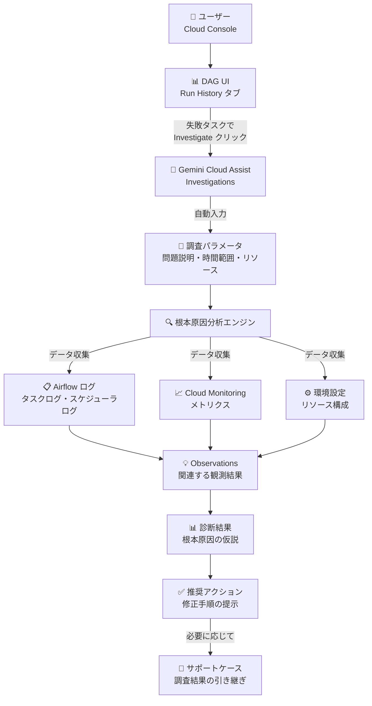

# Cloud Composer (Managed Airflow): Gemini Cloud Assist Investigations による Airflow トラブルシューティング

**リリース日**: 2026-04-22

**サービス**: Cloud Composer (Managed Service for Apache Airflow)

**機能**: Gemini Cloud Assist Investigations for Airflow Troubleshooting

**ステータス**: Private Preview

:bar_chart: [このアップデートのインフォグラフィックを見る](https://takech9203.github.io/google-cloud-news-summary/20260422-cloud-composer-gemini-investigations.html)

## 概要

Managed Service for Apache Airflow (旧 Cloud Composer) が Gemini Cloud Assist Investigations 機能をサポートした。これにより、失敗した Airflow タスクインスタンスや DAG ラン (DAG runs) を AI ベースのトラブルシューティングエージェントが自動的に調査・診断できるようになる。本機能は現在 Private Preview として提供されている。

Gemini Cloud Assist Investigations は、Google Cloud 上の複雑な分散環境におけるインフラストラクチャやアプリケーションの問題を診断するための根本原因分析 (RCA) ツールである。Managed Airflow 環境では、DAG UI から直接失敗したタスクの調査を開始でき、環境の詳細情報（問題の説明、時間範囲、関連リソース）が自動的に入力される。

この機能は、Airflow 2.7.3 以降のバージョンを使用する Managed Airflow 環境で利用可能であり、データエンジニアやプラットフォームエンジニアがワークフロー障害の原因を迅速に特定し、解決時間を短縮するのに役立つ。

**アップデート前の課題**

Airflow タスクの障害調査には、従来多くの手作業と専門知識が必要であった。

- タスク失敗時にログ、メトリクス、設定を個別に確認する必要があり、原因特定に時間がかかっていた
- ゾンビタスク、OOM エラー、スケジューラの問題など、複数のコンポーネントにまたがる障害の根本原因分析が困難であった
- ログが出力されないタスク失敗のケースでは、原因調査の手がかりが限られていた
- トラブルシューティングの知見が個人に依存し、組織として体系的な障害対応が難しかった

**アップデート後の改善**

- DAG UI から直接「Investigate」ボタンをクリックするだけで AI ベースの根本原因分析を開始できるようになった
- Gemini が ログ、設定、メトリクスなど複数のデータソースを横断的に分析し、関連する Observations (観測結果) を自動生成する
- ログが出力されないタスク失敗でも、スケジューラログなど他のデータソースから原因を特定できる
- 根本原因の仮説と修正のための推奨アクションが自動的に提示される

## アーキテクチャ図



ユーザーが DAG UI で失敗タスクの調査を開始すると、Gemini Cloud Assist が自動的にログ、メトリクス、設定情報を収集・分析し、根本原因の仮説と推奨アクションを提示する。

## サービスアップデートの詳細

### 主要機能

1. **DAG UI からのワンクリック調査開始**
   - 失敗した Airflow タスクの State 列に表示される「Investigate」ボタンから直接調査を開始できる
   - 環境の詳細情報（問題の説明、時間範囲、関連リソース）が自動的にポピュレートされる
   - 既存の調査がある場合は「View investigation」で確認、または「New investigation」で新規調査を開始できる

2. **AI ベースの根本原因分析 (RCA)**
   - ログ、設定、メトリクスなど複数のデータソースを横断的に分析
   - Observations (観測結果) として関連性の高い情報をランク付け・フィルタリングして提示
   - 各観測結果にはソースデータへのリンクが含まれ、ファクトチェックが可能
   - 不確実性がある場合は複数の仮説を提示し、反復的な深掘り調査が可能

3. **修正推奨アクションの提示**
   - 根本原因に基づく具体的な修正手順や次のトラブルシューティングステップを提示
   - 特定のリソースや時間帯への参照情報を含むため、手動で収集するよりも効率的
   - Premium Support を利用している場合、調査結果をそのままサポートケースに引き継ぐことが可能

## 技術仕様

### 対応要件

| 項目 | 詳細 |
|------|------|
| 対応 Airflow バージョン | Airflow 2.7.3 以降 |
| 対応 Cloud Composer バージョン | Composer 2 および Composer 3 |
| ステータス | Private Preview |
| アクセス条件 | Premium Support 契約、またはアカウントチーム経由でのアクセスリクエスト |
| 調査スコープ | 単一 Google Cloud プロジェクトまたは単一 App Hub アプリケーション |

### 必要な API

| API | 必須/推奨 |
|-----|-----------|
| `cloudaicompanion.googleapis.com` | 必須 |
| `cloudasset.googleapis.com` | 必須 |
| `cloudresourcemanager.googleapis.com` | 必須 |
| `geminicloudassist.googleapis.com` | 必須 |
| `logging.googleapis.com` | 推奨 |
| `monitoring.googleapis.com` | 推奨 |

### IAM ロール

```json
{
  "required_roles": [
    {
      "role": "roles/geminicloudassist.investigationCreator",
      "description": "調査の作成に必要"
    },
    {
      "role": "roles/geminicloudassist.user",
      "description": "Gemini Cloud Assist の一般利用に必要"
    },
    {
      "role": "roles/cloudasset.viewer",
      "description": "関連アセットのトポロジ発見に推奨"
    }
  ],
  "auto_granted_roles": [
    {
      "role": "roles/geminicloudassist.investigationOwner",
      "description": "調査作成時に自動付与される"
    }
  ]
}
```

## 設定方法

### 前提条件

1. Managed Airflow 環境が Airflow 2.7.3 以降で稼働していること
2. Premium Support 契約を有している、またはアカウントチーム経由で Private Preview へのアクセスをリクエスト済みであること
3. 必要な API が有効化されていること

### 手順

#### ステップ 1: 必要な API の有効化

```bash
# 必須 API の有効化
gcloud services enable cloudaicompanion.googleapis.com \
  cloudasset.googleapis.com \
  cloudresourcemanager.googleapis.com \
  geminicloudassist.googleapis.com \
  --project=PROJECT_ID

# 推奨 API の有効化
gcloud services enable logging.googleapis.com \
  monitoring.googleapis.com \
  --project=PROJECT_ID
```

#### ステップ 2: IAM ロールの付与

```bash
# Investigation Creator ロールの付与
gcloud projects add-iam-policy-binding PROJECT_ID \
  --member="user:USER_EMAIL" \
  --role="roles/geminicloudassist.investigationCreator"

# Gemini Cloud Assist User ロールの付与
gcloud projects add-iam-policy-binding PROJECT_ID \
  --member="user:USER_EMAIL" \
  --role="roles/geminicloudassist.user"
```

#### ステップ 3: DAG UI から調査を開始

1. Google Cloud Console で「Environments」ページに移動
2. 対象の環境を選択し、環境詳細ページの「DAGs」タブを開く
3. DAG 名をクリックし、「Run history」タブで失敗したタスクを含む DAG ランを選択
4. 失敗した Airflow タスクの State 列で「Investigate」をクリック
5. 調査パラメータを確認・編集し、「Create」をクリックして調査を開始

## メリット

### ビジネス面

- **インシデント解決時間の短縮**: AI による自動分析により、障害の根本原因特定にかかる時間を大幅に削減できる。手動でのログ調査やメトリクス確認の工数が不要になる
- **運用コストの削減**: トラブルシューティングの専門知識がなくても障害対応が可能となり、SRE やデータエンジニアの負荷を軽減できる
- **サポートケースの効率化**: 調査結果をサポートケースにシームレスに引き継げるため、サポートエンジニアとのやり取りの往復が減少する

### 技術面

- **横断的なデータ分析**: ログ、メトリクス、設定情報を横断的に分析するため、単一のデータソースでは発見できない原因を特定できる
- **コンテキスト自動入力**: DAG UI から起動することで、環境情報が自動的にポピュレートされ、調査の精度が向上する
- **反復的な調査**: 調査結果に基づいて新しいリビジョンを作成し、特定の領域をさらに深掘りできる

## デメリット・制約事項

### 制限事項

- Private Preview のため、Premium Support 契約またはアカウントチーム経由でのアクセスリクエストが必要
- 調査スコープは単一の Google Cloud プロジェクトまたは単一の App Hub アプリケーションに限定される
- Airflow 2.7.3 未満のバージョンでは利用できない
- AI 技術の一般的な制限事項が適用される（調査結果の再実行で異なる結果が生じる可能性がある）

### 考慮すべき点

- 調査実行時に OAuth 2.0 トークンが使用される。トークンのアクセス範囲は調査を実行するユーザーのアクセス権限に限定される
- 調査リソース（アノテーション、観測結果を含む）は任意の Google Cloud データセンターに保存される可能性があるため、データレジデンシーや管轄に関する規制コンプライアンスの対象データに対しては調査を実施すべきでない
- 調査の精度を高めるため、時間範囲が正確であることを確認することが重要

## ユースケース

### ユースケース 1: OOM によるタスク失敗の調査

**シナリオ**: データ処理 DAG のタスクが断続的に失敗し、タスクログにはエラーメッセージが出力されていない状況。原因の特定が困難。

**実装例**:
1. DAG UI で失敗した DAG ランを選択
2. 失敗タスクの「Investigate」ボタンをクリック
3. Gemini Cloud Assist が自動的にスケジューラログを分析し、Worker Pod の OOM による再起動とゾンビタスクへの終了を検出
4. 推奨アクション: Worker のリソース制限の引き上げが提示される

**効果**: ログが出力されないケースでも、スケジューラログや Pod メトリクスから根本原因を特定し、解決策を得られる

### ユースケース 2: 依存関係エラーによる DAG 失敗の調査

**シナリオ**: 新しい PyPI パッケージの追加後、複数の DAG が連鎖的に失敗している状況。

**効果**: Gemini Cloud Assist が環境の設定変更履歴とタスクログを関連付けて分析し、パッケージの依存関係の競合を根本原因として特定。バージョン固定やパッケージ削除などの具体的な修正手順が提示される

## 料金

Gemini Cloud Assist Investigations の利用には、以下の条件が必要となる。

- **Premium Support 契約**: 調査の作成・実行・編集に必要（2026 年 4 月 10 日以降の要件）
- **Gemini Cloud Assist**: Gemini for Google Cloud の利用契約に基づく

Cloud Composer (Managed Airflow) 自体の料金は別途発生する。

詳細な料金については公式ドキュメントを参照されたい。

## 利用可能リージョン

Cloud Composer (Managed Airflow) が利用可能なすべてのリージョンで本機能が利用可能と想定されるが、Private Preview のため具体的なリージョン制限がある可能性がある。詳細は公式ドキュメントまたはアカウントチームに確認されたい。

## 関連サービス・機能

- **Gemini Cloud Assist**: 本機能の基盤となる AI アシスタントプラットフォーム。チャット、調査、トラブルシューティングなど幅広い機能を提供
- **Cloud Monitoring**: メトリクスの収集・分析基盤。Investigations がメトリクスデータを参照する際に利用される。アラートからも調査を開始可能
- **Cloud Logging**: ログの収集・管理基盤。Logs Explorer からも調査を開始でき、ログメッセージが自動的に調査に反映される
- **Cloud Composer MCP サーバー**: 2026 年 4 月 15 日に Preview リリースされた MCP サーバーにより、AI アプリケーションから Cloud Composer 環境の管理や DAG ラン・タスクの詳細取得が可能
- **Cloud Hub**: Health & troubleshooting ページから調査を開始・管理できるダッシュボード

## 参考リンク

- :bar_chart: [インフォグラフィック](https://takech9203.github.io/google-cloud-news-summary/20260422-cloud-composer-gemini-investigations.html)
- [公式リリースノート](https://cloud.google.com/release-notes#April_22_2026)
- [Gemini Cloud Assist Investigations ドキュメント](https://docs.cloud.google.com/cloud-assist/investigations)
- [Cloud Composer での Airflow タスク失敗の調査](https://docs.cloud.google.com/composer/docs/composer-3/troubleshooting-dags#investigations)
- [調査の作成手順](https://docs.cloud.google.com/cloud-assist/create-investigation)
- [Gemini Cloud Assist の IAM 要件](https://docs.cloud.google.com/cloud-assist/iam-requirements)
- [Cloud Composer 料金ページ](https://cloud.google.com/composer/pricing)

## まとめ

Managed Service for Apache Airflow (Cloud Composer) における Gemini Cloud Assist Investigations のサポートは、Airflow ワークフローのトラブルシューティングを根本的に変革するアップデートである。AI による横断的なログ・メトリクス・設定分析により、従来は手動で行っていた障害の根本原因特定プロセスが大幅に効率化される。現在は Private Preview のため、利用には Premium Support 契約またはアカウントチーム経由でのアクセスリクエストが必要であるが、Airflow ベースの重要なデータパイプラインを運用している組織にとっては、GA に向けて早期に評価を開始することを推奨する。

---

**タグ**: #CloudComposer #ManagedAirflow #GeminiCloudAssist #Investigations #Troubleshooting #RCA #PrivatePreview #ApacheAirflow #DAG #AI
