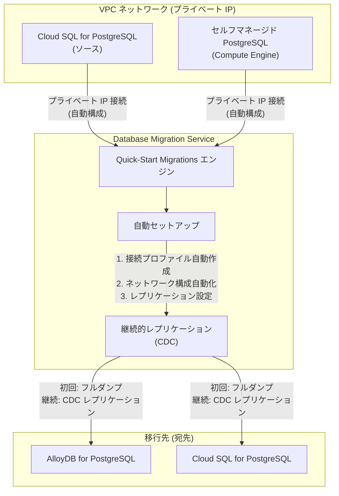

# Cloud Database Migration Service: Quick-Start Migrations for PostgreSQL (Preview)

**リリース日**: 2026-04-22

**サービス**: Cloud Database Migration Service / AlloyDB for PostgreSQL / Cloud SQL for PostgreSQL

**機能**: Quick-Start Migrations for PostgreSQL

**ステータス**: Preview

[このアップデートのインフォグラフィックを見る](https://takech9203.github.io/google-cloud-news-summary/20260422-cloud-dms-quick-start-migrations.html)

## 概要

Database Migration Service (DMS) に「Quick-Start Migrations (クイックスタートマイグレーション)」機能が Preview として追加された。この機能は、PostgreSQL の同種 (ホモジニアス) マイグレーションにおいて、VPC ネットワーク内でプライベート IP を持つソースデータベースから Cloud SQL for PostgreSQL および AlloyDB for PostgreSQL への移行を、軽量かつ継続的なマイグレーションフローで実現するものである。

Quick-Start Migrations の最大の特徴は、マイグレーションに必要なセットアップを DMS が自動的に行う点にある。従来の DMS マイグレーションでは、接続プロファイルの作成、ネットワーク接続性の設定、レプリケーションの構成など、複数のステップを手動で行う必要があった。Quick-Start Migrations はこれらの設定を自動化し、Compute Engine 上のセルフマネージド PostgreSQL データベースや Cloud SQL for PostgreSQL インスタンスなど、VPC 内にプライベート IP を持つソースからの移行を大幅に簡素化する。

この機能は AlloyDB for PostgreSQL と Cloud SQL for PostgreSQL の両方に統合されており、それぞれのコンソールやワークフローから直接利用できる。データベースの移行を計画している組織にとって、移行の初期設定にかかる時間と労力を削減し、より迅速にマイグレーションを開始できるようになる。

**アップデート前の課題**

- DMS でのマイグレーション設定には、ソース接続プロファイル、宛先接続プロファイル、VPC ピアリングやプライベート接続構成など、複数の手動ステップが必要だった
- プライベート IP を持つソースデータベースへの接続には、プライベート接続構成やファイアウォールルールの手動設定が必要で、ネットワーク設定の専門知識が求められた
- マイグレーションジョブの作成・開始まで多くの事前準備が必要であり、特に小規模〜中規模のデータベース移行では、セットアップのオーバーヘッドが移行作業の大部分を占めることがあった

**アップデート後の改善**

- DMS がマイグレーションに必要なセットアップ (接続プロファイル、ネットワーク構成、レプリケーション設定) を自動的に構成するようになった
- VPC ネットワーク内のプライベート IP を持つソースへの接続が自動化され、ネットワーク設定の複雑さが大幅に軽減された
- AlloyDB for PostgreSQL および Cloud SQL for PostgreSQL の両方に統合され、継続的 (continuous) なマイグレーションフローとして軽量に利用できるようになった

## アーキテクチャ図



Quick-Start Migrations は VPC 内のプライベート IP を持つ PostgreSQL ソースに対して接続とレプリケーションのセットアップを自動化し、AlloyDB for PostgreSQL または Cloud SQL for PostgreSQL への継続的なマイグレーションフローを提供する。

## サービスアップデートの詳細

### 主要機能

1. **自動セットアップ**
   - マイグレーションに必要な接続プロファイル、ネットワーク構成、レプリケーション設定を DMS が自動的に構成
   - VPC ネットワーク内のプライベート IP を持つソースへの接続を自動的に確立
   - 従来必要だったプライベート接続構成の手動セットアップが不要

2. **軽量な継続的マイグレーションフロー**
   - フルダンプによる初期データロードの後、Change Data Capture (CDC) による継続的レプリケーションを実行
   - ソースデータベースを稼働させたまま、最小限のダウンタイムでの移行が可能
   - 移行先の準備ができたタイミングで、マイグレーションジョブをプロモートして切り替え

3. **AlloyDB および Cloud SQL for PostgreSQL への統合**
   - AlloyDB for PostgreSQL のコンソール/ワークフローから直接 Quick-Start Migrations を開始可能
   - Cloud SQL for PostgreSQL のコンソール/ワークフローからも同様に利用可能
   - ホモジニアス (同種) PostgreSQL マイグレーションに特化

## 技術仕様

### サポートされるソースとデスティネーション

| 項目 | 詳細 |
|------|------|
| ソース: Cloud SQL for PostgreSQL | VPC ネットワーク内でプライベート IP が割り当てられたインスタンス |
| ソース: セルフマネージド PostgreSQL | Compute Engine 上で動作し、VPC 内にプライベート IP を持つインスタンス |
| デスティネーション: AlloyDB for PostgreSQL | AlloyDB クラスタ |
| デスティネーション: Cloud SQL for PostgreSQL | Cloud SQL インスタンス |
| マイグレーションタイプ | ホモジニアス (PostgreSQL to PostgreSQL) |
| マイグレーションフロー | 継続的 (Continuous) - フルダンプ + CDC |
| ステータス | Preview |

### ネットワーク要件

| 項目 | 詳細 |
|------|------|
| ソース接続 | VPC 内のプライベート IP が必須 |
| ネットワーク構成 | DMS が自動的に設定 |
| 対応ネットワーク | VPC ネットワーク |
| パブリック IP ソース | Quick-Start Migrations では非対応 (従来の DMS フローを使用) |

### 必要な API

```bash
# 有効化が必要な API
gcloud services enable datamigration.googleapis.com
gcloud services enable compute.googleapis.com
gcloud services enable sqladmin.googleapis.com    # Cloud SQL を使用する場合
gcloud services enable alloydb.googleapis.com     # AlloyDB を使用する場合
```

## 設定方法

### 前提条件

1. Google Cloud プロジェクトで Database Migration Service API が有効化されていること
2. ソースの PostgreSQL データベースが VPC ネットワーク内でプライベート IP を持っていること
3. 適切な IAM ロール (`roles/datamigration.admin`) が付与されていること
4. デスティネーションとなる AlloyDB クラスタまたは Cloud SQL for PostgreSQL インスタンスが作成済み、もしくは作成予定であること

### 手順

#### ステップ 1: Database Migration Service コンソールにアクセス

```
Google Cloud コンソール > Database Migration Service > マイグレーションジョブ
```

AlloyDB または Cloud SQL for PostgreSQL のコンソールからも Quick-Start Migrations を開始できる。

#### ステップ 2: Quick-Start Migration の作成

Quick-Start Migrations を選択すると、DMS がソースデータベースの検出とネットワーク接続の自動構成を行う。従来のマイグレーションフローとは異なり、接続プロファイルやプライベート接続構成を手動で作成する必要がない。

#### ステップ 3: マイグレーションの実行と監視

```bash
# マイグレーションジョブのステータス確認 (gcloud CLI の場合)
gcloud database-migration migration-jobs describe MIGRATION_JOB_ID \
  --region=REGION
```

DMS がフルダンプを完了した後、CDC フェーズに移行し、ソースデータベースの変更を継続的にレプリケートする。

#### ステップ 4: マイグレーションのプロモート

ソースとデスティネーションが同期した状態で、マイグレーションジョブをプロモートしてアプリケーションを切り替える。

```bash
# マイグレーションジョブのプロモート
gcloud database-migration migration-jobs promote MIGRATION_JOB_ID \
  --region=REGION
```

## メリット

### ビジネス面

- **移行の迅速化**: セットアップの自動化により、マイグレーションの計画から実行までの時間を大幅に短縮できる
- **運用コストの削減**: ネットワーク構成やレプリケーション設定の手動作業が不要になり、専門知識を持つエンジニアの作業時間を削減できる
- **移行ハードルの低下**: データベースマイグレーションの複雑さが軽減され、より多くのチームが自律的にマイグレーションを実行できるようになる

### 技術面

- **ネットワーク設定の自動化**: VPC ピアリングやプライベート接続構成など、エラーの起きやすいネットワーク設定を DMS が自動的に処理する
- **継続的レプリケーション**: CDC ベースの継続的レプリケーションにより、ソースデータベースを稼働させたまま最小ダウンタイムでの移行が可能
- **統合されたワークフロー**: AlloyDB と Cloud SQL の両方のコンソールから直接利用可能で、デスティネーションサービスに応じたシームレスな体験を提供

## デメリット・制約事項

### 制限事項

- Preview 段階のため、本番環境での使用は SLA の対象外であり、機能の変更や廃止の可能性がある
- ホモジニアス (PostgreSQL to PostgreSQL) マイグレーションのみに対応しており、異種データベース間の移行には従来の DMS フローが必要
- ソースデータベースが VPC ネットワーク内でプライベート IP を持つ場合にのみ利用可能で、パブリック IP のみのソースには非対応
- Quick-Start Migrations の対象はプライベート IP を持つ Cloud SQL for PostgreSQL およびセルフマネージド PostgreSQL (Compute Engine) に限定される

### 考慮すべき点

- Preview 機能のため、「Pre-GA Offerings Terms」が適用される。本番ワークロードでの使用前に利用規約を確認すること
- 従来の DMS マイグレーションフローとの機能差分 (カスタムネットワーク構成、高度なフィルタリングなど) を事前に確認し、要件に合致するか評価すること
- 大規模データベースの移行では、フルダンプフェーズの所要時間とネットワーク帯域幅の影響を事前に見積もること
- 自動構成されるネットワーク設定が、組織のセキュリティポリシーに準拠しているか確認すること

## ユースケース

### ユースケース 1: Cloud SQL for PostgreSQL から AlloyDB への移行

**シナリオ**: Cloud SQL for PostgreSQL で運用中のアプリケーションを、より高いパフォーマンスとスケーラビリティを持つ AlloyDB for PostgreSQL に移行したい。ソースの Cloud SQL インスタンスは VPC 内でプライベート IP が割り当てられている。

**実装例**:
```
# AlloyDB コンソールから Quick-Start Migration を開始
1. AlloyDB コンソール > クラスタを選択
2. "Quick-Start Migration" を選択
3. ソース Cloud SQL インスタンスを指定
4. DMS が自動的にセットアップを実行
5. フルダンプ完了後、CDC レプリケーションが開始
6. アプリケーション切り替えのタイミングでプロモート
```

**効果**: 従来は接続プロファイル作成、VPC ピアリング構成、レプリケーション設定など複数の手動ステップが必要だったが、Quick-Start Migrations により大幅に簡素化される

### ユースケース 2: Compute Engine 上のセルフマネージド PostgreSQL からマネージドサービスへの移行

**シナリオ**: Compute Engine 上で運用中のセルフマネージド PostgreSQL データベースを、インフラ管理の負担を減らすために Cloud SQL for PostgreSQL に移行したい。

**効果**: セルフマネージドデータベースのマネージドサービスへのリフト&シフト移行が簡素化され、DBA はインフラ管理から解放されてアプリケーション最適化に集中できる

### ユースケース 3: 開発・テスト環境の迅速な複製

**シナリオ**: 本番環境の Cloud SQL for PostgreSQL インスタンスのデータを、テスト用の AlloyDB クラスタに継続的にレプリケートしたい。

**効果**: Quick-Start Migrations の軽量な継続的マイグレーションフローを利用して、本番データをテスト環境に迅速にレプリケートし、テストの品質を向上させることができる

## 料金

Database Migration Service 自体のマイグレーションジョブ実行に対する追加料金はない (ホモジニアスマイグレーションの場合)。ただし、以下のリソースに対する費用が発生する。

### 料金構成

| 項目 | 料金 |
|------|------|
| DMS マイグレーションジョブ (ホモジニアス) | 無料 |
| Cloud SQL for PostgreSQL (デスティネーション) | インスタンスタイプ・ストレージに応じた通常料金 |
| AlloyDB for PostgreSQL (デスティネーション) | vCPU・メモリ・ストレージに応じた通常料金 |
| ネットワーク Egress | リージョン間通信の場合、標準のネットワーク料金 |
| Compute Engine (ソースがセルフマネージドの場合) | VM インスタンスの通常料金 |

詳細は [Database Migration Service 料金ページ](https://cloud.google.com/database-migration/pricing) を参照。

## 利用可能リージョン

Database Migration Service は完全にリージョナルなサービスであり、マイグレーションに関連するすべてのエンティティ (ソース・デスティネーション接続プロファイル、マイグレーションジョブ) は単一のリージョンに保存される必要がある。Quick-Start Migrations は DMS がサポートするすべてのリージョンで利用可能と想定されるが、Preview 段階のため利用可能リージョンに制限がある可能性がある。最新のリージョン情報は公式ドキュメントを参照のこと。

## 関連サービス・機能

- **Database Migration Service (従来フロー)**: Quick-Start Migrations は従来の DMS マイグレーションフローを補完するもの。パブリック IP ソースや高度なカスタマイズが必要な場合は従来フローを使用する
- **AlloyDB for PostgreSQL**: Quick-Start Migrations のデスティネーションの一つ。高パフォーマンスなフルマネージド PostgreSQL 互換データベース
- **Cloud SQL for PostgreSQL**: Quick-Start Migrations のソースおよびデスティネーションの両方として機能。フルマネージドな PostgreSQL データベースサービス
- **VPC ネットワーク**: Quick-Start Migrations はプライベート IP を持つソースに対して自動的にネットワーク接続を構成する
- **DMS MCP サーバー (Preview)**: 2026 年 4 月に Preview リリースされた DMS のリモート MCP サーバーと組み合わせることで、AI エージェントからのマイグレーション管理も可能
- **Datastream**: リアルタイムの変更データキャプチャ (CDC) とレプリケーションを行う別のサービス。BigQuery や Cloud Storage へのストリーミングに適している

## 参考リンク

- [インフォグラフィック](https://takech9203.github.io/google-cloud-news-summary/20260422-cloud-dms-quick-start-migrations.html)
- [公式リリースノート](https://cloud.google.com/release-notes#April_22_2026)
- [Quick-Start Migrations 概要 (DMS ドキュメント)](https://cloud.google.com/database-migration/docs/postgres/quick-start-migrations-overview)
- [Database Migration Service ドキュメント](https://cloud.google.com/database-migration/docs)
- [PostgreSQL to Cloud SQL for PostgreSQL マイグレーション](https://cloud.google.com/database-migration/docs/postgres/migration-src-and-dest)
- [PostgreSQL to AlloyDB for PostgreSQL マイグレーション](https://cloud.google.com/database-migration/docs/postgresql-to-alloydb/migration-src-and-dest)
- [Database Migration Service 料金](https://cloud.google.com/database-migration/pricing)
- [AlloyDB for PostgreSQL 料金](https://cloud.google.com/alloydb/pricing)
- [Cloud SQL for PostgreSQL 料金](https://cloud.google.com/sql/pricing)

## まとめ

Database Migration Service の Quick-Start Migrations は、VPC 内のプライベート IP を持つ PostgreSQL ソースから AlloyDB for PostgreSQL および Cloud SQL for PostgreSQL への移行を、セットアップの自動化により大幅に簡素化する Preview 機能である。従来のマイグレーションフローで必要だった接続プロファイルやネットワーク構成の手動設定が不要になり、データベースマイグレーションのハードルが下がる。Preview 段階のため本番環境での使用には注意が必要だが、マネージドサービスへの移行を計画している組織は、まず開発・テスト環境で Quick-Start Migrations を評価し、GA に向けた準備を進めることを推奨する。

---

**タグ**: #DatabaseMigrationService #DMS #PostgreSQL #AlloyDB #CloudSQL #QuickStartMigrations #Preview #マイグレーション #VPC #プライベートIP #CDC #ホモジニアスマイグレーション
