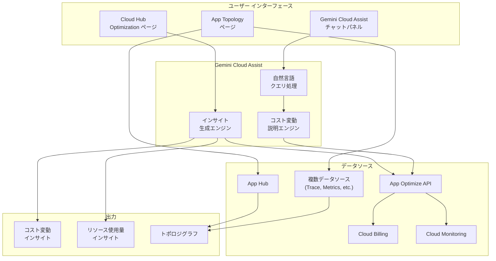

# Cloud Hub: Gemini Cloud Assist によるコスト最適化機能強化と App Topology (Preview)

**リリース日**: 2026-04-22

**サービス**: Cloud Hub

**機能**: Cost Optimization with Gemini Cloud Assist and App Topology

**ステータス**: Preview

[このアップデートのインフォグラフィックを見る](https://takech9203.github.io/google-cloud-news-summary/20260422-cloud-hub-cost-optimization-app-topology.html)

## 概要

Cloud Hub において、Gemini Cloud Assist によるコスト最適化機能に新たな追加機能が提供されるとともに、App Topology が Preview として利用可能になった。今回のアップデートは、クラウドコストの可視化・分析と、リソース間の関係性の視覚化という 2 つの領域を強化するものである。

コスト最適化の強化では、Gemini Cloud Assist のチャットパネルでサポート対象リソースのコスト変動に関する説明を取得できるようになった。また、Cloud Hub の Optimization ページでは、最近のコスト変動と関連するリソース使用量の変化に関するインサイトが表示されるようになった。これにより、コスト変動の原因を迅速に特定し、最適化のアクションにつなげることが容易になる。

App Topology は、複数のソースからリソースとアプリケーションに関するデータをクエリし、相関するデータをトポロジグラフとして視覚化する新機能である。DevOps エンジニア、SRE、FinOps 担当者など、クラウドコストの最適化やリソース管理に携わるチームが主な対象ユーザーである。

**アップデート前の課題**

- コスト変動の原因分析には Cloud Billing レポートや BigQuery エクスポートを個別に調査する必要があり、変動の背景にあるリソース使用量の変化との相関分析が煩雑だった
- Gemini Cloud Assist のチャットパネルでは個別リソースのコスト変動理由を自然言語で問い合わせる機能が限定的だった
- 複数のデータソースにまたがるリソースとアプリケーションの関係性を統合的にクエリし、トポロジグラフとして可視化する手段がなかった

**アップデート後の改善**

- Gemini Cloud Assist のチャットパネルで、サポート対象リソースのコスト変動について自然言語で説明を取得できるようになった
- Cloud Hub の Optimization ページで、最近のコスト変動とリソース使用量の変化に関するインサイトが自動的に表示されるようになった
- App Topology により、複数ソースのデータを統合してクエリし、リソース間の関係をトポロジグラフとして可視化できるようになった

## アーキテクチャ図



Gemini Cloud Assist はチャットパネルおよび Optimization ページを通じて App Optimize API からコストおよび使用量データを取得し、自然言語による説明やインサイトを生成する。App Topology は App Hub と複数のデータソースからリソース情報を収集し、トポロジグラフとして可視化する。

## サービスアップデートの詳細

### 主要機能

1. **Gemini Cloud Assist チャットパネルでのコスト変動説明**
   - サポート対象リソースについて、コストが増減した理由を自然言語で質問し、説明を取得できる
   - 日付範囲を指定したクエリが可能（デフォルトは過去 7 日間）
   - プロジェクト単位またはアプリケーション単位での分析に対応
   - 例: 「先月のこのプロジェクトの費用はいくらでしたか？」「最もコスト効率の悪いリソースは何ですか？」

2. **Optimization ページでのコスト変動インサイト**
   - 最近のコスト変動を自動検出し、Cloud Hub の Optimization ページにインサイトとして表示
   - コスト変動に関連するリソース使用量の変化を相関分析して表示
   - App Optimize API を通じて Cloud Billing のコストデータと Cloud Monitoring の使用量メトリクスを統合分析

3. **App Topology (Preview)**
   - 複数のデータソースからリソースとアプリケーションに関するデータをクエリ可能
   - 相関するデータをトポロジグラフとして視覚化
   - アプリケーション、サービス、ワークロード間の関係性をインタラクティブに探索可能
   - ノード（リソース）とエッジ（トラフィック）によるグラフ表現

## 技術仕様

### コスト最適化機能の対象サービス

| 項目 | 詳細 |
|------|------|
| コストデータソース | Cloud Billing（契約価格ベース、CUD 適用前） |
| 使用量メトリクス | Cloud Monitoring API |
| コスト分析 API | App Optimize API |
| データ遅延 | 通常 1 日以内（最大 24 時間以上の遅延あり） |
| デフォルトの日付範囲 | 過去 7 日間 |

### App Topology の仕様

| 項目 | 詳細 |
|------|------|
| ステータス | Preview |
| データソース | 複数ソース（App Hub、Cloud Monitoring、Cloud Trace など） |
| 最大ノード数 | 1,000 ノードまたはエッジ |
| リージョンあたりの上限 | Discovered サービス 100 件、Discovered ワークロード 100 件 |
| 可視化形式 | インタラクティブなトポロジグラフ |

### 必要な IAM ロール

```json
{
  "cost_optimization": {
    "cloud_hub_operator": "roles/cloudhub.operator",
    "cost_data_viewer": "roles/viewer (または billing.resourceCosts.get を含むカスタムロール)",
    "gemini_cloud_assist_user": "roles/geminicloudassist.user",
    "recommender_viewer": "roles/recommender.viewer"
  },
  "app_topology": {
    "app_hub_viewer": "roles/apphub.viewer",
    "cloud_hub_operator": "roles/cloudhub.operator"
  }
}
```

## 設定方法

### 前提条件

1. Cloud Hub がセットアップ済みであること
2. Gemini Cloud Assist がプロジェクトまたはフォルダで有効化されていること
3. 適切な IAM ロールが付与されていること
4. App Hub でアプリケーションが登録済みであること（アプリケーションビューを使用する場合）

### 手順

#### ステップ 1: 必要な API の有効化

```bash
# App Optimize API の有効化
gcloud services enable appoptimize.googleapis.com \
    --project=PROJECT_ID

# App Hub API の有効化（App Topology 用）
gcloud services enable apphub.googleapis.com \
    --project=PROJECT_ID
```

Cloud Hub のコスト最適化機能は App Optimize API を使用してコストデータと使用量メトリクスを取得する。App Topology は App Hub API を通じてリソース情報を取得する。

#### ステップ 2: IAM ロールの付与

```bash
# Cloud Hub Operator ロールの付与
gcloud projects add-iam-policy-binding PROJECT_ID \
    --member="user:USER_EMAIL" \
    --role="roles/cloudhub.operator"

# Gemini Cloud Assist User ロールの付与
gcloud projects add-iam-policy-binding PROJECT_ID \
    --member="user:USER_EMAIL" \
    --role="roles/geminicloudassist.user"

# コストデータの閲覧に必要な Viewer ロールの付与
gcloud projects add-iam-policy-binding PROJECT_ID \
    --member="user:USER_EMAIL" \
    --role="roles/viewer"
```

コスト最適化機能を利用するには Cloud Hub Operator、Gemini Cloud Assist User、および Viewer（またはコスト関連の権限を含むカスタムロール）が必要である。

#### ステップ 3: Gemini Cloud Assist チャットパネルの使用

```bash
# Google Cloud Console で Cloud Hub にアクセス
# https://console.cloud.google.com/cloud-hub/optimization

# ツールバーの Gemini Cloud Assist アイコンをクリックしてチャットパネルを開く
# 自然言語でコストに関する質問を入力する
# 例: "What were the least cost efficient resources last month?"
# 例: "先月のこのプロジェクトの費用を教えてください"
```

チャットパネルでは、プロジェクトやアプリケーションのコスト変動理由、最もコスト効率の悪いリソース、オーバープロビジョニングされたリソースなどについて自然言語で質問できる。

## メリット

### ビジネス面

- **コスト最適化の迅速化**: コスト変動の原因を Gemini Cloud Assist に自然言語で問い合わせることで、FinOps チームの分析時間を大幅に短縮できる
- **プロアクティブなコスト管理**: Optimization ページのインサイトにより、コスト変動とリソース使用量の変化を自動的に検出し、問題が大きくなる前に対処できる
- **運用の可視化向上**: App Topology により、アプリケーションとリソースの全体像を視覚的に把握でき、組織全体でのコミュニケーションが改善される

### 技術面

- **AI を活用した分析**: Gemini Cloud Assist がコストデータと使用量メトリクスを自動的に相関分析し、人間が見落としがちなパターンを検出する
- **マルチソース統合**: App Topology が複数のデータソースからリソース情報を統合し、サイロ化されたデータを横断的にクエリ・可視化できる
- **既存ワークフローへの統合**: Cloud Hub の既存の Optimization ページに統合されているため、新しいツールの導入や学習コストが最小限で済む

## デメリット・制約事項

### 制限事項

- App Topology は Preview ステータスであり、サポートが限定される可能性がある。Pre-GA Offerings Terms が適用される
- Gemini Cloud Assist のコスト分析はサポート対象リソースに限定されており、すべてのリソースタイプでコスト変動の説明が取得できるわけではない
- コストデータは契約価格ベースであり、CUD やその他のクレジット適用前の値が表示される
- アプリケーションのコストは、すべてのリソースコストが同一通貨である場合にのみ利用可能

### 考慮すべき点

- Gemini Cloud Assist は早期段階の技術であり、事実と異なる出力を生成する可能性がある。すべての出力を検証してから利用することが推奨される
- コストデータの反映には最大 24 時間以上の遅延が発生する場合がある
- Cloud Hub はアプリケーション管理用に構成されたフォルダ内のアプリケーションのみをサポートしており、ホストプロジェクトや単一プロジェクト境界のアプリケーションはサポートされない
- App Topology のトポロジマップには最大 1,000 ノードの表示制限がある

## ユースケース

### ユースケース 1: 月次コストレビューでの変動原因分析

**シナリオ**: FinOps チームが月次のクラウドコストレビューを実施する際、先月比で大幅にコストが増加したプロジェクトの変動原因を迅速に特定したい。

**実装例**:
```
# Gemini Cloud Assist チャットパネルでの質問例
"先月のこのプロジェクトの費用はいくらでしたか？"
"us-central1 リージョンのコストを教えてください"
"最もオーバープロビジョニングされているリソースで、コストが高いものは？"
"GKE クラスタ my-cluster-id の先月のコストはいくらですか？"
```

**効果**: Cloud Billing レポートや BigQuery を個別に調査する必要がなくなり、自然言語での質問で即座にコスト変動の原因と関連するリソース使用量の変化を把握できる。

### ユースケース 2: アプリケーション アーキテクチャの全体把握

**シナリオ**: 新しく参加した SRE エンジニアが、担当するアプリケーションの全体構成とリソース間の依存関係を短時間で把握したい。

**効果**: App Topology のトポロジグラフにより、アプリケーションを構成するサービス、ワークロード、およびそれらの間のトラフィックフローを視覚的に確認できる。複数のデータソースからの情報が統合されているため、ドキュメントや個別のダッシュボードを渡り歩く必要がなくなる。

### ユースケース 3: コスト異常検出とリソース使用量の相関分析

**シナリオ**: Optimization ページでコストの急増が検出された際に、そのコスト変動がどのリソースの使用量変化に起因しているかを即座に確認したい。

**効果**: Optimization ページに表示されるインサイトにより、コスト変動とリソース使用量の変化が自動的に相関分析され、原因リソースの特定から最適化アクションの実施までの時間を短縮できる。

## 料金

Cloud Hub 自体には独自の課金は存在せず、データソースとなるサービスの利用料金が適用される。コスト最適化機能に関連する主な料金は以下の通りである。

### 料金例

| サービス | 料金体系 |
|---------|---------|
| Cloud Hub | 追加料金なし |
| Gemini Cloud Assist | Gemini for Google Cloud のサブスクリプションに含まれる |
| App Optimize API | 追加料金なし（Cloud Billing および Cloud Monitoring のデータを使用） |
| Cloud Billing | 標準の課金アカウント料金 |
| Cloud Monitoring | 取り込まれるメトリクスのデータ量に基づく課金 |

Gemini Cloud Assist の利用には、Gemini for Google Cloud のサブスクリプション（Code Assist Enterprise 等）が必要な場合がある。詳細は [Gemini for Google Cloud の料金ページ](https://cloud.google.com/products/gemini/pricing) を参照。

## 利用可能リージョン

Cloud Hub および Gemini Cloud Assist はグローバルサービスとして提供されており、Google Cloud Console から利用可能である。App Topology で表示されるリソースデータは、App Hub がサポートするリージョンに依存する。App Hub のサポートリージョンについては [App Hub のロケーションドキュメント](https://docs.cloud.google.com/app-hub/docs/locations) を参照。

## 関連サービス・機能

- **[Gemini Cloud Assist](https://docs.cloud.google.com/cloud-assist/overview)**: AI を活用したクラウド運用支援サービスで、コスト最適化を含む幅広い運用タスクを自然言語で支援
- **[App Optimize API](https://docs.cloud.google.com/hub/docs/optimize)**: Cloud Billing と Cloud Monitoring のデータを統合し、コストおよび使用量の分析データを提供する API
- **[Cloud Hub Optimization](https://docs.cloud.google.com/hub/docs/optimize)**: リソースのコストデータ、使用量データ、コスト最適化推奨事項を表示する Cloud Hub のページ
- **[App Hub](https://docs.cloud.google.com/app-hub/docs/overview)**: アプリケーション中心のリソース管理を実現するサービスで、App Topology のデータソースの一つ
- **[FinOps Hub](https://docs.cloud.google.com/billing/docs/how-to/finops-hub)**: Cloud Billing のコスト最適化ダッシュボードで、Gemini Cloud Assist によるインサイトを提供
- **[Proactive Cost Optimization](https://docs.cloud.google.com/cloud-assist/proactive-cost-optimization)**: Gemini Cloud Assist の Proactive Mode により、コスト異常を自動検出して調査する機能

## 参考リンク

- [インフォグラフィック](https://takech9203.github.io/google-cloud-news-summary/20260422-cloud-hub-cost-optimization-app-topology.html)
- [公式リリースノート](https://cloud.google.com/release-notes#April_22_2026)
- [Cloud Hub コスト最適化ドキュメント](https://docs.cloud.google.com/hub/docs/optimize)
- [Gemini Cloud Assist 概要](https://docs.cloud.google.com/cloud-assist/overview)
- [App Hub ドキュメント](https://docs.cloud.google.com/app-hub/docs/overview)
- [Application Topology ドキュメント](https://docs.cloud.google.com/monitoring/docs/application-topology)
- [Cloud Hub セットアップ](https://docs.cloud.google.com/hub/docs/setup-cloud-hub)
- [Gemini for Google Cloud 料金](https://cloud.google.com/products/gemini/pricing)

## まとめ

Cloud Hub の Gemini Cloud Assist によるコスト最適化機能が強化され、チャットパネルでのコスト変動説明の取得や Optimization ページでのインサイト表示が可能になった。また、App Topology が Preview として利用可能になり、複数データソースからのリソース情報を統合してトポロジグラフとして可視化できるようになった。Cloud Hub を既に利用している組織は Gemini Cloud Assist を有効化してコスト最適化機能を試すことを推奨する。App Topology は Preview 段階であるが、複雑なアプリケーションアーキテクチャを持つ環境では早期に評価を開始する価値がある。

---

**タグ**: #CloudHub #GeminiCloudAssist #CostOptimization #AppTopology #AppOptimizeAPI #FinOps #Preview #コスト最適化 #トポロジ #運用管理
