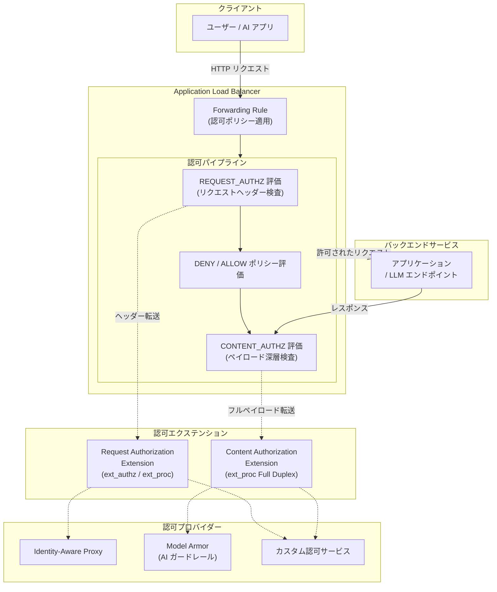

# Cloud Load Balancing: 認可ポリシーにおけるポリシープロファイルが Preview で登場

**リリース日**: 2026-04-22

**サービス**: Cloud Load Balancing

**機能**: Policy Profiles in Authorization Policies (Preview)

**ステータス**: Preview

[このアップデートのインフォグラフィックを見る](https://takech9203.github.io/google-cloud-news-summary/20260422-cloud-load-balancing-policy-profiles.html)

## 概要

Cloud Load Balancing の認可ポリシーに「ポリシープロファイル」(Policy Profiles) 機能が Preview として追加されました。ポリシープロファイルは、ロードバランサーで実行される認可の種類を定義するもので、従来の HTTP リクエストヘッダーベースの認可に加え、アプリケーションペイロードの深層検査によるコンテンツベースのセキュリティを実現します。

本機能では 2 つのプロファイルタイプが提供されます。リクエスト認可プロファイル (REQUEST_AUTHZ) は HTTP リクエストヘッダーに基づいてアクセス判定を行う従来型のプロファイルで、デフォルトで適用されます。コンテンツ認可プロファイル (CONTENT_AUTHZ) はヘッダー、ボディ、トレーラーを含むアプリケーションペイロード全体の深層検査を可能にし、プロンプトインジェクション攻撃のブロックや機密データ漏洩の防止といったコンテンツベースのセキュリティに使用されます。

特に CONTENT_AUTHZ プロファイルは、生成 AI アプリケーションのセキュリティ強化において重要な役割を果たします。Model Armor との統合により、ロードバランサーレベルで AI ガードレールを適用し、アプリケーションコードを変更することなく、プロンプトインジェクションや有害コンテンツのフィルタリングをネットワーク層で実施できるようになります。

**アップデート前の課題**

- 認可ポリシーでは HTTP リクエストヘッダーに基づくアクセス制御のみが可能で、リクエストボディやレスポンスの内容に基づく判定ができなかった
- プロンプトインジェクション攻撃や機密データ漏洩の防止には、アプリケーション層での個別実装が必要だった
- ロードバランサーレベルでのコンテンツ検査を行う標準的な仕組みがなく、AI アプリケーションのセキュリティ対策が分散していた

**アップデート後の改善**

- ポリシープロファイルにより、リクエスト認可とコンテンツ認可を明確に区別して構成できるようになった
- CONTENT_AUTHZ プロファイルにより、ロードバランサーでペイロード全体 (ヘッダー、ボディ、トレーラー) の深層検査が可能になった
- Model Armor との統合により、アプリケーションコードを変更せずにプロンプトインジェクション防御や機密データ漏洩防止をネットワーク層で実施可能になった
- Envoy の ext_proc プロトコルによるフルデュプレックスストリーミングモードで、リクエストとレスポンスの双方向検査が実現された

## アーキテクチャ図



ロードバランサーの認可パイプラインでは、まず REQUEST_AUTHZ プロファイルによるリクエストヘッダーの検査が行われ、次に DENY/ALLOW ポリシーの評価、最後に CONTENT_AUTHZ プロファイルによるペイロード深層検査が順に実行されます。CONTENT_AUTHZ はレスポンスパスでも検査を実施できます。

## サービスアップデートの詳細

### 主要機能

1. **リクエスト認可プロファイル (REQUEST_AUTHZ)**
   - HTTP リクエストヘッダーに基づいてアクセス許可・拒否を判定するデフォルトプロファイル
   - ALLOW、DENY、CUSTOM の 3 つのアクションをサポート
   - ALLOW / DENY はロードバランサーが直接判定し、CUSTOM は外部の認可エクステンションに委任
   - Envoy の ext_proc または ext_authz プロトコルを使用して認可エクステンションと通信
   - Identity-Aware Proxy (IAP) やカスタム認可エンジンへの委任が可能

2. **コンテンツ認可プロファイル (CONTENT_AUTHZ)**
   - ヘッダー、ボディ、トレーラーを含むアプリケーションペイロード全体の深層検査を実施
   - CUSTOM アクションのみをサポートし、認可判定は必ず外部エクステンションに委任
   - Envoy の ext_proc プロトコルをフルデュプレックスストリーミングモード (FULL_DUPLEX_STREAMED) で使用
   - リクエストだけでなくレスポンスの検査も可能 (レスポンスパスでの検査に対応)
   - Model Armor またはカスタムコンテンツサニタイズエクステンションに委任可能

3. **ポリシー評価順序の拡張**
   - ポリシープロファイル対応サービスでは、評価順序が拡張: CUSTOM (REQUEST_AUTHZ) -> DENY -> ALLOW -> CONTENT_AUTHZ
   - REQUEST_AUTHZ のカスタムポリシーが拒否した場合、後続の DENY、ALLOW、CONTENT_AUTHZ は評価されない
   - ALLOW ポリシーが存在し一致しない場合、リクエストは拒否され CONTENT_AUTHZ は評価されない
   - CONTENT_AUTHZ は最後に評価され、すべての前段チェックを通過したリクエストにのみ適用

4. **Model Armor 統合**
   - CONTENT_AUTHZ プロファイルと Model Armor を組み合わせることで、AI ガードレールをネットワーク層で適用
   - プロンプトインジェクション攻撃、ジェイルブレイク検出、機密データ漏洩、有害コンテンツのフィルタリングに対応
   - Model Armor テンプレートを使用して、リクエストとレスポンスの両方にフィルタリングルールを設定可能

## 技術仕様

### プロファイルの比較

| 項目 | REQUEST_AUTHZ | CONTENT_AUTHZ |
|------|--------------|---------------|
| 検査対象 | HTTP リクエストヘッダーのみ | ヘッダー、ボディ、トレーラー (フルペイロード) |
| サポートされるアクション | ALLOW、DENY、CUSTOM | CUSTOM のみ |
| 直接判定 | 可能 (ALLOW / DENY) | 不可 (必ず委任) |
| 通信プロトコル | ext_proc / ext_authz | ext_proc (FULL_DUPLEX_STREAMED) |
| レスポンス検査 | 不可 | 可能 |
| デフォルト設定 | はい (未指定時に適用) | いいえ |
| 委任先 | IAP、カスタムサービス | Model Armor、カスタムサニタイズサービス |

### 対応サービス

| Google Cloud サービス | REQUEST_AUTHZ | CONTENT_AUTHZ |
|------|------|------|
| Regional external Application Load Balancer | 対応 | 対応 |
| Regional internal Application Load Balancer | 対応 | 対応 |
| Agent Gateway (Preview) | 対応 | 対応 |
| Secure Web Proxy | 対応 | 対応 |

### 認可ポリシー YAML 構成

```yaml
# REQUEST_AUTHZ プロファイルの例
name: my-request-authz-policy
target:
  loadBalancingScheme: EXTERNAL_MANAGED
  resources:
    - "https://www.googleapis.com/compute/v1/projects/PROJECT_ID/regions/REGION/forwardingRules/LB_FORWARDING_RULE"
policyProfile: REQUEST_AUTHZ
httpRules:
  - from:
      sources:
        - ipBlocks:
            - prefix: "10.0.0.0"
              length: "24"
    to:
      operations:
        - paths:
            - exact: "/api/payments"
action: ALLOW
```

```yaml
# CONTENT_AUTHZ プロファイルの例 (Model Armor 委任)
name: my-content-authz-policy
target:
  loadBalancingScheme: INTERNAL_MANAGED
  resources:
    - "https://www.googleapis.com/compute/v1/projects/PROJECT_ID/regions/REGION/forwardingRules/LB_FORWARDING_RULE"
policyProfile: CONTENT_AUTHZ
action: CUSTOM
customProvider:
  authzExtension:
    resources:
      - "projects/PROJECT_ID/locations/REGION/authzExtensions/my-model-armor-ext"
```

## 設定方法

### 前提条件

1. Google Cloud プロジェクトが作成済みであること
2. Regional external Application Load Balancer または Regional internal Application Load Balancer が構成済みであること
3. `gcloud beta` コンポーネントがインストールされていること
4. CONTENT_AUTHZ を使用する場合は、Model Armor テンプレートまたはカスタムコンテンツサニタイズサービスが準備済みであること

### 手順

#### ステップ 1: REQUEST_AUTHZ プロファイルで認可ポリシーを作成

```bash
# 認可ポリシー YAML ファイルを作成
cat > authz-policy-request.yaml <<'EOF'
name: my-request-authz-policy
target:
  loadBalancingScheme: EXTERNAL_MANAGED
  resources:
    - "https://www.googleapis.com/compute/v1/projects/PROJECT_ID/regions/REGION/forwardingRules/LB_FORWARDING_RULE"
policyProfile: REQUEST_AUTHZ
httpRules:
  - from:
      sources:
        - ipBlocks:
            - prefix: "10.0.0.0"
              length: "24"
    to:
      operations:
        - paths:
            - exact: "/api/sensitive"
action: DENY
EOF

# 認可ポリシーをインポート
gcloud beta network-security authz-policies import my-request-authz-policy \
  --source=authz-policy-request.yaml \
  --location=REGION
```

REQUEST_AUTHZ プロファイルを指定した認可ポリシーを作成します。`policyProfile` を省略した場合も、デフォルトで REQUEST_AUTHZ が適用されます。

#### ステップ 2: Model Armor 認可エクステンションを作成 (CONTENT_AUTHZ 用)

```bash
# Model Armor を使用する認可エクステンション YAML を作成
cat > authz-extension-model-armor.yaml <<'EOF'
name: my-model-armor-ext
loadBalancingScheme: INTERNAL_MANAGED
service: modelarmor.REGION.rep.googleapis.com
metadata:
  model_armor_settings: '[
    {
      "response_template_id": "projects/PROJECT_ID/locations/REGION/templates/RESPONSE_TEMPLATE_ID",
      "request_template_id": "projects/PROJECT_ID/locations/REGION/templates/REQUEST_TEMPLATE_ID"
    }
  ]'
failOpen: true
EOF

# 認可エクステンションを作成
gcloud beta service-extensions authz-extensions import my-model-armor-ext \
  --source=authz-extension-model-armor.yaml \
  --location=REGION
```

Model Armor のリクエストテンプレートとレスポンステンプレートを参照する認可エクステンションを作成します。

#### ステップ 3: CONTENT_AUTHZ プロファイルで認可ポリシーを作成

```bash
# CONTENT_AUTHZ 認可ポリシー YAML を作成
cat > authz-policy-content.yaml <<'EOF'
name: my-content-authz-policy
target:
  loadBalancingScheme: INTERNAL_MANAGED
  resources:
    - "https://www.googleapis.com/compute/v1/projects/PROJECT_ID/regions/REGION/forwardingRules/LB_FORWARDING_RULE"
policyProfile: CONTENT_AUTHZ
action: CUSTOM
customProvider:
  authzExtension:
    resources:
      - "projects/PROJECT_ID/locations/REGION/authzExtensions/my-model-armor-ext"
EOF

# 認可ポリシーをインポート
gcloud beta network-security authz-policies import my-content-authz-policy \
  --source=authz-policy-content.yaml \
  --location=REGION
```

CONTENT_AUTHZ プロファイルの認可ポリシーを作成し、Model Armor エクステンションに委任します。CONTENT_AUTHZ ではアクションは必ず CUSTOM を指定します。

## メリット

### ビジネス面

- **AI アプリケーションのセキュリティ強化**: プロンプトインジェクション攻撃や機密データ漏洩をネットワーク層でブロックでき、アプリケーション開発チームのセキュリティ実装負担が軽減される
- **コンプライアンス対応の効率化**: ロードバランサーレベルでコンテンツフィルタリングを一元的に適用でき、複数のアプリケーションに対して統一的なセキュリティポリシーを実施可能
- **運用コストの削減**: アプリケーションコードの変更なしにセキュリティポリシーを適用・更新できるため、デプロイサイクルに依存しないセキュリティ運用が実現

### 技術面

- **レイヤードセキュリティの実現**: REQUEST_AUTHZ によるヘッダーベースの認可と CONTENT_AUTHZ によるペイロード検査を組み合わせた多層防御が可能
- **フルデュプレックスストリーミング**: Envoy の ext_proc プロトコルによるフルデュプレックスストリーミングにより、リクエストとレスポンスの双方向でリアルタイムなコンテンツ検査を実施
- **柔軟な委任先選択**: Model Armor (Google マネージド) またはカスタムサービス (ユーザーマネージド) から委任先を選択でき、既存のセキュリティ基盤との統合が容易

## デメリット・制約事項

### 制限事項

- Preview ステータスであり、Pre-GA Offerings Terms が適用される。プロダクション環境での利用は十分な検証が必要
- 1 つの認可ポリシーに REQUEST_AUTHZ と CONTENT_AUTHZ の両方を設定することはできない。プロファイルごとに別の認可ポリシーを作成する必要がある
- CONTENT_AUTHZ プロファイルでは CUSTOM アクションのみサポートされ、直接的な ALLOW / DENY 判定はできない
- 対応サービスが Regional external / internal Application Load Balancer、Agent Gateway (Preview)、Secure Web Proxy に限定されており、Global external Application Load Balancer や Cross-region internal Application Load Balancer には非対応

### 考慮すべき点

- CONTENT_AUTHZ ではペイロード全体 (ボディ含む) をエクステンションに転送するため、大容量リクエストの場合はレイテンシへの影響を考慮する必要がある
- Model Armor との統合を使用する場合、Model Armor テンプレートの事前作成と適切なリージョン選択が必要
- `gcloud beta` コマンドを使用するため、将来的にコマンド構文が変更される可能性がある
- failOpen 設定により、エクステンション障害時の動作 (フェイルオープン / フェイルクローズ) を慎重に設計する必要がある

## ユースケース

### ユースケース 1: 生成 AI アプリケーションのプロンプトインジェクション防御

**シナリオ**: 企業が社内向け LLM チャットアプリケーションを Regional internal Application Load Balancer の背後で運用しており、ユーザーからのプロンプトインジェクション攻撃を防止したい。

**実装例**:
```yaml
# Model Armor テンプレートでプロンプトインジェクション検出を有効化
# (事前に Model Armor テンプレートを作成済みとする)

# CONTENT_AUTHZ ポリシーの設定
name: ai-content-security-policy
target:
  loadBalancingScheme: INTERNAL_MANAGED
  resources:
    - "https://www.googleapis.com/compute/v1/projects/my-project/regions/us-central1/forwardingRules/my-llm-app-rule"
policyProfile: CONTENT_AUTHZ
action: CUSTOM
customProvider:
  authzExtension:
    resources:
      - "projects/my-project/locations/us-central1/authzExtensions/model-armor-ext"
```

**効果**: アプリケーションコードを変更することなく、ロードバランサーレベルでプロンプトインジェクション攻撃を検出・ブロックできる。Model Armor のフィルターが悪意のあるプロンプトを検出した場合、リクエストはバックエンドに到達する前に拒否される。

### ユースケース 2: API ゲートウェイでの多層認可

**シナリオ**: マイクロサービスアーキテクチャで、Regional external Application Load Balancer を API ゲートウェイとして使用している。IP アドレスベースのアクセス制御に加え、リクエストボディの内容に基づく高度なセキュリティチェックを実施したい。

**実装例**:
```bash
# ステップ 1: REQUEST_AUTHZ で IP ベースのアクセス制御
gcloud beta network-security authz-policies import ip-deny-policy \
  --source=ip-deny-policy.yaml \
  --location=us-central1

# ステップ 2: CONTENT_AUTHZ でペイロード検査
gcloud beta network-security authz-policies import content-check-policy \
  --source=content-check-policy.yaml \
  --location=us-central1
```

**効果**: REQUEST_AUTHZ と CONTENT_AUTHZ を組み合わせた多層防御により、まず不正な IP からのアクセスをブロックし、通過したリクエストに対してさらにペイロード検査を実施する。評価順序が保証されているため、段階的なセキュリティチェックが確実に機能する。

### ユースケース 3: 機密データ漏洩防止

**シナリオ**: AI アシスタントが社内データベースの情報を参照して回答を生成するアプリケーションにおいて、レスポンスに個人情報や機密データが含まれていないかを検査し、漏洩を防止したい。

**効果**: CONTENT_AUTHZ プロファイルはレスポンスパスでも検査を実施できるため、LLM が生成したレスポンスに機密情報が含まれている場合にそれを検出してブロックまたはマスクできる。Model Armor の Sensitive Data Protection フィルターと組み合わせることで、アプリケーション層に依存しないデータ漏洩防止策を実装可能。

## 料金

ポリシープロファイル機能は Cloud Load Balancing の認可ポリシーの一部として提供されます。現在 Preview 段階であり、追加の課金は発生しない見込みです。ただし、以下の関連料金に注意が必要です。

| 項目 | 料金 |
|------|------|
| Cloud Load Balancing | ロードバランサーの種類に応じた標準料金 |
| Service Extensions (認可エクステンション) | Service Extensions の利用料金が適用 |
| Model Armor | Model Armor テンプレートの利用料金が別途適用 |
| カスタム認可サービス | バックエンドサービスのコンピュート料金が適用 |

料金の最新情報は [Cloud Load Balancing の料金ページ](https://cloud.google.com/load-balancing/pricing) を確認してください。

## 利用可能リージョン

ポリシープロファイルは Regional なロードバランサーおよび Secure Web Proxy で利用可能なため、これらのサービスが提供されている Google Cloud リージョンで使用できます。Model Armor との統合を使用する場合は、Model Armor が利用可能なリージョンとの一致が必要です。

対応するロードバランサーの構成:

| ロードバランサー | ロードバランシングスキーム |
|------|------|
| Regional external Application Load Balancer | EXTERNAL_MANAGED |
| Regional internal Application Load Balancer | INTERNAL_MANAGED |
| Agent Gateway (Preview) | - |
| Secure Web Proxy | - |

## 関連サービス・機能

- **Model Armor**: CONTENT_AUTHZ プロファイルの主要な委任先として、プロンプトインジェクション検出、ジェイルブレイク防止、機密データ漏洩防止、有害コンテンツフィルタリングなどの AI ガードレール機能を提供
- **Service Extensions**: 認可エクステンション (AuthzExtension) の実行基盤として、ロードバランサーのデータパスにカスタムロジックを注入する仕組みを提供。REQUEST_AUTHZ および CONTENT_AUTHZ の両方で使用
- **Identity-Aware Proxy (IAP)**: REQUEST_AUTHZ プロファイルにおける認可委任先の 1 つとして、ユーザーの ID とリクエストコンテキストに基づくアクセス制御を提供
- **Agent Gateway (Preview)**: ポリシープロファイルに対応する新サービスで、AI エージェントのトラフィック管理にコンテンツ認可を適用可能
- **Secure Web Proxy**: VPC からのエグレストラフィックに対するポリシープロファイル適用をサポートし、外部 AI サービスへの通信にコンテンツセキュリティを適用可能

## 参考リンク

- [インフォグラフィック](https://takech9203.github.io/google-cloud-news-summary/20260422-cloud-load-balancing-policy-profiles.html)
- [公式リリースノート](https://cloud.google.com/release-notes#April_22_2026)
- [認可ポリシーの概要](https://cloud.google.com/load-balancing/docs/auth-policy/auth-policy-overview)
- [ポリシープロファイルのドキュメント](https://cloud.google.com/load-balancing/docs/auth-policy/auth-policy-overview#policy-profiles)
- [認可ポリシーの設定ガイド](https://cloud.google.com/load-balancing/docs/auth-policy/set-up-auth-policy-app-lb)
- [Model Armor の概要](https://cloud.google.com/model-armor/overview)
- [Service Extensions の概要](https://cloud.google.com/service-extensions/docs/lb-extensions-overview)
- [AuthzPolicy API リファレンス](https://cloud.google.com/load-balancing/docs/reference/network-security/rest/v1beta1/projects.locations.authzPolicies)
- [Cloud Load Balancing の料金](https://cloud.google.com/load-balancing/pricing)

## まとめ

Cloud Load Balancing の認可ポリシーにおけるポリシープロファイル機能は、特に生成 AI アプリケーションのセキュリティ強化において大きな価値を持つアップデートです。CONTENT_AUTHZ プロファイルと Model Armor の統合により、プロンプトインジェクション攻撃や機密データ漏洩をアプリケーションコードの変更なしにネットワーク層で防御できるようになります。AI ワークロードを Regional Application Load Balancer で運用している組織は、Preview 段階で本機能の評価を開始し、多層的なセキュリティアーキテクチャの構築を検討することを推奨します。

---

**タグ**: #CloudLoadBalancing #AuthorizationPolicy #PolicyProfiles #CONTENT_AUTHZ #REQUEST_AUTHZ #ModelArmor #ServiceExtensions #AIセキュリティ #プロンプトインジェクション #Preview
