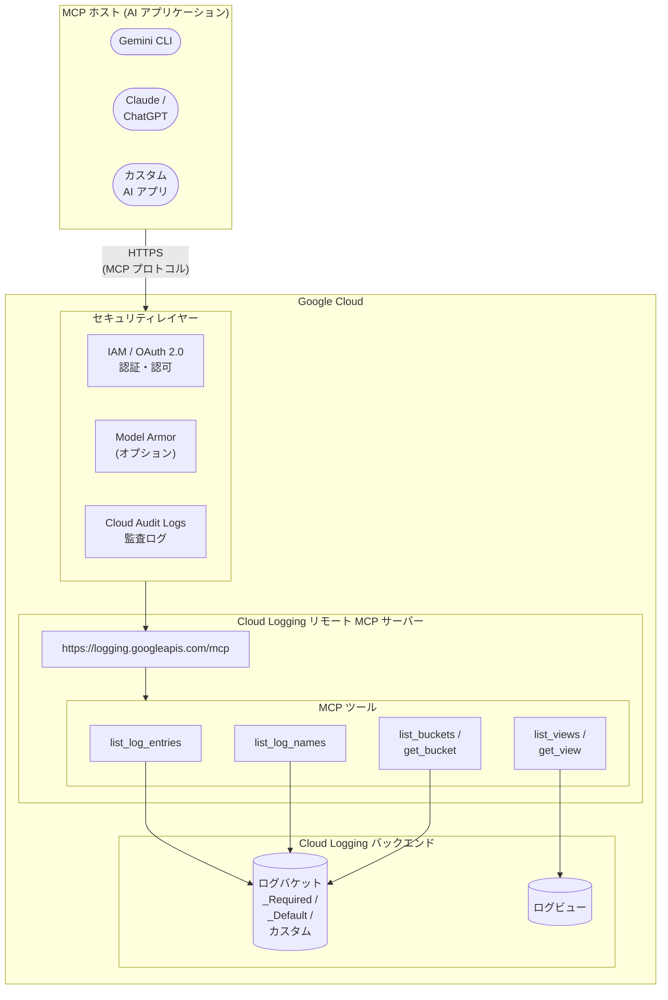

# Cloud Logging: MCP サーバーが一般提供 (GA) に昇格

**リリース日**: 2026-04-22

**サービス**: Cloud Logging

**機能**: Cloud Logging API リモート MCP サーバーの一般提供 (GA)

**ステータス**: GA (一般提供)

[このアップデートのインフォグラフィックを見る](https://takech9203.github.io/google-cloud-news-summary/20260422-cloud-logging-mcp-server.html)

## 概要

Google Cloud は 2026 年 4 月 22 日、Cloud Logging API のリモート Model Context Protocol (MCP) サーバーが一般提供 (GA) となったことを発表した。MCP は Anthropic が開発したオープンソースプロトコルであり、LLM や AI アプリケーションが外部データソースに接続する方法を標準化するものである。今回の GA リリースにより、Cloud Logging MCP サーバーは本番環境での利用に適した安定性と SLA を備えたサービスとして提供される。

Cloud Logging リモート MCP サーバーは、Gemini CLI、Claude、ChatGPT、およびカスタム AI アプリケーションから、Google Cloud のログエントリに対して標準化された MCP インターフェースを通じて直接アクセスすることを可能にする。エンドポイント `https://logging.googleapis.com/mcp` に HTTP で接続し、ログの検索・取得、ログ名の一覧表示、ログバケットやログビューの管理といった操作を AI エージェントが自然言語を通じて実行できる。

対象となるのは、AI エージェントを活用した運用自動化やインシデント対応の効率化を検討している SRE チーム、DevOps エンジニア、セキュリティ運用チーム、および AI アプリケーション開発者である。

**アップデート前の課題**

- Cloud Logging MCP サーバーは Preview ステータスであり、本番環境での利用には SLA やサポートの面で制約があった
- AI エージェントからログデータにアクセスするには、Cloud Logging API のクライアントライブラリを直接使用するカスタム統合コードの実装が必要だった
- ログの検索や分析を AI エージェントに委譲する場合、個別に API 呼び出しのラッパーを構築し、結果を LLM が理解できる形式に変換する必要があった
- ローカル MCP サーバー (stdio 通信) はセキュリティポリシーの一元管理やエンタープライズ向けのガバナンスが困難だった

**アップデート後の改善**

- GA リリースにより、本番環境での利用に適した安定性、SLA、およびサポートが提供されるようになった
- AI アプリケーションから標準化された MCP プロトコルを通じて Cloud Logging に直接接続でき、カスタム統合コードが不要になった
- IAM による細粒度の認可制御と OAuth 2.0 認証により、エンタープライズ向けのセキュリティ要件を満たす形でログデータへの AI アクセスが可能になった
- Model Armor によるプロンプトとレスポンスのセキュリティスキャン、Cloud Audit Logs による監査ログの自動記録がオプションで利用可能になった

## アーキテクチャ図



AI アプリケーション (MCP ホスト) は HTTPS を通じて Cloud Logging のリモート MCP エンドポイントに接続する。リクエストは IAM/OAuth 2.0 による認証・認可、およびオプションの Model Armor によるセキュリティスキャンを経て、6 種類の MCP ツールを通じて Cloud Logging バックエンドのログバケットやログビューにアクセスする。

## サービスアップデートの詳細

### 主要機能

1. **リモート MCP エンドポイント**
   - エンドポイント URL: `https://logging.googleapis.com/mcp`
   - HTTP ベースのトランスポートにより、ローカル MCP サーバーと異なりクライアント側でのサーバー構築・運用が不要
   - Google のマネージドインフラストラクチャ上で動作し、グローバルまたはリージョナルなエンドポイントを提供

2. **6 種類の MCP ツール**
   - `list_log_entries`: ログエントリの検索・取得。フィルタによる重大度、リソースタイプ、テキスト内容での絞り込みが可能
   - `list_log_names`: プロジェクト内の利用可能なログ名の一覧表示
   - `list_buckets`: ログバケットの一覧表示
   - `get_bucket`: 特定のログバケットの詳細取得
   - `list_views`: ログバケット内のログビューの一覧表示
   - `get_view`: 特定のログビューの詳細取得

3. **エンタープライズ向けセキュリティ**
   - IAM によるきめ細かいアクセス制御 (MCP Tool User ロールおよび Logging Admin ロール)
   - OAuth 2.0 認証 (全ての Google Cloud ID に対応)
   - Model Armor によるプロンプトインジェクションや機密データの漏洩防止 (オプション)
   - IAM 拒否ポリシーによる MCP ツールアクセスの制御
   - Cloud Audit Logs によるツール呼び出しの監査記録

## 技術仕様

### MCP ツール一覧

| ツール名 | 説明 | 読み取り専用 | 冪等性 |
|----------|------|:----------:|:------:|
| `list_log_entries` | ログエントリの検索・取得 | はい | はい |
| `list_log_names` | ログ名の一覧表示 | はい | はい |
| `list_buckets` | ログバケットの一覧表示 | はい | はい |
| `get_bucket` | 特定のログバケットの詳細取得 | はい | はい |
| `list_views` | ログビューの一覧表示 | はい | はい |
| `get_view` | 特定のログビューの詳細取得 | はい | はい |

### OAuth スコープ

| スコープ URI | 説明 |
|-------------|------|
| `https://www.googleapis.com/auth/logging.admin` | ログデータの管理 (読み書き) |
| `https://www.googleapis.com/auth/logging.read` | ログデータの読み取り |
| `https://www.googleapis.com/auth/logging.write` | ログデータの書き込み |

### 必要な IAM ロール

```json
{
  "required_roles": [
    {
      "role": "roles/mcp.toolUser",
      "description": "MCP ツール呼び出しの実行権限",
      "permission": "mcp.tools.call"
    },
    {
      "role": "roles/logging.admin",
      "description": "Logging MCP ツールの使用権限"
    }
  ]
}
```

## 設定方法

### 前提条件

1. Google Cloud プロジェクトで Cloud Logging API が有効化されていること
2. 適切な IAM ロール (`roles/mcp.toolUser` および `roles/logging.admin`) が付与されていること
3. OAuth 2.0 認証の設定が完了していること

### 手順

#### ステップ 1: Cloud Logging API の有効化

```bash
gcloud services enable logging.googleapis.com
```

Cloud Logging API を有効化すると、Cloud Logging リモート MCP サーバーも自動的に有効化される。

#### ステップ 2: IAM ロールの付与

```bash
# MCP ツール呼び出し権限の付与
gcloud projects add-iam-policy-binding PROJECT_ID \
  --member="user:USER_EMAIL" \
  --role="roles/mcp.toolUser"

# Cloud Logging 管理権限の付与
gcloud projects add-iam-policy-binding PROJECT_ID \
  --member="user:USER_EMAIL" \
  --role="roles/logging.admin"
```

エージェント用のサービスアカウントを作成し、最小権限の原則に基づいてロールを付与することを推奨する。

#### ステップ 3: MCP クライアントの設定

AI アプリケーションの MCP 設定に以下の情報を追加する。

```json
{
  "mcpServers": {
    "cloud-logging": {
      "name": "Cloud Logging MCP server",
      "url": "https://logging.googleapis.com/mcp",
      "transport": "http",
      "authentication": {
        "type": "oauth2",
        "scope": "https://www.googleapis.com/auth/logging.read"
      }
    }
  }
}
```

#### ステップ 4: 動作確認 (ツール一覧の取得)

```bash
curl --location 'https://logging.googleapis.com/mcp' \
  --header 'content-type: application/json' \
  --header 'accept: application/json, text/event-stream' \
  --data '{
    "jsonrpc": "2.0",
    "method": "tools/list",
    "id": 1
  }'
```

`tools/list` メソッドは認証不要で実行できるため、接続確認に利用できる。

## メリット

### ビジネス面

- **運用効率の大幅な向上**: AI エージェントが自然言語でログを検索・分析できるため、インシデント対応の初動時間を短縮し、MTTR (平均復旧時間) の改善が期待できる
- **GA による本番利用の安心感**: Preview から GA に昇格したことで、SLA に基づくサポートが提供され、ミッションクリティカルなワークフローへの組み込みが可能になった
- **統合コストの削減**: 標準化された MCP プロトコルにより、AI アプリケーションごとの個別統合開発が不要になった

### 技術面

- **標準化されたインターフェース**: MCP プロトコルに準拠しているため、MCP 対応の任意の AI アプリケーションからシームレスに利用可能
- **読み取り専用の安全な設計**: 提供される 6 つのツールは全て読み取り専用かつ冪等であり、ログデータの意図しない変更リスクがない
- **柔軟なフィルタリング**: `list_log_entries` ツールは Cloud Logging のクエリ言語に対応しており、重大度、リソースタイプ、タイムスタンプなどによる高度なフィルタリングが可能

## デメリット・制約事項

### 制限事項

- `list_log_entries` ツールは一度に単一のリソースプロジェクトのみを対象にできる。複数プロジェクトを指定した呼び出しは失敗する
- 現時点で提供されるツールは 6 種類のみで、ログの書き込みやシンクの管理といった操作はサポートされていない
- Model Armor は特定のリージョンでのみ利用可能であり、未対応リージョンでは MCP サーバー呼び出しのルーティング動作が異なる場合がある

### 考慮すべき点

- エージェント用に専用のサービスアカウントを作成し、最小権限の原則を適用することが推奨される
- Data Access 監査ログはデフォルトで無効であり、MCP ツール呼び出しの完全な監査が必要な場合は明示的に有効化する必要がある
- ローカル MCP サーバー (`stdio` 通信) はローカル開発やオフライン利用の用途で引き続き利用可能 ([GitHub リポジトリ](https://github.com/googleapis/gcloud-mcp))

## ユースケース

### ユースケース 1: AI エージェントによるインシデント対応の自動化

**シナリオ**: SRE チームが AI エージェントを活用し、アラート発生時にログを自動検索して初期分析を行う。

**実装例**:
```
プロンプト例:
「過去 1 時間の重大度が ERROR 以上のログをすべて表示してください。
 特に Compute Engine インスタンス web-server に関連するものを優先してください。」

AI エージェントが list_log_entries ツールを使用し、
フィルタ severity >= ERROR AND resource.type = "gce_instance"
でログエントリを取得・分析する。
```

**効果**: インシデント発生時の初動分析を AI エージェントに委譲することで、オンコールエンジニアの負荷を軽減し、対応時間を短縮できる。

### ユースケース 2: セキュリティ監査ログの日常的な分析

**シナリオ**: セキュリティチームが AI エージェントを使用して、特定のサービスアカウントに関するアクティビティログを定期的に確認する。

**実装例**:
```
プロンプト例:
「過去 7 日間のログから、特定のサービスアカウント
 sa-deploy@my-project.iam.gserviceaccount.com に関連する
 すべてのログを表示してください。」
```

**効果**: セキュリティ監査作業を AI エージェントで自動化することで、不正アクセスや異常な動作を早期に検出できる。

### ユースケース 3: ログバケット構成の可視化と管理

**シナリオ**: 運用チームが AI エージェントを使用して、プロジェクト内のログバケットとビューの構成状況を把握する。

**実装例**:
```
プロンプト例:
「このプロジェクトのログバケットをすべて一覧表示し、
 それぞれの保持期間と分析機能の有効/無効を教えてください。」

AI エージェントが list_buckets ツールを使用して
バケット構成を取得し、人間が理解しやすい形式で報告する。
```

**効果**: ログストレージの構成を AI エージェントが即座にサマリ化することで、コスト最適化やコンプライアンス要件の確認が容易になる。

## 料金

Cloud Logging MCP サーバー自体の利用に追加料金は発生しない。料金は Cloud Logging の既存の料金体系に基づく。

- **ログ取り込み**: 月間 50 GiB まで無料。超過分は $0.50/GiB
- **ログ保持**: デフォルトの保持期間 (30 日間) 内は無料。延長保持は $0.01/GiB
- **MCP ツール呼び出し自体**: 追加料金なし

詳細な料金情報については、[Google Cloud Observability の料金ページ](https://cloud.google.com/products/observability/pricing)を参照のこと。

## 関連サービス・機能

- **[Google Cloud MCP サーバー概要](https://docs.cloud.google.com/mcp/overview)**: Cloud Logging 以外の Google Cloud MCP サーバー (BigQuery、Spanner、Cloud SQL、Firestore など) の一覧と概要
- **[Model Armor](https://docs.cloud.google.com/model-armor/overview)**: MCP ツール呼び出しとレスポンスのセキュリティスキャンサービス
- **[Cloud Audit Logs](https://docs.cloud.google.com/logging/docs/audit)**: MCP ツール呼び出しの監査ログ記録
- **[Cloud Logging ローカル MCP サーバー](https://github.com/googleapis/gcloud-mcp)**: ローカル開発・オフライン利用向けの stdio ベース MCP サーバー
- **[IAM 拒否ポリシー](https://docs.cloud.google.com/mcp/control-mcp-use-iam)**: MCP ツールアクセスの制御

## 参考リンク

- [インフォグラフィック](https://takech9203.github.io/google-cloud-news-summary/20260422-cloud-logging-mcp-server.html)
- [公式リリースノート](https://cloud.google.com/release-notes#April_22_2026)
- [Cloud Logging リモート MCP サーバーのドキュメント](https://docs.cloud.google.com/logging/docs/use-logging-mcp)
- [Cloud Logging MCP リファレンス](https://docs.cloud.google.com/logging/docs/reference/v2_mcp/mcp)
- [Google Cloud Observability 料金ページ](https://cloud.google.com/products/observability/pricing)
- [MCP サーバーへの認証](https://docs.cloud.google.com/mcp/authenticate-mcp)

## まとめ

Cloud Logging API のリモート MCP サーバーが GA に昇格したことで、AI エージェントからのログアクセスが本番環境でも安心して利用できるようになった。全てのツールが読み取り専用かつ冪等であるため安全性が高く、IAM と OAuth 2.0 による認証・認可に加え、Model Armor や監査ログといったエンタープライズ向けのセキュリティ機能も備えている。SRE や DevOps チームは、まず Cloud Logging API を有効化し、エージェント用のサービスアカウントに最小権限を付与した上で、AI アプリケーションとの統合を検討することを推奨する。

---

**タグ**: #CloudLogging #MCP #ModelContextProtocol #AIエージェント #GA #Observability #ログ管理 #運用自動化
