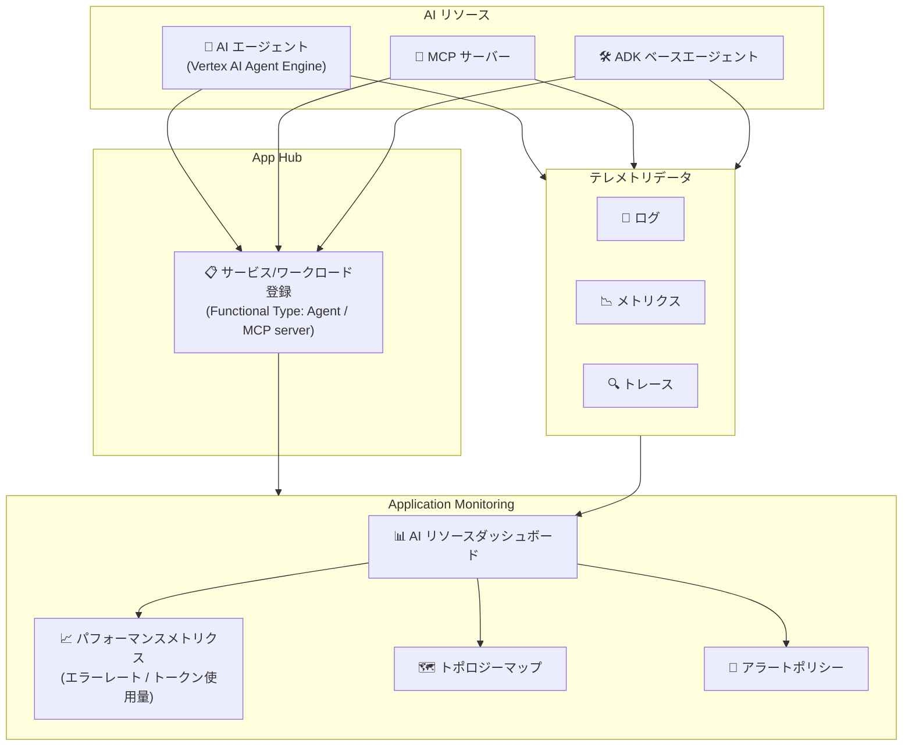

# Cloud Monitoring: Application Monitoring for AI Agent Observability

**リリース日**: 2026-04-22

**サービス**: Cloud Monitoring

**機能**: Application Monitoring for AI Agent Observability

**ステータス**: GA

[このアップデートのインフォグラフィックを見る](https://takech9203.github.io/google-cloud-news-summary/20260422-cloud-monitoring-ai-agent-observability.html)

## 概要

Google Cloud の Application Monitoring に、AI エージェントのオブザーバビリティ機能と AI リソース監視機能が GA (一般提供) として追加された。Application Monitoring ダッシュボードで AI リソースのパフォーマンスメトリクス (エラーレート、トークン使用量など) を確認でき、AI リソースの健全性とパフォーマンスを包括的に把握できるようになった。

この機能は、AI エージェントや MCP サーバーを含むアプリケーションを運用するチームに向けた重要なアップデートである。App Hub でサービスやワークロードを登録する際に「Agent」や「MCP server」といった Functional Type を設定することで、Application Monitoring が自動的に AI エージェント固有のダッシュボードとメトリクスを生成する。これにより、従来のインフラストラクチャ中心の監視から、アプリケーション中心かつ AI 中心の監視へとシフトできる。

対象ユーザーは、Vertex AI Agent Engine、ADK (Agent Development Kit) ベースのエージェント、MCP サーバーなど、AI リソースを本番環境で運用しているプラットフォームチーム、SRE チーム、および AI/ML エンジニアである。

**アップデート前の課題**

このアップデート以前は、AI エージェントの監視に以下の課題があった。

- AI エージェントのパフォーマンスメトリクス (トークン使用量、エラーレート) を統合的に確認できる専用ダッシュボードが存在しなかった
- エージェントや MCP サーバーを他のワークロードと区別して管理・監視する仕組みがなく、Functional Type による分類ができなかった
- AI リソースの健全性を把握するには、Cloud Monitoring の Metrics Explorer で個別にメトリクスを組み合わせて確認する必要があった

**アップデート後の改善**

今回のアップデートにより、以下が可能になった。

- Application Monitoring ダッシュボードで AI リソースのエラーレート、トークン使用量などのパフォーマンスメトリクスを一元的に確認できるようになった
- App Hub の Functional Type (Agent / MCP server) によるフィルタリングで、AI エージェントと MCP サーバーを他のサービスやワークロードと区別して監視できるようになった
- エージェントオブザーバビリティ機能により、AI エージェントの推論トレース、ツール呼び出し、モデル出力などの内部状態を外部テレメトリから測定できるようになった

## アーキテクチャ図



AI リソース (エージェント、MCP サーバー) を App Hub に登録すると、Application Monitoring が自動的にダッシュボードを生成し、テレメトリデータからパフォーマンスメトリクスを可視化する。

## サービスアップデートの詳細

### 主要機能

1. **エージェントオブザーバビリティ (Agent Observability)**
   - AI エージェントの内部状態 (推論トレース、ツール呼び出し、モデル出力) を外部テレメトリと構造化ログから測定
   - Vertex AI Agent Engine のビルトインメトリクス (リクエスト数、リクエストレイテンシ、CPU/メモリ割り当て時間) を自動収集
   - ADK ベースのエージェントでは OpenTelemetry 互換の計装によるトレースデータ収集をサポート

2. **AI リソースパフォーマンスダッシュボード**
   - エラーレート、トークン使用量などの AI 固有メトリクスを統合表示
   - ゴールデンシグナル (トラフィック、エラーレート、レイテンシ、飽和度) による健全性の概要把握
   - サービスやワークロード単位でのドリルダウン調査

3. **Functional Type によるサービス分類**
   - App Hub で登録するサービス/ワークロードに「Agent」「MCP server」の Functional Type を設定可能
   - Services and Workloads タブで Functional Type によるフィルタリングが可能
   - エージェントと MCP サーバーを他のワークロードと視覚的に区別して表示

4. **アプリケーショントポロジーマップ**
   - App Hub アプリケーション内のサービス・ワークロード間の関係を動的にマップ表示
   - エラーレートや P95 レイテンシをサービス間のトラフィックとともに可視化
   - オープンインシデントの影響範囲をトポロジー上で確認

## 技術仕様

### Vertex AI Agent Engine のビルトインメトリクス

| メトリクス | 説明 | モニタリングリソース |
|------|------|------|
| `reasoning_engine/request_count` | エージェントへのリクエスト数 | `aiplatform.googleapis.com/ReasoningEngine` |
| `reasoning_engine/request_latencies` | リクエストレイテンシ | `aiplatform.googleapis.com/ReasoningEngine` |
| `reasoning_engine/cpu/allocation_time` | コンテナ CPU 割り当て時間 | `aiplatform.googleapis.com/ReasoningEngine` |
| `reasoning_engine/memory/allocation_time` | コンテナメモリ割り当て時間 | `aiplatform.googleapis.com/ReasoningEngine` |

### Application Monitoring ダッシュボードに表示されるデータ

| 項目 | 詳細 |
|------|------|
| ログデータ | サポート対象インフラストラクチャが生成するログ |
| メトリクスデータ | ゴールデンシグナル (トラフィック、エラーレート、レイテンシ、飽和度) および AI 固有メトリクス |
| トレースデータ | 計装済みアプリケーションが生成するスパン (サービス名、レイテンシ、エラーレート) |
| インシデント情報 | App Hub アプリケーションに関連付けられたアラートポリシーからのオープンインシデント |

### Cloud Monitoring API によるメトリクス取得例

```bash
# エージェントメトリクスの定義を取得
gcurl https://monitoring.googleapis.com/v3/projects/PROJECT_ID/metricDescriptors?filter='metric.type=starts_with("aiplatform.googleapis.com/reasoning_engine")'

# 特定のエージェントインスタンスのリクエスト数を取得
gcurl "https://monitoring.googleapis.com/v3/projects/PROJECT_ID/timeSeries?filter=metric.type%3D%22aiplatform.googleapis.com/reasoning_engine/request_count%22%20AND%20resource.labels.reasoning_engine_id%3D%22RESOURCE_ID%22&interval.endTime=2026-04-22T12:00:00Z&interval.startTime=2026-04-22T11:00:00Z"
```

## 設定方法

### 前提条件

1. App Hub のアプリケーション管理境界 (Application Management Boundary) が設定されていること
2. Cloud Monitoring API が有効化されていること
3. 適切な IAM ロール (Monitoring Viewer: `roles/monitoring.viewer` 以上) が付与されていること

### 手順

#### ステップ 1: App Hub でアプリケーションを定義

App Hub または Application Design Center を使用して、アプリケーションを定義し、AI リソースをサービスまたはワークロードとして登録する。

```bash
# gcloud CLI でアプリケーションを作成 (例)
gcloud app-hub applications create my-ai-app \
    --location=us-central1 \
    --display-name="My AI Application"
```

登録時に Functional Type を「Agent」または「MCP server」に設定することで、Application Monitoring が AI リソースとして認識する。

#### ステップ 2: Application Monitoring ダッシュボードにアクセス

```
Google Cloud コンソール > Monitoring > Application Monitoring
```

1. Google Cloud コンソールで Application Monitoring ページに移動
2. プロジェクトピッカーで App Hub ホストプロジェクトまたは管理プロジェクトを選択
3. Overview タブでアプリケーション一覧を確認
4. 対象のアプリケーションを選択してダッシュボードを表示

#### ステップ 3: AI リソースのメトリクスを確認

Dashboard タブで以下を確認:
- AI リソースのエラーレートとトークン使用量
- ゴールデンシグナル (トラフィック、エラーレート、P95 レイテンシ、飽和度)
- サービス/ワークロード単位のテレメトリデータ

Services and Workloads タブで Functional Type フィルタを使用して、Agent や MCP server のみを表示できる。

## メリット

### ビジネス面

- **運用効率の向上**: AI エージェントの健全性とパフォーマンスを一元的に把握できるため、問題の検出と解決が迅速化される
- **コスト最適化**: トークン使用量の可視化により、AI リソースのコストを把握し、最適化の機会を特定できる
- **SLA 管理の改善**: エラーレートやレイテンシのモニタリングにより、AI エージェントのサービスレベル目標 (SLO) を設定・追跡できる

### 技術面

- **アプリケーション中心の監視**: インフラストラクチャ個別ではなく、アプリケーション全体の視点で AI リソースを監視できる
- **自動ダッシュボード生成**: App Hub でリソースを登録するだけで、追加設定なしにダッシュボードが自動生成される
- **OpenTelemetry 対応**: 標準的な OpenTelemetry 計装と互換性があり、既存の監視パイプラインと統合できる
- **統合テレメトリ**: ログ、メトリクス、トレースを一つのビューで相関分析でき、問題の根本原因を特定しやすい

## デメリット・制約事項

### 制限事項

- Application Monitoring を利用するには App Hub でのアプリケーション定義とリソース登録が前提となる
- サポート対象リージョンごとにリスト表示できる Discovered サービス/ワークロードは各 100 件が上限
- Vertex AI Studio からのコンソール利用分のメトリクスはダッシュボードに含まれない (API 呼び出し経由のメトリクスのみ)

### 考慮すべき点

- 既存のインフラストラクチャを App Hub に登録する移行作業が必要な場合がある
- Functional Type (Agent / MCP server) の設定は手動で行う必要があり、自動分類ではない
- ビルトインメトリクスは Vertex AI Agent Engine のマネージドリソースが対象であり、セルフホストのモデルは含まれない

## ユースケース

### ユースケース 1: AI カスタマーサポートエージェントの本番監視

**シナリオ**: カスタマーサポート向けの AI エージェントを Vertex AI Agent Engine 上で運用しており、レスポンスの品質低下やエラー発生をリアルタイムで検知したい。

**実装例**:
```
1. App Hub でカスタマーサポートアプリケーションを作成
2. AI エージェントを Functional Type: Agent として登録
3. Application Monitoring でエラーレートのアラートポリシーを設定
4. ダッシュボードでトークン使用量の推移を監視
```

**効果**: エラーレートの急上昇を即座に検知し、トークン使用量の異常な増加からプロンプトインジェクション攻撃などの問題を早期発見できる。トポロジーマップにより、問題のあるサービス間の依存関係を視覚的に把握できる。

### ユースケース 2: マルチエージェントシステムのパフォーマンス最適化

**シナリオ**: 複数の AI エージェントと MCP サーバーで構成されるマルチエージェントシステムを運用しており、ボトルネックの特定とコスト最適化を行いたい。

**効果**: Functional Type フィルタでエージェントと MCP サーバーを分離して分析し、各コンポーネントのレイテンシやトークン使用量を比較することで、パフォーマンスのボトルネックとコスト削減の機会を特定できる。

## 料金

Application Monitoring 自体には追加料金は発生しない。ただし、テレメトリデータの収集・保存に Cloud Monitoring の標準料金が適用される。

- Cloud Monitoring のシステムメトリクスは無料
- カスタムメトリクスおよび外部アプリケーションからのメトリクスはバイト数またはサンプル数に基づく課金
- アラートポリシーはメトリクス参照ごとの料金が発生

詳細は [Google Cloud Observability の料金ページ](https://cloud.google.com/products/observability/pricing) を参照。

## 利用可能リージョン

Application Monitoring は App Hub がサポートするリージョンで利用可能。App Hub のサポート対象リージョンについては [App Hub のロケーション](https://cloud.google.com/app-hub/docs/locations) を参照。

## 関連サービス・機能

- **App Hub**: アプリケーションの定義とリソース登録を行う基盤サービス。Application Monitoring は App Hub のデータモデルに基づいてダッシュボードを生成する
- **Vertex AI Agent Engine**: AI エージェントのマネージドランタイム。ビルトインメトリクス (リクエスト数、レイテンシ、CPU/メモリ) が自動収集される
- **Agent Development Kit (ADK)**: AI エージェント開発フレームワーク。OpenTelemetry 互換の計装機能を提供し、Cloud Trace と連携可能
- **Cloud Trace**: 分散トレーシングサービス。ADK アプリケーションのリクエストフローを可視化し、パフォーマンスボトルネックを特定
- **Application Design Center**: アプリケーションテンプレートの設計・デプロイツール。Application Monitoring と統合してテレメトリデータを表示
- **Cloud Hub**: アプリケーション運用の中央ビュー。デプロイの失敗、Google Cloud インシデントの影響、クォータの近接状況を表示

## 参考リンク

- [インフォグラフィック](https://takech9203.github.io/google-cloud-news-summary/20260422-cloud-monitoring-ai-agent-observability.html)
- [公式リリースノート](https://cloud.google.com/release-notes#April_22_2026)
- [Application Monitoring 概要](https://cloud.google.com/monitoring/docs/about-application-monitoring)
- [アプリケーションテレメトリの表示](https://cloud.google.com/monitoring/docs/application-monitoring)
- [エージェントオブザーバビリティ (ADK)](https://adk.dev/observability/)
- [Vertex AI Agent Engine のモニタリング](https://cloud.google.com/agent-builder/agent-engine/manage/monitoring)
- [Cloud Monitoring の料金](https://cloud.google.com/products/observability/pricing)

## まとめ

今回の GA リリースにより、Application Monitoring は AI エージェントと MCP サーバーを含むアプリケーションに対して、エラーレートやトークン使用量などの AI 固有メトリクスを統合的に監視できる本番グレードのオブザーバビリティ基盤となった。AI エージェントを本番運用しているチームは、App Hub でリソースを登録し Functional Type を設定することで、追加コードなしに AI リソースの健全性ダッシュボードを即座に利用開始できる。まずは App Hub でアプリケーションを定義し、既存の AI リソースを登録するところから始めることを推奨する。

---

**タグ**: #CloudMonitoring #ApplicationMonitoring #AIAgent #Observability #AppHub #VertexAI #AgentEngine #MCP #ADK #GA
