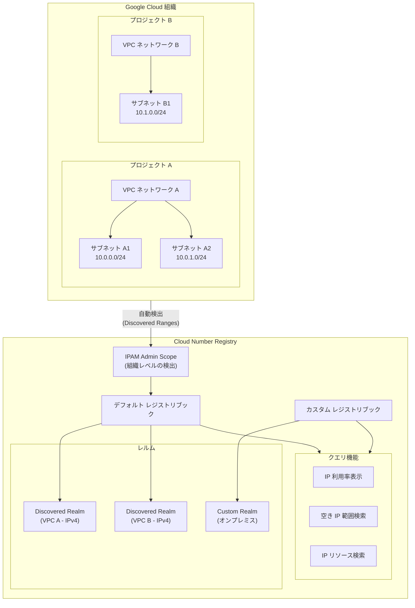

# Cloud Number Registry: IP Address Management (IPAM) 機能の提供開始

**リリース日**: 2026-04-22

**サービス**: Cloud Number Registry

**機能**: IP Address Management (IPAM)

**ステータス**: Preview

[このアップデートのインフォグラフィックを見る](https://takech9203.github.io/google-cloud-news-summary/20260422-cloud-number-registry-ipam.html)

## 概要

Cloud Number Registry が Preview として発表された。このサービスは、Google Cloud における IP アドレスの使用状況を一元的に表示・管理・計画するための IP Address Management (IPAM) 機能を提供する新しいサービスである。組織全体の Compute Engine リソースを自動的に検出し、VPC ネットワーク内のサブネット、IP アドレス範囲、予約済みアドレスなどの情報を「レジストリブック」と呼ばれるコンテナに集約して管理できる。

Cloud Number Registry の主要な価値は、組織全体の IP アドレス使用状況の可視化と、空き IP アドレス範囲の検索にある。大規模な Google Cloud 環境では、複数のプロジェクトや VPC ネットワークにまたがる IP アドレスの管理が複雑になりがちだが、Cloud Number Registry はこれらの情報を統合的に把握するための単一のインターフェースを提供する。また、カスタムレルムやカスタム範囲を使用することで、オンプレミス環境を含む Google Cloud 外の IP アドレス範囲も追跡対象に含めることができる。

このサービスは、ネットワークアーキテクト、クラウドインフラ管理者、IP アドレス計画を担当するチームを主な対象としている。特に、複数プロジェクトを持つ大規模組織において、IP アドレスの重複回避や利用率の最適化、新規サブネット作成時の空き範囲の特定に役立つ。

**アップデート前の課題**

- Google Cloud には組織全体の IP アドレス使用状況を一元的に把握する専用サービスが存在せず、各プロジェクトや VPC ネットワークごとに個別に確認する必要があった
- 新しいサブネットを作成する際に、既存の IP アドレス範囲と重複しない空き範囲を見つけるには、手動での調査やスプレッドシートなどの外部ツールでの管理が必要だった
- オンプレミス環境を含めたハイブリッド環境全体の IP アドレス計画を、Google Cloud 内のツールで統合的に管理する手段がなかった

**アップデート後の改善**

- IPAM admin scope を作成するだけで、組織全体の Compute Engine リソース (サブネット、IP アドレス範囲、予約済みアドレスなど) が自動的に検出・集約されるようになった
- レジストリブック単位で IP アドレスの利用率表示や空き範囲の検索が可能になり、IP アドレス計画の効率が大幅に向上した
- カスタムレルムとカスタム範囲により、Google Cloud 外の IP アドレス範囲 (オンプレミス環境など) も含めた統合的な IP アドレス管理が可能になった

## アーキテクチャ図



Cloud Number Registry は IPAM admin scope を通じて組織全体の Compute Engine リソースを自動検出し、レジストリブックとレルムの階層構造で IP アドレス情報を整理する。クエリ機能を使って利用率の確認や空き範囲の検索を行うことができる。

## サービスアップデートの詳細

### 主要機能

1. **自動リソース検出 (Discovery)**
   - IPAM admin scope を作成すると、組織全体の Compute Engine リソースが自動的に検出される
   - VPC ネットワークごとにレルムが自動作成され、サブネットの IPv4/IPv6 アドレス範囲、予約済みアドレス、エフェメラルアドレスなどが discovered ranges として取り込まれる
   - 検出されたリソースはソースの Compute Engine リソースと同期され、ソース側の変更が自動的に反映される

2. **レジストリブックによる整理**
   - デフォルトのレジストリブックには組織全体の discovered resources が格納される
   - プロジェクト単位で claimed scope を定義して、カスタムのレジストリブックを作成し、IP アドレスリソースを論理的にグルーピングできる
   - 1 つのプロジェクトは 1 つのレジストリブックにのみ所属可能

3. **IP アドレス利用率の可視化と空き範囲検索**
   - discovered ranges および custom ranges の IP アドレス利用率を表示可能
   - 指定した CIDR プレフィックス長で空き IP アドレス範囲を検索可能
   - レジストリブック内の IP リソースをレルム、IP アドレス、属性などの条件で検索可能

4. **カスタムレルムとカスタム範囲**
   - ユーザー定義のカスタムレルムを作成して、任意の IP アドレス範囲を管理対象に追加可能
   - Google Cloud 外のネットワーク (オンプレミスなど) の IP アドレス範囲もカスタム範囲として登録可能
   - カスタム範囲にはキーバリュー形式の属性 (例: `env=prod`) を付与してフィルタリングに活用可能

## 技術仕様

### リソース階層

| リソース | 説明 |
|----------|------|
| IPAM Admin Scope | 組織ごとに 1 つ作成。検出プロセスの起点となるリソース |
| Registry Book | IP アドレス情報のコンテナ。デフォルト + カスタムで複数作成可能 |
| Realm | ネットワークルーティングドメインを表すリソース。VPC ごとに自動作成 (discovered) またはユーザー作成 (custom) |
| Discovered Range | 自動検出された IP アドレス範囲。読み取り専用 |
| Custom Range | ユーザーが追加した IP アドレス範囲。更新・削除が可能 |

### 検出対象の Compute Engine リソース

| リソース種別 | 詳細 |
|-------------|------|
| VPC 内部 IPv4 | サブネットのプライマリ/セカンダリ IPv4 範囲、エフェメラル・予約済み内部 IPv4 アドレス |
| VPC 内部 IPv6 | ULA 内部 IPv6 範囲、サブネット内部 IPv6 範囲、エフェメラル・予約済み内部 IPv6 アドレス |
| 外部 IPv4 | エフェメラル・予約済み外部 IPv4 アドレス (`google-owned-ipv4` レルム) |
| 外部 IPv6 | サブネット外部 IPv6 範囲、予約済み・エフェメラル外部 IPv6 アドレス (`google-owned-ipv6` レルム) |

### IAM ロール

| ロール | 説明 |
|--------|------|
| `roles/cloudnumberregistry.ipamAdmin` | Cloud Number Registry の管理者。セットアップ、リソース作成・管理が可能 |
| `roles/cloudnumberregistry.ipamViewer` | Cloud Number Registry の閲覧者。情報の参照・クエリが可能 |

## 設定方法

### 前提条件

1. Google Cloud 組織 (Organization) が構成されていること
2. Cloud Number Registry 専用のプロジェクトを作成することを推奨 (セキュリティ上の理由)
3. Cloud Number Registry API が有効化されていること
4. `roles/cloudnumberregistry.ipamAdmin` IAM ロールが付与されていること

### 手順

#### ステップ 1: 既存の構成確認

```bash
# 組織内で Cloud Number Registry が既に構成されているか確認
gcloud alpha number-registry ipam-admin-scopes check-availability \
  --scopes=organizations/12345678 \
  --location=global
```

`AVAILABLE` が返却された場合、新規に構成可能。`UNAVAILABLE` の場合は既に別プロジェクトで構成済み。

#### ステップ 2: IPAM Admin Scope の作成

```bash
# IPAM admin scope を作成
gcloud alpha number-registry ipam-admin-scopes create my-ipam-scope \
  --enabled-addon-platforms=COMPUTE_ENGINE \
  --scopes=organizations/12345678 \
  --location=global
```

作成後、検出プロセスが開始される。ステータスが `READY_TO_USE` になるまで待機する。

#### ステップ 3: セットアップ状態の確認

```bash
# IPAM admin scope のステータスを確認
gcloud alpha number-registry ipam-admin-scopes describe my-ipam-scope \
  --location=global
```

`SETUP_IN_PROGRESS` から `READY_TO_USE` に変わったら利用開始可能。

#### ステップ 4: レジストリブックの確認・作成

```bash
# カスタムレジストリブックの作成 (オプション)
gcloud alpha number-registry registry-books create prod-book \
  --claimed-scopes=projects/12345678,projects/test-project \
  --location=global
```

#### ステップ 5: IP アドレス情報のクエリ

```bash
# discovered range の利用率を確認
gcloud alpha number-registry discovered-ranges show-utilization RANGE_NAME \
  --location=global

# 空き IP 範囲の検索
gcloud alpha number-registry discovered-ranges find-free-ip-ranges RANGE_NAME \
  --cidr-prefix-length=24 \
  --range-count=5 \
  --location=global

# IP リソースの検索
gcloud alpha number-registry registry-books search-ip-resources default \
  --query="ip_address=10.0.0.1" \
  --show-utilization \
  --location=global
```

## メリット

### ビジネス面

- **IP アドレス管理の効率化**: 組織全体の IP アドレス使用状況を単一のサービスから把握でき、手動の棚卸しやスプレッドシート管理が不要になる
- **計画精度の向上**: 空き IP 範囲の検索機能により、新規ネットワーク設計時の IP アドレス計画が迅速かつ正確に行える
- **ガバナンスの強化**: IAM ロールによるアクセス制御で、IP アドレス情報の参照範囲を適切に管理できる

### 技術面

- **自動検出**: IPAM admin scope を作成するだけで組織全体の Compute Engine リソースが自動的にインポートされ、手動のインベントリ作成が不要
- **ハイブリッド対応**: カスタムレルムとカスタム範囲により、オンプレミス環境の IP アドレス範囲も統合管理可能
- **柔軟なクエリ**: レルム、IP アドレス、属性、親範囲など多様な条件での検索が可能で、トラブルシューティングやキャパシティプランニングに活用できる
- **属性によるメタデータ管理**: カスタム範囲に属性 (例: `env=prod`, `team=networking`) を付与でき、組織のタグ付けポリシーに沿った管理が可能

## デメリット・制約事項

### 制限事項

- Preview 段階のため、「Pre-GA Offerings Terms」が適用される。SLA の対象外であり、機能の変更や廃止の可能性がある
- 組織あたり 1 つのプロジェクトのみが IPAM admin scope を管理できる
- BYOIP (Bring Your Own IP) のパブリックアドバタイズドプレフィックスおよびパブリックデリゲーテッドプレフィックスは検出対象外
- BYOIP の内部 IPv6 サブネット範囲は検出対象外 (ただし BYOIP 外部 IPv6 サブネット範囲は検出される)
- Internal Ranges リソースは検出対象外
- gcloud CLI は `alpha` チャンネルのみで利用可能

### 考慮すべき点

- IPAM admin scope を有効にすると、組織全体の IP アドレス範囲情報が読み取り専用で検出される。アクセス制御のため、専用プロジェクトでの運用と IAM ポリシーの適切な設定が強く推奨される
- discovered ranges は読み取り専用であり、変更するにはソースの Compute Engine リソースを直接修正する必要がある
- 空き IP 範囲の検索結果には、IPv4 サブネットの使用不可アドレスやシャットダウン済みインスタンスのエフェメラル IP アドレスが含まれる場合がある

## ユースケース

### ユースケース 1: 大規模組織の IP アドレス利用状況の可視化

**シナリオ**: 数百のプロジェクトと複数の VPC ネットワークを持つエンタープライズ組織で、IP アドレスの利用状況を把握し、アドレス枯渇のリスクを特定したい。

**実装例**:
```bash
# IPAM admin scope をセットアップ
gcloud alpha number-registry ipam-admin-scopes create enterprise-ipam \
  --enabled-addon-platforms=COMPUTE_ENGINE \
  --scopes=organizations/123456789 \
  --location=global

# 事業部門ごとにレジストリブックを作成
gcloud alpha number-registry registry-books create division-a-book \
  --claimed-scopes=projects/proj-a1,projects/proj-a2,projects/proj-a3 \
  --location=global

# 各サブネットの利用率を確認
gcloud alpha number-registry discovered-ranges show-utilization subnet-range-1 \
  --location=global
```

**効果**: 組織全体の IP アドレス使用状況が一元的に把握でき、利用率の高いサブネットや枯渇リスクのある範囲を早期に発見できる

### ユースケース 2: 新規 VPC サブネット作成時の空き範囲の特定

**シナリオ**: 新しいワークロード用の VPC サブネットを追加する際に、既存の IP アドレス範囲と重複しない /24 の空き範囲を見つけたい。

**実装例**:
```bash
# /24 の空き範囲を 3 つ検索
gcloud alpha number-registry discovered-ranges find-free-ip-ranges vpc-internal-range \
  --cidr-prefix-length=24 \
  --range-count=3 \
  --location=global
```

**効果**: 手動での IP アドレス範囲の重複チェックが不要になり、サブネット設計の時間を短縮できる

### ユースケース 3: ハイブリッド環境の統合 IP アドレス管理

**シナリオ**: Google Cloud とオンプレミスのデータセンターを Cloud VPN / Cloud Interconnect で接続しており、両環境の IP アドレス範囲を統合的に管理したい。

**実装例**:
```bash
# オンプレミス用のカスタムレルムを作成
gcloud alpha number-registry realms create onprem-dc1 \
  --registry-book=default \
  --traffic-type=PRIVATE \
  --management-type=USER \
  --ip-version=ipv4 \
  --location=global

# オンプレミスの IP 範囲をカスタム範囲として登録
gcloud alpha number-registry custom-ranges create dc1-servers \
  --realm=onprem-dc1 \
  --ipv4-cidr-range=172.16.0.0/16 \
  --attributes=key=location,value=datacenter-1 \
  --location=global
```

**効果**: Google Cloud とオンプレミスの IP アドレス範囲を一元管理でき、IP アドレスの重複を防止しながらハイブリッドネットワークの拡張計画を効率化できる

## 料金

Cloud Number Registry の料金情報は、Preview 段階のため公式に公開されていない。最新の料金情報は以下の公式ページを参照のこと。

- [Cloud Number Registry ドキュメント](https://cloud.google.com/number-registry/overview)

## 利用可能リージョン

Cloud Number Registry のリソースはグローバルロケーション (`--location=global`) で管理される。組織レベルで動作するサービスのため、特定のリージョンに制限されるものではない。ただし、検出対象となる Compute Engine リソースは各リージョンに存在するものが自動的にインポートされる。

## 関連サービス・機能

- **VPC ネットワーク**: Cloud Number Registry は VPC ネットワーク内のサブネットや IP アドレス範囲を自動検出する。VPC ネットワークの設計・管理と密接に関連する
- **Compute Engine**: 検出対象の主要サービス。サブネット、予約済み IP アドレス、エフェメラルアドレスなどのリソースが検出される
- **Cloud Interconnect / Cloud VPN**: オンプレミスとの接続時に、カスタムレルム・カスタム範囲と組み合わせてハイブリッド環境の IP アドレス管理に活用できる
- **Network Intelligence Center**: ネットワーク接続性テストや Flow Analyzer など、ネットワーク監視・診断機能を提供する関連サービス
- **IAM (Identity and Access Management)**: Cloud Number Registry へのアクセスは IAM ロール (`ipamAdmin`, `ipamViewer`) で制御される

## 参考リンク

- [インフォグラフィック](https://takech9203.github.io/google-cloud-news-summary/20260422-cloud-number-registry-ipam.html)
- [公式リリースノート](https://cloud.google.com/release-notes#April_22_2026)
- [Cloud Number Registry 概要](https://cloud.google.com/number-registry/overview)
- [Cloud Number Registry のセットアップ](https://cloud.google.com/number-registry/set-up-cloud-number-registry)
- [レジストリブック、レルム、カスタム範囲の作成](https://cloud.google.com/number-registry/create-registry-books-realms-custom-ranges)
- [Cloud Number Registry へのクエリ](https://cloud.google.com/number-registry/query-cloud-number-registry)

## まとめ

Cloud Number Registry は、Google Cloud における IP アドレス管理 (IPAM) の長年の課題を解決する新しいサービスである。組織全体の IP アドレスリソースの自動検出、利用率の可視化、空き範囲の検索、カスタム範囲によるハイブリッド環境対応など、エンタープライズレベルの IP アドレス管理に必要な機能を包括的に提供する。Preview 段階のため本番環境での使用には注意が必要だが、複数プロジェクトを持つ組織は、まず専用プロジェクトで IPAM admin scope をセットアップし、組織全体の IP アドレス使用状況を把握することから始めることを推奨する。

---

**タグ**: #CloudNumberRegistry #IPAM #IPAddressManagement #VPC #ネットワーク #Preview #IPアドレス管理 #ComputeEngine #ハイブリッドクラウド #ネットワーク設計
