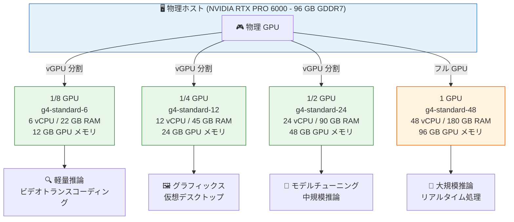

# Compute Engine: G4 マシンシリーズ Fractional GPU (vGPU) サポートが GA

**リリース日**: 2026-04-22

**サービス**: Compute Engine

**機能**: G4 アクセラレータ最適化マシンシリーズにおける Fractional GPU (vGPU) のサポート

**ステータス**: GA (一般提供)

📊 [このアップデートのインフォグラフィックを見る](https://takech9203.github.io/google-cloud-news-summary/20260422-compute-engine-g4-fractional-gpus-ga.html)

## 概要

Compute Engine の G4 アクセラレータ最適化マシンシリーズにおいて、1 GPU 未満の仮想 GPU (Fractional GPU / vGPU) を搭載した VM インスタンスの作成が一般提供 (GA) となった。これにより、GPU リソースの 1/2、1/4、1/8 という単位でのきめ細かなプロビジョニングが可能になり、フル GPU を必要としないワークロードに対してコストを最適化できる。

G4 マシンシリーズは NVIDIA RTX PRO 6000 Blackwell Server Edition GPU (96 GB GDDR7 メモリ) を搭載しており、Fractional GPU では 1 台の物理 GPU を複数の VM インスタンスで共有する。各 vGPU は個別の VM インスタンスとして実行されるため、マルチテナントのセキュリティ分離が確保される。推論、グラフィックスレンダリング、ビデオトランスコーディング、仮想デスクトップなど、フル GPU 容量を常に必要としないワークロードに最適な選択肢となる。

**アップデート前の課題**

- G4 インスタンスでは最小で 1 GPU (g4-standard-48) 単位でのプロビジョニングが必要であり、軽量な GPU ワークロードではリソースが過剰になっていた
- 推論やビデオトランスコーディングなど GPU を部分的にしか使用しないワークロードでも、フル GPU 分の料金を負担する必要があった
- GPU リソースの利用効率を最大化するには、ユーザー側でワークロードの統合やスケジューリングを工夫する必要があった

**アップデート後の改善**

- 1/8、1/4、1/2 GPU 単位で VM インスタンスを作成可能になり、ワークロードに適したサイズを選択できる
- Fractional GPU (vGPU) により、1 台の物理 GPU を複数の VM で安全に共有できるため、コスト効率が大幅に向上
- g4-standard-6 (1/8 GPU, 12 GB GPU メモリ)、g4-standard-12 (1/4 GPU, 24 GB GPU メモリ)、g4-standard-24 (1/2 GPU, 48 GB GPU メモリ) の 3 つのマシンタイプが利用可能

## アーキテクチャ図



1 台の NVIDIA RTX PRO 6000 物理 GPU を vGPU 技術により最大 8 分割し、それぞれ独立した VM インスタンスとしてマルチテナント分離を提供する。ワークロードの規模に応じて適切な GPU 割り当て量を選択できる。

## サービスアップデートの詳細

### 主要機能

1. **Fractional GPU (vGPU) マシンタイプ**
   - g4-standard-6: 1/8 GPU (12 GB GPU メモリ)、6 vCPU、22 GB インスタンスメモリ
   - g4-standard-12: 1/4 GPU (24 GB GPU メモリ)、12 vCPU、45 GB インスタンスメモリ
   - g4-standard-24: 1/2 GPU (48 GB GPU メモリ)、24 vCPU、90 GB インスタンスメモリ
   - 各 vGPU は個別の VM インスタンスとして動作し、マルチテナントのセキュリティ分離を提供

2. **NVIDIA RTX PRO 6000 Blackwell Server Edition GPU**
   - 96 GB GDDR7 GPU メモリ (1,597 GBps メモリ帯域幅)
   - 24,064 CUDA コア、752 第 5 世代 Tensor コア、188 第 4 世代 RT コア
   - FP4 精度サポートおよび DLSS 4 Multi Frame Generation 対応
   - 前世代 G2 (NVIDIA L4) と比較して大幅な性能向上

3. **Multi-Instance GPU (MIG) との併用オプション**
   - Fractional GPU (vGPU) とは別に、MIG モードも利用可能
   - MIG は 1 つの GPU を最大 4 つの完全に分離されたインスタンスに分割 (単一 VM 内)
   - vGPU はマルチテナント分離 (複数 VM)、MIG は単一 VM 内での分割という使い分けが可能

## 技術仕様

### Fractional GPU マシンタイプ一覧

| マシンタイプ | vCPU | インスタンスメモリ (GB) | GPU 割り当て | GPU メモリ (GB GDDR7) | Titanium SSD 最大容量 (GiB) | 最大ネットワーク帯域幅 (Gbps) |
|-------------|------|------------------------|-------------|----------------------|---------------------------|----------------------------|
| g4-standard-6 | 6 | 22 | 1/8 | 12 | 0 | 20 |
| g4-standard-12 | 12 | 45 | 1/4 | 24 | 375 | 20 |
| g4-standard-24 | 24 | 90 | 1/2 | 48 | 750 | 20 |

### Fractional GPU 固有の要件

- vGPU ドライバーのインストールが必要 (物理マシンのホストドライバーに接続する専用ドライバー)
- NVIDIA vGPU ドライバーの認証のため、サービスアカウントを有効にする必要がある (`--no-service-account` や `--no-scopes` フラグは使用不可)
- Compute Engine がインスタンスの ID を検証するためにサービスアカウントが必要

### Fractional GPU と MIG の比較

| 項目 | Fractional GPU (vGPU) | Multi-Instance GPU (MIG) |
|------|----------------------|--------------------------|
| 分離レベル | マルチテナント (複数 VM) | 単一 VM 内 |
| セキュリティ分離 | VM レベルの完全な分離 | メモリ・キャッシュ・SM の分離 |
| 最大分割数 | 最大 8 (1/8 GPU 単位) | 最大 4 |
| ユースケース | 異なるテナント・ユーザー間での共有 | 1 つの VM 内での並列ワークロード |
| ドライバー | 専用 vGPU ドライバーが必要 | 標準 GPU ドライバー |

## 設定方法

### 前提条件

1. Fractional GPU 対応のゾーン (現時点では us-central1-b のみ) でプロジェクトが利用可能であること
2. GPU クォータの申請が完了していること
3. サービスアカウントが有効な状態でインスタンスを作成すること

### 手順

#### ステップ 1: Fractional GPU インスタンスの作成

```bash
gcloud compute instances create my-fractional-gpu-vm \
    --machine-type=g4-standard-12 \
    --zone=us-central1-b \
    --boot-disk-size=200 \
    --image-family=rocky-linux-8-optimized-gcp \
    --image-project=rocky-linux-cloud \
    --maintenance-policy=TERMINATE \
    --restart-on-failure
```

1/4 GPU (24 GB GPU メモリ) を搭載した g4-standard-12 インスタンスを作成する例。`--no-service-account` や `--no-scopes` フラグは vGPU ドライバーの認証に必要なため使用しないこと。

#### ステップ 2: vGPU ドライバーのインストール

```bash
# インスタンスに SSH 接続
gcloud compute ssh my-fractional-gpu-vm --zone=us-central1-b

# vGPU ドライバーをインストール
# (具体的な手順は公式ドキュメントの install vGPU drivers (fractional VMs) を参照)
```

Fractional GPU インスタンスでは、フル GPU インスタンスとは異なる専用の vGPU ドライバーのインストールが必要となる。

## メリット

### ビジネス面

- **コスト最適化**: フル GPU を必要としないワークロードに対して、必要な分だけの GPU リソースを割り当てることで、GPU コストを最大 87.5% 削減可能 (1/8 GPU 使用時)
- **GPU リソースの有効活用**: 1 台の物理 GPU を最大 8 つの VM で共有することで、GPU の稼働率を大幅に向上

### 技術面

- **マルチテナント分離**: 各 vGPU は独立した VM インスタンスとして動作するため、セキュリティ分離が確保される
- **柔軟なスケーリング**: 1/8、1/4、1/2 GPU の 3 段階から選択でき、ワークロードの成長に合わせてマシンタイプを変更可能
- **最新 GPU アーキテクチャ**: NVIDIA Blackwell アーキテクチャの第 5 世代 Tensor コアと第 4 世代 RT コアを Fractional GPU でも利用可能

## デメリット・制約事項

### 制限事項

- Fractional GPU マシンタイプは現時点で **us-central1-b** ゾーンのみで利用可能 (フル G4 マシンタイプは複数リージョンで利用可能)
- 継続利用割引 (SUD) およびフレキシブル確約利用割引は G4 マシンタイプに適用されない
- Persistent Disk (リージョナル・ゾーナル) は使用不可。ブートディスクには Hyperdisk Balanced のみサポート
- g4-standard-6 (1/8 GPU) では Titanium SSD を接続できない
- Confidential VM インスタンスとしての作成は不可
- ソールテナントノードでの作成は不可

### 考慮すべき点

- vGPU ドライバーのインストールが必要であり、フル GPU インスタンスとはドライバー管理が異なる
- サービスアカウントを無効にした状態では Fractional GPU インスタンスを作成できない (vGPU ドライバー認証のため)
- GPU メモリは物理 GPU の分割量に応じて制限される (1/8 GPU では 12 GB のみ)

## ユースケース

### ユースケース 1: 軽量 ML 推論サービング

**シナリオ**: 小〜中規模の ML モデルをリアルタイム推論エンドポイントとしてデプロイする場合。フル GPU のリソースは過剰だが、CPU のみでは遅延が大きすぎるワークロード。

**実装例**:
```bash
# 1/4 GPU で推論サーバーを構築
gcloud compute instances create inference-server \
    --machine-type=g4-standard-12 \
    --zone=us-central1-b \
    --boot-disk-size=100 \
    --image-family=common-gpu-debian-12 \
    --image-project=ml-images \
    --maintenance-policy=TERMINATE \
    --restart-on-failure
```

**効果**: 24 GB の GPU メモリを使用して中規模モデルの推論を実行しつつ、フル GPU (g4-standard-48) 比で大幅なコスト削減を実現。

### ユースケース 2: 仮想デスクトップ / リモートワークステーション

**シナリオ**: CAD/3D モデリングやビデオ編集など、GPU アクセラレーションが必要なリモートワークステーションを複数ユーザーに提供する場合。

**効果**: 1 台の物理 GPU を複数の仮想デスクトップで共有しながら、VM レベルのセキュリティ分離を維持。NVIDIA RTX PRO 6000 の第 4 世代 RT コアにより、前世代比 2 倍のレイトレーシング性能を各ワークステーションに提供可能。

### ユースケース 3: ビデオトランスコーディング

**シナリオ**: 動画配信サービスにおいて、アップロードされた動画を複数フォーマットにトランスコードする処理。個々のトランスコードジョブは GPU リソースを少量しか必要としない。

**効果**: 1/8 GPU (g4-standard-6) を使用して、最小限の GPU リソースでハードウェアアクセラレーテッドなトランスコーディングを実現。複数のインスタンスを並列で運用することで、スループットとコスト効率を両立。

## 利用可能リージョン

Fractional GPU (vGPU) マシンタイプ (g4-standard-6、g4-standard-12、g4-standard-24) は、現時点で以下のゾーンのみで利用可能:

| リージョン | ゾーン | 場所 |
|-----------|--------|------|
| us-central1 | us-central1-b | Council Bluffs, Iowa, 北米 |

フル GPU の G4 マシンタイプ (g4-standard-48 以上) は、us-central1、us-east1、us-east4、us-east5、us-south1、us-west1、us-west3、us-west4、europe-west10 など複数のリージョン・ゾーンで利用可能。今後、Fractional GPU の対応リージョンも拡大される可能性がある。

## 関連サービス・機能

- **NVIDIA RTX Virtual Workstations (vWS)**: Fractional GPU は vWS 技術を活用しており、G4 インスタンスで NVIDIA RTX PRO 6000 vWS が有効になる
- **AI Hypercomputer**: G4 マシンシリーズは AI Hypercomputer の一部として、GKE や Slurm スケジューラとの統合が可能
- **Hyperdisk**: G4 インスタンスのブートディスクおよびデータディスクとして使用。最大 512 TiB の Hyperdisk を接続可能
- **Titanium SSD**: g4-standard-12 以上で接続可能な高速スクラッチディスク。GPU へのデータ供給における I/O ボトルネックを防止
- **Managed Instance Groups (MIG)**: 高可用性とスケーラビリティが必要な場合、Fractional GPU インスタンスのテンプレートを使用して MIG を構築可能

## 参考リンク

- 📊 [インフォグラフィック](https://takech9203.github.io/google-cloud-news-summary/20260422-compute-engine-g4-fractional-gpus-ga.html)
- [公式リリースノート](https://docs.cloud.google.com/release-notes#April_22_2026)
- [G4 マシンシリーズの概要](https://docs.cloud.google.com/compute/docs/accelerator-optimized-machines#g4-series)
- [G4 インスタンスの作成](https://docs.cloud.google.com/compute/docs/gpus/create-gpu-vm-g-series)
- [GPU に関する概要](https://docs.cloud.google.com/compute/docs/gpus/about-gpus)
- [vGPU ドライバーのインストール](https://docs.cloud.google.com/compute/docs/gpus/install-drivers-gpu#fractional-vms)
- [GPU リージョンとゾーン](https://docs.cloud.google.com/compute/docs/regions-zones/gpu-regions-zones)
- [GPU 料金ページ](https://cloud.google.com/compute/gpus-pricing)

## まとめ

G4 マシンシリーズにおける Fractional GPU (vGPU) の GA は、GPU コスト最適化の重要な選択肢を提供する。1/8、1/4、1/2 GPU という柔軟な割り当てオプションにより、軽量推論、仮想デスクトップ、ビデオトランスコーディングなどのワークロードで大幅なコスト削減が見込める。現時点では利用可能リージョンが us-central1-b に限定されているが、既にこのゾーンでワークロードを運用している場合は、GPU コストの見直しを検討することを推奨する。

---

**タグ**: #ComputeEngine #GPU #FractionalGPU #vGPU #G4 #NVIDIA #RTX-PRO-6000 #コスト最適化 #GA
