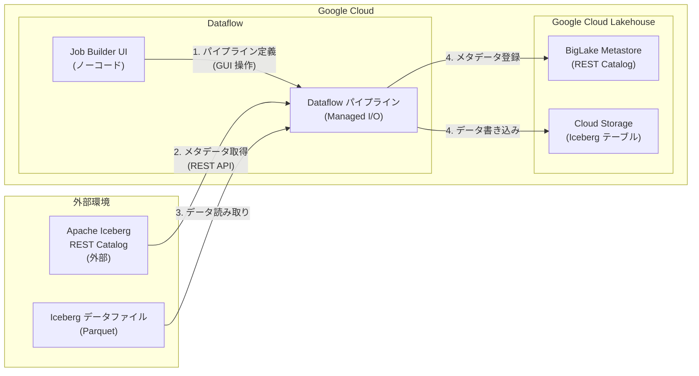

# Dataflow: Job Builder が外部 Iceberg REST Catalog をソースとしてサポート

**リリース日**: 2026-04-22

**サービス**: Dataflow

**機能**: Job Builder Support for External Iceberg REST Catalogs

**ステータス**: GA

[このアップデートのインフォグラフィックを見る](https://takech9203.github.io/google-cloud-news-summary/20260422-dataflow-iceberg-rest-catalog.html)

## 概要

Dataflow の Job Builder (ジョブビルダー) に、外部 Apache Iceberg REST Catalog (IRC) をソースとして利用する機能が GA (一般提供) として追加された。この機能により、外部の Iceberg REST カタログからデータを取得し、Google Cloud Lakehouse テーブルへ直接取り込むデータパイプラインを、コードを記述することなく Job Builder UI 上で構築・実行できるようになった。

Dataflow の Job Builder は、Google Cloud コンソール上でビジュアルにデータパイプラインを構築・実行するためのノーコード UI である。従来、Pub/Sub、BigQuery、Cloud Storage、PostgreSQL、MySQL 等のデータソースをサポートしていたが、今回のアップデートにより外部 Iceberg REST Catalog が新たにソースとして追加された。Apache Iceberg は、大規模な分析データセットのためのオープンテーブルフォーマットであり、REST Catalog はそのメタデータ管理のための標準的なインターフェースを提供する。

このアップデートは、オンプレミスや他のクラウド環境で Apache Iceberg を活用しているデータエンジニアやデータプラットフォームチームにとって特に有用である。従来、外部 Iceberg カタログからのデータ取り込みには Apache Beam SDK を使用したカスタムパイプラインの開発が必要であったが、Job Builder のノーコード UI を通じて同等の機能を利用できるようになったことで、データ統合のハードルが大幅に下がった。

**アップデート前の課題**

- 外部 Iceberg REST Catalog からデータを取り込むには、Apache Beam SDK (Java/Python) を使用してカスタムパイプラインを開発する必要があった
- Managed I/O コネクタの REST カタログ設定 (catalog_properties の URI、認証ヘッダー、warehouse 設定等) を手動でコード内に記述する必要があり、開発工数がかかった
- ノーコードの Job Builder UI では Iceberg ソースがサポートされておらず、Iceberg データの取り込みにはプログラミングスキルが必須だった

**アップデート後の改善**

- Job Builder UI 上で外部 Iceberg REST Catalog をソースとして選択し、ノーコードでデータ取り込みパイプラインを構築できるようになった
- コードを書くことなく、外部 Iceberg カタログから Google Cloud Lakehouse テーブルへのデータインジェストが可能になった
- Iceberg REST Catalog の接続設定を UI 上で視覚的に行えるため、パイプライン構築の敷居が大幅に低下した

## アーキテクチャ図

Job Builder UI でパイプラインを定義すると、Dataflow が外部 Iceberg REST Catalog からメタデータとデータを読み取り、Google Cloud Lakehouse テーブル (BigLake Metastore + Cloud Storage) に取り込む。

## サービスアップデートの詳細

### 主要機能

1. **外部 Iceberg REST Catalog ソースの追加**
   - Job Builder のソース選択肢に外部 Iceberg REST Catalog が追加された
   - カタログ URI、認証情報、warehouse パスなどの接続パラメータを UI 上で設定可能
   - Apache Iceberg REST Catalog 仕様に準拠した任意の外部カタログに接続可能

2. **ノーコードでのデータインジェスト**
   - プログラミングなしで外部 Iceberg データを Google Cloud Lakehouse テーブルに取り込み可能
   - Job Builder の既存のトランスフォーム機能 (フィルタ、マッピング、SQL、結合など) と組み合わせて利用可能
   - パイプラインを Apache Beam YAML ファイルとして保存・再利用することも可能

3. **Google Cloud Lakehouse との統合**
   - 取り込み先として Google Cloud Lakehouse テーブルをサポート
   - BigLake Metastore を通じた Iceberg テーブルメタデータの管理
   - 取り込んだデータは BigQuery や Apache Spark などのクエリエンジンからアクセス可能

## 技術仕様

### サポートされる構成

| 項目 | 詳細 |
|------|------|
| ソースカタログ | Apache Iceberg REST Catalog (外部) |
| サポートカタログタイプ | REST ベースカタログ |
| データファイル形式 | Parquet |
| 取り込み先 | Google Cloud Lakehouse テーブル |
| ベース技術 | Managed I/O (Apache Iceberg コネクタ) |
| 必要な Beam SDK | Java 2.58.0 以降 / Python 2.61.0 以降 (Job Builder が内部で使用) |
| Runner | Dataflow Runner v2 |

### Managed I/O 構成パラメータ (参考: SDK 使用時)

Job Builder が内部で使用する Managed I/O の主要な設定パラメータは以下の通りである。

| パラメータ | 型 | 説明 |
|-----------|------|------|
| `table` | str | Iceberg テーブルの識別子 |
| `catalog_name` | str | カタログの名前 |
| `catalog_properties` | map[str, str] | カタログのセットアップに使用するプロパティ (type, uri, warehouse 等) |
| `config_properties` | map[str, str] | Hadoop Configuration に渡すプロパティ |
| `filter` | str | スキャン時にデータをフィルタリングする SQL ライクな述語 |
| `keep` / `drop` | list[str] | 読み取る/除外するカラム名のリスト |

## 設定方法

### 前提条件

1. Google Cloud プロジェクトで Dataflow API が有効化されていること
2. 接続先の外部 Iceberg REST Catalog のエンドポイント URL と認証情報が準備されていること
3. 取り込み先の Google Cloud Lakehouse テーブルが作成済みであること
4. 必要な IAM ロール (Dataflow 管理者、BigLake 編集者、Storage オブジェクトユーザーなど) が付与されていること

### 手順

#### ステップ 1: Job Builder を開く

Google Cloud コンソールで Dataflow の「ジョブ」ページに移動し、「テンプレートからジョブを作成」をクリック後、「Job Builder」を選択する。

#### ステップ 2: ソースの設定

Job Builder UI で新しいソースを追加し、外部 Iceberg REST Catalog を選択する。以下の情報を入力する。

- **Catalog URI**: 外部 Iceberg REST Catalog のエンドポイント URL
- **認証情報**: カタログへのアクセスに必要な認証トークンまたはクレデンシャル
- **テーブル識別子**: 読み取り対象の Iceberg テーブル名
- **Warehouse パス**: Iceberg のウェアハウスロケーション

#### ステップ 3: シンク (出力先) の設定

出力先として Google Cloud Lakehouse テーブルを選択し、テーブルの設定を行う。

#### ステップ 4: パイプラインの実行

設定を確認し「ジョブを実行」をクリックすると、Dataflow ジョブが作成・実行される。

## メリット

### ビジネス面

- **データ統合の民主化**: プログラミングスキルがなくても、外部 Iceberg カタログからのデータ取り込みが可能になり、データアナリストやビジネスユーザーが自らデータ統合を行える
- **移行コストの削減**: 外部環境 (オンプレミスや他クラウド) から Google Cloud Lakehouse への移行において、カスタムコードの開発・保守コストを削減できる
- **Time-to-Value の短縮**: コード開発・テスト・デプロイのサイクルが不要になり、データ取り込みパイプラインの構築時間を大幅に短縮できる

### 技術面

- **Managed I/O による自動管理**: Dataflow の Managed I/O 基盤上で動作するため、コネクタの自動アップグレード、セキュリティ修正、パフォーマンス改善の恩恵を自動的に受けられる
- **YAML エクスポートによる再利用性**: Job Builder で構築したパイプラインを Apache Beam YAML としてエクスポートし、gcloud CLI やソース管理リポジトリで管理できる
- **既存トランスフォームとの組み合わせ**: Job Builder のフィルタ、マッピング、SQL、結合などのトランスフォーム機能を活用して、取り込み時にデータの変換・加工が可能

## デメリット・制約事項

### 制限事項

- Job Builder がサポートするトランスフォームのサブセットに限定される (Apache Beam SDK のフル機能は利用不可)
- Iceberg REST Catalog は Parquet データファイルのみをサポート (ORC、Avro 等は非対応の可能性)
- BigLake は Apache Iceberg V3 テーブルをサポートしていない

### 考慮すべき点

- 大規模なデータセットの初回取り込みでは、Dataflow ワーカーのリソース (CPU、メモリ、ディスク) のサイジングが重要
- 外部カタログへのネットワーク接続性 (VPN、相互接続、パブリック IP) の事前確認が必要
- 認証トークンの有効期限管理に注意が必要 (BigLake REST Catalog 使用時、OAuth トークンは 1 時間で期限切れになる場合がある)

## ユースケース

### ユースケース 1: マルチクラウド環境からのデータ統合

**シナリオ**: AWS や Azure 上で Apache Iceberg ベースのデータレイクを運用している企業が、Google Cloud の BigQuery や Lakehouse でデータ分析を行いたい場合。外部環境の Iceberg REST Catalog に接続し、必要なテーブルを Google Cloud Lakehouse に取り込む。

**効果**: コードを書くことなく、マルチクラウド間のデータ統合パイプラインを構築でき、Google Cloud のアナリティクスサービスでの分析が迅速に開始できる。

### ユースケース 2: オンプレミスからのデータマイグレーション

**シナリオ**: オンプレミスの Hadoop/Spark 環境で Iceberg テーブルを管理している組織が、段階的に Google Cloud Lakehouse へ移行する場合。Job Builder を使って定期的にデータを取り込み、並行運用期間中のデータ同期を実現する。

**効果**: データエンジニアがカスタムパイプラインを開発・保守する必要がなくなり、移行プロジェクトのオーバーヘッドが削減される。

### ユースケース 3: データメッシュアーキテクチャでのデータ共有

**シナリオ**: 各事業部門が独自の Iceberg REST Catalog でデータを公開するデータメッシュアーキテクチャにおいて、中央のデータプラットフォームチームが各部門のデータを Lakehouse に集約する場合。

**効果**: ドメインごとの Iceberg カタログから、ノーコードで横断的なデータ統合が可能になり、組織全体のデータ活用が促進される。

## 料金

Dataflow の料金は、パイプラインの実行に使用されるリソース (vCPU、メモリ、ストレージ、Streaming Engine) に基づいて課金される。Job Builder 自体の追加料金は発生しない。

### 料金の構成要素

| リソース | 課金単位 |
|---------|---------|
| Worker vCPU | vCPU 時間あたり |
| Worker メモリ | GB 時間あたり |
| Dataflow Shuffle / Streaming Engine | 処理データ量あたり |
| Persistent Disk (HDD/SSD) | GB 時間あたり |

詳細な料金は [Dataflow の料金ページ](https://cloud.google.com/dataflow/pricing) を参照。

ストリーミングジョブの場合、[確約利用割引 (CUD)](https://cloud.google.com/dataflow/docs/cuds) や[リソースベースの課金](https://cloud.google.com/dataflow/docs/streaming-engine#compute-unit-pricing)を活用することで、コストの最適化が可能である。

## 利用可能リージョン

Dataflow が利用可能なすべてのリージョンで利用可能。詳細は [Dataflow のロケーションページ](https://cloud.google.com/dataflow/docs/resources/locations) を参照。

## 関連サービス・機能

- **Google Cloud Lakehouse**: 取り込み先の統合データレイクハウスプラットフォーム。BigLake Metastore を通じた Iceberg テーブルの管理を提供
- **BigLake Metastore (REST Catalog)**: Google Cloud の Iceberg REST Catalog エンドポイント。Lakehouse テーブルのメタデータ管理に使用
- **Managed I/O**: Dataflow の I/O コネクタ管理フレームワーク。Apache Iceberg を含む複数のソース・シンクに対応し、自動アップグレードを提供
- **BigQuery**: Lakehouse テーブルに取り込まれたデータに対する SQL ベースの分析が可能
- **BigQuery Migration Service**: 外部 Iceberg カタログからのメタデータマイグレーション機能を提供 (Dataflow によるデータ取り込みと相補的)
- **Apache Beam SDK**: Job Builder では対応できない高度なパイプライン要件に対して、フルプログラマティックなパイプライン開発が可能

## 参考リンク

- [インフォグラフィック](https://takech9203.github.io/google-cloud-news-summary/20260422-dataflow-iceberg-rest-catalog.html)
- [公式リリースノート](https://cloud.google.com/release-notes#April_22_2026)
- [Dataflow Job Builder UI 概要](https://cloud.google.com/dataflow/docs/guides/job-builder)
- [Managed I/O: Apache Iceberg](https://cloud.google.com/dataflow/docs/guides/managed-io-iceberg)
- [Apache Iceberg からの読み取り](https://cloud.google.com/dataflow/docs/guides/read-from-iceberg)
- [BigLake REST Catalog を使用した Iceberg ストリーミング書き込み](https://cloud.google.com/dataflow/docs/guides/streaming-write-to-iceberg-biglake)
- [Lakehouse Iceberg テーブルへのデータインポート](https://cloud.google.com/bigquery/docs/import-export-lakehouse-iceberg-rest-catalog-data)
- [Dataflow 料金](https://cloud.google.com/dataflow/pricing)

## まとめ

Dataflow Job Builder に外部 Iceberg REST Catalog ソースが GA として追加されたことで、外部環境の Iceberg データを Google Cloud Lakehouse に取り込むためのデータパイプラインをノーコードで構築できるようになった。マルチクラウド環境やオンプレミスからの Iceberg データ統合を検討している組織は、まず Job Builder UI で小規模なデータ取り込みを試し、接続性とパフォーマンスを検証することを推奨する。

---

**タグ**: #Dataflow #ApacheIceberg #Lakehouse #JobBuilder #NoCode #DataIngestion #ManagedIO #BigLake #RESTCatalog #GA
