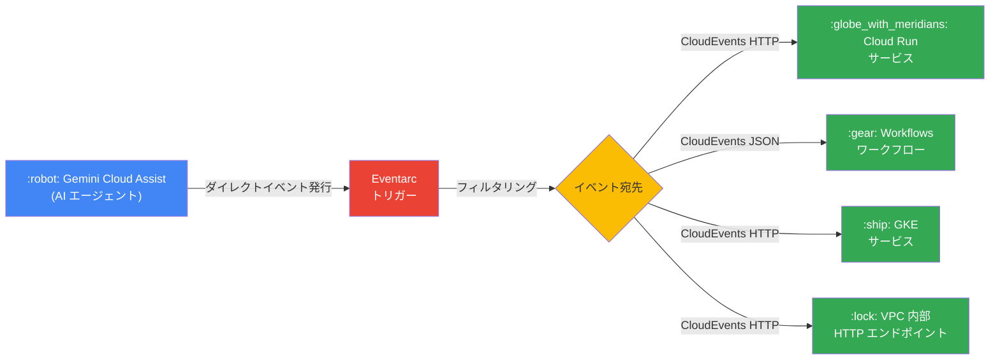

# Eventarc: Gemini Cloud Assist からのダイレクトイベント用トリガー (Preview)

**リリース日**: 2026-04-22

**サービス**: Eventarc

**機能**: Triggers for Direct Events from Gemini Cloud Assist

**ステータス**: Preview

:bar_chart: [このアップデートのインフォグラフィックを見る](https://takech9203.github.io/google-cloud-news-summary/20260422-eventarc-gemini-cloud-assist-triggers.html)

## 概要

Eventarc において、Gemini Cloud Assist からのダイレクトイベントに対するトリガー作成機能が Preview として利用可能になりました。これにより、Gemini Cloud Assist が実行するアクション (調査の開始、リソースの変更提案、アラート分析など) をイベントとして検知し、Cloud Run、Workflows、GKE などのイベント宛先に自動的にルーティングできるようになります。

Gemini Cloud Assist は Google Cloud のAI パワードコラボレーターとして、設計・デプロイ・トラブルシューティング・最適化を支援するマルチエージェントエコシステムです。今回の統合により、Gemini Cloud Assist のアクションをトリガーとしたイベント駆動型アーキテクチャの構築が可能になり、AI 操作の監査・追跡・自動化の幅が大きく広がります。

このアップデートは、Gemini Cloud Assist を活用した運用自動化やコンプライアンス対応を強化したい Solutions Architect、DevOps エンジニア、SRE チームにとって特に有用です。

**アップデート前の課題**

- Gemini Cloud Assist のアクションを検知するには Cloud Audit Logs を経由する必要があり、レイテンシが高く、イベントフォーマットの予測可能性が低かった
- Gemini Cloud Assist の操作に対するリアルタイムな自動応答ワークフローを構築することが困難だった
- AI エージェントによるリソース変更の追跡・監査を自動化するためのネイティブなイベントソースが存在しなかった

**アップデート後の改善**

- Gemini Cloud Assist のアクションをダイレクトイベントとして直接受信でき、Audit Log 経由よりも低レイテンシで配信される
- 強く型付けされたイベントフォーマットにより、予測可能で検出しやすいイベントデータを取得可能
- Cloud Run、Workflows、GKE、VPC 内部 HTTP エンドポイントなど、多様なイベント宛先へのルーティングが可能

## アーキテクチャ図



Gemini Cloud Assist が発行するダイレクトイベントを Eventarc トリガーが受信し、設定されたフィルタ条件に基づいて Cloud Run、Workflows、GKE、VPC 内部エンドポイントなどの宛先にルーティングする構成を示しています。

## サービスアップデートの詳細

### 主要機能

1. **Gemini Cloud Assist ダイレクトイベントトリガー**
   - Gemini Cloud Assist をイベントプロバイダーとして選択し、ダイレクトイベントタイプに基づくトリガーを作成可能
   - CloudEvents フォーマットで HTTP リクエストとしてイベントが配信される
   - イベントペイロードのエンコーディングとして `application/json` または `application/protobuf` を選択可能

2. **イベントフィルタリング**
   - イベントタイプによるフィルタリングに加え、リソース ID などの属性フィルタを設定可能
   - 完全一致 (Equal) またはパスパターンによるフィルタリングをサポート
   - 複数の属性フィルタを組み合わせた精密なイベントルーティングが可能

3. **多様なイベント宛先のサポート**
   - Cloud Run サービス
   - Workflows ワークフロー
   - GKE サービス (パブリックエンドポイント)
   - VPC 内部 HTTP エンドポイント (プライベートエンドポイント)

4. **ダイレクトイベントの優位性**
   - Cloud Audit Logs 経由のイベントと比較して、トリガーの応答性とイベント配信レイテンシが改善
   - 強く型付けされたイベントフォーマットにより、予測可能性と検出性が向上
   - Cloud Audit Logs の有効化に伴う追加コストが不要

## 技術仕様

### イベント配信仕様

| 項目 | 詳細 |
|------|------|
| イベントフォーマット | CloudEvents 仕様準拠 |
| 配信方式 | HTTP POST リクエスト |
| ペイロードエンコーディング | `application/json` または `application/protobuf` |
| イベントサイズ上限 (Standard) | 512 KB |
| イベントサイズ上限 (Advanced) | 1 MB |
| 配信保証 | At-least-once |
| メッセージ保持期間 | デフォルト 24 時間 (指数バックオフ) |
| リージョナリティ | リージョナル |

### IAM とサービスアカウント

トリガーの作成時には、イベント宛先を呼び出すためのサービスアカウントを指定する必要があります。このサービスアカウントには、Eventarc が要求する適切な IAM ロールを事前に付与しておく必要があります。

```json
{
  "trigger": {
    "name": "gemini-assist-event-trigger",
    "eventFilters": [
      {
        "attribute": "type",
        "value": "google.cloud.geminicloudassist.<EVENT_TYPE>"
      }
    ],
    "destination": {
      "cloudRun": {
        "service": "my-event-handler",
        "region": "us-central1"
      }
    },
    "serviceAccount": "eventarc-trigger-sa@PROJECT_ID.iam.gserviceaccount.com"
  }
}
```

## 設定方法

### 前提条件

1. Google Cloud プロジェクトで Eventarc API が有効化されていること
2. Gemini Cloud Assist が有効化されていること
3. イベント宛先 (Cloud Run サービスなど) がデプロイ済みであること
4. トリガー用のサービスアカウントに必要な IAM ロールが付与されていること

### 手順

#### ステップ 1: Eventarc API の有効化

```bash
gcloud services enable eventarc.googleapis.com
```

Eventarc API が有効化されていない場合は、まず API を有効化します。

#### ステップ 2: Google Cloud コンソールからトリガーを作成

```bash
# gcloud CLI を使用したトリガー作成例
gcloud eventarc triggers create gemini-assist-trigger \
  --location=LOCATION \
  --destination-run-service=MY_SERVICE \
  --destination-run-region=LOCATION \
  --event-filters="type=google.cloud.geminicloudassist.EVENT_TYPE" \
  --service-account=SA_NAME@PROJECT_ID.iam.gserviceaccount.com
```

`LOCATION` は Eventarc がサポートするリージョン、`EVENT_TYPE` は対象の Gemini Cloud Assist イベントタイプに置き換えてください。

#### ステップ 3: トリガーの確認

```bash
gcloud eventarc triggers describe gemini-assist-trigger \
  --location=LOCATION
```

作成したトリガーの詳細を確認し、フィルタ条件とイベント宛先が正しく設定されていることを検証します。

## メリット

### ビジネス面

- **AI 操作の可視化と監査強化**: Gemini Cloud Assist によるリソース変更や提案を自動的にキャプチャし、コンプライアンス要件への対応を強化
- **運用自動化の高度化**: AI エージェントのアクションをトリガーとした自動化ワークフローにより、運用効率が向上
- **インシデント対応の迅速化**: Gemini Cloud Assist の調査結果やアラート分析をリアルタイムで他システムに連携可能

### 技術面

- **低レイテンシのイベント配信**: ダイレクトイベントにより、Audit Log 経由と比較してイベント配信の遅延を削減
- **型安全なイベントフォーマット**: CloudEvents 仕様に準拠した強く型付けされたフォーマットにより、イベントハンドラの実装が容易
- **柔軟なフィルタリング**: 属性フィルタとパスパターンを組み合わせた精密なイベントルーティングが可能

## デメリット・制約事項

### 制限事項

- Preview 段階のため、Pre-GA Offerings Terms が適用され、サポートが限定的な場合がある
- イベントの順序保証 (FIFO) は提供されない
- Eventarc Standard のイベントサイズ上限は 512 KB であるため、大きなペイロードを含むイベントは制限を受ける可能性がある

### 考慮すべき点

- Preview 機能のため、GA までに仕様が変更される可能性がある
- Gemini Cloud Assist 自体も Preview 段階の機能を含むため、イベントタイプやフォーマットの変更に注意が必要
- トリガーのリージョンは、イベントを生成する Google Cloud サービスと同じリージョンに設定する必要がある

## ユースケース

### ユースケース 1: AI 操作の監査ログ自動化

**シナリオ**: エンタープライズ環境で Gemini Cloud Assist がリソースの変更を提案・実行した際に、自動的に監査レコードを作成し、コンプライアンスチームに通知する。

**実装例**:
```yaml
# Cloud Run サービスでイベントを受信し、監査レコードを BigQuery に保存
# Eventarc トリガー: Gemini Cloud Assist -> Cloud Run -> BigQuery
steps:
  - receive_event: CloudEvents HTTP POST
  - extract_metadata: イベントペイロードからアクション詳細を抽出
  - store_audit_record: BigQuery テーブルに監査レコードを挿入
  - notify_team: Pub/Sub 経由でコンプライアンスチームに通知
```

**効果**: Gemini Cloud Assist による全てのリソース変更操作が自動的に記録され、コンプライアンス監査の効率が大幅に向上する。

### ユースケース 2: AI 駆動型インシデント自動対応

**シナリオ**: Gemini Cloud Assist のプロアクティブアラート調査機能が異常を検知した際に、Workflows を通じて自動的にインシデント対応プロセスを開始する。

**効果**: アラート検知から初動対応までの時間を短縮し、MTTR (平均復旧時間) を改善できる。Gemini Cloud Assist の根本原因分析結果をそのままインシデント対応ワークフローに引き渡せるため、対応の質も向上する。

## 料金

Eventarc の料金体系が適用されます。Preview 期間中はダイレクトイベント機能に対する追加料金が発生しない場合がありますが、GA 移行後は課金対象となる可能性があります。詳細は [Eventarc 料金ページ](https://cloud.google.com/eventarc/pricing) を参照してください。

なお、ダイレクトイベントを使用する場合、Cloud Audit Logs の有効化に伴う追加コストが不要である点は、コスト面での利点です。

## 利用可能リージョン

Eventarc Standard のダイレクトイベントトリガーは、Gemini Cloud Assist がサポートするリージョンで利用可能です。Eventarc Standard は、Americas、Europe、Asia-Pacific、Middle East、Africa の幅広いリージョンをサポートしています。Gemini Cloud Assist のダイレクトイベントで利用可能な具体的なリージョンについては、[Eventarc ロケーション](https://cloud.google.com/eventarc/docs/locations)のドキュメントを参照してください。

## 関連サービス・機能

- **Gemini Cloud Assist**: AI パワードのクラウド運用支援サービス。調査、リソース変更、アラート分析などのアクションがイベントソースとなる
- **Cloud Run**: イベント宛先としてサーバーレスコンテナで処理を実行。Eventarc トリガーの主要な宛先の一つ
- **Workflows**: イベント駆動型のワークフローオーケストレーション。Gemini Cloud Assist のイベントを起点とした複雑な自動化フローを構築可能
- **Cloud Audit Logs**: 従来の監査ログベースのイベントルーティング。ダイレクトイベントが未対応の場合のフォールバック手段
- **Pub/Sub**: Eventarc Standard のトランスポートレイヤーとして使用。ダイレクトイベント以外のイベントルーティングにも活用
- **Eventarc Advanced**: より高度なイベントルーティング (クロスプロジェクト配信、メッセージ変換、CEL 式によるフィルタリング) が必要な場合に検討

## 参考リンク

- :bar_chart: [インフォグラフィック](https://takech9203.github.io/google-cloud-news-summary/20260422-eventarc-gemini-cloud-assist-triggers.html)
- [公式リリースノート](https://cloud.google.com/release-notes#April_22_2026)
- [Eventarc ドキュメント - ダイレクトイベントトリガーの作成 (Cloud Run)](https://cloud.google.com/eventarc/standard/docs/run/route-trigger-eventarc)
- [Eventarc ドキュメント - ダイレクトイベントトリガーの作成 (Workflows)](https://cloud.google.com/eventarc/standard/docs/workflows/route-trigger-eventarc)
- [Eventarc ドキュメント - イベントルーティングオプション](https://cloud.google.com/eventarc/standard/docs/run/event-routing-options)
- [Eventarc ドキュメント - サポートされるイベント一覧](https://cloud.google.com/eventarc/docs/reference/supported-events)
- [Gemini Cloud Assist 概要](https://cloud.google.com/cloud-assist/overview)
- [Eventarc 料金](https://cloud.google.com/eventarc/pricing)
- [Eventarc ロケーション](https://cloud.google.com/eventarc/docs/locations)

## まとめ

今回の Eventarc による Gemini Cloud Assist ダイレクトイベントトリガーの Preview リリースは、AI エージェントの操作を起点としたイベント駆動型アーキテクチャを構築するための重要な基盤となります。ダイレクトイベントの低レイテンシと型安全なフォーマットにより、従来の Audit Log 経由のアプローチよりも効率的かつ信頼性の高いイベント処理が可能です。Gemini Cloud Assist を活用した運用自動化や監査強化を検討している場合は、Preview 段階から検証を開始し、GA リリースに備えることを推奨します。

---

**タグ**: #Eventarc #GeminiCloudAssist #DirectEvents #EventDrivenArchitecture #Preview #CloudRun #Workflows #Serverless #AI #Automation
