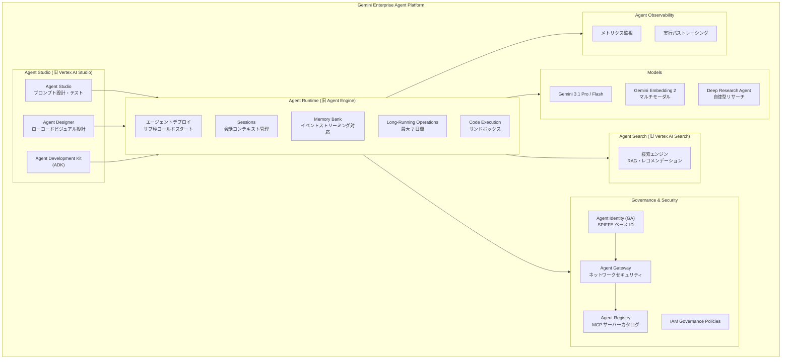

# Gemini Enterprise Agent Platform: Vertex AI リブランディングと新機能群の一斉発表

**リリース日**: 2026-04-22

**サービス**: Gemini Enterprise Agent Platform (旧 Vertex AI)

**機能**: Vertex AI から Gemini Enterprise Agent Platform への統合リブランディング、Agent Runtime 大幅強化、Agent Identity GA、Agent Gateway / Agent Registry / Agent Observability 新規発表、Gemini Embedding 2 GA、Gemini Deep Research Agent

**ステータス**: GA (一部機能は Preview / Private Preview)

📊 [このアップデートのインフォグラフィックを見る](https://takech9203.github.io/google-cloud-news-summary/20260422-gemini-enterprise-agent-platform-launch.html)

## 概要

Google Cloud は、従来の Vertex AI を **Gemini Enterprise Agent Platform** としてリブランディングし、AI エージェント開発・運用のための統合プラットフォームとして再定義した。これは単なる名称変更にとどまらず、エージェント中心のアーキテクチャへのパラダイムシフトを示す大規模なプラットフォーム再編である。Vertex AI Platform は Agent Platform に、Vertex AI Studio は Agent Studio に、Vertex AI Search は Agent Search に、Vertex AI Agent Engine は Agent Runtime にそれぞれ改称され、Google Cloud コンソールのナビゲーションもエージェント関連プロダクトを集約する形で刷新された。

今回のリリースでは、名称変更に加えて多数の新機能が同時発表されている。Agent Runtime の長時間実行オペレーション対応 (最大 7 日間)、サブ秒コールドスタート、1 分以内のプロビジョニングといったランタイムの大幅な性能改善に加え、Agent Identity の GA 昇格、Agent Gateway (Private Preview)、Agent Registry (Public Preview)、Agent Observability (Preview) といったエージェントガバナンス・セキュリティ・監視のための新コンポーネントが発表された。さらに、マルチモーダル対応の Gemini Embedding 2 の GA、Gemini 3.1 Pro を活用した Deep Research Agent などの新プロダクトも含まれる。

対象ユーザーは、AI エージェントを開発・運用するすべてのチーム (開発者、MLOps エンジニア、プラットフォームエンジニア、セキュリティ管理者、Solutions Architect) であり、Google Cloud のエージェント AI 戦略の中核となるアップデートである。

**アップデート前の課題**

- Vertex AI の各サービス (Search、Agent Engine、Studio 等) が個別に存在し、エージェント開発の統一的なプラットフォーム体験が不足していた
- Agent Engine のコールドスタートに平均 4.7 秒の遅延が発生し、プロビジョニングにも時間がかかっていた
- エージェントの長時間実行タスク (リサーチ、データ処理等) に対するネイティブサポートがなく、タイムアウトの制約があった
- エージェントのセキュリティ管理にサービスアカウントベースの汎用的なアプローチを使用しており、エージェント固有の ID 管理や最小権限アクセスが困難だった
- MCP サーバー、ツール、AI エージェントを組織横断で一元管理するカタログが存在しなかった
- エージェント間通信のネットワークセキュリティを一元的に管理する仕組みがなかった
- テキストのみの埋め込みモデルが主流で、マルチモーダル (画像、動画、音声、PDF) を統一的な埋め込み空間で扱えなかった

**アップデート後の改善**

- Gemini Enterprise Agent Platform として統一されたブランドとナビゲーションにより、エージェント開発のエンドツーエンドの体験が一貫したものになった
- Agent Runtime のコールドスタートがサブ秒に短縮され、プロビジョニングも 1 分以内に完了するようになった
- 最大 7 日間の長時間実行オペレーションがサポートされ、複雑なリサーチタスクやデータ処理パイプラインに対応可能になった
- Agent Identity (GA) により、エージェント固有の SPIFFE ベース ID が提供され、IAM による最小権限アクセス制御が可能になった
- Agent Registry (Public Preview) により、MCP サーバー、ツール、AI エージェントの組織横断的な一元カタログが利用可能になった
- Agent Gateway (Private Preview) により、エージェント間通信のネットワークセキュリティが IAP を通じて一元管理可能になった
- Gemini Embedding 2 (GA) により、テキスト・画像・動画・音声・PDF をまたがるマルチモーダル埋め込みが本番利用可能になった

## アーキテクチャ図



Gemini Enterprise Agent Platform のエコシステム全体像を示す。Agent Studio で設計・テストし、Agent Runtime にデプロイ、Agent Search でデータ検索を行い、Governance & Security レイヤーでセキュリティ・ガバナンスを管理し、Agent Observability で監視するという統合的なワークフローを実現する。

## サービスアップデートの詳細

### 名称変更一覧

| 旧名称 | 新名称 |
|--------|--------|
| Vertex AI Platform | Agent Platform |
| Vertex AI Studio | Agent Studio |
| Vertex AI Search | Agent Search |
| Vertex AI Agent Engine | Agent Runtime |
| Cloud API Registry | Agent Registry |

### 主要機能

#### 1. Agent Runtime の大幅強化

1. **長時間実行オペレーション (最大 7 日間)**
   - エージェントが最大 7 日間にわたる非同期タスクを実行可能に
   - Deep Research のような複数ステップのリサーチタスクやデータ処理パイプラインに対応
   - `LongRunningFunctionTool` を使用してエージェントのワークフロー内で長時間タスクを開始・管理可能
   - エージェントクライアントが進捗をポーリングし、中間または最終応答を送信する設計

2. **サブ秒コールドスタート**
   - 従来は新しいインスタンス起動時に平均 4.7 秒のコールドスタート遅延が発生していた
   - 今回のアップデートにより、コールドスタートがサブ秒 (1 秒未満) に大幅短縮
   - 突発的なトラフィックスパイクにも迅速に対応可能に

3. **1 分以内のプロビジョニング**
   - Agent Runtime のプロビジョニング時間が 1 分未満に短縮
   - エージェントの初回デプロイからリクエスト受付までの時間が大幅に改善

4. **カスタムコンテナサポート**
   - Agent Runtime へのエージェントデプロイ時にカスタムビルドのコンテナを使用可能に
   - 独自の依存関係やランタイム環境を含むエージェントのデプロイが柔軟に

5. **カスタムセッション ID**
   - Session 作成時に独自のセッション ID を指定可能に
   - 外部システムとのセッション ID 統合が容易に

#### 2. Memory Bank の強化

1. **継続的イベントストリーミングと自動メモリ生成**
   - リアルタイムのイベントストリームから自動的にメモリを抽出・生成
   - ユーザーとエージェントの会話から、将来の対話に有用な情報を自動的に永続化
   - 抽出 (Extraction) と統合 (Consolidation) の 2 段階プロセスにより、重複排除と矛盾解消を自動処理

2. **不変バージョン履歴 (Memory Revisions)**
   - メモリが作成・更新されるたびに、不変のリビジョンリソースが自動保存
   - 各リビジョンには、抽出された中間データ (`extracted_memories`) と統合後の最終状態 (`fact`) が記録
   - TTL の設定が可能 (デフォルト 365 日)
   - リクエスト単位またはインスタンス単位でリビジョンの無効化も可能

#### 3. Agent Identity (GA)

- エージェント固有の ID を SPIFFE ベースで提供し、サービスアカウントに依存しない最小権限アプローチを実現
- エージェントのライフサイクルに紐づいた ID により、サービスアカウントよりもセキュアなプリンシパルとして機能
- Google マネージドの Context-Aware Access (CAA) ポリシーにより、証明書バインドトークンによる mTLS 認証がデフォルトで有効
- 盗まれた認証情報のリプレイ攻撃を防止し、Credential Theft および Account Takeover (ATO) から保護
- IAM の Allow/Deny ポリシーを使用して、Google Cloud API、MCP サーバー、A2A プロトコル経由の他エージェントへのアクセスを制御
- OAuth による委任認証でサードパーティサービスへのアクセスにも対応
- Cloud Logging でエージェントの活動ログ (エージェント ID + ユーザー ID) を確認可能

#### 4. Agent Gateway (Private Preview)

- エージェント間通信 (A2A) および MCP サーバーへの接続をセキュアに管理するネットワーキングコンポーネント
- Identity-Aware Proxy (IAP) を使用して IAM の Allow/Deny ポリシーを実施
- ソースエージェントに IAM 権限を付与し、Agent Registry に登録されたサービスインスタンスへのアクセスを制御
- VPC ネットワーク、Private Service Connect、Cloud Armor、Cloud NGFW など既存のネットワークセキュリティ機能と統合
- ルートエージェントからサブエージェント、MCP サーバー、外部サービスへの多様な接続パスをサポート

#### 5. Agent Registry (Public Preview)

- MCP サーバー、ツール、AI エージェントの一元カタログとして機能
- 旧 Cloud API Registry が Agent Registry として Gemini Enterprise Agent Platform に統合
- 主要機能:
  - **統一的な発見 (Unified Discovery)**: 利用可能なすべての MCP サーバーとツールを一箇所で検索
  - **集中管理 (Centralized Governance)**: 組織全体で MCP サーバーとツールへのアクセスを管理
  - **簡素化された統合**: 機能と接続詳細の発見・理解を容易に
  - **モニタリング**: MCP ツールの使用状況メトリクスを Google Cloud Observability に送信
- プラットフォーム管理者がプロジェクト単位で MCP サーバーを有効化/無効化し、開発者がレジストリからツールを発見・利用する設計

#### 6. Agent Observability (Preview)

- エージェントの動作を監視するための統合オブザーバビリティ機能
- 主要メトリクスのモニタリング (レイテンシ、スループット、エラー率等)
- 実行パスのトレーシングにより、エージェントの意思決定プロセスを可視化
- Cloud Monitoring、Cloud Trace、Cloud Logging との統合

#### 7. Gemini Embedding 2 (GA)

- Google 初のマルチモーダル埋め込みモデルが GA に昇格
- テキスト、画像、動画、音声、PDF を単一の統一埋め込み空間にマッピング
- 最大 3072 次元のベクトルを生成 (MRL サポートにより 128〜3072 の柔軟な次元指定が可能)
- 最大入力トークン数: 8,192
- 主な機能:
  - **カスタムタスク指示**: `task:code retrieval` や `task:search result` など、用途に応じた最適化
  - **調整可能な出力サイズ**: `output_dimensionality` パラメータで次元数を指定
  - **ドキュメント OCR**: PDF 入力からの OCR 読み取り
  - **音声トラック抽出**: 動画入力から音声トラックを抽出しフレームとインターリーブ

#### 8. Gemini Deep Research Agent

- Gemini 3.1 Pro を使用した事前構築済みの自律型リサーチエージェント
- 複数ステップのリサーチタスク (計画、検索、読解、合成) を自律的に実行
- Interactions API 経由で利用 (generate_content ではなく専用 API)
- 2 つのバージョン:
  - **Deep Research** (`deep-research-preview-04-2026`): 速度と効率を重視、クライアント UI へのストリーミングに最適
  - **Deep Research Max** (`deep-research-max-preview-04-2026`): 最大限の包括性、自動コンテキスト収集と合成
- サポートツール: Google Search、URL Context、Code Execution、MCP Server、File Search
- 協調的プランニング (collaborative_planning)、ビジュアライゼーション生成、ストリーミング対応

#### 9. IAM ガバナンスポリシー (Private Preview)

- エージェントに対する新しい IAM ガバナンスポリシー
- Agent Gateway と連携して、Agent Registry に登録されたリソースへのアクセスを細かく制御

#### 10. Google Cloud コンソールナビゲーションの更新

- エージェント関連プロダクトを集約した新しいナビゲーション構造
- Gemini Enterprise Agent Platform 配下にモデル、Agent Studio、Agent Runtime、Agent Search、ガバナンス機能を統合表示

## 技術仕様

### Agent Runtime パフォーマンス改善

| 項目 | 改善前 | 改善後 |
|------|--------|--------|
| コールドスタート遅延 | 平均約 4.7 秒 | サブ秒 (1 秒未満) |
| プロビジョニング時間 | 数分 | 1 分未満 |
| 最大実行時間 | 標準 API タイムアウト | 最大 7 日間 |
| コンテナサポート | フレームワーク指定のみ | カスタムコンテナ対応 |

### Gemini Embedding 2 技術仕様

| 項目 | 詳細 |
|------|------|
| モデル ID | gemini-embedding-2 (GA) / gemini-embedding-2-preview |
| 入力モダリティ | テキスト、画像、動画、音声、PDF |
| 出力 | 埋め込みベクトル (最大 3072 次元) |
| 最大入力トークン | 8,192 |
| 次元サイズ | 128〜3072 (推奨: 768, 1536, 3072) |
| 画像制限 | 最大 6 枚/プロンプト |
| PDF 制限 | 最大 1 ファイル、6 ページ/ファイル |
| 動画制限 (音声あり) | 最大 80 秒 |
| 動画制限 (音声なし) | 最大 120 秒 |
| 音声制限 | 最大 80 秒 |
| 課金モデル | Standard PayGo |

### Agent Identity プリンシパル形式

```
principal://agents.global.org-{ORGANIZATION_ID}.system.id.goog/resources/aiplatform/projects/{PROJECT_NUMBER}/locations/{LOCATION}/reasoningEngines/{AGENT_ENGINE_ID}
```

### Gemini Deep Research Agent 推定コスト

| バージョン | 検索クエリ数 | 入力トークン | 出力トークン | 推定コスト/タスク |
|-----------|------------|------------|------------|-----------------|
| Deep Research | 約 80 | 約 250k (50-70% キャッシュ) | 約 60k | $1.00 - $3.00 |
| Deep Research Max | 最大約 160 | 約 900k (50-70% キャッシュ) | 約 80k | $3.00 - $7.00 |

## 設定方法

### 前提条件

1. Google Cloud プロジェクトで Vertex AI API が有効化されていること
2. `gcloud` CLI が最新バージョンにアップデートされていること
3. 適切な IAM ロール (Vertex AI ユーザー以上) が付与されていること

### 手順

#### ステップ 1: Agent Identity を使用したエージェントのデプロイ

```python
import vertexai
from vertexai import agent_engines, types
from vertexai.agent_engines import AdkApp
from google.adk.agents import Agent

# Gemini Enterprise Agent Platform クライアントの初期化
client = vertexai.Client(
    project="YOUR_PROJECT_ID",
    location="us-central1",
    http_options=dict(api_version="v1beta1")
)

# エージェントの定義
agent = Agent(
    model="gemini-2.5-flash",
    name="my_agent",
    instruction="You are a helpful assistant.",
)

# Agent Identity 付きでデプロイ
app = AdkApp(agent=agent)
remote_app = client.agent_engines.create(
    agent=app,
    config={
        "display_name": "my-secure-agent",
        "identity_type": types.IdentityType.AGENT_IDENTITY,
        "requirements": ["google-cloud-aiplatform[adk,agent_engines]"],
        "staging_bucket": "gs://YOUR_BUCKET_NAME",
    },
)

print(f"Agent Identity: {remote_app.api_resource.spec.effective_identity}")
```

Agent Identity が有効なエージェントが Agent Runtime にデプロイされ、SPIFFE ベースの ID が自動プロビジョニングされる。

#### ステップ 2: エージェントへの IAM 権限付与

```bash
# エージェントに必要な IAM ロールを付与
gcloud projects add-iam-policy-binding YOUR_PROJECT_ID \
  --member="principal://agents.global.org-YOUR_ORG_ID.system.id.goog/resources/aiplatform/projects/YOUR_PROJECT_NUMBER/locations/us-central1/reasoningEngines/YOUR_AGENT_ID" \
  --role="roles/aiplatform.expressUser"

# Vertex AI SDK 利用のための権限
gcloud projects add-iam-policy-binding YOUR_PROJECT_ID \
  --member="principal://agents.global.org-YOUR_ORG_ID.system.id.goog/resources/aiplatform/projects/YOUR_PROJECT_NUMBER/locations/us-central1/reasoningEngines/YOUR_AGENT_ID" \
  --role="roles/serviceusage.serviceUsageConsumer"
```

IAM ポリシーにより、エージェントが最小権限でリソースにアクセスできるよう設定する。

#### ステップ 3: Gemini Embedding 2 の使用

```python
from google import genai
from google.genai import types

# クライアントの初期化
client = genai.Client(
    vertexai=True,
    project="YOUR_PROJECT_ID",
    location="us-central1"
)

# マルチモーダル埋め込みの生成
content = types.Content(
    parts=[
        types.Part.from_text(text="AI エージェントの概要"),
        types.Part.from_uri(
            file_uri="gs://your-bucket/image.png",
            mime_type="image/png",
        ),
    ],
)

response = client.models.embed_content(
    model="gemini-embedding-2",
    contents=[content],
    config=types.EmbedContentConfig(output_dimensionality=768),
)

print(f"Embedding dimensions: {len(response.embeddings[0].values)}")
```

テキストと画像を同時に入力し、統一された埋め込み空間でベクトルを生成する。

#### ステップ 4: Deep Research Agent の使用

```python
from google import genai

client = genai.Client()

# リサーチタスクの開始 (バックグラウンド実行)
interaction = client.interactions.create(
    input="Google Cloud の AI エージェントプラットフォームの競合分析を行ってください。",
    agent="deep-research-preview-04-2026",
    background=True,
    agent_config={
        "type": "deep-research",
        "thinking_summaries": "auto",
        "visualization": "auto",
    },
)

print(f"Research started: {interaction.id}")

# 結果のポーリング
import time
while True:
    interaction = client.interactions.get(interaction.id)
    if interaction.status == "completed":
        print(interaction.outputs[-1].text)
        break
    elif interaction.status == "failed":
        print(f"Research failed: {interaction.error}")
        break
    time.sleep(10)
```

Deep Research Agent が自律的に計画・検索・読解・合成を繰り返し、詳細なリサーチレポートを生成する。

## メリット

### ビジネス面

- **統一されたエージェントプラットフォーム**: 従来バラバラだった AI 関連サービスが Gemini Enterprise Agent Platform として統合され、エージェント開発から運用までの一貫したワークフローが実現。組織全体のエージェント AI 戦略を一元的に推進可能
- **エンタープライズガバナンスの強化**: Agent Identity、Agent Gateway、Agent Registry、IAM ガバナンスポリシーにより、大規模組織でのエージェント管理とコンプライアンス対応が容易に
- **開発生産性の向上**: サブ秒コールドスタート、1 分以内プロビジョニング、カスタムコンテナサポートにより、エージェントの開発・テスト・デプロイサイクルが大幅に短縮
- **自律型リサーチの実現**: Deep Research Agent により、従来人手で数時間かかっていたリサーチ・分析タスクを自動化し、コスト削減と品質向上を同時に達成

### 技術面

- **セキュリティの根本的改善**: SPIFFE ベースの Agent Identity により、サービスアカウントに依存しないゼロトラストアーキテクチャを実現。CAA ポリシーによる mTLS バインドで認証情報の盗用リスクを排除
- **マルチモーダル検索の実現**: Gemini Embedding 2 により、テキスト・画像・動画・音声・PDF を統一埋め込み空間で扱えるようになり、クロスモーダルセマンティック検索やマルチモーダル RAG が本番利用可能に
- **長時間エージェントタスク**: 最大 7 日間の LRO サポートにより、Human-in-the-loop シナリオや大規模データ処理パイプラインなど、従来 API タイムアウトで制約されていたユースケースに対応
- **Memory Bank の進化**: イベントストリーミングベースの自動メモリ生成と不変バージョン履歴により、エージェントの長期記憶管理が大幅に強化

## デメリット・制約事項

### 制限事項

- Agent Gateway は Private Preview であり、一般利用にはアクセスリクエストが必要
- Agent Identity で Legacy Bucket ロール (`storage.legacyBucketReader` 等) を付与できない制約がある
- Agent Identity はテスト環境での使用が推奨されている段階 (GA だがベストプラクティスとして)
- Gemini Embedding 2 は gemini-embedding-001 との埋め込み空間に互換性がなく、既存データの再埋め込みが必要
- Gemini Embedding 2 は us-central1 リージョンのみで利用可能 (GA 時点)
- Deep Research Agent はプレビュー段階であり、Interactions API 経由のみでアクセス可能 (generate_content からは利用不可)
- 新しい IAM ガバナンスポリシーは Private Preview

### 考慮すべき点

- Vertex AI から Gemini Enterprise Agent Platform への名称変更に伴い、ドキュメント URL、API エンドポイント名、コンソール UI が段階的に変更される可能性がある。既存の自動化スクリプトやドキュメントの更新が必要
- 既存の Vertex AI ワークロードは影響を受けないが、新しいナビゲーション構造への習熟が必要
- Deep Research Agent のコストはタスクの複雑さに依存し、1 タスクあたり $1〜$7 の範囲で変動する
- Memory Revision の TTL (デフォルト 365 日) を過ぎたリビジョンは検査・ロールバックに使用不可

## ユースケース

### ユースケース 1: エンタープライズカスタマーサポートエージェント

**シナリオ**: 大規模企業が Agent Identity と Agent Gateway を使用して、セキュアなカスタマーサポート AI エージェントを構築。エージェントは CRM、ナレッジベース、注文管理システムに MCP サーバー経由でアクセスし、顧客の問い合わせに自律的に対応する。

**実装例**:
```python
from google.adk.agents import Agent
from google.adk.tools.mcp_tool import McpToolset

# CRM と注文管理への MCP ツール
crm_tools = McpToolset(
    connection_params=SseConnectionParams(
        url="https://crm-mcp.internal.example.com/mcp"
    ),
    tool_filter=["get_customer", "update_ticket"]
)

support_agent = Agent(
    model="gemini-3.1-pro",
    name="customer_support",
    instruction="""顧客サポートエージェントとして、
    CRM データと注文履歴を参照して顧客の問い合わせに対応してください。""",
    tools=[crm_tools],
)
```

**効果**: Agent Identity による最小権限アクセスと Agent Gateway によるネットワークセキュリティにより、セキュリティ要件を満たしつつ、顧客対応の自動化率を向上

### ユースケース 2: マルチモーダルナレッジベース検索

**シナリオ**: 製造業の企業が Gemini Embedding 2 を使用して、製品マニュアル (PDF)、作業手順動画、設備写真、テキストドキュメントを統一的に検索可能なナレッジベースを構築。

**効果**: テキスト記述から関連する動画クリップや画像を検索したり、設備写真から関連するマニュアルセクションを特定するなど、クロスモーダルなセマンティック検索により、現場作業者の情報アクセス効率が大幅に向上

### ユースケース 3: 自律型市場調査・競合分析

**シナリオ**: Deep Research Agent を使用して、特定の市場セグメントにおける競合分析レポートを自動生成。MCP サーバー経由で社内データベースにも接続し、内部データと公開情報を組み合わせた包括的な分析を実施。

**効果**: 従来アナリストが数日かけていた調査レポート作成が数分〜数十分で完了し、リサーチコストの大幅削減と分析頻度の向上を実現

## 料金

Gemini Enterprise Agent Platform は複数のコンポーネントで構成され、各コンポーネントに個別の料金体系が適用される。

### Agent Runtime 料金

| SKU | 料金 |
|-----|------|
| Agent Runtime vCPU | $0.0994/vCPU 時間 |
| Agent Runtime Memory | $0.0105/GiB 時間 |

### Gemini Embedding 2 料金

Standard PayGo モデルで課金。詳細は [Vertex AI 料金ページ](https://cloud.google.com/vertex-ai/generative-ai/pricing) を参照。

### Deep Research Agent 料金

Pay-as-you-go モデル。1 タスクあたり推定 $1.00〜$7.00 (タスクの複雑さとバージョンにより変動)。

詳細な料金情報は [Gemini Enterprise Agent Platform 料金ページ](https://cloud.google.com/vertex-ai/pricing) を参照。

## 利用可能リージョン

Agent Runtime は以下のリージョンで利用可能 (2026 年 4 月時点):

- **北米**: us-central1, us-east1, us-west1, northamerica-northeast1, northamerica-northeast2
- **ヨーロッパ**: europe-west1, europe-west2, europe-west3, europe-west4, europe-west6, europe-west8
- **アジア太平洋**: asia-east1, asia-east2, asia-northeast1, asia-northeast3, asia-south1, asia-southeast1, asia-southeast2, australia-southeast1, australia-southeast2
- **南米**: southamerica-east1

Gemini Embedding 2 は **us-central1** で利用可能。

詳細は [Vertex AI Agent Builder locations](https://docs.cloud.google.com/agent-builder/locations) を参照。

## 関連サービス・機能

- **Agent Development Kit (ADK)**: エージェント開発フレームワーク。Agent Runtime と統合され、ADK で開発したエージェントをシームレスにデプロイ可能
- **Gemini Enterprise**: エンタープライズ向け Gemini アプリケーション。Agent Registry と連携してエージェントの発見・管理を提供
- **Model Armor**: エージェントの入出力を検査し、有害コンテンツやプロンプトインジェクションから保護
- **A2A Protocol**: Agent-to-Agent プロトコル。エージェント間のインターオペラビリティを提供し、Agent Gateway による通信セキュリティの対象
- **MCP (Model Context Protocol)**: エージェントと外部ツール・データソースを接続するオープンプロトコル。Agent Registry でカタログ管理
- **Identity-Aware Proxy (IAP)**: Agent Gateway が IAP を使用して IAM ポリシーを実施
- **Cloud Monitoring / Cloud Trace / Cloud Logging**: Agent Observability が統合する Google Cloud オブザーバビリティスタック

## 参考リンク

- 📊 [インフォグラフィック](https://takech9203.github.io/google-cloud-news-summary/20260422-gemini-enterprise-agent-platform-launch.html)
- [公式リリースノート](https://cloud.google.com/release-notes#April_22_2026)
- [Agent Runtime ドキュメント](https://docs.cloud.google.com/agent-builder/agent-engine/overview)
- [Agent Identity ドキュメント](https://docs.cloud.google.com/agent-builder/agent-engine/agent-identity)
- [Agent Registry (Cloud API Registry) ドキュメント](https://docs.cloud.google.com/api-registry/docs/overview)
- [Agent Gateway ドキュメント](https://docs.cloud.google.com/gemini-enterprise-agent-platform/govern/gateways/agent-gateway-overview)
- [Gemini Embedding 2 ドキュメント](https://docs.cloud.google.com/vertex-ai/generative-ai/docs/models/gemini/embedding-2)
- [Deep Research Agent ドキュメント](https://ai.google.dev/gemini-api/docs/deep-research)
- [Memory Bank Revisions ドキュメント](https://docs.cloud.google.com/agent-builder/agent-engine/memory-bank/revisions)
- [Agent Runtime パフォーマンス最適化](https://docs.cloud.google.com/agent-builder/agent-engine/optimize-runtime)
- [料金ページ](https://cloud.google.com/vertex-ai/pricing)
- [マルチエージェント プライベートネットワーキングパターン](https://docs.cloud.google.com/architecture/multi-agent-private-networking-patterns)

## まとめ

Vertex AI から Gemini Enterprise Agent Platform へのリブランディングは、Google Cloud がエージェント AI を戦略の中核に据えたことを明確に示す大規模アップデートである。名称変更だけでなく、Agent Runtime の劇的なパフォーマンス改善、Agent Identity / Gateway / Registry / Observability といったエンタープライズガバナンス機能の充実、Gemini Embedding 2 のマルチモーダル GA、Deep Research Agent の発表など、エージェント開発・運用のあらゆる側面で具体的な技術革新が伴っている。既存の Vertex AI ユーザーは新しいナビゲーションとドキュメント構造への移行を計画するとともに、Agent Identity やAgent Registry などの新ガバナンス機能を活用して、エージェントのセキュリティとスケーラビリティを強化することを推奨する。

---

**タグ**: #GeminiEnterpriseAgentPlatform #VertexAI #AgentRuntime #AgentIdentity #AgentGateway #AgentRegistry #AgentObservability #GeminiEmbedding2 #DeepResearchAgent #MemoryBank #リブランディング #GA #Preview #AI-Agent #MCP #A2A
