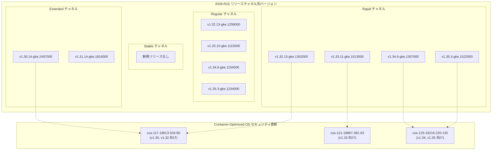

# Google Kubernetes Engine: クラスタバージョン更新 (2026-R16)

**リリース日**: 2026-04-22

**サービス**: Google Kubernetes Engine (GKE)

**機能**: GKE クラスタバージョン更新 (2026-R16)

**ステータス**: GA (一般提供)

[このアップデートのインフォグラフィックを見る](https://takech9203.github.io/google-cloud-news-summary/20260422-gke-version-updates-2026-r16.html)

## 概要

Google Kubernetes Engine (GKE) のクラスタバージョンが 2026-R16 リリースとして更新されました。Rapid、Regular、Extended の各リリースチャネルに新しいバージョンが追加され、新規クラスタの作成および既存クラスタのコントロールプレーン・ノードの手動アップグレードに利用可能になっています。今回の更新では Kubernetes 1.30 から 1.35 までの複数のマイナーバージョンにわたるパッチバージョンが提供されています。

加えて、本リリースにはセキュリティアップデートが含まれており、Container-Optimized OS イメージが更新されています。前回の GKE リリース以降にリリースされた Container-Optimized OS のセキュリティ修正が累積的に適用されており、各 GKE バージョンに対応する Container-Optimized OS イメージが提供されています。

本アップデートは GKE を使用するすべてのユーザーに関連し、特にクラスタのバージョン管理やセキュリティパッチの適用を計画している運用チームにとって重要な情報です。Stable チャネルについては、今回の 2026-R16 リリースでは新規バージョンの追加はありません。

**アップデート前の課題**

- 前回のリリース (2026-R15) 以降に発見されたセキュリティ脆弱性に対するパッチが未適用の状態で、Container-Optimized OS イメージが古いままだった
- Rapid チャネルや Regular チャネルで利用可能な最新パッチバージョンが限られており、最新のバグ修正や改善を適用できなかった
- Extended チャネルの v1.30 系および v1.31 系で、最新のセキュリティ修正を含むパッチバージョンが提供されていなかった

**アップデート後の改善**

- 各リリースチャネルに最新のパッチバージョンが追加され、新規クラスタ作成時および既存クラスタのアップグレード時に選択可能になった
- Container-Optimized OS イメージが最新のセキュリティ修正を含むバージョンに更新され、ノードのセキュリティ態勢が強化された
- Extended チャネルで v1.30.14 および v1.31.14 の新パッチバージョンが利用可能になり、長期サポートを必要とするクラスタでも最新のセキュリティ修正を適用可能になった

## アーキテクチャ図



GKE 2026-R16 リリースにおけるチャネル別バージョン構成と、各バージョンに対応する Container-Optimized OS セキュリティイメージの関係を示しています。

## サービスアップデートの詳細

### 主要機能

1. **Rapid チャネルのバージョン更新**
   - Kubernetes 1.32 から 1.35 までの 4 つのマイナーバージョンで最新パッチが利用可能
   - v1.35.3-gke.1522000 が Rapid チャネルで提供される最新バージョン
   - Rapid チャネルは最も早く新しいバージョンにアクセスできるが、GKE SLA の対象外であり、本番環境前のテスト用途が推奨される
   - ロールアウトはリリースノート公開日から開始されるが、すべての Google Cloud ゾーンへの展開には数日を要する場合がある

2. **Regular チャネルのバージョン更新**
   - v1.32.13-gke.1258000、v1.33.10-gke.1115000、v1.34.6-gke.1154000、v1.35.3-gke.1234000 が利用可能
   - Regular チャネルはデフォルトのリリースチャネルであり、機能の新しさと安定性のバランスが取れた選択肢
   - Rapid チャネルでの検証期間を経た後に Regular チャネルに昇格するため、より成熟したバージョンが提供される

3. **Extended チャネルのバージョン更新**
   - v1.30.14-gke.2407000 および v1.31.14-gke.1816000 が利用可能
   - Extended チャネルは最大 24 か月の長期サポートを提供し、マイナーバージョンのアップグレードを遅延させたいユーザー向け
   - 標準サポート期間終了後も、セキュリティ修正を含むパッチバージョンが Extended チャネルで引き続き提供される

4. **Container-Optimized OS セキュリティ更新**
   - 各 GKE バージョンに対応する Container-Optimized OS イメージが更新され、累積的なセキュリティ修正が適用
   - v1.30 および v1.32 系には cos-117-18613-534-80 が適用
   - v1.33 系には cos-121-18867-381-63 が適用
   - v1.34 および v1.35 系には cos-125-19216-220-130 が適用

## 技術仕様

### チャネル別バージョン一覧

| チャネル | Kubernetes バージョン | GKE パッチバージョン |
|----------|----------------------|---------------------|
| Rapid | 1.32.13 | 1.32.13-gke.1362000 |
| Rapid | 1.33.11 | 1.33.11-gke.1013000 |
| Rapid | 1.34.6 | 1.34.6-gke.1307000 |
| Rapid | 1.35.3 | 1.35.3-gke.1522000 |
| Regular | 1.32.13 | 1.32.13-gke.1258000 |
| Regular | 1.33.10 | 1.33.10-gke.1115000 |
| Regular | 1.34.6 | 1.34.6-gke.1154000 |
| Regular | 1.35.3 | 1.35.3-gke.1234000 |
| Extended | 1.30.14 | 1.30.14-gke.2407000 |
| Extended | 1.31.14 | 1.31.14-gke.1816000 |

### Container-Optimized OS バージョン対応表

| GKE バージョン | Container-Optimized OS バージョン |
|---------------|--------------------------------|
| 1.30.14-gke.2407000 | cos-117-18613-534-80 |
| 1.32.13-gke.1362000 | cos-117-18613-534-80 |
| 1.33.11-gke.1013000 | cos-121-18867-381-63 |
| 1.34.6-gke.1307000 | cos-125-19216-220-130 |
| 1.35.3-gke.1522000 | cos-125-19216-220-130 |

### リリースチャネルの特性比較

| チャネル | マイナーバージョン利用可能時期 | 自動アップグレード対象時期 | 推奨用途 |
|----------|---------------------------|-------------------------|---------|
| Rapid | upstream GA 後 1-2 週間 | Rapid リリース後 1-2 か月 | プリプロダクション環境での最新版テスト |
| Regular (デフォルト) | Rapid リリース後約 2 か月 | Regular リリース後約 3 か月 | 新しさと安定性のバランスを求める多くのユーザー |
| Stable | Regular リリース後 3-4 か月 | Stable リリース後約 2 か月 | 安定性を最優先する本番環境 |
| Extended | Regular チャネルと同期 | Regular チャネルと同期 | 長期サポートが必要なクラスタ |

## 設定方法

### 前提条件

1. Google Cloud プロジェクトが作成済みであること
2. `gcloud` CLI がインストール・認証済みであること
3. GKE API が有効化されていること

### 手順

#### ステップ 1: 利用可能なバージョンの確認

```bash
# 特定のリリースチャネルで利用可能なバージョンを確認
gcloud container get-server-config \
  --location=LOCATION \
  --flatten="channels" \
  --filter="channels.channel=RAPID" \
  --format="yaml(channels.channel,channels.validVersions)"
```

リリースチャネル名を `RAPID`、`REGULAR`、`STABLE`、`EXTENDED` に変更することで、各チャネルの利用可能バージョンを確認できます。

#### ステップ 2: コントロールプレーンのアップグレード

```bash
# コントロールプレーンを指定バージョンにアップグレード
gcloud container clusters upgrade CLUSTER_NAME \
  --location=LOCATION \
  --master \
  --cluster-version=1.35.3-gke.1522000
```

コントロールプレーンのアップグレードは先にノードのアップグレードよりも前に行う必要があります。`--cluster-version` に目的のバージョンを指定してください。

#### ステップ 3: ノードプールのアップグレード

```bash
# ノードプールを指定バージョンにアップグレード
gcloud container clusters upgrade CLUSTER_NAME \
  --location=LOCATION \
  --node-pool=NODE_POOL_NAME \
  --cluster-version=1.35.3-gke.1522000
```

ノードプールのバージョンはコントロールプレーンと同じバージョンか、コントロールプレーンより 2 マイナーバージョンまで古いバージョンを指定できます (バージョンスキューポリシー)。

#### ステップ 4: リリースチャネルの変更 (任意)

```bash
# 既存クラスタのリリースチャネルを変更
gcloud container clusters update CLUSTER_NAME \
  --location=LOCATION \
  --release-channel=CHANNEL
```

`CHANNEL` には `rapid`、`regular`、`stable`、`extended` のいずれかを指定します。チャネル変更により、自動アップグレードの頻度やバージョンの成熟度が変わります。

## メリット

### ビジネス面

- **セキュリティ態勢の向上**: Container-Optimized OS の累積的なセキュリティ修正が含まれており、既知の脆弱性に対する保護が強化される。コンプライアンス要件への対応にも寄与する
- **運用の柔軟性**: Rapid から Extended まで 4 つのリリースチャネルが提供されており、組織のリスク許容度やアップグレード戦略に合わせた選択が可能

### 技術面

- **幅広いバージョンカバレッジ**: Kubernetes 1.30 から 1.35 まで 6 つのマイナーバージョンをカバーしており、段階的なアップグレードパスを計画しやすい
- **Container-Optimized OS の最新化**: 各マイナーバージョンに対応した Container-Optimized OS イメージが提供され、ノードの OS レベルでのセキュリティが自動的に強化される

## デメリット・制約事項

### 制限事項

- ロールアウトはリリースノート公開日に開始されるが、すべての Google Cloud ゾーンへの展開が完了するまでに数日を要するため、即座にすべてのゾーンで利用可能になるわけではない
- Stable チャネルでは今回の 2026-R16 リリースで新規バージョンが追加されていないため、Stable チャネルのユーザーは前回のリリースのバージョンを引き続き使用する
- Extended チャネルの v1.30 系および v1.31 系は標準サポート期間を超えており、セキュリティ修正のみが提供される (新機能やバグ修正は含まれない)

### 考慮すべき点

- コントロールプレーンとノード間のバージョンスキューポリシー (ノードはコントロールプレーンの 2 マイナーバージョン前まで) を遵守する必要がある
- 自動アップグレードが有効なクラスタでは、メンテナンスウィンドウやメンテナンス除外を適切に設定し、計画外のアップグレードを防止することが推奨される
- Extended チャネルで Container-Optimized OS のマイルストーンが変更される場合、ノードの自動アップグレードが一時停止される可能性があるため、手動での対応が必要になることがある

## ユースケース

### ユースケース 1: 本番環境のセキュリティパッチ適用

**シナリオ**: Regular チャネルに登録された本番 GKE クラスタ (v1.34.5) を運用しており、最新のセキュリティ修正を適用したい。

**実装例**:
```bash
# 現在のクラスタバージョンを確認
gcloud container clusters describe my-prod-cluster \
  --location=us-central1 \
  --format="value(currentMasterVersion)"

# コントロールプレーンを最新パッチにアップグレード
gcloud container clusters upgrade my-prod-cluster \
  --location=us-central1 \
  --master \
  --cluster-version=1.34.6-gke.1154000

# ノードプールをアップグレード
gcloud container clusters upgrade my-prod-cluster \
  --location=us-central1 \
  --node-pool=default-pool \
  --cluster-version=1.34.6-gke.1154000
```

**効果**: Container-Optimized OS イメージ cos-125-19216-220-130 に更新され、累積的なセキュリティ修正が適用される。ダウンタイムを最小限に抑えるため、ノードプールのサージアップグレード設定を事前に確認することが推奨される。

### ユースケース 2: Extended チャネルでの長期運用

**シナリオ**: 規制要件によりメジャーバージョンアップを頻繁に行えない金融系ワークロードで、v1.31 系を長期間運用しつつセキュリティを維持したい。

**実装例**:
```bash
# Extended チャネルに変更
gcloud container clusters update my-finance-cluster \
  --location=asia-northeast1 \
  --release-channel=extended

# Extended チャネルの最新パッチにアップグレード
gcloud container clusters upgrade my-finance-cluster \
  --location=asia-northeast1 \
  --master \
  --cluster-version=1.31.14-gke.1816000
```

**効果**: Extended チャネルにより v1.31 系の長期サポート (最大 24 か月) を受けながら、最新のセキュリティ修正が適用された状態を維持できる。マイナーバージョンの自動アップグレードは同一マイナーバージョン内のパッチアップグレードに限定される。

## 料金

GKE のバージョン更新自体に追加料金は発生しません。GKE クラスタの料金はクラスタ管理費用およびノードのコンピュートリソースに基づきます。Extended チャネルの利用には追加費用がかかります。

料金の詳細は [GKE の料金ページ](https://cloud.google.com/kubernetes-engine/pricing) を確認してください。

| 項目 | 料金 |
|------|------|
| GKE クラスタ管理費 (Autopilot / Standard) | [料金ページ参照](https://cloud.google.com/kubernetes-engine/pricing) |
| Extended チャネル追加費用 | クラスタあたりの追加料金が適用 |
| ノードのコンピュートリソース | Compute Engine の料金に準拠 |

## 利用可能リージョン

GKE バージョン更新はすべての Google Cloud リージョンおよびゾーンに対してロールアウトされます。ただし、ロールアウトはリリースノート公開日から段階的に行われ、すべてのゾーンで利用可能になるまでに数日かかる場合があります。

利用可能なリージョンの最新情報は [GKE のロケーション一覧](https://cloud.google.com/kubernetes-engine/docs/concepts/types-of-clusters#available) を確認してください。

## 関連サービス・機能

- **Container-Optimized OS**: GKE ノードのデフォルト OS イメージ。今回のリリースでセキュリティ修正を含む新しいイメージが各バージョンに対応して提供されている
- **GKE リリースチャネル**: クラスタのアップグレード頻度と安定性レベルを制御する仕組み。Rapid、Regular、Stable、Extended の 4 チャネルが提供される
- **GKE バージョニングとサポート**: GKE のマイナーバージョンは最大 14 か月の標準サポートと、Extended チャネルでの追加 10 か月の延長サポートを含む最大 24 か月のサポートが提供される
- **メンテナンスウィンドウと除外**: 自動アップグレードのタイミングを制御し、計画外のアップグレードを防止するための設定機能

## 参考リンク

- [インフォグラフィック](https://takech9203.github.io/google-cloud-news-summary/20260422-gke-version-updates-2026-r16.html)
- [公式リリースノート](https://cloud.google.com/release-notes#April_22_2026)
- [GKE バージョニングとサポート](https://cloud.google.com/kubernetes-engine/versioning)
- [GKE クラスタのアップグレードについて](https://cloud.google.com/kubernetes-engine/upgrades)
- [GKE リリースチャネルの概要](https://cloud.google.com/kubernetes-engine/docs/concepts/release-channels)
- [GKE リリーススケジュール](https://cloud.google.com/kubernetes-engine/docs/release-schedule)
- [Container-Optimized OS リリースノート (M117)](https://cloud.google.com/container-optimized-os/docs/release-notes/m117)
- [Container-Optimized OS リリースノート (M121)](https://cloud.google.com/container-optimized-os/docs/release-notes/m121)
- [Container-Optimized OS リリースノート (M125)](https://cloud.google.com/container-optimized-os/docs/release-notes/m125)
- [GKE の料金](https://cloud.google.com/kubernetes-engine/pricing)

## まとめ

GKE 2026-R16 リリースでは、Rapid、Regular、Extended チャネルに Kubernetes 1.30 から 1.35 までの最新パッチバージョンが追加され、Container-Optimized OS のセキュリティ更新が含まれています。GKE クラスタを運用している組織は、各クラスタのリリースチャネルに応じた最新バージョンへのアップグレードを計画し、特に累積的なセキュリティ修正を速やかに適用することを推奨します。自動アップグレードを活用しつつ、メンテナンスウィンドウを適切に構成することで、計画的かつ安全なバージョン管理が実現できます。

---

**タグ**: #GKE #Kubernetes #バージョン更新 #2026R16 #リリースチャネル #ContainerOptimizedOS #セキュリティアップデート #Rapid #Regular #Extended #GA
