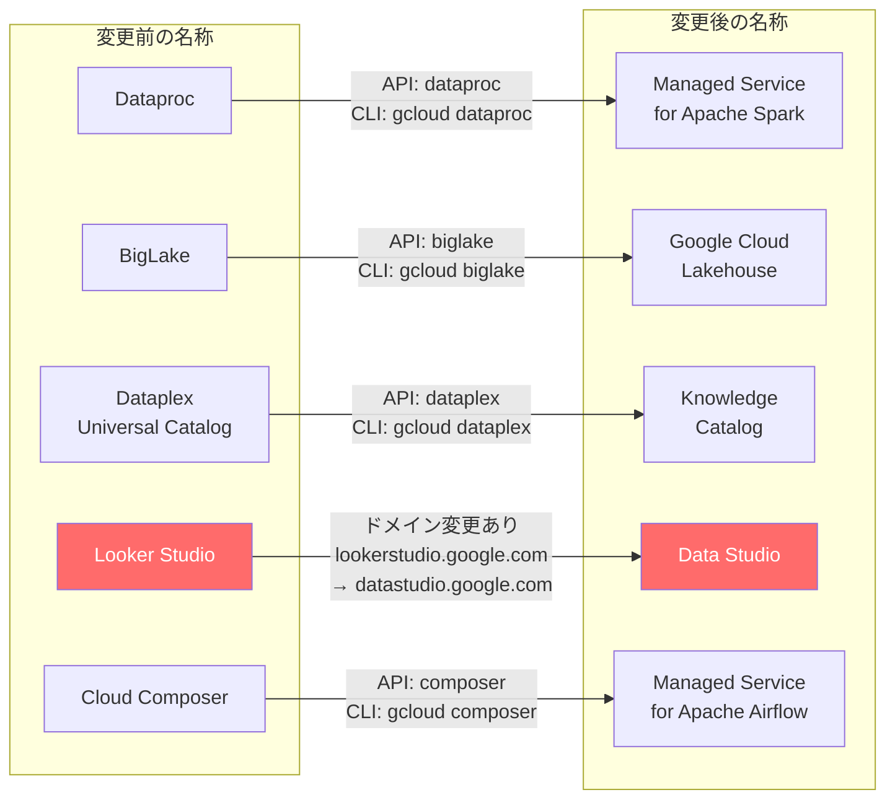

# Google Cloud: 主要プロダクトのリブランディング (5 製品一斉名称変更)

**リリース日**: 2026-04-22

**サービス**: Dataproc, BigLake, Dataplex Universal Catalog, Looker Studio, Cloud Composer

**機能**: プロダクト名称変更 (リブランディング)

**ステータス**: 発表済み

📊 [このアップデートのインフォグラフィックを見る](https://takech9203.github.io/google-cloud-news-summary/20260422-google-cloud-product-rebranding.html)

## 概要

Google Cloud は 2026 年 4 月 22 日、データ分析およびデータエンジニアリング領域の主要 5 プロダクトについて一斉にリブランディングを実施した。対象は Dataproc、BigLake、Dataplex Universal Catalog、Looker Studio、Cloud Composer の 5 製品であり、それぞれ「Managed Service for Apache Spark」「Google Cloud Lakehouse」「Knowledge Catalog」「Data Studio」「Managed Service for Apache Airflow」へと名称が変更される。

今回のリブランディングは、Google Cloud がオープンソースエコシステムへのコミットメントを強化し、各プロダクトの機能と役割をより直感的に伝えることを目的としている。特にデータ処理基盤 (Spark, Airflow) については「Managed Service for Apache XXX」という統一的な命名規則を採用し、マネージドサービスとしての価値提案を明確にしている。また、データガバナンス領域では AI 駆動のコンテキストグラフを中核機能とする「Knowledge Catalog」へと進化し、BI ツールでは Looker Studio が元の「Data Studio」ブランドに回帰した。

大半のリブランディングでは API、CLI、IAM リソース名に変更はないが、**Looker Studio から Data Studio への変更ではドメインが lookerstudio.google.com から datastudio.google.com に変更される**点が運用上の重要なアクションポイントとなる。プロキシを使用して外部サイトへのアクセスを制限している組織では、IT 管理者による ACL の更新が必要である。

**アップデート前の課題**

- プロダクト名がその機能や採用しているオープンソース技術を直感的に示していなかった
- 「Dataproc」「Cloud Composer」などの固有名詞では、Apache Spark や Apache Airflow のマネージドサービスであることが即座に理解しづらかった
- 「BigLake」という名称では、レイクハウスアーキテクチャにおける役割が十分に伝わらなかった
- 「Dataplex Universal Catalog」は、AI 駆動のナレッジグラフ機能を反映していなかった
- Looker Studio は Looker ブランドとの混同が生じる場合があった

**アップデート後の改善**

- Apache Spark / Apache Airflow のマネージドサービスであることが名前から明確に理解できるようになった
- 「Google Cloud Lakehouse」という名称により、オープンデータレイクハウスとしての位置づけが明確になった
- 「Knowledge Catalog」により、AI 駆動のデータガバナンスとコンテキスト管理の役割が名称に反映された
- 「Data Studio」への回帰により、セルフサービス BI ツールとしてのブランドが再確立された
- Google Cloud のデータ分析ポートフォリオ全体の一貫性と分かりやすさが向上した

## アーキテクチャ図



5 つのプロダクトの旧名称から新名称へのマッピングを示す。Looker Studio から Data Studio への変更のみドメイン変更を伴う (赤色で強調)。他の 4 プロダクトでは API/CLI 名は従来のまま維持される。

## サービスアップデートの詳細

### 主要機能

1. **Dataproc → Managed Service for Apache Spark**
   - Dataproc on Compute Engine (クラスタデプロイメント) と Google Cloud Serverless for Apache Spark (サーバーレスデプロイメント) を「Managed Service for Apache Spark」ブランドに統合
   - クラスタモードとサーバーレスモードの 2 つのデプロイメントオプションは引き続き利用可能
   - API 名 (`dataproc`)、クライアントライブラリ、`gcloud dataproc` コマンド、IAM リソース名は変更なし
   - 既存のワークロード、設定、スクリプトへの影響なし

2. **BigLake → Google Cloud Lakehouse**
   - BigLake は「Google Cloud Lakehouse」に名称変更
   - BigLake metastore は「Lakehouse runtime catalog」に名称変更
   - Apache Iceberg オープンテーブルフォーマットとの統合を中核とするオープンデータレイクハウスとしての位置づけを明確化
   - API エンドポイント (`biglake.googleapis.com`)、`gcloud biglake` コマンド、クライアントライブラリは変更なし
   - Lakehouse runtime catalog は Apache Iceberg REST catalog エンドポイントとカスタム Apache Iceberg catalog for BigQuery エンドポイントの 2 つのインターフェースを提供

3. **Dataplex Universal Catalog → Knowledge Catalog**
   - Gemini を活用した AI 駆動のデータカタログとして再定義
   - 従来のパッシブなメタデータレジストリから、アクティブな AI パワードコンテキストグラフへの進化を反映
   - AI エージェントがエンタープライズデータの正確なコンテキストを取得するための基盤
   - 自動コンテキストキュレーション、検証済みサンプルクエリ、Model Context Protocol (MCP) 統合などの新機能を反映した名称
   - API (`dataplex`)、`gcloud dataplex` コマンド、クライアントライブラリ、IAM 名は変更なし
   - 既存のデプロイメント、メタデータ、アスペクト、構成はそのまま移行

4. **Looker Studio → Data Studio (ドメイン変更あり)**
   - プロダクト URL が `lookerstudio.google.com` から `datastudio.google.com` に変更
   - 自動リダイレクトが設定されており、旧 URL は新ドメインに自動転送される
   - レポートの更新は不要
   - **重要**: プロキシを使用して外部サイトへのアクセスを制限している組織では、IT 管理者が新ドメイン `datastudio.google.com` を ACL に追加する必要あり
   - Gemini in Looker は「Gemini in Data Studio」に名称変更
   - Data Studio ホームページからは Data Studio レポート・データソース、BigQuery 会話型エージェント、Colab ノートブックで構築したデータアプリにアクセス可能

5. **Cloud Composer → Managed Service for Apache Airflow**
   - Apache Airflow のマネージドサービスであることを名称で明示
   - Airflow 3 の GA リリースと合わせたブランディング強化
   - Cloud Composer MCP サーバーによる AI アプリケーション連携 (Gemini CLI、ChatGPT、Claude 等) もサポート
   - API (`composer`)、`gcloud composer` コマンド、クライアントライブラリ、IAM リソース名は変更なし

## 技術仕様

### 名称変更対照表

| 旧名称 | 新名称 | API/CLI 名の変更 | ドメイン変更 |
|--------|--------|-----------------|------------|
| Dataproc | Managed Service for Apache Spark | なし (`dataproc`) | なし |
| BigLake | Google Cloud Lakehouse | なし (`biglake`) | なし |
| BigLake metastore | Lakehouse runtime catalog | なし | なし |
| Dataplex Universal Catalog | Knowledge Catalog | なし (`dataplex`) | なし |
| Looker Studio | Data Studio | なし | **あり** (`lookerstudio.google.com` → `datastudio.google.com`) |
| Gemini in Looker | Gemini in Data Studio | なし | なし |
| Cloud Composer | Managed Service for Apache Airflow | なし (`composer`) | なし |

### Looker Studio → Data Studio ドメイン変更の詳細

| 項目 | 詳細 |
|------|------|
| 旧ドメイン | `lookerstudio.google.com` |
| 新ドメイン | `datastudio.google.com` |
| 自動リダイレクト | あり (旧ドメインから新ドメインへ自動転送) |
| レポート更新の必要性 | なし |
| IT 管理者のアクション | プロキシ使用時、新ドメインを ACL に追加 |

## 設定方法

### Looker Studio → Data Studio ドメイン変更への対応

#### 前提条件

1. 組織でプロキシサーバーまたはファイアウォールを使用して外部サイトへのアクセスを制限している
2. IT 管理者権限を持っている

#### ステップ 1: 新ドメインの ACL 追加

```
# プロキシの ACL に新ドメインを追加
datastudio.google.com
```

組織のプロキシ設定またはファイアウォールルールに `datastudio.google.com` を許可リストとして追加する。

#### ステップ 2: リダイレクトの確認

```bash
# 旧ドメインからのリダイレクトを確認
curl -I https://lookerstudio.google.com
# Location ヘッダーに https://datastudio.google.com が含まれることを確認
```

旧ドメインから新ドメインへの自動リダイレクトが正常に動作していることを確認する。

#### ステップ 3: ブックマークの更新 (推奨)

ユーザーに新しい URL `https://datastudio.google.com` でのブックマーク更新を案内する。自動リダイレクトにより旧 URL も引き続き利用可能だが、新ドメインの直接利用を推奨する。

### その他の製品 (Dataproc, BigLake, Dataplex, Cloud Composer)

```bash
# 既存のコマンドはそのまま利用可能

# Managed Service for Apache Spark (旧 Dataproc)
gcloud dataproc clusters list

# Google Cloud Lakehouse (旧 BigLake)
gcloud biglake catalogs list --project=PROJECT_ID --location=LOCATION

# Knowledge Catalog (旧 Dataplex Universal Catalog)
gcloud dataplex lakes list --project=PROJECT_ID --location=LOCATION

# Managed Service for Apache Airflow (旧 Cloud Composer)
gcloud composer environments list --locations=LOCATION
```

これらのプロダクトでは API、CLI、IAM 名に変更がないため、既存のスクリプト、Terraform 構成、CI/CD パイプラインの変更は不要。

## メリット

### ビジネス面

- **ブランド認知の向上**: Apache Spark / Apache Airflow のマネージドサービスであることが名前から即座に理解でき、新規顧客の獲得に寄与する
- **ポートフォリオの明確化**: Google Cloud のデータ分析製品群の役割分担が名称から直感的に理解できるようになった
- **オープンソースコミットメントの強化**: 「Managed Service for Apache XXX」という命名により、Google Cloud がオープンソースエコシステムを支持していることが明確に伝わる

### 技術面

- **既存環境への影響最小化**: 大半のプロダクトで API、CLI、IAM 名の変更がなく、既存のインフラストラクチャコードやスクリプトへの影響は最小限
- **統一されたレイクハウスアーキテクチャ**: Google Cloud Lakehouse (旧 BigLake) と Knowledge Catalog (旧 Dataplex Universal Catalog) の組み合わせにより、オープンデータレイクハウスの概念がより一貫して表現される
- **AI 統合の明示化**: Knowledge Catalog の名称は AI 駆動のコンテキストグラフ機能を反映しており、Gemini との統合方向性が明確

## デメリット・制約事項

### 制限事項

- Looker Studio → Data Studio のドメイン変更では、プロキシを使用している組織で ACL の更新が必須
- API/CLI 名は旧名称のままであるため、ドキュメントやコード内で名称の不一致が生じる可能性がある (例: `gcloud dataproc` コマンドで「Managed Service for Apache Spark」を操作)
- 社内ドキュメントやトレーニング資料の更新が必要になる

### 考慮すべき点

- **ドメイン変更の即時対応**: Looker Studio を利用している組織では、IT 管理者が速やかに新ドメイン `datastudio.google.com` をプロキシの許可リストに追加する必要がある。対応が遅れると、自動リダイレクト後にユーザーがアクセスできなくなる可能性がある
- **名称の過渡期における混乱**: 旧名称と新名称が混在する期間が発生し、コミュニケーション上の混乱が生じる可能性がある
- **サードパーティツールとの互換性**: サードパーティの統合ツールやモニタリングダッシュボードでプロダクト名を参照している場合、表示名の不一致が生じる可能性がある

## ユースケース

### ユースケース 1: データ分析レイクハウスアーキテクチャの構築

**シナリオ**: エンタープライズ組織がオープンデータレイクハウスを構築する場合、リブランディング後の製品ポートフォリオにより役割分担が明確になる。

**実装例**:
```
データ取り込み → Cloud Storage
      ↓
メタデータ管理 → Google Cloud Lakehouse (旧 BigLake)
      ↓
データガバナンス → Knowledge Catalog (旧 Dataplex Universal Catalog)
      ↓
データ処理 → Managed Service for Apache Spark (旧 Dataproc)
      ↓
ワークフロー管理 → Managed Service for Apache Airflow (旧 Cloud Composer)
      ↓
可視化 → Data Studio (旧 Looker Studio) + BigQuery
```

**効果**: 各レイヤーのプロダクト名が機能を直接反映しているため、アーキテクチャ設計時の製品選定が容易になる。

### ユースケース 2: IT 管理者のプロキシ設定更新

**シナリオ**: 企業の IT 管理者が Looker Studio → Data Studio のドメイン変更に対応する。プロキシで外部アクセスを制限している環境で、ユーザーのアクセスが途切れないよう事前に設定変更を行う。

**効果**: 新ドメインを事前に ACL に追加することで、自動リダイレクト後もユーザーが中断なく Data Studio にアクセスできる。

## 関連サービス・機能

- **BigQuery**: Google Cloud Lakehouse と密接に統合されたデータウェアハウス。Lakehouse runtime catalog を通じて Apache Iceberg テーブルに直接アクセス可能
- **Cloud Storage**: Google Cloud Lakehouse のストレージレイヤーとして機能し、Apache Iceberg データの保存先
- **Managed Service for Apache Spark (旧 Dataproc)**: Google Cloud Lakehouse と連携し、大規模データ処理を実行。Lakehouse runtime catalog の Apache Iceberg REST catalog エンドポイントを利用可能
- **Knowledge Catalog (旧 Dataplex Universal Catalog)**: Google Cloud Lakehouse と統合され、統一的なデータガバナンス、リネージ、データ品質チェックを提供
- **Dataflow**: リアルタイムストリーミングおよびバッチデータ処理パイプライン。Google Cloud Lakehouse への Apache Iceberg テーブルのインジェストにも対応
- **Gemini**: Knowledge Catalog の AI 駆動コンテキストグラフの基盤であり、Data Studio (旧 Looker Studio) の AI アシスタント機能も提供

## 参考リンク

- 📊 [インフォグラフィック](https://takech9203.github.io/google-cloud-news-summary/20260422-google-cloud-product-rebranding.html)
- [公式リリースノート](https://docs.cloud.google.com/release-notes#April_22_2026)
- [Managed Service for Apache Spark ドキュメント](https://docs.cloud.google.com/dataproc/docs/concepts/overview)
- [Google Cloud Lakehouse ドキュメント](https://docs.cloud.google.com/lakehouse/docs/introduction)
- [Knowledge Catalog ドキュメント](https://docs.cloud.google.com/dataplex/docs/introduction)
- [Data Studio ドキュメント](https://docs.cloud.google.com/data-studio/welcome)
- [Managed Service for Apache Airflow ドキュメント](https://docs.cloud.google.com/composer/docs)
- [Managed Service for Apache Spark リリースノート](https://docs.cloud.google.com/dataproc/docs/release-notes)
- [Google Cloud Lakehouse リリースノート](https://docs.cloud.google.com/lakehouse/docs/release-notes)
- [Knowledge Catalog リリースノート](https://docs.cloud.google.com/dataplex/docs/release-notes)
- [Data Studio リリースノート](https://docs.cloud.google.com/data-studio/release-notes)
- [Managed Service for Apache Airflow リリースノート](https://docs.cloud.google.com/composer/docs/release-notes)

## まとめ

今回の一斉リブランディングは、Google Cloud のデータ分析ポートフォリオ全体の明確化とオープンソースへのコミットメント強化を目的としたものである。既存の API/CLI 名が維持されるため、大半の環境では技術的な対応は不要だが、**Looker Studio → Data Studio のドメイン変更 (`lookerstudio.google.com` → `datastudio.google.com`) については、プロキシを使用している組織で IT 管理者による ACL の更新が必須**である。速やかに新ドメインの許可リスト追加を行い、社内ドキュメントやトレーニング資料の名称更新を計画的に進めることを推奨する。

---

**タグ**: #GoogleCloud #Rebranding #ManagedServiceForApacheSpark #GoogleCloudLakehouse #KnowledgeCatalog #DataStudio #ManagedServiceForApacheAirflow #Dataproc #BigLake #Dataplex #LookerStudio #CloudComposer
