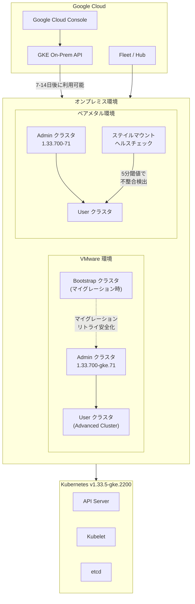

# Google Distributed Cloud (software only): バージョン 1.33.700 リリース (VMware / ベアメタル)

**リリース日**: 2026-04-22

**サービス**: Google Distributed Cloud (software only) for VMware and bare metal

**機能**: バージョン 1.33.700 パッチリリース (脆弱性修正、Advanced Cluster マイグレーション改善、バグ修正)

**ステータス**: GA (一般提供)

[このアップデートのインフォグラフィックを見る](https://takech9203.github.io/google-cloud-news-summary/20260422-google-distributed-cloud-1-33-700.html)

## 概要

Google Distributed Cloud (software only) のバージョン 1.33.700 が VMware 向け (1.33.700-gke.71) およびベアメタル向け (1.33.700-71) の両方でリリースされた。いずれも Kubernetes v1.33.5-gke.2200 をベースとしている。

VMware 版では、非 Advanced クラスタから Advanced クラスタへのマイグレーションの安定性向上が主要なテーマとなっている。マイグレーションの途中で失敗した場合のリトライが安全に行えるようになり、手動でのクリーンアップが不要になった。加えて、複数の重要なバグ修正が含まれており、node-problem-detector の誤配置による containerd の再起動問題、ノードプールラベルの不整合、Hub メンバーシップの不変フィールド更新によるアップグレード停止問題が解消されている。

ベアメタル版では、Secret や ConfigMap のマウントが古くなる「ステイル」状態を検知する新しいヘルスチェック機能が追加された。さらに、ノードアップグレード時のタイムアウト問題、etcd-events のデータディレクトリ問題、同時タスク実行時の containerd 再起動問題、TLS 証明書ローテーション時の Metrics API エラーなど、複数の重要な修正が含まれている。

**アップデート前の課題**

- VMware 版で非 Advanced クラスタから Advanced クラスタへのマイグレーションが途中で失敗した場合、手動でリソースのクリーンアップが必要だった
- VMware 版で node-problem-detector が非 Advanced クラスタに誤って配置され、containerd が繰り返し再起動し、ETCD/CRI 障害やアップグレード失敗の原因となっていた
- VMware 版で Advanced ユーザークラスタのノードプールラベルに予期しない `-np` サフィックスが付与され、Apigee などのワークロードの Pod スケジューリングが失敗していた
- ベアメタル版で同一ノード上の並行タスクが containerd の再起動により失敗することがあった
- ベアメタル版で Kubelet のローカルキャッシュが API サーバーと同期しなくなり、Secret や ConfigMap のマウントが古い状態のまま残ることがあった

**アップデート後の改善**

- VMware 版の Advanced クラスタマイグレーションの信頼性が大幅に向上し、失敗時に安全にリトライ可能になった
- VMware 版の node-problem-detector が非 Advanced クラスタに配置されなくなり、containerd の安定性が回復した
- VMware 版のノードプールラベル問題が修正され、nodeSelector を使用する Pod が正常にスケジュールされるようになった
- ベアメタル版にステイルマウント検知のヘルスチェックが追加され、構成データの不整合を早期に検出できるようになった
- ベアメタル版でノード上のタスクが逐次ロックで安全に実行されるようになり、並行タスクによる障害が解消された

## アーキテクチャ図



Google Distributed Cloud 1.33.700 は VMware とベアメタルの両環境で動作し、Kubernetes v1.33.5-gke.2200 をベースとしている。GKE On-Prem API を通じて Google Cloud コンソール、gcloud CLI、Terraform と連携する。

## サービスアップデートの詳細

### VMware 版 (1.33.700-gke.71) の主要機能・修正

1. **Advanced クラスタマイグレーションのリトライ改善 (新機能)**
   - 通常クラスタから Advanced クラスタへのマイグレーションが失敗または中断された場合、手動クリーンアップなしで安全にリトライできるようになった
   - システムが既存のリソースと一時的な Bootstrap クラスタを自動的に再利用する
   - 重要: マイグレーション失敗時に Bootstrap クラスタを削除してはならない。削除するとデータ損失やリカバリ不能になる可能性がある

2. **Hub メンバーシップのアップグレード停止問題の修正**
   - 非 Advanced クラスタから Advanced クラスタへのアップグレード時に、Hub メンバーシップの不変フィールドを更新しようとしてアップグレードが停止する問題を解決
   - クラスタオペレーターがアップグレードプロセス中に元のメンバーシップフィールドを保持するようになった

3. **ノードプールラベルの `-np` サフィックス問題の修正**
   - Advanced ユーザークラスタで `cloud.google.com/gke-nodepool` ラベルに予期しない `-np` サフィックスが付与される問題を修正
   - Apigee ワークロードなど、元のプール名を nodeSelector でターゲットする Pod が正常にスケジュールされるようになった

4. **node-problem-detector の誤配置修正**
   - 非 Advanced VMware クラスタに node-problem-detector が誤って配置され、互換性のないヘルスチェック設定により containerd が繰り返し再起動する問題を修正
   - ETCD/CRI 障害 (`/run/containerd/containerd.sock` への接続エラーなど) およびクラスタアップグレードの失敗が解消された

5. **stackdriver.enableVPC フィールドのブロック問題修正**
   - 廃止予定の `stackdriver.enableVPC` フィールドが `true` に設定されている場合、Advanced クラスタへのアップグレードがブロックされる問題を修正
   - このフィールドの設定がアップグレード検証プロセスで無視されるようになった

6. **脆弱性修正**
   - [Vulnerability fixes](https://docs.cloud.google.com/kubernetes-engine/distributed-cloud/vmware/docs/version-history) に記載された脆弱性が修正された

### ベアメタル版 (1.33.700-71) の主要機能・修正

1. **ステイルマウント検知ヘルスチェック (新機能)**
   - Secret や ConfigMap のマウントが API サーバーと同期していない「ステイル」状態を検知する新しいヘルスチェックが追加された
   - ノード上の全実行中 Pod をイテレーションしてマウントを検証する
   - Kubelet のアトミック更新シンリンク構造内のローカルデータを API サーバーのライブオブジェクトおよび更新タイムスタンプと比較する
   - 通常の伝搬遅延による誤検知を防ぐため、5 分間の閾値が設定されている

2. **並行タスクの逐次ロック実行**
   - 同一ノード上の並行タスクが containerd の再起動により失敗する問題を修正
   - タスクがロックされ、逐次実行されるようになった (各ロックは最大 20 分間または成功/失敗まで保持)
   - 並行実行が必要な場合は `baremetal.cluster.gke.io/concurrent-machine-update: "true"` アノテーションで無効化可能

3. **etcd-events のデータディレクトリ問題の修正**
   - マシン初期化フェーズで etcd-events Pod が古いデータディレクトリを読み込み、古いメンバー ID でクラスタに再参加しようとして無限リトライループに陥る問題を修正
   - 失敗時に `/var/lib/etcd-events` ディレクトリをクリアし、kubeadm-reset にリトライロジックを追加

4. **ノードアップグレードのタイムアウト問題の修正**
   - Terminating 状態のネームスペース内に完了した Pod がある場合、ノードアップグレードが無限にハングする問題を修正
   - ドレインプロセスがターミナルフェーズの Pod に対してエビクションをスキップするよう更新された

5. **Metrics API の TLS 検証エラーの修正**
   - 証明書ローテーション中に `kubectl top`、HPA (Horizontal Pod Autoscaling)、VPA (Vertical Pod Autoscaling) が TLS 検証エラーで失敗する問題を修正
   - CA ローテーション時にリーフ証明書が即座に更新されないことによる一時的な不整合が解消された

6. **脆弱性修正**
   - [Vulnerability fixes](https://docs.cloud.google.com/kubernetes-engine/distributed-cloud/bare-metal/docs/vulnerabilities) に記載された脆弱性が修正された

## 技術仕様

### バージョン情報

| 項目 | VMware 版 | ベアメタル版 |
|------|-----------|-------------|
| リリースバージョン | 1.33.700-gke.71 | 1.33.700-71 |
| Kubernetes バージョン | v1.33.5-gke.2200 | v1.33.5-gke.2200 |
| クラスタタイプ | Advanced Cluster (1.33 以降のデフォルト) | 標準クラスタ |
| GKE On-Prem API 対応 | リリース後 7-14 日 | リリース後 7-14 日 |

### Advanced Cluster への移行に関する要件 (VMware 版)

| 項目 | 詳細 |
|------|------|
| gkectl バージョン | ターゲットクラスタバージョンと同一である必要がある |
| バージョンスキュー | コントロールプレーンとノードプールを同時にアップグレードする必要がある |
| 非 Advanced クラスタの維持 | 1.32 から 1.33 へのアップグレード時のみサポート |
| cert-manager | Advanced クラスタに自動インストールされる (バージョン 1.18) |
| Bootstrap クラスタ | マイグレーション失敗時は削除しないこと |

## 設定方法

### 前提条件

1. 現在のクラスタバージョンが 1.33.x であること (マイナーバージョンアップグレードの場合は 1.32.x も対象)
2. サードパーティストレージベンダーを使用している場合、[Google Distributed Cloud-ready ストレージパートナー](https://docs.cloud.google.com/kubernetes-engine/enterprise/docs/resources/partner-storage)ドキュメントで本リリースの認定状況を確認すること
3. アップグレード前にクラスタの診断を実行すること

### 手順

#### ステップ 1: VMware 版クラスタのアップグレード

```bash
# クラスタの診断を実行
gkectl diagnose cluster --kubeconfig ADMIN_CLUSTER_KUBECONFIG

# OS イメージのインポート
gkectl prepare \
  --bundle-path /var/lib/gke/bundles/gke-onprem-vsphere-1.33.700-gke.71.tgz \
  --kubeconfig ADMIN_CLUSTER_KUBECONFIG

# Admin クラスタのアップグレード
gkectl upgrade admin \
  --kubeconfig ADMIN_CLUSTER_KUBECONFIG \
  --config ADMIN_CLUSTER_CONFIG
```

Admin クラスタのアップグレード完了後、User クラスタをアップグレードする。Admin クラスタバージョンは User クラスタバージョン以上である必要がある。詳細は[クラスタのアップグレード](https://docs.cloud.google.com/kubernetes-engine/distributed-cloud/vmware/docs/how-to/upgrading)を参照。

#### ステップ 2: ベアメタル版クラスタのアップグレード

```bash
# クラスタの診断を実行
bmctl check cluster --cluster CLUSTER_NAME --kubeconfig ADMIN_CLUSTER_KUBECONFIG

# クラスタのアップグレード
bmctl upgrade cluster --cluster CLUSTER_NAME --kubeconfig ADMIN_CLUSTER_KUBECONFIG
```

詳細は[クラスタのアップグレード](https://docs.cloud.google.com/kubernetes-engine/distributed-cloud/bare-metal/docs/how-to/upgrade)を参照。

#### ステップ 3: VMware 版で失敗したマイグレーションのリトライ (該当する場合)

```bash
# 失敗した Admin クラスタのアップグレードをリトライ
# Bootstrap クラスタが存在することを確認してからリトライする
gkectl upgrade admin \
  --kubeconfig ADMIN_CLUSTER_KUBECONFIG \
  --config ADMIN_CLUSTER_CONFIG \
  --reuse-bootstrap-cluster
```

重要: `--reuse-bootstrap-cluster` フラグを使用してリトライすること。Bootstrap クラスタを削除するとデータ損失が発生する可能性がある。

## メリット

### ビジネス面

- **運用リスクの低減**: Advanced クラスタへのマイグレーション失敗時のリカバリが容易になり、計画的なアップグレードの実行リスクが大幅に低下した
- **ダウンタイムの最小化**: node-problem-detector の誤配置によるクラスタ障害やアップグレード失敗が解消され、サービス可用性が向上した
- **オペレーション効率の向上**: ベアメタル版のステイルマウント検知により、構成データの不整合を早期に発見し、アプリケーション障害を未然に防止できるようになった

### 技術面

- **マイグレーションの耐障害性向上**: VMware 版で失敗したマイグレーションのリトライが冪等的に安全に実行できるようになった
- **並行処理の安定性**: ベアメタル版のタスクロック機構により、ノード上の並行操作による containerd の不安定化が防止される
- **証明書ローテーションの信頼性**: TLS 証明書ローテーション時の Metrics API エラーが解消され、HPA/VPA による自動スケーリングの中断が防止された
- **Kubernetes v1.33.5 ベース**: 最新の Kubernetes パッチによるセキュリティ修正と安定性向上の恩恵を受けられる

## デメリット・制約事項

### 制限事項

- リリース後、GKE On-Prem API クライアント (Google Cloud コンソール、gcloud CLI、Terraform) で利用可能になるまで 7 から 14 日かかる
- VMware 版で非 Advanced クラスタから Advanced クラスタへのアップグレードには `gkectl` コマンドラインツールの使用が必須であり、GKE On-Prem API クライアントはサポートされない
- 非 Advanced クラスタの維持は 1.32 から 1.33 へのアップグレード時のみサポートされ、1.33 から 1.34 へのアップグレードでは自動的に Advanced クラスタに変換される
- ベアメタル版のタスクロック機構により、同一ノード上のタスクが逐次実行されるため、大量の並行タスクが必要な環境ではパフォーマンスに影響する可能性がある

### 考慮すべき点

- VMware 版で Advanced クラスタへのマイグレーション時、cert-manager が自動インストールされ、既存の cert-manager を上書きする。カスタム構成がある場合は事前にバックアップが必要
- VMware 版でコントロールプレーンとノードプールのバージョンスキューが許可されないため、非 Advanced から Advanced へのアップグレード時は全コンポーネントを同時にアップグレードする必要がある
- サードパーティストレージベンダーを使用している場合、本リリースの認定通過を事前に確認すること
- ベアメタル版のステイルマウント検知ヘルスチェックは 5 分間の閾値で動作するため、5 分未満の一時的な不整合は検知対象外となる

## ユースケース

### ユースケース 1: VMware 環境での Advanced クラスタへの安全なマイグレーション

**シナリオ**: 大規模な VMware 環境で、多数の非 Advanced クラスタを運用している組織が段階的に Advanced クラスタへ移行する必要がある。過去のバージョンではマイグレーション中のネットワーク障害やリソース不足により失敗した場合、手動でのクリーンアップが必要であり、移行作業が長時間化していた。

**実装例**:
```bash
# 1. Admin クラスタを 1.33.700-gke.71 にアップグレード
gkectl upgrade admin \
  --kubeconfig ADMIN_CLUSTER_KUBECONFIG \
  --config ADMIN_CLUSTER_CONFIG

# 2. 失敗した場合、Bootstrap クラスタを保持したままリトライ
gkectl upgrade admin \
  --kubeconfig ADMIN_CLUSTER_KUBECONFIG \
  --config ADMIN_CLUSTER_CONFIG \
  --reuse-bootstrap-cluster

# 3. User クラスタをアップグレード
gkectl upgrade cluster \
  --kubeconfig ADMIN_CLUSTER_KUBECONFIG \
  --config USER_CLUSTER_CONFIG
```

**効果**: マイグレーション失敗時の復旧時間が大幅に短縮され、移行作業全体のリスクと所要時間が削減される。

### ユースケース 2: ベアメタル環境でのアプリケーション構成データの整合性監視

**シナリオ**: ベアメタルクラスタ上で金融系アプリケーションを運用しており、Secret に保存された API キーや証明書、ConfigMap に保存された設定値が常に最新であることが求められる環境。Kubelet のキャッシュ問題により、Pod がステイル (古い) 構成データを使用し続けるリスクがある。

**効果**: 新しいヘルスチェック機能により、5 分以上の不整合が自動的に検知されるため、ステイルデータによるアプリケーション障害を早期に発見し、迅速に対処できるようになる。

## 料金

Google Distributed Cloud (software only) の料金は、[Google Kubernetes Engine Enterprise エディションの料金](https://cloud.google.com/kubernetes-engine/enterprise/pricing)ページを参照。パッチリリースのアップグレード自体に追加料金は発生しない。

## 関連サービス・機能

- **[GKE Enterprise](https://cloud.google.com/kubernetes-engine/enterprise/docs)**: Google Distributed Cloud は GKE Enterprise の一部として、オンプレミスやエッジ環境での Kubernetes クラスタ管理を提供する
- **[Advanced Clusters](https://docs.cloud.google.com/kubernetes-engine/distributed-cloud/vmware/docs/concepts/advanced-clusters)**: VMware 版 1.33 以降のデフォルトクラスタアーキテクチャ。ベアメタルフレームワークをベースとした統合アーキテクチャを使用
- **[Fleet Management](https://cloud.google.com/kubernetes-engine/fleet-management/docs)**: 複数のクラスタを一元管理するための Google Cloud サービス
- **[GKE On-Prem API](https://docs.cloud.google.com/kubernetes-engine/distributed-cloud/vmware/docs/how-to/cluster-lifecycle-management-tools)**: Google Cloud コンソール、gcloud CLI、Terraform からクラスタのライフサイクルを管理するための API

## 参考リンク

- [このアップデートのインフォグラフィック](https://takech9203.github.io/google-cloud-news-summary/20260422-google-distributed-cloud-1-33-700.html)
- [公式リリースノート](https://cloud.google.com/release-notes#April_22_2026)
- [VMware 版リリースノート](https://docs.cloud.google.com/kubernetes-engine/distributed-cloud/vmware/docs/release-notes)
- [ベアメタル版リリースノート](https://docs.cloud.google.com/kubernetes-engine/distributed-cloud/bare-metal/docs/release-notes)
- [VMware 版クラスタのアップグレード](https://docs.cloud.google.com/kubernetes-engine/distributed-cloud/vmware/docs/how-to/upgrading)
- [ベアメタル版クラスタのアップグレード](https://docs.cloud.google.com/kubernetes-engine/distributed-cloud/bare-metal/docs/how-to/upgrade)
- [Advanced Clusters の概要](https://docs.cloud.google.com/kubernetes-engine/distributed-cloud/vmware/docs/concepts/advanced-clusters)
- [脆弱性修正 (VMware)](https://docs.cloud.google.com/kubernetes-engine/distributed-cloud/vmware/docs/version-history)
- [脆弱性修正 (ベアメタル)](https://docs.cloud.google.com/kubernetes-engine/distributed-cloud/bare-metal/docs/vulnerabilities)
- [GKE Enterprise 料金](https://cloud.google.com/kubernetes-engine/enterprise/pricing)

## まとめ

Google Distributed Cloud 1.33.700 は、VMware 版とベアメタル版の両方で重要なバグ修正とセキュリティ強化を含むパッチリリースである。特に VMware 版での Advanced クラスタマイグレーションのリトライ改善は、多くの組織が進めているクラスタ近代化の取り組みにおいて大きな安心材料となる。ベアメタル版のステイルマウント検知ヘルスチェックは、アプリケーションの構成データの整合性を自動監視する実用的な機能である。現在 1.33.x を運用している環境では、含まれるバグ修正の影響範囲を確認の上、計画的なアップグレードを推奨する。

---

**タグ**: #GoogleDistributedCloud #GKE #Kubernetes #VMware #BareMetal #AdvancedCluster #オンプレミス #ハイブリッドクラウド #セキュリティパッチ #クラスタアップグレード
