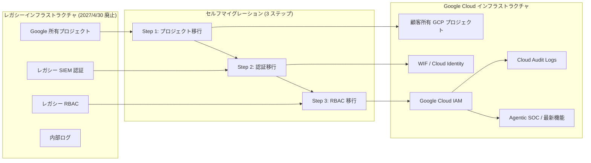

# Google SecOps: レガシー SIEM インフラストラクチャの廃止予告と Marketplace 統合アップデート

**リリース日**: 2026-04-22

**サービス**: Google SecOps (Google Security Operations)

**機能**: レガシー SIEM インフラ廃止予告 / Marketplace 統合アップデート

**ステータス**: Deprecated / Feature

[このアップデートのインフォグラフィックを見る](https://takech9203.github.io/google-cloud-news-summary/20260422-google-secops-updates.html)

## 概要

Google は 2026 年 4 月 22 日、Google Security Operations (SecOps) SIEM のレガシーインフラストラクチャのサポートを **2027 年 4 月 30 日に終了する**ことを正式に発表しました。この期限以降、レガシーインフラストラクチャ上の Google SecOps SIEM インスタンスにはアクセスできなくなります。対象のユーザーは、Google Cloud 上の最新インフラストラクチャへのセルフマイグレーションを完了する必要があります。

同時に、Google SecOps Marketplace では複数の統合アップデートが公開されました。Netskope Version 17.0、Qualys VM Version 26.0、SCC Enterprise Version 21.0、McAfee Mvision EDR Version 12.0 など、主要なセキュリティ製品との連携が強化されています。

これらのアップデートは、SOC チームのセキュリティ運用の近代化を推進し、Agentic Security Operations への移行を加速するものです。特にレガシーインフラの廃止予告は、すべての該当ユーザーが約 1 年以内に移行を完了する必要があることを意味し、早急な対応計画の策定が求められます。

**アップデート前の課題**

レガシーインフラストラクチャ上の Google SecOps SIEM には以下の制限がありました。

- Google が所有するプロジェクトでホストされており、顧客が Google Cloud サービスとの直接統合を活用できなかった
- レガシー SIEM 独自の認証方式を使用しており、Workforce Identity Federation や Cloud Identity といった標準的な Google Cloud 認証が利用できなかった
- 独自の RBAC (ロールベースアクセス制御) に依存しており、Google Cloud IAM によるきめ細かなアクセス制御が適用されなかった
- Cloud Audit Logs との統合がなく、監査ログの可視性が限定的だった

**アップデート後の改善**

Google Cloud への移行により以下が実現されます。

- 顧客所有の Google Cloud プロジェクトでホストされ、VPC Service Controls などの高度なセキュリティ制御が利用可能になる
- Workforce Identity Federation または Cloud Identity による標準的な Google Cloud 認証へ移行できる
- Google Cloud IAM による機能レベルの RBAC で精密なアクセス権限管理が可能になる
- Cloud Audit Logs との統合による包括的な監査ログの可視化が実現する
- Agentic SOC、Emerging Threats、Dashboards、Data Access Controls、Security Validation、Federation などの最新機能が利用可能になる

## アーキテクチャ図

レガシーインフラストラクチャから Google Cloud への移行は 3 つのステップで構成されています。プロジェクトの移行、認証方式の移行、RBAC の移行を順番に実施することで、データロスやダウンタイムなく移行を完了できます。

## サービスアップデートの詳細

### レガシー SIEM インフラストラクチャの廃止 (Deprecated)

1. **サポート終了日: 2027 年 4 月 30 日**
   - この日以降、レガシーインフラストラクチャ上の Google SecOps SIEM インスタンスにはアクセスできなくなる
   - 対象ユーザーはセルフマイグレーションを完了する必要がある

2. **移行が必要な条件 (いずれかに該当する場合)**
   - Google Cloud プロジェクトにデプロイされていない
   - Google Cloud 認証 (Workforce Identity Federation / Cloud Identity) を使用していない
   - Google Cloud IAM による Feature RBAC を使用していない

3. **移行が不要な条件 (すべてに該当する場合)**
   - Google Cloud プロジェクトにデプロイ済み
   - Workforce Identity Federation または Cloud Identity で認証している
   - Google Cloud IAM でアクセス権限を管理している

### Marketplace 統合アップデート (Feature)

1. **Netskope Version 17.0**
   - 新しいアクション「Add Entities to URL List」「Deploy URL List Changes」が追加
   - V2 API のサポートを追加
   - OAuth 2.0 認証のサポートを追加

2. **Qualys VM Version 26.0**
   - 最新の Qualys API エンドポイントへの移行が完了

3. **SCC Enterprise Version 21.0**
   - Sync SCC Jira Tickets のチケット同期ロジックが更新

4. **McAfee Mvision EDR Version 12.0**
   - Trellix XDR API のサポートが追加 (McAfee は Trellix 製品ポートフォリオに統合済み)

## 技術仕様

### 移行の範囲

| 項目 | レガシースタック | モダンスタック |
|------|-----------------|----------------|
| プロジェクトホスティング | Google 所有プロジェクト | 顧客所有の Google Cloud プロジェクト |
| 認証 | レガシー SIEM 認証 | Google Cloud Auth: WIF または Cloud Identity |
| 認可 | レガシー SIEM RBAC | Feature RBAC: Google Cloud IAM |
| 監査ログ | 限定的な内部ログ | Cloud Audit Logs: 包括的な Google Cloud ログ |

### Marketplace 統合バージョン一覧

| 統合名 | バージョン | 主な変更内容 |
|--------|-----------|-------------|
| Netskope | 17.0 | 新アクション追加、V2 API、OAuth 2.0 |
| Qualys VM | 26.0 | 最新 API エンドポイントへの移行 |
| SCC Enterprise | 21.0 | Jira チケット同期ロジック更新 |
| McAfee Mvision EDR | 12.0 | Trellix XDR API サポート |

## 設定方法

### 前提条件

1. Google Cloud 組織と Google Cloud プロジェクトが存在すること (必要に応じて作成)
2. Google SecOps 契約に対応する請求先アカウントにプロジェクトがリンクされていること
3. Google SecOps SIEM インスタンスのレガシー Administrator ロールを持っていること

### 手順

#### ステップ 1: Google Cloud プロジェクトへの移行

Google SecOps にサインインし、Settings > SIEM Settings > Google Cloud Platform に移動します。Google Cloud プロジェクト ID を入力し、Generate link をクリックした後、Connect to Google Cloud Platform を選択します。Google Cloud コンソールで Security > Google SecOps に移動し、自動作成されたサービスアカウントを確認して Connect をクリックします。

詳細: [Migrate to a Google Cloud project](https://docs.cloud.google.com/chronicle/docs/administration/migrate-to-gcp-project)

#### ステップ 2: Google Cloud 認証への移行

Google Cloud コンソールで Security > Google SecOps に移動します。Configure single sign-on で、使用する ID プロバイダに応じて Google Cloud Identity または Workforce Identity Federation を選択します。Workforce Identity Federation を選択した場合は、テスト SSO セットアップを実行して動作確認を行います。

詳細: [Migrate to Google Cloud authentication](https://docs.cloud.google.com/chronicle/docs/administration/migrate-from-legacy-auth-to-gcp-auth)

#### ステップ 3: Feature RBAC への移行

Google Cloud コンソールで Security > Google SecOps > Access management に移動します。Migrate role bindings で自動生成された gcloud CLI コマンドを確認し、Cloud Shell で実行します。Verify access をクリックして検証が成功したら、Enable IAM をクリックして移行を完了します。

詳細: [Migrate from legacy RBAC to feature RBAC](https://docs.cloud.google.com/chronicle/docs/administration/migrate-from-legacy-rbac-to-feature-rbac)

## メリット

### ビジネス面

- **コンプライアンス強化**: CMEK、VPC Service Controls、FedRAMP、リージョナルデータレジデンシー要件への対応が可能になり、規制要件への準拠が容易になる
- **運用効率の向上**: Agentic SOC 機能により AI 駆動のセキュリティオペレーションが実現し、脅威の自動トリアージと対応が高速化する
- **可視性の向上**: Cloud Audit Logs との統合により、セキュリティ運用の監査とガバナンスが強化される

### 技術面

- **インフラストラクチャの信頼性向上**: Google Cloud インフラストラクチャによる高いプラットフォーム信頼性、強化されたプライバシー制御、VPC Service Controls によるセキュリティ強化
- **きめ細かなアクセス制御**: Google Cloud IAM による機能レベルおよびデータレベルのアクセス制御が可能
- **最新機能の利用**: Emerging Threats、Dashboards、Data Access Controls、Security Validation、Federation などの新機能が利用可能
- **統合エコシステムの拡張**: Marketplace の最新統合 (Netskope V2 API、Trellix XDR API など) を活用してセキュリティツールチェーンを強化

## デメリット・制約事項

### 制限事項

- 移行は不可逆で、特に RBAC の移行後はレガシー RBAC に戻すことができない
- 複数のフロントエンドパスを持つインスタンスの場合、セルフマイグレーションはサポートされず、Google SecOps サポートへの連絡が必要
- 移行期限は 2027 年 4 月 30 日であり、期限を超過するとインスタンスへのアクセスが不可能になる

### 考慮すべき点

- 移行は 3 ステップの順序を守って実施する必要があり、段階的な計画が必要
- サードパーティ IdP を使用している場合は Workforce Identity Federation の事前設定が必要
- IAM ロールとパーミッションの事前レビューが推奨される (レガシー RBAC からの適切なマッピングを確認)
- 移行完了後、ユーザーが適切な IAM ロールでアクセスできることの検証が必要

## ユースケース

### ユースケース 1: エンタープライズ SOC のモダナイゼーション

**シナリオ**: 大規模企業のセキュリティチームがレガシー Google SecOps SIEM を運用しており、Agentic SOC 機能を活用して脅威対応を自動化したい。

**効果**: Google Cloud へ移行することで、AI 駆動のセキュリティオペレーション (Agentic SOC) が利用可能になり、脅威の自動検出・トリアージ・対応が実現する。Cloud Audit Logs によるフルログの監査も可能になる。

### ユースケース 2: マルチベンダーセキュリティスタックの統合強化

**シナリオ**: Netskope (CASB/ZTNA)、Qualys (脆弱性管理)、Trellix (EDR) を併用するセキュリティチームが、Google SecOps をプラットフォームとして統合運用を行いたい。

**効果**: Marketplace の最新統合アップデートにより、Netskope V2 API (OAuth 2.0 認証)、Qualys の最新 API エンドポイント、Trellix XDR API を通じたシームレスな連携が可能になる。SCC Enterprise の Jira チケット同期機能の改善により、インシデント管理ワークフローも強化される。

## 料金

レガシーインフラストラクチャから Google Cloud への移行自体に追加費用は発生しません。Google SecOps の料金は既存の契約に基づきます。詳細な料金体系については、Google SecOps の営業担当者にお問い合わせいただくか、以下のページをご確認ください。

- [Google Security Operations の料金](https://cloud.google.com/chronicle/pricing)

## 関連サービス・機能

- **[Google Cloud IAM](https://cloud.google.com/iam/docs/overview)**: 移行後の認可・アクセス制御基盤
- **[Workforce Identity Federation](https://cloud.google.com/iam/docs/workforce-identity-federation)**: サードパーティ IdP を使用した認証連携
- **[Cloud Audit Logs](https://docs.cloud.google.com/chronicle/docs/administration/audit-logging)**: 移行後に利用可能な包括的な監査ログ
- **[VPC Service Controls](https://cloud.google.com/vpc-service-controls/docs/overview)**: 移行後に利用可能なデータ境界制御
- **[Security Command Center](https://cloud.google.com/security-command-center/docs/overview)**: SCC Enterprise 統合を通じたクラウドセキュリティポスチャ管理
- **[Agentic Security Operations](https://cloud.google.com/chronicle/docs/secops/)**: 移行後に利用可能な AI 駆動の次世代 SOC 機能

## 参考リンク

- [インフォグラフィック](https://takech9203.github.io/google-cloud-news-summary/20260422-google-secops-updates.html)
- [公式リリースノート](https://cloud.google.com/release-notes#April_22_2026)
- [レガシー SIEM インフラ移行ガイド](https://docs.cloud.google.com/chronicle/docs/administration/migrate-legacy-siem-infra)
- [Google Cloud プロジェクトへの移行](https://docs.cloud.google.com/chronicle/docs/administration/migrate-to-gcp-project)
- [Google Cloud 認証への移行](https://docs.cloud.google.com/chronicle/docs/administration/migrate-from-legacy-auth-to-gcp-auth)
- [レガシー RBAC から Feature RBAC への移行](https://docs.cloud.google.com/chronicle/docs/administration/migrate-from-legacy-rbac-to-feature-rbac)
- [コミュニティ投稿: Elevate Your Defense](https://security.googlecloudcommunity.com/community-blog-42/elevate-your-defense-modernizing-google-secops-for-the-agentic-soc-7087)
- [Marketplace 統合リリースノート](https://docs.cloud.google.com/chronicle/docs/soar/marketplace-integrations/release-notes)
- [Google SecOps の料金](https://cloud.google.com/chronicle/pricing)

## まとめ

今回のアップデートで最も重要なのは、レガシー Google SecOps SIEM インフラストラクチャのサポートが **2027 年 4 月 30 日に終了する**という廃止予告です。該当するインスタンスを運用しているすべての組織は、公式の移行ガイドに従って Google Cloud への移行を計画・実行する必要があります。移行はデータロスやダウンタイムなく実施できるよう設計されていますが、3 ステップの手順を順序通りに実施する必要があるため、早期に計画を開始することを強く推奨します。併せて、Marketplace の統合アップデートも活用し、セキュリティ運用のモダナイゼーションを進めてください。

---

**タグ**: #GoogleSecOps #SIEM #SecurityOperations #Migration #Deprecated #Marketplace #Netskope #Qualys #SCCEnterprise #TrellixXDR #AgenticSOC #GoogleCloudIAM
