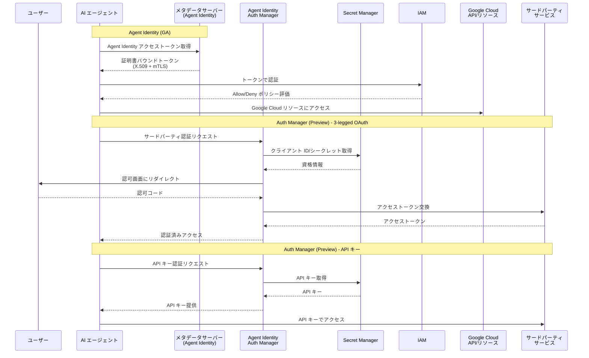

# Identity and Access Management (IAM): Agent Identity Auth Manager (Preview) & Agent Identity GA

**リリース日**: 2026-04-22

**サービス**: Identity and Access Management (IAM)

**機能**: Agent Identity Auth Manager (Preview) / Agent Identity (GA)

**ステータス**: Agent Identity Auth Manager: Preview / Agent Identity: GA

[このアップデートのインフォグラフィックを見る](https://takech9203.github.io/google-cloud-news-summary/20260422-iam-agent-identity-auth-manager.html)

## 概要

Google Cloud IAM において、2 つの重要なアップデートが発表された。1 つ目は「Agent Identity Auth Manager」の Preview リリースであり、エージェントがサードパーティサービスに対して 3-legged OAuth、2-legged OAuth、または API キーを使用して安全に認証するための統合管理機能を提供する。2 つ目は「Agent Identity」の GA (一般提供) であり、エージェントごとに暗号学的に証明された固有の ID をリソースのライフサイクルに紐づけて提供する機能が本番環境で利用可能になった。

Agent Identity は SPIFFE (Secure Production Identity Framework For Everyone) に基づく暗号学的 ID をエージェントに自動的にプロビジョニングする機能である。従来のサービスアカウントと異なり、エージェントのリソースライフサイクルに紐づいた ID により、最小権限の原則に沿ったセキュリティモデルを実現する。GA により、Context-Aware Access (CAA) ポリシーによる mTLS バインディング、証明書バウンドトークンによる資格情報窃取防止、IAM の Allow/Deny ポリシーとの統合がプロダクションレベルの SLA で利用可能になった。

Agent Identity Auth Manager は、これまで開発者が個別に実装していたサードパーティサービスへの認証処理を統合的に管理するサービスである。Secret Manager と連携してクライアント ID/シークレットや API キーを安全に保管し、3-legged OAuth (ユーザー委任認証)、2-legged OAuth (サービス間認証)、API キー認証の 3 つの認証方式を統一的に管理する。対象ユーザーは AI エージェントを構築・運用する開発者およびプラットフォームエンジニアである。

**アップデート前の課題**

- エージェントの認証にはサービスアカウントが使用されており、エージェント固有の ID がリソースのライフサイクルと紐づいていなかった。サービスアカウントキーの漏洩リスクや、過剰な権限付与が課題であった
- サードパーティサービスへの認証 (OAuth フロー、API キー管理) はエージェント開発者が個別に実装する必要があり、認証ロジックの分散と不統一がセキュリティリスクを生んでいた
- エージェントが取得したアクセストークンの保護が不十分で、トークンが盗まれた場合に別の環境から再利用 (リプレイ攻撃) される可能性があった

**アップデート後の改善**

- Agent Identity の GA により、エージェントごとに SPIFFE ベースの暗号学的 ID が自動プロビジョニングされ、サービスアカウントに依存しない安全な認証がプロダクションレベルで利用可能になった
- Agent Identity Auth Manager により、3-legged OAuth、2-legged OAuth、API キーの 3 つの認証方式を統合的に管理でき、開発者が個別に認証ロジックを実装する負担が大幅に軽減された
- Context-Aware Access (CAA) ポリシーにより、証明書バウンドトークンが mTLS で保護され、トークンが意図されたランタイム環境でのみ使用できるようになった

## アーキテクチャ図



Agent Identity (GA) はエージェントに暗号学的 ID を付与し Google Cloud リソースへの安全なアクセスを提供する。Agent Identity Auth Manager (Preview) は Secret Manager と連携し、サードパーティサービスへの 3-legged OAuth、2-legged OAuth、API キーによる認証を統合管理する。

## サービスアップデートの詳細

### 主要機能

1. **Agent Identity (GA) - エージェント固有の暗号学的 ID**
   - エージェントのデプロイ時に SPIFFE ベースの固有 ID が自動プロビジョニングされる
   - プリンシパル識別子形式: `principal://agents.global.org-ORGANIZATION_ID.system.id.goog/resources/aiplatform/projects/PROJECT_NUMBER/locations/LOCATION/reasoningEngines/AGENT_ENGINE_ID`
   - X.509 クライアント証明書が自動管理され、mTLS による相互認証が可能
   - IAM の Allow ポリシー、Deny ポリシー、Principal Access Boundary ポリシーと統合
   - アクセストークンは証明書にバウンドされ、意図されたランタイム環境でのみ使用可能 (CAA による保護)

2. **Agent Identity Auth Manager (Preview) - サードパーティ認証の統合管理**
   - 3-legged OAuth: ユーザーの同意を得てエージェントがサードパーティサービスにアクセス (ユーザー委任認証)
   - 2-legged OAuth: サービス間のマシン対マシン認証。ユーザーの介入なしにエージェントがサードパーティ API にアクセス
   - API キー認証: Secret Manager に安全に保管された API キーをエージェントがランタイムで取得して使用
   - Secret Manager との統合により、クライアント ID/シークレットおよび API キーが暗号化された状態で安全に管理される

3. **Context-Aware Access (CAA) によるトークン保護**
   - デフォルトで有効化される Google 管理の CAA ポリシー
   - mTLS バインディングにより、証明書バウンドトークンの再利用 (リプレイ攻撃) を防止
   - RFC 8705 準拠の証明書バウンドトークンで資格情報の窃取に対する耐性を実現
   - Cloud Run コンテナなどの信頼されたランタイム環境からのみトークンが使用可能

## 技術仕様

### Agent Identity プリンシパル識別子

| 項目 | 詳細 |
|------|------|
| ID フォーマット | `principal://TRUST_DOMAIN/NAMESPACE/AGENT_NAME` |
| Trust Domain (組織あり) | `agents.global.org-ORGANIZATION_ID.system.id.goog` |
| Trust Domain (組織なし) | `agents.global.project-PROJECT_NUMBER.system.id.goog` |
| SPIFFE ID | `spiffe://agents.global.org-ORGANIZATION_ID.system.id.goog/resources/aiplatform/projects/PROJECT_NUMBER/locations/LOCATION/reasoningEngines/AGENT_NAME` |
| 証明書 | X.509 クライアント証明書 (自動プロビジョニング・自動ローテーション) |
| 認証方式 | mTLS (相互 TLS) |
| トークン有効期限 | デフォルト 1 時間 (証明書有効期限に依存して短縮される場合あり) |

### Auth Manager 対応認証方式

| 認証方式 | ユースケース | ユーザー操作 | Secret Manager 連携 |
|---------|------------|------------|-------------------|
| 3-legged OAuth | ユーザー委任でサードパーティサービスにアクセス | 認可画面での同意が必要 | クライアント ID/シークレットを保管 |
| 2-legged OAuth | サービス間のマシン対マシン認証 | 不要 | クライアント ID/シークレットを保管 |
| API キー | API キーベースのサードパーティサービスアクセス | 不要 | API キーを保管 |

### IAM ポリシーの対応状況

| ポリシータイプ | Agent Identity (単一) | Agent Identity (セット) |
|--------------|----------------------|----------------------|
| Allow ポリシー | 対応 | 対応 |
| Deny ポリシー | 対応 | 対応 |
| Principal Access Boundary | - | - |

## 設定方法

### 前提条件

1. Vertex AI API が有効化されたプロジェクト
2. Secret Manager API が有効化されていること (Auth Manager 使用時)
3. Vertex AI Agent Engine へのアクセス権限
4. `v1beta1` API バージョンの使用 (Agent Identity 作成時)

### 手順

#### ステップ 1: Agent Identity を持つエージェントの作成

```python
import vertexai
from vertexai import agent_engines
from vertexai import types

client = vertexai.Client(
    project="PROJECT_ID",
    location="LOCATION",
    http_options=dict(api_version="v1beta1")
)

# Agent Identity を有効にしてエージェントをデプロイ
remote_app = client.agent_engines.create(
    config={
        "display_name": "my-agent-with-identity",
        "identity_type": types.IdentityType.AGENT_IDENTITY,
    }
)

print(f"Agent Identity: {remote_app.api_resource.spec.effective_identity}")
```

プリンシパル識別子が `principal://agents.global.org-ORGANIZATION_ID.system.id.goog/...` 形式で出力される。

#### ステップ 2: IAM ポリシーの設定

```bash
# エージェントに Google Cloud リソースへのアクセス権限を付与
gcloud projects add-iam-policy-binding PROJECT_ID \
  --member="principal://agents.global.org-ORGANIZATION_ID.system.id.goog/resources/aiplatform/projects/PROJECT_NUMBER/locations/LOCATION/reasoningEngines/AGENT_ENGINE_ID" \
  --role="roles/aiplatform.expressUser"

# Secret Manager へのアクセス権限を付与 (Auth Manager 使用時)
gcloud secrets add-iam-policy-binding my-oauth-secret \
  --role='roles/secretmanager.secretAccessor' \
  --member="principal://agents.global.org-ORGANIZATION_ID.system.id.goog/resources/aiplatform/projects/PROJECT_NUMBER/locations/LOCATION/reasoningEngines/AGENT_ENGINE_ID"
```

#### ステップ 3: Auth Manager によるサードパーティ認証の設定

```bash
# Secret Manager にクライアントシークレットを保管
gcloud secrets create my-app-oauth-secret
gcloud secrets versions add my-app-oauth-secret --data-file=oauth-secret

# エージェントに Secret へのアクセス権限を付与
gcloud secrets add-iam-policy-binding my-app-oauth-secret \
  --role='roles/secretmanager.secretAccessor' \
  --member="principal://agents.global.org-ORGANIZATION_ID.system.id.goog/resources/aiplatform/projects/PROJECT_NUMBER/locations/LOCATION/reasoningEngines/AGENT_ENGINE_ID"
```

#### ステップ 4: ADK エージェントでの OAuth 認証の実装

```python
from google.adk.auth.auth_schemes import OpenIdConnectWithConfig
from google.adk.auth.auth_credential import AuthCredential, AuthCredentialTypes, OAuth2Auth
from google.adk.tools.openapi_tool.openapi_spec_parser.openapi_toolset import OpenAPIToolset
from google.adk.agents.llm_agent import LlmAgent
from google.cloud import secretmanager
from google.auth import default

def access_secret(project_id: str, secret_id: str, version_id: str = "latest") -> str:
    # Agent Identity の ADC で Secret Manager にアクセス
    credentials, _ = default()
    client = secretmanager.SecretManagerServiceClient(credentials=credentials)
    name = f"projects/{project_id}/secrets/{secret_id}/versions/{version_id}"
    response = client.access_secret_version(request={"name": name})
    return response.payload.data.decode("UTF-8")

# OAuth 認証スキームの定義
auth_scheme = OpenIdConnectWithConfig(
    authorization_endpoint="https://example.com/oauth2/authorize",
    token_endpoint="https://example.com/oauth2/token",
    scopes=['openid', 'profile', 'email']
)

# Auth Manager 経由で Secret Manager から資格情報を取得
auth_credential = AuthCredential(
    auth_type=AuthCredentialTypes.OPEN_ID_CONNECT,
    oauth2=OAuth2Auth(
        client_id=access_secret(project_id='my-project', secret_id='oauth_client_id'),
        client_secret=access_secret(project_id='my-project', secret_id='oauth_client_secret'),
    )
)

# ツールセットに認証を適用
toolset = OpenAPIToolset(
    spec_str=spec_content,
    spec_str_type='yaml',
    auth_scheme=auth_scheme,
    auth_credential=auth_credential,
)

# エージェントの作成
agent = LlmAgent(
    model='gemini-2.5-flash',
    name='authenticated_agent',
    instruction='サードパーティサービスと安全に連携するアシスタント',
    tools=[toolset],
)
```

## メリット

### ビジネス面

- **コンプライアンス強化**: エージェントごとの固有 ID により、どのエージェントがどのリソースにアクセスしたかを明確に追跡でき、監査要件への対応が容易になる
- **運用コスト削減**: Auth Manager によりサードパーティ認証の実装・管理が統合化され、開発者がセキュリティロジックに費やす時間を削減できる
- **セキュリティリスクの低減**: サービスアカウントキーの共有や管理が不要になり、資格情報の漏洩リスクが大幅に低下する

### 技術面

- **ゼロトラストセキュリティ**: SPIFFE ベースの暗号学的 ID、mTLS バインディング、証明書バウンドトークンにより、多層的なセキュリティが実現される
- **最小権限の原則**: エージェント単位で IAM ポリシーを設定でき、サービスアカウントの過剰な権限付与を回避できる
- **ライフサイクル管理の自動化**: Agent Identity はエージェントリソースのライフサイクルに紐づいており、エージェントの削除時に ID も自動的に無効化される
- **Application Default Credentials (ADC) との統合**: 既存の Google Cloud SDK の認証ライブラリがそのまま Agent Identity を使用するため、コードの変更が最小限で済む

## デメリット・制約事項

### 制限事項

- Agent Identity Auth Manager は Preview 段階であり、Pre-GA Offerings Terms が適用される。本番環境での利用は制限される可能性がある
- Agent Identity は Cloud Storage の Legacy Bucket ロール (`storage.legacyBucketReader`、`storage.legacyBucketWriter`、`storage.legacyBucketOwner`) を付与できない
- Agent Identity は現時点で Vertex AI Agent Engine Runtime 上のエージェントに限定される。他のコンピュート環境 (GKE、Cloud Run 単体) のエージェントには Managed Workload Identity を使用する必要がある
- CAA をオプトアウトした場合、トークンの環境間共有が可能になるが、セキュリティレベルが低下する

### 考慮すべき点

- 既存のサービスアカウントベースのエージェントから Agent Identity への移行計画が必要。`identity_type` フラグが未設定の場合、後方互換性のためサービスアカウントが引き続き使用される
- Auth Manager で管理するサードパーティ資格情報は Secret Manager に保管されるため、Secret Manager の料金が別途発生する
- 3-legged OAuth フローではユーザーの同意が必要なため、フロントエンド側の認可フロー実装が必要になる (ADK Web 使用時は自動化される)
- Agent Identity アクセストークンの有効期限はデフォルト 1 時間であり、長時間実行されるタスクではトークンの自動更新を考慮する必要がある

## ユースケース

### ユースケース 1: Slack 連携エージェントのセキュアな認証

**シナリオ**: 企業の IT チームが、社内問い合わせに自動応答する AI エージェントを構築する。エージェントは Slack API を通じてメッセージの送受信を行うが、ユーザーごとの権限レベルに応じたアクセス制御が必要である。

**実装例**:
```python
from google.adk.auth.auth_schemes import OpenIdConnectWithConfig
from google.adk.auth.auth_credential import AuthCredential, AuthCredentialTypes, OAuth2Auth

# Agent Identity Auth Manager 経由で Slack の OAuth 資格情報を取得
auth_scheme = OpenIdConnectWithConfig(
    authorization_endpoint="https://slack.com/oauth/v2/authorize",
    token_endpoint="https://slack.com/api/oauth.v2.access",
    scopes=['chat:write', 'channels:read']
)

auth_credential = AuthCredential(
    auth_type=AuthCredentialTypes.OPEN_ID_CONNECT,
    oauth2=OAuth2Auth(
        client_id=access_secret('my-project', 'slack_client_id'),
        client_secret=access_secret('my-project', 'slack_client_secret'),
    )
)
```

**効果**: 3-legged OAuth によりユーザーごとの権限でエージェントが Slack にアクセスし、Agent Identity により Google Cloud リソースへのアクセスも最小権限で管理される。認証資格情報は Secret Manager で一元管理されるため、キーのローテーションも容易になる。

### ユースケース 2: マルチエージェントシステムでの相互認証

**シナリオ**: 複数の AI エージェントが協調して業務を遂行するマルチエージェントシステムにおいて、エージェント間の通信を安全に行い、各エージェントのアクセス権限を個別に管理する。

**実装例**:
```bash
# エージェント A: データ分析エージェント (BigQuery アクセス権限)
gcloud projects add-iam-policy-binding PROJECT_ID \
  --member="principal://agents.global.org-ORG_ID.system.id.goog/resources/aiplatform/projects/PROJECT_NUM/locations/us-central1/reasoningEngines/agent-a" \
  --role="roles/bigquery.dataViewer"

# エージェント B: レポート生成エージェント (Cloud Storage アクセス権限)
gcloud projects add-iam-policy-binding PROJECT_ID \
  --member="principal://agents.global.org-ORG_ID.system.id.goog/resources/aiplatform/projects/PROJECT_NUM/locations/us-central1/reasoningEngines/agent-b" \
  --role="roles/storage.objectCreator"
```

**効果**: 各エージェントが固有の Agent Identity を持ち、IAM ポリシーにより必要最小限のリソースにのみアクセスできる。A2A プロトコルとの連携により、エージェント間の通信も mTLS で保護される。Cloud Logging ではエージェントごとのアクセスログが記録され、監査が容易になる。

## 料金

Agent Identity 自体の追加料金は発生しない。Agent Identity は Vertex AI Agent Engine の一部として提供される。ただし、Auth Manager が利用する関連サービスには個別の料金が適用される。

### 料金例

| サービス | 料金体系 |
|---------|---------|
| Vertex AI Agent Engine | Agent Engine の利用料金に含まれる |
| Agent Identity | 追加料金なし |
| Secret Manager | シークレットバージョンあたり $0.06/月、アクセスオペレーション 10,000 回あたり $0.03 |
| Certificate Authority Service | Agent Identity の X.509 証明書は Google 管理のため追加料金なし |

## 利用可能リージョン

Agent Identity は Vertex AI Agent Engine がサポートするすべてのリージョンで利用可能である。具体的なリージョン一覧は Vertex AI Agent Engine のサポートリージョンを参照のこと。Auth Manager は Agent Identity と同じリージョンで Preview として利用可能である。

## 関連サービス・機能

- **Vertex AI Agent Engine**: Agent Identity がプロビジョニングされるエージェントのホスティング基盤。Agent Identity Auth Manager もこの基盤上で動作する
- **Secret Manager**: Auth Manager が OAuth クライアント ID/シークレットや API キーを安全に保管・取得するために使用
- **Certificate Authority Service**: Agent Identity の X.509 証明書の発行・管理に使用される Google 管理のインフラストラクチャ
- **Agent Development Kit (ADK)**: Auth Manager と統合された `AuthScheme`/`AuthCredential` クラスにより、エージェント開発者が認証ロジックを簡潔に実装できる
- **Cloud Logging**: Agent Identity によるアクセスログの記録。ユーザー委任フローではユーザー ID とエージェント ID の両方が記録される
- **VPC Service Controls**: Agent Identity をイングレス/エグレスルールで使用し、エージェントのネットワークレベルのアクセス制御を強化できる
- **A2A (Agent2Agent) Protocol**: Agent Identity を使用したエージェント間の安全な通信プロトコル
- **Managed Workload Identity**: GKE/Compute Engine ワークロード向けの類似機能。Agent Identity はエージェント専用の拡張版

## 参考リンク

- [インフォグラフィック](https://takech9203.github.io/google-cloud-news-summary/20260422-iam-agent-identity-auth-manager.html)
- [公式リリースノート](https://cloud.google.com/release-notes#April_22_2026)
- [Agent Identity ドキュメント (Vertex AI Agent Engine)](https://docs.cloud.google.com/agent-builder/agent-engine/agent-identity)
- [Agent Identity Auth Manager ドキュメント](https://docs.cloud.google.com/agent-builder/agent-engine/agent-identity#oauth-delegated-access)
- [IAM プリンシパル識別子](https://docs.cloud.google.com/iam/docs/principal-identifiers)
- [IAM プリンシパルの概要 (Agent Identity)](https://docs.cloud.google.com/iam/docs/principals-overview#agent-identity)
- [Managed Workload Identity の概要](https://docs.cloud.google.com/iam/docs/managed-workload-identity)
- [ADK 認証ガイド](https://adk.dev/tools-custom/authentication/)
- [Agent Engine アクセス管理](https://docs.cloud.google.com/agent-builder/agent-engine/manage/access)
- [トークンタイプ (Agent Identity アクセストークン)](https://docs.cloud.google.com/docs/authentication/token-types)
- [IAM 料金](https://cloud.google.com/iam/pricing)

## まとめ

今回のアップデートは、AI エージェントのセキュリティ管理における重要なマイルストーンである。Agent Identity の GA により、サービスアカウントに依存しない SPIFFE ベースの暗号学的 ID がプロダクションレベルで利用可能になり、エージェントのライフサイクルに紐づいた自動管理、mTLS による証明書バウンドトークン、IAM ポリシーとの統合が実現された。Agent Identity Auth Manager の Preview は、サードパーティサービスへの認証を統合的に管理する機能を提供し、エージェントがセキュアに外部サービスと連携するための基盤を整える。エージェントを本番環境で運用する組織は、サービスアカウントからの移行を含め、Agent Identity の導入を早急に検討することを推奨する。

---

**タグ**: #IAM #AgentIdentity #AuthManager #OAuth #SPIFFE #mTLS #VertexAI #AgentEngine #SecretManager #ゼロトラスト #GA #Preview #エージェントセキュリティ
