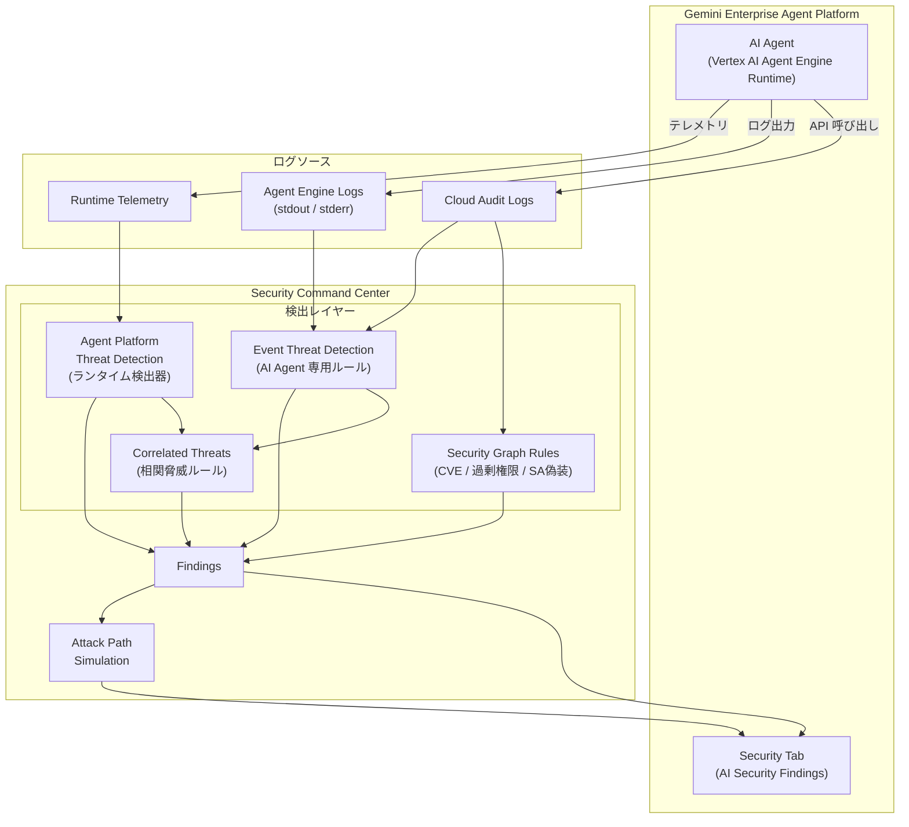

# Security Command Center: Agent Platform 向け新セキュリティルールと AI セキュリティ Findings

**リリース日**: 2026-04-22

**サービス**: Security Command Center

**機能**: Agent Platform 向け新セキュリティルールと AI セキュリティ Findings

**ステータス**: GA

[このアップデートのインフォグラフィックを見る](https://takech9203.github.io/google-cloud-news-summary/20260422-security-command-center-agent-platform-rules.html)

## 概要

Security Command Center に、AI エージェント (Agent Platform / Vertex AI Agent Engine) のセキュリティを強化するための新しい事前定義ルールとコントロールが追加された。今回のアップデートでは、セキュリティグラフルール、相関脅威ルール、Agent Platform Threat Detection のランタイム検出器、Event Threat Detection ルールの 4 つの領域で Agent Runtime 向けのサポートが拡充されている。

さらに、AI セキュリティリスクに関連する Security Command Center の Findings が、Gemini Enterprise Agent Platform の「セキュリティ」タブで直接確認できるようになった。この機能により、Findings の包括的な可視性、アクティブな脅威の把握、攻撃パスシミュレーションが提供される。これは Security Command Center Premium または Enterprise ティアが必要となる。

このアップデートは、AI エージェントを本番環境にデプロイしている組織のセキュリティチーム、クラウドアーキテクト、AI プラットフォーム管理者を主な対象としている。エージェント型 AI ワークロードの普及に伴い増大するセキュリティリスクに対して、統合的な検出・対応能力を提供する。

**アップデート前の課題**

AI エージェントのセキュリティ監視には、従来いくつかの課題があった。

- AI エージェント固有の脅威 (権限昇格、データ流出、不正なトークン生成など) に対する専用の検出ルールが限定的だった
- セキュリティグラフルールで Agent Runtime の CVE リスクや過剰権限を網羅的に検出できなかった
- AI セキュリティ関連の Findings を確認するために Security Command Center のコンソールに移動する必要があり、Agent Platform の管理画面から直接セキュリティ状態を把握できなかった
- 複数の検出サービス (ランタイム検出、イベント検出、相関脅威) にまたがる AI エージェント関連の脅威を一元的に把握するのが困難だった

**アップデート後の改善**

今回のアップデートにより、AI エージェントのセキュリティ対策が大幅に強化された。

- Agent Runtime 向けのセキュリティグラフルールが追加され、CVE リスクや過剰権限、サービスアカウント偽装などのリスクを自動検出可能になった
- 相関脅威ルールが Agent Runtime に対応し、マルウェア検出とリバースシェルなど複数のシグナルを相関分析して多段階攻撃を検出できるようになった
- Agent Platform Threat Detection のランタイム検出器が拡充され、悪意あるバイナリ実行、コンテナエスケープ、暗号通貨マイニングなどのランタイム脅威をリアルタイムで検出可能になった
- Event Threat Detection に AI エージェント専用ルールが追加され、不正な権限付与、外部からの認証情報利用、機密ロール付与などのコントロールプレーン脅威を検出可能になった
- Gemini Enterprise Agent Platform のセキュリティタブから AI セキュリティ Findings を直接確認でき、攻撃パスシミュレーションによるリスクの可視化が可能になった

## アーキテクチャ図



Security Command Center の 4 つの検出レイヤー (セキュリティグラフルール、Agent Platform Threat Detection、Event Threat Detection、相関脅威ルール) が Agent Runtime のテレメトリとログを分析し、Findings を生成する。これらの Findings は Gemini Enterprise Agent Platform のセキュリティタブに統合表示される。

## サービスアップデートの詳細

### 主要機能

1. **セキュリティグラフルール (Agent Runtime 対応)**
   - Vertex AI Agent Engine にデプロイされた AI エージェントの CVE リスクを自動検出
   - サービスアカウント ID の過剰権限、SA 偽装によるアクセスを検出
   - 高価値リソースや機密データへの直接アクセス・偽装アクセスのリスクを評価
   - 公開された Cloud Storage バケットを使用したエージェントデプロイの検出

2. **相関脅威ルール (Agent Runtime 対応)**
   - 「Multiple correlated threat signals of malicious software」ルールが Agent Runtime に対応
   - Agent Platform Threat Detection が検出したマルウェア URL とリバースシェルなど、複数のシグナルを相関分析
   - 単一のシグナルでは検出困難な多段階攻撃パターンを識別

3. **Agent Platform Threat Detection ランタイム検出器の拡充**
   - 悪意あるバイナリ・ライブラリの実行検出 (Added / Modified / Built-in)
   - コンテナエスケープ、リバースシェル、予期しない子シェルの検出
   - Python / Bash スクリプトの NLP ベース悪意検出
   - Kubernetes 攻撃ツール、ローカル偵察ツールの実行検出
   - ファイルレス実行 (/memfd:) の検出
   - 暗号通貨マイニング (Stratum プロトコル) の検出

4. **Event Threat Detection AI エージェント専用ルール**
   - `Persistence: IAM Anomalous Grant to Agentic Identity` - エージェント ID への異常な権限付与
   - `Credential Access: Agentic Identity Credential Used Outside of Google Cloud` - エージェント認証情報の外部利用
   - `Persistence: Sensitive Role Granted by/to AI Agent` - AI エージェントによる/への機密ロール付与
   - `Defense Evasion: Token Creator Role Granted to AI Agent` - プロジェクト/フォルダ/組織レベルでの Token Creator ロール付与
   - データ流出検出 (BigQuery、CloudSQL、Cloud Storage からの不正エクスポート)
   - 権限昇格検出 (signJwt、暗黙的委任、クロスプロジェクトトークン生成)

5. **Gemini Enterprise Agent Platform セキュリティタブ統合**
   - AI セキュリティリスクに関連する Findings を Agent Platform 管理画面から直接閲覧可能
   - アクティブな脅威のリアルタイム表示
   - 攻撃パスシミュレーションによるリスクの視覚化
   - AI 脆弱性・設定ミスの一覧表示
   - Google 推奨 AI セキュリティベストプラクティスへの準拠状況の表示

## 技術仕様

### セキュリティグラフルール (Agent Runtime 向け)

| ルール | 説明 |
|------|------|
| Vertex AI Agent Engine: High-risk CVE, SA identity with direct access to high value resource | 高リスク CVE を持つ AI エージェントが高価値リソースに直接アクセス |
| Vertex AI Agent Engine: High-risk CVE, SA identity with direct access to resource with sensitive data | 高リスク CVE を持つ AI エージェントが機密データリソースに直接アクセス |
| Vertex AI Agent Engine: High-risk CVE, SA identity with excessive direct permissions | 高リスク CVE を持つ AI エージェントが過剰な直接権限を保有 |
| Vertex AI Agent Engine: High-risk CVE, SA identity with excessive permissions via SA impersonation | 高リスク CVE を持つ AI エージェントが SA 偽装による過剰権限を保有 |
| Vertex AI Agent Engine: High-risk CVE, SA identity with ability to impersonate SA | 高リスク CVE を持つ AI エージェントが別の SA を偽装可能 |
| Cloud Storage Bucket: Publicly exposed bucket used for Vertex AI Agent Engine deployment | 公開バケットが Agent Engine デプロイに使用されている |

### Event Threat Detection コントロールプレーン検出器

| 検出カテゴリ | API 名 | 重要度 |
|-------------|--------|--------|
| Exfiltration: AI Agent Initiated BigQuery Data Extraction | AGENT_ENGINE_BIG_QUERY_EXFIL_TO_CLOUD_STORAGE | Low |
| Initial Access: AI Agent Identity Excessive Permission Denied Actions | AGENT_ENGINE_EXCESSIVE_FAILED_ATTEMPT | Medium |
| Privilege Escalation: AI Agent Suspicious Token Generation Using signJwt | AGENT_ENGINE_SUSPICIOUS_TOKEN_GENERATION_SIGN_JWT | Low |
| Privilege Escalation: AI Agent Suspicious Cross-Project OpenID Token Generation | AGENT_ENGINE_SUSPICIOUS_TOKEN_GENERATION_CROSS_PROJECT_OPENID | Low |
| Discovery: Evidence of Port Scanning from AI Agent | AGENT_ENGINE_PORT_SCANNING_EVIDENCE | Low |
| Discovery: AI Agent Unauthorized Service Account API Call | AGENT_ENGINE_UNAUTHORIZED_SERVICE_ACCOUNT_API_CALL | Low |
| Credential Access: AI Agent Anomalous Access to Metadata Service | AGENT_ENGINE_ANOMALOUS_ACCESS_TO_METADATA_SERVICE | Low |
| Exfiltration: AI Agent Initiated BigQuery VPC Perimeter Violation | AGENT_ENGINE_BIG_QUERY_EXFIL_VPC_PERIMETER_VIOLATION | Low |

### 必要な IAM ロール

```
# Findings の閲覧に必要なロール
roles/securitycenter.findingsViewer

# Agent Platform Threat Detection の管理
roles/securitycenter.adminViewer

# AI エージェント一覧の表示 (Enterprise ティア)
roles/securitycenter.adminViewer
```

## 設定方法

### 前提条件

1. Security Command Center Premium または Enterprise ティアが有効化されていること
2. 組織レベルでの Security Command Center のアクティベーション (推奨)
3. AI Protection が有効化されていること
4. Vertex AI Agent Engine にデプロイされた AI エージェントが存在すること

### 手順

#### ステップ 1: Agent Platform Threat Detection の有効化確認

```bash
# Agent Platform Threat Detection の状態を確認
gcloud scc manage services update agent-engine-threat-detection \
  --organization=ORGANIZATION_ID \
  --enablement-state=ENABLED
```

Agent Platform Threat Detection はデフォルトで有効化されている。無効になっている場合は上記コマンドで有効化する。

#### ステップ 2: AI Protection の有効化

Google Cloud コンソールで AI Protection の Service Enablement ページに移動し、「Activate」をクリックする。有効化すると、Agent Platform Threat Detection を含む依存サービスが表示される。

#### ステップ 3: Findings の確認

Google Cloud コンソールで Security Command Center の Findings ページに移動し、「Source display name」フィルタで「Agent Platform Threat Detection」を選択することで、AI エージェント関連の Findings を確認できる。

#### ステップ 4: Agent Platform セキュリティタブの確認

Gemini Enterprise Agent Platform のセキュリティタブにアクセスし、AI セキュリティ Findings、アクティブな脅威、攻撃パスシミュレーションを確認する。

## メリット

### ビジネス面

- **AI ワークロードのリスク低減**: エージェント型 AI の脅威をプロアクティブに検出・対応することで、データ流出や不正アクセスのリスクを低減
- **コンプライアンス対応の強化**: AI セキュリティに関する Google 推奨ベストプラクティスへの準拠状況を可視化し、監査対応を効率化
- **セキュリティ運用の効率化**: Gemini Enterprise Agent Platform から直接セキュリティ状態を確認できるため、コンテキストスイッチなくセキュリティ対応が可能

### 技術面

- **多層防御の実現**: ランタイム検出、コントロールプレーン検出、セキュリティグラフ分析、相関脅威分析の 4 層で AI エージェントを保護
- **NLP ベースの高度な検出**: Bash / Python スクリプトの悪意あるコードを自然言語処理で分析し、難読化された攻撃も検出可能
- **リアルタイム検出**: Agent Platform Threat Detection が watcher プロセスでリアルタイムにテレメトリを収集・分析し、ニアリアルタイムで Finding を生成
- **攻撃パスの可視化**: セキュリティグラフを活用した攻撃パスシミュレーションにより、潜在的なリスクの伝播経路を可視化

## デメリット・制約事項

### 制限事項

- Security Command Center Premium または Enterprise ティアが必須 (無料の Standard ティアでは利用不可)
- Agent Platform Threat Detection は現在 Preview ステータスの検出器が多く、Pre-GA の制約が適用される
- watcher プロセスの起動に最大 1 分の遅延が発生する可能性がある
- プロジェクトレベルのアクティベーションでは一部の Finding (クロスプロジェクトトークン生成など) が利用不可
- 収集されたデータはメモリ内で処理され、インシデントとして報告されない場合は保持されないため、事後のフォレンジック分析が制限される

### 考慮すべき点

- 組織レベルでの Security Command Center アクティベーションが推奨され、プロジェクトレベルでは機能が制限される
- Event Threat Detection のコントロールプレーン検出器は Cloud Audit Logs の有効化が前提となるため、適切なログ設定が必要
- 大量の AI エージェントをデプロイしている環境では、Finding の量が増大する可能性があるため、適切なミュートルールやフィルタリングの設定が重要

## ユースケース

### ユースケース 1: AI エージェントのデータ流出検出

**シナリオ**: 企業が Vertex AI Agent Engine で顧客データにアクセスする AI エージェントを運用しているケース。悪意ある第三者がエージェントを悪用し、BigQuery の機密データを組織外の Cloud Storage バケットにエクスポートしようとする。

**実装例**:
```bash
# Agent Platform Threat Detection が自動検出する Finding の例
# Category: Exfiltration: AI Agent Initiated BigQuery Data Extraction
# API Name: AGENT_ENGINE_BIG_QUERY_EXFIL_TO_CLOUD_STORAGE
# Severity: Low
# Log Source: Cloud Audit Logs (BigQueryAuditMetadata data access logs)

# Findings の確認コマンド
gcloud scc findings list ORGANIZATION_ID \
  --source=AGENT_PLATFORM_THREAT_DETECTION_SOURCE_ID \
  --filter="category=\"AGENT_ENGINE_BIG_QUERY_EXFIL_TO_CLOUD_STORAGE\""
```

**効果**: AI エージェント経由のデータ流出をニアリアルタイムで検出し、迅速なインシデント対応が可能になる。

### ユースケース 2: AI エージェントの権限昇格検出

**シナリオ**: AI エージェントに関連付けられたサービスアカウントが、signJwt メソッドを使用して別のサービスアカウントのアクセストークンを不正に生成しようとするケース。

**効果**: Event Threat Detection の `AGENT_ENGINE_SUSPICIOUS_TOKEN_GENERATION_SIGN_JWT` ルールが権限昇格の試みを即座に検出し、セキュリティチームに通知する。攻撃パスシミュレーションにより、侵害が成功した場合の影響範囲を事前に把握できる。

### ユースケース 3: 多段階攻撃の相関分析

**シナリオ**: AI エージェントで悪意ある URL が観測された後、同じエージェントからリバースシェルが検出されるケース。

**効果**: 相関脅威ルール「Multiple correlated threat signals of malicious software」がこれらのシグナルを統合し、単一の高優先度 Finding として報告する。個別のシグナルでは低重要度と判定されるイベントも、相関分析により深刻な多段階攻撃として適切に優先順位付けされる。

## 料金

Security Command Center の料金は選択するティアによって異なる。今回のアップデートで追加された機能を利用するには、Premium または Enterprise ティアが必要。

| ティア | Agent Platform Threat Detection | AI Security Findings (Agent Platform 統合) | 課金モデル |
|--------|--------------------------------|-------------------------------------------|------------|
| Standard | 利用不可 | 利用不可 | 無料 |
| Premium | 利用可能 | 利用可能 | 従量課金またはサブスクリプション |
| Enterprise | 利用可能 | 利用可能 | サブスクリプション (要営業担当連絡) |

詳細な料金については [Security Command Center の料金ページ](https://cloud.google.com/security-command-center/pricing) を参照。

## 利用可能リージョン

Security Command Center はグローバルサービスとして提供されている。Agent Platform Threat Detection は、Vertex AI Agent Engine Runtime がサポートされているリージョンで利用可能。詳細なリージョンサポートについては [公式ドキュメント](https://cloud.google.com/security-command-center/docs/data-residency-support) を参照。

## 関連サービス・機能

- **Vertex AI Agent Engine**: AI エージェントのデプロイ・管理基盤。Agent Platform Threat Detection の監視対象となるランタイム環境
- **Event Threat Detection**: Cloud Audit Logs を分析してコントロールプレーンの脅威を検出するサービス。AI エージェント専用ルールが追加された
- **AI Protection**: AI ワークロードのセキュリティポスチャを管理する包括的なサービス。Agent Platform Threat Detection の有効化に必要
- **Model Armor**: Gemini モデルを AI 脅威 (プロンプトインジェクションなど) から保護するサービス
- **VPC Service Controls**: Agent Engine からの BigQuery データ流出に対する VPC 境界違反を検出
- **Cloud Audit Logs**: Event Threat Detection のログソースとして、AI エージェントの API 呼び出しを記録

## 参考リンク

- [インフォグラフィック](https://takech9203.github.io/google-cloud-news-summary/20260422-security-command-center-agent-platform-rules.html)
- [公式リリースノート](https://cloud.google.com/release-notes#April_22_2026)
- [Agent Platform Threat Detection 概要](https://cloud.google.com/security-command-center/docs/agent-platform-threat-detection-overview)
- [Agent Platform Threat Detection の使用](https://cloud.google.com/security-command-center/docs/use-agent-platform-threat-detection)
- [事前定義セキュリティグラフルール](https://cloud.google.com/security-command-center/docs/predefined-security-graph-rules)
- [AI の脅威への対応](https://cloud.google.com/security-command-center/docs/respond-ai-threats)
- [AI Protection 概要](https://cloud.google.com/security-command-center/docs/ai-protection-overview)
- [Security Command Center サービスティア](https://cloud.google.com/security-command-center/docs/service-tiers)
- [料金ページ](https://cloud.google.com/security-command-center/pricing)

## まとめ

今回のアップデートは、AI エージェントのセキュリティを包括的に強化する重要なリリースである。セキュリティグラフルール、相関脅威ルール、ランタイム検出器、Event Threat Detection ルールの 4 つの領域で Agent Runtime 対応が拡充され、多層防御によるリアルタイムの脅威検出が実現した。Vertex AI Agent Engine で AI エージェントを運用している組織は、Security Command Center Premium/Enterprise ティアの導入を検討し、Agent Platform Threat Detection が有効化されていることを確認した上で、Gemini Enterprise Agent Platform のセキュリティタブを活用して AI ワークロードのセキュリティ状態を継続的に監視することを推奨する。

---

**タグ**: #SecurityCommandCenter #AgentPlatformThreatDetection #AIセキュリティ #VertexAI #AgentEngine #EventThreatDetection #セキュリティグラフ #脅威検出 #GoogleCloud
