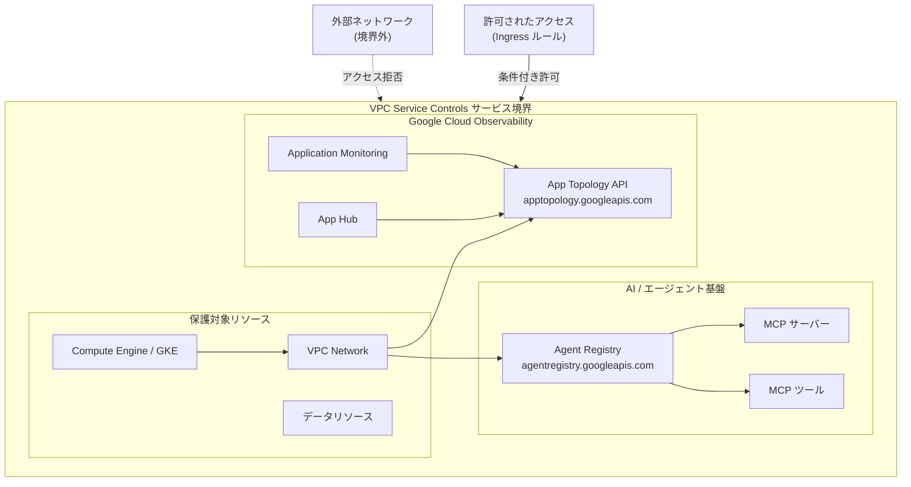

# VPC Service Controls: App Topology および Agent Registry の Preview サポート

**リリース日**: 2026-04-22

**サービス**: VPC Service Controls

**機能**: App Topology および Agent Registry との統合 (Preview)

**ステータス**: Preview

📊 [このアップデートのインフォグラフィックを見る](https://takech9203.github.io/google-cloud-news-summary/20260422-vpc-service-controls-app-topology-agent-registry.html)

## 概要

VPC Service Controls が App Topology および Agent Registry の 2 つのサービスとの統合を Preview ステージとしてサポート開始した。これにより、アプリケーショントポロジーマップの生成に使用されるデータや、AI エージェントの MCP サーバー/ツール登録情報をサービス境界内で保護できるようになった。

App Topology は Google Cloud Observability の一部であり、App Hub に登録されたアプリケーション間のトラフィックフローやサービス間の依存関係をインタラクティブなトポロジーマップとして可視化するサービスである。Agent Registry (Cloud API Registry) は、MCP (Model Context Protocol) サーバーおよびツールの検出、ガバナンス、利用管理を一元化するサービスであり、AI エージェント開発における重要な基盤となっている。

セキュリティ要件の厳しいエンタープライズ環境において、アプリケーション構成の可視化や AI エージェント管理にこれらのサービスを利用する場合に、VPC Service Controls による境界保護を適用できることは、データ漏洩リスクの低減とコンプライアンス要件への対応において大きな価値を持つ。

**アップデート前の課題**

- App Topology API (`apptopology.googleapis.com`) を VPC Service Controls のサービス境界で保護できなかったため、トポロジーデータへのアクセス制御が限定的だった
- Agent Registry のリソース (MCP サーバーやツールのメタデータ) をサービス境界内に含めることができず、AI エージェント構成情報の外部流出リスクがあった
- VPC Service Controls を導入している環境で App Topology を利用する場合、境界制限により Observability がトポロジーマップを生成できないという制約があった

**アップデート後の改善**

- App Topology API をサービス境界の制限対象サービスとして追加し、トポロジーデータへのアクセスを境界内に限定できるようになった
- Agent Registry のリソースをサービス境界で保護し、MCP サーバーやツールのメタデータへの不正アクセスを防止できるようになった
- VPC Service Controls 環境下でも App Topology と Agent Registry を適切に構成することで、セキュリティと機能性を両立できるようになった

## アーキテクチャ図



VPC Service Controls のサービス境界内に App Topology API と Agent Registry を配置し、境界外からの不正アクセスを防止する構成を示している。App Topology は App Hub や Application Monitoring と連携してトポロジーマップを生成し、Agent Registry は MCP サーバー/ツールを管理する。

## サービスアップデートの詳細

### 主要機能

1. **App Topology の VPC Service Controls 統合**
   - App Topology API (`apptopology.googleapis.com`) をサービス境界の制限対象として追加可能
   - OpenTelemetry ベースのトレースデータから生成されるアプリケーショントポロジー情報をサービス境界内で保護
   - App Hub、Observability API、Telemetry API、Cloud Logging API と組み合わせた境界設計が必要

2. **Agent Registry の VPC Service Controls 統合**
   - Agent Registry API をサービス境界の制限対象として追加可能
   - MCP サーバーやツールのメタデータを境界内で保護し、AI エージェントの構成情報の漏洩を防止
   - Apigee API Hub からの自動同期データも境界保護の対象

3. **Dry Run モードによる事前検証**
   - 両サービスとも Dry Run モードで事前に境界の影響を確認可能
   - 既存の App Topology や Agent Registry のワークフローへの影響を本番適用前に評価
   - 違反ログにより、境界適用後にブロックされるリクエストを事前に特定

## 技術仕様

### 新規サポート対象サービス

| 項目 | App Topology | Agent Registry |
|------|-------------|----------------|
| ステータス | Preview | Preview |
| サービス名 | `apptopology.googleapis.com` | `agentregistry.googleapis.com` |
| 境界による保護 | 対応 | 対応 |
| 関連サービス | App Hub, Observability, Telemetry | Apigee API Hub, MCP サーバー |
| 主なユースケース | アプリケーショントポロジーマップの保護 | AI エージェント管理情報の保護 |

### App Topology に必要な関連 API

App Topology をサービス境界内で正しく機能させるためには、以下の関連 API も境界内に含める必要がある。

| API | サービス名 | 役割 |
|-----|-----------|------|
| App Hub API | `apphub.googleapis.com` | アプリケーション登録管理 |
| Observability API | `monitoring.googleapis.com` | 監視データの収集 |
| Telemetry API | `telemetry.googleapis.com` | テレメトリデータの送信 |
| Cloud Logging API | `logging.googleapis.com` | ログデータの管理 |
| Cloud Trace API | `cloudtrace.googleapis.com` | トレースデータの収集 |

### 必要な IAM ロール

```json
{
  "app_topology": {
    "viewer": "roles/apptopology.viewer",
    "permission": "apptopology.applicationTopologies.generate"
  },
  "agent_registry": {
    "admin": "roles/agentregistry.admin",
    "viewer": "roles/agentregistry.viewer"
  },
  "vpc_service_controls": {
    "admin": "roles/accesscontextmanager.policyAdmin",
    "editor": "roles/accesscontextmanager.policyEditor"
  }
}
```

## 設定方法

### 前提条件

1. Google Cloud 組織レベルまたはスコープ付きアクセスポリシーが設定済みであること
2. App Topology API または Agent Registry API が対象プロジェクトで有効化されていること
3. VPC Service Controls の管理に必要な IAM ロール (`roles/accesscontextmanager.policyAdmin`) が付与されていること

### 手順

#### ステップ 1: App Topology をサービス境界に追加

```bash
# 既存のサービス境界に App Topology と関連 API を追加
gcloud access-context-manager perimeters update PERIMETER_ID \
  --policy=POLICY_ID \
  --add-restricted-services="apptopology.googleapis.com,apphub.googleapis.com,monitoring.googleapis.com,logging.googleapis.com,cloudtrace.googleapis.com"
```

App Topology が正しく機能するためには、関連する Observability 系の API も同じ境界内に含める必要がある。

#### ステップ 2: Agent Registry をサービス境界に追加

```bash
# 既存のサービス境界に Agent Registry を追加
gcloud access-context-manager perimeters update PERIMETER_ID \
  --policy=POLICY_ID \
  --add-restricted-services=agentregistry.googleapis.com
```

Apigee API Hub からの同期を利用している場合は、API Hub 関連のサービスも境界内に含めることを推奨する。

#### ステップ 3: Dry Run モードでの検証 (推奨)

```bash
# Dry Run モードで境界を作成し、影響を事前確認
gcloud access-context-manager perimeters dry-run create TEST_PERIMETER \
  --policy=POLICY_ID \
  --restricted-services="apptopology.googleapis.com,agentregistry.googleapis.com" \
  --resources=projects/PROJECT_NUMBER
```

Dry Run モードでは実際のアクセスはブロックされず、違反ログのみが記録される。本番適用前に Cloud Logging で違反ログを確認し、正当なアクセスがブロックされないことを検証することを推奨する。

## メリット

### ビジネス面

- **コンプライアンス対応の強化**: アプリケーション構成情報や AI エージェントの管理情報を含むセンシティブなメタデータを境界内で保護することで、データガバナンス要件への対応が強化される
- **AI エージェントのセキュアな運用**: Agent Registry を境界で保護することで、MCP サーバーやツールの構成情報が組織外に流出するリスクを低減し、エンタープライズ環境での AI エージェント導入を促進する

### 技術面

- **多層防御の実現**: IAM によるアクセス制御に加え、VPC Service Controls によるネットワークレベルの境界保護を App Topology と Agent Registry に適用可能
- **統合的なセキュリティ管理**: 既存のサービス境界に App Topology と Agent Registry を追加するだけで、組織のセキュリティポリシーを一貫して適用できる
- **可観測性とセキュリティの両立**: VPC Service Controls 環境下でも App Topology によるトポロジーマップの生成が可能となり、セキュリティを犠牲にせず可観測性を確保できる

## デメリット・制約事項

### 制限事項

- Preview ステージのため、SLA の適用対象外である。本番ワークロードでの利用には注意が必要
- App Topology を境界内で使用する場合、App Hub API、Observability API、Telemetry API、Cloud Logging API も同じ境界内に含める必要があり、境界設計が複雑になる可能性がある
- App-enabled フォルダを使用している場合、Organization Policy Administrator が `apptopology.googleapis.com` をサービス利用制限ポリシーの許可リストに追加する必要がある

### 考慮すべき点

- App Topology のトポロジーマップは、同一組織内のトレーススコーププロジェクトからのトレースエッジのみを表示する。境界設計時にプロジェクト構成を考慮する必要がある
- Agent Registry の Apigee API Hub 連携を使用している場合、API Hub 関連のサービスも境界内に含めることを検討する必要がある
- Preview から GA への移行時に、設定の変更が必要になる可能性がある

## ユースケース

### ユースケース 1: セキュアなアプリケーション監視環境の構築

**シナリオ**: 金融機関が App Hub でアプリケーションを管理し、App Topology でサービス間のトラフィックフローを可視化したいが、トポロジー情報自体もセンシティブなデータとして保護する必要がある。

**実装例**:
```bash
# Observability 関連サービスを含む境界を作成
gcloud access-context-manager perimeters create observability-perimeter \
  --policy=POLICY_ID \
  --title="Observability Secure Perimeter" \
  --restricted-services="apptopology.googleapis.com,apphub.googleapis.com,monitoring.googleapis.com,logging.googleapis.com,cloudtrace.googleapis.com" \
  --resources="projects/APP_PROJECT_NUMBER,projects/MONITORING_PROJECT_NUMBER" \
  --access-levels="accessPolicies/POLICY_ID/accessLevels/corp-network"
```

**効果**: アプリケーションのトポロジー情報やトレースデータへのアクセスを企業ネットワーク内に限定し、インフラ構成情報の外部流出を防止する。

### ユースケース 2: エンタープライズ AI エージェント基盤の保護

**シナリオ**: 大規模組織が Agent Registry を使用して社内の MCP サーバーとツールを管理し、AI エージェントの開発基盤として利用しているが、MCP サーバーの構成情報や利用可能なツールの情報を組織外に漏洩させたくない。

**実装例**:
```bash
# Agent Registry を含む AI 基盤の境界を作成
gcloud access-context-manager perimeters create ai-platform-perimeter \
  --policy=POLICY_ID \
  --title="AI Platform Perimeter" \
  --restricted-services="agentregistry.googleapis.com,aiplatform.googleapis.com" \
  --resources="projects/AI_PROJECT_NUMBER"
```

**効果**: AI エージェントの管理基盤を境界で保護し、MCP サーバーやツールの構成情報が組織外に流出するリスクを排除する。

## 料金

VPC Service Controls 自体には追加料金は発生しない。ただし、以下の関連コストを考慮する必要がある。

- **Cloud Logging**: VPC Service Controls の違反ログおよび監査ログの保存に伴うログバケットのコストが発生する
- **App Topology**: Google Cloud Observability の料金体系に基づく (トレースデータの取り込み量に依存)
- **Agent Registry**: Preview ステージのため、料金体系は GA 時に確定する可能性がある

## 利用可能リージョン

VPC Service Controls はグローバルサービスであり、App Topology および Agent Registry がサポートするすべてのリージョンでサービス境界による保護を適用できる。App Topology は App Hub がサポートするリージョンで利用可能であり、Agent Registry はグローバルに利用可能である。

## 関連サービス・機能

- **[App Hub](https://cloud.google.com/app-hub/docs/overview)**: アプリケーションの登録と管理を行うサービス。App Topology はApp Hub に登録されたアプリケーションのトポロジーを可視化する
- **[Cloud API Registry](https://cloud.google.com/api-registry/docs/overview)**: MCP サーバーとツールの検出、ガバナンス、利用管理を一元化するサービス。Agent Registry として機能する
- **[Google Cloud Observability](https://cloud.google.com/monitoring/docs)**: Application Monitoring の一部として App Topology を提供。トレースデータからトポロジーマップを生成する
- **[Apigee API Hub](https://cloud.google.com/apigee/docs/apihub/what-is-api-hub)**: API および MCP リソースの管理プラットフォーム。Agent Registry との自動同期機能を提供する
- **[Access Context Manager](https://cloud.google.com/access-context-manager/docs)**: VPC Service Controls のアクセスポリシー、サービス境界、アクセスレベルの管理

## 参考リンク

- 📊 [インフォグラフィック](https://takech9203.github.io/google-cloud-news-summary/20260422-vpc-service-controls-app-topology-agent-registry.html)
- [公式リリースノート](https://cloud.google.com/release-notes#April_22_2026)
- [VPC Service Controls 概要](https://cloud.google.com/vpc-service-controls/docs/overview)
- [VPC Service Controls 対応プロダクト一覧](https://cloud.google.com/vpc-service-controls/docs/supported-products)
- [App Topology ドキュメント](https://cloud.google.com/monitoring/docs/application-topology)
- [Cloud API Registry (Agent Registry) ドキュメント](https://cloud.google.com/api-registry/docs/overview)
- [App Hub ドキュメント](https://cloud.google.com/app-hub/docs/overview)
- [VPC Service Controls リリースノート](https://cloud.google.com/vpc-service-controls/docs/release-notes)

## まとめ

VPC Service Controls の App Topology および Agent Registry に対する Preview サポートにより、アプリケーション可観測性と AI エージェント管理基盤のセキュリティが強化された。特にエンタープライズ環境では、これらのサービスを既存のサービス境界に追加し、Dry Run モードで十分に検証した上で適用することを推奨する。Preview ステージであるため、GA 移行時の変更にも注意を払いながら段階的に導入を進めることが望ましい。

---

**タグ**: #VPCServiceControls #AppTopology #AgentRegistry #Security #Preview #Observability #AIAgent #MCP
