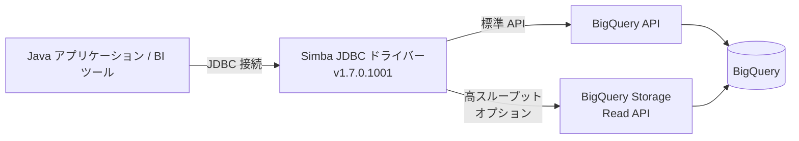

# BigQuery: Simba JDBC ドライバー v1.7.0 アップデート

**リリース日**: 2026-04-23

**サービス**: BigQuery

**機能**: Simba JDBC ドライバーの更新版 (v1.7.0.1001)

**ステータス**: 変更 (Change)

[このアップデートのインフォグラフィックを見る](https://takech9203.github.io/google-cloud-news-summary/20260423-bigquery-simba-jdbc-driver-update.html)

## 概要

BigQuery 用 Simba JDBC ドライバーの新バージョン 1.7.0.1001 がリリースされた。Simba JDBC ドライバーは、insightsoftware (Google Cloud Ready - BigQuery パートナー) が開発する JDBC 接続ドライバーであり、Java アプリケーションから BigQuery への接続を可能にする。Tableau、PowerBI、Informatica などの BI ツールや、カスタム Java アプリケーションから BigQuery に接続する際に広く利用されている。

今回のアップデートでは、ピコ秒精度のタイムスタンプサポートの追加、タイムスタンプのタイムゾーン動作の変更 (ローカルシステム時間から UTC 形式への変更)、および複数のサードパーティライブラリの更新が含まれている。前バージョン (1.6.5.1002) からのメジャーバージョンアップとなるため、特にタイムスタンプの動作変更については移行時に注意が必要である。

**アップデート前の課題**

- タイムスタンプのデータ型はピコ秒精度に対応していなかった
- タイムスタンプがローカルシステム時間で返されていたため、タイムゾーンが異なる環境間でデータの不整合が発生する可能性があった
- サードパーティライブラリ (google-cloud-bigquerystorage、google-api-services-bigquery、jackson-core) が旧バージョンのままであった

**アップデート後の改善**

- 新しい接続プロパティ `EnableTimestampPicos` により、ピコ秒精度のタイムスタンプが利用可能になった
- タイムスタンプが UTC 形式で統一的に返されるようになり、タイムゾーンに起因するデータ不整合が解消された
- サードパーティライブラリが最新版に更新され、セキュリティとパフォーマンスが向上した

## アーキテクチャ図



Java アプリケーションや BI ツールが Simba JDBC ドライバーを介して BigQuery に接続する構成を示す。標準の BigQuery API に加え、オプションで BigQuery Storage Read API (高スループット API) を使用した高速データ読み取りも可能である。

## サービスアップデートの詳細

### 主要機能

1. **ピコ秒精度タイムスタンプのサポート [GBQJ-884]**
   - 新しい接続プロパティ `EnableTimestampPicos` を `1` に設定することで、ピコ秒精度のタイムスタンプを取得可能
   - BigQuery 側でピコ秒機能が完全に有効化された後、この設定は将来的に削除される可能性がある

2. **タイムスタンプのタイムゾーン動作変更 [GBQJ-884]**
   - タイムスタンプの返却形式がローカルシステム時間から UTC 形式に変更
   - 既存アプリケーションでタイムスタンプの表示・処理に影響が出る可能性があるため、移行時の確認が必要

3. **サードパーティライブラリの更新 [GBQJ-912]**
   - google-cloud-bigquerystorage: 3.18.0 から 3.20.0 に更新
   - google-api-services-bigquery: v2-rev20240919-2.0.0 から v2-rev20251012-2.0.0 に更新
   - jackson-core: 2.17.2 から 2.21.1 に更新

## 技術仕様

### ドライバー情報

| 項目 | 詳細 |
|------|------|
| バージョン | 1.7.0.1001 |
| 前バージョン | 1.6.5.1002 |
| リリース日 | 2026-03-30 |
| 対応 Java プラットフォーム | JRE 8, 11, 21 |
| JDBC 互換バージョン | JDBC 4.2 |
| 開発元 | insightsoftware (Magnitude Simba) |

### 新しい接続プロパティ

| プロパティ | 値 | 説明 |
|-----------|-----|------|
| `EnableTimestampPicos` | `0` (デフォルト) / `1` | ピコ秒精度のタイムスタンプを有効にする |

## 設定方法

### 前提条件

1. JRE 8、11、または 21 がインストールされていること
2. BigQuery への認証が設定されていること

### 手順

#### ステップ 1: ドライバーのダウンロード

[Simba JDBC ドライバー v1.7.0.1001 のダウンロード](https://storage.googleapis.com/simba-bq-release/jdbc/SimbaJDBCDriverforGoogleBigQuery42_1.7.0.1001.zip) から ZIP ファイルをダウンロードし、展開する。

#### ステップ 2: インストールと設定

[insightsoftware のインストールおよび設定ガイド (PDF)](https://storage.googleapis.com/simba-bq-release/jdbc/Simba%20Google%20BigQuery%20JDBC%20Connector%20Install%20and%20Configuration%20Guide_1.7.0.1001.pdf) に従って設定を行う。

#### ステップ 3: ピコ秒精度の有効化 (オプション)

ピコ秒精度のタイムスタンプを使用する場合は、JDBC 接続文字列に `EnableTimestampPicos=1` を追加する。

```
jdbc:simba://https://www.googleapis.com/bigquery/v2:443;ProjectId=<PROJECT_ID>;OAuthType=<AUTH_TYPE>;EnableTimestampPicos=1;
```

## メリット

### ビジネス面

- **データの一貫性向上**: UTC 形式への統一により、グローバル環境でのデータ分析における時間の不整合リスクが低減される
- **高精度分析の実現**: ピコ秒精度のタイムスタンプにより、IoT データやリアルタイムイベントの高精度な時間分析が可能になる

### 技術面

- **セキュリティ改善**: サードパーティライブラリの更新により、既知の脆弱性への対応が含まれる可能性がある
- **API 互換性の向上**: google-api-services-bigquery の更新により、最新の BigQuery 機能との互換性が向上

## デメリット・制約事項

### 制限事項

- BigQuery のロード機能およびエクスポート機能は JDBC ドライバー経由では利用不可
- クエリプレフィックスはサポートされない
- パラメータ化クエリはクエリの検証のみ提供し、パフォーマンスには影響しない
- ドライバーは BigQuery 専用であり、他の製品やサービスでは使用不可

### 考慮すべき点

- **破壊的変更**: タイムスタンプが UTC 形式で返されるようになったため、ローカル時間を前提としていた既存アプリケーションでは修正が必要になる可能性がある
- **既知の問題**: 複数の接続で LogLevel=6 を設定すると、同一 LogPath ディレクトリでコリジョンが発生し、接続が予期せず終了する場合がある
- **既知の問題**: Workforce/Workload Identity Federation の実行可能ファイルベースのクレデンシャルはサポートされない

## ユースケース

### ユースケース 1: BI ツールからの BigQuery 接続

**シナリオ**: Tableau や PowerBI から BigQuery のデータを分析するために、最新の Simba JDBC ドライバーを使用して接続を構成する。

**効果**: 最新のドライバーにより、BigQuery の最新機能との互換性が確保され、セキュリティも向上する。

### ユースケース 2: 高精度タイムスタンプを活用した IoT データ分析

**シナリオ**: IoT センサーから収集されるサブナノ秒精度のイベントデータを BigQuery に格納し、ピコ秒精度のタイムスタンプでクエリする。

**効果**: `EnableTimestampPicos=1` の設定により、ピコ秒精度のイベント順序分析が可能になり、高頻度データのより正確な時系列分析が実現する。

## 料金

Simba ODBC および JDBC ドライバーは無償でダウンロード可能であり、追加ライセンスは不要。ただし、ドライバー経由で BigQuery を利用する際には、以下の標準 BigQuery 料金が適用される。

- クエリ実行に対する[コンピューティング料金](https://cloud.google.com/bigquery/pricing#compute-pricing-models)
- 大規模な結果セットをデスティネーションテーブルに書き込む場合の[ストレージ料金](https://cloud.google.com/bigquery/pricing#storage-pricing)
- 高スループット API 機能を使用する場合の [BigQuery Storage Read API 料金](https://cloud.google.com/bigquery/pricing#data-extraction-pricing)

## 関連サービス・機能

- **[Google 開発 JDBC ドライバー (Preview)](https://docs.cloud.google.com/bigquery/docs/jdbc-for-bigquery)**: Simba ドライバーの代替として Google が開発した JDBC ドライバー。Maven Central からの依存関係管理や DataSource クラスのサポートなどが特徴
- **[BigQuery Storage Read API](https://docs.cloud.google.com/bigquery/docs/reference/storage)**: 高スループット API として JDBC ドライバーと組み合わせて使用可能
- **[サードパーティ BI ツール連携](https://docs.cloud.google.com/bigquery/docs/third-party-integration)**: BigQuery と各種 BI ツールの接続に関する公式ガイド
- **[Simba ODBC ドライバー](https://docs.cloud.google.com/bigquery/docs/reference/odbc-jdbc-drivers)**: Java 以外のアプリケーション向けの ODBC 接続ドライバー (現在のバージョン: 3.1.6.3037)

## 参考リンク

- [このアップデートのインフォグラフィック](https://takech9203.github.io/google-cloud-news-summary/20260423-bigquery-simba-jdbc-driver-update.html)
- [公式リリースノート](https://docs.cloud.google.com/release-notes#April_23_2026)
- [ODBC/JDBC ドライバー ドキュメント](https://docs.cloud.google.com/bigquery/docs/reference/odbc-jdbc-drivers)
- [Simba JDBC ドライバー v1.7.0.1001 リリースノート (テキスト)](https://storage.googleapis.com/simba-bq-release/jdbc/release-notes_1.7.0.1001.txt)
- [インストールおよび設定ガイド (PDF)](https://storage.googleapis.com/simba-bq-release/jdbc/Simba%20Google%20BigQuery%20JDBC%20Connector%20Install%20and%20Configuration%20Guide_1.7.0.1001.pdf)
- [BigQuery 料金ページ](https://cloud.google.com/bigquery/pricing)

## まとめ

Simba JDBC ドライバー v1.7.0 は、ピコ秒精度のタイムスタンプサポートとタイムスタンプの UTC 統一という重要な変更を含むメジャーアップデートである。特にタイムスタンプの動作変更は破壊的変更となるため、アップグレード前に既存アプリケーションへの影響を検証することを推奨する。BI ツールやカスタム Java アプリケーションから BigQuery に接続しているユーザーは、サードパーティライブラリの更新によるセキュリティ改善のメリットも踏まえ、計画的なアップグレードを検討すべきである。

---

**タグ**: #BigQuery #JDBC #Simba #ドライバー更新 #タイムスタンプ #BI連携
