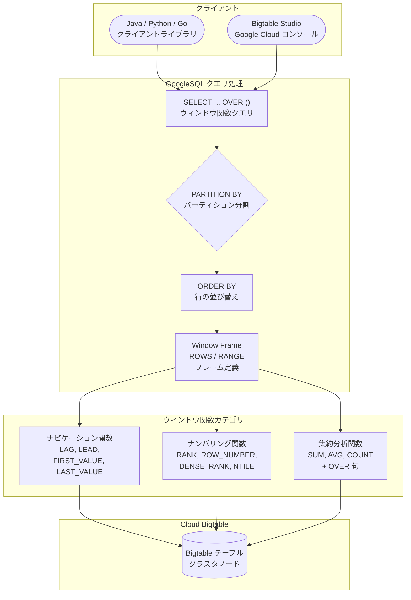

# Bigtable: GoogleSQL ウィンドウ関数の一般提供 (GA)

**リリース日**: 2026-04-23

**サービス**: Cloud Bigtable

**機能**: GoogleSQL ウィンドウ関数 (Window Functions)

**ステータス**: GA (一般提供)

:bar_chart: [このアップデートのインフォグラフィックを見る](https://takech9203.github.io/google-cloud-news-summary/20260423-bigtable-window-functions-ga.html)

## 概要

Cloud Bigtable において、GoogleSQL のウィンドウ関数 (Window Functions) が一般提供 (GA) となった。ウィンドウ関数は、テーブルの複数行にわたる高度な分析操作を可能にする機能であり、累積合計、移動平均、ランキング、パーセンタイル計算などの分析クエリを Bigtable 上で直接実行できるようになる。

GoogleSQL は BigQuery や Spanner でも使用されている ANSI 準拠の SQL 言語であり、今回のウィンドウ関数の GA により、Bigtable でも同等の分析構文が利用可能となった。これにより、Bigtable に格納された大規模な時系列データや IoT データに対して、データを外部サービスに移動させることなく、インプレースで高度な分析を実行できる。

対象ユーザーは、Bigtable を低レイテンシのアプリケーション開発に使用しているデータエンジニア、アプリケーション開発者、およびデータアナリストである。特に、時系列データの傾向分析やリアルタイムランキングなどのユースケースにおいて大きな価値を提供する。

**アップデート前の課題**

- Bigtable 上のデータに対してウィンドウ関数を使用した分析を行うには、BigQuery の外部テーブルや ETL パイプラインを経由してデータを移動する必要があった
- 累積合計や移動平均などの行間分析はアプリケーション側で実装する必要があり、開発コストが高かった
- Bigtable の GoogleSQL は基本的な SELECT クエリに限定されており、高度な分析関数が不足していた

**アップデート後の改善**

- Bigtable 上で直接ウィンドウ関数を使用した分析クエリが実行可能になった
- ナビゲーション関数 (LAG, LEAD, FIRST_VALUE, LAST_VALUE 等)、ナンバリング関数 (RANK, ROW_NUMBER, DENSE_RANK 等) が利用可能になった
- PARTITION BY、ORDER BY、ウィンドウフレーム句 (ROWS/RANGE) による柔軟な分析範囲の指定が可能になった
- データを外部サービスに移動させることなく、インプレースで分析を完結できるようになった

## アーキテクチャ図



GoogleSQL のウィンドウ関数クエリは、クライアントライブラリまたは Bigtable Studio から発行され、PARTITION BY によるパーティション分割、ORDER BY による並び替え、ウィンドウフレーム定義を経て、各種ウィンドウ関数がクラスタノード上で実行される。

## サービスアップデートの詳細

### 主要機能

1. **ナビゲーション関数**
   - `FIRST_VALUE`: 現在のウィンドウフレーム内の最初の行の値を取得
   - `LAST_VALUE`: 現在のウィンドウフレーム内の最後の行の値を取得
   - `LAG`: 現在の行より前の行の値を取得
   - `LEAD`: 現在の行より後の行の値を取得
   - `NTH_VALUE`: ウィンドウフレーム内の N 番目の行の値を取得
   - `PERCENTILE_CONT`: 線形補間を使用した連続パーセンタイル計算
   - `PERCENTILE_DISC`: 離散値のパーセンタイル計算

2. **ナンバリング関数**
   - `ROW_NUMBER`: ウィンドウ内の各行に連番を付与
   - `RANK`: ウィンドウ内の各行のランク (同順位あり、ギャップあり)
   - `DENSE_RANK`: ウィンドウ内の各行のランク (同順位あり、ギャップなし)
   - `NTILE`: 行を指定した数のバケットに均等分割
   - `CUME_DIST`: 累積分布 (相対位置) を計算
   - `PERCENT_RANK`: パーセンタイルランク (0 から 1) を計算

3. **集約分析関数との組み合わせ**
   - `SUM`, `AVG`, `COUNT` などの集約関数に `OVER` 句を付けてウィンドウ関数として使用可能
   - 累積合計、移動平均、範囲内カウントなどを計算可能

## 技術仕様

### ウィンドウ関数の構文

| 項目 | 詳細 |
|------|------|
| 基本構文 | `function_name(argument_list) OVER (window_specification)` |
| PARTITION BY | 入力行をパーティションに分割し、各パーティション内で独立に関数を評価 |
| ORDER BY | パーティション内の行の順序を定義 (ASC / DESC) |
| ウィンドウフレーム | `ROWS` (物理的な行オフセット) または `RANGE` (論理的な範囲) で定義 |
| Named Window | `WINDOW` 句で定義した名前付きウィンドウを再利用可能 |
| NULL 処理 | `RESPECT NULLS` / `IGNORE NULLS` で NULL 値の扱いを制御 (ナビゲーション関数) |

### ウィンドウフレームの境界

| 境界指定 | 説明 |
|----------|------|
| `UNBOUNDED PRECEDING` | パーティションの先頭 |
| `numeric_expression PRECEDING` | 現在行から N 行/値前 |
| `CURRENT ROW` | 現在の行 |
| `numeric_expression FOLLOWING` | 現在行から N 行/値後 |
| `UNBOUNDED FOLLOWING` | パーティションの末尾 |

### クエリ例: 累積合計

```sql
SELECT item, purchases, category,
  SUM(purchases) OVER (
    PARTITION BY category
    ORDER BY purchases
    ROWS BETWEEN UNBOUNDED PRECEDING AND CURRENT ROW
  ) AS total_purchases
FROM Produce
```

### クエリ例: 移動平均

```sql
SELECT item, purchases, category,
  AVG(purchases) OVER (
    ORDER BY purchases
    ROWS BETWEEN 1 PRECEDING AND 1 FOLLOWING
  ) AS avg_purchases
FROM Produce
```

### クエリ例: 範囲内の要素数

```sql
SELECT animal, population, category,
  COUNT(*) OVER (
    ORDER BY population
    RANGE BETWEEN 1 PRECEDING AND 1 FOLLOWING
  ) AS similar_population
FROM Farm
```

## 設定方法

### 前提条件

1. Cloud Bigtable インスタンスが作成済みであること (Enterprise または Enterprise Plus エディション)
2. GoogleSQL クエリを実行するためのクライアントライブラリがインストール済みであること
   - Java: `google-cloud-bigtable` バージョン 2.57.3 以降
   - Python: `python-bigtable` バージョン 2.30.1 以降
   - Go: `cloud.google.com/go/bigtable` バージョン 1.36.0 以降

### 手順

#### ステップ 1: Bigtable Studio でのクエリ実行

Google Cloud コンソールの Bigtable Studio で直接 SQL クエリを記述し実行できる。

```sql
-- ウィンドウ関数を使用した分析クエリの例
SELECT _key,
  sensor_data['temperature'],
  AVG(CAST(sensor_data['temperature'] AS FLOAT64)) OVER (
    ORDER BY _key
    ROWS BETWEEN 5 PRECEDING AND CURRENT ROW
  ) AS moving_avg_temp
FROM sensor_readings
```

#### ステップ 2: クライアントライブラリでのプログラム実行 (Java)

```java
// PreparedStatement でウィンドウ関数クエリを実行
PreparedStatement ps = client.prepareStatement(
    "SELECT _key, "
    + "metrics['value'], "
    + "RANK() OVER (ORDER BY CAST(metrics['value'] AS INT64) DESC) AS rank "
    + "FROM myTable"
);
BoundStatement bs = ps.bind().build();
try (ResultSet rs = client.executeQuery(bs)) {
    while (rs.next()) {
        // 結果を処理
    }
}
```

#### ステップ 3: クライアントライブラリでのプログラム実行 (Python)

```python
from google.cloud.bigtable.data import BigtableDataClientAsync

async def execute_window_query(project_id, instance_id):
    async with BigtableDataClientAsync(project=project_id) as client:
        query = (
            "SELECT _key, metrics['value'], "
            "ROW_NUMBER() OVER (ORDER BY CAST(metrics['value'] AS INT64) DESC) AS row_num "
            "FROM myTable"
        )
        async for row in await client.execute_query(query, instance_id):
            print(row["_key"], row["metrics['value']"], row["row_num"])
```

## メリット

### ビジネス面

- **データ移動コストの削減**: Bigtable 上でインプレース分析が可能になり、ETL パイプラインの構築・運用コストを削減できる
- **リアルタイム分析の実現**: 低レイテンシの Bigtable 上で直接分析クエリを実行でき、ビジネスインサイトの取得が高速化される
- **学習コストの低減**: BigQuery や Spanner と同じ GoogleSQL 構文を使用するため、既存の SQL スキルをそのまま活用できる

### 技術面

- **ANSI SQL 準拠**: 標準的なウィンドウ関数構文をサポートし、他のデータベースからの移行が容易
- **柔軟なウィンドウ定義**: ROWS (物理行) と RANGE (論理範囲) の両方をサポートし、多様な分析パターンに対応
- **クライアントライブラリ対応**: Java、Python、Go の各クライアントライブラリからプログラム的にウィンドウ関数クエリを実行可能

## デメリット・制約事項

### 制限事項

- GoogleSQL for Bigtable は `SELECT` 文のみをサポートしており、DML (`INSERT`, `UPDATE`, `DELETE`) や DDL (`CREATE`, `ALTER`, `DROP`) は非対応
- サブクエリ、`JOIN`、`UNION`、CTE (Common Table Expressions) は未サポート
- SQL クエリはクラスタノード上で NoSQL データリクエストと同様に処理されるため、フルテーブルスキャンや複雑なフィルタは避けるべき

### 考慮すべき点

- ウィンドウ関数の使用はクラスタノードのリソースを消費するため、大量の分析クエリを実行する場合はノード数の調整やオートスケーリングの設定を検討する必要がある
- 大規模なパーティション内での複雑なウィンドウ関数は、レイテンシに影響を与える可能性がある
- Bigtable の読み取りパフォーマンスに関するベストプラクティスを遵守し、効率的なクエリ設計を行うことが推奨される

## ユースケース

### ユースケース 1: IoT センサーデータの異常検知

**シナリオ**: 工場の IoT センサーから収集される温度データに対して、移動平均を計算し、急激な変動を検知する。

**実装例**:
```sql
SELECT _key,
  sensor_data['temperature'],
  AVG(CAST(sensor_data['temperature'] AS FLOAT64)) OVER (
    ORDER BY _key
    ROWS BETWEEN 10 PRECEDING AND CURRENT ROW
  ) AS moving_avg,
  CAST(sensor_data['temperature'] AS FLOAT64) -
  AVG(CAST(sensor_data['temperature'] AS FLOAT64)) OVER (
    ORDER BY _key
    ROWS BETWEEN 10 PRECEDING AND CURRENT ROW
  ) AS deviation
FROM sensor_readings
WHERE _key LIKE 'factory-01#sensor-A%'
```

**効果**: データを BigQuery に転送することなく、Bigtable 上で直接異常検知ロジックを実行でき、リアルタイム性の高い監視が可能になる。

### ユースケース 2: リアルタイムランキング

**シナリオ**: ゲームアプリケーションのスコアデータに対して、リアルタイムランキングを生成する。

**実装例**:
```sql
SELECT _key,
  CAST(scores['points'] AS INT64) AS points,
  RANK() OVER (
    ORDER BY CAST(scores['points'] AS INT64) DESC
  ) AS ranking,
  DENSE_RANK() OVER (
    ORDER BY CAST(scores['points'] AS INT64) DESC
  ) AS dense_ranking
FROM game_scores
```

**効果**: 低レイテンシの Bigtable 上でランキングを直接計算でき、アプリケーションサーバー側の処理負荷を軽減できる。

### ユースケース 3: 時系列データの傾向分析

**シナリオ**: 金融取引データに対して、累積取引量とパーセンタイル分析を行い、取引パターンを把握する。

**実装例**:
```sql
SELECT _key,
  CAST(trades['amount'] AS FLOAT64) AS amount,
  SUM(CAST(trades['amount'] AS FLOAT64)) OVER (
    PARTITION BY trades['symbol']
    ORDER BY _key
    ROWS BETWEEN UNBOUNDED PRECEDING AND CURRENT ROW
  ) AS cumulative_amount,
  PERCENT_RANK() OVER (
    PARTITION BY trades['symbol']
    ORDER BY CAST(trades['amount'] AS FLOAT64)
  ) AS percentile
FROM trading_data
```

**効果**: 取引データの累積傾向とパーセンタイル分布をリアルタイムに把握でき、市場分析の迅速化に貢献する。

## 料金

Bigtable の料金はエディション (Enterprise / Enterprise Plus) に基づくノード時間課金、ストレージ課金、ネットワーク課金で構成される。ウィンドウ関数クエリの実行自体に追加料金は発生しないが、クラスタノードのリソースを消費する。

### 料金例

| 項目 | Enterprise | Enterprise Plus |
|------|-----------|----------------|
| ノード料金 (SSD) | リージョンにより異なる (例: us-central1 で約 $0.65/ノード/時間) | Enterprise より高額なノード SKU |
| SSD ストレージ | $0.17/GB/月 | $0.17/GB/月 |
| HDD ストレージ | $0.026/GB/月 | $0.026/GB/月 |
| CUD 割引 (1年) | 20% | 20% |
| CUD 割引 (3年) | 40% | 40% |

詳細な料金は [Bigtable 料金ページ](https://cloud.google.com/bigtable/pricing) を参照。

## 利用可能リージョン

Bigtable は 40 以上のリージョンで利用可能であり、GoogleSQL ウィンドウ関数は全ての Bigtable リージョンで利用できる。利用可能なゾーンの一覧は [Bigtable ロケーション](https://cloud.google.com/bigtable/docs/locations) を参照。

## 関連サービス・機能

- **BigQuery**: Bigtable の外部テーブルを作成して BigQuery から SQL クエリを実行できる。BigQuery でも同じ GoogleSQL ウィンドウ関数構文が利用可能であり、バッチ分析や複数データソースの統合分析に適している
- **Bigtable Data Boost**: サーバーレスコンピューティングによる高スループット読み取りジョブを提供。Enterprise Plus エディションでは Data Boost で SQL クエリのサポートも利用可能
- **Bigtable エディション**: Enterprise と Enterprise Plus の 2 つのエディションが提供されており、Enterprise Plus では高度な分析クエリ機能や Data Boost の SQL サポートなど追加機能が利用可能
- **Bigtable 連続マテリアライズドビュー**: SQL クエリの事前計算結果を連続的に更新するビュー機能。ウィンドウ関数と組み合わせることで、効率的な分析パイプラインを構築可能
- **Spark SQL**: Bigtable Spark コネクタを使用したバッチ処理や ETL において、Spark SQL からもウィンドウ関数に相当する分析が可能
- **Cloud Spanner**: 同じ GoogleSQL を採用しており、ウィンドウ関数の構文に互換性がある。リレーショナルデータベースが必要な場合の代替選択肢

## 参考リンク

- :bar_chart: [インフォグラフィック](https://takech9203.github.io/google-cloud-news-summary/20260423-bigtable-window-functions-ga.html)
- [公式リリースノート](https://docs.cloud.google.com/release-notes#April_23_2026)
- [GoogleSQL for Bigtable ウィンドウ関数リファレンス](https://docs.cloud.google.com/bigtable/docs/reference/sql/window-functions)
- [ウィンドウ関数呼び出し構文](https://docs.cloud.google.com/bigtable/docs/reference/sql/window-function-calls)
- [ナビゲーション関数リファレンス](https://docs.cloud.google.com/bigtable/docs/reference/sql/navigation_functions)
- [ナンバリング関数リファレンス](https://docs.cloud.google.com/bigtable/docs/reference/sql/numbering_functions)
- [GoogleSQL for Bigtable 概要](https://docs.cloud.google.com/bigtable/docs/googlesql-overview)
- [Bigtable SQL 入門](https://docs.cloud.google.com/bigtable/docs/introduction-sql)
- [Bigtable エディション概要](https://docs.cloud.google.com/bigtable/docs/editions-overview)
- [料金ページ](https://cloud.google.com/bigtable/pricing)

## まとめ

Bigtable における GoogleSQL ウィンドウ関数の GA は、NoSQL データベースでありながら高度な SQL 分析機能を提供するという点で重要なマイルストーンである。累積合計、移動平均、ランキングなどの分析をデータ移動なしに Bigtable 上で直接実行できるようになったことで、リアルタイム分析のアーキテクチャが大幅に簡素化される。Bigtable を使用している組織は、既存のデータパイプラインの見直しを行い、ウィンドウ関数の活用によりアーキテクチャの最適化を検討することを推奨する。

---

**タグ**: #Bigtable #GoogleSQL #WindowFunctions #GA #Analytics #SQL #NoSQL #TimeSeries #IoT
