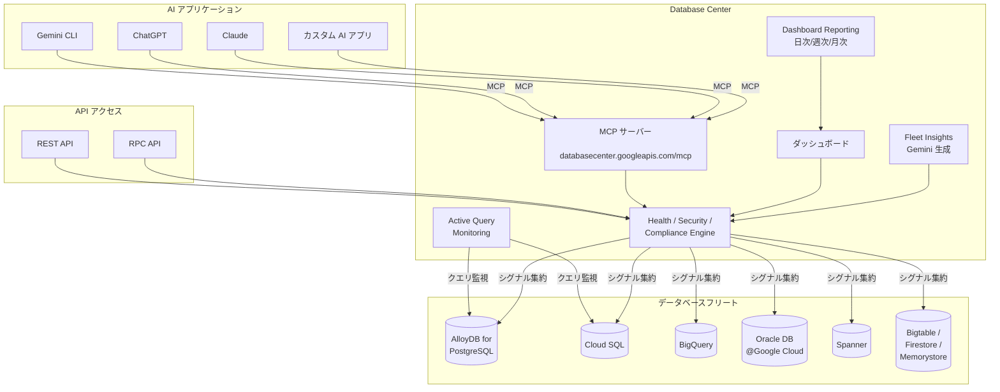

# Database Center: API / MCP / Fleet Insights ほか 7 機能の大型アップデート

**リリース日**: 2026-04-24

**サービス**: Database Center

**機能**: REST/RPC API (Preview)、MCP サポート (GA)、Fleet Insights (Preview)、Dashboard Reporting (Preview)、BigQuery モニタリング (Preview)、Active Query Monitoring、Oracle Database@Google Cloud モニタリング (GA)

**ステータス**: GA (MCP、Oracle Database@Google Cloud) / Preview (API、Fleet Insights、Dashboard Reporting、BigQuery モニタリング)

[このアップデートのインフォグラフィックを見る](https://takech9203.github.io/google-cloud-news-summary/20260424-database-center-api-mcp-fleet-insights.html)

## 概要

Google Cloud の Database Center に 7 つの機能が同時にリリースされた。Database Center は組織全体のデータベースフリートの健全性、セキュリティ、コンプライアンスを一元的に可視化する AI 支援ダッシュボードであり、今回のアップデートにより API アクセス、AI アプリケーション連携、Gemini によるインサイト生成、レポート自動化、BigQuery リソース監視、アクティブクエリ監視、Oracle Database@Google Cloud の本番対応など、プラットフォームとしての機能が大幅に拡充された。

特に注目すべきは、Model Context Protocol (MCP) サポートの GA リリースである。Gemini CLI、ChatGPT、Claude などの AI アプリケーションから Database Center のリモート MCP サーバーに直接接続し、フリートの健全性レビュー、インベントリ監査、セキュリティ問題の確認を AI 経由で実行できるようになった。これにより、データベース管理における AI 活用が本格的に実用段階に入ったといえる。

また、REST/RPC API の Preview 公開により、プログラマティックなアクセスが可能になり、カスタムツールや自動化パイプラインとの統合が容易になった。Fleet Insights では Gemini がインベントリとパフォーマンスのインサイトを自動生成し、Dashboard Reporting ではフリートの状態を定期レポートとして配信できる。対象ユーザーはデータベースプラットフォームチーム、SRE、コンプライアンス担当者、セキュリティ担当者など多岐にわたる。

**アップデート前の課題**

- Database Center の操作は Google Cloud コンソールの GUI に限定されており、プログラマティックなアクセスや自動化が困難だった
- AI アプリケーションからデータベースフリートの状態を直接照会する標準的な方法がなかった
- フリートのパフォーマンスインサイトは手動で分析する必要があり、問題の特定に時間がかかった
- フリートの健全性レポートを定期的にステークホルダーに共有するには手動作業が必要だった
- BigQuery リソースは Database Center の監視対象外であり、別途管理が必要だった
- フリート全体のアクティブクエリを横断的に監視する手段が限られていた
- Oracle Database@Google Cloud の監視は Preview 段階であり、本番環境での利用に制約があった

**アップデート後の改善**

- REST/RPC API により、スクリプトやカスタムツールから Database Center のデータにプログラマティックにアクセス可能になった
- MCP サポートの GA により、Gemini CLI や Claude などの AI アプリケーションから自然言語でフリート管理が可能になった
- Gemini が自動生成する Fleet Insights により、パフォーマンス問題の特定と理解が迅速化された
- Dashboard Reporting により、日次・週次・月次のフリートレポートを自動配信できるようになった
- BigQuery のデータセットやリザベーション数を Database Center で一元監視できるようになった
- AlloyDB for PostgreSQL と Cloud SQL のアクティブクエリをフリート全体で横断監視できるようになった
- Oracle Database@Google Cloud の監視が GA となり、本番環境で安心して利用できるようになった

## アーキテクチャ図



Database Center がデータベースフリート全体の健全性シグナルを集約し、REST/RPC API、MCP サーバー、ダッシュボードの 3 つのインターフェースを通じてアクセスを提供するアーキテクチャを示している。AI アプリケーションは MCP 経由で接続し、Gemini が Fleet Insights を自動生成する。

## サービスアップデートの詳細

### GA リリース (本番利用可能)

1. **MCP サポート (GA)**
   - Database Center のリモート MCP サーバー (`https://databasecenter.googleapis.com/mcp`) を通じて AI アプリケーションから接続可能
   - Gemini CLI、ChatGPT、Claude などの主要 AI アプリケーションに対応
   - 提供される MCP ツール:
     - `list_products`: フィルタリングに使用可能なデータベース製品の一覧取得
     - `list_fleet_inventory`: フリートのインベントリ統計情報の集約取得
     - `list_fleet_health_issues`: フリート全体のヘルスシグナル統計の取得
     - `list_fleet_issues`: アクセス可能な課題と推奨事項の一覧取得
     - `list_fleet_resource_groups`: データベースリソースグループの一覧取得
   - OAuth 2.0 認証 (`https://www.googleapis.com/auth/cloud-platform` スコープ) を使用
   - 必要な IAM ロール: `roles/mcp.toolUser` + `roles/databasecenter.viewer`

2. **Oracle Database@Google Cloud モニタリング (GA)**
   - Oracle Exadata、VM Clusters、Autonomous AI Databases のインベントリ、メトリクス、アラートの監視が GA
   - 2025 年 10 月の Preview から GA に昇格し、ヘルスイシューの監視にも対応
   - Critical / High / Medium / Low の 4 段階の優先度でヘルスイシューを分類
   - Cloud Monitoring との統合によるカスタムダッシュボードとアラート設定が可能
   - 必要な IAM ロール: `roles/databasecenter.viewer` + `roles/oracledatabase.viewer`

### Preview リリース

3. **REST / RPC API (Preview)**
   - サービスエンドポイント: `https://databasecenter.googleapis.com`
   - 主要な API メソッド:
     - `aggregateFleet`: フリート統計の集約 (製品タイプ、エンジン、ロケーションなどでグルーピング)
     - `aggregateIssueStats`: データベースリソースの課題統計の集約
     - `queryDatabaseResourceGroups`: データベースグループのページネーション付き取得
     - `queryIssues`: 課題と推奨事項の一覧取得
     - `queryProducts`: フィルタリング用の製品一覧取得
   - Google 提供のクライアントライブラリの利用を推奨
   - Discovery Document: `https://databasecenter.googleapis.com/$discovery/rest?version=v1beta`

4. **Fleet Insights (Preview)**
   - Gemini がインベントリとパフォーマンスのインサイトを自動生成
   - CPU 飽和によるレイテンシなど、特定のパフォーマンス問題を特定・理解するためのカードを表示
   - 各インサイトカードから影響を受けるリソースの詳細一覧にドリルダウン可能
   - `roles/recommender.viewer` IAM 権限が必要

5. **Dashboard Reporting (Preview)**
   - カスタマイズされたダッシュボードビューに対して日次、週次、月次の自動レポートを設定可能
   - レポートには Notification Channels を通じて受信者を設定
   - Views and Reports ページでレポートの一元管理が可能
   - レポートの頻度、対象ビュー、受信者を柔軟に設定

6. **BigQuery モニタリング (Preview)**
   - BigQuery のデータセットとリザベーション数を Database Center のリソーステーブルで監視可能
   - 既存のフリートインベントリビューに BigQuery リソースが統合される
   - BigQuery を含む組織全体のデータベースフリートの一元管理が実現

7. **Active Query Monitoring**
   - フリート全体のアクティブクエリを横断的に監視し、スロークエリなどの問題を特定・分析
   - 対応データベース: AlloyDB for PostgreSQL、Cloud SQL
   - Database Center の Performance ページから利用可能
   - AlloyDB では Advanced Query Insights 機能との連携で、正規化クエリ、待機イベント分析、上位 50 件のトランザクション表示が可能

## 技術仕様

### MCP サーバー構成

| 項目 | 詳細 |
|------|------|
| サーバー名 | Database Center MCP server |
| エンドポイント | `https://databasecenter.googleapis.com/mcp` |
| トランスポート | HTTP (リモート MCP サーバー) |
| 認証 | OAuth 2.0 |
| OAuth スコープ | `https://www.googleapis.com/auth/cloud-platform` |
| 必要な IAM ロール | `roles/mcp.toolUser`, `roles/databasecenter.viewer` |

### REST API メソッド一覧

| メソッド | HTTP | パス | 説明 |
|----------|------|------|------|
| AggregateFleet | GET | `/v1beta:aggregateFleet` | フリート統計の集約取得 |
| AggregateIssueStats | POST | `/v1beta:aggregateIssueStats` | 課題統計の集約取得 |
| QueryDatabaseResourceGroups | POST | `/v1beta:queryDatabaseResourceGroups` | リソースグループの一覧取得 |
| QueryIssues | POST | `/v1beta:queryIssues` | 課題と推奨事項の取得 |
| QueryProducts | GET | `/v1beta:queryProducts` | 製品一覧の取得 |

### 対応データベース製品

| 製品 | ヘルスイシュー | インベントリ | Active Query | ステータス |
|------|---------------|-------------|--------------|-----------|
| AlloyDB for PostgreSQL | 対応 | 対応 | 対応 | GA |
| Cloud SQL (MySQL/PostgreSQL/SQL Server) | 対応 | 対応 | 対応 | GA |
| Spanner | 対応 | 対応 | - | GA |
| Bigtable | 対応 | 対応 | - | GA |
| Firestore | 対応 | 対応 | - | GA |
| Memorystore | 対応 | 対応 | - | GA |
| Oracle Database@Google Cloud | 対応 | 対応 | - | GA |
| BigQuery | - | 対応 | - | Preview |
| MySQL on Compute Engine | 対応 | 対応 | - | Preview |
| PostgreSQL on Compute Engine | 対応 | 対応 | - | Preview |
| SQL Server on Compute Engine | 対応 | 対応 | - | Preview |

## 設定方法

### 前提条件

1. Database Center が組織レベルでセットアップされていること
2. Database Center API が有効化されていること
3. 適切な IAM ロールが付与されていること

### 手順

#### ステップ 1: Database Center API の有効化

```bash
# Database Center API を有効化
gcloud services enable databasecenter.googleapis.com
```

API を有効化するには `roles/serviceusage.serviceUsageAdmin` IAM ロールが必要。

#### ステップ 2: MCP クライアントの設定 (Claude の場合)

```json
{
  "mcpServers": {
    "database-center": {
      "url": "https://databasecenter.googleapis.com/mcp",
      "transport": "http",
      "auth": {
        "type": "oauth2",
        "scope": "https://www.googleapis.com/auth/cloud-platform"
      }
    }
  }
}
```

AI アプリケーション側で MCP サーバーの URL とOAuth 認証情報を設定する。

#### ステップ 3: MCP ツールの確認

```bash
# 利用可能な MCP ツールの一覧を取得
curl --location 'https://databasecenter.googleapis.com/mcp' \
  --header 'content-type: application/json' \
  --header 'accept: application/json, text/event-stream' \
  --data '{
    "method": "tools/list",
    "jsonrpc": "2.0",
    "id": 1
  }'
```

`tools/list` メソッドは認証不要で利用可能。

#### ステップ 4: Dashboard Reporting の設定

1. Google Cloud コンソールで Database Center を開く
2. ナビゲーションペインで「Views and Reports」をクリック
3. 「Create new report」をクリック
4. レポート名、頻度 (Daily / Weekly / Monthly)、対象ビューを設定
5. Notification Channels で受信者を設定
6. 「Submit」をクリック

## メリット

### ビジネス面

- **データベースガバナンスの強化**: 組織全体のデータベースフリートを一元管理し、コンプライアンスリスクやセキュリティ問題を迅速に特定できる。複数プロジェクト・複数製品にまたがるデータベース資産の可視性が大幅に向上する
- **運用効率の向上**: AI アプリケーション経由の自然言語によるフリート管理、自動レポート配信、Gemini によるインサイト自動生成により、データベース管理の工数を削減できる
- **マルチデータベース戦略の統合管理**: AlloyDB、Cloud SQL、BigQuery、Oracle Database@Google Cloud、Spanner などの異なるデータベース製品を単一のプラットフォームで管理でき、サイロ化を防止できる

### 技術面

- **API 駆動の自動化**: REST/RPC API と MCP により、カスタムツールや CI/CD パイプラインとの統合が可能になり、Infrastructure as Code やプログラマティックな監視が実現する
- **AI ネイティブな運用**: MCP の GA により、AI アプリケーションがデータベース運用のファーストクラスのインターフェースとなる。Gemini による Fleet Insights も加わり、問題の検出から分析、対応までの AI 支援が強化された
- **パフォーマンス問題の早期検出**: Active Query Monitoring により、スロークエリや CPU 飽和などのパフォーマンス問題をフリート全体で横断的に監視し、問題が拡大する前に対処できる

## デメリット・制約事項

### 制限事項

- REST/RPC API は現在 `v1beta` であり、Preview 段階のため仕様変更の可能性がある
- Fleet Insights、Dashboard Reporting、BigQuery モニタリングは Preview であり、限定的なサポート提供となる
- Database Center のデータはリアルタイムではなく、通常数分以内に更新されるが最大 24 時間かかる場合がある
- Active Query Monitoring は現時点で AlloyDB for PostgreSQL と Cloud SQL のみ対応
- BigQuery モニタリングはデータセットとリザベーション数に限定されており、クエリパフォーマンスの監視は含まれない

### 考慮すべき点

- MCP サーバーへの接続には適切な OAuth 認証とIAM ロールの設定が必要であり、AI エージェント用の個別 ID 作成が推奨されている
- Security Command Center との連携を最大限活用するには Premium ティアの有効化が必要
- Preview 機能は「Pre-GA Offerings Terms」の対象であり、本番ワークロードでの利用は慎重に検討すべき

## ユースケース

### ユースケース 1: AI エージェントによるデータベースフリート管理

**シナリオ**: SRE チームが Gemini CLI を使って、毎朝のデータベースフリートの健全性チェックを自然言語で実施する。

**実装例**:
```
# Gemini CLI から Database Center MCP ツールを使用
> フリート全体のヘルスイシューの概要を教えてください

[MCP ツール: list_fleet_health_issues を呼び出し]
フリート全体で 12 件のヘルスイシューが検出されました。
- Critical: 2 件 (可用性設定の不備)
- High: 4 件 (バックアップ未設定)
- Medium: 6 件 (セキュリティベストプラクティスからの逸脱)

> Critical の 2 件の詳細を教えてください

[MCP ツール: list_fleet_issues を呼び出し]
...
```

**効果**: GUI を操作することなく、AI との対話でフリートの状態を把握でき、問題の特定から対応策の検討まで一貫して AI 支援を受けられる。

### ユースケース 2: 自動化された定期レポートによるガバナンス強化

**シナリオ**: データベースプラットフォームチームが、本番環境・開発環境のデータベースフリートの健全性レポートを週次で経営層とセキュリティチームに自動配信する。

**効果**: Dashboard Reporting により手動でのレポート作成が不要になり、コンプライアンスやセキュリティの状況をステークホルダーに定期的に共有できる。問題の早期発見と対応の迅速化に貢献する。

### ユースケース 3: マルチデータベース環境のスロークエリ横断分析

**シナリオ**: AlloyDB for PostgreSQL と Cloud SQL を併用するマイクロサービスアーキテクチャにおいて、Active Query Monitoring で全データベースのアクティブクエリを横断監視し、スロークエリをリアルタイムに検出する。

**効果**: 個別のデータベースごとにクエリパフォーマンスを確認する必要がなくなり、フリート全体のパフォーマンス問題を一元的に把握・対応できる。

## 料金

Database Center 自体の利用料金については、公式ドキュメントで明示的な料金ページは提供されていない。Database Center は Google Cloud コンソールの機能として提供されており、監視対象のデータベース製品の料金に含まれる形態と考えられる。ただし、以下の関連コストに注意が必要である。

- **Security Command Center**: セキュリティ関連のヘルスイシューを最大限活用するには Premium ティアが必要 (別途料金)
- **Gemini Cloud Assist**: Fleet Insights やチャット機能の利用には Gemini Cloud Assist の有効化が必要
- **AlloyDB Advanced Query Insights**: Active Query Monitoring に関連するデータストレージで追加料金が発生する可能性がある
- **Oracle Database@Google Cloud**: Oracle のライセンスおよびインフラ費用は別途発生

詳細は [Database Center ドキュメント](https://docs.cloud.google.com/database-center/docs/overview) を参照。

## 利用可能リージョン

Database Center はグローバルサービスとして提供されており、組織レベルまたはプロジェクトレベルで利用可能。MCP サーバーのエンドポイント (`https://databasecenter.googleapis.com/mcp`) はグローバルエンドポイントとして提供されている。監視対象のデータベースリソースのリージョンに依存せず、全リージョンのリソースを一元管理できる。

## 関連サービス・機能

- **AlloyDB for PostgreSQL**: Active Query Monitoring と Advanced Query Insights の連携により、詳細なクエリパフォーマンス分析が可能
- **Cloud SQL**: Active Query Monitoring の対象データベース。ヘルスイシューの検出対象としても最も多くの項目に対応
- **Oracle Database@Google Cloud**: 今回 GA となった監視対象。Exadata、VM Clusters、Autonomous AI Databases のインベントリとヘルスイシューを監視
- **BigQuery**: 新たに Database Center の監視対象に追加。データセットとリザベーション数を監視
- **Cloud Monitoring**: Oracle Database@Google Cloud のカスタムダッシュボードやアラート設定に使用
- **Gemini Cloud Assist**: Fleet Insights の生成、パフォーマンス推奨事項、コスト最適化推奨事項を提供
- **Security Command Center**: セキュリティ関連のヘルスイシュー検出に使用。Premium ティアで全セキュリティイシューに対応
- **VPC Service Controls**: Database Center と統合してサービスペリメーターによるデータ保護が可能

## 参考リンク

- [インフォグラフィック](https://takech9203.github.io/google-cloud-news-summary/20260424-database-center-api-mcp-fleet-insights.html)
- [公式リリースノート](https://docs.cloud.google.com/release-notes#April_24_2026)
- [Database Center 概要](https://docs.cloud.google.com/database-center/docs/overview)
- [Database Center API リファレンス (REST)](https://docs.cloud.google.com/database-center/docs/reference/rest)
- [Database Center API リファレンス (RPC)](https://docs.cloud.google.com/database-center/docs/reference/rpc)
- [Database Center MCP サーバーの使用方法](https://docs.cloud.google.com/database-center/docs/use-database-center-mcp)
- [Database Center MCP ツールリファレンス](https://docs.cloud.google.com/database-center/docs/reference/mcp)
- [Fleet Insights - パフォーマンス監視](https://docs.cloud.google.com/database-center/docs/performance#fleet-performance-insights)
- [Dashboard Reporting](https://docs.cloud.google.com/database-center/docs/report)
- [Oracle Database@Google Cloud リソースヘルス監視](https://docs.cloud.google.com/oracle/database/docs/monitor-resource-health)
- [サポートされるヘルスイシュー](https://docs.cloud.google.com/database-center/docs/database-health-issues#supported-health-issues)

## まとめ

今回の Database Center の大型アップデートは、データベースフリート管理における AI 活用とプログラマティックアクセスの本格化を象徴するものである。特に MCP サポートの GA は、AI アプリケーションからデータベース運用を行う新しいパラダイムを確立し、REST/RPC API の公開と合わせて Database Center のプラットフォームとしての拡張性を大きく高めた。複数のデータベース製品を運用する組織では、Database Center を中心としたフリート管理戦略の検討を推奨する。まずは MCP サーバーへの接続を試し、AI 支援によるフリート管理の効果を体験することから始めるとよい。

---

**タグ**: #DatabaseCenter #MCP #ModelContextProtocol #FleetManagement #API #GeminiAI #AlloyDB #CloudSQL #OracleDatabase #BigQuery #DatabaseMonitoring #ActiveQueryMonitoring #FleetInsights #DashboardReporting #GoogleCloud
