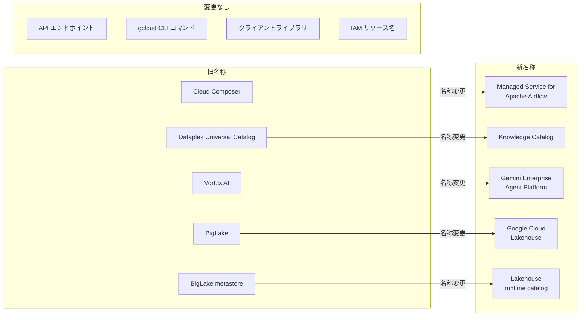

# Google Cloud: 2026 年 4 月 主要プロダクト リブランディング

**リリース日**: 2026-04-24

**サービス**: Google Cloud (複数プロダクト)

**機能**: Cloud Composer、Dataplex Universal Catalog、Vertex AI、BigLake の名称変更

**ステータス**: 適用済み

[このアップデートのインフォグラフィックを見る](https://takech9203.github.io/google-cloud-news-summary/20260424-google-cloud-product-rebranding-april-2026.html)

## 概要

2026 年 4 月 24 日、Google Cloud は主要プロダクト 4 つの名称変更を一斉に発表した。Cloud Composer は「Managed Service for Apache Airflow (Managed Airflow)」に、Dataplex Universal Catalog は「Knowledge Catalog」に、Vertex AI は「Gemini Enterprise Agent Platform」に、BigLake は「Google Cloud Lakehouse」にそれぞれリブランディングされた。BigLake metastore も「Lakehouse runtime catalog」に改称されている。

今回のリブランディングは、Google Cloud が AI エージェント、データガバナンス、オープンレイクハウスといった戦略的方向性をプロダクト名称に反映させたものである。各プロダクトの機能自体に変更はなく、API エンドポイント、クライアントライブラリ、gcloud CLI コマンド、IAM リソース名はすべて従来のまま維持される。そのため、既存のコード、自動化スクリプト、Terraform 構成に対する変更は不要である。

このリブランディングは、Google Cloud のプロダクトポートフォリオが「AI エージェントプラットフォーム」「インテリジェントデータカタログ」「オープンレイクハウス」「マネージドワークフロー」という 4 つの柱に再編されたことを示している。

**アップデート前の課題**

- Cloud Composer という名称からは Apache Airflow のマネージドサービスであることが直感的に伝わりにくかった
- Dataplex Universal Catalog という名称は、AI エージェント向けのナレッジグラフ機能を反映していなかった
- Vertex AI という名称は、エージェント開発プラットフォームとしての包括的な機能セットを十分に表現していなかった
- BigLake という名称は、Apache Iceberg ベースのオープンレイクハウスとしての位置づけを明確に示していなかった

**アップデート後の改善**

- Managed Service for Apache Airflow: Apache Airflow のマネージドサービスであることが名称から明確に伝わるようになった
- Knowledge Catalog: AI エージェントへのコンテキスト提供、セマンティック検索、データガバナンスの統合を名称が反映するようになった
- Gemini Enterprise Agent Platform: Gemini モデルを中心としたエージェント構築・デプロイ・ガバナンスの統合プラットフォームであることが明示された
- Google Cloud Lakehouse: Apache Iceberg をベースとしたオープンレイクハウスアーキテクチャであることが名称から明確になった

## アーキテクチャ図



旧名称から新名称へのマッピングを示す。API、CLI、クライアントライブラリ、IAM リソースはすべて従来のまま維持される。

## サービスアップデートの詳細

### 主要機能

1. **Cloud Composer → Managed Service for Apache Airflow (Managed Airflow)**
   - Apache Airflow のフルマネージドサービスであることを名称に明示
   - Gen 1 (Legacy)、Gen 2、Gen 3 の 3 世代構成は従来通り
   - Gen 3 では Airflow 3 のサポート、CeleryKubernetes Executor、DAG プロセッサなどの機能を提供
   - API は `composer` のまま、gcloud コマンドも `gcloud composer` のまま使用可能

2. **Dataplex Universal Catalog → Knowledge Catalog**
   - Gemini を活用した AI パワードデータカタログとしての位置づけを名称に反映
   - コンテキストグラフ (Context Graph) によるメタデータ、ビジネスロジック、データ関係の統合管理
   - Model Context Protocol (MCP) を通じた AI エージェントへのエンタープライズデータの提供
   - 非構造化データ (PDF 等) からのエンティティ・関係の自動抽出機能
   - API は `dataplex` のまま、gcloud コマンドも `gcloud dataplex` のまま使用可能

3. **Vertex AI → Gemini Enterprise Agent Platform**
   - AI エージェントの構築 (Build)・スケール (Scale)・ガバナンス (Govern)・最適化 (Optimize) の 4 つの柱で構成
   - Agent Development Kit (ADK)、Agent Studio、Agent Garden、Model Garden、RAG Engine、Vector Search などの Build ツール
   - Agent Runtime、Agent Platform Sessions、Memory Bank などの Scale 機能
   - Agent Registry、Agent Identity、Agent Gateway などの Govern 機能
   - Agent Evaluation、Observability などの Optimize 機能
   - API は `aiplatform` (vertex-ai) のまま使用可能

4. **BigLake → Google Cloud Lakehouse / BigLake metastore → Lakehouse runtime catalog**
   - Apache Iceberg ベースのオープンレイクハウスアーキテクチャを名称に反映
   - Cloud Storage と BigQuery をストレージレイヤーとし、Apache Spark、Apache Flink、Trino など複数エンジンとの相互運用性を提供
   - Lakehouse runtime catalog は Apache Iceberg REST カタログエンドポイントと BigQuery カスタムエンドポイントの 2 つのインターフェースを提供
   - API は `biglake` のまま、gcloud コマンドも `gcloud biglake` のまま使用可能

## 技術仕様

### 名称変更マッピング一覧

| 旧名称 | 新名称 | API/CLI の変更 |
|--------|--------|---------------|
| Cloud Composer | Managed Service for Apache Airflow (Managed Airflow) | 変更なし (`composer`) |
| Dataplex Universal Catalog | Knowledge Catalog | 変更なし (`dataplex`) |
| Vertex AI | Gemini Enterprise Agent Platform | 変更なし (`aiplatform`) |
| BigLake | Google Cloud Lakehouse | 変更なし (`biglake`) |
| BigLake metastore | Lakehouse runtime catalog | 変更なし (`biglake`) |

### 影響範囲

| 項目 | 影響 |
|------|------|
| API エンドポイント | 変更なし。既存のエンドポイントはそのまま利用可能 |
| クライアントライブラリ | 変更なし。パッケージ名・インポートパスは従来通り |
| gcloud CLI コマンド | 変更なし。`gcloud composer`、`gcloud dataplex`、`gcloud biglake` 等はそのまま |
| IAM ロール・権限 | 変更なし。既存のロール名・権限名は従来通り |
| Terraform リソース | 変更なし。`google_composer_environment` 等はそのまま |
| Google Cloud コンソール | ナビゲーションメニューが更新。ブックマークは自動リダイレクト |
| ドキュメント URL | 一部変更あり (例: `docs.cloud.google.com/gemini-enterprise-agent-platform/`)。旧 URL はリダイレクト |

### Vertex AI から Gemini Enterprise Agent Platform への主要機能名変更

Vertex AI のリブランディングに伴い、サブ機能の名称も多数変更されている。

| Vertex AI 時の名称 | Agent Platform での名称 |
|-------------------|----------------------|
| Vertex AI Studio | Agent Studio |
| Vertex AI Agent Engine | Agent Runtime |
| Vertex AI Agent Engine Sessions | Agent Platform Sessions |
| Vertex AI Agent Engine Memory Bank | Agent Platform Memory Bank |
| Vertex AI Search | Agent Search |
| Vertex AI RAG Engine | RAG Engine |
| Vertex AI Vector Search | Vector Search |
| Vertex AI Training | Agent Platform Managed Training |
| Vertex AI Prediction / Inference | Agent Platform Inference |
| Vertex AI Pipelines | Agent Platform Pipelines |
| Vertex AI Notebooks | Agent Platform Notebooks |
| Vertex AI Colab Enterprise | Agent Platform Colab Enterprise |
| Vertex AI Model Garden | Model Garden |

## メリット

### ビジネス面

- **明確なプロダクトポジショニング**: 各プロダクトの役割と価値提案が名称から直感的に理解できるようになり、意思決定者への説明が容易になった
- **AI エージェント戦略の可視化**: Gemini Enterprise Agent Platform という名称により、Google Cloud が AI エージェント開発の統合プラットフォームを提供していることが明確になった
- **オープンスタンダードへのコミットメント**: Managed Service for Apache Airflow、Google Cloud Lakehouse (Apache Iceberg ベース) という名称が、オープンソース技術へのコミットメントを示している

### 技術面

- **移行不要**: API、CLI、IAM リソース名が変更されないため、既存のインフラストラクチャやコードの修正が不要
- **自動リダイレクト**: Google Cloud コンソールのブックマークやドキュメントの旧 URL は自動的にリダイレクトされる
- **後方互換性の維持**: 既存のデプロイメント、構成、メタデータはすべてそのまま動作する

## デメリット・制約事項

### 制限事項

- ドキュメント URL が一部変更されているため、ドキュメントへの直リンクを管理しているシステムでは確認が必要 (旧 URL はリダイレクトされる)
- Google Cloud コンソールのナビゲーション構造が変更されているため、操作手順書やスクリーンショットの更新が必要になる場合がある

### 考慮すべき点

- 社内ドキュメントやトレーニング資料で旧名称を使用している場合、混乱を避けるために段階的に新名称への更新を推奨
- Google Cloud パートナー資格や認定試験の内容が更新される可能性があるため、関連するチームへの周知が望ましい
- 監査ログやモニタリングダッシュボードで旧名称のサービス名を検索条件に使用している場合、API 名が変わらないため動作に影響はないが、表示名の確認を推奨

## ユースケース

### ユースケース 1: 既存 Terraform / IaC 構成の確認

**シナリオ**: Cloud Composer、Dataplex、Vertex AI、BigLake を利用中の組織が、リブランディング後も既存のインフラ構成が正常に動作するか確認したい。

**確認ポイント**:
```hcl
# 以下の Terraform リソース名は変更不要
resource "google_composer_environment" "example" { ... }
resource "google_dataplex_lake" "example" { ... }
resource "google_vertex_ai_endpoint" "example" { ... }
resource "google_biglake_table" "example" { ... }
```

**効果**: API 名・リソース名が変更されないため、既存の IaC 構成はそのまま動作する。コードの変更やリデプロイは不要。

### ユースケース 2: 社内ナレッジベースの更新

**シナリオ**: 社内の技術ドキュメントや Wiki で旧名称を使用しており、新名称への対応が必要。

**効果**: 段階的に新名称への更新を行うことで、チーム内の混乱を防ぎ、Google Cloud の公式ドキュメントとの整合性を保てる。新名称は各プロダクトの機能をより的確に表現しているため、新規メンバーのオンボーディングにも有効。

## 料金

今回のリブランディングに伴う料金体系の変更はない。各プロダクトの料金は従来通り適用される。

- [Managed Airflow (Cloud Composer) の料金](https://docs.cloud.google.com/composer/pricing)
- [Knowledge Catalog (Dataplex) の料金](https://cloud.google.com/dataplex/pricing)
- [Gemini Enterprise Agent Platform (Vertex AI) の料金](https://cloud.google.com/vertex-ai/pricing)
- [Google Cloud Lakehouse (BigLake) の料金](https://cloud.google.com/bigquery/pricing)

## 関連サービス・機能

- **Managed Service for Apache Airflow (旧 Cloud Composer)**: Apache Airflow のワークフローオーケストレーション。Dataform、BigQuery、Dataproc 等と連携してデータパイプラインを構築
- **Knowledge Catalog (旧 Dataplex Universal Catalog)**: データガバナンスとメタデータ管理。BigQuery、Cloud Storage、AlloyDB、Spanner 等からメタデータを自動収集し、AI エージェントにコンテキストを提供
- **Gemini Enterprise Agent Platform (旧 Vertex AI)**: AI エージェントの構築・デプロイ・ガバナンスの統合プラットフォーム。Agent Development Kit、Agent Studio、Agent Runtime、Model Garden 等を含む
- **Google Cloud Lakehouse (旧 BigLake)**: Apache Iceberg ベースのオープンレイクハウス。Cloud Storage をストレージレイヤーとし、BigQuery、Apache Spark、Apache Flink、Trino 等の複数エンジンから統一的にアクセス可能
- **Dataform**: Knowledge Catalog と連携するデータ変換サービス。今回の Dataform リリースノートにてリブランディング情報が公開された

## 参考リンク

- [このアップデートのインフォグラフィック](https://takech9203.github.io/google-cloud-news-summary/20260424-google-cloud-product-rebranding-april-2026.html)
- [公式リリースノート](https://docs.cloud.google.com/release-notes#April_24_2026)
- [Managed Airflow (Cloud Composer) 概要](https://docs.cloud.google.com/composer/docs/latest/composer-overview)
- [Knowledge Catalog 概要](https://docs.cloud.google.com/dataplex/docs/introduction)
- [Gemini Enterprise Agent Platform 概要](https://docs.cloud.google.com/gemini-enterprise-agent-platform/overview)
- [Gemini Enterprise Agent Platform リリースノート - 名称変更一覧](https://docs.cloud.google.com/gemini-enterprise-agent-platform/release-notes)
- [Google Cloud Lakehouse 概要](https://docs.cloud.google.com/lakehouse/docs/introduction)
- [Google Cloud Lakehouse アーキテクチャ](https://docs.cloud.google.com/lakehouse/docs/lakehouse-basics)

## まとめ

今回のリブランディングは Google Cloud の戦略的方向性を反映した名称変更であり、各プロダクトの機能や API に変更はない。既存のコード、IaC 構成、自動化スクリプトは修正不要であるため、技術的な対応は最小限で済む。推奨されるアクションとしては、社内ドキュメントやトレーニング資料の段階的な更新、Google Cloud コンソールの新しいナビゲーション構造の確認、チームメンバーへの新名称の周知がある。

---

**タグ**: #GoogleCloud #Rebranding #ManagedAirflow #CloudComposer #KnowledgeCatalog #DataplexUniversalCatalog #GeminiEnterpriseAgentPlatform #VertexAI #GoogleCloudLakehouse #BigLake #LakehouseRuntimeCatalog
