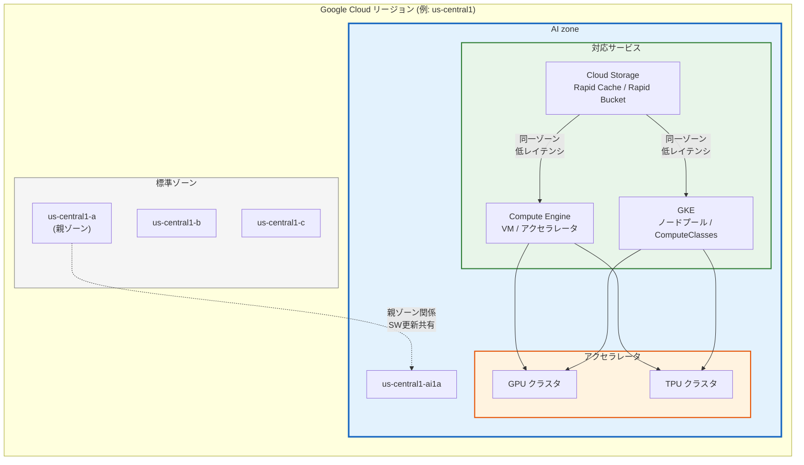

# Cloud Storage / Compute Engine / GKE: AI zones サポート

**リリース日**: 2026-04-27

**サービス**: Cloud Storage, Compute Engine, Google Kubernetes Engine (GKE)

**機能**: AI zones サポート

**ステータス**: GA (Compute Engine) / Feature (Cloud Storage, GKE)

[このアップデートのインフォグラフィックを見る](https://takech9203.github.io/google-cloud-news-summary/20260427-ai-zones-support.html)

## 概要

Cloud Storage、Compute Engine、Google Kubernetes Engine (GKE) の 3 サービスにおいて、AI zones のサポートが発表された。AI zones は AI/ML ワークロードに最適化された専用のインフラストラクチャゾーンであり、大規模な GPU および TPU アクセラレータ容量を提供する。Compute Engine では一般提供 (GA) として、Cloud Storage と GKE ではフィーチャーリリースとしてサポートが開始されている。

AI zones はリージョン内の標準ゾーンとは地理的に離れた場所に配置され、AI/ML トレーニングや推論ワークロードに特化した大規模なアクセラレータ容量を提供する。各 AI zone は標準ゾーンに関連付けられた「親ゾーン (parent zone)」を持ち、ソフトウェアアップデートスケジュールやインフラストラクチャを共有する。これにより、大規模言語モデル (LLM) のトレーニング、ファインチューニング、バルク推論、リアルタイム ML 推論といった AI/ML ワークロードを効率的に実行できる環境が整備される。

対象ユーザーは、大規模な AI/ML ワークロードを Google Cloud 上で実行する ML エンジニア、データサイエンティスト、プラットフォームエンジニア、および AI インフラストラクチャの構築・運用を担当するチームである。

**アップデート前の課題**

AI zones サポート以前は、以下の課題があった。

- AI/ML ワークロードで大量の GPU/TPU アクセラレータを確保する際、標準ゾーン内でのリソース競合が発生しやすく、必要な容量を確保するのが困難であった
- トレーニングデータやモデルチェックポイントのストレージとアクセラレータが異なるゾーンに配置されることで、ゾーン間のネットワークレイテンシが goodput (有効スループット) を低下させていた
- GKE クラスタ上で AI/ML ワークロードを実行する際、アクセラレータリソースの配置を最適化するための標準的な仕組みが不足していた

**アップデート後の改善**

今回のアップデートにより、以下が可能になった。

- AI/ML ワークロードに特化した大規模なアクセラレータ容量を持つ専用ゾーンが利用可能になり、GPU/TPU リソースの確保が容易になった
- Cloud Storage の Rapid Cache や Rapid Bucket を AI zone 内に配置することで、コンピュートリソースとストレージを同一ゾーンにコロケーションし、ゾーン間レイテンシを排除して goodput を最大化できるようになった
- GKE では ComputeClasses、Node auto-provisioning、GKE Standard のノードプールを通じて AI zone を明示的にターゲットできるようになり、AI/ML ワークロードの配置制御が柔軟になった

## アーキテクチャ図



AI zone はリージョン内の標準ゾーンとは物理的に離れた場所に配置され、大規模な GPU/TPU アクセラレータ容量を提供する。Compute Engine、GKE、Cloud Storage の 3 サービスが AI zone 内でゾーナルリソースをネイティブにサポートし、コンピュートとストレージのコロケーションにより AI/ML ワークロードの goodput を最大化する。

## サービスアップデートの詳細

### 主要機能

1. **Compute Engine: AI zone での VM およびアクセラレータの作成**
   - AI zone 内で GPU/TPU を搭載した VM インスタンスを作成できる
   - Bulk Insert やリージョナル MIG で AI zone を使用する場合は、`locationPolicy.zones[]` や `distributionPolicy.zones[]` で明示的に AI zone を指定する必要がある
   - AI zone の検索は `gcloud compute zones list --filter="name~'-ai'"` で実行可能

2. **Cloud Storage: AI zone 向けストレージ最適化**
   - **Rapid Cache**: SSD バックドのゾーナルリードキャッシュ。リージョナルバケットのデータを AI zone 内にキャッシュし、読み取りレイテンシを大幅に削減する
   - **Rapid Bucket**: ゾーナルオブジェクトストレージ。サブミリ秒のレイテンシ、最大 15 TB/s のスループット、最大 2,000 万 QPS を提供する
   - 階層型ストレージアーキテクチャ (Cold Storage Layer + Performance Layer) が推奨される

3. **GKE: AI zone でのワークロード配置制御**
   - **ComputeClasses**: 優先度リストで AI zone 内のオンデマンド TPU をリクエスト可能。`location.zones` または `location.zoneTypes: ["AI"]` で指定する
   - **Node auto-provisioning**: nodeSelector や nodeAffinity で AI zone をターゲットし、自動的にノードプールを作成する
   - **GKE Standard**: `--node-locations` フラグで AI zone を指定してノードプールを作成する

## 技術仕様

### AI zone のロケーション

| AI zone | AI zone の所在地 | Google Cloud リージョン | リージョンの所在地 | 親ゾーン |
|---------|-----------------|----------------------|------------------|---------|
| europe-west4-ai1a | De Kooy, オランダ | europe-west4 | Eemshaven, オランダ | europe-west4-a |
| us-south1-ai1b | Austin, テキサス | us-south1 | Dallas, テキサス | us-south1-b |
| us-central1-ai1a | Lincoln, ネブラスカ | us-central1 | Council Bluffs, アイオワ | us-central1-a |

### 各サービスの AI zone サポート内容

| サービス | AI zone での主要機能 | 設定方法 |
|---------|---------------------|---------|
| Compute Engine | GPU/TPU VM の作成、Bulk Insert、リージョナル MIG | ゾーンの明示的な指定 |
| Cloud Storage | Rapid Cache (リードキャッシュ)、Rapid Bucket (ゾーナルストレージ) | AI zone 内にキャッシュ/バケットを作成 |
| GKE | ComputeClasses、Node auto-provisioning、GKE Standard ノードプール | ComputeClass マニフェストまたは gcloud CLI |

### AI zone の制限事項

| 項目 | 詳細 |
|------|------|
| リージョナル永続ディスク | AI zone 内では利用不可 |
| Hyperdisk Balanced High Availability | AI zone 内では利用不可 |
| CPU のみの VM | AI zone 内での作成に制限あり |
| GKE での非 TPU ワークロード | 同一ゾーンで TPU ワークロードが稼働中であることが必要 |

## 設定方法

### 前提条件

1. Google Cloud プロジェクトが作成されていること
2. Compute Admin (`roles/compute.admin`) IAM ロールが付与されていること
3. AI zones がプロジェクトで有効化されていること (デフォルトでは無効)

### 手順

#### ステップ 1: AI zones の有効化

```bash
gcloud compute preview-features update ai-zones-visibility \
    --activation-status=enabled \
    --rollout-plan=fast-rollout
```

プロジェクトで AI zones を有効化する。AI zones はプレビュー機能であり、明示的な有効化が必要である。有効化はすべての Google Cloud サービスに対して一括で適用される。

#### ステップ 2: AI zone の確認

```bash
# AI zone の一覧を表示
gcloud compute zones list \
    --filter="name~'-ai'"
```

利用可能な AI zone を確認する。AI zone は名前に `ai` を含む (例: `us-central1-ai1a`)。

#### ステップ 3: Compute Engine での AI zone の利用

```bash
# AI zone 内で VM を作成する例
gcloud compute instances create my-training-vm \
    --zone=us-central1-ai1a \
    --machine-type=a3-megagpu-8g \
    --accelerator=type=nvidia-h100-mega-80gb,count=8
```

#### ステップ 4: GKE での ComputeClass を使用した AI zone のターゲット

```yaml
apiVersion: cloud.google.com/v1
kind: ComputeClass
metadata:
  name: ai-zone-tpu-class
spec:
  priorityDefaults:
    location:
      zones: ['us-central1-ai1a']
  priorities:
    - tpu:
        type: tpu-v5p-slice
        count: 4
        topology: 4x4x4
  whenUnsatisfiable: ScaleUpAnyway
  nodePoolAutoCreation:
    enabled: true
```

ComputeClass マニフェストで AI zone を優先的にターゲットし、TPU ワークロードを AI zone 内で実行する。

## メリット

### ビジネス面

- **AI/ML ワークロードの実行効率向上**: 大規模なアクセラレータ容量を持つ専用ゾーンにより、GPU/TPU リソースの確保が容易になり、トレーニング時間の短縮とコスト最適化が期待できる
- **TCO の削減**: コンピュートとストレージのコロケーションにより goodput を最大化し、高価なアクセラレータのアイドル時間を最小化することで、総所有コスト (TCO) の削減につながる

### 技術面

- **レイテンシの最小化**: AI zone 内にストレージ (Rapid Cache / Rapid Bucket) をコロケーションすることで、ゾーン間のネットワークレイテンシを排除し、データアクセスのレイテンシをサブミリ秒レベルに抑えられる
- **柔軟なワークロード配置**: GKE の ComputeClasses や Node auto-provisioning を活用して、AI/ML ワークロードのみを AI zone に配置し、非 ML ワークロードは標準ゾーンに維持するといった柔軟な配置制御が可能になる
- **大規模トレーニングへの対応**: AI zone の大規模なアクセラレータ容量により、LLM やファウンデーションモデルのトレーニングに必要な数百〜数千の GPU/TPU を単一ゾーン内で確保しやすくなる

## デメリット・制約事項

### 制限事項

- AI zone は標準ゾーンとは物理的に離れているため、リージョン内の他のサービスへのアクセス時にネットワークレイテンシが追加される可能性がある
- リージョナル永続ディスクおよび Hyperdisk Balanced High Availability は AI zone 内で利用できない
- AI zone 内での CPU のみの VM 作成には制限があり、非 ML ワークロードの実行は推奨されない
- GKE では、AI zone はデフォルトでは選択されず、明示的な設定が必要である

### 考慮すべき点

- AI zone と親ゾーンはソフトウェアアップデートやインフラストラクチャを共有するため、高可用性設計では AI zone とその親ゾーンをまたぐ HA デプロイメントを避ける必要がある
- 同じ親ゾーンを共有する 2 つの AI zone をまたぐ HA デプロイメントも避けるべきである
- AI zones へのアクセスはプレビュー機能であり、プロジェクトごとに明示的な有効化が必要である

## ユースケース

### ユースケース 1: 大規模 LLM トレーニング

**シナリオ**: ML エンジニアリングチームが数千億パラメータの LLM をトレーニングする必要があり、大量の GPU/TPU アクセラレータと高スループットのデータパイプラインが求められている。

**実装例**:
```bash
# AI zone 内に Rapid Cache を作成してトレーニングデータをキャッシュ
# リージョナルバケットの学習データセットを AI zone 内の SSD キャッシュに配置
# Compute Engine の GPU クラスタと同一ゾーンでストレージを運用
```

**効果**: AI zone 内でアクセラレータとストレージをコロケーションすることで、データの読み込みボトルネックが解消され、GPU/TPU の稼働率 (goodput) が最大化される。トレーニング時間の短縮と高価なアクセラレータリソースの効率的な活用が実現する。

### ユースケース 2: GKE 上での ML 推論パイプライン

**シナリオ**: プラットフォームチームが GKE Autopilot 上でリアルタイム ML 推論ワークロードを運用しており、TPU を活用して推論スループットを向上させたい。

**実装例**:
```yaml
# ComputeClass で AI zone の TPU を優先的にリクエスト
apiVersion: cloud.google.com/v1
kind: ComputeClass
metadata:
  name: inference-tpu-class
spec:
  priorities:
    - tpu:
        type: tpu-v5p-slice
        count: 1
        topology: 2x2x1
      location:
        zoneTypes: ["AI"]
    - spot: true
      tpu:
        type: tpu-v5p-slice
        count: 1
        topology: 2x2x1
      location:
        zoneTypes: ["AI"]
  nodePoolAutoCreation:
    enabled: true
```

**効果**: ComputeClasses の優先度設定により、AI zone 内の TPU リソースを優先的に確保しつつ、Spot VM へのフォールバックによりコストを最適化できる。非 ML ワークロードは自動的に標準ゾーンに配置され、ワークロードの分離が実現する。

## 利用可能リージョン

AI zones は以下のロケーションで利用可能である。

| 地域 | リージョン | AI zone |
|------|----------|---------|
| 米国 | us-central1 (Council Bluffs, アイオワ) | us-central1-ai1a |
| 米国 | us-south1 (Dallas, テキサス) | us-south1-ai1b |
| ヨーロッパ | europe-west4 (Eemshaven, オランダ) | europe-west4-ai1a |

Cloud Storage の AI zone サポートは、現時点では米国のリージョン (us-central1, us-south1) で利用可能である。

## 関連サービス・機能

- **Cloud Storage Rapid Cache**: AI zone 内にデプロイ可能な SSD バックドのゾーナルリードキャッシュ。トレーニングデータの低レイテンシアクセスに最適
- **Cloud Storage Rapid Bucket**: ゾーナルオブジェクトストレージ。サブミリ秒のレイテンシと最大 15 TB/s のスループットを提供
- **Google Cloud Managed Lustre**: GKE Standard 上の AI/ML ワークロード向けのハイパフォーマンスファイルシステム
- **Vertex AI**: GKE ベースの Vertex AI リージョナル製品は AI zone の構成を自動管理

## 参考リンク

- [インフォグラフィック](https://takech9203.github.io/google-cloud-news-summary/20260427-ai-zones-support.html)
- [公式リリースノート](https://docs.cloud.google.com/release-notes#April_27_2026)
- [AI zones ドキュメント (Compute Engine)](https://docs.cloud.google.com/compute/docs/regions-zones/ai-zones)
- [AI zones の有効化と管理](https://docs.cloud.google.com/compute/docs/regions-zones/manage-ai-zones)
- [Cloud Storage での AI zones の利用](https://docs.cloud.google.com/storage/docs/ai-zones)
- [GKE での AI zones の利用](https://docs.cloud.google.com/kubernetes-engine/docs/concepts/configuration-overview#ai-zones)
- [Cloud Storage Rapid プロダクトファミリー](https://docs.cloud.google.com/storage/docs/rapid/high-performance-storage)
- [GKE ComputeClasses](https://docs.cloud.google.com/kubernetes-engine/docs/concepts/about-custom-compute-classes)

## まとめ

Cloud Storage、Compute Engine、GKE の 3 サービスにおける AI zones サポートにより、AI/ML ワークロードに特化した大規模アクセラレータ容量を持つ専用インフラストラクチャが利用可能になった。特に、コンピュートとストレージのコロケーションによる goodput の最大化と、GKE ComputeClasses を活用した柔軟なワークロード配置制御は、大規模 AI/ML ワークロードを運用するチームにとって大きな価値がある。AI zones の利用を開始するには、プロジェクトで AI zones を有効化し (`gcloud compute preview-features update ai-zones-visibility --activation-status=enabled --rollout-plan=fast-rollout`)、利用可能な AI zone のロケーションとアクセラレータ構成を確認することを推奨する。

---

**タグ**: #AIZones #ComputeEngine #CloudStorage #GKE #AI #ML #GPU #TPU #アクセラレータ #インフラストラクチャ #GoogleCloud
