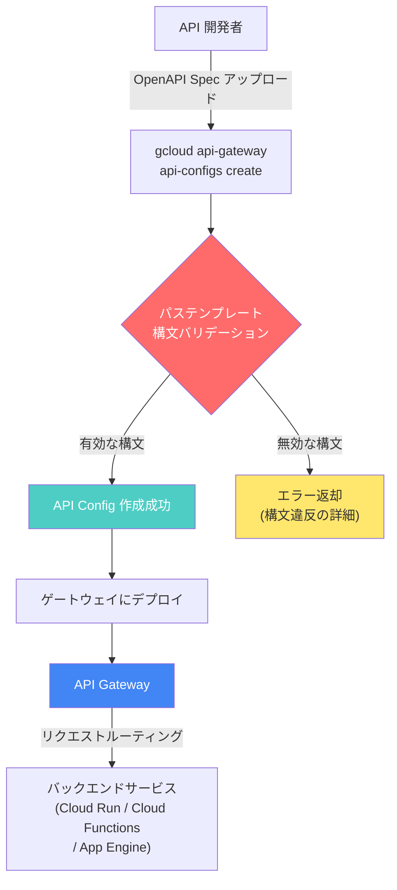

# API Gateway: パステンプレートの構文バリデーション強化

**リリース日**: 2026-04-27

**サービス**: API Gateway

**機能**: API 構成におけるパステンプレートの構文バリデーション強化

**ステータス**: 変更 (Change)

[このアップデートのインフォグラフィックを見る](https://takech9203.github.io/google-cloud-news-summary/20260427-api-gateway-path-validation.html)

## 概要

API Gateway において、API 構成 (API config) およびゲートウェイの新規作成時に、テンプレート化されたパスに対するより厳格な構文バリデーションが適用されるようになりました。これにより、不正なパステンプレートの構文が早期に検出され、デプロイ前の段階でエラーとして報告されます。

この変更は、API の信頼性と一貫性を向上させるためのものです。従来は一部の不正な構文がバリデーションをすり抜けてデプロイされる可能性がありましたが、今後はより厳密なルールに基づいてパステンプレートが検証されます。これにより、API 管理者は設定ミスによる予期しないルーティング動作やセキュリティリスクを未然に防ぐことができます。

**アップデート前の課題**

- パステンプレートの構文に不備があっても、一部のケースではバリデーションをすり抜けて API 構成が作成される可能性があった
- 不正なパス構文がデプロイ後に予期しないルーティング動作を引き起こすリスクがあった
- 構文エラーの検出がデプロイ後のランタイムまで遅延する場合があった

**アップデート後の改善**

- API 構成およびゲートウェイの新規作成時に、厳格な構文バリデーションが自動的に適用される
- 不正なパステンプレート構文がデプロイ前に検出・拒否されるようになった
- 変数命名規則、セグメント内の混合記述、ネストされたパラメータなど、明確なルールセットに基づいた検証が行われる

## アーキテクチャ図



API 構成作成のフロー図です。新しいバリデーションステップ (赤色) がパステンプレートの構文を検証し、有効な場合のみ API Config が作成されます。無効な構文の場合はエラーが返却され、デプロイ前に問題が検出されます。

## サービスアップデートの詳細

### 主要機能

1. **変数命名規則の検証**
   - 変数名は文字 (大文字・小文字) またはアンダースコア (`_`) で始まる必要がある
   - 使用可能な文字は、文字・数字・アンダースコア・ドット (`.`)・ハイフン (`-`) のみ
   - 有効な例: `{my_var}`, `{var-1}`, `{var.name}`
   - 無効な例: `{1var}`, `{my var}`

2. **パラメータとリテラルの混合禁止**
   - 単一のパスセグメント内でパラメータとリテラル文字を混在させることはできない
   - 有効な例: `/prefix/{var}`
   - 無効な例: `/prefix-{var}`, `/{var}suffix`
   - 例外: パスの最後のセグメントで、コロン (`:`) で始まるカスタムメソッドサフィックスのみ許可 (例: `/{var}:customMethod`)

3. **セグメントあたり複数パラメータの禁止**
   - 単一のパスセグメントに複数のパラメータを含めることはできない
   - 有効な例: `/{var1}/{var2}`
   - 無効な例: `/{var1}{var2}`

4. **ネストされたパラメータの禁止**
   - パラメータを他のパラメータ内にネストすることはできない
   - 有効な例: `/{var}`
   - 無効な例: `/{{var}}`

5. **ダブルワイルドカードの位置制限**
   - ダブルワイルドカードセグメント (`{var=**}` または `/**`) はパスの最後のセグメントでのみ使用可能
   - 有効な例: `/prefix/{var=**}`, `/prefix/**`
   - 無効な例: `/{var=**}/suffix`, `/**/suffix`

## 技術仕様

### パステンプレートの制限値

| 項目 | 上限値 |
|------|--------|
| パスあたりのパラメータ数 | 60 |
| 変数名の長さ | 100 文字 |
| パスの長さ (テンプレート有無に関わらず) | 512 文字 |

### パステンプレートのマッチング方式

| マッチング方式 | 構文例 | 説明 |
|---------------|--------|------|
| 完全一致 | `/shelves` | ワイルドカードなし。指定パスのみに一致 |
| 単一ワイルドカード | `/shelves/{shelf}` | 単一パスセグメントに一致 (スラッシュを含まない) |
| ダブルワイルドカード | `/shelves/{shelf=**}` | 複数パスセグメントに一致 (スラッシュを含む、OpenAPI 2.0 のみ) |

### OpenAPI バージョンによる違い

| 機能 | OpenAPI 2.0 | OpenAPI 3.x |
|------|-------------|-------------|
| 単一ワイルドカード `{var}` | サポート | サポート |
| 単一ワイルドカード `{var=*}` | サポート | 非サポート (拒否される) |
| ダブルワイルドカード `{var=**}` | サポート (最後のセグメントのみ) | 非サポート (`x-google-parameter` で代替) |

## 設定方法

### 前提条件

1. Google Cloud プロジェクトが作成済みであること
2. API Gateway API が有効化されていること
3. gcloud CLI がインストール・設定済みであること
4. OpenAPI 仕様ファイルが準備済みであること

### 手順

#### ステップ 1: OpenAPI 仕様のパステンプレートを確認

新しいバリデーションルールに準拠するよう、OpenAPI 仕様のパス定義を確認します。

```yaml
# 有効なパス定義の例
paths:
  /shelves/{shelf}/books/{book}:
    get:
      summary: Retrieve a book
      parameters:
        - in: path
          name: shelf
          type: string
          required: true
        - in: path
          name: book
          type: string
          required: true
```

以下のような無効なパターンが含まれていないことを確認してください。

```yaml
# 無効なパス定義の例 (これらは拒否される)
paths:
  /items/prefix-{id}:     # パラメータとリテラルの混合
    get:
      summary: Invalid path
  /{var1}{var2}:           # セグメント内の複数パラメータ
    get:
      summary: Invalid path
```

#### ステップ 2: API 構成を作成

```bash
gcloud api-gateway api-configs create CONFIG_ID \
  --api=API_ID \
  --openapi-spec=openapi-spec.yaml \
  --project=PROJECT_ID \
  --backend-auth-service-account=SERVICE_ACCOUNT_EMAIL
```

バリデーションエラーが発生した場合、エラーメッセージに具体的な違反内容が表示されます。

#### ステップ 3: ゲートウェイにデプロイ

```bash
gcloud api-gateway gateways create GATEWAY_ID \
  --api=API_ID \
  --api-config=CONFIG_ID \
  --location=GCP_REGION \
  --project=PROJECT_ID
```

## メリット

### ビジネス面

- **運用リスクの低減**: 不正なパステンプレートがデプロイされることを防止し、本番環境での予期しない動作を回避できる
- **セキュリティの向上**: URL エンコードされたスラッシュ (`%2F`) によるパスの誤マッチングなど、パステンプレートに起因するセキュリティリスクを軽減できる

### 技術面

- **早期エラー検出**: 構成作成時にバリデーションが行われるため、デプロイ前の段階で問題を発見できる
- **明確なルールセット**: ドキュメント化された構文ルールにより、正しいパステンプレートの記述方法が明確になった
- **一貫性のある API 設計**: 厳格なバリデーションにより、プロジェクト全体で一貫したパステンプレートの記述が促進される

## デメリット・制約事項

### 制限事項

- 新規の API 構成およびゲートウェイ作成時にのみ適用される (既存の構成には影響しない)
- 部分セグメントパラメータ (`/items/prefix_{id}_suffix`) は引き続きサポートされない
- OpenAPI 3.x ではダブルワイルドカード構文 (`{var=**}`) が直接使用できない (`x-google-parameter` による代替が必要)

### 考慮すべき点

- 既存の OpenAPI 仕様で非準拠のパステンプレートを使用している場合、新しい API 構成の作成時にエラーが発生する可能性がある
- API 構成の更新は既存構成の編集ではなく、新しい API 構成の作成として行われるため、更新時にもバリデーションが適用される
- CI/CD パイプラインでの API 構成デプロイに影響する可能性があるため、事前にパステンプレートの確認を推奨

## ユースケース

### ユースケース 1: REST API のパス設計の品質向上

**シナリオ**: マイクロサービスアーキテクチャで複数チームが API を開発しており、各チームが独自のパス設計を行っている場合。

**実装例**:
```yaml
# 正しいパステンプレートの設計パターン
paths:
  /api/v1/users/{userId}:
    get:
      summary: Get user by ID
  /api/v1/users/{userId}/orders/{orderId}:
    get:
      summary: Get specific order for a user
  /api/v1/resources/{resourceId}:batchProcess:
    post:
      summary: Batch process a resource (custom method)
```

**効果**: 全チームが統一されたパステンプレート規則に従うことが強制され、API 設計の品質と一貫性が向上する。

### ユースケース 2: セキュリティリスクの事前防止

**シナリオ**: 認証が必要なエンドポイントと不要なエンドポイントが混在する API で、パステンプレートの設計ミスによるアクセス制御の迂回を防ぎたい場合。

**効果**: 厳格なバリデーションにより、不正なパステンプレートがデプロイされることを防止し、URL エンコードされたスラッシュを利用した認証バイパスなどのセキュリティリスクを軽減できる。

## 利用可能リージョン

API Gateway は以下のリージョンで利用可能です:

- `asia-northeast1` (東京)
- `australia-southeast1` (シドニー)
- `europe-west1` (ベルギー)
- `europe-west2` (ロンドン)
- `us-east1` (サウスカロライナ)
- `us-east4` (北バージニア)
- `us-central1` (アイオワ)
- `us-west2` (ロサンゼルス)
- `us-west3` (ソルトレイクシティ)
- `us-west4` (ラスベガス)

## 関連サービス・機能

- **Cloud Endpoints**: API Gateway と同様の API 管理機能を提供するサービス。gRPC API のサポートが充実している
- **Apigee**: エンタープライズ向けの高度な API 管理プラットフォーム。より詳細なポリシー制御やアナリティクスが必要な場合に適している
- **Cloud Run / Cloud Functions / App Engine**: API Gateway のバックエンドサービスとして利用されるコンピューティングサービス

## 参考リンク

- [インフォグラフィック](https://takech9203.github.io/google-cloud-news-summary/20260427-api-gateway-path-validation.html)
- [公式リリースノート](https://docs.cloud.google.com/release-notes#April_27_2026)
- [パステンプレートの構文ルール](https://docs.cloud.google.com/api-gateway/docs/path-templating#syntax_rules)
- [パステンプレートの制限](https://docs.cloud.google.com/api-gateway/docs/path-templating#limits)
- [パステンプレートの概要](https://docs.cloud.google.com/api-gateway/docs/path-templating)
- [API 構成の作成](https://docs.cloud.google.com/api-gateway/docs/creating-api-config)
- [API Gateway アーキテクチャ](https://docs.cloud.google.com/api-gateway/docs/architecture-overview)

## まとめ

今回のアップデートにより、API Gateway の API 構成作成時にパステンプレートの構文がより厳格に検証されるようになりました。変数命名規則、セグメント内のパラメータ混合禁止、ネスト禁止、ダブルワイルドカードの位置制限など、明確なルールセットに基づくバリデーションが行われます。既存の API 構成に影響はありませんが、新規作成や更新時には OpenAPI 仕様のパス定義がこれらのルールに準拠していることを確認してください。CI/CD パイプラインで API 構成をデプロイしている場合は、事前にパステンプレートの検証を行うことを推奨します。

---

**タグ**: #APIGateway #パステンプレート #バリデーション #セキュリティ #API管理 #OpenAPI #構文ルール
