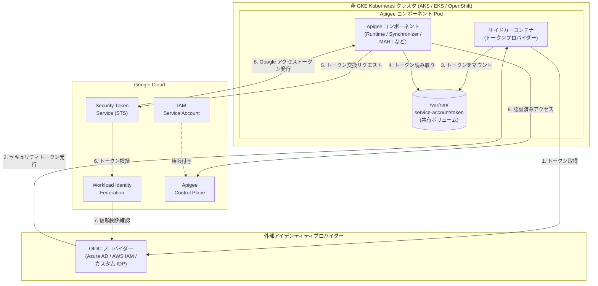

# Apigee hybrid v1.14.4: サイドカー認証による非 GKE プラットフォーム向け Workload Identity Federation 対応

**リリース日**: 2026-04-27

**サービス**: Apigee hybrid

**機能**: サイドカー認証による Workload Identity Federation (非 GKE プラットフォーム向け)、包括的セキュリティ修正

**ステータス**: GA (パッチリリース)

[このアップデートのインフォグラフィックを見る](https://takech9203.github.io/google-cloud-news-summary/20260427-apigee-hybrid-v1-14-4-wif-sidecar.html)

## 概要

Apigee hybrid v1.14.4 がリリースされた。本リリースの最大の特徴は、非 GKE プラットフォーム (AKS、EKS、OpenShift など) における Workload Identity Federation でサイドカーを使用したセキュリティトークンのマウントが可能になった点である。これにより、GKE 以外の Kubernetes 環境でも、サービスアカウントキーファイルに依存しない、より安全な認証方式が実現される。

サイドカー認証では、任意のアイデンティティプロバイダー (IDP) からのセキュリティトークンをサイドカーコンテナ経由でマウントし、サービスアカウント認証に利用できる。従来の Workload Identity Federation では、OIDC プロバイダーの設定と credential configuration ファイルの管理が必要だったが、サイドカー方式により、トークンのライフサイクル管理がサイドカーコンテナに委任され、運用負荷が軽減される。

また、本リリースには複数コンポーネントにわたる包括的なセキュリティ修正が含まれており、apigee-synchronizer、apigee-runtime、apigee-mart-server、apigee-hybrid-cassandra、apigee-fluent-bit、apigee-asm-ingress をはじめとする 20 以上のコンポーネントで CVE 対応が行われている。対象ユーザーは、非 GKE プラットフォームで Apigee hybrid を運用している組織や、セキュリティパッチの適用が必要な全ての Apigee hybrid v1.14 ユーザーである。

**アップデート前の課題**

- 非 GKE プラットフォームでの Workload Identity Federation は、credential configuration ファイルの手動管理が必要で、トークンの更新やローテーションの運用負荷が高かった
- サービスアカウントキーファイル (.json) を使用する場合、キーの漏洩リスクやローテーション管理の複雑さが課題だった
- 独自の IDP を使用する環境では、トークンのマウント方法に柔軟性がなく、既存の認証基盤との統合が困難だった
- 複数のコンポーネントに既知の脆弱性 (CVE) が存在していた

**アップデート後の改善**

- サイドカーコンテナを使用して、任意の IDP からのセキュリティトークンを自動的にマウントできるようになった
- トークンのライフサイクル管理がサイドカーに委任され、credential configuration ファイルの手動管理が不要になった
- サービスアカウントキーファイルへの依存がさらに低減され、セキュリティポスチャが向上した
- 20 以上のコンポーネントで CVE 修正が適用され、セキュリティリスクが大幅に低減された

## アーキテクチャ図



サイドカーコンテナが外部 IDP からセキュリティトークンを取得し、共有ボリュームにマウントする。Apigee コンポーネントはそのトークンを使用して Google Cloud Security Token Service (STS) 経由で Workload Identity Federation による認証を行い、Apigee コントロールプレーンにアクセスする。

## サービスアップデートの詳細

### 主要機能

1. **サイドカー認証による Workload Identity Federation**
   - 非 GKE プラットフォーム (AKS、EKS、OpenShift など) で利用可能
   - サイドカーコンテナが任意の IDP からセキュリティトークンを取得し、指定パスにマウント
   - Apigee コンポーネントがマウントされたトークンを使用してサービスアカウント認証を実行
   - credential configuration ファイルまたは Kubernetes Secret、Vault と併用可能

2. **包括的セキュリティ修正**
   - apigee-synchronizer: CVE-2025-55163、CVE-2025-58056、CVE-2025-58057、CVE-2025-67735
   - apigee-runtime: CVE-2025-55163、CVE-2025-58056、CVE-2025-58057、CVE-2025-67735
   - apigee-mart-server: CVE-2025-48924、CVE-2025-55163、CVE-2025-58056、CVE-2025-58057、CVE-2025-67735
   - apigee-hybrid-cassandra: CVE-2022-40897、CVE-2023-2976、CVE-2025-47273
   - apigee-fluent-bit: 30 件以上の CVE を修正
   - apigee-asm-ingress: CVE-2026-4437、CVE-2026-4046、CVE-2026-34040、CVE-2026-33186、CVE-2026-24051、CVE-2025-15558

3. **その他のコンポーネントセキュリティ修正**
   - apigee-asm-istiod、apigee-connect-agent、apigee-envoy、apigee-hybrid-cassandra-client、apigee-kube-rbac-proxy、apigee-mint-task-scheduler、apigee-open-telemetry-collector、apigee-operators、apigee-prom-prometheus、apigee-prometheus-adapter、apigee-redis、apigee-stackdriver-logging-agent、apigee-udca、apigee-watcher で各種セキュリティ修正を実施

## 技術仕様

### サイドカー認証の設定

| 項目 | 詳細 |
|------|------|
| 対象バージョン | Apigee hybrid v1.14.4 以降 |
| 対応プラットフォーム | AKS、EKS、OpenShift、その他非 GKE Kubernetes |
| 認証方式 | Workload Identity Federation + サイドカーによるトークンマウント |
| トークンマウントパス | `/var/run/service-account/token` (デフォルト) |
| 対応 IDP | OIDC 準拠の任意の IDP (Azure AD、AWS IAM、Okta など) |
| Helm チャート | コンテナイメージが Helm チャートに統合 |

### セキュリティ修正対象コンポーネント

| コンポーネント | 修正 CVE 数 | 主要な CVE |
|---------------|------------|-----------|
| apigee-synchronizer | 4 | CVE-2025-55163、CVE-2025-58056、CVE-2025-58057、CVE-2025-67735 |
| apigee-runtime | 4 | CVE-2025-55163、CVE-2025-58056、CVE-2025-58057、CVE-2025-67735 |
| apigee-mart-server | 5 | CVE-2025-48924 ほか |
| apigee-hybrid-cassandra | 3 | CVE-2022-40897、CVE-2023-2976、CVE-2025-47273 |
| apigee-fluent-bit | 30+ | 多数の CVE を一括修正 |
| apigee-asm-ingress | 6 | CVE-2026-4437、CVE-2026-4046 ほか |
| その他 14 コンポーネント | 各種 | セキュリティ修正 |

### overrides.yaml 設定例

```yaml
gcp:
  projectID: my-project
  region: us-west1
  workloadIdentity:
    enabled: false  # GKE 以外では false に設定
  federatedWorkloadIdentity:
    enabled: true
    audience: "//iam.googleapis.com/projects/PROJECT_NUMBER/locations/global/workloadIdentityPools/POOL_ID/providers/PROVIDER_ID"
    credentialSourceFile: "/var/run/service-account/token"
```

## 設定方法

### 前提条件

1. Apigee hybrid v1.14.x がインストール済みであること
2. 非 GKE Kubernetes クラスタ (AKS、EKS、OpenShift など) で稼働していること
3. 外部 IDP (OIDC プロバイダー) が設定済みであること
4. Google Cloud の Workload Identity Pool と Provider が作成済みであること
5. Helm 3.14.2 以降がインストール済みであること

### 手順

#### ステップ 1: Helm チャートの取得

```bash
export CHART_REPO=oci://us-docker.pkg.dev/apigee-release/apigee-hybrid-helm-charts
export CHART_VERSION=1.14.4

helm pull $CHART_REPO/apigee-operator --version $CHART_VERSION --untar
helm pull $CHART_REPO/apigee-datastore --version $CHART_VERSION --untar
helm pull $CHART_REPO/apigee-env --version $CHART_VERSION --untar
helm pull $CHART_REPO/apigee-ingress-manager --version $CHART_VERSION --untar
helm pull $CHART_REPO/apigee-org --version $CHART_VERSION --untar
helm pull $CHART_REPO/apigee-redis --version $CHART_VERSION --untar
helm pull $CHART_REPO/apigee-telemetry --version $CHART_VERSION --untar
helm pull $CHART_REPO/apigee-virtualhost --version $CHART_VERSION --untar
```

v1.14.4 の Helm チャートをダウンロードする。コンテナイメージは Helm チャートに統合されているため、チャートのアップグレードにより自動的にイメージも更新される。

#### ステップ 2: overrides.yaml でサイドカー認証を設定

```yaml
# overrides.yaml にサイドカー認証の設定を追加
gcp:
  projectID: my-project
  region: us-west1
  workloadIdentity:
    enabled: false
  federatedWorkloadIdentity:
    enabled: true
    audience: "//iam.googleapis.com/projects/123456789/locations/global/workloadIdentityPools/my-pool/providers/my-provider"
    credentialSourceFile: "/var/run/service-account/token"
```

`gcp.workloadIdentity.enabled` は必ず `false` に設定する。`federatedWorkloadIdentity.audience` には Workload Identity Provider の audience 値を指定する。

#### ステップ 3: Helm チャートのアップグレード

```bash
# CRD の更新
kubectl apply -k apigee-operator/etc/crds/default/ \
  --server-side \
  --force-conflicts \
  --validate=false

# Operator のアップグレード
helm upgrade operator apigee-operator/ \
  --install \
  --namespace $NAMESPACE \
  -f overrides.yaml

# Datastore のアップグレード
helm upgrade datastore apigee-datastore/ \
  --install \
  --namespace $NAMESPACE \
  -f overrides.yaml

# 各コンポーネントを順にアップグレード
helm upgrade telemetry apigee-telemetry/ --install --namespace $NAMESPACE -f overrides.yaml
helm upgrade redis apigee-redis/ --install --namespace $NAMESPACE -f overrides.yaml
helm upgrade ingress-manager apigee-ingress-manager/ --install --namespace $NAMESPACE -f overrides.yaml
helm upgrade $ORG_NAME apigee-org/ --install --namespace $NAMESPACE -f overrides.yaml
helm upgrade $ENV_NAME apigee-env/ --install --namespace $NAMESPACE --set env=$ENV_NAME -f overrides.yaml
```

各コンポーネントを順番にアップグレードする。サイドカー認証の詳細な設定手順は公式ドキュメントを参照のこと。

## メリット

### ビジネス面

- **マルチクラウド戦略の強化**: 非 GKE プラットフォームでもキーレス認証が可能になり、AWS や Azure 上での Apigee hybrid 運用がより安全かつ容易になる
- **コンプライアンス対応の改善**: サービスアカウントキーファイルの廃止により、キー管理に関する監査要件への対応が容易になる
- **運用コストの削減**: トークンのライフサイクル管理がサイドカーにより自動化され、キーローテーションの手動作業が不要になる

### 技術面

- **セキュリティポスチャの向上**: 静的なサービスアカウントキーから動的なトークンベース認証への移行により、キー漏洩リスクが大幅に低減される
- **IDP 統合の柔軟性**: 任意の OIDC 準拠 IDP を使用でき、既存の認証基盤をそのまま活用できる
- **包括的な CVE 対応**: 20 以上のコンポーネントで脆弱性が修正され、攻撃対象面が縮小される
- **Helm ベースの簡易アップグレード**: コンテナイメージが Helm チャートに統合されているため、チャートのアップグレードだけで全コンポーネントのイメージが更新される

## デメリット・制約事項

### 制限事項

- apigee-logger コンポーネントは Workload Identity Federation をサポートしていない (既知の問題)
- サイドカー認証は v1.14.4 以降でのみ利用可能であり、それ以前のバージョンにはバックポートされない
- v1.14 の EOL 予定日は 2026-04-30 であり、v1.15 以降へのアップグレードを計画する必要がある

### 考慮すべき点

- サイドカーコンテナの追加により、Pod あたりのリソース消費がわずかに増加する
- 外部 IDP との通信が必要なため、ネットワーク構成によってはファイアウォールルールの追加が必要になる場合がある
- 既存の credential configuration ファイルベースの設定からサイドカー方式への移行には、overrides.yaml の変更と Helm チャートの再適用が必要

## ユースケース

### ユースケース 1: AWS EKS 上での Apigee hybrid のキーレス認証

**シナリオ**: 金融機関が AWS EKS 上で Apigee hybrid を運用しており、セキュリティ監査でサービスアカウントキーファイルの管理に関する指摘を受けた。キーレス認証への移行が求められている。

**実装例**:
```yaml
# overrides.yaml
gcp:
  projectID: financial-api-project
  region: us-east1
  workloadIdentity:
    enabled: false
  federatedWorkloadIdentity:
    enabled: true
    audience: "//iam.googleapis.com/projects/123456789/locations/global/workloadIdentityPools/eks-pool/providers/eks-oidc-provider"
    credentialSourceFile: "/var/run/service-account/token"
```

**効果**: サービスアカウントキーファイルが不要になり、AWS IAM と Google Cloud IAM の間でトークンベースの安全な認証が実現される。キーローテーションの運用負荷が解消され、監査要件にも対応できる。

### ユースケース 2: Azure AKS 上でのマルチクラウド API 管理

**シナリオ**: エンタープライズ企業が Azure AKS と Google Cloud の両方でサービスを展開しており、Azure AD を IDP として使用して Apigee hybrid の各コンポーネントを認証したい。

**効果**: サイドカーが Azure AD からのトークンを自動取得し、Workload Identity Federation を通じて Google Cloud サービスへのアクセスを仲介する。既存の Azure AD 認証基盤をそのまま活用でき、追加の認証インフラの構築が不要になる。

## 料金

Apigee hybrid の料金はサブスクリプションプランに基づく。サイドカー認証機能自体に追加費用は発生しない。

| プラン | API プロキシコール (年間) | アクティブ環境 |
|--------|--------------------------|---------------|
| Standard | 最大 12.5 億 Standard / 2.5 億 Extensible | 3 |
| Enterprise | 最大 75 億 Standard / 15 億 Extensible | 6 |
| Enterprise Plus | 最大 750 億 Standard / 150 億 Extensible | 12 |

詳細は [Apigee サブスクリプションのエンタイトルメント](https://docs.cloud.google.com/apigee/docs/api-platform/reference/subscription-entitlements) を参照。

## 利用可能リージョン

Apigee hybrid はお客様が管理する Kubernetes クラスタ上で稼働するため、Google Cloud リージョンの制約は受けない。v1.14.4 は以下のプラットフォームで利用可能。

- GKE on Google Cloud (1.28.x - 1.31.x)
- GKE on AWS / Azure (1.28.x - 1.31.x)
- Google Distributed Cloud (VMware / bare metal)
- Amazon EKS (1.28.x - 1.32.x)
- Azure AKS (1.28.x - 1.31.x)
- Red Hat OpenShift (4.13 - 4.17)
- Rancher Kubernetes Engine (1.27.x - 1.31.x)
- VMware Tanzu (v1.26.x)

## 関連サービス・機能

- **Workload Identity Federation**: Google Cloud IAM の機能で、外部 IDP からの認証情報を使用して Google Cloud リソースにアクセスする仕組み
- **Workload Identity Federation for GKE**: GKE 固有の Workload Identity 実装。GKE 上での Apigee hybrid では従来からサポート済み
- **Cloud IAM**: サービスアカウントの権限管理を担当
- **Security Token Service (STS)**: 外部トークンと Google Cloud アクセストークンの交換を仲介
- **Apigee hybrid v1.15 / v1.16**: 後継バージョン。v1.14 の EOL が 2026-04-30 に予定されているため、アップグレードを推奨

## 参考リンク

- [インフォグラフィック](https://takech9203.github.io/google-cloud-news-summary/20260427-apigee-hybrid-v1-14-4-wif-sidecar.html)
- [公式リリースノート](https://docs.cloud.google.com/release-notes#April_27_2026)
- [サイドカーを使用した WIF の設定 (v1.14)](https://docs.cloud.google.com/apigee/docs/hybrid/v1.14/use-sidecar-for-wif)
- [Workload Identity Federation の有効化 (非 GKE)](https://docs.cloud.google.com/apigee/docs/hybrid/v1.14/enable-workload-identity-federation)
- [Apigee hybrid v1.14 アップグレードガイド](https://docs.cloud.google.com/apigee/docs/hybrid/v1.14/upgrade)
- [サービスアカウント認証方式の選択](https://docs.cloud.google.com/apigee/docs/hybrid/v1.14/sa-authentication-methods)
- [サポート対象プラットフォーム](https://docs.cloud.google.com/apigee/docs/hybrid/supported-platforms)
- [料金ページ](https://docs.cloud.google.com/apigee/docs/api-platform/reference/subscription-entitlements)

## まとめ

Apigee hybrid v1.14.4 は、非 GKE プラットフォームでのサイドカー認証による Workload Identity Federation 対応と、20 以上のコンポーネントにわたる包括的なセキュリティ修正を含むパッチリリースである。特にサイドカー認証機能は、マルチクラウド環境での API 管理においてサービスアカウントキーファイルへの依存を解消し、セキュリティポスチャを大幅に向上させる重要な機能強化である。ただし、v1.14 の EOL が 2026-04-30 に予定されているため、本パッチの適用と併せて v1.15 以降へのアップグレード計画を策定することを強く推奨する。

---

**タグ**: #Apigee #ApigeeHybrid #WorkloadIdentityFederation #WIF #サイドカー認証 #非GKE #AKS #EKS #OpenShift #セキュリティ #CVE #Helm #Kubernetes #マルチクラウド #API管理 #パッチリリース #v1.14.4
