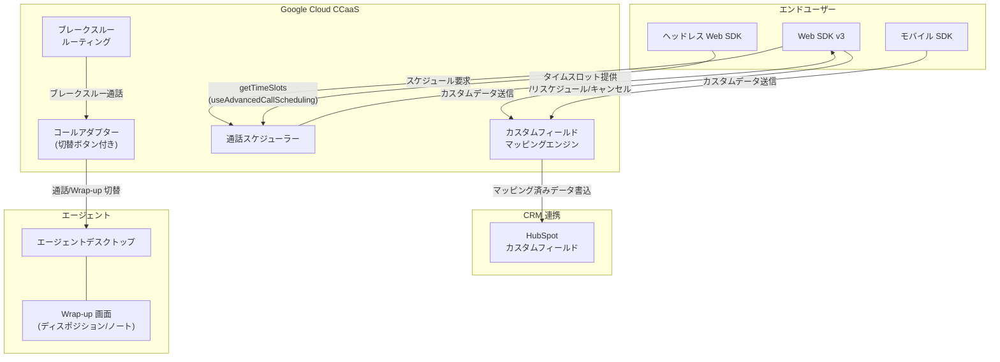

# Google Cloud CCaaS: 次期バージョンプレリリースノート -- HubSpot カスタムフィールドマッピング、ブレークスルー改善、通話スケジューリング強化

**リリース日**: 2026-04-27

**サービス**: Google Cloud Contact Center as a Service (CCaaS)

**機能**: 次期バージョンプレリリースノート (HubSpot カスタムフィールドマッピング、Wrap-up ブレークスルー改善、通話スケジューリング改善)

**ステータス**: プレリリース (次期バージョンで正式リリース予定)

:bar_chart: [このアップデートのインフォグラフィックを見る](https://takech9203.github.io/google-cloud-news-summary/20260427-ccaas-prerelease-features.html)

## 概要

Google Cloud Contact Center as a Service (CCaaS) の次期バージョンに向けたプレリリースノートが公開されました。本アップデートでは、CRM 連携の強化、エージェントの生産性向上、エンドユーザーの利便性改善に焦点を当てた 3 つの主要機能が発表されています。

1 つ目は HubSpot 向けカスタムフィールドマッピング機能で、Web/モバイル SDK のカスタムデータフィールドを HubSpot のカスタムフィールドに直接マッピングできるようになります。2 つ目は Wrap-up ステータスにおけるブレークスルー通話の改善で、エージェントがディスポジションコードの入力を完了していなくてもブレークスルー通話に応答可能になります。3 つ目は Web SDK v3 およびヘッドレス Web SDK における通話スケジューリング機能の大幅な改善で、タイムスロットの柔軟な設定、リスケジュール、キャンセル機能が追加されます。

これらの機能は、コンタクトセンターの運用効率と顧客体験の両面を向上させることを目的としており、管理者、エージェント、エンドユーザーのそれぞれに恩恵をもたらします。

**アップデート前の課題**

- HubSpot CRM と連携する際、SDK のカスタムデータを HubSpot のカスタムフィールドに自動的にマッピングする仕組みがなく、データの転記に手間がかかっていた
- Wrap-up ステータスのエージェントがブレークスルー通話に応答するには、ディスポジションコードとノートの入力を完了するか、手動で Available ステータスに切り替える必要があった
- 通話スケジューリングのタイムスロットは 15 分間隔の固定長で、日単位での閲覧やリスケジュール・キャンセルができなかった

**アップデート後の改善**

- SDK のカスタムデータフィールドを HubSpot のカスタムフィールドに直接マッピングし、ランタイムで自動的に値を書き込めるようになった
- Wrap-up 中のエージェントがディスポジション入力を完了していなくてもブレークスルー通話に応答でき、進行中の通話と前の通話の Wrap-up 画面を切り替え可能になった
- 通話スケジューリングでタイムスロットの長さの設定、日単位の選択、リスケジュール、キャンセル、キュー単位の設定が可能になった

## アーキテクチャ図



本図は、今回のプレリリースで発表された 3 つの機能がそれぞれどのように動作するかを示しています。SDK からのカスタムデータがマッピングエンジンを経由して HubSpot に書き込まれるフロー、ブレークスルー通話がエージェントのコールアダプターに配信されるフロー、および通話スケジューリングの改善された双方向のやり取りを表現しています。

## サービスアップデートの詳細

### 主要機能

1. **HubSpot 向けカスタムフィールドマッピング**
   - Web SDK またはモバイル SDK のカスタムデータフィールドを HubSpot のカスタムフィールドにマッピング可能
   - ランタイムで SDK がカスタムデータ値を送信すると、マッピングされた HubSpot カスタムフィールドに自動書き込み
   - 管理画面の Settings > Operation Management ページに新しい「Custom Field Mapping」ペインが追加
   - 既存の Salesforce、Zendesk、Kustomer 向けカスタムフィールドマッピングに加え、HubSpot もサポート対象に

2. **Wrap-up ステータスのブレークスルー通話改善**
   - Wrap-up および Wrap-up Exceeded ステータスにブレークスルーが設定されている場合、エージェントはディスポジションコード/ノートの送信完了前でもブレークスルー通話に応答可能
   - 手動で Available ステータスに切り替えなくても通話を受けられる
   - コールアダプターに切替ボタンが追加され、進行中の通話と前の通話の Wrap-up 画面を切り替え可能
   - ミニアダプターも拡張され、同様の切り替え操作が可能

3. **通話スケジューリングの改善 (Web SDK v3 / ヘッドレス Web SDK)**
   - **タイムスロットの長さ設定**: スケジューリングのタイムスロットの長さを柔軟に設定可能 (従来は 15 分間隔固定)
   - **日単位のタイムスロット選択**: エンドユーザーが日ごとに整理されたタイムスロットを閲覧可能
   - **リスケジュール**: エンドユーザーが Web SDK を再度開いた際、既存のスケジュール済み通話がある場合は管理 (リスケジュールまたはキャンセル) を促される
   - **キャンセル**: スケジュール済み通話のキャンセルが可能
   - **キュー単位の設定**: 通話スケジューリングをキュー単位で設定可能

## 技術仕様

### 通話スケジューリングの管理画面変更

| 項目 | 詳細 |
|------|------|
| 新規ペイン | Settings > Calls に「Scheduled Calls」ペイン追加 |
| キュー単位設定 | Settings > Queue > Web > (キュー名) に「Scheduled Calls」セクション追加 |
| 設定移動 | Scheduled Call Countdown / Scheduled Call Expiration が Settings > Calls > Call Details から Settings > Calls > Scheduled Calls に移動 |
| 新規設定 | 「Consumers can schedule calls up to X day(s) in the future」 |
| 新規設定 | 「Static > Maximum calls per time slot」 |

### ヘッドレス Web SDK での利用

ヘッドレス Web SDK から通話スケジューリングの改善機能にアクセスするには、`getTimeSlots` メソッド呼び出し時に `useAdvancedCallScheduling: true` を指定する必要があります。

```javascript
// ヘッドレス Web SDK での高度な通話スケジューリング利用例
const slots = await client.getTimeSlots(menuId, {
  useAdvancedCallScheduling: true
});
```

### ブレークスルー設定の対象ステータス

| ステータス種別 | ステータス名 | 今回の改善対象 |
|----------------|-------------|----------------|
| デフォルト | Wrap-up | 対象 |
| システム | Wrap-up Exceeded | 対象 |
| デフォルト | Unavailable, Break, Special task, Meal | 既存 |
| システム | Missed Call, Missed Chat, In-chat | 既存 |
| カスタム | 任意のカスタムステータス | 既存 |

## 設定方法

### 前提条件

1. Google Cloud CCaaS インスタンスが稼働していること
2. 管理者権限でポータルにアクセスできること
3. HubSpot カスタムフィールドマッピングを利用する場合は HubSpot CRM 連携が有効であること

### 手順

#### ステップ 1: HubSpot カスタムフィールドマッピングの設定

1. HubSpot 側で対象のカスタムフィールドを作成
2. CCaaS ポータルで Settings > Operation Management に移動
3. 新しい「Custom Field Mapping」ペインで SDK カスタムデータフィールドと HubSpot カスタムフィールドのマッピングを設定
4. 保存して動作確認

#### ステップ 2: ブレークスルーの Wrap-up ステータス設定

1. CCaaS ポータルで Settings > Operation Management > Agent Status に移動
2. Agent Status Breakthrough を有効化
3. Wrap-up および Wrap-up Exceeded ステータスのブレークスルーを有効化
4. 対象キューで Agent Status Breakthrough を設定

#### ステップ 3: 通話スケジューリングの設定

1. CCaaS ポータルで Settings > Calls > Scheduled Calls に移動
2. タイムスロットの長さや将来の予約可能日数を設定
3. Settings > Queue > Web > (対象キュー) でキュー単位のスケジューリングを設定
4. タイムスロットごとの最大通話数を設定

## メリット

### ビジネス面

- **CRM データ品質の向上**: HubSpot カスタムフィールドへの自動マッピングにより、手動入力によるデータ欠損や誤りを削減し、顧客データの一貫性を確保
- **エージェント生産性の向上**: Wrap-up 中でもブレークスルー通話に応答できることで、顧客の待ち時間が短縮され、エージェントの稼働率が向上
- **顧客体験の改善**: 通話スケジューリングの柔軟性向上 (リスケジュール、キャンセル、日単位選択) により、エンドユーザーの利便性が大幅に改善

### 技術面

- **SDK 統合の簡素化**: カスタムフィールドマッピングの管理画面による設定で、追加のカスタム開発が不要
- **UX の一貫性**: コールアダプターの切替ボタンにより、エージェントは単一のインターフェースで複数のタスクを管理可能
- **キュー単位の柔軟な設定**: 通話スケジューリングをキューごとに最適化でき、部門やサービスレベルに応じた設定が可能

## デメリット・制約事項

### 制限事項

- 本アップデートはプレリリースノートであり、正式リリース時に内容が変更される可能性がある
- ヘッドレス Web SDK で通話スケジューリングの改善機能を利用するには、`getTimeSlots` メソッドに `useAdvancedCallScheduling: true` を明示的に指定する必要がある
- 通話スケジューリングの改善は Web SDK v3 およびヘッドレス Web SDK が対象であり、モバイル SDK への対応は本アップデートに含まれていない

### 考慮すべき点

- ブレークスルー通話と Wrap-up 画面の切り替え運用について、エージェントへのトレーニングが必要
- HubSpot カスタムフィールドマッピングの利用には、HubSpot 側でカスタムフィールドの事前作成が必要
- デプロイメントスケジュールにより、インスタンスへの適用タイミングが異なる場合がある

## ユースケース

### ユースケース 1: EC サイトのカスタマーサポートにおける HubSpot 連携

**シナリオ**: EC サイトで Web SDK を組み込んだカスタマーサポートを提供しており、顧客の注文番号や会員ランクなどのカスタムデータを HubSpot のチケットに自動反映したい。

**効果**: SDK から送信される注文番号や会員ランクが HubSpot の対応するカスタムフィールドに自動的に書き込まれ、エージェントが手動で転記する手間が省ける。顧客データの正確性が向上し、対応品質の改善につながる。

### ユースケース 2: 高負荷コンタクトセンターでのブレークスルー活用

**シナリオ**: 通話量の多いコンタクトセンターで、エージェントが Wrap-up 作業中に次の重要な通話がキューに入っている。従来はディスポジション入力を完了しないと次の通話を受けられなかった。

**効果**: エージェントは Wrap-up 中でもブレークスルー通話に応答でき、通話終了後に切替ボタンで前の通話の Wrap-up 画面に戻ってディスポジションを完了できる。顧客の待ち時間が短縮され、エージェントの生産性が向上する。

### ユースケース 3: 予約型カスタマーサポートの運用改善

**シナリオ**: 金融サービス企業が Web SDK を通じて予約型の電話サポートを提供しており、顧客が予約後に都合が変わった場合のリスケジュールやキャンセルに対応したい。

**効果**: エンドユーザーが Web SDK から既存の予約をリスケジュールまたはキャンセルでき、日単位でタイムスロットを閲覧して都合の良い時間帯を選択できる。キュー単位でスケジューリングを設定することで、部門ごとの営業時間やキャパシティに応じた最適化が可能になる。

## 関連サービス・機能

- **Google Cloud CCAI Platform (Gemini Enterprise for CX)**: CCaaS の基盤となるフルスタックコンタクトセンタープラットフォーム。Dialogflow CX、Agent Assist、Customer Experience Insights と統合
- **HubSpot CRM 連携**: CCaaS は HubSpot との CRM 連携をサポートしており、アカウントルックアップ、チケット/ディール管理、通話データの自動連携が可能
- **Web SDK v3 / ヘッドレス Web SDK**: CCaaS のフロントエンド SDK。Web アプリケーションへの組み込みに使用し、通話、チャット、スケジューリングなどの機能を提供

## 参考リンク

- :bar_chart: [インフォグラフィック](https://takech9203.github.io/google-cloud-news-summary/20260427-ccaas-prerelease-features.html)
- [公式リリースノート](https://docs.cloud.google.com/release-notes#April_27_2026)
- [CCaaS ドキュメント](https://docs.cloud.google.com/contact-center/ccai-platform/docs)
- [CRM カスタムフィールドマッピング](https://docs.cloud.google.com/contact-center/ccai-platform/docs/crm-custom-field-mapping)
- [エージェントステータスとブレークスルー](https://docs.cloud.google.com/contact-center/ccai-platform/docs/agent-status)
- [通話スケジューリング設定](https://docs.cloud.google.com/contact-center/ccai-platform/docs/call-settings#scheduled-calls)
- [ヘッドレス Web SDK API リファレンス](https://docs.cloud.google.com/contact-center/ccai-platform/docs/headless-web-api)
- [HubSpot 連携設定](https://docs.cloud.google.com/contact-center/ccai-platform/docs/hubspot)

## まとめ

Google Cloud CCaaS の次期バージョンでは、HubSpot カスタムフィールドマッピング、Wrap-up ブレークスルーの改善、通話スケジューリングの強化という 3 つの機能が追加される予定です。これらの機能は CRM 連携の自動化、エージェントの生産性向上、エンドユーザーの予約管理の柔軟性という観点でコンタクトセンター運用を改善します。プレリリース段階のため正式リリース時に変更の可能性がありますが、CCaaS を利用中の組織は事前に設定計画を検討し、エージェントへのトレーニング準備を進めることを推奨します。

---

**タグ**: #GoogleCloud #CCaaS #CCAI #ContactCenter #HubSpot #CRM #WebSDK #CallScheduling #AgentProductivity #PreRelease
