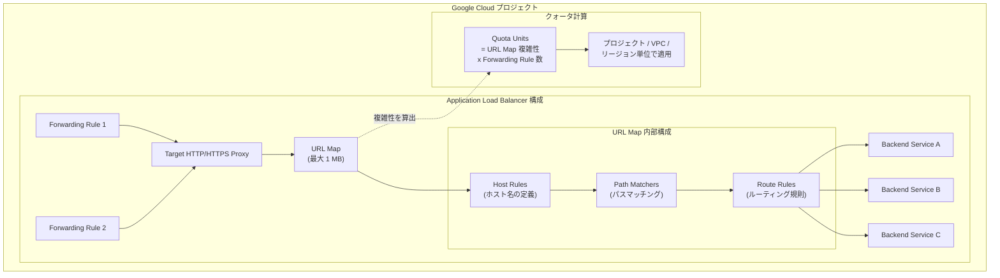

# Cloud Load Balancing: Application Load Balancer の新しい URL マップ構成サイズクォータシステム

**リリース日**: 2026-04-27

**サービス**: Cloud Load Balancing

**機能**: Application Load Balancer 構成サイズクォータ (URL マップサイズ上限の拡大)

**ステータス**: Preview

📊 [このアップデートのインフォグラフィックを見る](https://takech9203.github.io/google-cloud-news-summary/20260427-cloud-load-balancing-url-map-quota.html)

## 概要

Google Cloud は、Application Load Balancer の構成サイズを管理する新しいクォータシステムを Preview として公開しました。この新システムにより、個々の URL マップのデータサイズ上限が従来の 64 KB / 128 KB から最大 1 MB へと大幅に引き上げられます。

この変更の核心は、単純なデータサイズベースの制限から「複雑性ベースのクォータ (quota units)」への移行です。URL マップ内のルール数、ホスト名数、パスマッチャー数などの構成の複雑さに応じてクォータユニットが計算され、プロジェクト単位、VPC ネットワーク単位、またはリージョン単位で使用量が測定・適用されます。

このアップデートは、大規模なマイクロサービスアーキテクチャや複雑なルーティング要件を持つエンタープライズ環境のユーザーにとって特に重要です。従来の 64 KB という URL マップサイズ制限に直面していた組織が、より柔軟で大規模なルーティング構成を実現できるようになります。

**アップデート前の課題**

- External Application Load Balancer の URL マップサイズが最大 64 KB に制限されており、大規模な構成を収容できなかった
- Internal Application Load Balancer の URL マップサイズが最大 128 KB に制限されていた
- クォータがデータサイズのみに基づいていたため、構成の複雑さと実際のリソース消費量の関係が正確に反映されていなかった
- 大規模なマイクロサービス環境で多数のホストルールやパスマッチャーを定義する際に、サイズ制限に抵触して URL マップを分割する必要があった

**アップデート後の改善**

- Global external / Regional external Application Load Balancer の URL マップサイズ上限が 1 MB に拡大された
- Internal Application Load Balancer の URL マップサイズ上限も 1 MB に拡大された
- 複雑性ベースのクォータユニットにより、構成の実際のリソース消費がより正確に反映されるようになった
- `gcloud beta compute url-maps describe` コマンドでクォータユニット使用量を確認できるようになった

## アーキテクチャ図



この図は、Application Load Balancer の構成要素と新しいクォータユニット計算の関係を示しています。URL マップ内の Host Rules、Path Matchers、Route Rules の複雑さからクォータユニットが算出され、それに参照する Forwarding Rule の数を乗じた値がプロジェクトやリージョン単位のクォータとして適用されます。

## サービスアップデートの詳細

### 主要機能

1. **URL マップサイズ上限の拡大**
   - Global external / Regional external Application Load Balancer: 64 KB から 1 MB へ
   - Internal Application Load Balancer (Regional / Cross-region): 128 KB から 1 MB へ
   - Classic Application Load Balancer: 従来の 64 KB を維持 (変更なし)

2. **複雑性ベースのクォータユニット**
   - URL マップの構成の複雑さ (ルール数、ホスト名数、パスマッチャー数) に基づいてクォータユニットを算出
   - シンプルな構成は少ないクォータユニットを消費し、複雑な構成はより多くのユニットを消費
   - Forwarding Rule の数に比例してクォータ使用量がスケール (例: 1 つの Forwarding Rule で 50,000 ユニットの URL マップは、3 つの Forwarding Rule で 150,000 ユニット)

3. **スコープ別のクォータ測定**
   - Global external ALB / Classic ALB: プロジェクト単位 (`GLOBAL_EXTERNAL_PROXY_LB_CONFIG`)
   - Regional external ALB: VPC ネットワークのリージョン単位 (`REGIONAL_EXTERNAL_PROXY_LB_CONFIG_PER_REGION_PER_VPC_NETWORK`)
   - Cross-region internal ALB: VPC ネットワーク単位 (`CROSS_REGIONAL_INTERNAL_PROXY_LB_CONFIG_PER_REGION_PER_VPC_NETWORK`)
   - Regional internal ALB: VPC ネットワークのリージョン単位 (`REGIONAL_INTERNAL_PROXY_LB_CONFIG_PER_REGION_PER_VPC_NETWORK`)

## 技術仕様

### URL マップサイズ上限の比較

| ロードバランサータイプ | 旧サイズ上限 (クォータ未適用時) | 新サイズ上限 (クォータ適用時) |
|------|------|------|
| Global external Application LB | 64 KB | 1 MB |
| Regional external Application LB | 64 KB | 1 MB |
| Classic Application LB | 64 KB | 64 KB (変更なし) |
| Cross-region internal Application LB | 128 KB | 1 MB |
| Regional internal Application LB | 128 KB | 1 MB |

### クォータ計算式

クォータ使用量は以下の計算式で算出されます。

```
Quota usage = SUM(個々の URL Map のクォータユニット x 当該 URL Map を参照する Forwarding Rule 数)
```

クォータユニット数に影響する URL マップ内の要素は以下の通りです。

- Host Rules の数
- Path Matchers の数
- 各 Path Matcher 内の Route Rules / Path Rules の数
- Header matches、Query parameter matches の数

### クォータ使用量の確認方法

```bash
gcloud beta compute url-maps describe URL_MAP_NAME \
    [--region=REGION_NAME | --global] \
    --format="value(status)"
```

出力には `status.quotaUsage` オブジェクトが含まれ、URL マップの合計クォータユニット数と、使用している Forwarding Rule の数が表示されます。

## メリット

### ビジネス面

- **大規模構成への対応**: URL マップサイズ上限が最大 16 倍 (64 KB から 1 MB) に拡大されたことで、数百のマイクロサービスを 1 つのロードバランサーで管理可能
- **運用の簡素化**: URL マップを分割する必要が減少し、ロードバランサー構成の管理が容易に

### 技術面

- **正確なリソース消費の反映**: 複雑性ベースのクォータにより、実際のリソース消費に即した制限が適用される
- **スコープ別の柔軟な管理**: プロジェクト単位や VPC / リージョン単位でクォータが管理されるため、マルチテナント環境での制御が向上
- **可視性の向上**: `gcloud` コマンドでクォータユニット使用量を確認でき、キャパシティプランニングが容易に

## デメリット・制約事項

### 制限事項

- 本機能は Preview ステータスであり、「Pre-GA Offerings Terms」が適用される。サポートが限定的な場合がある
- Classic Application Load Balancer は従来の 64 KB 制限を維持しており、新クォータシステムの恩恵を受けるには Global external ALB への移行が必要
- URL マップがクォータに影響するのは、Forwarding Rule から Target Proxy を経由して参照される「完全な構成」の場合のみ

### 考慮すべき点

- Forwarding Rule の数に比例してクォータ消費が増加するため、同一 URL マップを多数の Forwarding Rule で共有する場合はクォータ上限に注意が必要
- Preview 段階のため、GA に向けて仕様変更の可能性がある
- 新クォータシステムが適用されていないプロジェクトでは従来のサイズ制限が引き続き適用される

## ユースケース

### ユースケース 1: 大規模マイクロサービスのルーティング統合

**シナリオ**: 数百のマイクロサービスを運用するエンタープライズ企業が、従来の 64 KB 制限により複数のロードバランサーに URL マップを分割して管理していた。

**効果**: 1 MB の URL マップサイズ上限により、1 つのロードバランサーで統合管理が可能になり、ルーティング構成の一貫性と運用効率が向上する。

### ユースケース 2: マルチテナント SaaS プラットフォーム

**シナリオ**: テナントごとに異なるホスト名とパスルーティングを持つ SaaS プラットフォームで、テナント数の増加に伴い URL マップサイズが制限に達していた。

**効果**: サイズ上限の拡大とスコープ別クォータにより、テナント数の増加に対応しつつ、VPC ネットワークやリージョン単位でクォータを管理できる。

## 関連サービス・機能

- **[URL Map](https://docs.cloud.google.com/load-balancing/docs/url-map-concepts)**: ロードバランサーのルーティング構成を定義するリソース。今回のクォータシステムの直接的な対象
- **[Backend Service](https://docs.cloud.google.com/load-balancing/docs/backend-service)**: URL マップからルーティングされるバックエンドサービス。URL マップ 1 つあたり最大 2,500 の Backend Service / Backend Bucket を参照可能
- **[Cloud Armor](https://docs.cloud.google.com/armor/docs)**: Application Load Balancer と連携するセキュリティサービス。URL マップの拡大に伴い、より大規模な構成でもセキュリティポリシーを適用可能
- **[Cloud Service Mesh](https://docs.cloud.google.com/service-mesh)**: サービスメッシュ環境でのトラフィック管理。独自の URL マップ制限 (524 KB) を持つ

## 参考リンク

- 📊 [インフォグラフィック](https://takech9203.github.io/google-cloud-news-summary/20260427-cloud-load-balancing-url-map-quota.html)
- [公式リリースノート](https://docs.cloud.google.com/release-notes#April_27_2026)
- [URL map size and quota units ドキュメント](https://docs.cloud.google.com/load-balancing/docs/url-map-size-quota)
- [Cloud Load Balancing クォータと上限](https://docs.cloud.google.com/load-balancing/docs/quotas)
- [Application Load Balancer の概要](https://docs.cloud.google.com/load-balancing/docs/application-load-balancer)

## まとめ

今回の Application Load Balancer 構成サイズクォータシステム (Preview) は、URL マップのサイズ上限を最大 1 MB に引き上げるとともに、複雑性ベースのクォータユニットによるより正確なリソース管理を実現する重要なアップデートです。大規模なルーティング構成を必要とするエンタープライズユーザーは、既存の URL マップのクォータユニット使用量を確認し、新クォータシステムへの移行を検討することを推奨します。Classic Application Load Balancer を使用している場合は、Global external Application Load Balancer への移行を計画することで、サイズ上限拡大のメリットを享受できます。

---

**タグ**: #CloudLoadBalancing #ApplicationLoadBalancer #URLMap #Quota #Preview #ネットワーキング
