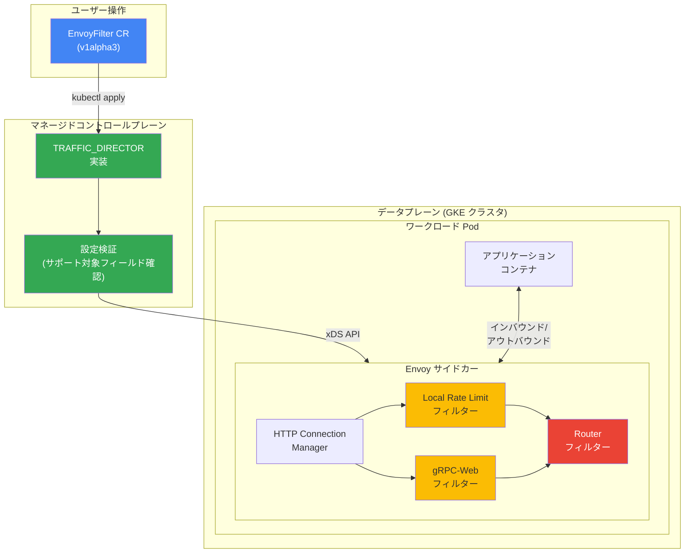

# Cloud Service Mesh: EnvoyFilter API の限定サポート開始 (TRAFFIC_DIRECTOR 実装、Regular チャネル)

**リリース日**: 2026-04-27

**サービス**: Cloud Service Mesh

**機能**: マネージド Cloud Service Mesh (TRAFFIC_DIRECTOR 実装) での EnvoyFilter API 限定サポート

**ステータス**: Regular チャネルで利用可能

[このアップデートのインフォグラフィックを見る](https://takech9203.github.io/google-cloud-news-summary/20260427-cloud-service-mesh-envoyfilter-support.html)

## 概要

Google Cloud は、TRAFFIC_DIRECTOR 実装を使用するマネージド Cloud Service Mesh の Regular チャネルにおいて、EnvoyFilter API の限定的なサポートを開始しました。EnvoyFilter API を使用することで、他の Istio API では実現できないデータプレーンの拡張が可能になり、HTTP フィルターチェーンへのフィルター追加などのカスタマイズが行えるようになります。

このアップデートにより、ローカルレートリミットや gRPC-Web サポートなど、Envoy プロキシの組み込み機能を活用したデータプレーンレベルの拡張性が提供されます。これまでマネージド Cloud Service Mesh ではサポートされていなかった EnvoyFilter API が、特定のフィールドとエクステンションに限定する形で利用可能になりました。

対象ユーザーは、Cloud Service Mesh をマネージドコントロールプレーン (TRAFFIC_DIRECTOR 実装) で運用しており、標準の Istio API では対応できない高度なトラフィック制御やプロキシカスタマイズを必要とするプラットフォームエンジニアやサービスメッシュ管理者です。

**アップデート前の課題**

これまでのマネージド Cloud Service Mesh (TRAFFIC_DIRECTOR 実装) では、EnvoyFilter API がサポート対象外として明記されていました。

- EnvoyFilter API が「Unsupported APIs」として制限されており、Envoy プロキシの設定を直接カスタマイズする手段がなかった
- ローカルレートリミットなどの Envoy 組み込みフィルターを利用するには、インクラスターコントロールプレーンへの移行やセルフマネージド構成の採用が必要だった
- データプレーンレベルでの高度なトラフィック制御が、マネージド環境では実現不可能だった

**アップデート後の改善**

今回のアップデートにより、マネージド Cloud Service Mesh を維持したまま、Envoy プロキシの高度なカスタマイズが可能になりました。

- EnvoyFilter API (v1alpha3) を使用して HTTP フィルターチェーンにカスタムフィルターを挿入できるようになった
- ローカルレートリミットや gRPC-Web フィルターなどのサポート対象エクステンションを、マネージド環境で利用可能になった
- Google がコントロールプレーンを管理するマネージド構成のメリット (自動アップグレード、スケーリング、セキュリティ) を享受しながら、データプレーンの拡張性を獲得できるようになった

## アーキテクチャ図



EnvoyFilter カスタムリソースを適用すると、TRAFFIC_DIRECTOR コントロールプレーンが設定を検証し、xDS API 経由で各ワークロードの Envoy サイドカーに伝播します。サポート対象のフィルター (Local Rate Limit、gRPC-Web など) が HTTP フィルターチェーンに挿入されます。

## サービスアップデートの詳細

### 主要機能

1. **EnvoyFilter API によるデータプレーン拡張**
   - EnvoyFilter API (v1alpha3) を使用して、Envoy プロキシが生成する設定をカスタマイズ可能
   - 他の Istio API (VirtualService、DestinationRule など) では実現できない高度な設定を追加可能
   - ユーザーが提供した設定を Envoy サイドカー付きワークロードに伝播するスコープでのサポート

2. **ローカルレートリミット**
   - `envoy.extensions.filters.http.local_ratelimit.v3.LocalRateLimit` エクステンションをサポート
   - トークンバケットアルゴリズムによるリクエスト制限が可能
   - ダウンストリーム接続単位でのレートリミット設定にも対応
   - レートリミットヘッダー (`X-RateLimit-*`) の付与設定が可能

3. **gRPC-Web サポート**
   - `envoy.extensions.filters.http.grpc_web.v3.GrpcWeb` エクステンションをサポート
   - gRPC-Web プロトコルのブリッジ機能を HTTP フィルターチェーンに追加可能

## 技術仕様

### サポート対象 API フィールド

| API フィールド | サポート状況 |
|------|------|
| `configPatches[].applyTo` | `HTTP_FILTER` のみサポート |
| `configPatches[].patch.operation` | `INSERT_FIRST` および `INSERT_BEFORE` (Router フィルター使用時) |
| `configPatches[].match.listener.filter.name` | `envoy.filters.network.http_connection_manager` のみ (`INSERT_BEFORE` 時) |
| `configPatches[].match.listener.filter.subFilter.name` | `envoy.filters.http.router` のみ (`INSERT_BEFORE` 時) |
| `targetRefs` | 非サポート |
| `configPatches[].patch.filterClass` | 非サポート |
| `configPatches[].match.proxy` | 非サポート |
| `configPatches[].match.routeConfiguration` | 非サポート |
| `configPatches[].match.cluster` | 非サポート |

### LocalRateLimit エクステンション サポート対象フィールド

| フィールド | Regular チャネル |
|------|------|
| `stat_prefix` | サポート |
| `status` | サポート |
| `token_bucket` | サポート |
| `filter_enabled` | サポート |
| `filter_enforced` | サポート |
| `response_headers_to_add` | サポート |
| `request_headers_to_add_when_not_enforced` | サポート |
| `local_rate_limit_per_downstream_connection` | サポート |
| `enable_x_ratelimit_headers` | サポート |

## 設定方法

### 前提条件

1. TRAFFIC_DIRECTOR 実装を使用するマネージド Cloud Service Mesh が GKE クラスタ上にプロビジョニングされていること
2. Regular リリースチャネルが選択されていること
3. プロジェクトで課金が有効になっていること

### 手順

#### ステップ 1: クラスタ認証情報の取得

```bash
gcloud container clusters get-credentials CLUSTER_NAME \
  --project=PROJECT_ID \
  --zone=CLUSTER_LOCATION
```

対象クラスタの kubectl コンテキストを設定します。リージョナルクラスタの場合は `--zone` の代わりに `--region` を使用してください。

#### ステップ 2: EnvoyFilter リソースの適用 (ローカルレートリミットの例)

```yaml
apiVersion: networking.istio.io/v1alpha3
kind: EnvoyFilter
metadata:
  name: frontend-local-ratelimit
  namespace: onlineboutique
spec:
  workloadSelector:
    labels:
      app: frontend
  configPatches:
  - applyTo: HTTP_FILTER
    match:
      context: SIDECAR_INBOUND
      listener:
        filterChain:
          filter:
            name: "envoy.filters.network.http_connection_manager"
            subFilter:
              name: "envoy.filters.http.router"
    patch:
      operation: INSERT_BEFORE
      value:
        name: envoy.filters.http.local_ratelimit
        typed_config:
          "@type": type.googleapis.com/udpa.type.v1.TypedStruct
          type_url: type.googleapis.com/envoy.extensions.filters.http.local_ratelimit.v3.LocalRateLimit
          value:
            stat_prefix: http_local_rate_limiter
            token_bucket:
              max_tokens: 5
              tokens_per_fill: 5
              fill_interval: 60s
            filter_enabled:
              runtime_key: local_rate_limit_enabled
              default_value:
                numerator: 100
                denominator: HUNDRED
            filter_enforced:
              runtime_key: local_rate_limit_enforced
              default_value:
                numerator: 100
                denominator: HUNDRED
```

上記の例では、`frontend` ラベルを持つワークロードに対して、60 秒あたり 5 リクエストのローカルレートリミットを設定しています。

#### ステップ 3: 設定の検証

```bash
# EnvoyFilter CR のステータスを確認
kubectl get envoyfilter -n onlineboutique frontend-local-ratelimit -o yaml
```

ステータスに `Accepted` と表示されれば、設定がコントロールプレーンに受け入れられています。

#### ステップ 4: Envoy 設定の伝播確認

```bash
# ワークロードの Envoy 設定ダンプで伝播を確認
gcloud beta container fleet mesh debug proxy-config POD_NAME.NAMESPACE \
  --type=listener \
  --membership=MEMBERSHIP_ID \
  --location=MEMBERSHIP_LOCATION \
  --project=PROJECT_ID \
  --output=yaml | grep envoy.filters.http.local_ratelimit -C 5
```

## メリット

### ビジネス面

- **マネージド環境の維持**: Google によるコントロールプレーンの自動管理 (アップグレード、スケーリング、セキュリティパッチ) を享受しながら、高度なトラフィック制御が可能
- **運用コストの削減**: インクラスターコントロールプレーンへの移行が不要となり、セルフマネージド構成の運用負荷を回避可能

### 技術面

- **柔軟なトラフィック制御**: Envoy の組み込みフィルターを活用したきめ細かいトラフィック管理が実現可能
- **段階的な導入**: `workloadSelector` を使用して特定のワークロードに対してのみフィルターを適用可能
- **モニタリング対応**: Envoy エクステンション固有の統計情報 (例: ローカルレートリミットフィルターの統計) を活用した運用監視が可能

## デメリット・制約事項

### 制限事項

- サポートされる `applyTo` は `HTTP_FILTER` のみであり、ネットワークフィルターやクラスタ設定の変更はできない
- サポートされる `operation` は `INSERT_FIRST` と `INSERT_BEFORE` (Router フィルター使用時) のみであり、既存フィルターの変更や削除はできない
- `targetRefs`、`filterClass`、`match.proxy`、`match.routeConfiguration`、`match.cluster` フィールドは非サポート
- サポート対象エクステンションは `LocalRateLimit` と `GrpcWeb` に限定されている
- Google のサポート範囲は、ユーザー提供の設定をワークロードに伝播することに限定され、エクステンション固有の API を使用した設定の正確性はサポート対象外

### 考慮すべき点

- EnvoyFilter API は Envoy の内部実装に依存しているため、不正な設定によりメッシュが不安定化するリスクがある
- 他の Istio API で要件を満たせる場合は、EnvoyFilter API よりもそちらを優先して使用すべき
- 今回のサポートは Regular チャネルが対象であり、他のチャネルでのサポート状況は公式ドキュメントを確認する必要がある

## ユースケース

### ユースケース 1: マイクロサービスのローカルレートリミット

**シナリオ**: ECサイトのマイクロサービスアーキテクチャにおいて、特定のバックエンドサービス (例: 決済サービス) に対するリクエスト数を制限し、過負荷を防止したい。

**実装例**:
```yaml
apiVersion: networking.istio.io/v1alpha3
kind: EnvoyFilter
metadata:
  name: payment-ratelimit
  namespace: ecommerce
spec:
  workloadSelector:
    labels:
      app: payment-service
  configPatches:
  - applyTo: HTTP_FILTER
    match:
      context: SIDECAR_INBOUND
      listener:
        filterChain:
          filter:
            name: "envoy.filters.network.http_connection_manager"
            subFilter:
              name: "envoy.filters.http.router"
    patch:
      operation: INSERT_BEFORE
      value:
        name: envoy.filters.http.local_ratelimit
        typed_config:
          "@type": type.googleapis.com/udpa.type.v1.TypedStruct
          type_url: type.googleapis.com/envoy.extensions.filters.http.local_ratelimit.v3.LocalRateLimit
          value:
            stat_prefix: payment_rate_limiter
            token_bucket:
              max_tokens: 100
              tokens_per_fill: 100
              fill_interval: 60s
            filter_enabled:
              runtime_key: local_rate_limit_enabled
              default_value:
                numerator: 100
                denominator: HUNDRED
            filter_enforced:
              runtime_key: local_rate_limit_enforced
              default_value:
                numerator: 100
                denominator: HUNDRED
```

**効果**: 決済サービスへのリクエストを 1 分あたり 100 リクエストに制限することで、突発的なトラフィック増加時でもサービスの安定性を維持できる。制限超過時は HTTP 429 レスポンスが返されるため、クライアント側でリトライロジックを実装可能。

### ユースケース 2: gRPC-Web 対応のフロントエンド連携

**シナリオ**: Web ブラウザから gRPC バックエンドサービスに直接通信するアプリケーションにおいて、gRPC-Web プロトコルのブリッジが必要な場合。

**効果**: gRPC-Web フィルターをサイドカーに追加することで、ブラウザからの gRPC-Web リクエストを標準 gRPC に変換し、バックエンドサービスとのシームレスな通信が可能になる。

## 料金

EnvoyFilter API の利用自体に追加料金は発生しません。Cloud Service Mesh の標準料金が適用されます。関連する課金対象コンポーネントは以下の通りです。

- **Cloud Service Mesh**: [料金ページ](https://docs.cloud.google.com/service-mesh/pricing) を参照
- **GKE**: クラスタおよびノードの料金が [GKE 料金ページ](https://docs.cloud.google.com/kubernetes-engine/pricing) に基づき適用

## 利用可能リージョン

TRAFFIC_DIRECTOR 実装を使用するマネージド Cloud Service Mesh がサポートする全リージョンで利用可能です。具体的なサポート対象リージョンは [Cloud Service Mesh サポート対象機能ページ](https://docs.cloud.google.com/service-mesh/docs/supported-features-managed#regions) を参照してください。

## 関連サービス・機能

- **Cloud Service Mesh (マネージドコントロールプレーン)**: EnvoyFilter の設定を受け付け、データプレーンに伝播する基盤サービス
- **GKE (Google Kubernetes Engine)**: EnvoyFilter が適用されるワークロードの実行環境
- **Envoy Proxy**: データプレーンとして動作し、EnvoyFilter の設定に基づいてトラフィック制御を実行するサイドカープロキシ
- **Cloud Armor**: サーバーサイドのグローバルレートリミットを提供する別のアプローチ。EnvoyFilter によるローカルレートリミットと組み合わせて使用可能

## 参考リンク

- [インフォグラフィック](https://takech9203.github.io/google-cloud-news-summary/20260427-cloud-service-mesh-envoyfilter-support.html)
- [公式リリースノート](https://docs.cloud.google.com/release-notes#April_27_2026)
- [Data plane extensibility with EnvoyFilter](https://docs.cloud.google.com/service-mesh/docs/data-plane-extensibility)
- [Resolving data plane extensibility issues](https://docs.cloud.google.com/service-mesh/docs/troubleshooting/troubleshoot-data-plane-extensibility)
- [Supported features using Istio APIs (managed control plane)](https://docs.cloud.google.com/service-mesh/docs/supported-features-managed)
- [Cloud Service Mesh 料金ページ](https://docs.cloud.google.com/service-mesh/pricing)

## まとめ

今回のアップデートにより、TRAFFIC_DIRECTOR 実装を使用するマネージド Cloud Service Mesh の Regular チャネルで EnvoyFilter API が限定的にサポートされ、ローカルレートリミットや gRPC-Web フィルターなどのデータプレーン拡張が可能になりました。これまでセルフマネージド構成でしか実現できなかった Envoy プロキシのカスタマイズが、Google マネージドのメリットを維持したまま利用できるようになります。EnvoyFilter API の利用を検討する際は、まず他の標準 Istio API で要件を満たせないか確認し、サポート対象のフィールドとエクステンションの制限を理解した上で導入してください。

---

**タグ**: #CloudServiceMesh #EnvoyFilter #DataPlaneExtensibility #TRAFFIC_DIRECTOR #RateLimiting #ServiceMesh #Envoy #GKE
