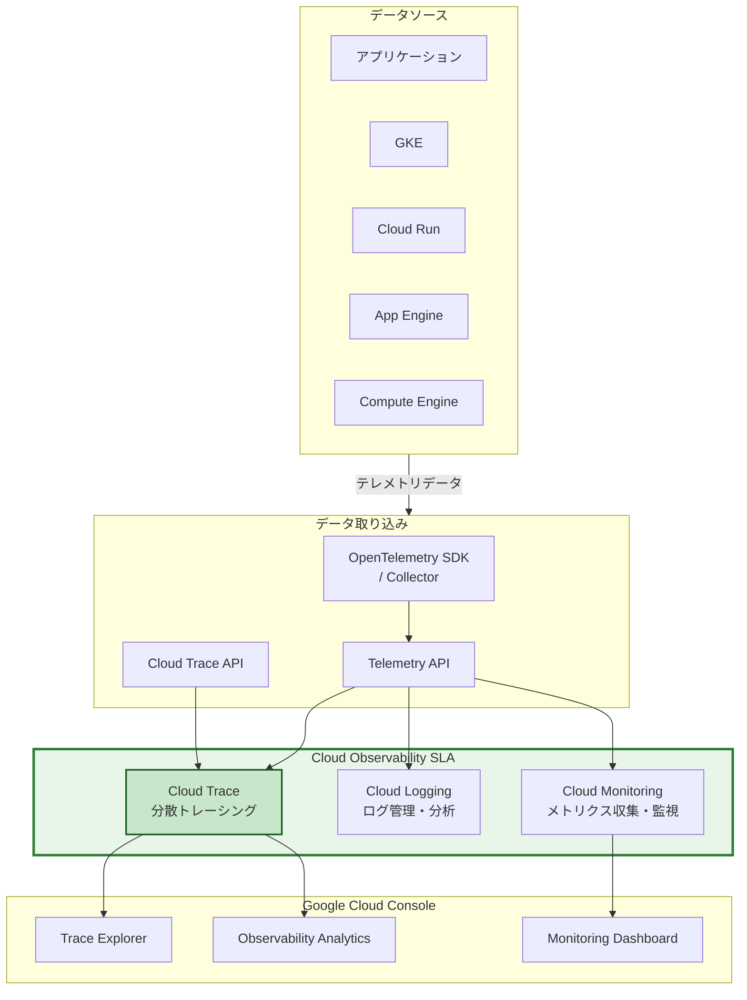

# Cloud Trace: Cloud Observability (Monitoring, Logging, Trace) SLA の適用対象に

**リリース日**: 2026-04-27

**サービス**: Cloud Trace

**機能**: Cloud Observability SLA 適用

**ステータス**: GA

[このアップデートのインフォグラフィックを見る](https://takech9203.github.io/google-cloud-news-summary/20260427-cloud-trace-sla-coverage.html)

## 概要

Cloud Trace が Cloud Observability (Monitoring, Logging, Trace) の Service Level Agreement (SLA) の適用対象サービスであることが公式に明記された。これにより、Cloud Trace の可用性が SLA によって保証され、SLA で定められた月間稼働率を下回った場合にはファイナンシャルクレジットの対象となる。

Cloud Trace は Google Cloud の分散トレーシングサービスであり、アプリケーションのリクエスト処理にかかるレイテンシデータを収集・表示する。マイクロサービスアーキテクチャにおけるリクエストフローの可視化やレイテンシのボトルネック特定に活用されている。今回、Cloud Monitoring や Cloud Logging と同様に、Cloud Observability SLA の適用対象として正式にカバーされることで、エンタープライズのお客様にとって Cloud Trace を本番環境で採用する際の信頼性保証が明確になった。

対象ユーザーは、分散トレーシングを本番ワークロードで運用している SRE チーム、プラットフォームチーム、およびコンプライアンス要件として SLA カバレッジを必要とするエンタープライズのお客様である。

**アップデート前の課題**

このアップデート以前は、以下の課題があった。

- Cloud Trace が Cloud Observability SLA の適用対象であることが明示的に記載されていなかったため、SLA カバレッジの有無を確認するのに手間がかかっていた
- エンタープライズのお客様が Cloud Trace の可用性保証について社内承認を得る際に、SLA ドキュメントでの明確な裏付けが不足していた
- Cloud Monitoring や Cloud Logging と比較して、Cloud Trace の SLA 適用状況が不明確であった

**アップデート後の改善**

今回のアップデートにより、以下が明確になった。

- Cloud Trace が Cloud Observability (Monitoring, Logging, Trace) SLA の適用対象サービスとして公式に明記された
- SLA で定められた月間稼働率を下回った場合、ファイナンシャルクレジットの申請が可能であることが保証された
- Cloud Monitoring、Cloud Logging と並んで Cloud Trace も統一的な SLA の下で運用されることが明確になり、Observability スイート全体の信頼性保証が一貫したものとなった

## アーキテクチャ図



Cloud Trace は Cloud Observability スイートの一部として、Cloud Monitoring および Cloud Logging と同一の SLA の下でサービスが提供される。アプリケーションからのトレースデータは OpenTelemetry SDK や Telemetry API を通じて取り込まれ、Trace Explorer や Observability Analytics で分析できる。

## サービスアップデートの詳細

### 主要機能

1. **Cloud Observability SLA の適用**
   - Cloud Trace は Cloud Observability (Monitoring, Logging, Trace) SLA の適用対象として公式にカバーされる
   - SLA の詳細は https://cloud.google.com/operations/sla で確認できる

2. **ファイナンシャルクレジット**
   - SLA で定められた月間稼働率を下回った場合、ファイナンシャルクレジットの対象となる
   - クレジットの申請方法と条件は SLA ドキュメントに記載されている

3. **Observability スイートとの統一的な SLA 管理**
   - Cloud Monitoring、Cloud Logging、Cloud Trace の 3 サービスが同一の SLA でカバーされる
   - オブザーバビリティ基盤全体の信頼性保証が統一的に管理される

## 技術仕様

### Cloud Trace の主要仕様

| 項目 | 詳細 |
|------|------|
| サービス名 | Cloud Trace |
| API エンドポイント | `cloudtrace.googleapis.com` |
| データ取り込み API | Cloud Trace API、Telemetry API |
| 推奨 API | Telemetry API (OpenTelemetry 互換) |
| VPC Service Controls | サポート対象 |
| 対応言語 (OpenTelemetry SDK) | Go、Java、Node.js、Python |

### Telemetry API のクォータ (2026 年 3 月時点)

| リージョン | トレース取り込み上限 |
|------|------|
| asia-east1, asia-northeast1, asia-southeast1, asia-south1 | 最大 2.4 GB/分 |
| europe-west1, europe-west2, europe-west3, europe-west4 | 最大 2.4 GB/分 |
| us-central1, us-east4, us-west1 | 最大 2.4 GB/分 |
| その他のリージョン | 最大 300 MB/分 |

### Cloud Trace API のクォータ

| カテゴリ | クォータ |
|------|------|
| 読み取りオペレーション | 300 / 60 秒 |
| 書き込みオペレーション | 4,800 / 60 秒 |
| 取り込みスパン数 (日次) | 3,000,000 - 5,000,000,000 / 日 |

## 設定方法

### 前提条件

1. Google Cloud プロジェクトが作成されていること
2. Cloud Trace API が有効化されていること
3. 適切な IAM 権限が付与されていること

### 手順

#### ステップ 1: Cloud Trace API の有効化

```bash
gcloud services enable cloudtrace.googleapis.com
```

Cloud Trace API を有効化する。2026 年 3 月 30 日以降に作成されたプロジェクトでは、Cloud Trace API を有効化すると Telemetry API も自動的に有効化される。

#### ステップ 2: OpenTelemetry SDK によるアプリケーションの計装

OpenTelemetry SDK を使用してアプリケーションを計装し、トレースデータを Cloud Trace に送信する。Google Cloud では Telemetry API 経由でのデータ送信を推奨している。

```python
# Python の例: OpenTelemetry SDK + OTLP エクスポーター
from opentelemetry import trace
from opentelemetry.sdk.trace import TracerProvider
from opentelemetry.sdk.trace.export import BatchSpanProcessor
from opentelemetry.exporter.otlp.proto.grpc.trace_exporter import OTLPSpanExporter

# TracerProvider の設定
provider = TracerProvider()

# OTLP エクスポーターの設定 (Telemetry API エンドポイント)
otlp_exporter = OTLPSpanExporter()
provider.add_span_processor(BatchSpanProcessor(otlp_exporter))

trace.set_tracer_provider(provider)
tracer = trace.get_tracer(__name__)
```

#### ステップ 3: SLA の確認

```bash
# SLA ドキュメントの確認
# https://cloud.google.com/operations/sla にアクセスして
# Cloud Observability (Monitoring, Logging, Trace) SLA の詳細を確認
```

SLA の条件、月間稼働率の定義、ファイナンシャルクレジットの申請方法を確認する。

## メリット

### ビジネス面

- **可用性保証の明確化**: Cloud Trace の SLA カバレッジにより、分散トレーシング基盤の可用性が公式に保証され、本番環境での採用判断が容易になる
- **コンプライアンス要件への対応**: SLA ドキュメントが提供されることで、社内の IT ガバナンスやコンプライアンス審査において SLA カバレッジの証跡として活用できる
- **ファイナンシャルクレジットによるリスク軽減**: SLA 未達時のファイナンシャルクレジットにより、サービス障害時の金銭的なリスクが軽減される

### 技術面

- **Observability スイート全体の統一的な SLA**: Cloud Monitoring、Cloud Logging、Cloud Trace が同一の SLA でカバーされることで、オブザーバビリティ基盤全体の信頼性を一貫して管理できる
- **運用監視の信頼性向上**: SLA による可用性保証があることで、Cloud Trace をインシデント対応やパフォーマンス分析の信頼できるデータソースとして位置付けられる

## デメリット・制約事項

### 制限事項

- SLA はサービスの可用性を保証するものであり、個別のスパンデータの完全性やレイテンシを保証するものではない
- ファイナンシャルクレジットの申請には所定の手続きが必要であり、自動的に適用されるものではない

### 考慮すべき点

- SLA の適用条件や除外事項の詳細は https://cloud.google.com/operations/sla で確認が必要
- Assured Workloads (データレジデンシーや IL4 要件) を使用している場合は、Cloud Trace API の使用に制限がある点に注意が必要

## ユースケース

### ユースケース 1: エンタープライズにおける Observability 基盤の構築

**シナリオ**: 大規模なマイクロサービスアーキテクチャを運用するエンタープライズ企業が、Cloud Monitoring、Cloud Logging、Cloud Trace を統合的に導入する際に、IT ガバナンスチームから SLA カバレッジの証跡を求められる。

**効果**: Cloud Observability SLA により、3 サービスすべてが統一的な SLA の下でカバーされていることを示すことができ、社内承認プロセスを円滑に進められる。

### ユースケース 2: SRE チームによる SLO 管理

**シナリオ**: SRE チームが Cloud Trace を使用してアプリケーションのレイテンシを監視し、サービスの SLO (Service Level Objectives) を管理している。Cloud Trace 自体の可用性に SLA が適用されていることで、監視基盤の信頼性を担保する。

**効果**: Cloud Trace の SLA カバレッジにより、トレースデータの収集・分析基盤が安定して稼働することが保証され、SLO 管理の正確性と信頼性が向上する。

## 料金

Cloud Trace の料金は Google Cloud Observability の料金体系に含まれる。SLA の適用自体に追加料金は発生しない。

トレーススパンの取り込みに対して課金が発生する。高トラフィックなシステムでは、サンプリングレートを調整することでコストを最適化できる (1,000 トランザクションに 1 回、または 10,000 トランザクションに 1 回のサンプリングが推奨されている)。

Cloud Run や Cloud Run functions での自動生成トレースについては、課金は発生しない。ただし、独自に追加したスパンについては Cloud Trace の料金が適用される。

詳細な料金については [Google Cloud Observability の料金ページ](https://cloud.google.com/products/observability/pricing) を参照のこと。

## 利用可能リージョン

Cloud Trace はグローバルサービスとして利用可能である。トレースデータの保存先として Observability バケットを使用する場合、以下を含む多数のリージョンが利用可能である (2026 年 3 月時点)。

主要リージョン: us-central1, us-east4, us-west1, europe-west1, europe-west4, asia-east1, asia-northeast1, asia-southeast1, asia-south1 など。

Observability バケットの対応ロケーションの完全なリストは、[Locations for observability buckets](https://docs.cloud.google.com/stackdriver/docs/observability/observability-bucket-locations) を参照のこと。

## 関連サービス・機能

- **Cloud Monitoring**: メトリクスの収集・監視サービス。Cloud Observability SLA の適用対象
- **Cloud Logging**: ログの管理・分析サービス。Cloud Observability SLA の適用対象
- **Error Reporting**: エラーの集約・表示サービス。Cloud Observability スイートの一部
- **Telemetry API**: OpenTelemetry 互換のデータ取り込み API。Cloud Trace へのトレースデータ送信に推奨
- **OpenTelemetry**: オープンソースのオブザーバビリティフレームワーク。Cloud Trace のデータ計装に推奨

## 参考リンク

- [インフォグラフィック](https://takech9203.github.io/google-cloud-news-summary/20260427-cloud-trace-sla-coverage.html)
- [公式リリースノート](https://docs.cloud.google.com/release-notes#April_27_2026)
- [Cloud Observability SLA](https://cloud.google.com/operations/sla)
- [Cloud Trace ドキュメント](https://docs.cloud.google.com/trace/docs/overview)
- [Cloud Trace 料金ページ](https://cloud.google.com/products/observability/pricing)
- [Cloud Trace クォータと上限](https://docs.cloud.google.com/trace/docs/quotas)
- [Observability Analytics](https://docs.cloud.google.com/trace/docs/analytics)

## まとめ

Cloud Trace が Cloud Observability (Monitoring, Logging, Trace) SLA の適用対象として公式に明記されたことにより、分散トレーシング基盤の可用性が SLA によって保証されるようになった。エンタープライズのお客様にとっては、SLA カバレッジの明確化により社内承認やコンプライアンス対応が容易になる。Cloud Trace を本番環境で運用している、または導入を検討しているチームは、SLA ドキュメント (https://cloud.google.com/operations/sla) を確認し、可用性保証の条件を把握しておくことを推奨する。

---

**タグ**: #CloudTrace #CloudObservability #SLA #分散トレーシング #オブザーバビリティ #可用性 #OpenTelemetry #GoogleCloud
