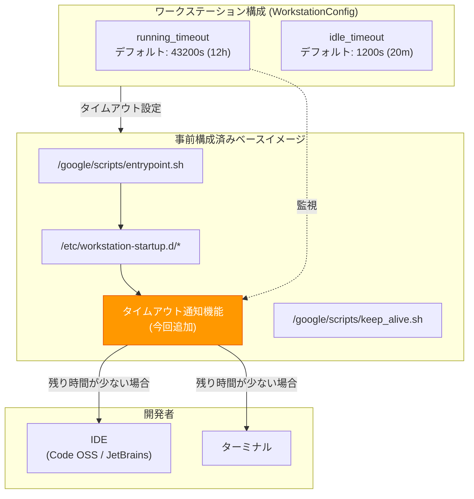

# Cloud Workstations: ベースイメージに running_timeout 到達前の通知機能を追加

**リリース日**: 2026-04-27

**サービス**: Cloud Workstations

**機能**: running_timeout 到達前の通知

**ステータス**: GA

[このアップデートのインフォグラフィックを見る](https://takech9203.github.io/google-cloud-news-summary/20260427-cloud-workstations-timeout-notification.html)

## 概要

Cloud Workstations の事前構成済みベースイメージに、ワークステーションの `running_timeout` に近づいた際にユーザーへ通知する機能が追加された。これにより、開発者はワークステーションが自動シャットダウンされる前に、作業内容の保存やタイムアウト設定の見直しといった適切な対応を取ることが可能になる。

Cloud Workstations では、ワークステーション構成 (WorkstationConfig) に `running_timeout` を設定することで、一定時間後にワークステーションを自動停止できる。デフォルト値は 43,200 秒 (12 時間) であり、コスト最適化とセキュリティアップデート適用のために日次でのシャットダウンが推奨されている。しかし、これまではタイムアウト到達の事前通知がなく、開発者が作業中に突然ワークステーションが停止するリスクがあった。

対象ユーザーは、Cloud Workstations のベースイメージを使用してクラウド開発環境を運用しているすべての開発者、およびワークステーション構成を管理するプラットフォームチームや管理者である。

**アップデート前の課題**

このアップデート以前は、以下の課題があった。

- `running_timeout` に到達した際にワークステーションが予告なく自動シャットダウンされ、未保存の作業が失われるリスクがあった
- 開発者がワークステーションの残り稼働時間を把握する手段がなく、長時間の作業中に突然セッションが切断される可能性があった
- タイムアウト管理のために独自のタイマーやスクリプトを用意する必要があり、運用コストが発生していた

**アップデート後の改善**

今回のアップデートにより、以下が改善された。

- ベースイメージに通知機能が組み込まれたため、`running_timeout` に近づくとユーザーに事前通知が表示されるようになった
- 開発者はシャットダウン前に作業内容を保存したり、必要に応じてワークステーションを再起動する時間的余裕を得られるようになった
- 追加の設定やカスタムスクリプトの導入が不要で、ベースイメージを使用しているすべてのワークステーションで自動的に通知が有効になる

## アーキテクチャ図



ワークステーション構成で設定された `running_timeout` の値をベースイメージ内の通知機能が監視し、タイムアウト到達が近づくと IDE やターミナルを通じて開発者に通知する。

## サービスアップデートの詳細

### 主要機能

1. **running_timeout 到達前の通知**
   - ベースイメージに組み込まれた通知機能により、ワークステーションの `running_timeout` に近づくとユーザーに警告が表示される
   - 事前構成済みベースイメージ (Code OSS、JetBrains IDE、Base イメージなど) すべてに含まれる

2. **自動有効化**
   - 通知機能はベースイメージの更新に含まれるため、追加設定なしで自動的に利用可能になる
   - 既存のワークステーションもベースイメージを更新することで通知機能を利用できる

3. **既存のタイムアウト管理との連携**
   - `running_timeout` (最大稼働時間) と `idle_timeout` (アイドルタイムアウト) は独立して動作する
   - 既存の `/google/scripts/keep_alive.sh` スクリプトはアイドルタイムアウトの防止に使用されるが、`running_timeout` による停止は防止しない

## 技術仕様

### running_timeout の設定値

| 項目 | 詳細 |
|------|------|
| デフォルト値 | `"43200s"` (12 時間) |
| 最小値 | `"0s"` (タイムアウトなし、非推奨) |
| 最大値 (暗号化キー使用時) | `"86400s"` (24 時間) 未満 |
| 推奨設定 | 日次でのシャットダウンを推奨 |
| 形式 | 秒単位の Duration (`"54000s"` = 15 時間) |

### 事前構成済みベースイメージ一覧

| イメージ | 説明 |
|---------|------|
| `code-oss:latest` | Code OSS for Cloud Workstations (デフォルト) |
| `base:latest` | IDE なしのベースイメージ |
| `clion:latest` | CLion IDE (JetBrains Gateway 経由) |
| `goland:latest` | GoLand IDE (JetBrains Gateway 経由) |
| `intellij-ultimate:latest` | IntelliJ IDEA Ultimate (JetBrains Gateway 経由) |
| `phpstorm:latest` | PhpStorm IDE (JetBrains Gateway 経由) |
| `pycharm:latest` | PyCharm Professional (JetBrains Gateway 経由) |
| `rider:latest` | Rider IDE (JetBrains Gateway 経由) |
| `rubymine:latest` | RubyMine IDE (JetBrains Gateway 経由) |
| `webstorm:latest` | WebStorm IDE (JetBrains Gateway 経由) |

イメージのレジストリは `us-central1-docker.pkg.dev/cloud-workstations-images/predefined/` に格納されている。

## 設定方法

### 前提条件

1. Cloud Workstations API が有効化されていること
2. ワークステーションクラスタとワークステーション構成が作成済みであること

### 手順

#### ステップ 1: running_timeout を確認・設定する

```bash
# 既存のワークステーション構成の詳細を確認
gcloud workstations configs describe CONFIG_NAME \
  --cluster=CLUSTER_NAME \
  --region=REGION

# 新しいワークステーション構成を作成 (running_timeout を 15 時間に設定)
gcloud workstations configs create CONFIG_NAME \
  --cluster=CLUSTER_NAME \
  --region=REGION \
  --running-timeout=54000
```

`running_timeout` のデフォルト値は 43,200 秒 (12 時間) である。業務時間に合わせて適切な値を設定することを推奨する。

#### ステップ 2: ベースイメージが最新であることを確認する

```bash
# ワークステーション構成でベースイメージを指定して作成
gcloud workstations configs create CONFIG_NAME \
  --cluster=CLUSTER_NAME \
  --region=REGION \
  --container-predefined-image=codeoss \
  --running-timeout=54000
```

事前構成済みベースイメージを使用している場合、ワークステーション再起動時に最新のイメージが自動的に適用される。通知機能はベースイメージに含まれているため、追加の設定は不要である。

## メリット

### ビジネス面

- **作業データ損失の防止**: 自動シャットダウン前に通知が行われるため、未保存の作業が失われるリスクが大幅に軽減される
- **開発者の生産性向上**: 予期しないセッション切断による作業の中断と再開のコストが削減される

### 技術面

- **ゼロ設定での利用**: ベースイメージに組み込まれているため、追加の設定やカスタムスクリプトの開発が不要
- **全ベースイメージへの対応**: Code OSS、JetBrains IDE、Base イメージなど、Google Cloud が提供するすべての事前構成済みベースイメージで利用可能

## デメリット・制約事項

### 制限事項

- カスタムコンテナイメージを使用している場合、通知機能は自動的には含まれない。ベースイメージを拡張してカスタムイメージを作成している場合にのみ通知機能が利用可能
- `running_timeout` を `"0s"` に設定している場合 (タイムアウトなし)、通知は発生しない

### 考慮すべき点

- 通知機能はベースイメージの更新に含まれるため、既存のワークステーションでは次回起動時にイメージが更新されるまで通知機能は利用できない
- `running_timeout` による停止は `/google/scripts/keep_alive.sh` では防止できない点に注意。`keep_alive.sh` は `idle_timeout` にのみ影響する

## ユースケース

### ユースケース 1: 長時間のコーディングセッション

**シナリオ**: 開発者が朝からワークステーションを起動し、終日にわたってコーディング作業を行っている。`running_timeout` が 12 時間に設定されている場合、夕方頃にタイムアウトが到達する。

**効果**: タイムアウト到達前に通知が表示されるため、開発者は変更をコミットし、作業状態を保存してから、必要に応じてワークステーションを再起動できる。

### ユースケース 2: 長時間のビルド・テスト実行中

**シナリオ**: 開発者が大規模なビルドやテストスイートを実行中に `running_timeout` に近づく。ビルドプロセスは未完了の状態である。

**効果**: 事前通知により、開発者はビルドの完了を待つか、タイムアウトを延長した構成への変更を管理者に依頼するなど、適切な判断を下す時間を得られる。

## 関連サービス・機能

- **Cloud Workstations ベースイメージ**: タイムアウト通知機能を含む事前構成済みのコンテナイメージ群
- **Cloud Workstations 構成 (WorkstationConfig)**: `running_timeout`、`idle_timeout` などのタイムアウト設定を管理するリソース
- **Compute Engine**: ワークステーションの実行基盤となる仮想マシンインスタンスを提供
- **Artifact Registry**: ベースイメージおよびカスタムコンテナイメージの格納先

## 参考リンク

- [このアップデートのインフォグラフィック](https://takech9203.github.io/google-cloud-news-summary/20260427-cloud-workstations-timeout-notification.html)
- [公式リリースノート](https://docs.cloud.google.com/release-notes#April_27_2026)
- [事前構成済みベースイメージ](https://cloud.google.com/workstations/docs/preconfigured-base-images)
- [開発環境のカスタマイズ](https://cloud.google.com/workstations/docs/customize-development-environment)
- [カスタムコンテナイメージ](https://cloud.google.com/workstations/docs/customize-container-images)
- [Cloud Workstations アーキテクチャ](https://cloud.google.com/workstations/docs/architecture)

## まとめ

Cloud Workstations のベースイメージに `running_timeout` 到達前の通知機能が追加されたことで、開発者は予期しないワークステーションの自動シャットダウンによるデータ損失リスクを回避できるようになった。この機能はベースイメージに組み込まれており追加設定は不要であるため、事前構成済みベースイメージを利用しているすべてのユーザーは、ワークステーションの再起動により自動的に恩恵を受けることができる。`running_timeout` の設定値を改めて確認し、チームの業務時間に適した値に調整することを推奨する。

---

**タグ**: #CloudWorkstations #BaseImage #RunningTimeout #通知 #開発環境 #タイムアウト管理
