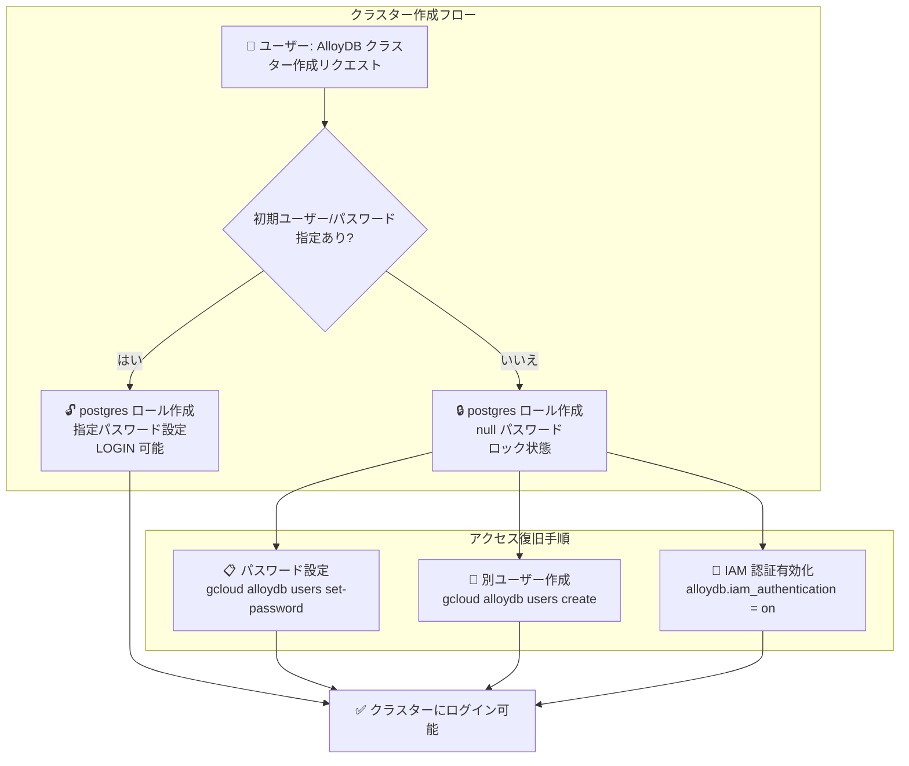

# AlloyDB for PostgreSQL: クラスター作成時のロックされた postgres ロール動作変更

**リリース日**: 2026-04-28

**サービス**: AlloyDB for PostgreSQL

**機能**: クラスター作成時に初期ユーザーまたはパスワードが未指定の場合、null パスワードを持つロックされた postgres ロールが作成される

**ステータス**: Change (動作変更)

📊 [このアップデートのインフォグラフィックを見る](https://takech9203.github.io/google-cloud-news-summary/20260428-alloydb-locked-postgres-role.html)

## 概要

AlloyDB for PostgreSQL において、クラスター作成時に初期ユーザーまたはパスワードが指定されなかった場合の動作が変更された。従来の動作から、null パスワードを持つロックされた postgres ロールが自動的に作成されるようになった。

この変更はセキュリティ強化を目的としたもので、クラスター作成時にユーザーがパスワードを設定し忘れた場合に、意図しないアクセスが発生するリスクを排除する。postgres ロールは AlloyDB における最上位の管理ユーザーロール (alloydbsuperuser グループのメンバー) であり、CREATEROLE、CREATEDB、LOGIN の権限を持つため、このロールが保護されていないことは重大なセキュリティリスクとなりうる。

このアップデートは、Infrastructure as Code やオートメーションを使用してクラスターをプロビジョニングする場合に特に重要であり、パスワード設定の省略が意図的であっても偶発的であっても、安全なデフォルト動作が保証される。

**アップデート前の課題**

- クラスター作成時にパスワードを設定しなかった場合、postgres ロールの状態が不明確だった
- パスワード未設定のまま postgres ロールでログインできる可能性があり、セキュリティリスクが存在した
- 自動化スクリプトでパスワード設定が漏れた場合のフェイルセーフが不十分だった

**アップデート後の改善**

- パスワード未指定時は null パスワードのロックされた postgres ロールが作成され、ログイン不可の安全な状態がデフォルトとなった
- セキュリティのベストプラクティスである「デフォルトで拒否 (deny by default)」の原則に沿った動作に変更された
- クラスターへのアクセスには、明示的にパスワードを設定するか、別のユーザーを作成する必要があることが明確になった

## アーキテクチャ図



クラスター作成時のパスワード指定有無による postgres ロールの状態分岐と、ロック状態からの復旧方法を示す。

## サービスアップデートの詳細

### 主要機能

1. **ロックされた postgres ロールの自動作成**
   - クラスター作成 API で初期ユーザーまたはパスワードが未指定の場合に適用
   - postgres ロールは null パスワード状態で作成される
   - ロック状態のためパスワード認証によるログインが不可能

2. **alloydbsuperuser 権限の保持**
   - ロックされた状態であっても、postgres ロール自体は alloydbsuperuser グループのメンバーとして作成される
   - CREATEROLE、CREATEDB、LOGIN の権限属性は保持される
   - パスワード設定後は通常通りすべての管理操作が可能

3. **明示的なアクセス復旧パス**
   - `gcloud alloydb users set-password` コマンドでパスワードを後から設定可能
   - `gcloud alloydb users create` で別の管理ユーザーを作成してアクセス可能
   - IAM 認証を有効化して IAM ベースのユーザーでアクセスする方法も利用可能

## 技術仕様

### postgres ロールの状態比較

| 項目 | パスワード指定あり | パスワード未指定 (新動作) |
|------|-------------------|--------------------------|
| ロール名 | postgres | postgres |
| グループ | alloydbsuperuser | alloydbsuperuser |
| 権限属性 | CREATEROLE, CREATEDB, LOGIN | CREATEROLE, CREATEDB, LOGIN |
| パスワード | ユーザー指定値 | null |
| ログイン | 可能 | 不可 (ロック状態) |

### アクセス復旧方法

```bash
# 方法 1: postgres ユーザーにパスワードを設定
gcloud alloydb users set-password postgres \
  --password=NEW_PASSWORD \
  --cluster=CLUSTER_ID \
  --region=REGION_ID

# 方法 2: 新しい管理ユーザーを作成
gcloud alloydb users create NEW_USERNAME \
  --password=PASSWORD \
  --cluster=CLUSTER_ID \
  --region=REGION_ID \
  --db-roles=alloydbsuperuser

# 方法 3: IAM 認証を有効化して IAM ユーザーを追加
gcloud alloydb users create user@example.com \
  --cluster=CLUSTER_ID \
  --region=REGION_ID \
  --type=IAM_BASED
```

## メリット

### セキュリティ面

- **デフォルトで安全な状態**: パスワード未設定時にロックされたロールが作成されることで、意図しないアクセスを防止
- **攻撃対象面の削減**: null パスワードのロック状態により、ブルートフォース攻撃やデフォルトクレデンシャル攻撃が無効化される
- **コンプライアンス対応**: CIS ベンチマークやセキュリティ監査基準における「デフォルトアカウントの保護」要件に適合

### 運用面

- **ヒューマンエラーの防止**: IaC パイプラインでのパスワード設定忘れによるセキュリティインシデントを防止
- **明示的な意思決定の強制**: クラスターへのアクセスに必ず意図的なユーザー/パスワード設定が必要となる

## デメリット・制約事項

### 考慮すべき点

- 既存のクラスター作成スクリプトやIaCテンプレートで、パスワードを後から設定する前提のワークフローが影響を受ける可能性がある
- Terraform や gcloud CLI を使用した自動化で、クラスター作成後すぐにデータベース操作を行うパイプラインは、明示的なパスワード指定を追加する必要がある
- クラスター作成後にパスワード設定を行わない限り、psql 等のクライアントからパスワード認証で接続できない

## ユースケース

### ユースケース 1: IaC パイプラインでのセキュアなクラスタープロビジョニング

**シナリオ**: Terraform で AlloyDB クラスターを作成する際に、シークレットマネージャーからパスワードを取得する処理が設定されているが、シークレットの設定忘れにより空値が渡されるケース

**効果**: 従来はパスワードなしでアクセス可能なクラスターが作成される恐れがあったが、今回の変更によりロック状態で作成されるため、セキュリティインシデントの発生が防止される

### ユースケース 2: IAM 認証のみを使用する環境

**シナリオ**: IAM データベース認証のみを使用し、パスワードベースの認証を一切使用しないセキュリティポリシーの環境

**効果**: postgres ロールをロック状態のまま維持し、IAM 認証ユーザーのみでデータベースを管理するワークフローが自然に成立する

## 関連サービス・機能

- **AlloyDB IAM 認証**: IAM ベースのデータベース認証により、パスワード管理を IAM に委任可能
- **Secret Manager**: クラスター作成時のパスワードをセキュアに管理するために推奨
- **Cloud Audit Logs**: postgres ロールへのパスワード設定やロール変更操作を監査可能
- **AlloyDB Auth Proxy**: IAM 認証使用時の接続プロキシとして機能

## 参考リンク

- 📊 [インフォグラフィック](https://takech9203.github.io/google-cloud-news-summary/20260428-alloydb-locked-postgres-role.html)
- [公式リリースノート](https://docs.cloud.google.com/release-notes#April_28_2026)
- [AlloyDB postgres ユーザードキュメント](https://docs.cloud.google.com/alloydb/docs/database-users/overview#postgres-user)
- [AlloyDB データベースユーザー管理](https://docs.cloud.google.com/alloydb/docs/database-users/manage-roles)
- [AlloyDB IAM 認証](https://docs.cloud.google.com/alloydb/docs/database-users/manage-iam-auth)

## まとめ

今回の変更は AlloyDB for PostgreSQL のセキュリティデフォルトを強化する重要なアップデートである。既存のクラスター作成ワークフローでパスワードを明示的に指定していない場合は、デプロイメントパイプラインの見直しを推奨する。特に Terraform や gcloud CLI を使用した自動化において、`--password` パラメータの明示的な設定、または IAM 認証への移行を検討すべきである。

---

**タグ**: #AlloyDB #PostgreSQL #Security #IAM #DatabaseManagement #ClusterCreation #DefaultSecurity
